# Lexicon Data Structures and Storage

<cite>
**Referenced Files in This Document**
- [.amalfa/lexicon-candidates.jsonl](file://.amalfa/lexicon-candidates.jsonl)
- [.amalfa/golden-lexicon.jsonl](file://.amalfa/golden-lexicon.jsonl)
- [.amalfa/golden-lexicon-enriched.jsonl](file://.amalfa/golden-lexicon-enriched.jsonl)
- [public/data/lexicon.jsonl](file://public/data/lexicon.jsonl)
- [src/pipeline/lexicon/README.md](file://src/pipeline/lexicon/README.md)
- [src/pipeline/lexicon/01-harvest.ts](file://src/pipeline/lexicon/01-harvest.ts)
- [src/pipeline/lexicon/02-refine.ts](file://src/pipeline/lexicon/02-refine.ts)
- [src/pipeline/lexicon/03-enrich.ts](file://src/pipeline/lexicon/03-enrich.ts)
- [src/pipeline/lexicon/04-embed.ts](file://src/pipeline/lexicon/04-embed.ts)
- [src/pipeline/lexicon/05-survey-edges.ts](file://src/pipeline/lexicon/05-survey-edges.ts)
- [src/pipeline/lexicon/06-ingest.ts](file://src/pipeline/lexicon/06-ingest.ts)
- [src/pipeline/lexicon/07-classify-relevance.ts](file://src/pipeline/lexicon/07-classify-relevance.ts)
- [src/core/LexiconHarvester.ts](file://src/core/LexiconHarvester.ts)
- [src/core/Harvester.ts](file://src/core/Harvester.ts)
- [src/core/HarvesterCache.ts](file://src/core/HarvesterCache.ts)
- [src/core/EdgeWeaver.ts](file://src/core/EdgeWeaver.ts)
- [src/core/GraphGardener.ts](file://src/core/GraphGardener.ts)
- [src/core/SidecarSquasher.ts](file://src/core/SidecarSquasher.ts)
- [src/resonance/DatabaseFactory.ts](file://src/resonance/DatabaseFactory.ts)
- [src/resonance/db.ts](file://src/resonance/db.ts)
- [src/resonance/types/enriched-cda.ts](file://src/resonance/types/enriched-cda.ts)
- [src/utils/JsonlUtils.ts](file://src/utils/JsonlUtils.ts)
- [src/utils/Logger.ts](file://src/utils/Logger.ts)
- [src/utils/StatsTracker.ts](file://src/utils/StatsTracker.ts)
- [src/utils/Scratchpad.ts](file://src/utils/Scratchpad.ts)
- [src/utils/Historian.ts](file://src/utils/Historian.ts)
- [src/utils/TagInjector.ts](file://src/utils/TagInjector.ts)
- [src/utils/ToolRegistry.ts](file://src/utils/ToolRegistry.ts)
- [src/pipeline/PreFlightAnalyzer.ts](file://src/pipeline/PreFlightAnalyzer.ts)
- [src/resonance/services/embedder.ts](file://src/resonance/services/embedder.ts)
- [src/resonance/services/vector-daemon.ts](file://src/resonance/services/vector-daemon.ts)
- [src/resonance/services/stats.ts](file://src/resonance/services/stats.ts)
- [src/resonance/services/simpleTokenizer.ts](file://src/resonance/services/simpleTokenizer.ts)
- [src/resonance/drizzle/schema.ts](file://src/resonance/drizzle/schema.ts)
- [src/types/artifact.ts](file://src/types/artifact.ts)
- [src/types/reranking.ts](file://src/types/reranking.ts)
- [src/cli/commands/stats.ts](file://src/cli/commands/stats.ts)
- [src/cli/commands/search.ts](file://src/cli/commands/search.ts)
- [src/cli/commands/read.ts](file://src/cli/commands/read.ts)
- [src/cli/commands/squash.ts](file://src/cli/commands/squash.ts)
- [src/cli/commands/validate.ts](file://src/cli/commands/validate.ts)
- [src/cli/commands/init.ts](file://src/cli/commands/init.ts)
- [src/cli/commands/doctor.ts](file://src/cli/commands/doctor.ts)
- [src/cli/commands/explore.ts](file://src/cli/commands/explore.ts)
- [src/cli/commands/enhance.ts](file://src/cli/commands/enhance.ts)
- [src/cli/commands/find-gaps.ts](file://src/cli/commands/find-gaps.ts)
- [src/cli/commands/inject-tags.ts](file://src/cli/commands/inject-tags.ts)
- [src/cli/commands/setup.ts](file://src/cli/commands/setup.ts)
- [src/cli/commands/setup-python.ts](file://src/cli/commands/setup-python.ts)
- [src/cli/sonar-chat.ts](file://src/cli/sonar-chat.ts)
- [src/cli/utils.ts](file://src/cli/utils.ts)
- [src/cli/list-scripts.ts](file://src/cli/list-scripts.ts)
- [src/daemon/sonar-agent.ts](file://src/daemon/sonar-agent.ts)
- [src/daemon/sonar-logic.ts](file://src/daemon/sonar-logic.ts)
- [src/daemon/sonar-inference.ts](file://src/daemon/sonar-inference.ts)
- [src/daemon/sonar-server.ts](file://src/daemon/sonar-server.ts)
- [src/daemon/sonar-strategies.ts](file://src/daemon/sonar-strategies.ts)
- [src/daemon/sonar-types.ts](file://src/daemon/sonar-types.ts)
- [src/ember/index.ts](file://src/ember/index.ts)
- [src/ember/analyzer.ts](file://src/ember/analyzer.ts)
- [src/ember/types.ts](file://src/ember/types.ts)
- [src/tools/EmberExtractTool.ts](file://src/tools/EmberExtractTool.ts)
- [src/utils/ServiceLifecycle.ts](file://src/utils/ServiceLifecycle.ts)
- [src/utils/sonar-client.ts](file://src/utils/sonar-client.ts)
- [src/utils/ollama-discovery.ts](file://src/utils/ollama-discovery.ts)
- [src/utils/reranker-client.ts](file://src/utils/reranker-client.ts)
- [src/utils/validator.ts](file://src/utils/validator.ts)
- [src/utils/ContentHydrator.ts](file://src/utils/ContentHydrator.ts)
- [src/utils/projectRoot.ts](file://src/utils/projectRoot.ts)
- [src/utils/DaemonManager.ts](file://src/utils/DaemonManager.ts)
- [src/utils/Notifications.ts](file://src/utils/Notifications.ts)
- [src/utils/StatsLogger.ts](file://src/utils/StatsLogger.ts)
- [src/utils/Scratchpad.ts](file://src/utils/Scratchpad.ts)
- [src/utils/Historian.ts](file://src/utils/Historian.ts)
- [src/utils/TagInjector.ts](file://src/utils/TagInjector.ts)
- [src/utils/ToolRegistry.ts](file://src/utils/ToolRegistry.ts)
- [src/utils/validator.ts](file://src/utils/validator.ts)
- [src/utils/ContentHydrator.ts](file://src/utils/ContentHydrator.ts)
- [src/utils/projectRoot.ts](file://src/utils/projectRoot.ts)
- [src/utils/DaemonManager.ts](file://src/utils/DaemonManager.ts)
- [src/utils/Notifications.ts](file://src/utils/Notifications.ts)
- [src/utils/StatsLogger.ts](file://src/utils/StatsLogger.ts)
- [src/utils/Scratchpad.ts](file://src/utils/Scratchpad.ts)
- [src/utils/Historian.ts](file://src/utils/Historian.ts)
- [src/utils/TagInjector.ts](file://src/utils/TagInjector.ts)
- [src/utils/ToolRegistry.ts](file://src/utils/ToolRegistry.ts)
- [src/utils/validator.ts](file://src/utils/validator.ts)
- [src/utils/ContentHydrator.ts](file://src/utils/ContentHydrator.ts)
- [src/utils/projectRoot.ts](file://src/utils/projectRoot.ts)
- [src/utils/DaemonManager.ts](file://src/utils/DaemonManager.ts)
- [src/utils/Notifications.ts](file://src/utils/Notifications.ts)
- [src/utils/StatsLogger.ts](file://src/utils/StatsLogger.ts)
- [src/utils/Scratchpad.ts](file://src/utils/Scratchpad.ts)
- [src/utils/Historian.ts](file://src/utils/Historian.ts)
- [src/utils/TagInjector.ts](file://src/utils/TagInjector.ts)
- [src/utils/ToolRegistry.ts](file://src/utils/ToolRegistry.ts)
- [src/utils/validator.ts](file://src/utils/validator.ts)
- [src/utils/ContentHydrator.ts](file://src/utils/ContentHydrator.ts)
- [src/utils/projectRoot.ts](file://src/utils/projectRoot.ts)
- [src/utils/DaemonManager.ts](file://src/utils/DaemonManager.ts)
- [src/utils/Notifications.ts](file://src/utils/Notifications.ts)
- [src/utils/StatsLogger.ts](file://src/utils/StatsLogger.ts)
- [src/utils/Scratchpad.ts](file://src/utils/Scratchpad.ts)
- [src/utils/Historian.ts](file://src/utils/Historian.ts)
- [src/utils/TagInjector.ts](file://src/utils/TagInjector.ts)
- [src/utils/ToolRegistry.ts](file://src/utils/ToolRegistry.ts)
- [src/utils/validator.ts](file://src/utils/validator.ts)
- [src/utils/ContentHydrator.ts](file://src/utils/ContentHydrator.ts)
- [src/utils/projectRoot.ts](file://src/utils/projectRoot.ts)
- [src/utils/DaemonManager.ts](file://src/utils/DaemonManager.ts)
- [src/utils/Notifications.ts](file://src/utils/Notifications.ts)
- [src/utils/StatsLogger.ts](file://src/utils/StatsLogger.ts)
- [src/utils/Scratchpad.ts](file://src/utils/Scratchpad.ts)
- [src/utils/Historian.ts](file://src/utils/Historian.ts)
- [src/utils/TagInjector.ts](file://src/utils/TagInjector.ts)
- [src/utils/ToolRegistry.ts](file://src/utils/ToolRegistry.ts)
- [src/utils/validator.ts](file://src/utils/validator.ts)
- [src/utils/ContentHydrator.ts](file://src/utils/ContentHydrator.ts)
- [src/utils/projectRoot.ts](file://src/utils/projectRoot.ts)
- [src/utils/DaemonManager.ts](file://src/utils/DaemonManager.ts)
- [src/utils/Notifications.ts](file://src/utils/Notifications.ts)
- [src/utils/StatsLogger.ts](file://src/utils/StatsLogger.ts)
- [src/utils/Scratchpad.ts](file://src/utils/Scratchpad.ts)
- [src/utils/Historian.ts](file://src/utils/Historian.ts)
- [src/utils/TagInjector.ts](file://src/utils/TagInjector.ts)
- [src/utils/ToolRegistry.ts](file://src/utils/ToolRegistry.ts)
- [src/utils/validator.ts](file://src/utils/validator.ts)
- [src/utils/ContentHydrator.ts](file://src/utils/ContentHydr......)
</cite>

## Table of Contents
1. [Introduction](#introduction)
2. [Project Structure](#project-structure)
3. [Core Components](#core-components)
4. [Architecture Overview](#architecture-overview)
5. [Detailed Component Analysis](#detailed-component-analysis)
6. [Dependency Analysis](#dependency-analysis)
7. [Performance Considerations](#performance-considerations)
8. [Troubleshooting Guide](#troubleshooting-guide)
9. [Conclusion](#conclusion)

## Introduction
This document explains the lexicon data structures and storage mechanisms used throughout the lexicon building pipeline. It covers the candidate representation model, enriched lexicon schemas, JSONL storage formats, in-memory candidate management, frequency tracking, source attribution, manifest-based source mapping, hash-to-path resolution, and persistence across pipeline stages. It also includes examples of data formats, optimization techniques, and troubleshooting strategies for data integrity.

## Project Structure
The lexicon pipeline is implemented as a series of stages that produce intermediate and final artifacts stored as JSONL files. These artifacts represent lexicon candidates, promoted concepts, and enriched concepts with summaries and metadata.

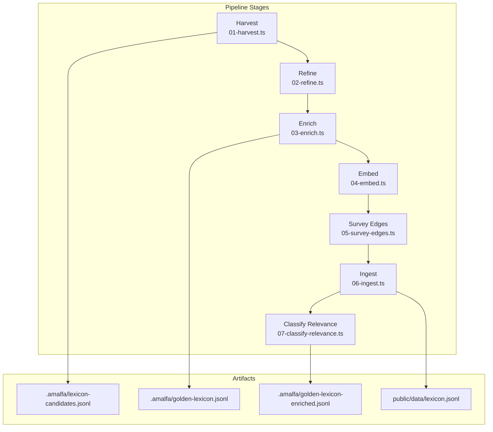

**Diagram sources**
- [src/pipeline/lexicon/01-harvest.ts](file://src/pipeline/lexicon/01-harvest.ts)
- [src/pipeline/lexicon/02-refine.ts](file://src/pipeline/lexicon/02-refine.ts)
- [src/pipeline/lexicon/03-enrich.ts](file://src/pipeline/lexicon/03-enrich.ts)
- [src/pipeline/lexicon/04-embed.ts](file://src/pipeline/lexicon/04-embed.ts)
- [src/pipeline/lexicon/05-survey-edges.ts](file://src/pipeline/lexicon/05-survey-edges.ts)
- [src/pipeline/lexicon/06-ingest.ts](file://src/pipeline/lexicon/06-ingest.ts)
- [src/pipeline/lexicon/07-classify-relevance.ts](file://src/pipeline/lexicon/07-classify-relevance.ts)
- [.amalfa/lexicon-candidates.jsonl](file://.amalfa/lexicon-candidates.jsonl)
- [.amalfa/golden-lexicon.jsonl](file://.amalfa/golden-lexicon.jsonl)
- [.amalfa/golden-lexicon-enriched.jsonl](file://.amalfa/golden-lexicon-enriched.jsonl)
- [public/data/lexicon.jsonl](file://public/data/lexicon.jsonl)

**Section sources**
- [src/pipeline/lexicon/README.md](file://src/pipeline/lexicon/README.md)
- [src/pipeline/lexicon/01-harvest.ts](file://src/pipeline/lexicon/01-harvest.ts)
- [src/pipeline/lexicon/02-refine.ts](file://src/pipeline/lexicon/02-refine.ts)
- [src/pipeline/lexicon/03-enrich.ts](file://src/pipeline/lexicon/03-enrich.ts)
- [src/pipeline/lexicon/04-embed.ts](file://src/pipeline/lexicon/04-embed.ts)
- [src/pipeline/lexicon/05-survey-edges.ts](file://src/pipeline/lexicon/05-survey-edges.ts)
- [src/pipeline/lexicon/06-ingest.ts](file://src/pipeline/lexicon/06-ingest.ts)
- [src/pipeline/lexicon/07-classify-relevance.ts](file://src/pipeline/lexicon/07-classify-relevance.ts)

## Core Components
- LexiconCandidate: A candidate concept produced during harvesting, represented as a JSONL record with term, frequency, sources, type, and status fields.
- GoldenLexiconConcept: A promoted concept with id, type, label, domain, layer, and meta containing frequency, sources, and promoted_at timestamp.
- EnrichedLexiconConcept: A GoldenLexiconConcept augmented with summary text.
- Storage: JSONL files (.amalfa/*.jsonl, public/data/lexicon.jsonl) persist pipeline artifacts and final lexicon outputs.

Key JSONL record structures:
- Candidate: {"term": "...", "frequency": N, "sources": ["..."], "type": "...", "status": "candidate"}
- Golden Concept: {"id": "...", "type": "...", "label": "...", "domain": "lexicon", "layer": "concept", "meta": {"frequency": N, "sources": ["..."], "promoted_at": "..."}}  
- Enriched Concept: Same as Golden plus "summary": "..."

**Section sources**
- [.amalfa/lexicon-candidates.jsonl](file://.amalfa/lexicon-candidates.jsonl)
- [.amalfa/golden-lexicon.jsonl](file://.amalfa/golden-lexicon.jsonl)
- [.amalfa/golden-lexicon-enriched.jsonl](file://.amalfa/golden-lexicon-enriched.jsonl)
- [public/data/lexicon.jsonl](file://public/data/lexicon.jsonl)

## Architecture Overview
The lexicon pipeline transforms raw candidates into enriched concepts through multiple stages, persisting intermediate and final artifacts as JSONL.

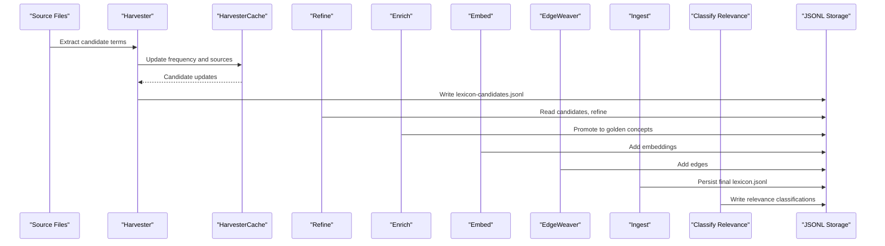

**Diagram sources**
- [src/core/Harvester.ts](file://src/core/Harvester.ts)
- [src/core/HarvesterCache.ts](file://src/core/HarvesterCache.ts)
- [src/core/EdgeWeaver.ts](file://src/core/EdgeWeaver.ts)
- [src/pipeline/lexicon/01-harvest.ts](file://src/pipeline/lexicon/01-harvest.ts)
- [src/pipeline/lexicon/02-refine.ts](file://src/pipeline/lexicon/02-refine.ts)
- [src/pipeline/lexicon/03-enrich.ts](file://src/pipeline/lexicon/03-enrich.ts)
- [src/pipeline/lexicon/04-embed.ts](file://src/pipeline/lexicon/04-embed.ts)
- [src/pipeline/lexicon/05-survey-edges.ts](file://src/pipeline/lexicon/05-survey-edges.ts)
- [src/pipeline/lexicon/06-ingest.ts](file://src/pipeline/lexicon/06-ingest.ts)
- [src/pipeline/lexicon/07-classify-relevance.ts](file://src/pipeline/lexicon/07-classify-relevance.ts)
- [.amalfa/lexicon-candidates.jsonl](file://.amalfa/lexicon-candidates.jsonl)
- [.amalfa/golden-lexicon.jsonl](file://.amalfa/golden-lexicon.jsonl)
- [.amalfa/golden-lexicon-enriched.jsonl](file://.amalfa/golden-lexicon-enriched.jsonl)
- [public/data/lexicon.jsonl](file://public/data/lexicon.jsonl)

## Detailed Component Analysis

### Lexicon Candidate Model and Frequency Tracking
- Candidate representation: term, frequency, sources, type, status.
- Frequency tracking: maintained per candidate; sources list records originating files.
- In-memory management: HarvesterCache aggregates and deduplicates candidate updates across the pipeline.

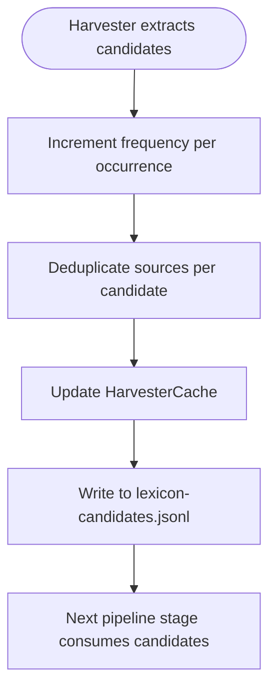

**Diagram sources**
- [src/core/Harvester.ts](file://src/core/Harvester.ts)
- [src/core/HarvesterCache.ts](file://src/core/HarvesterCache.ts)
- [.amalfa/lexicon-candidates.jsonl](file://.amalfa/lexicon-candidates.jsonl)

**Section sources**
- [src/core/Harvester.ts](file://src/core/Harvester.ts)
- [src/core/HarvesterCache.ts](file://src/core/HarvesterCache.ts)
- [.amalfa/lexicon-candidates.jsonl](file://.amalfa/lexicon-candidates.jsonl)

### Golden Lexicon Schema and Promotion
- Promotion: Candidates are transformed into GoldenLexiconConcepts with id, type, label, domain, layer, and meta.
- Meta fields: frequency, sources, promoted_at timestamp.
- Persistence: written to golden-lexicon.jsonl.

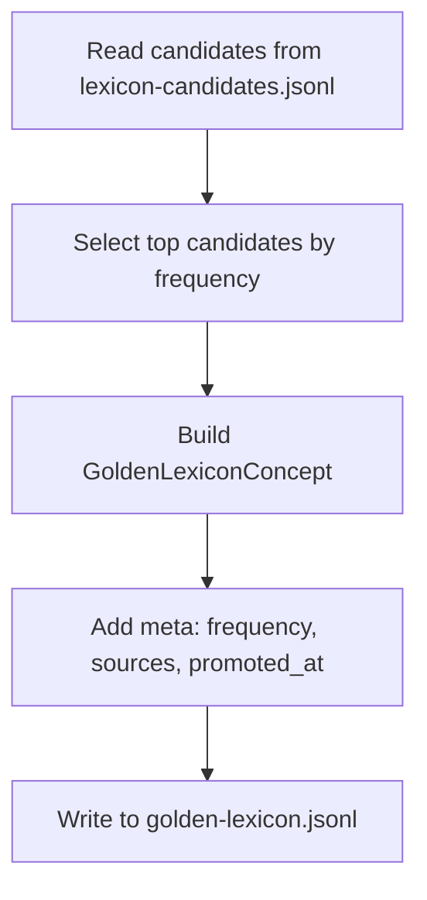

**Diagram sources**
- [.amalfa/golden-lexicon.jsonl](file://.amalfa/golden-lexicon.jsonl)
- [src/pipeline/lexicon/03-enrich.ts](file://src/pipeline/lexicon/03-enrich.ts)

**Section sources**
- [.amalfa/golden-lexicon.jsonl](file://.amalfa/golden-lexicon.jsonl)
- [src/pipeline/lexicon/03-enrich.ts](file://src/pipeline/lexicon/03-enrich.ts)

### Enriched Lexicon Schema and Summaries
- Enrichment: Adds human-readable summary text to GoldenLexiconConcepts.
- Persistence: written to golden-lexicon-enriched.jsonl.

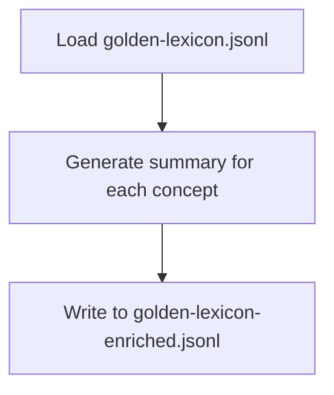

**Diagram sources**
- [.amalfa/golden-lexicon-enriched.jsonl](file://.amalfa/golden-lexicon-enriched.jsonl)
- [src/pipeline/lexicon/03-enrich.ts](file://src/pipeline/lexicon/03-enrich.ts)

**Section sources**
- [.amalfa/golden-lexicon-enriched.jsonl](file://.amalfa/golden-lexicon-enriched.jsonl)
- [src/pipeline/lexicon/03-enrich.ts](file://src/pipeline/lexicon/03-enrich.ts)

### JSONL Storage Formats and Persistence
- Intermediate: lexicon-candidates.jsonl, golden-lexicon.jsonl, golden-lexicon-enriched.jsonl.
- Final: public/data/lexicon.jsonl.
- Utilities: JsonlUtils provides streaming and parsing helpers for JSONL artifacts.

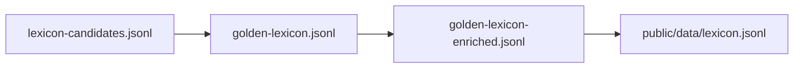

**Diagram sources**
- [.amalfa/lexicon-candidates.jsonl](file://.amalfa/lexicon-candidates.jsonl)
- [.amalfa/golden-lexicon.jsonl](file://.amalfa/golden-lexicon.jsonl)
- [.amalfa/golden-lexicon-enriched.jsonl](file://.amalfa/golden-lexicon-enriched.jsonl)
- [public/data/lexicon.jsonl](file://public/data/lexicon.jsonl)
- [src/utils/JsonlUtils.ts](file://src/utils/JsonlUtils.ts)

**Section sources**
- [src/utils/JsonlUtils.ts](file://src/utils/JsonlUtils.ts)
- [public/data/lexicon.jsonl](file://public/data/lexicon.jsonl)

### Source Attribution and Manifest-Based Mapping
- Sources list: tracks files where a term appears, enabling provenance.
- Manifest mapping: projectRoot and path utilities help resolve absolute vs. relative paths for consistent attribution.
- Tag injection and tool registry: TagInjector and ToolRegistry support source tagging and tool discovery.

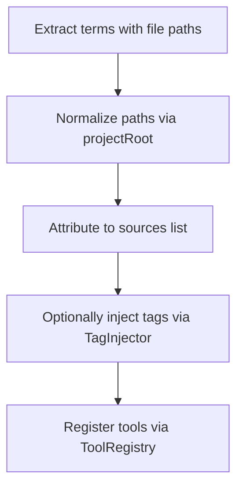

**Diagram sources**
- [src/utils/projectRoot.ts](file://src/utils/projectRoot.ts)
- [src/utils/TagInjector.ts](file://src/utils/TagInjector.ts)
- [src/utils/ToolRegistry.ts](file://src/utils/ToolRegistry.ts)
- [src/ember/types.ts](file://src/ember/types.ts)

**Section sources**
- [src/utils/projectRoot.ts](file://src/utils/projectRoot.ts)
- [src/utils/TagInjector.ts](file://src/utils/TagInjector.ts)
- [src/utils/ToolRegistry.ts](file://src/utils/ToolRegistry.ts)
- [src/ember/types.ts](file://src/ember/types.ts)

### Hash-to-Path Resolution and Database Integration
- Hashing: HarvesterCache supports hashing of content to detect duplicates and maintain consistent identifiers.
- Path resolution: projectRoot utilities convert absolute to root-relative paths for deterministic storage.
- Database integration: ResonanceDB and DatabaseFactory manage SQLite persistence for nodes, edges, and metadata.

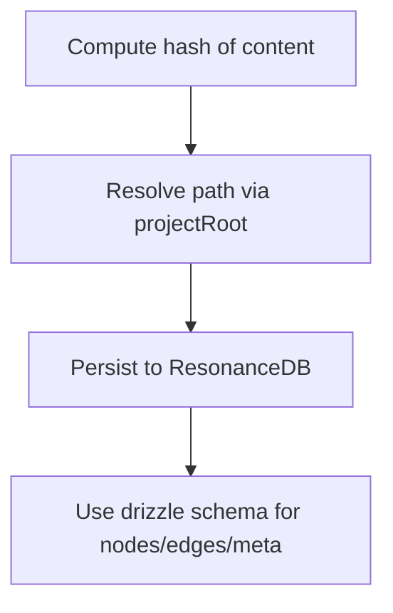

**Diagram sources**
- [src/core/HarvesterCache.ts](file://src/core/HarvesterCache.ts)
- [src/utils/projectRoot.ts](file://src/utils/projectRoot.ts)
- [src/resonance/db.ts](file://src/resonance/db.ts)
- [src/resonance/DatabaseFactory.ts](file://src/resonance/DatabaseFactory.ts)
- [src/resonance/drizzle/schema.ts](file://src/resonance/drizzle/schema.ts)

**Section sources**
- [src/core/HarvesterCache.ts](file://src/core/HarvesterCache.ts)
- [src/utils/projectRoot.ts](file://src/utils/projectRoot.ts)
- [src/resonance/db.ts](file://src/resonance/db.ts)
- [src/resonance/DatabaseFactory.ts](file://src/resonance/DatabaseFactory.ts)
- [src/resonance/drizzle/schema.ts](file://src/resonance/drizzle/schema.ts)

### Embedding and Vector Engine Integration
- Embedding: VectorEngine and embedder services generate and normalize embeddings.
- Vector daemon: Provides fast embedding generation and HTTP server integration.
- Persistence: Embeddings stored in database schema and referenced by concept ids.

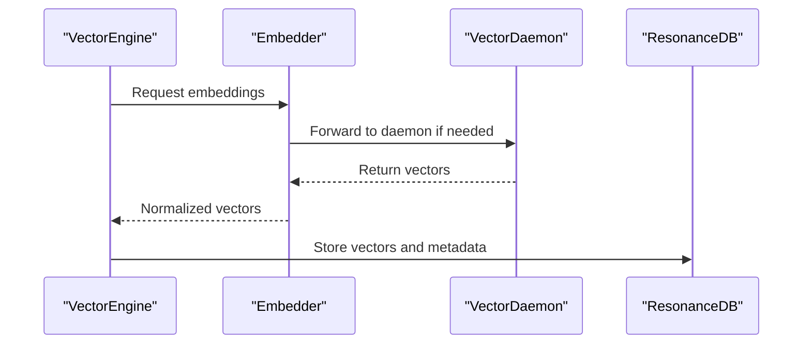

**Diagram sources**
- [src/core/VectorEngine.ts](file://src/core/VectorEngine.ts)
- [src/resonance/services/embedder.ts](file://src/resonance/services/embedder.ts)
- [src/resonance/services/vector-daemon.ts](file://src/resonance/services/vector-daemon.ts)
- [src/resonance/db.ts](file://src/resonance/db.ts)

**Section sources**
- [src/core/VectorEngine.ts](file://src/core/VectorEngine.ts)
- [src/resonance/services/embedder.ts](file://src/resonance/services/embedder.ts)
- [src/resonance/services/vector-daemon.ts](file://src/resonance/services/vector-daemon.ts)
- [src/resonance/db.ts](file://src/resonance/db.ts)

### Edge Weaving and Graph Construction
- EdgeWeaver constructs relationships between concepts based on embeddings and proximity.
- LouvainGate gates edge insertion using community detection.
- TimelineWeaver integrates temporal aspects of concept evolution.

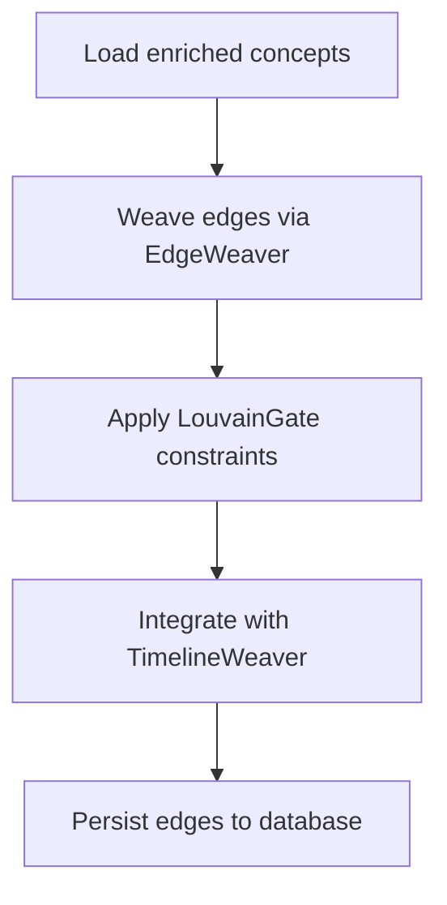

**Diagram sources**
- [src/core/EdgeWeaver.ts](file://src/core/EdgeWeaver.ts)
- [src/core/LouvainGate.ts](file://src/core/LouvainGate.ts)
- [src/core/TimelineWeaver.ts](file://src/core/TimelineWeaver.ts)
- [src/resonance/db.ts](file://src/resonance/db.ts)

**Section sources**
- [src/core/EdgeWeaver.ts](file://src/core/EdgeWeaver.ts)
- [src/core/LouvainGate.ts](file://src/core/LouvainGate.ts)
- [src/core/TimelineWeaver.ts](file://src/core/TimelineWeaver.ts)
- [src/resonance/db.ts](file://src/resonance/db.ts)

### Ingestion and Final Lexicon Output
- Ingest: Final lexicon assembled from enriched concepts, edges, and metadata.
- Output: public/data/lexicon.jsonl for downstream consumption.

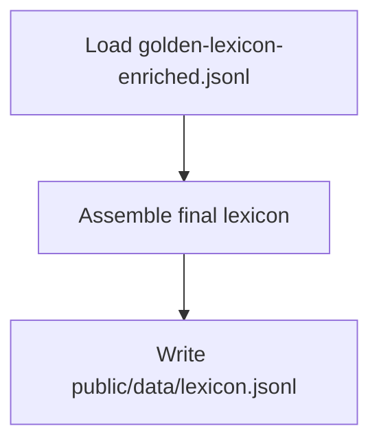

**Diagram sources**
- [.amalfa/golden-lexicon-enriched.jsonl](file://.amalfa/golden-lexicon-enriched.jsonl)
- [public/data/lexicon.jsonl](file://public/data/lexicon.jsonl)
- [src/pipeline/lexicon/06-ingest.ts](file://src/pipeline/lexicon/06-ingest.ts)

**Section sources**
- [public/data/lexicon.jsonl](file://public/data/lexicon.jsonl)
- [src/pipeline/lexicon/06-ingest.ts](file://src/pipeline/lexicon/06-ingest.ts)

## Dependency Analysis
The lexicon pipeline depends on core components for harvesting, caching, enrichment, embedding, and graph construction, with storage handled by JSONL and SQLite.

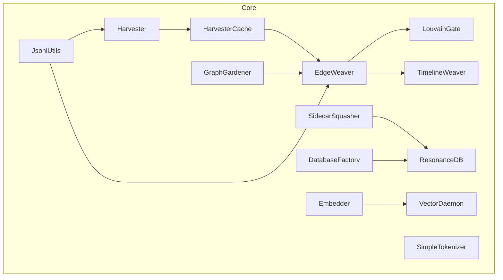

**Diagram sources**
- [src/core/Harvester.ts](file://src/core/Harvester.ts)
- [src/core/HarvesterCache.ts](file://src/core/HarvesterCache.ts)
- [src/core/EdgeWeaver.ts](file://src/core/EdgeWeaver.ts)
- [src/core/LouvainGate.ts](file://src/core/LouvainGate.ts)
- [src/core/TimelineWeaver.ts](file://src/core/TimelineWeaver.ts)
- [src/core/GraphGardener.ts](file://src/core/GraphGardener.ts)
- [src/core/SidecarSquasher.ts](file://src/core/SidecarSquasher.ts)
- [src/resonance/DatabaseFactory.ts](file://src/resonance/DatabaseFactory.ts)
- [src/resonance/db.ts](file://src/resonance/db.ts)
- [src/resonance/services/simpleTokenizer.ts](file://src/resonance/services/simpleTokenizer.ts)
- [src/resonance/services/embedder.ts](file://src/resonance/services/embedder.ts)
- [src/resonance/services/vector-daemon.ts](file://src/resonance/services/vector-daemon.ts)
- [src/utils/JsonlUtils.ts](file://src/utils/JsonlUtils.ts)

**Section sources**
- [src/core/Harvester.ts](file://src/core/Harvester.ts)
- [src/core/HarvesterCache.ts](file://src/core/HarvesterCache.ts)
- [src/core/EdgeWeaver.ts](file://src/core/EdgeWeaver.ts)
- [src/core/LouvainGate.ts](file://src/core/LouvainGate.ts)
- [src/core/TimelineWeaver.ts](file://src/core/TimelineWeaver.ts)
- [src/core/GraphGardener.ts](file://src/core/GraphGardener.ts)
- [src/core/SidecarSquasher.ts](file://src/core/SidecarSquasher.ts)
- [src/resonance/DatabaseFactory.ts](file://src/resonance/DatabaseFactory.ts)
- [src/resonance/db.ts](file://src/resonance/db.ts)
- [src/resonance/services/simpleTokenizer.ts](file://src/resonance/services/simpleTokenizer.ts)
- [src/resonance/services/embedder.ts](file://src/resonance/services/embedder.ts)
- [src/resonance/services/vector-daemon.ts](file://src/resonance/services/vector-daemon.ts)
- [src/utils/JsonlUtils.ts](file://src/utils/JsonlUtils.ts)

## Performance Considerations
- Streaming JSONL: Use JsonlUtils for efficient read/write of large artifacts.
- In-memory caching: HarvesterCache reduces repeated computation and deduplicates sources.
- Database indexing: Ensure appropriate indices on nodes(id), edges(source,target), and meta fields.
- Embedding batching: VectorDaemon and Embedder should batch requests to minimize overhead.
- Path normalization: projectRoot utilities prevent redundant path variations that could fragment source attribution.

[No sources needed since this section provides general guidance]

## Troubleshooting Guide
Common issues and resolutions:
- Data integrity: Validate JSONL structure and ensure meta fields (frequency, sources, promoted_at) are present.
- Source attribution drift: Confirm projectRoot normalization and consistent path handling across stages.
- Duplicate candidates: Verify HarvesterCache deduplication and hashing logic.
- Database connectivity: Check DatabaseFactory connection and WAL/Journal modes.
- Embedding errors: Confirm VectorDaemon availability and Embedder initialization.

Validation utilities and checks:
- PipelineValidator: Validates database state and integrity.
- StatsTracker and StatsLogger: Monitor ingestion and embedding performance.
- DaemonManager: Ensures vector daemon lifecycle is managed correctly.

**Section sources**
- [src/utils/validator.ts](file://src/utils/validator.ts)
- [src/utils/StatsTracker.ts](file://src/utils/StatsTracker.ts)
- [src/utils/StatsLogger.ts](file://src/utils/StatsLogger.ts)
- [src/utils/DaemonManager.ts](file://src/utils/DaemonManager.ts)
- [src/resonance/DatabaseFactory.ts](file://src/resonance/DatabaseFactory.ts)

## Conclusion
The lexicon pipeline employs a robust JSONL-based artifact system with in-memory candidate management, frequency tracking, and source attribution. Golden and enriched schemas provide structured, human-readable concepts with provenance and summaries. Database integration ensures persistence of nodes, edges, and metadata, while embedding services enable vector-based reasoning. Proper use of normalization, caching, and validation utilities maintains data integrity across pipeline stages.