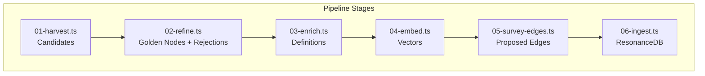
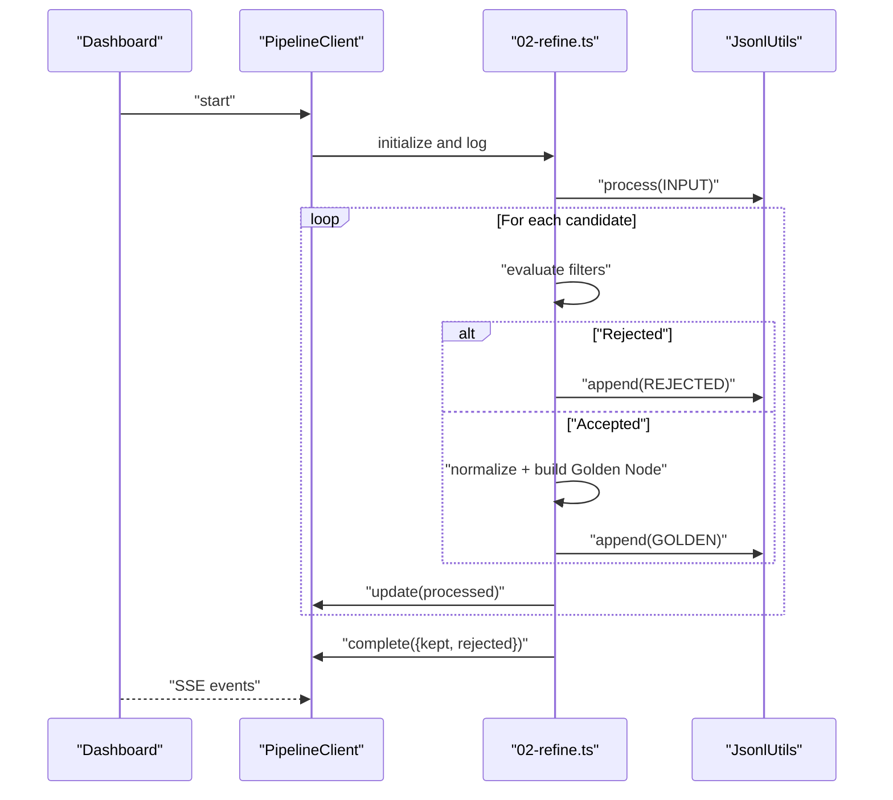
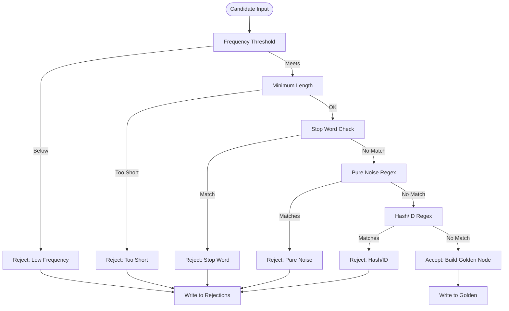
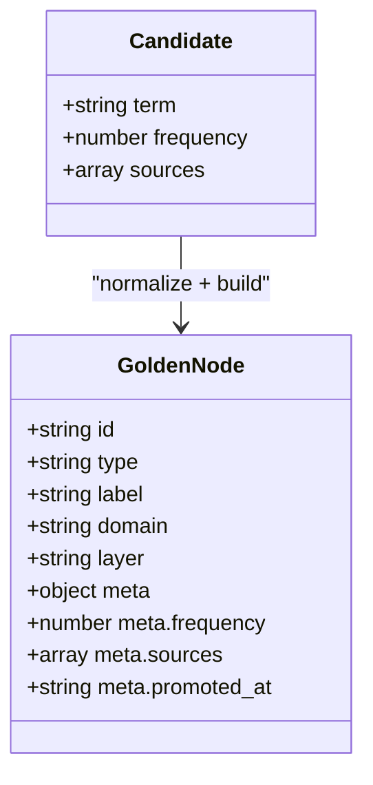
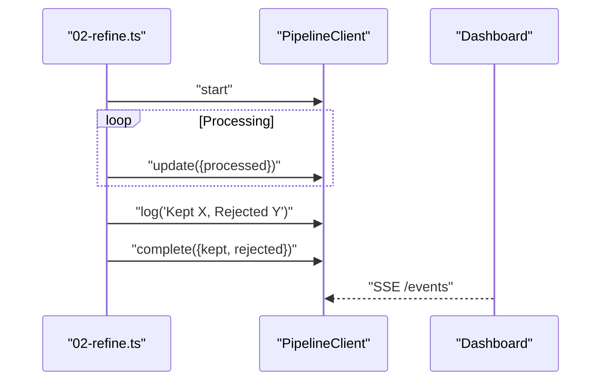
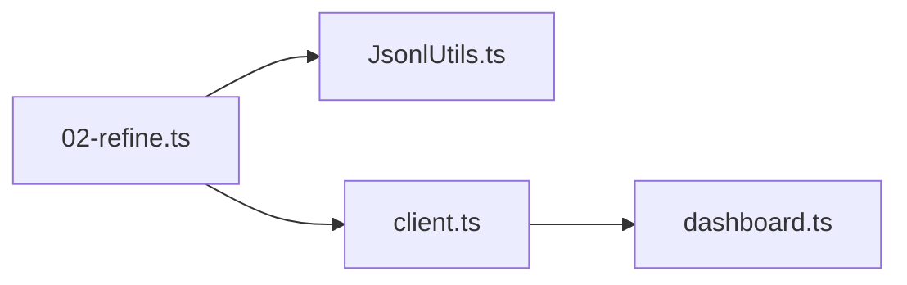

# Refine Stage

<cite>
**Referenced Files in This Document**
- [02-refine.ts](file://src/pipeline/lexicon/02-refine.ts)
- [README.md](file://src/pipeline/lexicon/README.md)
- [client.ts](file://src/pipeline/lexicon/lib/client.ts)
- [dashboard.ts](file://src/pipeline/lexicon/dashboard.ts)
- [JsonlUtils.ts](file://src/utils/JsonlUtils.ts)
- [refine-lexicon.ts](file://scripts/maintenance/refine-lexicon.ts)
- [amalfa.settings.json](file://amalfa.settings.json)
</cite>

## Table of Contents
1. [Introduction](#introduction)
2. [Project Structure](#project-structure)
3. [Core Components](#core-components)
4. [Architecture Overview](#architecture-overview)
5. [Detailed Component Analysis](#detailed-component-analysis)
6. [Dependency Analysis](#dependency-analysis)
7. [Performance Considerations](#performance-considerations)
8. [Troubleshooting Guide](#troubleshooting-guide)
9. [Conclusion](#conclusion)

## Introduction
The Refine Stage transforms raw lexicon candidates into a curated set of high-signal “Golden” lexicon items. It applies deterministic quality filters to remove noise, enforce minimum signal strength, and normalize structure for downstream enrichment and embedding. The stage preserves observability and idempotence by emitting separate outputs for accepted and rejected items, and by reporting processed counts and drop rates.

## Project Structure
The Refine Stage is part of a six-stage lexicon pipeline that produces verified JSONL artifacts at each step. The refine stage consumes candidates produced by the previous stage and writes two outputs:
- Golden lexicon items suitable for enrichment and embedding
- A rejection log with reasons for dropped items

**Diagram sources**
- [README.md](file://src/pipeline/lexicon/README.md#L12-L51)

**Section sources**
- [README.md](file://src/pipeline/lexicon/README.md#L1-L52)

## Core Components
- Quality filter rules: frequency threshold, length threshold, stop-word exclusion, pure noise detection, and hash/ID detection
- Candidate-to-Golden Node transformation: normalization, metadata shaping, and ID generation
- Observability: live telemetry via SSE, periodic updates, and structured logs
- Streaming I/O: line-by-line processing of JSONL inputs and atomic appends to outputs

Key configuration and behavior:
- Inputs and outputs are defined as JSONL paths under the project’s runtime directory
- Filter thresholds are embedded in the stage’s source
- Stop words are maintained as an explicit set
- Golden Node metadata includes frequency, sources, and promotion timestamp

**Section sources**
- [02-refine.ts](file://src/pipeline/lexicon/02-refine.ts#L7-L11)
- [02-refine.ts](file://src/pipeline/lexicon/02-refine.ts#L12-L71)
- [02-refine.ts](file://src/pipeline/lexicon/02-refine.ts#L100-L142)
- [JsonlUtils.ts](file://src/utils/JsonlUtils.ts#L36-L100)

## Architecture Overview
The Refine Stage orchestrates a linear, streaming transformation with robust observability hooks.

**Diagram sources**
- [dashboard.ts](file://src/pipeline/lexicon/dashboard.ts#L214-L239)
- [client.ts](file://src/pipeline/lexicon/lib/client.ts#L1-L44)
- [02-refine.ts](file://src/pipeline/lexicon/02-refine.ts#L89-L150)
- [JsonlUtils.ts](file://src/utils/JsonlUtils.ts#L77-L87)

## Detailed Component Analysis

### Quality Filtering and Deduplication
The refine stage applies a deterministic sequence of checks to each candidate. The order defines precedence and ensures consistent outcomes.

- Frequency threshold: rejects candidates below a configured minimum
- Length threshold: rejects very short terms
- Stop word set: removes common function words and identifiers
- Pure noise detection: filters out strings of digits and punctuation
- Hash/ID detection: filters out long hexadecimal sequences typical of identifiers

These rules collectively reduce noise and ensure downstream stages operate on high-signal concepts.

**Diagram sources**
- [02-refine.ts](file://src/pipeline/lexicon/02-refine.ts#L110-L114)

**Section sources**
- [02-refine.ts](file://src/pipeline/lexicon/02-refine.ts#L12-L71)
- [02-refine.ts](file://src/pipeline/lexicon/02-refine.ts#L108-L138)

### Candidate Evaluation Criteria
- Frequency threshold: minimum occurrence count to qualify as a candidate
- Minimum length: excludes trivial or non-descriptive tokens
- Stop word set: language/function words and common programming tokens
- Pure noise pattern: strings composed solely of digits and non-letter symbols
- Hash/ID pattern: long hexadecimal strings often used as identifiers

These criteria are defined in the refine stage and can be adjusted by editing the source thresholds and stop-word set.

**Section sources**
- [02-refine.ts](file://src/pipeline/lexicon/02-refine.ts#L12-L71)

### Duplicate Detection and Alias Resolution
- Duplicate detection: handled by the upstream harvesting stage; the refine stage expects normalized, deduplicated candidates
- Alias resolution: performed during enrichment; the refine stage does not merge aliases but normalizes labels and generates stable IDs for downstream linking

The refine stage focuses on signal quality rather than structural disambiguation, deferring alias merging to later stages.

**Section sources**
- [02-refine.ts](file://src/pipeline/lexicon/02-refine.ts#L125-L136)

### Concept Clustering Techniques
- Clustering: not performed in the refine stage
- Structural relationships: identified in later stages (edge survey and ingestion)

The refine stage preserves candidate semantics for downstream clustering and relationship discovery.

**Section sources**
- [README.md](file://src/pipeline/lexicon/README.md#L34-L44)

### Golden Node Construction
Accepted candidates are transformed into standardized Golden Nodes with:
- Stable ID derived from the normalized label
- Type defaulted to a concept
- Domain and layer labels
- Metadata including frequency, sources, and promotion timestamp

This structure ensures downstream enrichment and embedding can rely on consistent fields.

**Diagram sources**
- [02-refine.ts](file://src/pipeline/lexicon/02-refine.ts#L125-L136)

**Section sources**
- [02-refine.ts](file://src/pipeline/lexicon/02-refine.ts#L125-L136)

### Observability and Telemetry
- Dashboard: SSE endpoint streams step state, metrics, and logs
- PipelineClient: posts lifecycle events (start/update/log/complete/error)
- Periodic updates: every N processed items to track throughput and drop rate

**Diagram sources**
- [client.ts](file://src/pipeline/lexicon/lib/client.ts#L9-L29)
- [dashboard.ts](file://src/pipeline/lexicon/dashboard.ts#L200-L239)
- [02-refine.ts](file://src/pipeline/lexicon/02-refine.ts#L140-L145)

**Section sources**
- [client.ts](file://src/pipeline/lexicon/lib/client.ts#L1-L44)
- [dashboard.ts](file://src/pipeline/lexicon/dashboard.ts#L200-L239)
- [02-refine.ts](file://src/pipeline/lexicon/02-refine.ts#L89-L150)

### Maintenance Script for Post-Hoc Refinement
A separate maintenance script supports iterative refinement of an existing golden lexicon:
- Reads an existing golden lexicon
- Applies the same quality rules
- Writes refined output and a rejection log

This enables offline tuning and experimentation with thresholds and stop-word sets.

**Section sources**
- [refine-lexicon.ts](file://scripts/maintenance/refine-lexicon.ts#L1-L77)

## Dependency Analysis
The refine stage depends on:
- JSONL streaming utilities for safe, line-by-line processing
- A lightweight telemetry client for dashboard integration
- The dashboard for SSE-based monitoring

**Diagram sources**
- [02-refine.ts](file://src/pipeline/lexicon/02-refine.ts#L1-L5)
- [JsonlUtils.ts](file://src/utils/JsonlUtils.ts#L36-L100)
- [client.ts](file://src/pipeline/lexicon/lib/client.ts#L1-L44)
- [dashboard.ts](file://src/pipeline/lexicon/dashboard.ts#L214-L239)

**Section sources**
- [02-refine.ts](file://src/pipeline/lexicon/02-refine.ts#L1-L5)
- [JsonlUtils.ts](file://src/utils/JsonlUtils.ts#L36-L100)
- [client.ts](file://src/pipeline/lexicon/lib/client.ts#L1-L44)
- [dashboard.ts](file://src/pipeline/lexicon/dashboard.ts#L214-L239)

## Performance Considerations
- Streaming I/O: JSONL processing avoids loading entire files into memory, enabling large-scale refinement on constrained hardware
- Atomic writes: append-only writes reduce contention and support resumable runs
- Batch telemetry updates: periodic metrics reduce overhead while maintaining visibility
- Idempotent outputs: separate golden and rejection logs enable safe reprocessing and auditing

[No sources needed since this section provides general guidance]

## Troubleshooting Guide
Common issues and remedies:
- Empty or malformed JSONL lines: the JSONL streamer skips invalid lines and logs warnings; validate upstream producers or rerun the preceding stage
- Excessive rejections: adjust thresholds or expand the stop-word set; use the rejection log to identify recurring patterns
- Dashboard connectivity: the telemetry client tolerates transient failures; check network and port availability
- Large datasets: ensure sufficient disk space for outputs and consider splitting inputs for parallel processing

Operational hooks:
- Dashboard SSE endpoint for live status
- PipelineClient lifecycle events for instrumentation
- Structured logs for debugging

**Section sources**
- [JsonlUtils.ts](file://src/utils/JsonlUtils.ts#L55-L75)
- [client.ts](file://src/pipeline/lexicon/lib/client.ts#L31-L42)
- [dashboard.ts](file://src/pipeline/lexicon/dashboard.ts#L200-L239)

## Conclusion
The Refine Stage establishes a high-signal lexicon by applying strict, deterministic quality filters and normalizing candidate entries into standardized Golden Nodes. Its streaming design, observability hooks, and idempotent outputs make it resilient, auditable, and suitable for iterative tuning. Together with downstream enrichment and embedding, it forms a robust foundation for constructing the Resonance Knowledge Graph.