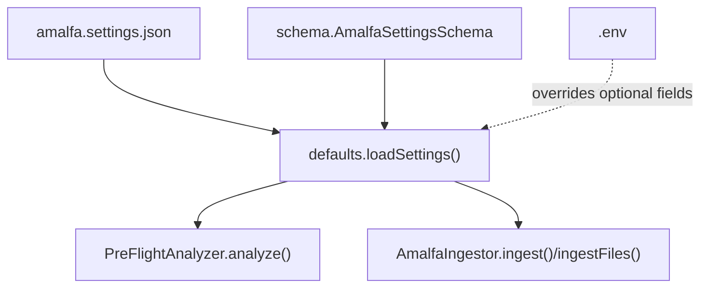
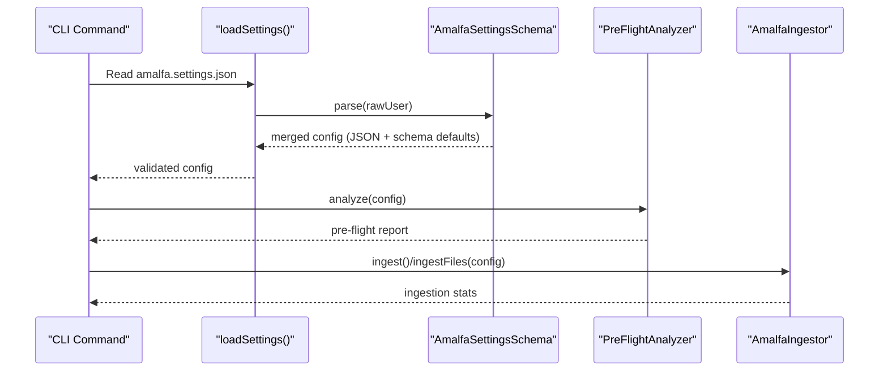
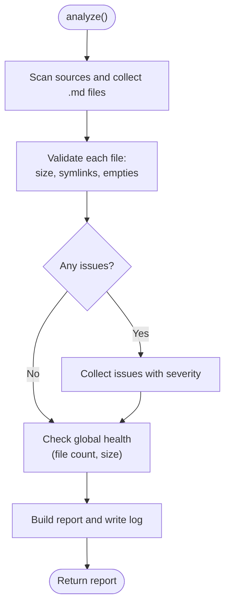
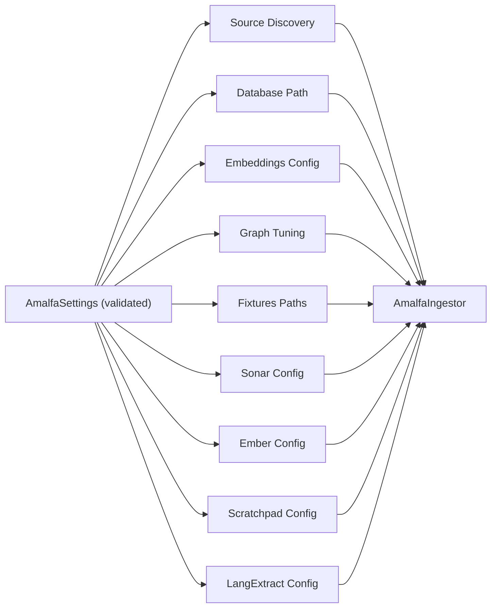

# Pipeline Configuration and Customization

<cite>
**Referenced Files in This Document**
- [schema.ts](file://src/config/schema.ts)
- [defaults.ts](file://src/config/defaults.ts)
- [PreFlightAnalyzer.ts](file://src/pipeline/PreFlightAnalyzer.ts)
- [AmalfaIngestor.ts](file://src/pipeline/AmalfaIngestor.ts)
- [amalfa.settings.json](file://amalfa.settings.json)
- [amalfa.settings.example.json](file://amalfa.settings.example.json)
- [.env](file://.env)
- [.env.example](file://.env.example)
- [init.ts](file://src/cli/commands/init.ts)
</cite>

## Table of Contents
1. [Introduction](#introduction)
2. [Project Structure](#project-structure)
3. [Core Components](#core-components)
4. [Architecture Overview](#architecture-overview)
5. [Detailed Component Analysis](#detailed-component-analysis)
6. [Dependency Analysis](#dependency-analysis)
7. [Performance Considerations](#performance-considerations)
8. [Troubleshooting Guide](#troubleshooting-guide)
9. [Conclusion](#conclusion)
10. [Appendices](#appendices)

## Introduction
This document explains how to configure and customize the Amalfa ingestion pipeline. It covers the configuration schema, environment variables, configuration inheritance, and the PreFlightAnalyzer’s role in validating and optimizing pipeline performance. It also provides practical examples, best practices for different deployment scenarios, and troubleshooting guidance for configuration-related issues.

## Project Structure
The configuration system centers around a single-source-of-truth JSON file and a Zod schema that defines defaults and validation. The loader reads the JSON, normalizes legacy fields, and merges with schema-defined defaults. The ingestion pipeline consumes the validated configuration to discover sources, exclude unwanted paths, manage embeddings, and orchestrate ingestion.

**Diagram sources**
- [defaults.ts](file://src/config/defaults.ts#L84-L139)
- [schema.ts](file://src/config/schema.ts#L146-L266)
- [PreFlightAnalyzer.ts](file://src/pipeline/PreFlightAnalyzer.ts#L75-L131)
- [AmalfaIngestor.ts](file://src/pipeline/AmalfaIngestor.ts#L139-L309)

**Section sources**
- [defaults.ts](file://src/config/defaults.ts#L84-L139)
- [schema.ts](file://src/config/schema.ts#L146-L266)

## Core Components
- Configuration schema: Defines all supported keys, types, and default values.
- Loader: Reads the JSON SSoT, normalizes legacy fields, and validates via the schema.
- PreFlightAnalyzer: Scans sources, validates files, and writes a pre-flight report.
- Ingestor: Executes ingestion using validated configuration.

Key configuration areas:
- Sources and exclusions
- Database path
- Embeddings engine
- Watch mode
- Graph tuning
- Fixtures
- Sonar (local/cloud inference)
- Ember (memory/context)
- Scratchpad (transient cache)
- Language extraction providers

**Section sources**
- [schema.ts](file://src/config/schema.ts#L146-L266)
- [defaults.ts](file://src/config/defaults.ts#L84-L139)
- [PreFlightAnalyzer.ts](file://src/pipeline/PreFlightAnalyzer.ts#L61-L131)
- [AmalfaIngestor.ts](file://src/pipeline/AmalfaIngestor.ts#L139-L309)

## Architecture Overview
The configuration architecture enforces a strict precedence and validation chain. The JSON SSoT is the authoritative source; schema defaults are injected by the parser; environment variables can optionally override specific fields; and the loader performs normalization and validation.

**Diagram sources**
- [defaults.ts](file://src/config/defaults.ts#L84-L139)
- [schema.ts](file://src/config/schema.ts#L146-L266)
- [PreFlightAnalyzer.ts](file://src/pipeline/PreFlightAnalyzer.ts#L75-L131)
- [AmalfaIngestor.ts](file://src/pipeline/AmalfaIngestor.ts#L139-L309)

## Detailed Component Analysis

### Configuration Schema and Defaults
The schema defines the canonical structure and default values for all pipeline settings. It includes:
- Sources and exclusions
- Database path
- Embeddings model and dimensions
- Watch mode (enable, debounce, notifications)
- Graph tuning (Louvain parameters)
- Fixtures (paths to lexicon and CDA)
- Sonar (local inference and cloud provider)
- Ember (memory/context)
- Scratchpad (transient cache)
- Language extraction providers and fallback order

Important defaults:
- Sources default to common documentation and script directories.
- Database defaults to a local SQLite file under the Amalfa runtime directory.
- Embeddings defaults to a small English model with 384 dimensions.
- Watch defaults enable debounced file watching with notifications.
- Graph tuning defaults are tuned for balanced clustering and super-node prevention.
- Sonar defaults are conservative; enable and configure as needed.
- Ember and Scratchpad defaults enable transient cognitive features.
- Language extraction defaults to a cloud provider with optional local fallbacks.

**Section sources**
- [schema.ts](file://src/config/schema.ts#L146-L266)

### Configuration Loading and Inheritance
The loader:
- Requires the presence of the SSoT file.
- Normalizes legacy keys (e.g., converting a singular source to a sources array).
- Validates and merges user JSON with schema defaults.
- Exits with a clear error if the SSoT is missing or invalid.

Inheritance and precedence:
- User JSON overrides schema defaults.
- Environment variables can optionally override specific fields (see Environment Variables).
- The loader does not manually merge defaults; Zod’s parse injects schema defaults.

**Section sources**
- [defaults.ts](file://src/config/defaults.ts#L84-L139)

### PreFlightAnalyzer: Validation and Recommendations
The analyzer scans configured sources, validates files, and produces a report with:
- Counts of total/valid/skipped files and total size
- Estimated nodes
- Issues grouped by severity (error, warning, info)
- Global health warnings for large corpora
- A detailed pre-flight log file

Validation focuses on:
- Large files (>10 MB) requiring splitting
- Very small files (<50 bytes)
- Symlinks and circular references
- Empty files
- Non-markdown files
- Overall corpus size and file counts

It writes a structured report to a log file and integrates with CLI commands to block ingestion when errors are present.

**Diagram sources**
- [PreFlightAnalyzer.ts](file://src/pipeline/PreFlightAnalyzer.ts#L75-L131)
- [PreFlightAnalyzer.ts](file://src/pipeline/PreFlightAnalyzer.ts#L167-L268)
- [PreFlightAnalyzer.ts](file://src/pipeline/PreFlightAnalyzer.ts#L297-L337)
- [PreFlightAnalyzer.ts](file://src/pipeline/PreFlightAnalyzer.ts#L342-L452)

**Section sources**
- [PreFlightAnalyzer.ts](file://src/pipeline/PreFlightAnalyzer.ts#L61-L131)
- [PreFlightAnalyzer.ts](file://src/pipeline/PreFlightAnalyzer.ts#L167-L268)
- [PreFlightAnalyzer.ts](file://src/pipeline/PreFlightAnalyzer.ts#L297-L337)
- [PreFlightAnalyzer.ts](file://src/pipeline/PreFlightAnalyzer.ts#L342-L452)

### AmalfaIngestor: Using Configuration
The ingestor:
- Discovers files from configured sources, applying exclusion patterns.
- Processes files in two passes: nodes first, then edges.
- Uses configured embeddings and tokenizer services.
- Integrates telemetry and performs persistence checkpoints.

Key behaviors:
- Two-pass ingestion minimizes locks and prevents busy errors.
- Batch transactions reduce contention with concurrent daemons.
- Edge weaving occurs after all nodes exist, using a lexicon built from existing nodes.

**Section sources**
- [AmalfaIngestor.ts](file://src/pipeline/AmalfaIngestor.ts#L139-L309)
- [AmalfaIngestor.ts](file://src/pipeline/AmalfaIngestor.ts#L314-L343)
- [AmalfaIngestor.ts](file://src/pipeline/AmalfaIngestor.ts#L375-L440)

### Environment Variables and Optional Overrides
Environment variables can supplement configuration:
- Provider API keys (e.g., OpenRouter)
- LangExtract provider selection
- Database path
- Debug and logging level
- Ollama host/model configuration

These are documented in the example environment file and should be kept secret (.env is ignored by version control).

**Section sources**
- [.env.example](file://.env.example#L1-L83)
- [.env](file://.env#L1-L3)

### Configuration Examples and Profiles
- Minimal production profile: Disable Sonar, keep defaults for embeddings and watch, set database path, and tune graph tuning conservatively.
- Developer profile: Enable watch, increase debouncing, enable debug logging, and configure local Ollama for language extraction.
- Cloud-heavy profile: Enable Sonar cloud, set provider and model, and configure API keys via environment variables.

Example locations:
- Base configuration: [amalfa.settings.json](file://amalfa.settings.json#L1-L96)
- Example configuration: [amalfa.settings.example.json](file://amalfa.settings.example.json#L1-L56)

Best practices:
- Keep sources scoped to relevant folders to reduce ingestion time.
- Use exclusion patterns to avoid temporary or generated content.
- Align embeddings model and dimensions with downstream vector operations.
- Tune graph tuning parameters for your domain density and node distribution.

**Section sources**
- [amalfa.settings.json](file://amalfa.settings.json#L9-L95)
- [amalfa.settings.example.json](file://amalfa.settings.example.json#L2-L55)

## Dependency Analysis
The ingestion pipeline depends on validated configuration for:
- Source discovery and filtering
- Database path resolution
- Embeddings and tokenizer services
- Graph tuning parameters
- Provider credentials and endpoints

**Diagram sources**
- [schema.ts](file://src/config/schema.ts#L146-L266)
- [defaults.ts](file://src/config/defaults.ts#L84-L139)
- [AmalfaIngestor.ts](file://src/pipeline/AmalfaIngestor.ts#L139-L309)

**Section sources**
- [schema.ts](file://src/config/schema.ts#L146-L266)
- [defaults.ts](file://src/config/defaults.ts#L84-L139)
- [AmalfaIngestor.ts](file://src/pipeline/AmalfaIngestor.ts#L139-L309)

## Performance Considerations
- Limit per-file size: The analyzer flags files larger than 10 MB; split large files to improve embedding quality and memory usage.
- Scope sources: Narrow sources to relevant directories to reduce scan time.
- Use exclusion patterns: Exclude caches, logs, and generated content.
- Batch size and transactions: The ingestor batches node insertion to reduce lock contention.
- Graph tuning: Adjust Louvain parameters to balance clustering and prevent super-node collapse.
- Embeddings model: Choose a model appropriate for your content scale and latency targets.
- Watch mode: Tune debounce to balance responsiveness and CPU usage.

[No sources needed since this section provides general guidance]

## Troubleshooting Guide
Common configuration issues and resolutions:
- Missing SSoT: The loader exits with a clear message; create the settings file from the example.
- Invalid JSON or schema violations: The loader prints detailed errors; fix the offending keys according to the schema.
- Pre-flight errors: Address reported file issues (large files, symlinks, empties) before ingestion.
- Pre-flight warnings: Review recommendations in the pre-flight log; use force mode only if you accept risks.
- No valid files found: Verify source directories contain .md files and paths are correct.
- Large corpus ingestion: Consider splitting sources or reducing scope to avoid long initial ingestion times.

Operational hooks:
- CLI integration: The initialization command surfaces pre-flight results and exits on errors or warnings (unless forced).
- Logs: Inspect the pre-flight log for actionable recommendations.

**Section sources**
- [defaults.ts](file://src/config/defaults.ts#L94-L138)
- [PreFlightAnalyzer.ts](file://src/pipeline/PreFlightAnalyzer.ts#L342-L452)
- [init.ts](file://src/cli/commands/init.ts#L31-L63)

## Conclusion
Amalfa’s configuration system centralizes control in a Zod schema-backed JSON file, ensuring predictable defaults, strict validation, and clear precedence. The PreFlightAnalyzer acts as a guardrail, surfacing potential issues before ingestion. By tuning sources, exclusions, embeddings, and graph parameters—and by leveraging environment variables—you can optimize the pipeline for different deployment scenarios while maintaining reliability and performance.

[No sources needed since this section summarizes without analyzing specific files]

## Appendices

### Configuration Reference Summary
- Sources: Array of glob-like paths to scan for markdown files.
- Exclude patterns: Array of substrings to filter out unwanted files/directories.
- Database: Path to the SQLite database file.
- Embeddings: Model identifier and vector dimensions.
- Watch: Enable, debounce, and notifications for file watching.
- Graph tuning: Louvain parameters for community detection.
- Fixtures: Paths to lexicon and CDA JSON fixtures.
- Sonar: Local inference host/port, tasks, and cloud provider settings.
- Ember: Memory/context toggles and backup directory.
- Scratchpad: Transient cache thresholds and preview settings.
- LangExtract: Provider selection and provider-specific settings.

**Section sources**
- [schema.ts](file://src/config/schema.ts#L146-L266)

### Environment Variables Reference
- Provider API keys: OPENROUTER_API_KEY, optional provider-specific keys.
- LangExtract provider: LANGEXTRACT_PROVIDER.
- Database path: DATABASE_PATH.
- Debugging: DEBUG, LOG_LEVEL.
- Ollama configuration: Host and model selection for local/remote models.

**Section sources**
- [.env.example](file://.env.example#L1-L83)
- [.env](file://.env#L1-L3)