# Two-Pass Ingestion Strategy

<cite>
**Referenced Files in This Document**
- [AmalfaIngestor.ts](file://src/pipeline/AmalfaIngestor.ts)
- [EdgeWeaver.ts](file://src/core/EdgeWeaver.ts)
- [LouvainGate.ts](file://src/core/LouvainGate.ts)
- [db.ts](file://src/resonance/db.ts)
- [DatabaseFactory.ts](file://src/resonance/DatabaseFactory.ts)
- [ingestion-pipeline.md](file://docs/architecture/ingestion-pipeline.md)
- [sqlite-wal-readonly-trap.md](file://docs/references/sqlite-wal-readonly-trap.md)
- [2026-01-15-database-connection-hygiene.md](file://debriefs/2026-01-15-database-connection-hygiene.md)
- [checkpoint.ts](file://scripts/pipeline/checkpoint.ts)
- [Logger.ts](file://src/utils/Logger.ts)
</cite>

## Table of Contents
1. [Introduction](#introduction)
2. [Project Structure](#project-structure)
3. [Core Components](#core-components)
4. [Architecture Overview](#architecture-overview)
5. [Detailed Component Analysis](#detailed-component-analysis)
6. [Dependency Analysis](#dependency-analysis)
7. [Performance Considerations](#performance-considerations)
8. [Troubleshooting Guide](#troubleshooting-guide)
9. [Conclusion](#conclusion)

## Introduction
This document explains Amalfa’s two-pass ingestion strategy designed to produce a consistent, conflict-free knowledge graph. The approach separates node creation from edge creation to eliminate “edge weaving conflicts” and ensure data integrity. It also details transaction management, batch sizing tuned to prevent SQLITE_BUSY errors, WAL checkpointing for durability, and the LouvainGate integration that prevents super-node collapse. The document concludes with practical examples, error handling patterns, and performance optimization techniques.

## Project Structure
The two-pass ingestion is implemented in the ingestion orchestrator and supported by the graph database layer, edge weaving logic, and database factory that enforces safe SQLite/WAL configuration.

**Diagram sources**
- [AmalfaIngestor.ts](file://src/pipeline/AmalfaIngestor.ts#L182-L253)
- [db.ts](file://src/resonance/db.ts#L349-L359)
- [EdgeWeaver.ts](file://src/core/EdgeWeaver.ts#L54-L59)
- [LouvainGate.ts](file://src/core/LouvainGate.ts#L15-L36)

**Section sources**
- [AmalfaIngestor.ts](file://src/pipeline/AmalfaIngestor.ts#L182-L253)
- [db.ts](file://src/resonance/db.ts#L349-L359)

## Core Components
- AmalfaIngestor: Orchestrates discovery, batched node insertion (Pass 1), lexicon building, and edge weaving (Pass 2). It manages transactions, progress reporting, and WAL checkpointing.
- ResonanceDB: Provides transactional primitives, node/edge insertions, and WAL checkpointing. It ensures WAL mode and busy_timeout are configured.
- EdgeWeaver: Builds relationships from content using a lexicon populated in Pass 1. Integrates LouvainGate to filter edges that could destabilize highly connected nodes.
- LouvainGate: Applies a modularity-based gate to reject edges that would create low-quality clusters around super-nodes.

**Section sources**
- [AmalfaIngestor.ts](file://src/pipeline/AmalfaIngestor.ts#L182-L253)
- [db.ts](file://src/resonance/db.ts#L349-L359)
- [EdgeWeaver.ts](file://src/core/EdgeWeaver.ts#L54-L59)
- [LouvainGate.ts](file://src/core/LouvainGate.ts#L15-L36)

## Architecture Overview
The ingestion pipeline enforces a strict order: nodes first, then edges. This guarantees that all candidate targets exist in the lexicon before weaving relationships, preventing dangling references and inconsistent edge sets.

**Diagram sources**
- [AmalfaIngestor.ts](file://src/pipeline/AmalfaIngestor.ts#L182-L253)
- [EdgeWeaver.ts](file://src/core/EdgeWeaver.ts#L168-L181)
- [LouvainGate.ts](file://src/core/LouvainGate.ts#L15-L36)
- [db.ts](file://src/resonance/db.ts#L365-L367)

## Detailed Component Analysis

### Two-Pass Orchestration (AmalfaIngestor)
- Pass 1: Nodes only. The ingestor iterates files in batches of 10, inserting nodes and skipping edge weaving. Transactions are short-lived to reduce lock contention.
- Pass 2: Edges only. After building a lexicon from all nodes, the ingestor weaves edges for each file using the fully populated lexicon.
- WAL checkpoint: After Pass 2, the system forces a WAL checkpoint to persist changes and validates the resulting database file size to ensure durability.

```mermaid
flowchart TD
Start(["ingest()"]) --> Discover["discoverFiles()"]
Discover --> LoopBatches{"More files?"}
LoopBatches --> |Yes| TxBegin["beginTransaction()"]
TxBegin --> ForEach["processFile() x BATCH_SIZE=10"]
ForEach --> TxCommit["commit()"]
TxCommit --> LoopBatches
LoopBatches --> |No| BuildLex["buildLexicon()"]
BuildLex --> WeaveTx["beginTransaction()"]
WeaveTx --> WeaveLoop["weave(id, content) for each file"]
WeaveLoop --> WeaveCommit["commit()"]
WeaveCommit --> Checkpoint["wal_checkpoint(TRUNCATE)"]
Checkpoint --> End(["Return stats"])
```

**Diagram sources**
- [AmalfaIngestor.ts](file://src/pipeline/AmalfaIngestor.ts#L182-L253)

**Section sources**
- [AmalfaIngestor.ts](file://src/pipeline/AmalfaIngestor.ts#L182-L253)

### Transaction Management and Batch Sizing
- Batch size: 10 files per transaction to keep lock durations under 2.5s for a 5s busy_timeout, preventing SQLITE_BUSY during concurrent operations.
- Transactions wrap both node insertion and edge weaving to ensure atomicity and consistency.
- DatabaseFactory enforces WAL mode, busy_timeout, and other safety pragmas at connection time.

**Diagram sources**
- [DatabaseFactory.ts](file://src/resonance/DatabaseFactory.ts#L44-L65)

**Section sources**
- [2026-01-15-database-connection-hygiene.md](file://debriefs/2026-01-15-database-connection-hygiene.md#L175-L186)
- [DatabaseFactory.ts](file://src/resonance/DatabaseFactory.ts#L44-L65)

### Edge Weaving and LouvainGate Integration
- EdgeWeaver constructs relationships from explicit tags, wiki-links, metadata tags, and markdown links using a lexicon built from nodes.
- LouvainGate rejects edges to super-nodes (default threshold 50) when the source has no shared neighbor with the target, preventing low-quality clustering and collapse.
- The integration ensures that only structurally sound edges are inserted, reducing noise and stabilizing community detection.

**Diagram sources**
- [EdgeWeaver.ts](file://src/core/EdgeWeaver.ts#L54-L181)
- [LouvainGate.ts](file://src/core/LouvainGate.ts#L15-L66)

**Section sources**
- [EdgeWeaver.ts](file://src/core/EdgeWeaver.ts#L54-L181)
- [LouvainGate.ts](file://src/core/LouvainGate.ts#L15-L66)

### WAL Persistence and Durability
- After edge weaving, the system performs a WAL checkpoint to move frames from WAL to the main database file.
- A post-checkpoint verification ensures the database file exists and is non-empty, guarding against silent corruption.

**Diagram sources**
- [AmalfaIngestor.ts](file://src/pipeline/AmalfaIngestor.ts#L251-L269)
- [db.ts](file://src/resonance/db.ts#L365-L367)

**Section sources**
- [AmalfaIngestor.ts](file://src/pipeline/AmalfaIngestor.ts#L251-L269)
- [db.ts](file://src/resonance/db.ts#L365-L367)

### Error Handling During Each Pass
- Pass 1: Individual file processing errors are logged and skipped to maintain pipeline continuity. The ingestor continues to the next file.
- Pass 2: Edge weaving errors are caught per file and logged, allowing the rest of the batch to proceed.
- Top-level ingestion errors are captured and reported with zeroed stats to indicate failure.

**Section sources**
- [AmalfaIngestor.ts](file://src/pipeline/AmalfaIngestor.ts#L87-L89)
- [AmalfaIngestor.ts](file://src/pipeline/AmalfaIngestor.ts#L121-L133)
- [Logger.ts](file://src/utils/Logger.ts#L1-L23)

## Dependency Analysis
The ingestion pipeline depends on a coherent stack: the orchestrator coordinates with the database layer, which enforces safe SQLite/WAL behavior. Edge weaving relies on the lexicon built from nodes, and LouvainGate filters edges to preserve graph quality.

**Diagram sources**
- [AmalfaIngestor.ts](file://src/pipeline/AmalfaIngestor.ts#L182-L253)
- [db.ts](file://src/resonance/db.ts#L349-L359)
- [DatabaseFactory.ts](file://src/resonance/DatabaseFactory.ts#L44-L65)
- [EdgeWeaver.ts](file://src/core/EdgeWeaver.ts#L54-L59)
- [LouvainGate.ts](file://src/core/LouvainGate.ts#L15-L36)

**Section sources**
- [AmalfaIngestor.ts](file://src/pipeline/AmalfaIngestor.ts#L182-L253)
- [db.ts](file://src/resonance/db.ts#L349-L359)
- [DatabaseFactory.ts](file://src/resonance/DatabaseFactory.ts#L44-L65)
- [EdgeWeaver.ts](file://src/core/EdgeWeaver.ts#L54-L59)
- [LouvainGate.ts](file://src/core/LouvainGate.ts#L15-L36)

## Performance Considerations
- Batch size 10 balances safety and throughput under concurrent access. Larger batches risk exceeding busy_timeout and causing SQLITE_BUSY.
- WAL mode enables concurrent readers while maintaining write isolation; combined with short transactions, it minimizes contention.
- The pipeline leverages hashing to skip unchanged files, reducing redundant work.
- Post-checkpoint verification ensures durability without compromising performance.

[No sources needed since this section provides general guidance]

## Troubleshooting Guide
- SQLITE_BUSY during ingestion:
  - Confirm busy_timeout is set and WAL mode is active.
  - Reduce batch size or stop concurrent daemons/MCP processes.
- WAL-related errors (readonly or IO errors):
  - Ensure connections are not opened with readonly flags; all connections must participate in SHM updates.
- Persistent corruption or empty database after checkpoint:
  - Use the post-checkpoint verification to confirm file existence and non-zero size.

**Section sources**
- [2026-01-15-database-connection-hygiene.md](file://debriefs/2026-01-15-database-connection-hygiene.md#L154-L222)
- [sqlite-wal-readonly-trap.md](file://docs/references/sqlite-wal-readonly-trap.md#L1-L229)
- [AmalfaIngestor.ts](file://src/pipeline/AmalfaIngestor.ts#L255-L269)

## Conclusion
Amalfa’s two-pass ingestion strategy eliminates edge weaving conflicts by ensuring a fully populated lexicon before building relationships. The combination of short transactions, WAL mode, and the LouvainGate produces a robust, consistent graph. The WAL checkpoint and post-checkpoint verification guarantee durability, while batch sizing and connection hygiene mitigate SQLITE_BUSY under concurrent operations.