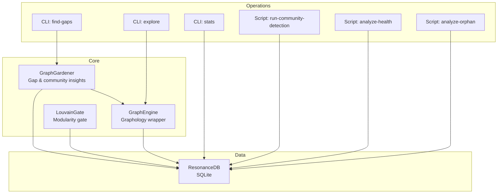
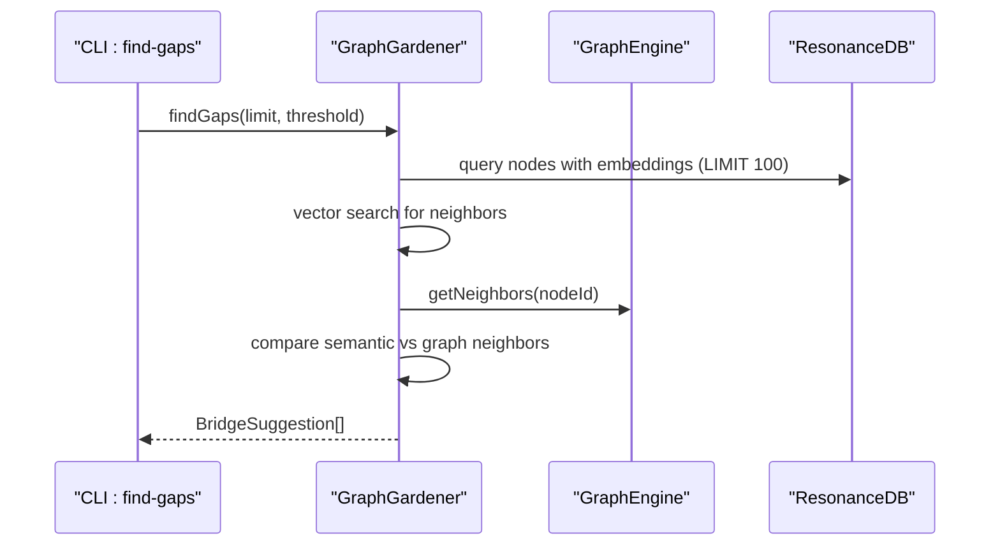
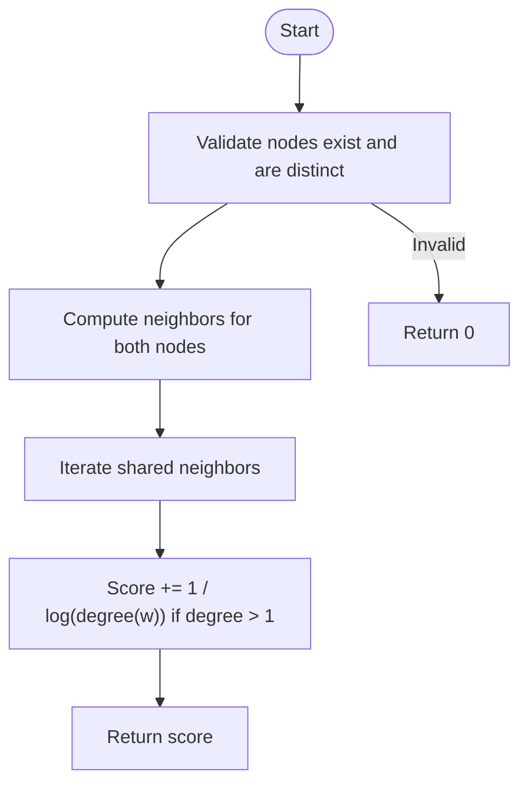
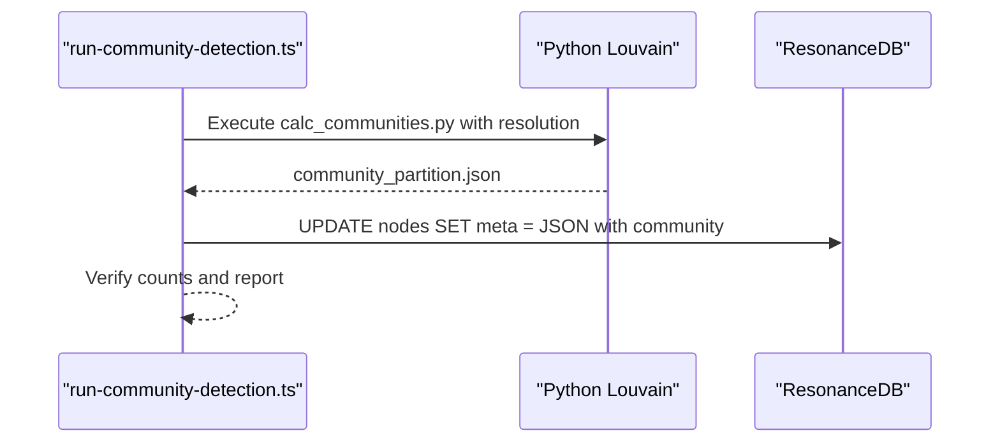
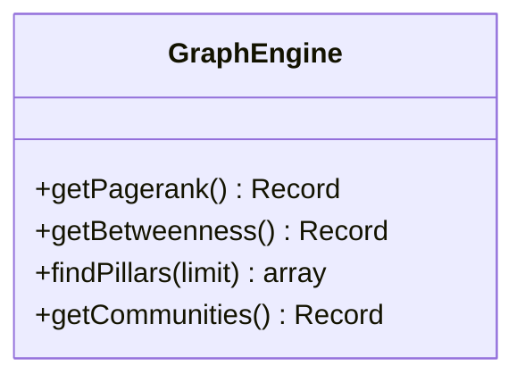
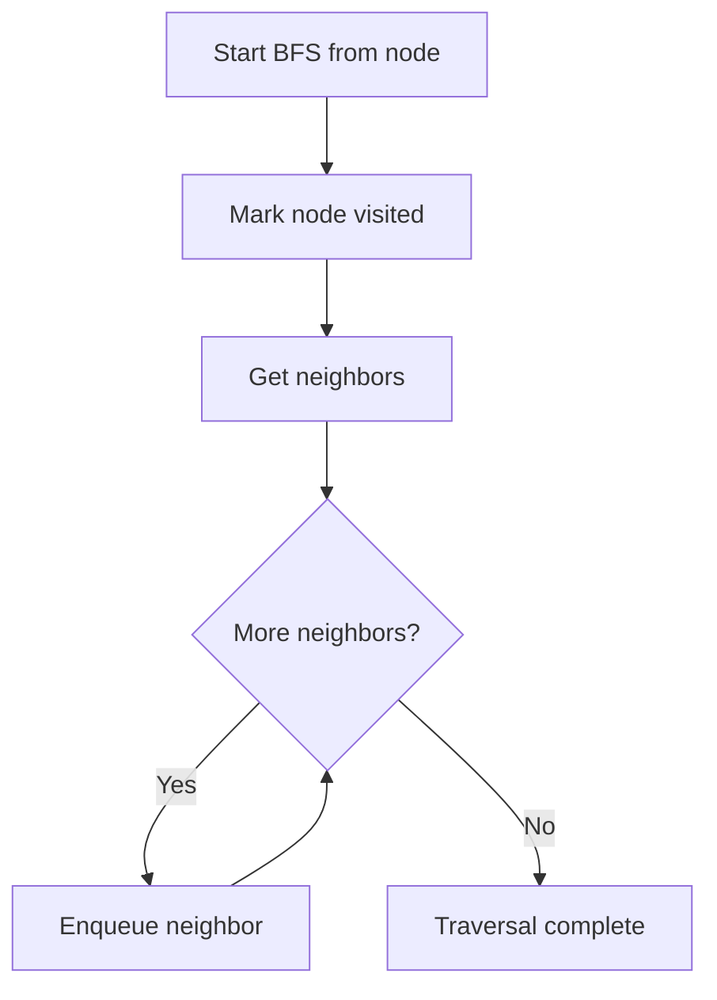
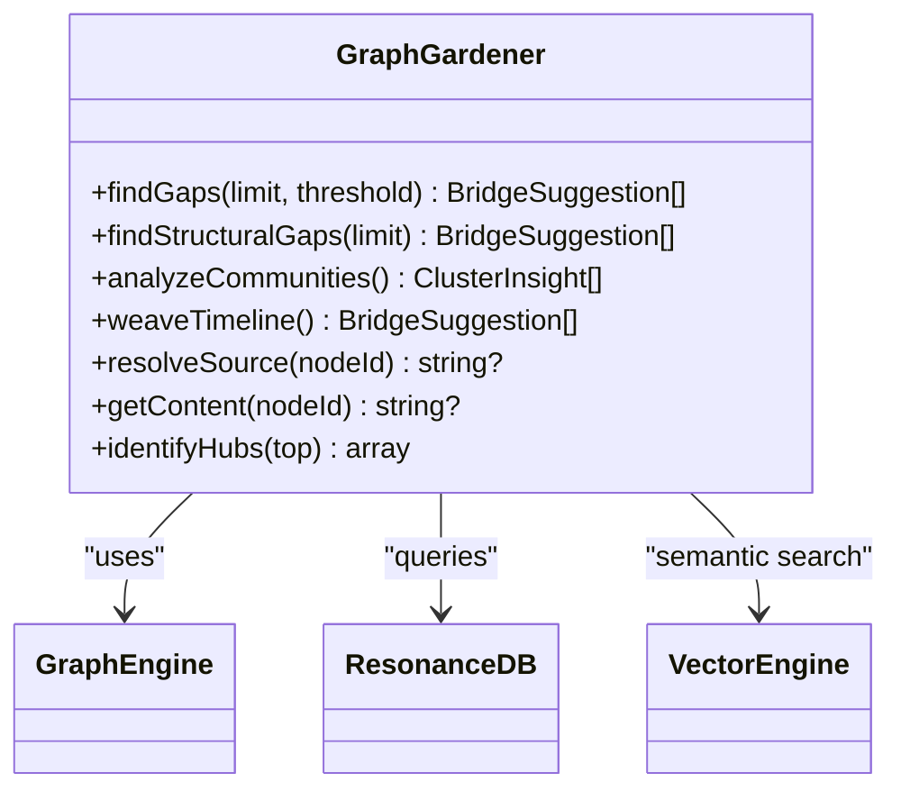
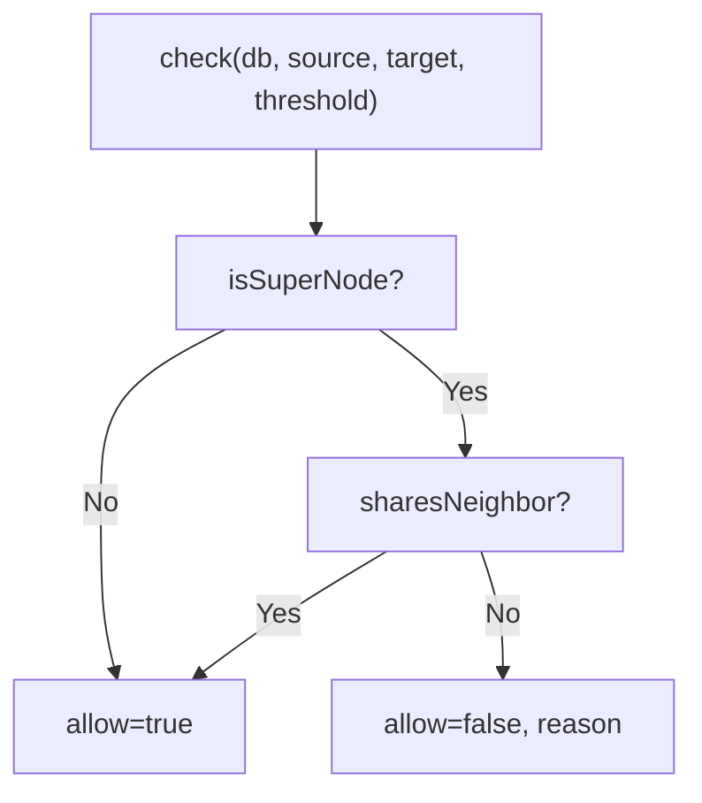
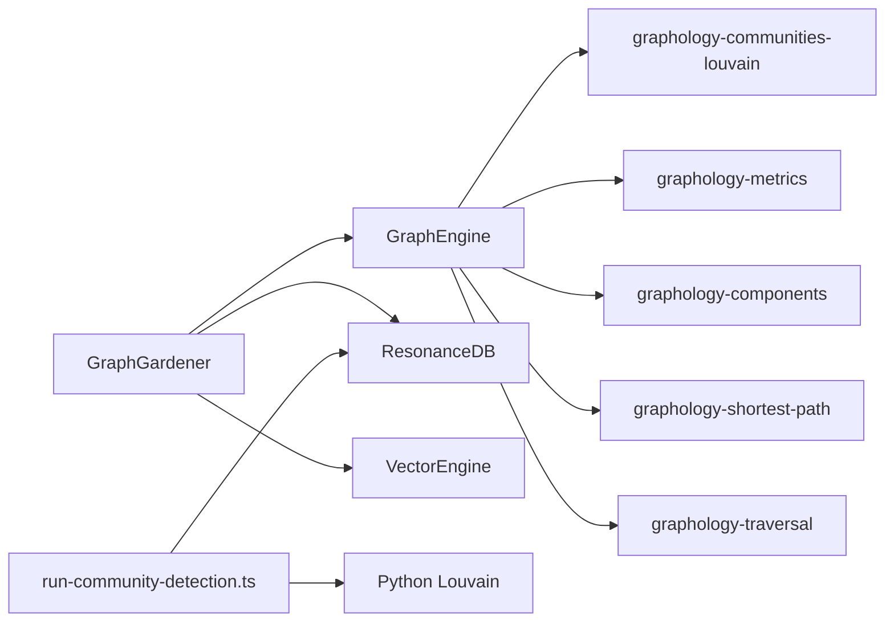

# Graph Analysis and Algorithms

<cite>
**Referenced Files in This Document**
- [GraphEngine.ts](file://src/core/GraphEngine.ts)
- [GraphGardener.ts](file://src/core/GraphGardener.ts)
- [LouvainGate.ts](file://src/core/LouvainGate.ts)
- [run-community-detection.ts](file://scripts/run-community-detection.ts)
- [find-gaps.ts](file://src/cli/commands/find-gaps.ts)
- [explore.ts](file://src/cli/commands/explore.ts)
- [stats.ts](file://src/cli/commands/stats.ts)
- [analyze_health.ts](file://scripts/verify/analyze_health.ts)
- [analyze_orphans.ts](file://scripts/verify/analyze_orphans.ts)
- [graph-enhancement-strategies.md](file://docs/graph-enhancement-strategies.md)
- [phase6-graphology-workflows.md](file://debriefs/2026-01-13-phase6-graphology-workflows.md)
- [strategies.test.ts](file://tests/strategies.test.ts)
</cite>

## Table of Contents
1. [Introduction](#introduction)
2. [Project Structure](#project-structure)
3. [Core Components](#core-components)
4. [Architecture Overview](#architecture-overview)
5. [Detailed Component Analysis](#detailed-component-analysis)
6. [Dependency Analysis](#dependency-analysis)
7. [Performance Considerations](#performance-considerations)
8. [Troubleshooting Guide](#troubleshooting-guide)
9. [Conclusion](#conclusion)
10. [Appendices](#appendices)

## Introduction
This document explains the graph analysis algorithms and community detection capabilities implemented in the project. It focuses on:
- Adamic-Adar index computation for structural relationship prediction
- Automated edge discovery via the findStructuralCandidates method
- Community detection using the Louvain algorithm integrated with graphology-communities-louvain
- Centrality measures (PageRank and Betweenness Centrality)
- Connected components analysis and graph traversal
- The GraphGardener’s role in pruning orphaned nodes and maintaining graph integrity
- Practical examples for running community detection, computing node importance metrics, and performing graph analysis operations
- Performance implications and optimization strategies for large graphs

## Project Structure
The graph analysis features are centered around:
- GraphEngine: In-memory graph management and analytics using Graphology
- GraphGardener: Orchestrates semantic and structural gap analysis and cluster insights
- LouvainGate: Enforces modularity-aware edge acceptance rules
- Scripts and CLI commands for operational tasks and demonstrations

**Diagram sources**
- [GraphEngine.ts](file://src/core/GraphEngine.ts#L39-L313)
- [GraphGardener.ts](file://src/core/GraphGardener.ts#L27-L269)
- [LouvainGate.ts](file://src/core/LouvainGate.ts#L3-L67)
- [find-gaps.ts](file://src/cli/commands/find-gaps.ts#L21-L94)
- [explore.ts](file://src/cli/commands/explore.ts#L9-L153)
- [stats.ts](file://src/cli/commands/stats.ts#L12-L110)
- [run-community-detection.ts](file://scripts/run-community-detection.ts#L24-L154)
- [analyze_health.ts](file://scripts/verify/analyze_health.ts#L1-L87)
- [analyze_orphans.ts](file://scripts/verify/analyze_orphans.ts#L1-L54)

**Section sources**
- [GraphEngine.ts](file://src/core/GraphEngine.ts#L39-L313)
- [GraphGardener.ts](file://src/core/GraphGardener.ts#L27-L269)
- [LouvainGate.ts](file://src/core/LouvainGate.ts#L3-L67)
- [find-gaps.ts](file://src/cli/commands/find-gaps.ts#L21-L94)
- [explore.ts](file://src/cli/commands/explore.ts#L9-L153)
- [stats.ts](file://src/cli/commands/stats.ts#L12-L110)
- [run-community-detection.ts](file://scripts/run-community-detection.ts#L24-L154)
- [analyze_health.ts](file://scripts/verify/analyze_health.ts#L1-L87)
- [analyze_orphans.ts](file://scripts/verify/analyze_orphans.ts#L1-L54)

## Core Components
- GraphEngine: Loads nodes and edges into an in-memory MultiDirectedGraph, exposes analytics (shortest path, neighbors, PageRank, Betweenness, communities, connected components), and supports traversal and integrity checks. It also implements Adamic-Adar scoring and structural candidate discovery.
- GraphGardener: Bridges semantic and structural analysis by finding semantic gaps (vector neighbors not graph-linked), structural gaps (Adamic-Adar), community insights, and temporal sequencing. It also resolves sources and retrieves content for nodes.
- LouvainGate: Enforces modularity-aware edge acceptance by detecting “super nodes” and requiring triadic closure for edges targeting high-degree nodes.

**Section sources**
- [GraphEngine.ts](file://src/core/GraphEngine.ts#L39-L313)
- [GraphGardener.ts](file://src/core/GraphGardener.ts#L27-L269)
- [LouvainGate.ts](file://src/core/LouvainGate.ts#L3-L67)

## Architecture Overview
The system integrates SQLite-backed storage with Graphology for fast analytics and traversal. GraphEngine loads a hollow representation of nodes and edges into memory, enabling efficient metric computations and traversals. GraphGardener orchestrates higher-level workflows combining vector search and graph topology. Community detection is supported both via a Python-based pipeline and via Graphology’s Louvain integration for in-memory analytics.

**Diagram sources**
- [find-gaps.ts](file://src/cli/commands/find-gaps.ts#L21-L94)
- [GraphGardener.ts](file://src/core/GraphGardener.ts#L38-L99)
- [GraphEngine.ts](file://src/core/GraphEngine.ts#L105-L108)

## Detailed Component Analysis

### Adamic-Adar Index and Structural Candidate Discovery
- Adamic-Adar index quantifies the likelihood of a relationship between two nodes based on shared neighbors, weighting rare neighbors more heavily.
- The implementation:
  - Validates node existence and avoids self-pairs
  - Computes the score as the sum over shared neighbors w of 1 / log(degree(w)), excluding isolated neighbors
- Structural candidate discovery:
  - Enumerates all node pairs, filters those not already connected
  - Scores pairs using Adamic-Adar and returns the top candidates

**Diagram sources**
- [GraphEngine.ts](file://src/core/GraphEngine.ts#L178-L197)

**Section sources**
- [GraphEngine.ts](file://src/core/GraphEngine.ts#L178-L197)
- [GraphEngine.ts](file://src/core/GraphEngine.ts#L203-L238)

### Community Detection with Louvain
- In-memory Louvain clustering via graphology-communities-louvain
- A dedicated Python pipeline can compute partitions externally and persist community IDs to nodes’ metadata for long-term storage and retrieval

**Diagram sources**
- [run-community-detection.ts](file://scripts/run-community-detection.ts#L24-L154)

**Section sources**
- [GraphEngine.ts](file://src/core/GraphEngine.ts#L129-L133)
- [run-community-detection.ts](file://scripts/run-community-detection.ts#L24-L154)

### Centrality Measures: PageRank and Betweenness Centrality
- PageRank: Global authority measure indicating node influence
- Betweenness Centrality: Local bridge measure indicating how often a node lies on shortest paths between pairs
- Both are computed using graphology-metrics and exposed via GraphEngine

**Diagram sources**
- [GraphEngine.ts](file://src/core/GraphEngine.ts#L138-L147)
- [GraphEngine.ts](file://src/core/GraphEngine.ts#L244-L255)
- [GraphEngine.ts](file://src/core/GraphEngine.ts#L260-L269)

**Section sources**
- [GraphEngine.ts](file://src/core/GraphEngine.ts#L138-L147)
- [GraphEngine.ts](file://src/core/GraphEngine.ts#L244-L255)
- [GraphEngine.ts](file://src/core/GraphEngine.ts#L260-L269)

### Connected Components and Graph Traversal
- Connected components analysis identifies disconnected subgraphs
- Breadth-first traversal supports graph exploration from a seed node with optional depth limiting

**Diagram sources**
- [GraphEngine.ts](file://src/core/GraphEngine.ts#L293-L303)
- [analyze_health.ts](file://scripts/verify/analyze_health.ts#L45-L67)

**Section sources**
- [GraphEngine.ts](file://src/core/GraphEngine.ts#L150-L154)
- [GraphEngine.ts](file://src/core/GraphEngine.ts#L293-L303)
- [analyze_health.ts](file://scripts/verify/analyze_health.ts#L31-L67)

### GraphGardener: Pruning Orphaned Nodes and Maintaining Integrity
- Identifies orphaned nodes (isolated from edges) and groups them by type for reporting
- Provides helpers to resolve source paths and fetch content for nodes
- Offers gap analysis combining semantic similarity and structural topology

**Diagram sources**
- [GraphGardener.ts](file://src/core/GraphGardener.ts#L27-L269)

**Section sources**
- [GraphGardener.ts](file://src/core/GraphGardener.ts#L38-L99)
- [GraphGardener.ts](file://src/core/GraphGardener.ts#L105-L115)
- [GraphGardener.ts](file://src/core/GraphGardener.ts#L120-L133)
- [GraphGardener.ts](file://src/core/GraphGardener.ts#L155-L195)
- [GraphGardener.ts](file://src/core/GraphGardener.ts#L205-L254)
- [GraphGardener.ts](file://src/core/GraphGardener.ts#L256-L268)

### LouvainGate: Modularity-Aware Edge Acceptance
- Prevents low-quality edges to “super nodes” by enforcing triadic closure
- Useful for gating new edges during ingestion to maintain local modularity

**Diagram sources**
- [LouvainGate.ts](file://src/core/LouvainGate.ts#L15-L36)

**Section sources**
- [LouvainGate.ts](file://src/core/LouvainGate.ts#L3-L67)

## Dependency Analysis
- GraphEngine depends on:
  - graphology for graph representation and traversal
  - graphology-communities-louvain for community detection
  - graphology-metrics for centrality measures
  - graphology-components for connected components
  - graphology-shortest-path for shortest path computation
- GraphGardener depends on:
  - GraphEngine for structural analytics
  - ResonanceDB for node metadata and content
  - VectorEngine for semantic neighbor search
- Operational scripts depend on:
  - ResonanceDB for persistence of community partitions
  - Python environment for Louvain computation

**Diagram sources**
- [GraphEngine.ts](file://src/core/GraphEngine.ts#L1-L14)
- [GraphGardener.ts](file://src/core/GraphGardener.ts#L1-L6)
- [run-community-detection.ts](file://scripts/run-community-detection.ts#L12-L14)

**Section sources**
- [GraphEngine.ts](file://src/core/GraphEngine.ts#L1-L14)
- [GraphGardener.ts](file://src/core/GraphGardener.ts#L1-L6)
- [run-community-detection.ts](file://scripts/run-community-detection.ts#L12-L14)

## Performance Considerations
- In-memory analytics:
  - GraphEngine loads a hollow representation of nodes and edges, minimizing I/O overhead for analytics
  - Prefer batch operations and avoid repeated conversions between DB and Graphology
- Adamic-Adar and structural candidate discovery:
  - Complexity scales with node degree and shared neighbor enumeration; consider limiting search radius or sampling for very large graphs
  - Use thresholds and limits to cap output volume
- Community detection:
  - Graphology Louvain is efficient for moderate graphs; for large graphs, prefer the Python pipeline and persist partitions
  - Tune resolution parameter to balance granularity and runtime
- Traversal and connected components:
  - BFS traversal and component counting are linear in edges plus nodes; cache results when reusing metrics
- Integrity checks:
  - Use validateIntegrity to monitor self-loops and component counts; address anomalies early to keep downstream algorithms effective

[No sources needed since this section provides general guidance]

## Troubleshooting Guide
- Orphaned nodes:
  - Use the orphan analysis script to identify isolated nodes by type and estimate orphan rate
- Graph health:
  - Use the health analysis script to compute density, average degree, and component distribution; look for fragmented graphs
- CLI usage:
  - Use the explore command to inspect outgoing edges for a node and filter by relation type
  - Use the stats command to check database freshness and optionally list orphans
- Community detection:
  - If partitions are missing, run the community detection script to compute and persist partitions
- Modularity gates:
  - If edge insertion is blocked, check whether the target is a super node and whether triadic closure exists

**Section sources**
- [analyze_orphans.ts](file://scripts/verify/analyze_orphans.ts#L1-L54)
- [analyze_health.ts](file://scripts/verify/analyze_health.ts#L1-L87)
- [explore.ts](file://src/cli/commands/explore.ts#L9-L153)
- [stats.ts](file://src/cli/commands/stats.ts#L12-L110)
- [run-community-detection.ts](file://scripts/run-community-detection.ts#L24-L154)
- [LouvainGate.ts](file://src/core/LouvainGate.ts#L15-L36)

## Conclusion
The project provides a robust, modular toolkit for graph analysis and community detection:
- Fast in-memory analytics via GraphEngine
- Structured workflows via GraphGardener integrating semantics and topology
- Practical operational scripts for community detection and integrity checks
- Clear extension points for performance tuning and large-scale deployments

[No sources needed since this section summarizes without analyzing specific files]

## Appendices

### Practical Examples

- Run community detection and persist partitions:
  - Execute the community detection script with an optional resolution parameter; it invokes a Python Louvain script, loads the resulting partition, and writes community IDs into node metadata
  - Reference: [run-community-detection.ts](file://scripts/run-community-detection.ts#L24-L154)

- Compute node importance metrics:
  - Use GraphEngine to retrieve PageRank and Betweenness scores; optionally derive “pillar” nodes as top PageRank nodes
  - References:
    - [GraphEngine.ts](file://src/core/GraphEngine.ts#L138-L147)
    - [GraphEngine.ts](file://src/core/GraphEngine.ts#L244-L255)

- Discover structural candidates:
  - Call findStructuralCandidates on GraphEngine to identify unconnected node pairs with high Adamic-Adar scores
  - References:
    - [GraphEngine.ts](file://src/core/GraphEngine.ts#L178-L197)
    - [GraphEngine.ts](file://src/core/GraphEngine.ts#L203-L238)

- Analyze gaps and clusters:
  - Use GraphGardener to find semantic gaps (vector neighbors not graph-linked) and structural gaps (Adamic-Adar), and to analyze communities and representative nodes
  - References:
    - [GraphGardener.ts](file://src/core/GraphGardener.ts#L38-L99)
    - [GraphGardener.ts](file://src/core/GraphGardener.ts#L105-L115)
    - [GraphGardener.ts](file://src/core/GraphGardener.ts#L120-L133)
    - [GraphGardener.ts](file://src/core/GraphGardener.ts#L140-L143)

- Validate graph integrity:
  - Use CLI commands and verification scripts to check for dangling edges, self-loops, orphaned nodes, and component distribution
  - References:
    - [explore.ts](file://src/cli/commands/explore.ts#L9-L153)
    - [stats.ts](file://src/cli/commands/stats.ts#L12-L110)
    - [analyze_health.ts](file://scripts/verify/analyze_health.ts#L1-L87)
    - [analyze_orphans.ts](file://scripts/verify/analyze_orphans.ts#L1-L54)

- Strategy alignment:
  - The documented strategies outline how to combine vector search, LLM verification, and graph topology for high-quality edge discovery and topic summarization
  - Reference: [graph-enhancement-strategies.md](file://docs/graph-enhancement-strategies.md#L1-L66)

**Section sources**
- [run-community-detection.ts](file://scripts/run-community-detection.ts#L24-L154)
- [GraphEngine.ts](file://src/core/GraphEngine.ts#L138-L147)
- [GraphEngine.ts](file://src/core/GraphEngine.ts#L244-L255)
- [GraphEngine.ts](file://src/core/GraphEngine.ts#L178-L197)
- [GraphEngine.ts](file://src/core/GraphEngine.ts#L203-L238)
- [GraphGardener.ts](file://src/core/GraphGardener.ts#L38-L99)
- [GraphGardener.ts](file://src/core/GraphGardener.ts#L105-L115)
- [GraphGardener.ts](file://src/core/GraphGardener.ts#L120-L133)
- [GraphGardener.ts](file://src/core/GraphGardener.ts#L140-L143)
- [explore.ts](file://src/cli/commands/explore.ts#L9-L153)
- [stats.ts](file://src/cli/commands/stats.ts#L12-L110)
- [analyze_health.ts](file://scripts/verify/analyze_health.ts#L1-L87)
- [analyze_orphans.ts](file://scripts/verify/analyze_orphans.ts#L1-L54)
- [graph-enhancement-strategies.md](file://docs/graph-enhancement-strategies.md#L1-L66)