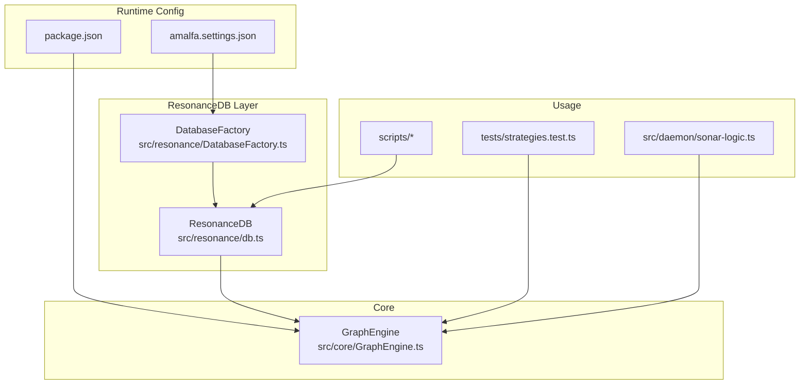
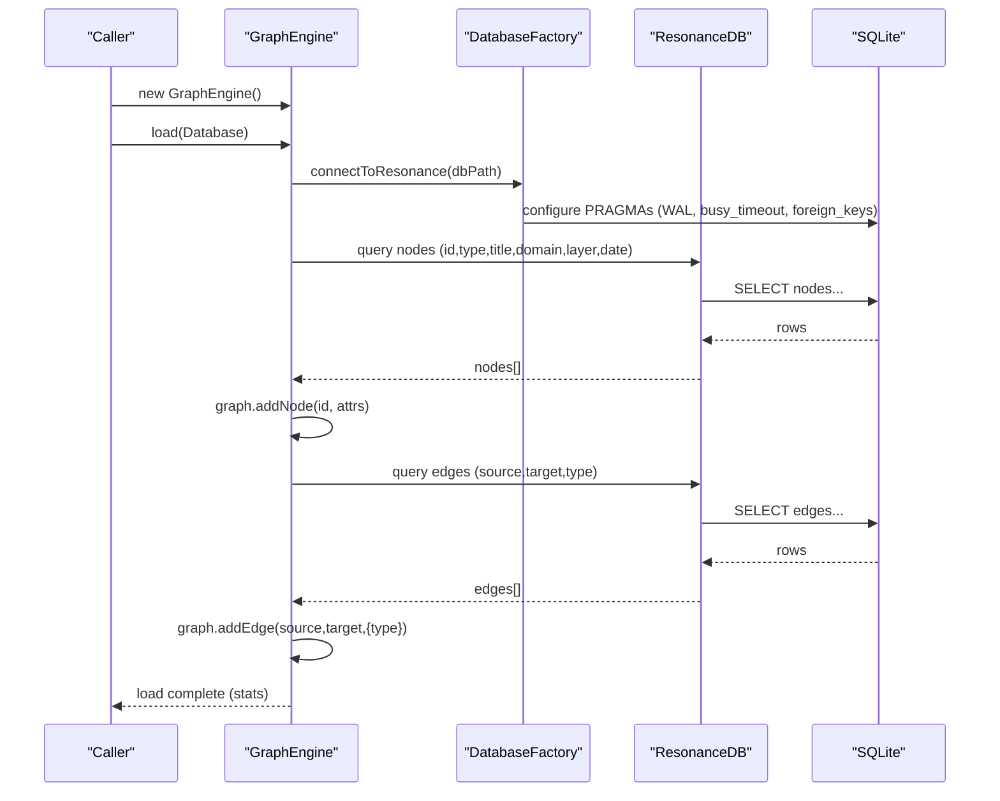
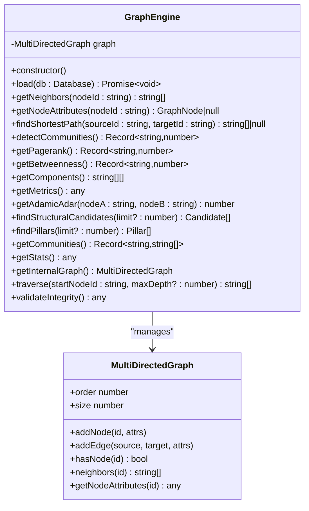
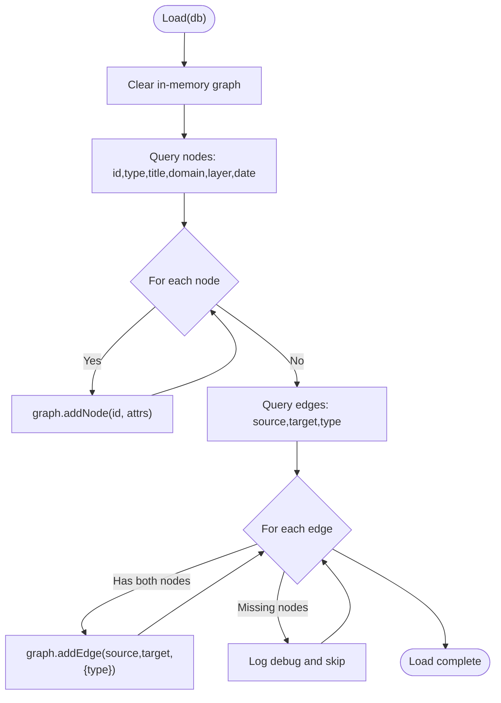
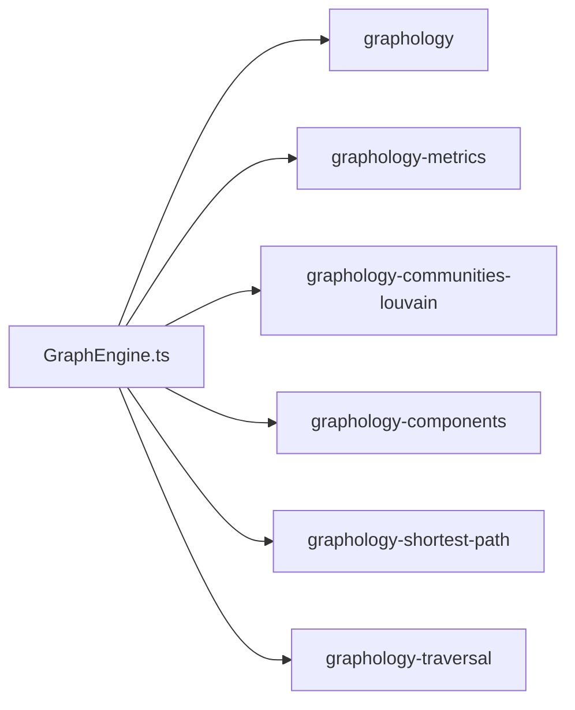

# Graph Engine Core

<cite>
**Referenced Files in This Document**
- [GraphEngine.ts](file://src/core/GraphEngine.ts)
- [db.ts](file://src/resonance/db.ts)
- [DatabaseFactory.ts](file://src/resonance/DatabaseFactory.ts)
- [package.json](file://package.json)
- [amalfa.settings.json](file://amalfa.settings.json)
- [strategies.test.ts](file://tests/strategies.test.ts)
- [sonar-logic.ts](file://src/daemon/sonar-logic.ts)
- [verify_ingest.ts](file://scripts/verify/verify_ingest.ts)
- [debug_node.ts](file://scripts/verify/debug_node.ts)
</cite>

## Table of Contents
1. [Introduction](#introduction)
2. [Project Structure](#project-structure)
3. [Core Components](#core-components)
4. [Architecture Overview](#architecture-overview)
5. [Detailed Component Analysis](#detailed-component-analysis)
6. [Dependency Analysis](#dependency-analysis)
7. [Performance Considerations](#performance-considerations)
8. [Troubleshooting Guide](#troubleshooting-guide)
9. [Conclusion](#conclusion)
10. [Appendices](#appendices)

## Introduction
This document explains the Graph Engine core implementation that manages an in-memory directed multigraph using the Graphology library. It covers construction, loading from ResonanceDB (SQLite), the hollow nodes pattern for memory efficiency, and a broad set of graph operations including neighbor retrieval, attribute access, shortest path computation, traversal, centrality metrics (PageRank, Betweenness), community detection (Louvain), connected components analysis, and advanced strategies such as Adamic–Adar link prediction and pillar identification. Practical examples demonstrate loading, manipulation, and querying, along with performance considerations for large knowledge bases.

## Project Structure
The Graph Engine resides in the core module and integrates with ResonanceDB for persistent storage. The database is accessed via a factory that ensures compliant SQLite configuration (WAL mode, busy timeouts, foreign keys). The engine exposes a minimal API for graph operations and analysis.

**Diagram sources**
- [GraphEngine.ts](file://src/core/GraphEngine.ts#L39-L44)
- [DatabaseFactory.ts](file://src/resonance/DatabaseFactory.ts#L13-L66)
- [db.ts](file://src/resonance/db.ts#L25-L68)
- [amalfa.settings.json](file://amalfa.settings.json#L10-L10)
- [package.json](file://package.json#L88-L89)
- [strategies.test.ts](file://tests/strategies.test.ts#L1-L116)
- [sonar-logic.ts](file://src/daemon/sonar-logic.ts#L579-L603)

**Section sources**
- [GraphEngine.ts](file://src/core/GraphEngine.ts#L39-L44)
- [DatabaseFactory.ts](file://src/resonance/DatabaseFactory.ts#L13-L66)
- [db.ts](file://src/resonance/db.ts#L25-L68)
- [amalfa.settings.json](file://amalfa.settings.json#L10-L10)
- [package.json](file://package.json#L88-L89)

## Core Components
- GraphEngine: In-memory graph manager backed by Graphology’s MultiDirectedGraph. Provides node/edge loading, traversal, shortest path, centrality, community detection, connected components, and advanced strategies.
- ResonanceDB: SQLite abstraction layer with migrations, typed accessors, and transaction support.
- DatabaseFactory: Ensures SQLite is configured for concurrency and performance (WAL, busy_timeout, foreign_keys).

Key responsibilities:
- Construction: Initializes an empty MultiDirectedGraph with self-loops allowed.
- Loading: Reads nodes and edges from ResonanceDB and populates the in-memory graph.
- Operations: Neighbors, attributes, BFS traversal, shortest path, metrics, and strategies.
- Integration: Works with ResonanceDB for persistence and with external tools via the internal graph handle.

**Section sources**
- [GraphEngine.ts](file://src/core/GraphEngine.ts#L39-L44)
- [GraphEngine.ts](file://src/core/GraphEngine.ts#L50-L100)
- [GraphEngine.ts](file://src/core/GraphEngine.ts#L105-L303)
- [db.ts](file://src/resonance/db.ts#L25-L68)
- [DatabaseFactory.ts](file://src/resonance/DatabaseFactory.ts#L13-L66)

## Architecture Overview
The Graph Engine sits between the persistent ResonanceDB and application services. It loads a compact “hollow” representation of nodes (metadata only) and edges, enabling fast in-memory analytics and traversal without embedding overhead.

**Diagram sources**
- [GraphEngine.ts](file://src/core/GraphEngine.ts#L50-L100)
- [DatabaseFactory.ts](file://src/resonance/DatabaseFactory.ts#L18-L66)
- [db.ts](file://src/resonance/db.ts#L32-L68)

## Detailed Component Analysis

### GraphEngine Class
The GraphEngine class encapsulates a MultiDirectedGraph and exposes a concise API for graph operations and analysis.

**Diagram sources**
- [GraphEngine.ts](file://src/core/GraphEngine.ts#L39-L313)

Key methods and behaviors:
- Constructor: Initializes an empty MultiDirectedGraph with self-loops allowed.
- load(db): Clears the graph, loads nodes and edges from ResonanceDB, and logs timing and counts.
- getNeighbors(nodeId): Returns adjacent node ids or empty array if node absent.
- getNodeAttributes(nodeId): Returns node attributes or null if absent.
- findShortestPath(sourceId, targetId): Unweighted bidirectional shortest path via Graphology.
- detectCommunities(): Louvain community detection via graphology-communities-louvain.
- getPagerank(), getBetweenness(): Metrics via graphology-metrics.
- getComponents(): Connected components via graphology-components.
- getMetrics(): Aggregates PageRank, Betweenness, communities, component count, and stats.
- getAdamicAdar(nodeA, nodeB): Link prediction score based on shared neighbors and degrees.
- findStructuralCandidates(limit): Identifies candidate edges using Adamic–Adar and two-hop filtering.
- findPillars(limit): Authorities by PageRank (and degree).
- getCommunities(): Maps community IDs to node lists.
- getStats(): Node count, edge count, and density.
- getInternalGraph(): Exposes the internal graph for external tools.
- traverse(startNodeId, maxDepth?): Breadth-first traversal with optional depth limit.
- validateIntegrity(): Reports self-loop count, connected components, order, and size.

**Section sources**
- [GraphEngine.ts](file://src/core/GraphEngine.ts#L42-L44)
- [GraphEngine.ts](file://src/core/GraphEngine.ts#L50-L100)
- [GraphEngine.ts](file://src/core/GraphEngine.ts#L105-L303)

### Node and Edge Loading Mechanisms
- Nodes: Selected columns include id, type, title, domain, layer, date. These are added as nodes with attributes.
- Edges: Loaded only if both source and target nodes exist in the graph; otherwise skipped with a debug log.
- Hollow nodes: The GraphEngine loads only structural metadata, deferring content hydration to specialized components.

**Diagram sources**
- [GraphEngine.ts](file://src/core/GraphEngine.ts#L50-L100)

**Section sources**
- [GraphEngine.ts](file://src/core/GraphEngine.ts#L50-L100)

### Hollow Nodes Concept
- Purpose: Reduce memory footprint by excluding large BLOBs (e.g., embeddings) during in-memory graph operations.
- Implementation: GraphEngine.load selects only lightweight node metadata; content hydration is handled elsewhere (e.g., GraphGardener).
- Benefits: Faster loading, smaller RAM usage, and efficient traversal and analytics.

**Section sources**
- [GraphEngine.ts](file://src/core/GraphEngine.ts#L47-L49)
- [db.ts](file://src/resonance/db.ts#L83-L134)

### Graph Operations
- Neighbor Retrieval: O(k) per node where k is degree.
- Attribute Access: O(1) average.
- Shortest Path: Unweighted bidirectional search via Graphology; complexity depends on branching factor and radius.
- Traversal: BFS with optional depth cutoff; visits up to O(V + E) nodes/edges.
- Metrics:
  - PageRank: O(V + E) per run.
  - Betweenness: O(V·(V+E)) typical worst-case; optimized in practice.
  - Louvain: O(E·L) where L is number of iterations.
  - Connected Components: O(V + E).

**Section sources**
- [GraphEngine.ts](file://src/core/GraphEngine.ts#L105-L303)

### Integration with Graphology Algorithms
- PageRank: Implemented via graphology-metrics.
- Betweenness: Implemented via graphology-metrics.
- Louvain: Implemented via graphology-communities-louvain.
- Connected Components: Implemented via graphology-components.
- Shortest Path: Implemented via graphology-shortest-path/unweighted.

**Section sources**
- [GraphEngine.ts](file://src/core/GraphEngine.ts#L1-L14)
- [package.json](file://package.json#L88-L89)

### Practical Examples

#### Example: Loading a Graph from ResonanceDB
- Connect via DatabaseFactory and ResonanceDB.
- Instantiate GraphEngine and call load(db).
- Verify stats and integrity.

References:
- [DatabaseFactory.ts](file://src/resonance/DatabaseFactory.ts#L18-L66)
- [db.ts](file://src/resonance/db.ts#L32-L68)
- [GraphEngine.ts](file://src/core/GraphEngine.ts#L50-L100)

#### Example: Manipulation and Querying
- Retrieve neighbors and attributes.
- Compute shortest path.
- Run BFS traversal.

References:
- [GraphEngine.ts](file://src/core/GraphEngine.ts#L105-L126)
- [GraphEngine.ts](file://src/core/GraphEngine.ts#L293-L303)

#### Example: Community Detection and Metrics
- Detect communities and compute PageRank/Betweenness.
- Aggregate metrics and export stats.

References:
- [GraphEngine.ts](file://src/core/GraphEngine.ts#L129-L171)

#### Example: Adamic–Adar and Structural Candidates
- Compute Adamic–Adar scores and propose new edges.

References:
- [GraphEngine.ts](file://src/core/GraphEngine.ts#L178-L238)
- [strategies.test.ts](file://tests/strategies.test.ts#L68-L85)

#### Example: Pillar Identification
- Rank nodes by PageRank and degree to identify authorities.

References:
- [GraphEngine.ts](file://src/core/GraphEngine.ts#L244-L255)
- [strategies.test.ts](file://tests/strategies.test.ts#L87-L94)

#### Example: Daemon Integration
- Sonar agent explores neighbors and injects leads.

References:
- [sonar-logic.ts](file://src/daemon/sonar-logic.ts#L587-L598)

## Dependency Analysis
External libraries and their roles:
- graphology: Core graph data structures and utilities.
- graphology-metrics: Centrality algorithms (PageRank, Betweenness).
- graphology-communities-louvain: Community detection.
- graphology-components: Connected components.
- graphology-shortest-path: Unweighted shortest path.
- graphology-traversal: BFS traversal.

**Diagram sources**
- [GraphEngine.ts](file://src/core/GraphEngine.ts#L1-L14)
- [package.json](file://package.json#L88-L89)

**Section sources**
- [GraphEngine.ts](file://src/core/GraphEngine.ts#L1-L14)
- [package.json](file://package.json#L88-L89)

## Performance Considerations
- Memory management
  - Use hollow nodes: Load only metadata to minimize memory usage.
  - Avoid embedding hydration during graph operations; defer to specialized components.
- Database configuration
  - WAL mode, busy_timeout, and foreign_keys improve reliability and concurrency.
- Algorithmic complexity
  - Prefer BFS for shortest path in unweighted graphs.
  - Louvain and Betweenness are expensive on large graphs; consider sampling or partitioning.
- Practical tips
  - Batch operations when adding nodes/edges programmatically.
  - Use traverse with maxDepth to bound work.
  - Cache metric results if recomputation is frequent.

**Section sources**
- [GraphEngine.ts](file://src/core/GraphEngine.ts#L47-L49)
- [DatabaseFactory.ts](file://src/resonance/DatabaseFactory.ts#L44-L66)
- [GraphEngine.ts](file://src/core/GraphEngine.ts#L293-L303)

## Troubleshooting Guide
Common issues and remedies:
- Node not found
  - Ensure node exists before retrieving neighbors or attributes.
  - Use hasNode checks or return guards.
- Edge addition failures
  - Edges are skipped if either endpoint is missing; verify node existence prior to insertion.
- Empty or slow metrics
  - Confirm graph is loaded and not empty; check stats and integrity.
- Database connectivity
  - Validate path and permissions; ensure WAL mode and busy_timeout are active.

References:
- [GraphEngine.ts](file://src/core/GraphEngine.ts#L105-L116)
- [GraphEngine.ts](file://src/core/GraphEngine.ts#L75-L90)
- [GraphEngine.ts](file://src/core/GraphEngine.ts#L305-L312)
- [DatabaseFactory.ts](file://src/resonance/DatabaseFactory.ts#L44-L66)

## Conclusion
The Graph Engine provides a fast, memory-efficient in-memory graph for knowledge base analysis and exploration. By leveraging Graphology algorithms and ResonanceDB’s hollow nodes, it balances performance and scalability. The API supports essential operations—neighborhood queries, traversal, shortest path, and advanced strategies—making it suitable for both interactive exploration and automated discovery.

## Appendices

### API Summary
- Construction: new GraphEngine()
- Loading: load(db)
- Neighborhood: getNeighbors(nodeId)
- Attributes: getNodeAttributes(nodeId)
- Shortest path: findShortestPath(sourceId, targetId)
- Traversal: traverse(startNodeId, maxDepth?)
- Metrics: getPagerank(), getBetweenness(), getComponents(), getMetrics()
- Communities: detectCommunities(), getCommunities()
- Strategies: getAdamicAdar(), findStructuralCandidates(), findPillars()
- Utilities: getStats(), getInternalGraph(), validateIntegrity()

**Section sources**
- [GraphEngine.ts](file://src/core/GraphEngine.ts#L105-L312)

### Runtime Configuration
- Database path: configured in amalfa.settings.json under database.
- Embedding model and dimensions: configured in amalfa.settings.json under embeddings.
- Dependencies: graphology and related plugins listed in package.json.

**Section sources**
- [amalfa.settings.json](file://amalfa.settings.json#L10-L14)
- [package.json](file://package.json#L88-L89)

### Verification Scripts
- verify_ingest.ts: quick check of recent nodes and edges.
- debug_node.ts: inspect edges for a specific node.

**Section sources**
- [verify_ingest.ts](file://scripts/verify/verify_ingest.ts#L1-L14)
- [debug_node.ts](file://scripts/verify/debug_node.ts#L1-L42)