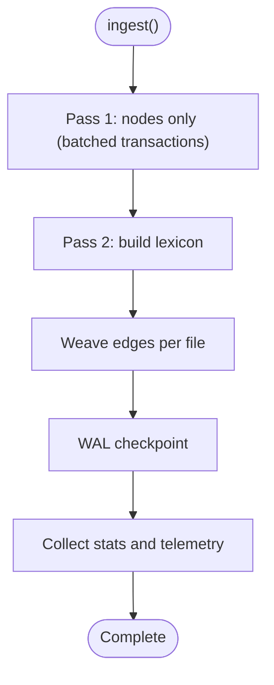

# Knowledge Graph Engine

<cite>
**Referenced Files in This Document**
- [GraphEngine.ts](file://src/core/GraphEngine.ts)
- [EdgeWeaver.ts](file://src/core/EdgeWeaver.ts)
- [GraphGardener.ts](file://src/core/GraphGardener.ts)
- [LouvainGate.ts](file://src/core/LouvainGate.ts)
- [TimelineWeaver.ts](file://src/core/TimelineWeaver.ts)
- [VectorEngine.ts](file://src/core/VectorEngine.ts)
- [AmalfaIngestor.ts](file://src/pipeline/AmalfaIngestor.ts)
- [README.md](file://README.md)
- [00-system.md](file://docs/architecture/00-system.md)
- [01-ingest.md](file://docs/architecture/01-ingest.md)
- [graph-enhancement-strategies.md](file://docs/graph-enhancement-strategies.md)
</cite>

## Table of Contents
1. [Introduction](#introduction)
2. [Project Structure](#project-structure)
3. [Core Components](#core-components)
4. [Architecture Overview](#architecture-overview)
5. [Detailed Component Analysis](#detailed-component-analysis)
6. [Dependency Analysis](#dependency-analysis)
7. [Performance Considerations](#performance-considerations)
8. [Troubleshooting Guide](#troubleshooting-guide)
9. [Conclusion](#conclusion)
10. [Appendices](#appendices)

## Introduction
This document explains Amalfa’s knowledge graph engine implementation. It focuses on how the system builds and maintains an in-memory graph using Graphology, manages nodes and edges, discovers relationships via semantic matching and structural heuristics, and prunes or enhances the graph with integrity checks. It also covers the two-pass ingestion strategy, the EdgeWeaver’s role in constructing relationships, the GraphGardener’s gap and community analysis, Louvain-based community detection, and the TimelineWeaver’s temporal mapping. Practical examples, performance considerations for large knowledge bases, and integration with the vector search system are included.

## Project Structure
The knowledge graph engine spans core graph management, ingestion, and enhancement utilities:
- In-memory graph management and analytics: GraphEngine
- Edge construction and filtering: EdgeWeaver, LouvainGate
- Graph integrity and gap discovery: GraphGardener
- Temporal edge weaving: TimelineWeaver
- Vector search and FAFCAS normalization: VectorEngine
- Two-pass ingestion pipeline: AmalfaIngestor

**Diagram sources**
- [AmalfaIngestor.ts](file://src/pipeline/AmalfaIngestor.ts#L182-L253)
- [GraphEngine.ts](file://src/core/GraphEngine.ts#L50-L100)
- [GraphGardener.ts](file://src/core/GraphGardener.ts#L27-L32)
- [EdgeWeaver.ts](file://src/core/EdgeWeaver.ts#L5-L45)
- [LouvainGate.ts](file://src/core/LouvainGate.ts#L3-L36)
- [TimelineWeaver.ts](file://src/core/TimelineWeaver.ts#L3-L61)
- [VectorEngine.ts](file://src/core/VectorEngine.ts#L76-L109)

**Section sources**
- [README.md](file://README.md#L357-L379)
- [00-system.md](file://docs/architecture/00-system.md#L18-L63)
- [01-ingest.md](file://docs/architecture/01-ingest.md#L18-L63)

## Core Components
- GraphEngine: Loads nodes and edges from SQLite into an in-memory MultiDirectedGraph, exposes traversal, centrality, and community detection, and provides structural gap discovery via Adamic-Adar.
- EdgeWeaver: Scans content for explicit semantic tags, wiki-links, and metadata tags to construct edges, using a lexicon for resolution and the LouvainGate to filter high-risk edges.
- GraphGardener: Bridges semantic and structural analysis to find gaps, analyze communities, and propose temporal edges; integrates with VectorEngine for semantic neighbor comparisons.
- LouvainGate: Prevents “super-node” collapse by rejecting edges to hubs without triadic closure, configurable via a threshold.
- TimelineWeaver: Adds chronological “SUCCEEDS” edges among dated nodes (e.g., debriefs).
- VectorEngine: Generates FAFCAS-normalized embeddings and performs fast dot-product similarity search over stored vectors.

**Section sources**
- [GraphEngine.ts](file://src/core/GraphEngine.ts#L39-L314)
- [EdgeWeaver.ts](file://src/core/EdgeWeaver.ts#L5-L194)
- [GraphGardener.ts](file://src/core/GraphGardener.ts#L27-L270)
- [LouvainGate.ts](file://src/core/LouvainGate.ts#L3-L68)
- [TimelineWeaver.ts](file://src/core/TimelineWeaver.ts#L3-L62)
- [VectorEngine.ts](file://src/core/VectorEngine.ts#L76-L242)

## Architecture Overview
The system follows a local-first, disposable database model: Markdown is the source of truth, SQLite is a fast, ephemeral cache, and Graphology powers in-memory analytics. The ingestion pipeline uses a two-pass strategy to ensure all nodes exist before weaving edges. The graph engine and enhancement utilities operate on the in-memory representation for speed, while persistence occurs in SQLite.

**Diagram sources**
- [AmalfaIngestor.ts](file://src/pipeline/AmalfaIngestor.ts#L70-L91)
- [EdgeWeaver.ts](file://src/core/EdgeWeaver.ts#L168-L181)
- [LouvainGate.ts](file://src/core/LouvainGate.ts#L15-L36)
- [GraphEngine.ts](file://src/core/GraphEngine.ts#L50-L100)
- [VectorEngine.ts](file://src/core/VectorEngine.ts#L159-L242)

## Detailed Component Analysis

### GraphEngine: In-Memory Graph Management
- Loads nodes and edges from SQLite into a MultiDirectedGraph with self-loops allowed.
- Provides neighbor queries, shortest path computation, and graph traversal.
- Exposes centrality measures (PageRank, Betweenness), connected components, and community detection via Louvain.
- Implements Adamic-Adar index for structural link prediction and identifies top candidates for new edges.
- Offers integrity checks (self-loops, connected components) and exports the internal graph for visualization.

**Diagram sources**
- [GraphEngine.ts](file://src/core/GraphEngine.ts#L39-L314)

**Section sources**
- [GraphEngine.ts](file://src/core/GraphEngine.ts#L50-L100)
- [GraphEngine.ts](file://src/core/GraphEngine.ts#L173-L238)
- [GraphEngine.ts](file://src/core/GraphEngine.ts#L305-L312)

### EdgeWeaver: Relationship Discovery and Construction
- Builds a lexicon from existing nodes (ID, title, aliases) for fast resolution.
- Scans content for explicit semantic tags, legacy tag syntax, metadata blocks, wiki-links, and markdown links.
- Inserts edges into SQLite with types like TAGGED_AS, EXEMPLIFIES, CITES, LINKS_TO.
- Uses LouvainGate to reject edges that risk destabilizing hubs (super-nodes) without triadic closure.

**Diagram sources**
- [EdgeWeaver.ts](file://src/core/EdgeWeaver.ts#L54-L166)
- [LouvainGate.ts](file://src/core/LouvainGate.ts#L15-L36)

**Section sources**
- [EdgeWeaver.ts](file://src/core/EdgeWeaver.ts#L54-L166)
- [EdgeWeaver.ts](file://src/core/EdgeWeaver.ts#L168-L181)
- [LouvainGate.ts](file://src/core/LouvainGate.ts#L15-L36)

### GraphGardener: Gap Discovery, Communities, and Timeline
- Semantic gap analysis: Compares vector neighbors with graph neighbors to surface candidates where semantic similarity exists without structural linkage.
- Structural gap analysis: Uses GraphEngine’s Adamic-Adar candidates to propose topological links.
- Community insights: Groups nodes by detected communities and selects hub representatives by PageRank.
- Timeline weaving: Proposes temporal edges (FOLLOWS/PRECEDES) within clusters based on date metadata.
- Utility helpers: Resolves node source paths and retrieves content for enrichment.

**Diagram sources**
- [GraphGardener.ts](file://src/core/GraphGardener.ts#L38-L195)
- [GraphEngine.ts](file://src/core/GraphEngine.ts#L128-L154)
- [VectorEngine.ts](file://src/core/VectorEngine.ts#L159-L242)

**Section sources**
- [GraphGardener.ts](file://src/core/GraphGardener.ts#L38-L115)
- [GraphGardener.ts](file://src/core/GraphGardener.ts#L117-L195)

### LouvainGate: Super-Node Stabilization
- Determines whether a target node is a “super-node” by counting total incident edges.
- Checks if source and target share any common neighbor (triadic closure).
- Rejects edges to super-nodes without closure to preserve local modularity and graph stability.

**Diagram sources**
- [LouvainGate.ts](file://src/core/LouvainGate.ts#L15-L66)

**Section sources**
- [LouvainGate.ts](file://src/core/LouvainGate.ts#L15-L66)

### TimelineWeaver: Temporal Relationship Mapping
- Identifies nodes of a specific type with date metadata (e.g., debriefs).
- Sorts nodes chronologically and inserts “SUCCEEDS” edges between consecutive items within clusters derived from community detection.

**Diagram sources**
- [TimelineWeaver.ts](file://src/core/TimelineWeaver.ts#L4-L61)

**Section sources**
- [TimelineWeaver.ts](file://src/core/TimelineWeaver.ts#L4-L61)

### VectorEngine: FAFCAS Normalization and Fast Search
- Embeds text using a fast embedding model and normalizes vectors to unit length (FAFCAS).
- Stores embeddings as BLOBs and supports dot-product similarity search over unit vectors.
- Provides both query-based and vector-based search pathways.

**Diagram sources**
- [VectorEngine.ts](file://src/core/VectorEngine.ts#L76-L242)

**Section sources**
- [VectorEngine.ts](file://src/core/VectorEngine.ts#L115-L139)
- [VectorEngine.ts](file://src/core/VectorEngine.ts#L159-L242)

### Two-Pass Ingestion Strategy
- Pass 1: Create nodes (and optionally compute embeddings) without inserting edges.
- Pass 2: Build a lexicon from existing nodes and weave edges using EdgeWeaver, which resolves targets via the lexicon and applies LouvainGate filtering.
- Transactions and batching minimize contention and improve throughput.

**Diagram sources**
- [AmalfaIngestor.ts](file://src/pipeline/AmalfaIngestor.ts#L182-L253)
- [AmalfaIngestor.ts](file://src/pipeline/AmalfaIngestor.ts#L359-L370)

**Section sources**
- [AmalfaIngestor.ts](file://src/pipeline/AmalfaIngestor.ts#L70-L91)
- [AmalfaIngestor.ts](file://src/pipeline/AmalfaIngestor.ts#L222-L239)

## Dependency Analysis
- GraphEngine depends on Graphology for graph operations and metrics.
- EdgeWeaver depends on ResonanceDB for lexicon building and edge insertion, and on LouvainGate for edge filtering.
- GraphGardener orchestrates GraphEngine, VectorEngine, and ResonanceDB to find gaps and propose timelines.
- TimelineWeaver depends on ResonanceDB node queries and date parsing.
- VectorEngine encapsulates embedding generation and FAFCAS normalization.

**Diagram sources**
- [GraphEngine.ts](file://src/core/GraphEngine.ts#L3-L12)
- [EdgeWeaver.ts](file://src/core/EdgeWeaver.ts#L1-L3)
- [GraphGardener.ts](file://src/core/GraphGardener.ts#L1-L6)
- [TimelineWeaver.ts](file://src/core/TimelineWeaver.ts#L1-L2)
- [VectorEngine.ts](file://src/core/VectorEngine.ts#L1-L2)

**Section sources**
- [GraphEngine.ts](file://src/core/GraphEngine.ts#L3-L12)
- [EdgeWeaver.ts](file://src/core/EdgeWeaver.ts#L1-L3)
- [GraphGardener.ts](file://src/core/GraphGardener.ts#L1-L6)
- [TimelineWeaver.ts](file://src/core/TimelineWeaver.ts#L1-L2)
- [VectorEngine.ts](file://src/core/VectorEngine.ts#L1-L2)

## Performance Considerations
- In-memory graph: GraphEngine loads nodes and edges into a MultiDirectedGraph for fast traversal and analytics; keep the graph compact and prune or rebuild periodically.
- Two-pass ingestion: Minimizes database contention and avoids partial states during edge creation.
- FAFCAS normalization: Enables cosine similarity via dot products on unit vectors, reducing compute overhead.
- Batching and transactions: AmalfaIngestor batches writes and commits in chunks to reduce busy-wait and improve throughput.
- Community detection: Louvain is efficient for large graphs; tune thresholds to balance granularity and stability.
- Structural link prediction: Adamic-Adar is O(k log n) in typical implementations; cap limits to control candidate sets.
- Vector search: Slim scans (load only id and embedding) and hot loops for scoring reduce memory pressure.

[No sources needed since this section provides general guidance]

## Troubleshooting Guide
- Edges rejected by LouvainGate: Inspect reasons for rejection and consider adding triadic closure or lowering the super-node threshold.
- Empty or missing edges: Verify the lexicon population and content scanning logic; ensure IDs are slugified consistently.
- Graph integrity warnings: Use validateIntegrity to check self-loops and connected components; rebuild or prune as needed.
- WAL checkpoint failures: Confirm database file existence and size after checkpoint; ensure no concurrent writers interfere.
- Slow ingestion: Reduce batch sizes under high concurrency, ensure embeddings are generated only when content is substantial, and monitor telemetry.

**Section sources**
- [LouvainGate.ts](file://src/core/LouvainGate.ts#L20-L36)
- [EdgeWeaver.ts](file://src/core/EdgeWeaver.ts#L168-L181)
- [GraphEngine.ts](file://src/core/GraphEngine.ts#L305-L312)
- [AmalfaIngestor.ts](file://src/pipeline/AmalfaIngestor.ts#L255-L270)

## Conclusion
Amalfa’s knowledge graph engine combines a robust two-pass ingestion pipeline, precise edge construction guided by semantic signals and structural heuristics, and powerful in-memory analytics to maintain a healthy, navigable knowledge graph. The integration of vector search and graph algorithms enables both semantic and topological discovery, while safeguards like LouvainGate protect against destabilizing link additions. Together, these components support scalable knowledge management and agent-driven exploration.

[No sources needed since this section summarizes without analyzing specific files]

## Appendices

### Practical Examples
- Load the in-memory graph from SQLite and compute PageRank and communities.
  - See [GraphEngine.load](file://src/core/GraphEngine.ts#L50-L100) and [GraphEngine.getMetrics](file://src/core/GraphEngine.ts#L159-L171).
- Construct edges from wiki-links and tags in a document.
  - See [EdgeWeaver.weave](file://src/core/EdgeWeaver.ts#L54-L59) and [EdgeWeaver.processWikiLinks](file://src/core/EdgeWeaver.ts#L122-L143).
- Find semantic gaps between nodes lacking structural linkage.
  - See [GraphGardener.findGaps](file://src/core/GraphGardener.ts#L38-L99).
- Detect communities and summarize clusters.
  - See [GraphGardener.analyzeCommunities](file://src/core/GraphGardener.ts#L120-L133) and [Graphology Louvain](file://src/core/GraphEngine.ts#L131-L133).
- Propose temporal edges among dated nodes.
  - See [TimelineWeaver.weave](file://src/core/TimelineWeaver.ts#L4-L61).

**Section sources**
- [GraphEngine.ts](file://src/core/GraphEngine.ts#L50-L100)
- [EdgeWeaver.ts](file://src/core/EdgeWeaver.ts#L54-L143)
- [GraphGardener.ts](file://src/core/GraphGardener.ts#L38-L133)
- [TimelineWeaver.ts](file://src/core/TimelineWeaver.ts#L4-L61)