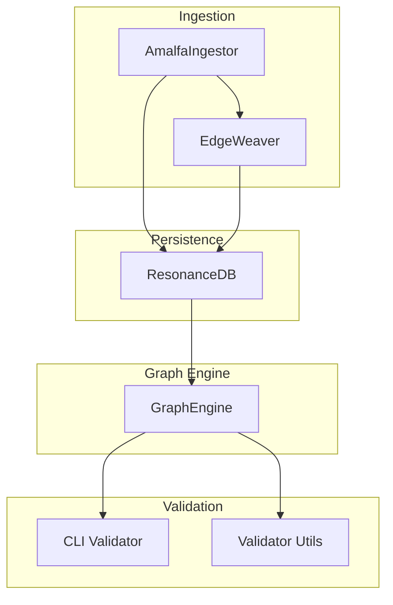
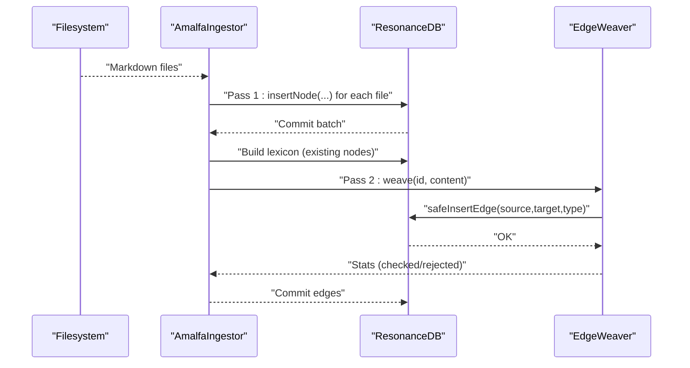
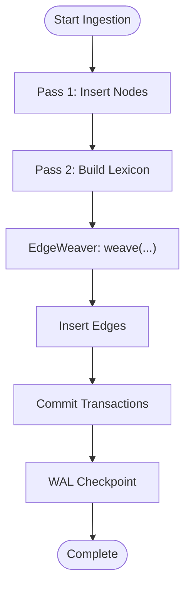
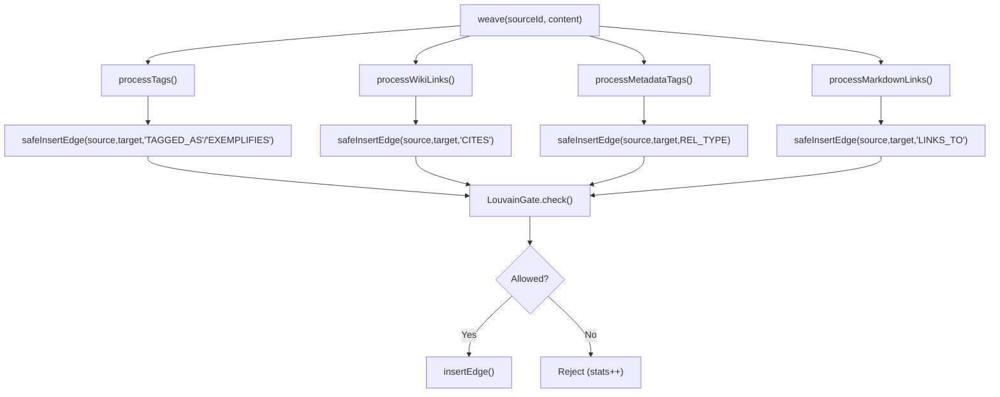
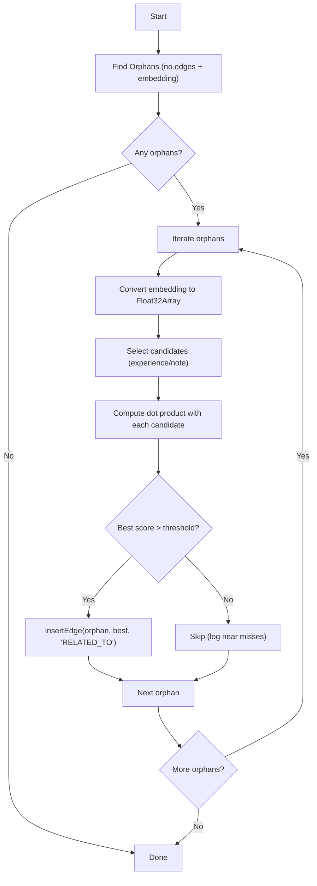
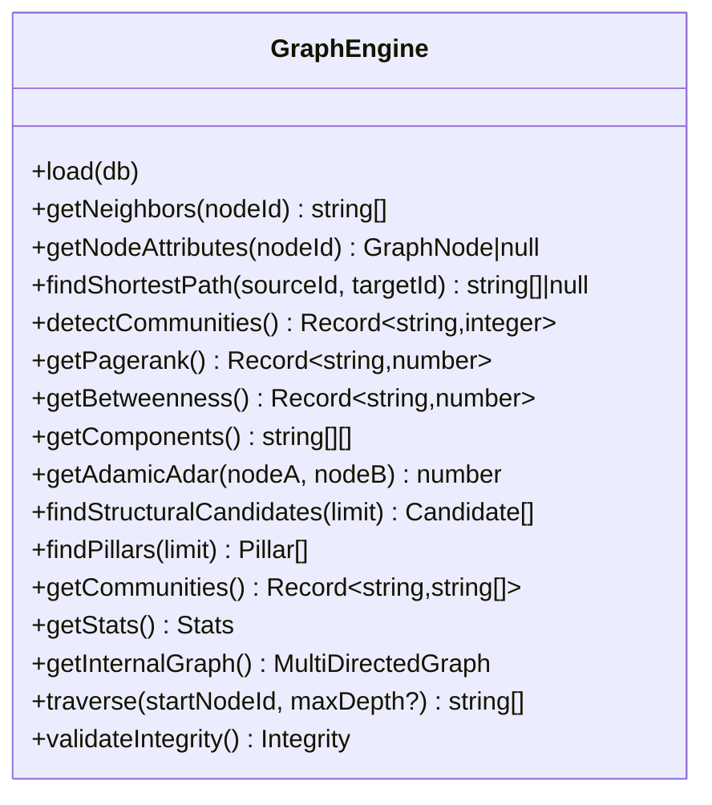
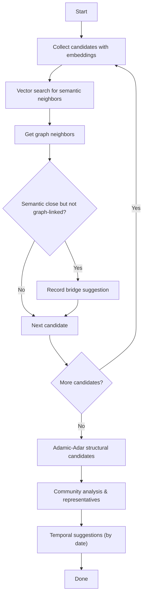
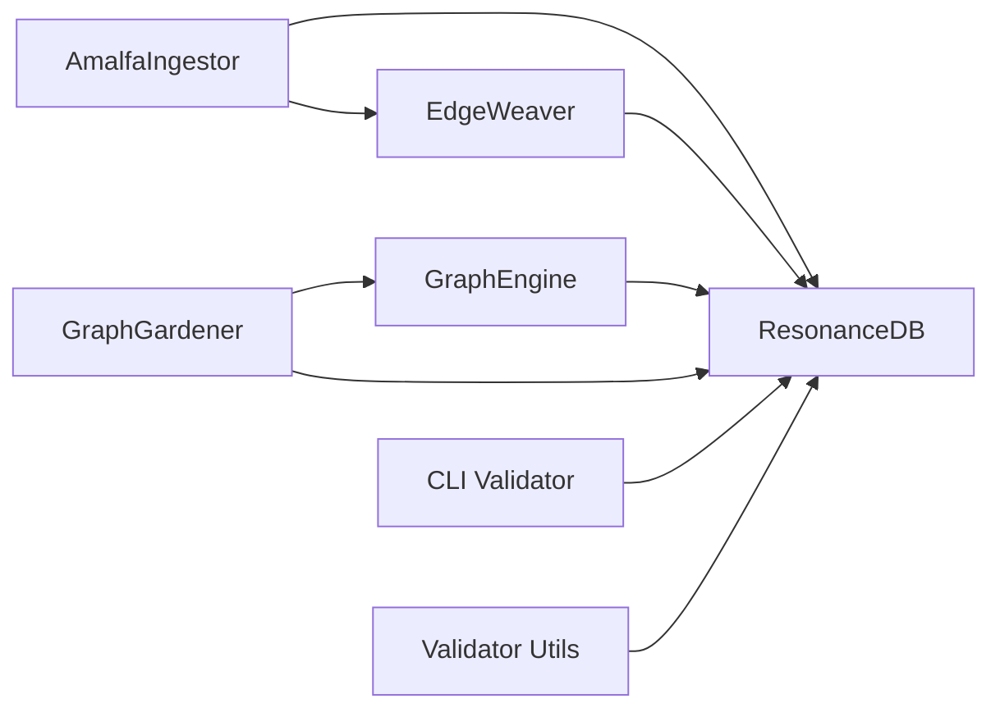

# Node and Edge Management

<cite>
**Referenced Files in This Document**
- [GraphEngine.ts](file://src/core/GraphEngine.ts)
- [EdgeWeaver.ts](file://src/core/EdgeWeaver.ts)
- [SemanticWeaver.ts](file://src/core/SemanticWeaver.ts)
- [GraphGardener.ts](file://src/core/GraphGardener.ts)
- [AmalfaIngestor.ts](file://src/pipeline/AmalfaIngestor.ts)
- [db.ts](file://src/resonance/db.ts)
- [validate.ts](file://src/cli/commands/validate.ts)
- [validator.ts](file://src/utils/validator.ts)
</cite>

## Table of Contents
1. [Introduction](#introduction)
2. [Project Structure](#project-structure)
3. [Core Components](#core-components)
4. [Architecture Overview](#architecture-overview)
5. [Detailed Component Analysis](#detailed-component-analysis)
6. [Dependency Analysis](#dependency-analysis)
7. [Performance Considerations](#performance-considerations)
8. [Troubleshooting Guide](#troubleshooting-guide)
9. [Conclusion](#conclusion)

## Introduction
This document explains how nodes and edges are modeled, created, typed, and validated within the knowledge graph engine. It covers:
- The GraphNode and GraphEdge interface definitions and their roles in graph representation
- The two-pass ingestion strategy: nodes created first, then edges created second
- The EdgeWeaver’s role in constructing explicit structural relationships
- The SemanticWeaver’s approach to rescuing orphan nodes via semantic similarity
- Node attribute management (type, title, domain, layer, date)
- Edge typing and relationship semantics
- Examples of node creation, edge establishment, and attribute manipulation
- Error handling and graph integrity validation

## Project Structure
At a high level, node and edge management spans the ingestion pipeline, the graph engine, and the database layer:
- Ingestion pipeline builds nodes and edges in two passes
- The graph engine loads and analyzes the graph in memory
- The database persists nodes, edges, and metadata
- Validators and CLI commands ensure integrity

**Diagram sources**
- [AmalfaIngestor.ts](file://src/pipeline/AmalfaIngestor.ts#L182-L242)
- [EdgeWeaver.ts](file://src/core/EdgeWeaver.ts#L54-L59)
- [GraphEngine.ts](file://src/core/GraphEngine.ts#L50-L100)
- [db.ts](file://src/resonance/db.ts#L83-L159)
- [validate.ts](file://src/cli/commands/validate.ts#L42-L87)
- [validator.ts](file://src/utils/validator.ts#L175-L264)

**Section sources**
- [AmalfaIngestor.ts](file://src/pipeline/AmalfaIngestor.ts#L182-L242)
- [GraphEngine.ts](file://src/core/GraphEngine.ts#L50-L100)
- [db.ts](file://src/resonance/db.ts#L83-L159)

## Core Components
- GraphNode and GraphEdge define the minimal node and edge shapes used by the graph engine and ingestion pipeline.
- ResonanceDB encapsulates node and edge persistence, metadata storage, and transaction management.
- AmalfaIngestor orchestrates the two-pass ingestion: pass 1 creates nodes; pass 2 weaves edges.
- EdgeWeaver extracts explicit relationships from content and inserts edges into the database.
- SemanticWeaver rescues orphan nodes by finding semantically similar candidates and inserting RELATED_TO edges.
- GraphEngine loads the graph into memory for traversal, centrality, clustering, and gap analysis.
- CLI and utility validators enforce integrity and surface issues.

**Section sources**
- [GraphEngine.ts](file://src/core/GraphEngine.ts#L16-L29)
- [db.ts](file://src/resonance/db.ts#L11-L23)
- [db.ts](file://src/resonance/db.ts#L83-L159)
- [AmalfaIngestor.ts](file://src/pipeline/AmalfaIngestor.ts#L182-L242)
- [EdgeWeaver.ts](file://src/core/EdgeWeaver.ts#L54-L59)
- [SemanticWeaver.ts](file://src/core/SemanticWeaver.ts#L4-L95)
- [GraphEngine.ts](file://src/core/GraphEngine.ts#L50-L100)
- [validate.ts](file://src/cli/commands/validate.ts#L42-L87)
- [validator.ts](file://src/utils/validator.ts#L175-L264)

## Architecture Overview
The ingestion pipeline follows a strict two-pass strategy:
- Pass 1 (nodes only): Nodes are inserted into the database with attributes and optional embeddings. Edges are not created yet.
- Pass 2 (edges only): A lexicon of existing nodes is built, then EdgeWeaver scans content to create edges.

**Diagram sources**
- [AmalfaIngestor.ts](file://src/pipeline/AmalfaIngestor.ts#L182-L242)
- [AmalfaIngestor.ts](file://src/pipeline/AmalfaIngestor.ts#L359-L370)
- [EdgeWeaver.ts](file://src/core/EdgeWeaver.ts#L54-L59)
- [EdgeWeaver.ts](file://src/core/EdgeWeaver.ts#L168-L181)
- [db.ts](file://src/resonance/db.ts#L83-L159)

## Detailed Component Analysis

### GraphNode and GraphEdge Interfaces
- GraphNode: Minimal shape used by the in-memory graph engine. Includes id and optional attributes: type, title, domain, layer, date.
- GraphEdge: Minimal shape with source, target, and optional type.

These interfaces guide how the graph engine stores and queries node attributes and edge types.

**Section sources**
- [GraphEngine.ts](file://src/core/GraphEngine.ts#L16-L29)

### ResonanceDB: Node and Edge Persistence
- Node insertion supports type, label (stored as title), domain, layer, embedding, hash, meta, and date.
- Edge insertion supports source, target, and type with an “OR IGNORE” policy to avoid duplicates.
- Semantic edges can be inserted with confidence and veracity metadata.
- Transactions are exposed for batching operations.
- Utilities include generating consistent IDs from paths and computing dot products for normalized vectors.

Key behaviors:
- Node upsert with embedding normalization and blob conversion
- Edge insert with logging to history
- Lexicon retrieval for concepts and definitions
- Statistics and transaction helpers

**Section sources**
- [db.ts](file://src/resonance/db.ts#L11-L23)
- [db.ts](file://src/resonance/db.ts#L83-L159)
- [db.ts](file://src/resonance/db.ts#L165-L184)
- [db.ts](file://src/resonance/db.ts#L349-L367)
- [db.ts](file://src/resonance/db.ts#L378-L391)
- [db.ts](file://src/resonance/db.ts#L448-L464)

### Two-Pass Ingestion Strategy
- Pass 1: For each file, parse frontmatter and content, compute hash, optionally embed, and insert node. Edges are intentionally skipped.
- Pass 2: Build a lexicon from existing nodes, instantiate EdgeWeaver, and weave edges from content for each file.
- Batched transactions reduce contention and improve throughput.
- WAL checkpoint is forced at the end to ensure durability.

**Diagram sources**
- [AmalfaIngestor.ts](file://src/pipeline/AmalfaIngestor.ts#L182-L242)
- [AmalfaIngestor.ts](file://src/pipeline/AmalfaIngestor.ts#L359-L370)
- [EdgeWeaver.ts](file://src/core/EdgeWeaver.ts#L54-L59)

**Section sources**
- [AmalfaIngestor.ts](file://src/pipeline/AmalfaIngestor.ts#L182-L242)
- [AmalfaIngestor.ts](file://src/pipeline/AmalfaIngestor.ts#L359-L370)

### EdgeWeaver: Structural Relationship Construction
Responsibilities:
- Build a lexicon from existing nodes (ID, title slug, aliases) for resolution
- Parse content for explicit relationships:
  - Tags: [tag: Concept] and legacy tag-slug patterns
  - Metadata blocks: <!-- tags: [REL: Target] -->
  - WikiLinks: [[Title]]
  - Markdown links to internal .md files
- Insert edges with strict typing: TAGGED_AS, EXEMPLIFIES, CITES, LINKS_TO
- Enforce LouvainGate thresholds to prevent super-node collapse; track stats for checked/rejected edges

**Diagram sources**
- [EdgeWeaver.ts](file://src/core/EdgeWeaver.ts#L54-L59)
- [EdgeWeaver.ts](file://src/core/EdgeWeaver.ts#L61-L96)
- [EdgeWeaver.ts](file://src/core/EdgeWeaver.ts#L122-L143)
- [EdgeWeaver.ts](file://src/core/EdgeWeaver.ts#L145-L166)
- [EdgeWeaver.ts](file://src/core/EdgeWeaver.ts#L168-L181)

**Section sources**
- [EdgeWeaver.ts](file://src/core/EdgeWeaver.ts#L54-L59)
- [EdgeWeaver.ts](file://src/core/EdgeWeaver.ts#L61-L96)
- [EdgeWeaver.ts](file://src/core/EdgeWeaver.ts#L122-L143)
- [EdgeWeaver.ts](file://src/core/EdgeWeaver.ts#L145-L166)
- [EdgeWeaver.ts](file://src/core/EdgeWeaver.ts#L168-L181)

### SemanticWeaver: Semantic Matching and Orphan Rescue
Approach:
- Identify orphans: nodes with no incoming/outgoing edges and a stored embedding, excluding root/domain types
- For each orphan, convert stored embedding to Float32Array and scan candidate nodes (experience or note with embeddings)
- Compute dot product similarity; if above threshold, insert RELATED_TO edge
- Track rescued counts and log progress

**Diagram sources**
- [SemanticWeaver.ts](file://src/core/SemanticWeaver.ts#L4-L95)
- [db.ts](file://src/resonance/db.ts#L448-L464)

**Section sources**
- [SemanticWeaver.ts](file://src/core/SemanticWeaver.ts#L4-L95)
- [db.ts](file://src/resonance/db.ts#L448-L464)

### GraphEngine: In-Memory Graph Management
- Loads nodes and edges from ResonanceDB into a MultiDirectedGraph
- Provides traversal, centrality, clustering, and gap detection
- Exposes structural candidate discovery via Adamic-Adar index
- Offers integrity checks (self-loops, connected components)

**Diagram sources**
- [GraphEngine.ts](file://src/core/GraphEngine.ts#L39-L313)

**Section sources**
- [GraphEngine.ts](file://src/core/GraphEngine.ts#L50-L100)
- [GraphEngine.ts](file://src/core/GraphEngine.ts#L178-L238)
- [GraphEngine.ts](file://src/core/GraphEngine.ts#L305-L312)

### GraphGardener: Gap Detection and Insights
- Compares semantic neighbors (vector search) vs. graph neighbors to find semantic gaps
- Uses Adamic-Adar to propose structural gaps
- Detects communities and suggests representative nodes
- Proposes temporal edges based on dates and community membership
- Resolves source paths and reads content for downstream use

**Diagram sources**
- [GraphGardener.ts](file://src/core/GraphGardener.ts#L38-L99)
- [GraphGardener.ts](file://src/core/GraphGardener.ts#L105-L115)
- [GraphGardener.ts](file://src/core/GraphGardener.ts#L120-L143)
- [GraphGardener.ts](file://src/core/GraphGardener.ts#L155-L195)

**Section sources**
- [GraphGardener.ts](file://src/core/GraphGardener.ts#L38-L99)
- [GraphGardener.ts](file://src/core/GraphGardener.ts#L105-L115)
- [GraphGardener.ts](file://src/core/GraphGardener.ts#L120-L143)
- [GraphGardener.ts](file://src/core/GraphGardener.ts#L155-L195)

### Node Attribute Management
- Node attributes persisted via ResonanceDB: type, label/title, domain, layer, embedding, hash, meta, date
- During ingestion, attributes are derived from frontmatter and computed metadata
- GraphEngine exposes getNodeAttributes for runtime inspection
- GraphGardener resolves source paths and reads content for analysis

Examples (paths only):
- Node creation and attribute assignment: [processFile](file://src/pipeline/AmalfaIngestor.ts#L375-L439)
- Node persistence: [insertNode](file://src/resonance/db.ts#L83-L134)
- Attribute retrieval: [getNodeAttributes](file://src/core/GraphEngine.ts#L113-L116)
- Source resolution: [resolveSource](file://src/core/GraphGardener.ts#L205-L222)

**Section sources**
- [AmalfaIngestor.ts](file://src/pipeline/AmalfaIngestor.ts#L412-L430)
- [db.ts](file://src/resonance/db.ts#L83-L134)
- [GraphEngine.ts](file://src/core/GraphEngine.ts#L113-L116)
- [GraphGardener.ts](file://src/core/GraphGardener.ts#L205-L222)

### Edge Typing and Relationship Semantics
- Explicit structural edges:
  - TAGGED_AS: From [tag: Concept] syntax
  - EXEMPLIFIES: Legacy tag-slug pattern
  - CITES: WikiLinks [[Title]]
  - LINKS_TO: Internal Markdown links to .md files
- Semantic edges:
  - RELATED_TO: Generated by SemanticWeaver for orphan rescue based on embedding similarity
- Additional semantic edge metadata:
  - Confidence and veracity supported by [insertSemanticEdge](file://src/resonance/db.ts#L165-L184)

Examples (paths only):
- Edge weaving: [weave](file://src/core/EdgeWeaver.ts#L54-L59)
- Edge insertion: [insertEdge](file://src/resonance/db.ts#L140-L159)
- Semantic edge insertion: [insertSemanticEdge](file://src/resonance/db.ts#L165-L184)
- Orphan rescue: [SemanticWeaver.weave](file://src/core/SemanticWeaver.ts#L4-L95)

**Section sources**
- [EdgeWeaver.ts](file://src/core/EdgeWeaver.ts#L54-L59)
- [db.ts](file://src/resonance/db.ts#L140-L159)
- [db.ts](file://src/resonance/db.ts#L165-L184)
- [SemanticWeaver.ts](file://src/core/SemanticWeaver.ts#L4-L95)

### Examples: Node Creation, Edge Establishment, Attribute Manipulation
- Node creation:
  - Read file, parse frontmatter, compute hash, optionally embed, construct Node, insert via [insertNode](file://src/resonance/db.ts#L83-L134)
  - Example path: [processFile](file://src/pipeline/AmalfaIngestor.ts#L375-L439)
- Edge establishment:
  - Pass 2: build lexicon, instantiate EdgeWeaver, call [weave](file://src/core/EdgeWeaver.ts#L54-L59), which delegates to [safeInsertEdge](file://src/core/EdgeWeaver.ts#L168-L181)
  - Example path: [ingest](file://src/pipeline/AmalfaIngestor.ts#L222-L238)
- Attribute manipulation:
  - Update node date: [updateNodeDate](file://src/resonance/db.ts#L241-L243)
  - Update node meta: [updateNodeMeta](file://src/resonance/db.ts#L393-L400)
  - Retrieve node attributes: [getNodeAttributes](file://src/core/GraphEngine.ts#L113-L116)

**Section sources**
- [AmalfaIngestor.ts](file://src/pipeline/AmalfaIngestor.ts#L222-L238)
- [EdgeWeaver.ts](file://src/core/EdgeWeaver.ts#L54-L59)
- [EdgeWeaver.ts](file://src/core/EdgeWeaver.ts#L168-L181)
- [db.ts](file://src/resonance/db.ts#L83-L134)
- [db.ts](file://src/resonance/db.ts#L241-L243)
- [db.ts](file://src/resonance/db.ts#L393-L400)
- [GraphEngine.ts](file://src/core/GraphEngine.ts#L113-L116)

## Dependency Analysis
- AmalfaIngestor depends on ResonanceDB for persistence and on EdgeWeaver for edge creation
- EdgeWeaver depends on ResonanceDB for lexicon building and edge insertion, and on LouvainGate for filtering
- GraphEngine depends on ResonanceDB for loading and on Graphology for graph operations
- GraphGardener depends on GraphEngine, ResonanceDB, and VectorEngine for gap analysis
- Validators depend on ResonanceDB for integrity checks

**Diagram sources**
- [AmalfaIngestor.ts](file://src/pipeline/AmalfaIngestor.ts#L182-L242)
- [EdgeWeaver.ts](file://src/core/EdgeWeaver.ts#L5-L45)
- [GraphEngine.ts](file://src/core/GraphEngine.ts#L39-L100)
- [GraphGardener.ts](file://src/core/GraphGardener.ts#L27-L32)
- [validate.ts](file://src/cli/commands/validate.ts#L42-L87)
- [validator.ts](file://src/utils/validator.ts#L175-L264)

**Section sources**
- [AmalfaIngestor.ts](file://src/pipeline/AmalfaIngestor.ts#L182-L242)
- [EdgeWeaver.ts](file://src/core/EdgeWeaver.ts#L5-L45)
- [GraphEngine.ts](file://src/core/GraphEngine.ts#L39-L100)
- [GraphGardener.ts](file://src/core/GraphGardener.ts#L27-L32)
- [validate.ts](file://src/cli/commands/validate.ts#L42-L87)
- [validator.ts](file://src/utils/validator.ts#L175-L264)

## Performance Considerations
- Two-pass ingestion minimizes edge conflicts and reduces lock contention
- Batched transactions and WAL checkpoint improve throughput and durability
- GraphEngine uses in-memory structures for fast traversal and analytics
- EdgeWeaver leverages a lexicon map for O(1) lookups and applies LouvainGate thresholds to avoid super-nodes
- SemanticWeaver uses dot product on normalized vectors for efficient similarity scoring

[No sources needed since this section provides general guidance]

## Troubleshooting Guide
Common issues and remedies:
- Dangling edges: Detected when source or target nodes are missing; fix by ensuring nodes exist before edges
- Self-loops: Detected and reported as warnings; remove or review problematic edges
- Super-node collapse risk: Prevented by LouvainGate thresholds; adjust threshold via configuration if needed
- Hash mismatch: Nodes are skipped when content hash matches; update content or remove stale hashes
- Integrity violations: Use CLI validator to detect duplicates, dangling edges, and structural anomalies

Actions:
- Validate graph integrity: [validate.ts](file://src/cli/commands/validate.ts#L42-L87)
- Utility validations: [validator.ts](file://src/utils/validator.ts#L175-L264)
- Edge filtering stats: [EdgeWeaver.getStats](file://src/core/EdgeWeaver.ts#L183-L185)
- Node and edge persistence: [ResonanceDB.insertNode](file://src/resonance/db.ts#L83-L134), [ResonanceDB.insertEdge](file://src/resonance/db.ts#L140-L159)

**Section sources**
- [validate.ts](file://src/cli/commands/validate.ts#L42-L87)
- [validator.ts](file://src/utils/validator.ts#L175-L264)
- [EdgeWeaver.ts](file://src/core/EdgeWeaver.ts#L183-L185)
- [db.ts](file://src/resonance/db.ts#L83-L134)
- [db.ts](file://src/resonance/db.ts#L140-L159)

## Conclusion
The knowledge graph engine enforces a clean separation between node and edge creation, ensuring robustness and scalability. Nodes are created first with rich attributes and embeddings, followed by explicit and semantic edge weaving. The graph engine and validators maintain integrity and enable deep insights through traversal and clustering. EdgeWeaver and SemanticWeaver together balance explicit structure and semantic enrichment, while ResonanceDB provides reliable persistence and transactional guarantees.