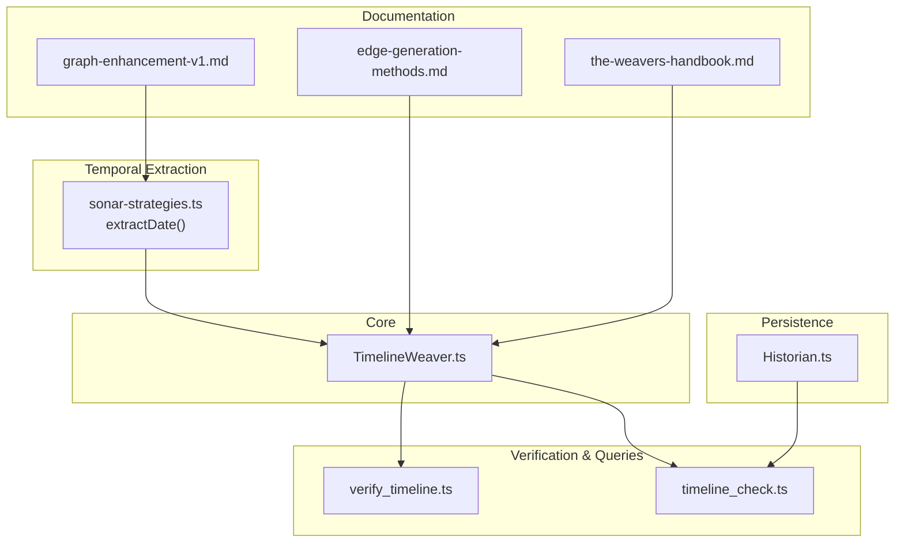
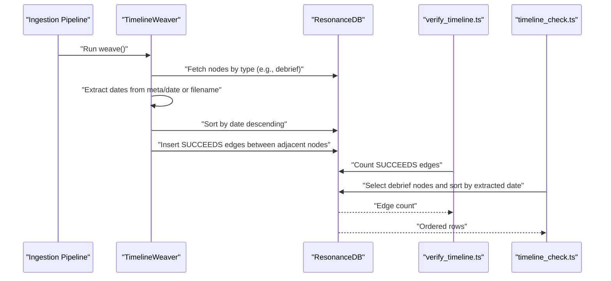
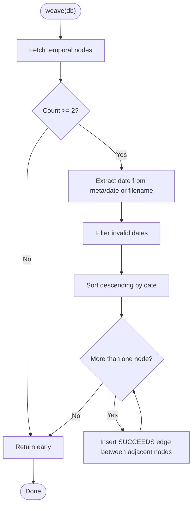
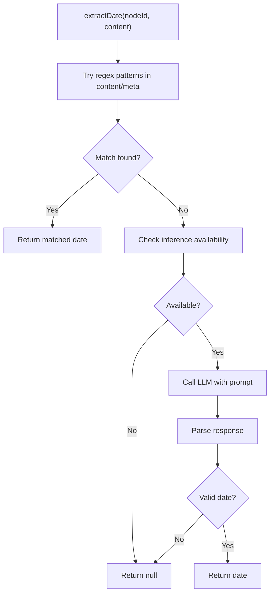
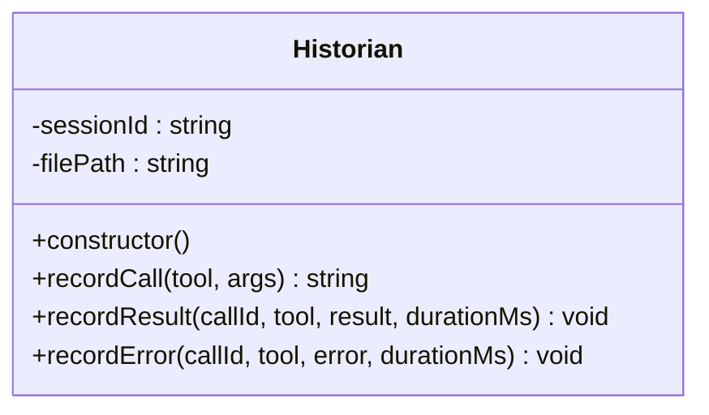
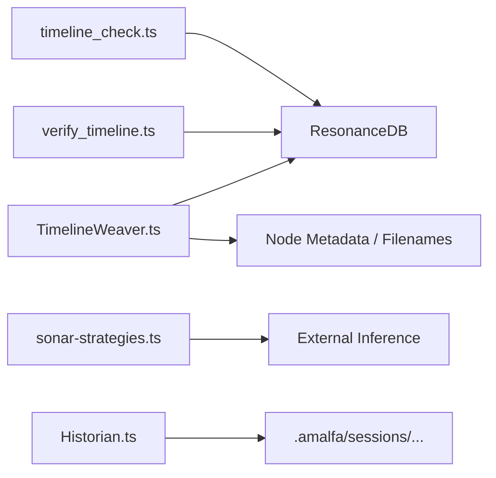

# Timeline and Temporal Analysis

<cite>
**Referenced Files in This Document**
- [TimelineWeaver.ts](file://src/core/TimelineWeaver.ts)
- [Historian.ts](file://src/utils/Historian.ts)
- [edge-generation-methods.md](file://docs/references/edge-generation-methods.md)
- [timeline_check.ts](file://scripts/query/timeline_check.ts)
- [verify_timeline.ts](file://scripts/verify/verify_timeline.ts)
- [sonar-strategies.ts](file://src/daemon/sonar-strategies.ts)
- [the-weavers-handbook.md](file://playbooks/the-weavers-handbook.md)
- [graph-enhancement-v1.md](file://docs/plans/graph-enhancement-v1.md)
- [database-intelligence-test.ts](file://scripts/lab/database-intelligence-test.ts)
</cite>

## Table of Contents
1. [Introduction](#introduction)
2. [Project Structure](#project-structure)
3. [Core Components](#core-components)
4. [Architecture Overview](#architecture-overview)
5. [Detailed Component Analysis](#detailed-component-analysis)
6. [Dependency Analysis](#dependency-analysis)
7. [Performance Considerations](#performance-considerations)
8. [Troubleshooting Guide](#troubleshooting-guide)
9. [Conclusion](#conclusion)
10. [Appendices](#appendices)

## Introduction
This document explains the timeline and temporal analysis capabilities within the knowledge graph engine. It focuses on how the TimelineWeaver maps temporal relationships among documents and entities, how temporal data is extracted from document metadata and integrated into the graph, and how temporal traversal and time-based queries enable discovery patterns aligned with chronological ordering. It also covers practical operations, time-based filtering, historical trend analysis, consistency challenges, and how temporal analysis improves search relevance and discovery.

## Project Structure
The temporal analysis features are centered around:
- A core weaving component that constructs chronological edges
- Utilities that persist agent interactions and tool calls with timestamps
- Scripts that validate and query temporal structure
- Protocols and strategies that extract and reason about temporal anchors

**Diagram sources**
- [TimelineWeaver.ts](file://src/core/TimelineWeaver.ts#L1-L62)
- [sonar-strategies.ts](file://src/daemon/sonar-strategies.ts#L148-L186)
- [Historian.ts](file://src/utils/Historian.ts#L1-L136)
- [verify_timeline.ts](file://scripts/verify/verify_timeline.ts#L1-L27)
- [timeline_check.ts](file://scripts/query/timeline_check.ts#L1-L47)
- [edge-generation-methods.md](file://docs/references/edge-generation-methods.md#L1-L52)
- [the-weavers-handbook.md](file://playbooks/the-weavers-handbook.md#L1-L35)
- [graph-enhancement-v1.md](file://docs/plans/graph-enhancement-v1.md#L21-L41)

**Section sources**
- [TimelineWeaver.ts](file://src/core/TimelineWeaver.ts#L1-L62)
- [edge-generation-methods.md](file://docs/references/edge-generation-methods.md#L1-L52)
- [the-weavers-handbook.md](file://playbooks/the-weavers-handbook.md#L1-L35)
- [graph-enhancement-v1.md](file://docs/plans/graph-enhancement-v1.md#L21-L41)

## Core Components
- TimelineWeaver: Builds chronological edges between nodes by sorting on extracted dates and inserting successor links.
- Sonar strategies: Provides a robust date extraction strategy that parses explicit frontmatter dates and falls back to LLM-based inference when needed.
- Historian: Records agent tool interactions with timestamps to support recall and temporal debugging.
- Verification and query scripts: Confirm edge creation and surface temporal ordering for inspection.

Key outcomes:
- A first-class temporal dimension embedded as explicit edges in the graph.
- Consistent chronological traversal and time-based filtering.
- Enhanced discovery patterns aligned with narrative and historical understanding.

**Section sources**
- [TimelineWeaver.ts](file://src/core/TimelineWeaver.ts#L3-L61)
- [sonar-strategies.ts](file://src/daemon/sonar-strategies.ts#L148-L186)
- [Historian.ts](file://src/utils/Historian.ts#L31-L136)
- [verify_timeline.ts](file://scripts/verify/verify_timeline.ts#L1-L27)
- [timeline_check.ts](file://scripts/query/timeline_check.ts#L1-L47)

## Architecture Overview
The temporal layer integrates explicit metadata extraction with automated weaving and validation:

**Diagram sources**
- [TimelineWeaver.ts](file://src/core/TimelineWeaver.ts#L4-L60)
- [verify_timeline.ts](file://scripts/verify/verify_timeline.ts#L10-L20)
- [timeline_check.ts](file://scripts/query/timeline_check.ts#L8-L45)

## Detailed Component Analysis

### TimelineWeaver
Purpose:
- Convert a set of temporal nodes into a chronological chain by adding explicit successor edges.

Processing logic:
- Fetch nodes of a temporal type (e.g., debriefs).
- Extract a date from metadata or derive it from the filename pattern.
- Filter out invalid or missing dates.
- Sort nodes by date descending.
- Insert edges representing the succession relationship between consecutive nodes.

**Diagram sources**
- [TimelineWeaver.ts](file://src/core/TimelineWeaver.ts#L7-L60)

**Section sources**
- [TimelineWeaver.ts](file://src/core/TimelineWeaver.ts#L3-L61)
- [edge-generation-methods.md](file://docs/references/edge-generation-methods.md#L13-L40)

### Sonar Strategies: Date Extraction
Purpose:
- Provide a reliable temporal anchor for nodes when metadata is ambiguous or absent.

Implementation highlights:
- Prefer explicit date patterns found in content or frontmatter.
- Fall back to an LLM-based extractor when external inference is available.
- Validate returned date format and reject non-conforming results.

**Diagram sources**
- [sonar-strategies.ts](file://src/daemon/sonar-strategies.ts#L148-L186)

**Section sources**
- [sonar-strategies.ts](file://src/daemon/sonar-strategies.ts#L148-L186)

### Historian: Temporal Persistence of Agent Sessions
Purpose:
- Persist agent thought loops and tool interactions with timestamps to disk for recall and debugging.

Key behaviors:
- Creates a session-scoped log file.
- Records calls, results, and errors with timestamps and durations.
- Enables temporal inspection of agent activity.

**Diagram sources**
- [Historian.ts](file://src/utils/Historian.ts#L31-L126)

**Section sources**
- [Historian.ts](file://src/utils/Historian.ts#L1-L136)

### Verification and Query Scripts
- verify_timeline.ts: Runs the weaving logic and counts SUCCEEDS edges to validate temporal chaining.
- timeline_check.ts: Performs a direct database query to list debrief nodes ordered by extracted date for inspection.

Operational guidance:
- Use verify_timeline.ts to confirm that the weaving process is active and effective after ingestion.
- Use timeline_check.ts to manually inspect the temporal ordering and identify potential inconsistencies.

**Section sources**
- [verify_timeline.ts](file://scripts/verify/verify_timeline.ts#L1-L27)
- [timeline_check.ts](file://scripts/query/timeline_check.ts#L1-L47)

### Temporal Navigation and Discovery Patterns
- The Weaver’s Handbook emphasizes that a strong chronological spine is essential for narrative readability and discovery.
- The graph enhancement plan outlines a “Chronos Layer” with explicit sequential edges and interpolation strategies to estimate dates for undated nodes.

Practical implications:
- Users can frame queries around “what happened next,” “show evolution,” or “timeline of events.”
- Temporal traversal becomes a first-class operation, enabling historical trend analysis and narrative exploration.

**Section sources**
- [the-weavers-handbook.md](file://playbooks/the-weavers-handbook.md#L9-L35)
- [graph-enhancement-v1.md](file://docs/plans/graph-enhancement-v1.md#L21-L27)

## Dependency Analysis
Temporal analysis depends on:
- ResonanceDB for node retrieval and edge insertion
- Ingestion pipeline for ensuring nodes carry temporal metadata or filenames suitable for date derivation
- Optional LLM inference for robust date extraction
- Scripts for validation and inspection

**Diagram sources**
- [TimelineWeaver.ts](file://src/core/TimelineWeaver.ts#L1-L62)
- [sonar-strategies.ts](file://src/daemon/sonar-strategies.ts#L148-L186)
- [verify_timeline.ts](file://scripts/verify/verify_timeline.ts#L1-L27)
- [timeline_check.ts](file://scripts/query/timeline_check.ts#L1-L47)
- [Historian.ts](file://src/utils/Historian.ts#L39-L49)

**Section sources**
- [TimelineWeaver.ts](file://src/core/TimelineWeaver.ts#L1-L62)
- [sonar-strategies.ts](file://src/daemon/sonar-strategies.ts#L148-L186)
- [verify_timeline.ts](file://scripts/verify/verify_timeline.ts#L1-L27)
- [timeline_check.ts](file://scripts/query/timeline_check.ts#L1-L47)
- [Historian.ts](file://src/utils/Historian.ts#L1-L136)

## Performance Considerations
- Sorting and edge insertion scale linearly with the number of temporal nodes; ensure only relevant nodes are processed.
- Date extraction cost can be minimized by preferring metadata and filename parsing over LLM calls.
- Validation scripts should use direct SQL queries to avoid vector search overhead when inspecting temporal structure.

[No sources needed since this section provides general guidance]

## Troubleshooting Guide
Common issues and resolutions:
- Not enough temporal nodes: The weaver exits early if fewer than two temporal nodes are found. Ensure ingestion includes sufficient temporal artifacts.
- Invalid or missing dates: Nodes without valid dates are filtered out. Add frontmatter dates or ensure filenames follow the expected date prefix pattern.
- LLM inference unavailable: When inference is disabled, date extraction falls back to regex and filename parsing. Confirm environment configuration if dates are missing.
- Verification mismatch: If the edge count does not match expectations, re-run verification and inspect the raw database state.

**Section sources**
- [TimelineWeaver.ts](file://src/core/TimelineWeaver.ts#L9-L14)
- [sonar-strategies.ts](file://src/daemon/sonar-strategies.ts#L161-L162)
- [verify_timeline.ts](file://scripts/verify/verify_timeline.ts#L14-L20)

## Conclusion
The temporal layer in the knowledge graph engine is anchored by the TimelineWeaver, which transforms a collection of temporal nodes into a structured chronological chain. Robust date extraction strategies and persistence mechanisms further strengthen temporal fidelity. Together, these components enable powerful temporal traversal, time-based filtering, and historical trend analysis, significantly enhancing search relevance and discovery by aligning results with narrative and chronological understanding.

[No sources needed since this section summarizes without analyzing specific files]

## Appendices

### Example Operations and Workflows
- Build a chronological chain: Run the weaving process after ingestion to create successor edges between temporal nodes.
- Validate temporal structure: Use the verification script to confirm the presence of successor edges.
- Inspect temporal ordering: Use the timeline query script to list nodes ordered by extracted dates.
- Enhance date extraction: Integrate LLM-based extraction for ambiguous or implicit dates.

**Section sources**
- [verify_timeline.ts](file://scripts/verify/verify_timeline.ts#L1-L27)
- [timeline_check.ts](file://scripts/query/timeline_check.ts#L1-L47)
- [sonar-strategies.ts](file://src/daemon/sonar-strategies.ts#L148-L186)