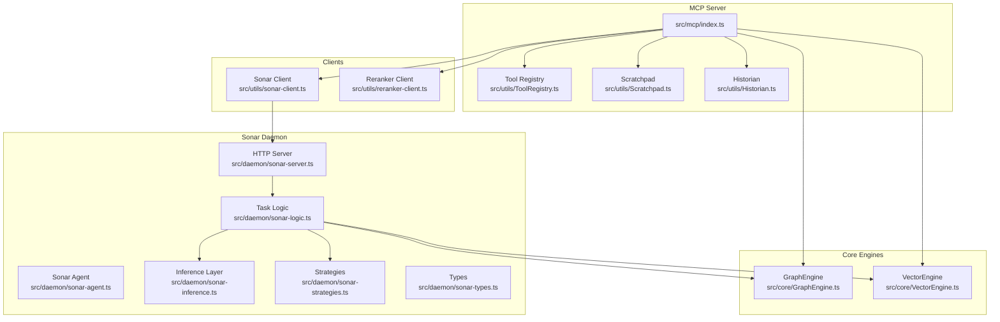
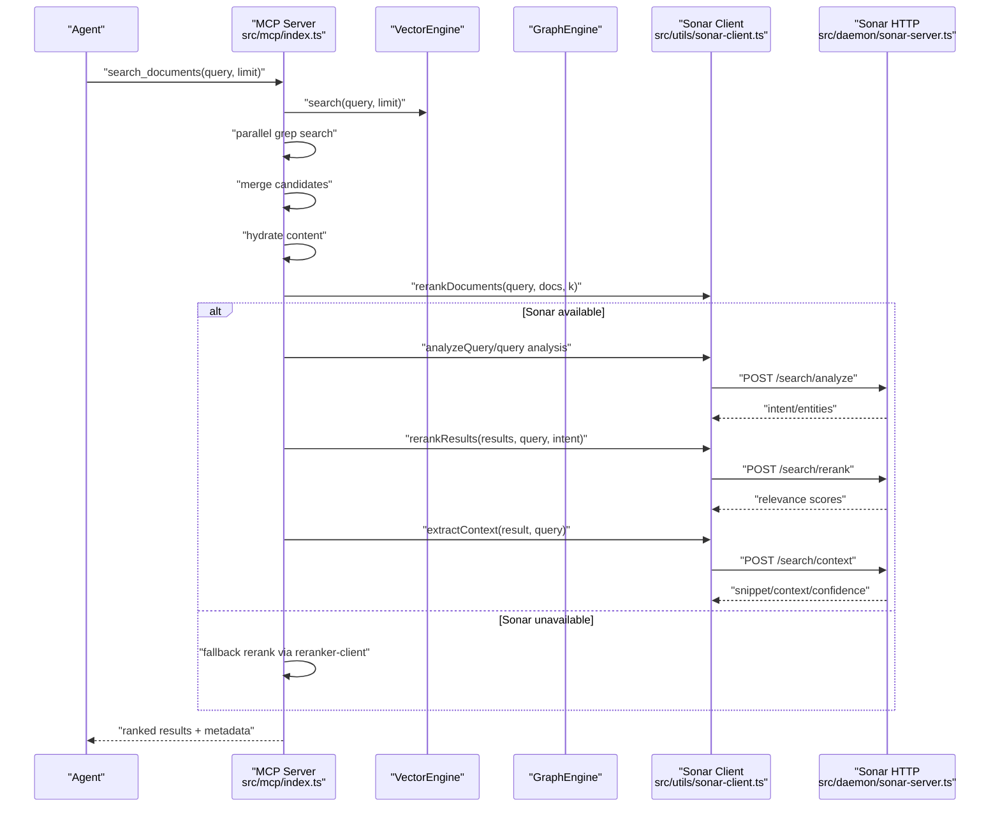
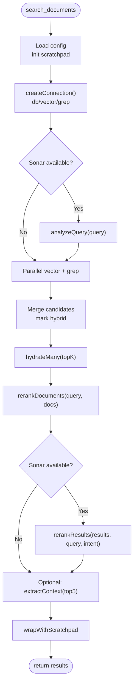
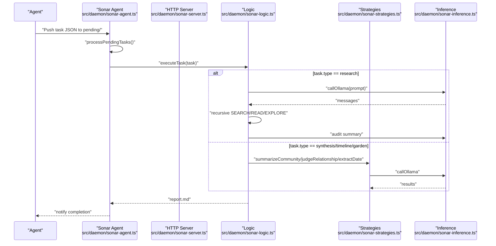
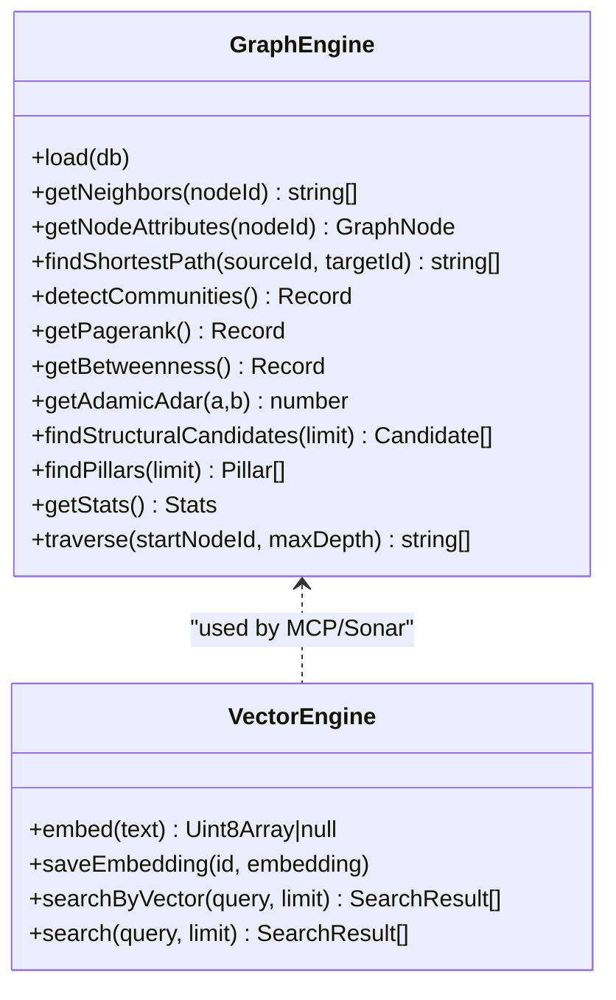
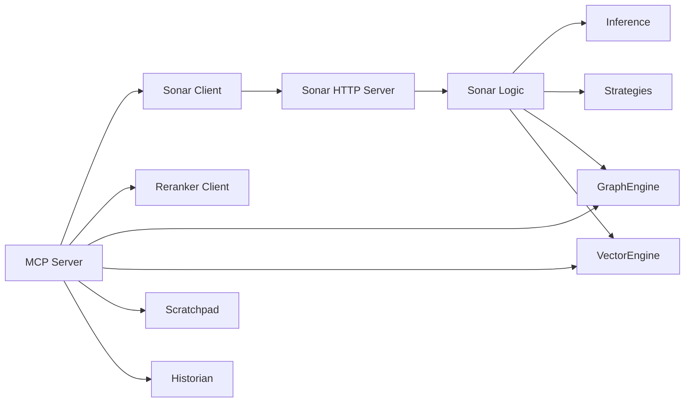

# Agent Workflows and Integration

<cite>
**Referenced Files in This Document**
- [AGENTS.md](file://AGENTS.md)
- [AGENT_PROTOCOLS.md](file://docs/AGENT_PROTOCOLS.md)
- [AGENT-METADATA-PATTERNS.md](file://docs/AGENT-METADATA-PATTERNS.md)
- [src/mcp/index.ts](file://src/mcp/index.ts)
- [src/daemon/sonar-agent.ts](file://src/daemon/sonar-agent.ts)
- [src/daemon/sonar-server.ts](file://src/daemon/sonar-server.ts)
- [src/daemon/sonar-logic.ts](file://src/daemon/sonar-logic.ts)
- [src/daemon/sonar-types.ts](file://src/daemon/sonar-types.ts)
- [src/daemon/sonar-inference.ts](file://src/daemon/sonar-inference.ts)
- [src/daemon/sonar-strategies.ts](file://src/daemon/sonar-strategies.ts)
- [src/utils/sonar-client.ts](file://src/utils/sonar-client.ts)
- [src/utils/reranker-client.ts](file://src/utils/reranker-client.ts)
- [src/utils/ToolRegistry.ts](file://src/utils/ToolRegistry.ts)
- [src/utils/Scratchpad.ts](file://src/utils/Scratchpad.ts)
- [src/utils/Historian.ts](file://src/utils/Historian.ts)
- [src/tools/index.ts](file://src/tools/index.ts)
- [src/core/GraphEngine.ts](file://src/core/GraphEngine.ts)
- [src/core/VectorEngine.ts](file://src/core/VectorEngine.ts)
</cite>

## Table of Contents
1. [Introduction](#introduction)
2. [Project Structure](#project-structure)
3. [Core Components](#core-components)
4. [Architecture Overview](#architecture-overview)
5. [Detailed Component Analysis](#detailed-component-analysis)
6. [Dependency Analysis](#dependency-analysis)
7. [Performance Considerations](#performance-considerations)
8. [Troubleshooting Guide](#troubleshooting-guide)
9. [Conclusion](#conclusion)
10. [Appendices](#appendices)

## Introduction
This document explains agent workflows and integration patterns for Amalfa’s Model Context Protocol (MCP) system. It covers:
- Common agent interaction patterns: search orchestration, document exploration, and knowledge synthesis
- How agents chain tools for complex research tasks
- Integration with AI agents and platforms (local Ollama and cloud OpenRouter)
- Performance optimization (caching, connection hygiene, and reranking)
- Troubleshooting timeouts, errors, and recovery
- Examples of custom agent implementations and extension points

## Project Structure
Amalfa organizes agent capabilities around:
- An MCP server exposing knowledge graph tools
- A Sonar daemon providing LLM-powered search refinement and autonomous research
- Utilities for caching, logging, and reranking
- Core engines for graph analytics and vector search

**Diagram sources**
- [src/mcp/index.ts](file://src/mcp/index.ts#L146-L250)
- [src/utils/ToolRegistry.ts](file://src/utils/ToolRegistry.ts#L8-L30)
- [src/utils/Scratchpad.ts](file://src/utils/Scratchpad.ts#L59-L190)
- [src/utils/Historian.ts](file://src/utils/Historian.ts#L31-L126)
- [src/daemon/sonar-agent.ts](file://src/daemon/sonar-agent.ts#L60-L116)
- [src/daemon/sonar-server.ts](file://src/daemon/sonar-server.ts#L24-L133)
- [src/daemon/sonar-logic.ts](file://src/daemon/sonar-logic.ts#L19-L685)
- [src/daemon/sonar-inference.ts](file://src/daemon/sonar-inference.ts#L19-L120)
- [src/daemon/sonar-strategies.ts](file://src/daemon/sonar-strategies.ts#L10-L187)
- [src/utils/sonar-client.ts](file://src/utils/sonar-client.ts#L54-L270)
- [src/utils/reranker-client.ts](file://src/utils/reranker-client.ts#L137-L209)
- [src/core/GraphEngine.ts](file://src/core/GraphEngine.ts#L39-L314)
- [src/core/VectorEngine.ts](file://src/core/VectorEngine.ts#L76-L242)

**Section sources**
- [src/mcp/index.ts](file://src/mcp/index.ts#L146-L250)
- [src/daemon/sonar-agent.ts](file://src/daemon/sonar-agent.ts#L60-L116)
- [src/utils/sonar-client.ts](file://src/utils/sonar-client.ts#L54-L270)

## Core Components
- MCP Server: Exposes tools for search, read, explore, directory listing, gap detection, and scratchpad operations. Integrates Sonar for query analysis, reranking, and context extraction.
- Sonar Daemon: Provides HTTP endpoints for chat, metadata enhancement, search analysis, reranking, and context extraction. Powers autonomous research tasks and graph-aware strategies.
- GraphEngine: Loads a lightweight in-memory graph for traversal, centrality, and community detection.
- VectorEngine: Fast vector search using FAFCAS-normalized embeddings with zero-copy scoring.
- Utilities: Scratchpad for large output caching, Historian for session logging, ToolRegistry for dynamic tool registration.

**Section sources**
- [src/mcp/index.ts](file://src/mcp/index.ts#L152-L250)
- [src/daemon/sonar-server.ts](file://src/daemon/sonar-server.ts#L24-L133)
- [src/core/GraphEngine.ts](file://src/core/GraphEngine.ts#L39-L100)
- [src/core/VectorEngine.ts](file://src/core/VectorEngine.ts#L76-L110)
- [src/utils/Scratchpad.ts](file://src/utils/Scratchpad.ts#L59-L190)
- [src/utils/Historian.ts](file://src/utils/Historian.ts#L31-L126)
- [src/utils/ToolRegistry.ts](file://src/utils/ToolRegistry.ts#L8-L30)

## Architecture Overview
The MCP server orchestrates retrieval and refinement:
- Parallel vector and grep retrieval
- Cross-encoder reranking (daemon or local)
- Optional LLM reranking and context extraction via Sonar
- Optional graph-aware exploration and gap detection

**Diagram sources**
- [src/mcp/index.ts](file://src/mcp/index.ts#L267-L513)
- [src/utils/reranker-client.ts](file://src/utils/reranker-client.ts#L137-L209)
- [src/utils/sonar-client.ts](file://src/utils/sonar-client.ts#L118-L268)
- [src/daemon/sonar-server.ts](file://src/daemon/sonar-server.ts#L93-L130)

## Detailed Component Analysis

### MCP Server: Search Orchestration
- Tools: search_documents, read_node_content, explore_links, list_directory_structure, inject_tags, find_gaps, scratchpad_read/list
- Retrieval: bicameral (vector + grep) with late fusion and cross-encoder reranking
- Optional Sonar enhancements: query intent analysis, LLM reranking, and context extraction
- Caching: wrapWithScratchpad intercepts large tool outputs and writes references to disk

**Diagram sources**
- [src/mcp/index.ts](file://src/mcp/index.ts#L267-L513)
- [src/utils/reranker-client.ts](file://src/utils/reranker-client.ts#L137-L209)
- [src/utils/sonar-client.ts](file://src/utils/sonar-client.ts#L118-L268)
- [src/utils/Scratchpad.ts](file://src/utils/Scratchpad.ts#L75-L92)

**Section sources**
- [src/mcp/index.ts](file://src/mcp/index.ts#L152-L250)
- [src/mcp/index.ts](file://src/mcp/index.ts#L267-L513)
- [src/utils/Scratchpad.ts](file://src/utils/Scratchpad.ts#L75-L92)

### Sonar Daemon: Autonomous Research and Synthesis
- HTTP endpoints: /health, /chat, /metadata/enhance, /graph/stats, /search/analyze, /search/rerank, /search/context
- Task execution: synthesis, timeline, enhance_batch, garden, research
- Inference: supports local Ollama and OpenRouter (cloud) with model routing and throttling for free tiers
- Strategies: community synthesis, relationship judgment, temporal anchoring

**Diagram sources**
- [src/daemon/sonar-agent.ts](file://src/daemon/sonar-agent.ts#L138-L217)
- [src/daemon/sonar-server.ts](file://src/daemon/sonar-server.ts#L24-L133)
- [src/daemon/sonar-logic.ts](file://src/daemon/sonar-logic.ts#L470-L664)
- [src/daemon/sonar-strategies.ts](file://src/daemon/sonar-strategies.ts#L34-L187)
- [src/daemon/sonar-inference.ts](file://src/daemon/sonar-inference.ts#L19-L120)

**Section sources**
- [src/daemon/sonar-agent.ts](file://src/daemon/sonar-agent.ts#L60-L116)
- [src/daemon/sonar-server.ts](file://src/daemon/sonar-server.ts#L24-L133)
- [src/daemon/sonar-logic.ts](file://src/daemon/sonar-logic.ts#L323-L364)
- [src/daemon/sonar-logic.ts](file://src/daemon/sonar-logic.ts#L470-L664)
- [src/daemon/sonar-strategies.ts](file://src/daemon/sonar-strategies.ts#L10-L187)
- [src/daemon/sonar-inference.ts](file://src/daemon/sonar-inference.ts#L19-L120)

### Graph and Vector Engines
- GraphEngine: loads nodes/edges into memory, supports traversal, centrality, communities, and structural candidate generation
- VectorEngine: FAFCAS-normalized embeddings, zero-copy dot product scoring, and metadata hydration for top-K results

**Diagram sources**
- [src/core/GraphEngine.ts](file://src/core/GraphEngine.ts#L39-L314)
- [src/core/VectorEngine.ts](file://src/core/VectorEngine.ts#L76-L242)

**Section sources**
- [src/core/GraphEngine.ts](file://src/core/GraphEngine.ts#L50-L100)
- [src/core/VectorEngine.ts](file://src/core/VectorEngine.ts#L155-L242)

### Agent Protocols and Metadata Patterns
- “Graph First” directive: ground actions in the knowledge graph before acting
- Autonomous research delegation via task files (.amalfa/agent/tasks/pending/)
- Agent-first metadata augmentation: latent-space tagging, semantic backlinks, similarity suggestions, confidence scoring, and human audit workflow

**Section sources**
- [docs/AGENT_PROTOCOLS.md](file://docs/AGENT_PROTOCOLS.md#L1-L30)
- [AGENTS.md](file://AGENTS.md#L1-L38)
- [docs/AGENT-METADATA-PATTERNS.md](file://docs/AGENT-METADATA-PATTERNS.md#L40-L122)

## Dependency Analysis
- MCP depends on:
  - Sonar client for optional LLM reranking and context extraction
  - Reranker client for cross-encoder reranking (daemon or local)
  - GraphEngine and VectorEngine for retrieval
  - Scratchpad and Historian for caching and observability
- Sonar daemon depends on:
  - Inference layer for Ollama/OpenRouter
  - Strategies for relationship and synthesis decisions
  - GraphEngine and VectorEngine for graph-aware tasks

**Diagram sources**
- [src/mcp/index.ts](file://src/mcp/index.ts#L267-L513)
- [src/utils/sonar-client.ts](file://src/utils/sonar-client.ts#L54-L270)
- [src/utils/reranker-client.ts](file://src/utils/reranker-client.ts#L137-L209)
- [src/daemon/sonar-server.ts](file://src/daemon/sonar-server.ts#L24-L133)
- [src/daemon/sonar-logic.ts](file://src/daemon/sonar-logic.ts#L19-L685)
- [src/daemon/sonar-inference.ts](file://src/daemon/sonar-inference.ts#L19-L120)
- [src/daemon/sonar-strategies.ts](file://src/daemon/sonar-strategies.ts#L10-L187)

**Section sources**
- [src/mcp/index.ts](file://src/mcp/index.ts#L267-L513)
- [src/utils/sonar-client.ts](file://src/utils/sonar-client.ts#L54-L270)
- [src/utils/reranker-client.ts](file://src/utils/reranker-client.ts#L137-L209)
- [src/daemon/sonar-server.ts](file://src/daemon/sonar-server.ts#L24-L133)
- [src/daemon/sonar-logic.ts](file://src/daemon/sonar-logic.ts#L19-L685)

## Performance Considerations
- Retrieval optimization
  - Parallel vector and grep retrieval with early candidate merging
  - Late-fusion reranking with cross-encoder (daemon preferred for speed)
  - FAFCAS normalization and zero-copy dot product for fast vector scoring
- Caching and IO
  - Scratchpad intercepts large tool outputs and writes references to disk
  - Configurable thresholds and pruning by age and size
- Connection hygiene
  - Per-request database connections in MCP handlers
  - SQLite pragmas and WAL mode for concurrency and durability
- Inference efficiency
  - Health-check caching for Sonar availability
  - Optional throttling for free-tier providers
  - Daemon-based reranking avoids model load latency

**Section sources**
- [src/mcp/index.ts](file://src/mcp/index.ts#L267-L513)
- [src/utils/reranker-client.ts](file://src/utils/reranker-client.ts#L137-L209)
- [src/core/VectorEngine.ts](file://src/core/VectorEngine.ts#L155-L242)
- [src/utils/Scratchpad.ts](file://src/utils/Scratchpad.ts#L272-L349)
- [src/mcp/index.ts](file://src/mcp/index.ts#L49-L55)

## Troubleshooting Guide
- Timeout handling
  - Sonar client enforces per-request timeouts for analyze/rerank/context endpoints
  - Reranker client uses AbortSignal timeout for daemon requests
- Error recovery
  - Graceful fallbacks: if Sonar is unavailable, return original scores and simple snippets
  - If reranker daemon fails, fall back to local reranker initialization
  - Uncaught exceptions logged and written to crash log
- Availability checks
  - Sonar health check cached for 30 seconds to reduce overhead
  - MCP starts vector and file watcher daemons if configured
- Observability
  - Historian records calls, results, and errors with durations
  - Scratchpad logs cache hits, prunes, and deletions

**Section sources**
- [src/utils/sonar-client.ts](file://src/utils/sonar-client.ts#L118-L268)
- [src/utils/reranker-client.ts](file://src/utils/reranker-client.ts#L20-L80)
- [src/mcp/index.ts](file://src/mcp/index.ts#L727-L743)
- [src/utils/Historian.ts](file://src/utils/Historian.ts#L66-L126)
- [src/utils/Scratchpad.ts](file://src/utils/Scratchpad.ts#L272-L349)

## Conclusion
Amalfa’s MCP system integrates retrieval, refinement, and autonomous research through a modular architecture. Agents can orchestrate multiple tools to perform complex research tasks, leveraging graph analytics, vector search, and LLM-powered reranking. The system emphasizes performance (parallel retrieval, daemon reranking, caching) and robustness (availability checks, graceful fallbacks, observability). Extension points include dynamic tool registration, custom strategies, and task-driven automation.

## Appendices

### Integration Patterns and Best Practices
- Use the “Graph First” directive: ground ambiguity, architecture questions, and standards queries in the knowledge graph before acting
- Delegate complex investigations to the Sonar Discovery Engine by placing task JSON in the pending directory
- Prefer daemon reranking for speed; enable local Ollama or configure OpenRouter for cloud inference
- Configure scratchpad thresholds to balance memory usage and recall of large outputs

**Section sources**
- [docs/AGENT_PROTOCOLS.md](file://docs/AGENT_PROTOCOLS.md#L11-L28)
- [src/daemon/sonar-agent.ts](file://src/daemon/sonar-agent.ts#L138-L179)
- [src/utils/reranker-client.ts](file://src/utils/reranker-client.ts#L137-L209)
- [src/utils/Scratchpad.ts](file://src/utils/Scratchpad.ts#L63-L75)

### Custom Agent Implementations and Extension Points
- Dynamic tools: register new tools via the ToolRegistry and expose them through MCP
- Task types: extend Sonar logic with new task types and strategies
- Inference routing: customize model selection and provider switching (local Ollama vs. OpenRouter)
- Graph-aware tasks: leverage GraphEngine for community detection, centrality, and structural suggestions

**Section sources**
- [src/tools/index.ts](file://src/tools/index.ts#L4-L6)
- [src/utils/ToolRegistry.ts](file://src/utils/ToolRegistry.ts#L8-L30)
- [src/daemon/sonar-logic.ts](file://src/daemon/sonar-logic.ts#L323-L364)
- [src/daemon/sonar-strategies.ts](file://src/daemon/sonar-strategies.ts#L10-L28)
- [src/daemon/sonar-inference.ts](file://src/daemon/sonar-inference.ts#L19-L120)