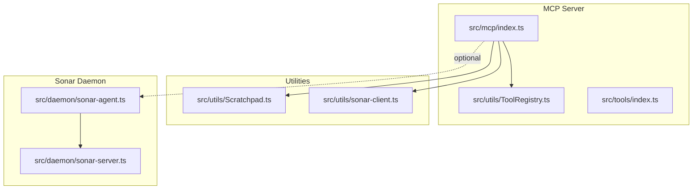
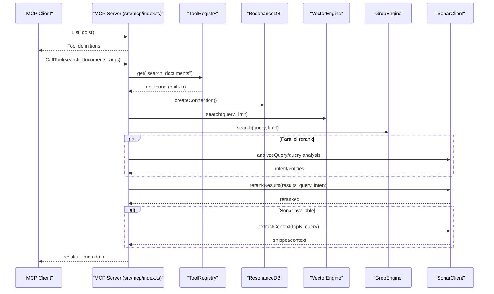
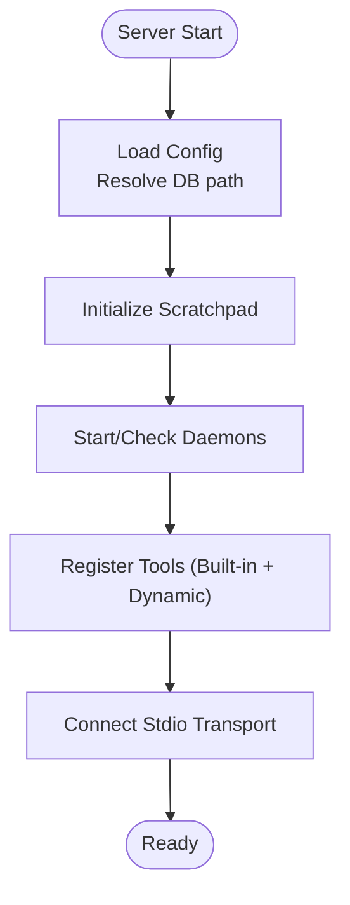
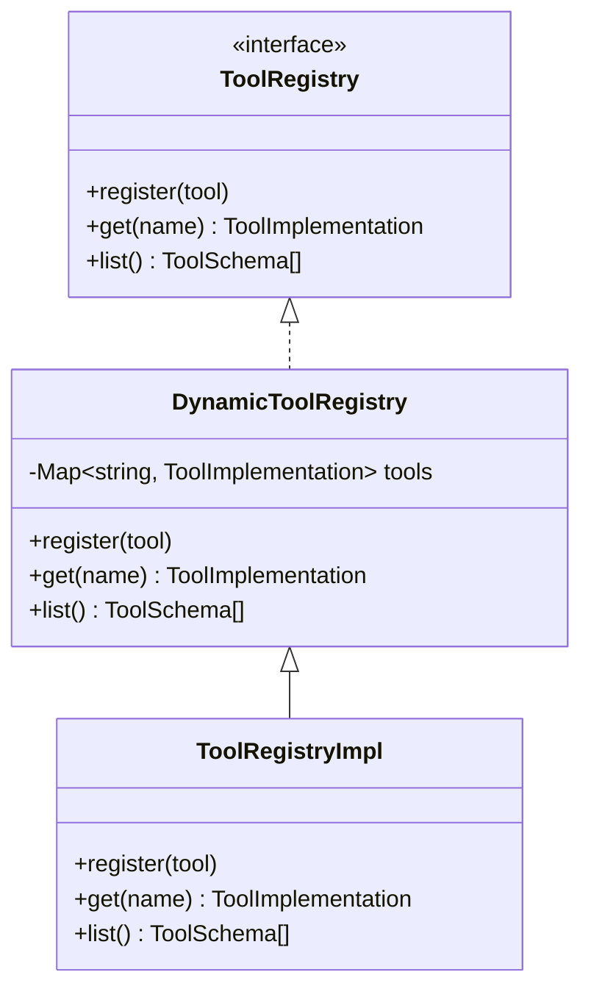
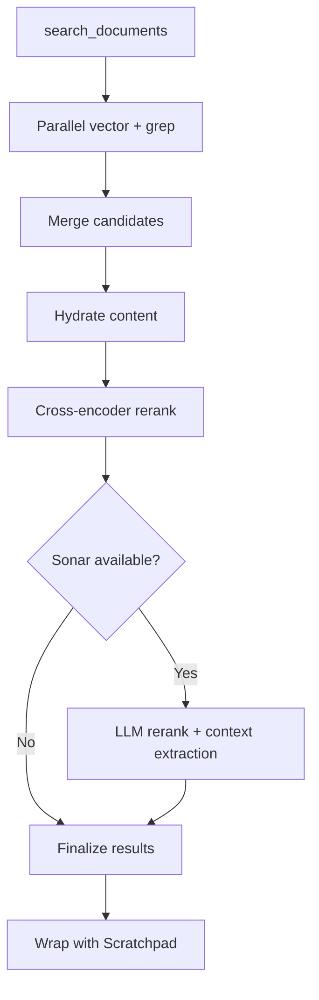
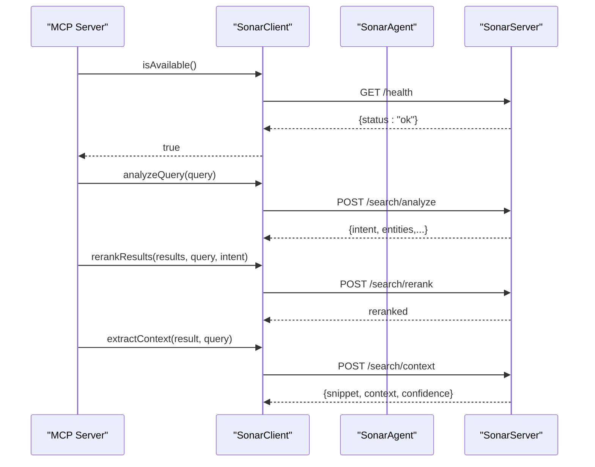
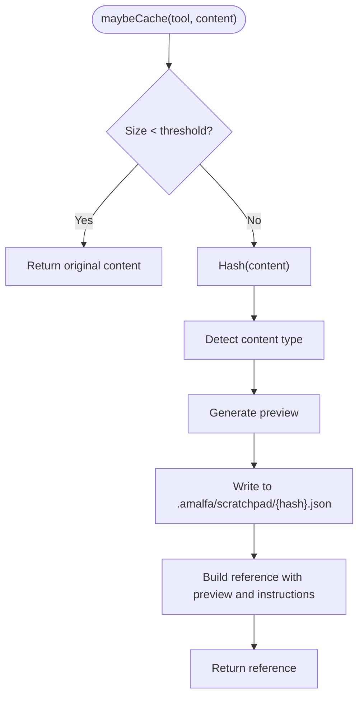
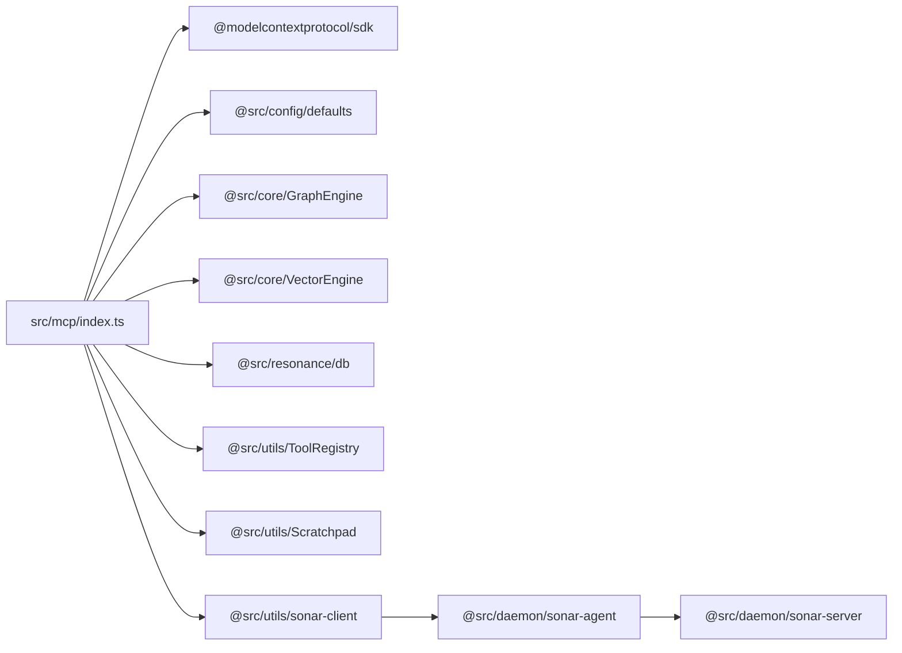

# MCP Integration

<cite>
**Referenced Files in This Document**
- [src/mcp/index.ts](file://src/mcp/index.ts)
- [src/mcp/README.md](file://src/mcp/README.md)
- [docs/MCP-TOOLS.md](file://docs/MCP-TOOLS.md)
- [docs/setup/MCP_SETUP.md](file://docs/setup/MCP_SETUP.md)
- [docs/setup/QUICK_START_MCP.md](file://docs/setup/QUICK_START_MCP.md)
- [src/utils/Scratchpad.ts](file://src/utils/Scratchpad.ts)
- [src/utils/sonar-client.ts](file://src/utils/sonar-client.ts)
- [src/daemon/sonar-agent.ts](file://src/daemon/sonar-agent.ts)
- [src/daemon/sonar-server.ts](file://src/daemon/sonar-server.ts)
- [src/utils/ToolRegistry.ts](file://src/utils/ToolRegistry.ts)
- [src/tools/index.ts](file://src/tools/index.ts)
</cite>

## Table of Contents
1. [Introduction](#introduction)
2. [Project Structure](#project-structure)
3. [Core Components](#core-components)
4. [Architecture Overview](#architecture-overview)
5. [Detailed Component Analysis](#detailed-component-analysis)
6. [Dependency Analysis](#dependency-analysis)
7. [Performance Considerations](#performance-considerations)
8. [Troubleshooting Guide](#troubleshooting-guide)
9. [Conclusion](#conclusion)
10. [Appendices](#appendices)

## Introduction
This document explains Amalfa’s Model Context Protocol (MCP) integration and how Amalfa exposes a set of tools to AI agents over stdio-based transport. It covers the MCP protocol architecture, Amalfa’s stdio transport, the available tools (search_documents, read_node_content, explore_links, find_gaps, list_directory_structure, inject_tags, and scratchpad operations), and the Sonar AI agent’s role in enhancing search with query analysis, LLM reranking, and context extraction. It also documents tool registration, parameter validation, response formatting, practical agent workflows, security and authentication considerations, troubleshooting, and performance optimization.

## Project Structure
Amalfa’s MCP server is implemented as a standalone stdio server that registers tools and exposes them to external clients. The server initializes services, sets up transports, and routes requests to tool handlers. Supporting utilities include a scratchpad cache for large outputs, a Sonar client for optional LLM enhancements, and a dynamic tool registry for extensibility.

**Diagram sources**
- [src/mcp/index.ts](file://src/mcp/index.ts#L1-L748)
- [src/utils/ToolRegistry.ts](file://src/utils/ToolRegistry.ts#L1-L30)
- [src/tools/index.ts](file://src/tools/index.ts#L1-L7)
- [src/utils/Scratchpad.ts](file://src/utils/Scratchpad.ts#L1-L427)
- [src/utils/sonar-client.ts](file://src/utils/sonar-client.ts#L1-L309)
- [src/daemon/sonar-agent.ts](file://src/daemon/sonar-agent.ts#L1-L221)
- [src/daemon/sonar-server.ts](file://src/daemon/sonar-server.ts#L1-L134)

**Section sources**
- [src/mcp/README.md](file://src/mcp/README.md#L1-L15)
- [src/mcp/index.ts](file://src/mcp/index.ts#L1-L748)

## Core Components
- MCP stdio server: Implements the MCP protocol, registers tools, handles requests, and manages per-request database connections.
- Tool registry: Dynamically registers tools (e.g., EmberExtractTool) alongside built-in tools.
- Scratchpad: Caches large tool outputs and returns compact references, enabling retrieval via scratchpad_read and scratchpad_list.
- Sonar client: Optional HTTP client to the Sonar daemon for query analysis, LLM reranking, and context extraction.
- Sonar daemon: HTTP server exposing endpoints for chat, metadata enhancement, search analysis, reranking, and context extraction.

Key MCP tools exposed:
- search_documents
- read_node_content
- explore_links
- list_directory_structure
- find_gaps
- inject_tags
- scratchpad_read
- scratchpad_list

**Section sources**
- [src/mcp/index.ts](file://src/mcp/index.ts#L146-L250)
- [src/utils/ToolRegistry.ts](file://src/utils/ToolRegistry.ts#L1-L30)
- [src/tools/index.ts](file://src/tools/index.ts#L1-L7)
- [src/utils/Scratchpad.ts](file://src/utils/Scratchpad.ts#L1-L427)
- [src/utils/sonar-client.ts](file://src/utils/sonar-client.ts#L1-L309)
- [src/daemon/sonar-server.ts](file://src/daemon/sonar-server.ts#L1-L134)

## Architecture Overview
The MCP server uses stdio transport and supports dynamic tool registration. Requests are routed to either built-in handlers or dynamic tools registered in the tool registry. Optional Sonar enhancements are invoked when the Sonar daemon is available.

**Diagram sources**
- [src/mcp/index.ts](file://src/mcp/index.ts#L252-L688)
- [src/utils/sonar-client.ts](file://src/utils/sonar-client.ts#L118-L268)

**Section sources**
- [src/mcp/index.ts](file://src/mcp/index.ts#L146-L250)
- [src/utils/sonar-client.ts](file://src/utils/sonar-client.ts#L1-L309)

## Detailed Component Analysis

### MCP Server and Transport
- Transport: stdio-based transport using the MCP SDK.
- Lifecycle: Managed via ServiceLifecycle with PID/log files.
- Per-request connections: Fresh ResonanceDB, VectorEngine, and GrepEngine instances are created per tool invocation.
- Request routing: Built-in handlers for core tools; dynamic tools via ToolRegistry.

**Diagram sources**
- [src/mcp/index.ts](file://src/mcp/index.ts#L62-L141)

**Section sources**
- [src/mcp/index.ts](file://src/mcp/index.ts#L28-L141)

### Tool Registration and Dynamic Tools
- Built-in tools are declared in ListTools handler with input schemas.
- Dynamic tools are registered via registerAllTools, which delegates to ToolRegistry.
- ToolRegistry stores tools by name and logs registration events.

**Diagram sources**
- [src/utils/ToolRegistry.ts](file://src/utils/ToolRegistry.ts#L1-L30)
- [src/tools/index.ts](file://src/tools/index.ts#L1-L7)

**Section sources**
- [src/mcp/index.ts](file://src/mcp/index.ts#L164-L250)
- [src/utils/ToolRegistry.ts](file://src/utils/ToolRegistry.ts#L1-L30)
- [src/tools/index.ts](file://src/tools/index.ts#L1-L7)

### Tool Handlers Overview
- search_documents: Executes vector and grep search, merges candidates, reranks with cross-encoder, optionally re-ranks with Sonar LLM, and extracts context for top results.
- read_node_content: Reads markdown content from filesystem using node metadata.
- explore_links: Queries edges for a given node and optional relation filter.
- list_directory_structure: Returns configured source directories (currently static).
- find_gaps: Calls Sonar daemon to discover similar but unlinked documents.
- inject_tags: Appends or merges HTML comment tags into a markdown file.
- scratchpad_read/list: Manages cached outputs and returns entries or inventory.

**Diagram sources**
- [src/mcp/index.ts](file://src/mcp/index.ts#L267-L513)

**Section sources**
- [src/mcp/index.ts](file://src/mcp/index.ts#L267-L688)
- [docs/MCP-TOOLS.md](file://docs/MCP-TOOLS.md#L80-L444)

### Sonar AI Agent Enhancements
- Availability: SonarClient caches health checks to avoid repeated overhead.
- Capabilities: Query analysis, LLM reranking, and context extraction endpoints.
- Daemon: SonarAgent starts an HTTP server and processes tasks; SonarServer exposes endpoints for health, chat, metadata enhancement, search analysis, reranking, and context extraction.

**Diagram sources**
- [src/utils/sonar-client.ts](file://src/utils/sonar-client.ts#L72-L268)
- [src/daemon/sonar-server.ts](file://src/daemon/sonar-server.ts#L40-L130)
- [src/daemon/sonar-agent.ts](file://src/daemon/sonar-agent.ts#L102-L133)

**Section sources**
- [src/utils/sonar-client.ts](file://src/utils/sonar-client.ts#L1-L309)
- [src/daemon/sonar-server.ts](file://src/daemon/sonar-server.ts#L1-L134)
- [src/daemon/sonar-agent.ts](file://src/daemon/sonar-agent.ts#L1-L221)

### Scratchpad Protocol
- Purpose: Cache large tool outputs and return compact references.
- Behavior: Hash-based deduplication, preview generation, pruning by age and size, and session-scoped cache.
- Operations: maybeCache, read, readContent, list, delete, prune, clear, stats.

**Diagram sources**
- [src/utils/Scratchpad.ts](file://src/utils/Scratchpad.ts#L147-L190)

**Section sources**
- [src/utils/Scratchpad.ts](file://src/utils/Scratchpad.ts#L1-L427)
- [src/mcp/index.ts](file://src/mcp/index.ts#L76-L92)

### Tool Parameter Validation and Response Formatting
- Built-in tools define input schemas in ListTools handler; parameters are validated implicitly by the MCP SDK.
- Responses are returned as MCP content blocks with type "text".
- Errors are returned with isError=true and a descriptive message.

Examples of validation and formatting:
- search_documents validates query presence and limit numeric coercion.
- read_node_content validates node existence and file accessibility.
- explore_links filters edges by relation when provided.
- find_gaps invokes Sonar and returns gap candidates.
- inject_tags merges or appends tags to markdown files.
- scratchpad_read/list return structured JSON content.

**Section sources**
- [src/mcp/index.ts](file://src/mcp/index.ts#L164-L250)
- [src/mcp/index.ts](file://src/mcp/index.ts#L267-L688)
- [docs/MCP-TOOLS.md](file://docs/MCP-TOOLS.md#L80-L444)

### Practical Agent Workflows
Common workflows supported by the MCP tools:
- Discovery: search_documents → read_node_content → explore_links → read_node_content.
- Gap analysis: find_gaps → read_node_content (source/target) → agent decision.
- Research: search_documents → scratchpad_list → scratchpad_read → explore_links.

These workflows are documented with recommended prompts and patterns in the MCP tools reference.

**Section sources**
- [docs/MCP-TOOLS.md](file://docs/MCP-TOOLS.md#L558-L606)

## Dependency Analysis
- MCP server depends on:
  - MCP SDK for stdio transport and request schemas.
  - Amalfa core modules for graph and vector engines.
  - ResonanceDB for database access.
  - ToolRegistry for dynamic tool registration.
  - Scratchpad for caching large outputs.
  - SonarClient for optional LLM enhancements.
- Sonar daemon depends on:
  - Hono for HTTP endpoints.
  - Ollama/cloud inference providers for LLM tasks.

**Diagram sources**
- [src/mcp/index.ts](file://src/mcp/index.ts#L1-L27)
- [src/utils/sonar-client.ts](file://src/utils/sonar-client.ts#L1-L70)
- [src/daemon/sonar-agent.ts](file://src/daemon/sonar-agent.ts#L1-L35)
- [src/daemon/sonar-server.ts](file://src/daemon/sonar-server.ts#L1-L20)

**Section sources**
- [src/mcp/index.ts](file://src/mcp/index.ts#L1-L27)
- [src/utils/sonar-client.ts](file://src/utils/sonar-client.ts#L1-L70)

## Performance Considerations
- Two-stage retrieval: Vector search plus cross-encoder reranking for precision balance.
- Parallel retrieval: VectorEngine and GrepEngine executed concurrently.
- Optional Sonar enhancements: Introduces latency; fallback gracefully when unavailable.
- Caching: Scratchpad reduces context window usage for large outputs.
- Recommendations:
  - Use appropriate limits for exploration.
  - Prefer graph traversal over repeated searches.
  - Batch reads when possible.
  - Monitor cache usage with scratchpad_list.

**Section sources**
- [docs/MCP-TOOLS.md](file://docs/MCP-TOOLS.md#L14-L69)
- [src/mcp/index.ts](file://src/mcp/index.ts#L315-L476)
- [src/utils/Scratchpad.ts](file://src/utils/Scratchpad.ts#L147-L190)

## Troubleshooting Guide
Common issues and resolutions:
- Server not connecting:
  - Verify Bun is in PATH and absolute paths in client config are correct.
  - Check logs at .amalfa/.mcp.log.
- No results from search:
  - Confirm database has nodes and embeddings.
  - Re-run ingestion if counts are zero.
- Node not found:
  - Validate node ID from recent search results.
- Scratchpad entry not found:
  - Use scratchpad_list to discover valid IDs.
- Search errors:
  - Run diagnostics to rebuild or reinitialize the database.

**Section sources**
- [docs/setup/MCP_SETUP.md](file://docs/setup/MCP_SETUP.md#L206-L257)
- [docs/MCP-TOOLS.md](file://docs/MCP-TOOLS.md#L661-L698)

## Conclusion
Amalfa’s MCP integration provides a robust, stdio-based transport for AI agents to search, traverse, and enhance knowledge graph content. The combination of vector and keyword search, cross-encoder reranking, and optional Sonar LLM enhancements yields precise and contextual results. The scratchpad protocol enables efficient handling of large outputs, while the dynamic tool registry supports extensibility. With clear workflows, validation, and troubleshooting guidance, Amalfa offers a production-ready foundation for agent-driven research and discovery.

## Appendices

### MCP Setup and Quick Start
- Full setup guide and client configuration for Claude Desktop, Cursor, and Windsurf.
- Quick start steps to generate configuration and test the server.

**Section sources**
- [docs/setup/MCP_SETUP.md](file://docs/setup/MCP_SETUP.md#L1-L318)
- [docs/setup/QUICK_START_MCP.md](file://docs/setup/QUICK_START_MCP.md#L1-L169)

### Security and Authentication
- Transport: stdio-based transport with no built-in authentication.
- Recommendations:
  - Restrict access to trusted clients.
  - Use local-only stdio transport in secure environments.
  - Avoid exposing MCP server to untrusted networks.
  - Monitor logs and consider process isolation.

**Section sources**
- [src/mcp/index.ts](file://src/mcp/index.ts#L720-L722)
- [src/mcp/README.md](file://src/mcp/README.md#L8-L14)