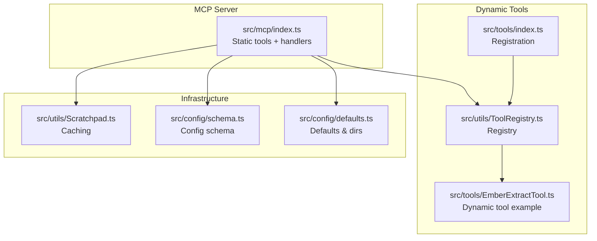
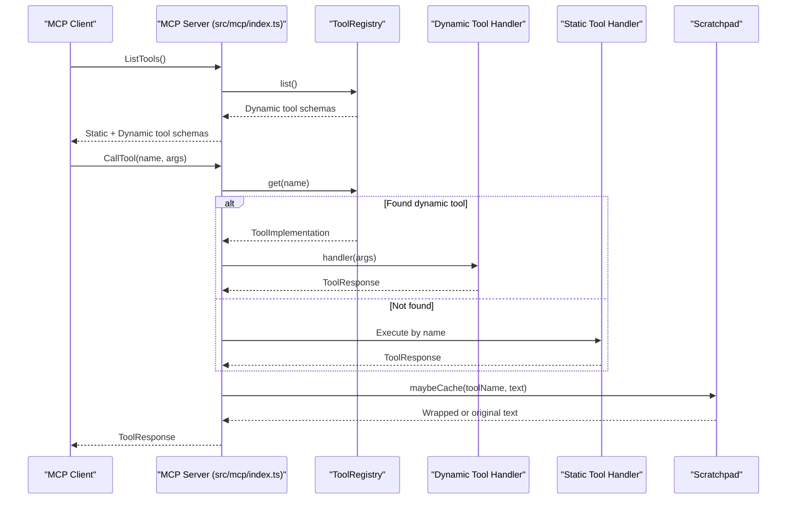
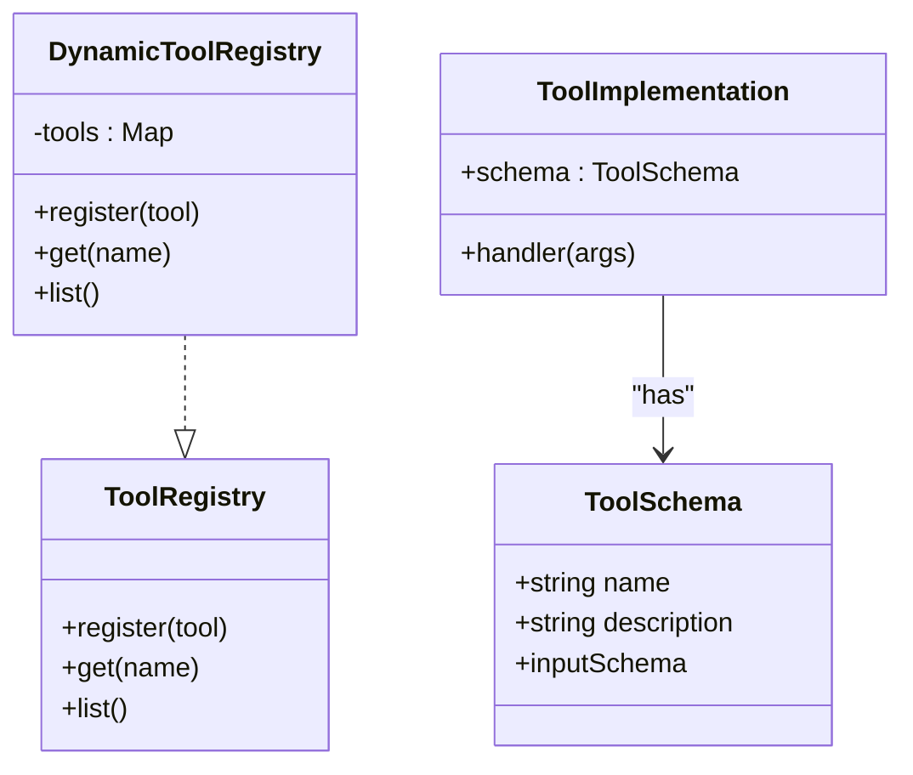
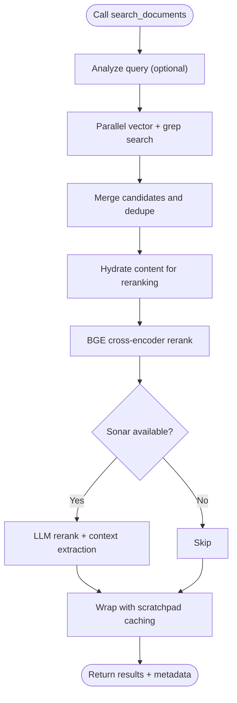
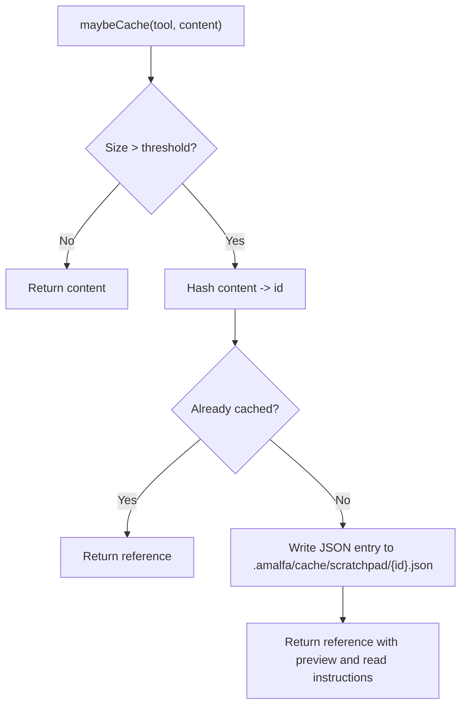
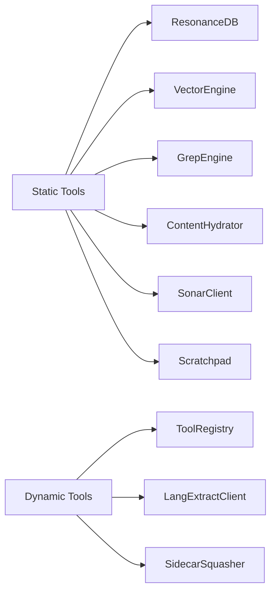

# MCP Tools Specification

<cite>
**Referenced Files in This Document**
- [src/mcp/index.ts](file://src/mcp/index.ts)
- [src/utils/ToolRegistry.ts](file://src/utils/ToolRegistry.ts)
- [src/tools/index.ts](file://src/tools/index.ts)
- [src/tools/EmberExtractTool.ts](file://src/tools/EmberExtractTool.ts)
- [src/types/tools.ts](file://src/types/tools.ts)
- [src/utils/Scratchpad.ts](file://src/utils/Scratchpad.ts)
- [src/config/schema.ts](file://src/config/schema.ts)
- [src/config/defaults.ts](file://src/config/defaults.ts)
- [docs/MCP-TOOLS.md](file://docs/MCP-TOOLS.md)
- [tests/scratchpad.test.ts](file://tests/scratchpad.test.ts)
- [scripts/verify/tool-registry-test.ts](file://scripts/verify/tool-registry-test.ts)
</cite>

## Table of Contents
1. [Introduction](#introduction)
2. [Project Structure](#project-structure)
3. [Core Components](#core-components)
4. [Architecture Overview](#architecture-overview)
5. [Detailed Component Analysis](#detailed-component-analysis)
6. [Dependency Analysis](#dependency-analysis)
7. [Performance Considerations](#performance-considerations)
8. [Troubleshooting Guide](#troubleshooting-guide)
9. [Conclusion](#conclusion)
10. [Appendices](#appendices)

## Introduction
This document specifies Amalfa’s Model Context Protocol (MCP) tools. It covers all available tools, their input parameters, response formats, error handling, and practical usage. It also explains how dynamic tools integrate with static tools via the ToolRegistry, and provides JSON schemas for input validation, response normalization, and error codes. Finally, it outlines capabilities, limitations, performance characteristics, and examples of tool chaining for complex agent workflows.

## Project Structure
Amalfa’s MCP server is implemented as a single entrypoint that registers both static tools and dynamic tools, and exposes them via the MCP protocol. Static tools are defined in the server module; dynamic tools are registered through a registry and become available alongside static tools.

**Diagram sources**
- [src/mcp/index.ts](file://src/mcp/index.ts#L142-L161)
- [src/utils/ToolRegistry.ts](file://src/utils/ToolRegistry.ts#L8-L27)
- [src/tools/index.ts](file://src/tools/index.ts#L4-L6)
- [src/tools/EmberExtractTool.ts](file://src/tools/EmberExtractTool.ts#L12-L33)
- [src/utils/Scratchpad.ts](file://src/utils/Scratchpad.ts#L59-L75)
- [src/config/schema.ts](file://src/config/schema.ts#L110-L117)
- [src/config/defaults.ts](file://src/config/defaults.ts#L16-L40)

**Section sources**
- [src/mcp/index.ts](file://src/mcp/index.ts#L142-L161)
- [src/utils/ToolRegistry.ts](file://src/utils/ToolRegistry.ts#L8-L27)
- [src/tools/index.ts](file://src/tools/index.ts#L4-L6)
- [src/tools/EmberExtractTool.ts](file://src/tools/EmberExtractTool.ts#L12-L33)
- [src/utils/Scratchpad.ts](file://src/utils/Scratchpad.ts#L59-L75)
- [src/config/schema.ts](file://src/config/schema.ts#L110-L117)
- [src/config/defaults.ts](file://src/config/defaults.ts#L16-L40)

## Core Components
- MCP Server: Registers static tools and handles tool execution, wrapping large outputs with scratchpad caching.
- ToolRegistry: Manages dynamic tools with registration, lookup, and listing.
- Dynamic Tools: Registered at startup; example: EmberExtractTool.
- Scratchpad: Caches large tool outputs and provides read/list operations.
- Configuration: Centralized schema defines scratchpad thresholds and other settings.

Key responsibilities:
- Static tools: search_documents, read_node_content, explore_links, list_directory_structure, find_gaps, inject_tags, scratchpad_read, scratchpad_list.
- Dynamic tools: ember_extract (registered at startup).
- Integration: Static tools are served alongside dynamic tools returned by the registry.

**Section sources**
- [src/mcp/index.ts](file://src/mcp/index.ts#L152-L250)
- [src/utils/ToolRegistry.ts](file://src/utils/ToolRegistry.ts#L8-L27)
- [src/tools/index.ts](file://src/tools/index.ts#L4-L6)
- [src/tools/EmberExtractTool.ts](file://src/tools/EmberExtractTool.ts#L12-L33)
- [src/utils/Scratchpad.ts](file://src/utils/Scratchpad.ts#L147-L190)
- [src/config/schema.ts](file://src/config/schema.ts#L110-L117)

## Architecture Overview
The MCP server initializes configuration, sets up daemons, registers tools (static and dynamic), and exposes them via MCP. Tool execution is handled centrally; dynamic tools are resolved from the registry first, then static tools are checked by name.

**Diagram sources**
- [src/mcp/index.ts](file://src/mcp/index.ts#L164-L250)
- [src/mcp/index.ts](file://src/mcp/index.ts#L252-L688)
- [src/utils/ToolRegistry.ts](file://src/utils/ToolRegistry.ts#L20-L26)
- [src/utils/Scratchpad.ts](file://src/utils/Scratchpad.ts#L147-L190)

## Detailed Component Analysis

### ToolRegistry and Dynamic Tool Integration
- Registration: Tools are registered with a unique name and schema; duplicates overwrite with a warning.
- Lookup: Tools are retrieved by name for execution.
- Listing: Returns schemas for all registered tools to be combined with static tool schemas.

**Diagram sources**
- [src/utils/ToolRegistry.ts](file://src/utils/ToolRegistry.ts#L8-L27)
- [src/types/tools.ts](file://src/types/tools.ts#L11-L20)

**Section sources**
- [src/utils/ToolRegistry.ts](file://src/utils/ToolRegistry.ts#L8-L27)
- [src/types/tools.ts](file://src/types/tools.ts#L1-L21)
- [src/tools/index.ts](file://src/tools/index.ts#L4-L6)
- [scripts/verify/tool-registry-test.ts](file://scripts/verify/tool-registry-test.ts#L6-L21)

### Static Tools: search_documents
- Purpose: Semantic search across knowledge graph with bicameral retrieval and reranking.
- Inputs:
  - query (string, required)
  - limit (number, default 20)
- Outputs: JSON with results array and metadata.
- Error handling: Aggregates engine errors into a single error response when no results.
- Performance: Vector search, BGE reranking, optional Sonar refinement.

**Diagram sources**
- [src/mcp/index.ts](file://src/mcp/index.ts#L267-L513)

**Section sources**
- [src/mcp/index.ts](file://src/mcp/index.ts#L166-L179)
- [src/mcp/index.ts](file://src/mcp/index.ts#L267-L513)
- [docs/MCP-TOOLS.md](file://docs/MCP-TOOLS.md#L80-L146)

### Static Tools: read_node_content
- Purpose: Read full markdown content of a document by node ID.
- Inputs:
  - id (string, required)
- Outputs: Raw markdown content.
- Error handling: Node not found, missing source path, file not found.

**Section sources**
- [src/mcp/index.ts](file://src/mcp/index.ts#L180-L189)
- [src/mcp/index.ts](file://src/mcp/index.ts#L515-L554)

### Static Tools: explore_links
- Purpose: Traverse graph relationships from a node.
- Inputs:
  - id (string, required)
  - relation (string, optional)
- Outputs: Array of edges with target and type.
- Error handling: Graceful if no edges found.

**Section sources**
- [src/mcp/index.ts](file://src/mcp/index.ts#L190-L202)
- [src/mcp/index.ts](file://src/mcp/index.ts#L556-L578)

### Static Tools: list_directory_structure
- Purpose: List document source directories.
- Inputs: none
- Outputs: Array of directory names.
- Note: Currently static; planned to be dynamic.

**Section sources**
- [src/mcp/index.ts](file://src/mcp/index.ts#L203-L208)
- [src/mcp/index.ts](file://src/mcp/index.ts#L580-L588)
- [docs/MCP-TOOLS.md](file://docs/MCP-TOOLS.md#L239-L268)

### Static Tools: find_gaps
- Purpose: Discover semantically similar but unlinked documents.
- Inputs:
  - limit (number, default 10)
  - threshold (number, default 0.8)
- Outputs: Array of gap suggestions with similarity and suggested link type.
- Error handling: Propagates Sonar errors as tool error response.

**Section sources**
- [src/mcp/index.ts](file://src/mcp/index.ts#L210-L220)
- [src/mcp/index.ts](file://src/mcp/index.ts#L590-L603)

### Static Tools: inject_tags
- Purpose: Add metadata tags to markdown files via HTML comment.
- Inputs:
  - file_path (string, required)
  - tags (array of strings, required)
- Outputs: Success message indicating injected or merged tags.
- Behavior: Merges with existing tags and deduplicates.

**Section sources**
- [src/mcp/index.ts](file://src/mcp/index.ts#L221-L242)
- [src/mcp/index.ts](file://src/mcp/index.ts#L605-L642)

### Static Tools: scratchpad_read
- Purpose: Read cached large output by ID.
- Inputs:
  - id (string, required; 12-char hash)
- Outputs: Full cached content.
- Error handling: Entry not found returns error.

**Section sources**
- [src/mcp/index.ts](file://src/mcp/index.ts#L222-L235)
- [src/mcp/index.ts](file://src/mcp/index.ts#L644-L658)
- [src/utils/Scratchpad.ts](file://src/utils/Scratchpad.ts#L195-L218)

### Static Tools: scratchpad_list
- Purpose: List cached entries with metadata and cache stats.
- Inputs: none
- Outputs: Entries and stats.
- Error handling: Graceful when no cache directory exists.

**Section sources**
- [src/mcp/index.ts](file://src/mcp/index.ts#L236-L242)
- [src/mcp/index.ts](file://src/mcp/index.ts#L660-L671)
- [src/utils/Scratchpad.ts](file://src/utils/Scratchpad.ts#L223-L247)

### Dynamic Tool: ember_extract
- Purpose: Surgically extract symbols and relationships from files/directories using LangExtract and squash into the knowledge graph.
- Inputs:
  - path (string, required)
  - dry_run (boolean, optional)
- Outputs: Statistics of scanned, extracted, squashed nodes/edges, and errors.
- Availability: Requires LangExtract sidecar.

**Section sources**
- [src/tools/EmberExtractTool.ts](file://src/tools/EmberExtractTool.ts#L12-L33)
- [src/tools/EmberExtractTool.ts](file://src/tools/EmberExtractTool.ts#L34-L138)
- [src/tools/index.ts](file://src/tools/index.ts#L4-L6)

### Scratchpad Protocol
- Caching: Automatically caches outputs exceeding a byte threshold; otherwise returns content directly.
- Content types: Detected as JSON, markdown, or text; previews generated for display.
- Access: read(id) and readContent(id); list() returns metadata; stats() aggregates cache info.
- Pruning: Age-based and size-based eviction policies.

**Diagram sources**
- [src/utils/Scratchpad.ts](file://src/utils/Scratchpad.ts#L147-L190)

**Section sources**
- [src/utils/Scratchpad.ts](file://src/utils/Scratchpad.ts#L147-L190)
- [src/utils/Scratchpad.ts](file://src/utils/Scratchpad.ts#L195-L247)
- [src/utils/Scratchpad.ts](file://src/utils/Scratchpad.ts#L272-L349)
- [tests/scratchpad.test.ts](file://tests/scratchpad.test.ts#L47-L102)

## Dependency Analysis
- Static tools depend on:
  - GraphEngine, VectorEngine, GrepEngine, ContentHydrator for search_documents.
  - ResonanceDB for read_node_content and explore_links.
  - SonarClient for query analysis, reranking, and context extraction.
  - Scratchpad for caching large outputs.
- Dynamic tools depend on:
  - ToolRegistry for registration and lookup.
  - LangExtractClient and SidecarSquasher for ember_extract.

**Diagram sources**
- [src/mcp/index.ts](file://src/mcp/index.ts#L49-L55)
- [src/mcp/index.ts](file://src/mcp/index.ts#L267-L513)
- [src/tools/EmberExtractTool.ts](file://src/tools/EmberExtractTool.ts#L58-L62)

**Section sources**
- [src/mcp/index.ts](file://src/mcp/index.ts#L49-L55)
- [src/mcp/index.ts](file://src/mcp/index.ts#L267-L513)
- [src/tools/EmberExtractTool.ts](file://src/tools/EmberExtractTool.ts#L58-L62)

## Performance Considerations
- search_documents:
  - Vector search ~10ms for 1000 docs; BGE reranking ~50ms; optional Sonar refinement ~2–5s; context extraction ~100ms for top 5.
- read_node_content: <5ms filesystem read.
- explore_links: <5ms indexed query.
- find_gaps: ~500ms for 1000-doc corpus with Sonar daemon.
- scratchpad_read: <1ms read from cache.
- ember_extract: Heavy operation; depends on sidecar availability and file counts.

[No sources needed since this section provides general guidance]

## Troubleshooting Guide
Common errors and resolutions:
- Node not found: Verify node ID from recent search results.
- Scratchpad entry not found: Use scratchpad_list() to find valid IDs; cache is session-scoped.
- Search errors: Indicates database/vector issues; run system diagnostics.

**Section sources**
- [src/mcp/index.ts](file://src/mcp/index.ts#L524-L526)
- [src/mcp/index.ts](file://src/mcp/index.ts#L648-L653)
- [docs/MCP-TOOLS.md](file://docs/MCP-TOOLS.md#L661-L688)

## Conclusion
Amalfa’s MCP tools combine robust static tooling with a flexible dynamic tool registry. The server integrates caching, optional LLM enhancements, and a clear error model. Agents can compose workflows using search, traversal, gap detection, and scratchpad operations, with dynamic tools extending capabilities as needed.

[No sources needed since this section summarizes without analyzing specific files]

## Appendices

### JSON Schemas

- Input validation for static tools:
  - search_documents: object with query (string, required), limit (number, default 20).
  - read_node_content: object with id (string, required).
  - explore_links: object with id (string, required), relation (string, optional).
  - list_directory_structure: empty object.
  - find_gaps: object with limit (number, default 10), threshold (number, default 0.8).
  - inject_tags: object with file_path (string, required), tags (array of strings, required).
  - scratchpad_read: object with id (string, required).
  - scratchpad_list: empty object.

- Response normalization:
  - All tools return a ToolResponse with content array of { type: "text", text } entries.
  - Large outputs are wrapped with scratchpad references; small outputs are returned as-is.

- Error codes:
  - isError flag set to true for error responses.
  - Error messages include actionable context (e.g., node not found, cache miss).

**Section sources**
- [src/mcp/index.ts](file://src/mcp/index.ts#L171-L178)
- [src/mcp/index.ts](file://src/mcp/index.ts#L184-L188)
- [src/mcp/index.ts](file://src/mcp/index.ts#L194-L201)
- [src/mcp/index.ts](file://src/mcp/index.ts#L213-L219)
- [src/mcp/index.ts](file://src/mcp/index.ts#L225-L234)
- [src/mcp/index.ts](file://src/mcp/index.ts#L245-L249)
- [src/mcp/index.ts](file://src/mcp/index.ts#L58-L60)

### Tool Capabilities, Limitations, and Performance
- search_documents: Comprehensive semantic search with reranking and optional LLM refinement.
- read_node_content: Direct content retrieval from filesystem-backed nodes.
- explore_links: Immediate neighbor traversal; multi-hop requires repeated calls.
- list_directory_structure: Static list; future dynamic scanning planned.
- find_gaps: Requires Sonar daemon; suggests missing links with LLM reasoning.
- inject_tags: Experimental; uses HTML comments; may not work with strict parsers.
- scratchpad_read/list: Session-scoped cache; designed for large output management.

**Section sources**
- [docs/MCP-TOOLS.md](file://docs/MCP-TOOLS.md#L689-L700)
- [src/mcp/index.ts](file://src/mcp/index.ts#L580-L588)
- [src/mcp/index.ts](file://src/mcp/index.ts#L590-L603)

### Tool Chaining and Composition Patterns
Recommended patterns for agent workflows:
- Discovery: search_documents → read_node_content → explore_links → read_node_content.
- Gap analysis: find_gaps → read_node_content (source/target) → decision.
- Research: search_documents → scratchpad_list → scratchpad_read → explore_links.
- Proactive vs reactive search: proactive at session start; reactive on demand.

**Section sources**
- [docs/MCP-TOOLS.md](file://docs/MCP-TOOLS.md#L558-L606)
- [docs/MCP-TOOLS.md](file://docs/MCP-TOOLS.md#L509-L547)