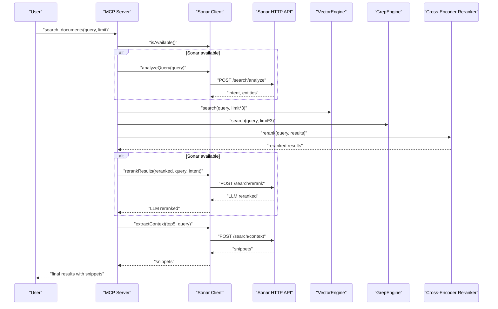
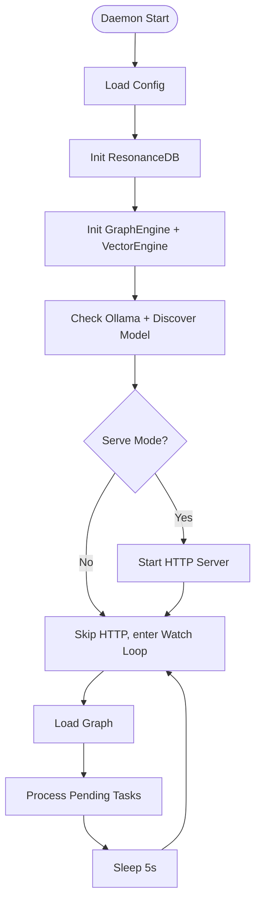
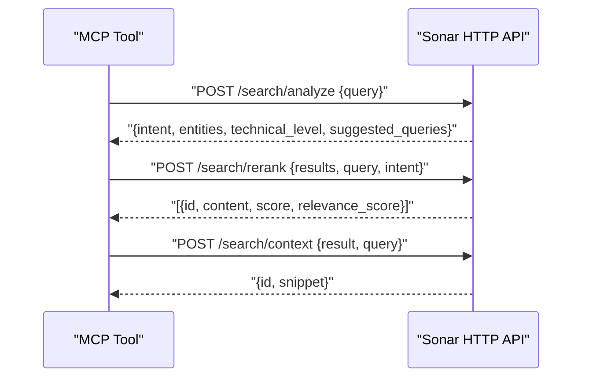
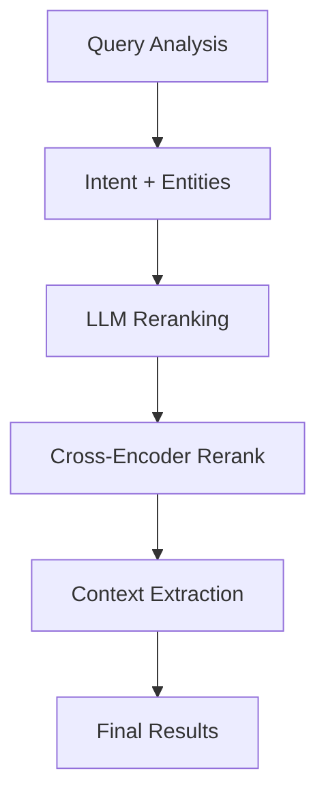
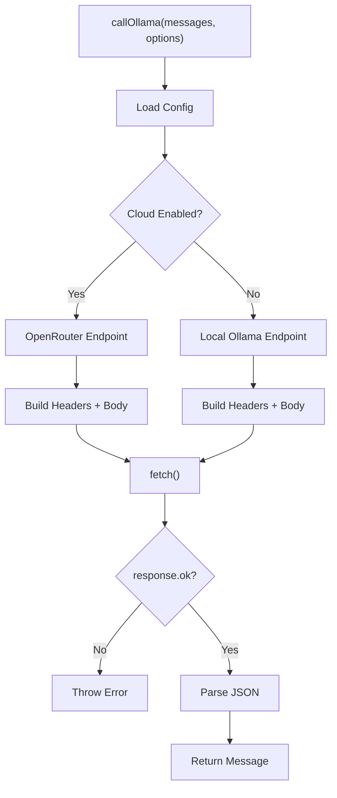
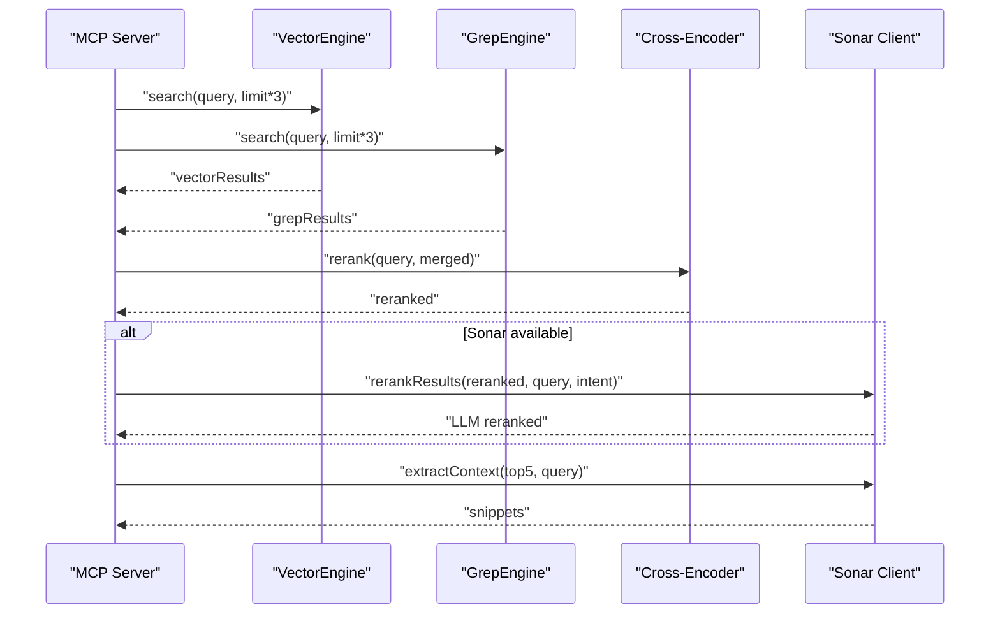
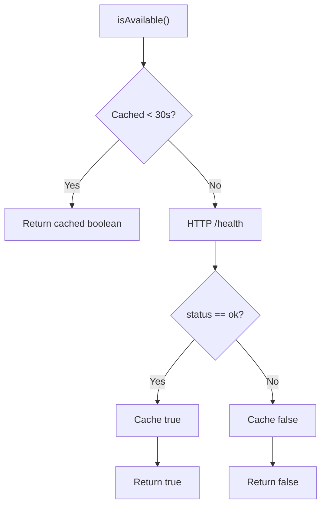
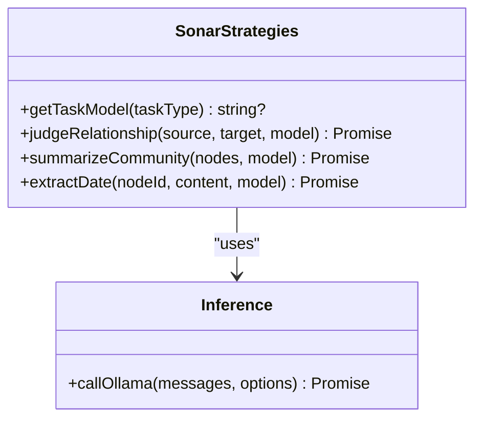
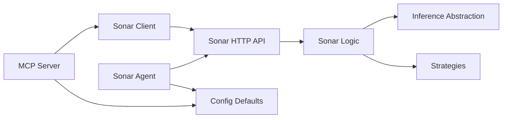

# Sonar Agent Integration

<cite>
**Referenced Files in This Document**
- [sonar-agent.ts](file://src/daemon/sonar-agent.ts)
- [sonar-server.ts](file://src/daemon/sonar-server.ts)
- [sonar-logic.ts](file://src/daemon/sonar-logic.ts)
- [sonar-inference.ts](file://src/daemon/sonar-inference.ts)
- [sonar-strategies.ts](file://src/daemon/sonar-strategies.ts)
- [sonar-types.ts](file://src/daemon/sonar-types.ts)
- [sonar-client.ts](file://src/utils/sonar-client.ts)
- [mcp/index.ts](file://src/mcp/index.ts)
- [defaults.ts](file://src/config/defaults.ts)
- [sonar-system-overview.md](file://playbooks/sonar-system-overview.md)
- [sonar-manual.md](file://playbooks/sonar-manual.md)
- [2026-01-08-sonar-agent-refactor.md](file://debriefs/2026-01-08-sonar-agent-refactor.md)
- [2026-01-08-sonar-modularization.md](file://debriefs/2026-01-08-sonar-modularization.md)
</cite>

## Table of Contents
1. [Introduction](#introduction)
2. [Project Structure](#project-structure)
3. [Core Components](#core-components)
4. [Architecture Overview](#architecture-overview)
5. [Detailed Component Analysis](#detailed-component-analysis)
6. [Dependency Analysis](#dependency-analysis)
7. [Performance Considerations](#performance-considerations)
8. [Troubleshooting Guide](#troubleshooting-guide)
9. [Conclusion](#conclusion)
10. [Appendices](#appendices)

## Introduction
This document explains the Sonar AI agent integration within Amalfa’s MCP framework. Sonar acts as a dual-role agent: a research assistant that performs iterative discovery and a context extractor that generates precise, intent-aware snippets from search results. It integrates with the MCP server to power an enhanced bicameral search pipeline: vector search (right brain) and keyword search (left brain), followed by cross-encoder reranking and optional LLM-based reranking and context extraction.

The Sonar agent exposes a lightweight HTTP API for real-time search intelligence and runs as a background daemon with task queues for batch operations. It supports both local Ollama inference and cloud providers (OpenRouter) with graceful fallbacks when external services are unavailable.

## Project Structure
The Sonar integration spans several modules:
- Daemon orchestration and HTTP API
- Search intelligence handlers (query analysis, reranking, context extraction)
- Inference abstraction for local and cloud providers
- MCP server integration for bicameral search and tool orchestration
- Client wrapper for Sonar endpoints with caching and timeouts
- Configuration and directory scaffolding

```mermaid
graph TB
subgraph "MCP Server"
MCP["src/mcp/index.ts"]
end
subgraph "Sonar Daemon"
Agent["src/daemon/sonar-agent.ts"]
Server["src/daemon/sonar-server.ts"]
Logic["src/daemon/sonar-logic.ts"]
Inference["src/daemon/sonar-inference.ts"]
Strategies["src/daemon/sonar-strategies.ts"]
Types["src/daemon/sonar-types.ts"]
end
subgraph "Client"
Client["src/utils/sonar-client.ts"]
end
subgraph "Config"
Defaults["src/config/defaults.ts"]
end
MCP --> Client
Client --> Server
Agent --> Server
Server --> Logic
Logic --> Inference
Logic --> Strategies
Agent --> Defaults
MCP --> Defaults
```

**Diagram sources**
- [mcp/index.ts](file://src/mcp/index.ts#L252-L513)
- [sonar-agent.ts](file://src/daemon/sonar-agent.ts#L118-L133)
- [sonar-server.ts](file://src/daemon/sonar-server.ts#L24-L133)
- [sonar-logic.ts](file://src/daemon/sonar-logic.ts#L1-L685)
- [sonar-inference.ts](file://src/daemon/sonar-inference.ts#L1-L120)
- [sonar-strategies.ts](file://src/daemon/sonar-strategies.ts#L1-L187)
- [sonar-client.ts](file://src/utils/sonar-client.ts#L54-L270)
- [defaults.ts](file://src/config/defaults.ts#L15-L59)

**Section sources**
- [sonar-agent.ts](file://src/daemon/sonar-agent.ts#L1-L221)
- [sonar-server.ts](file://src/daemon/sonar-server.ts#L1-L134)
- [sonar-logic.ts](file://src/daemon/sonar-logic.ts#L1-L685)
- [sonar-inference.ts](file://src/daemon/sonar-inference.ts#L1-L120)
- [sonar-strategies.ts](file://src/daemon/sonar-strategies.ts#L1-L187)
- [sonar-types.ts](file://src/daemon/sonar-types.ts#L1-L69)
- [sonar-client.ts](file://src/utils/sonar-client.ts#L1-L309)
- [mcp/index.ts](file://src/mcp/index.ts#L252-L513)
- [defaults.ts](file://src/config/defaults.ts#L15-L59)

## Core Components
- Sonar Daemon: Orchestrates HTTP routes, task queue processing, and lifecycle management. It loads the graph, initializes engines, and starts the HTTP server.
- HTTP API: Exposes health, chat, metadata enhancement, search analysis, reranking, and context extraction endpoints.
- Search Intelligence Handlers: Implement query intent detection, cross-encoder reranking, and context extraction with LLMs.
- Inference Abstraction: Unified provider logic supporting local Ollama and OpenRouter with model routing and API key handling.
- MCP Integration: Bicameral retrieval (vector + grep), cross-encoder reranking, optional LLM reranking, and context extraction.
- Client Wrapper: Caches availability, applies timeouts, and gracefully degrades when Sonar is offline.
- Configuration: Centralized settings and directory scaffolding for tasks and runtime artifacts.

**Section sources**
- [sonar-agent.ts](file://src/daemon/sonar-agent.ts#L60-L133)
- [sonar-server.ts](file://src/daemon/sonar-server.ts#L24-L133)
- [sonar-logic.ts](file://src/daemon/sonar-logic.ts#L184-L319)
- [sonar-inference.ts](file://src/daemon/sonar-inference.ts#L19-L119)
- [mcp/index.ts](file://src/mcp/index.ts#L289-L476)
- [sonar-client.ts](file://src/utils/sonar-client.ts#L54-L270)
- [defaults.ts](file://src/config/defaults.ts#L15-L59)

## Architecture Overview
The Sonar agent participates in a bicameral search architecture:
- Right brain: Vector search (BGE embeddings)
- Left brain: Keyword search (grep)
- Fusion: Late-fusion retrieval combining both streams
- Reranking: Cross-encoder (BGE) then optional LLM reranking (Sonar)
- Context extraction: Top-N results receive intent-aware snippets



**Diagram sources**
- [mcp/index.ts](file://src/mcp/index.ts#L289-L476)
- [sonar-client.ts](file://src/utils/sonar-client.ts#L118-L255)
- [sonar-server.ts](file://src/daemon/sonar-server.ts#L93-L130)

## Detailed Component Analysis

### Sonar Daemon Orchestration
Responsibilities:
- Loads configuration and initializes ResonanceDB, GraphEngine, and VectorEngine.
- Starts the HTTP server and registers routes.
- Watches task directories for queued jobs and executes them with reporting.
- Manages service lifecycle and notifications.

Key behaviors:
- Health and capability discovery for Ollama; sets model preference.
- Task routing by type: synthesis, timeline, garden, research, enhance_batch.
- Robust error handling with failure reports and notifications.



**Diagram sources**
- [sonar-agent.ts](file://src/daemon/sonar-agent.ts#L60-L116)

**Section sources**
- [sonar-agent.ts](file://src/daemon/sonar-agent.ts#L60-L221)

### HTTP API and Endpoints
Endpoints:
- GET /health: Provider and model status.
- POST /chat: Session-aware chat with vector augmentation.
- POST /metadata/enhance: Background metadata enhancement.
- GET /graph/stats: Graph statistics.
- POST /search/analyze: Query intent detection.
- POST /search/rerank: LLM-based reranking.
- POST /search/context: Smart snippet extraction.

Error handling:
- JSON error payloads with 500 status on failures.
- Graceful degradation in MCP client when Sonar is unavailable.



**Diagram sources**
- [sonar-server.ts](file://src/daemon/sonar-server.ts#L40-L130)
- [sonar-logic.ts](file://src/daemon/sonar-logic.ts#L184-L319)

**Section sources**
- [sonar-server.ts](file://src/daemon/sonar-server.ts#L24-L133)

### Search Intelligence Handlers
- Query Analysis: Parses user intent, entities, and suggested queries from LLM responses with JSON mode enforcement.
- Result Reranking: Uses LLM to assign relevance scores to reranked candidates.
- Context Extraction: Produces concise, intent-aligned snippets; falls back to truncated previews when unavailable.



**Diagram sources**
- [sonar-logic.ts](file://src/daemon/sonar-logic.ts#L184-L319)

**Section sources**
- [sonar-logic.ts](file://src/daemon/sonar-logic.ts#L184-L319)

### Inference Abstraction (Local and Cloud)
- Provider selection: Local Ollama or OpenRouter based on configuration.
- Model routing: Tiered resolution from override to cloud model to discovered model to config to default.
- Headers and keys: Handles API keys and required headers for OpenRouter.
- Error propagation: Structured errors with endpoint and model info.



**Diagram sources**
- [sonar-inference.ts](file://src/daemon/sonar-inference.ts#L19-L119)

**Section sources**
- [sonar-inference.ts](file://src/daemon/sonar-inference.ts#L1-L120)

### MCP Integration and Bicameral Search
- Bicameral retrieval: Runs vector and grep engines concurrently.
- Late fusion: Merges results, preserving hybrid signals.
- Cross-encoder reranking: Hydrates content and reranks with BGE.
- Optional LLM reranking: Uses Sonar when available and when intent is detected.
- Context extraction: Generates snippets for top-N results.



**Diagram sources**
- [mcp/index.ts](file://src/mcp/index.ts#L312-L476)

**Section sources**
- [mcp/index.ts](file://src/mcp/index.ts#L267-L513)

### Client Wrapper and Fallback Strategies
- Availability caching: 30s cache window to avoid frequent health checks.
- Timeouts: Configurable per-task timeout; uses AbortController.
- Graceful degradation:
  - Query analysis: returns null and lets MCP fall back to basic search.
  - Reranking: returns original scores.
  - Context extraction: returns simple snippet and moderate confidence.
  - Gaps: returns empty list.



**Diagram sources**
- [sonar-client.ts](file://src/utils/sonar-client.ts#L72-L113)

**Section sources**
- [sonar-client.ts](file://src/utils/sonar-client.ts#L54-L309)

### Strategies and Task Routing
- Task model selection: When cloud is enabled, assigns free tier models per task category.
- Judge relationship: Determines whether two nodes should be linked and classifies the relationship.
- Community synthesis: Summarizes clusters of related nodes.
- Chronos: Extracts temporal anchors from documents.



**Diagram sources**
- [sonar-strategies.ts](file://src/daemon/sonar-strategies.ts#L10-L187)
- [sonar-inference.ts](file://src/daemon/sonar-inference.ts#L19-L119)

**Section sources**
- [sonar-strategies.ts](file://src/daemon/sonar-strategies.ts#L1-L187)

### Configuration Options
- Master enable/disable for Sonar.
- Port, model, and cloud provider settings.
- Task-specific timeouts and search behavior.
- Directory scaffolding for tasks and runtime artifacts.

**Section sources**
- [defaults.ts](file://src/config/defaults.ts#L15-L59)
- [sonar-system-overview.md](file://playbooks/sonar-system-overview.md#L122-L139)

## Dependency Analysis
- Sonar Daemon depends on configuration, ResonanceDB, GraphEngine, and VectorEngine.
- HTTP API delegates to logic handlers; logic handlers depend on inference abstraction and strategies.
- MCP server depends on Sonar client for optional enhancements.
- Client depends on configuration for host/port and timeout settings.



**Diagram sources**
- [mcp/index.ts](file://src/mcp/index.ts#L252-L513)
- [sonar-client.ts](file://src/utils/sonar-client.ts#L54-L270)
- [sonar-server.ts](file://src/daemon/sonar-server.ts#L24-L133)
- [sonar-logic.ts](file://src/daemon/sonar-logic.ts#L1-L685)
- [sonar-inference.ts](file://src/daemon/sonar-inference.ts#L1-L120)
- [sonar-strategies.ts](file://src/daemon/sonar-strategies.ts#L1-L187)
- [sonar-agent.ts](file://src/daemon/sonar-agent.ts#L118-L133)
- [defaults.ts](file://src/config/defaults.ts#L15-L59)

**Section sources**
- [mcp/index.ts](file://src/mcp/index.ts#L252-L513)
- [sonar-client.ts](file://src/utils/sonar-client.ts#L54-L270)
- [sonar-server.ts](file://src/daemon/sonar-server.ts#L24-L133)
- [sonar-logic.ts](file://src/daemon/sonar-logic.ts#L1-L685)
- [sonar-inference.ts](file://src/daemon/sonar-inference.ts#L1-L120)
- [sonar-strategies.ts](file://src/daemon/sonar-strategies.ts#L1-L187)
- [sonar-agent.ts](file://src/daemon/sonar-agent.ts#L118-L133)
- [defaults.ts](file://src/config/defaults.ts#L15-L59)

## Performance Considerations
- Startup: 1–2s for model loading; subsequent operations are fast.
- Per-operation latencies: vector search ~50–100ms; query analysis ~200–400ms; reranking ~300–500ms; context extraction ~500–1500ms depending on top-N.
- Throughput: HTTP API designed for concurrent requests; client caches availability to minimize overhead.
- Fallbacks: MCP continues with basic search when Sonar is unavailable, ensuring minimal latency impact.

[No sources needed since this section provides general guidance]

## Troubleshooting Guide
Common symptoms and resolutions:
- Ollama not available: Ensure the Ollama service is running and the model is pulled.
- Model not found: Pull the appropriate model locally or configure a cloud model.
- Slow search: Disable Sonar or use a smaller model; verify port availability.
- Port conflicts: Stop stale processes and restart the daemon.

Operational tips:
- Use the Sonar status command to verify health.
- Inspect logs under .amalfa/logs for detailed error traces.
- Leverage JSON mode to enforce reliable output parsing.

**Section sources**
- [sonar-manual.md](file://playbooks/sonar-manual.md#L77-L94)
- [2026-01-08-sonar-agent-refactor.md](file://debriefs/2026-01-08-sonar-agent-refactor.md#L19-L31)
- [2026-01-08-sonar-modularization.md](file://debriefs/2026-01-08-sonar-modularization.md#L21-L32)

## Conclusion
The Sonar agent integrates tightly with Amalfa’s MCP framework to deliver a bicameral search pipeline enriched by semantic understanding and context extraction. Its modular design, robust fallbacks, and unified inference abstraction make it resilient and adaptable across local and cloud environments. By leveraging query intent detection, cross-encoder reranking, and LLM-based context extraction, Sonar significantly improves search quality and developer productivity.

[No sources needed since this section summarizes without analyzing specific files]

## Appendices

### Practical Examples and Workflow Patterns
- Query Analysis: Use the analyze endpoint to detect intent and entities; integrate with MCP to inform reranking and context extraction.
- LLM Reranking: When intent is available, re-rank results with Sonar to improve precision.
- Context Extraction: Generate snippets for top results to accelerate decision-making.
- Batch Enhancement: Run background tasks to enrich metadata and content.

**Section sources**
- [sonar-system-overview.md](file://playbooks/sonar-system-overview.md#L92-L120)
- [sonar-logic.ts](file://src/daemon/sonar-logic.ts#L184-L319)

### Configuration Reference
- Master enable flag, port, model, and cloud settings.
- Task timeouts and search behavior.
- Directory structure for tasks and runtime artifacts.

**Section sources**
- [defaults.ts](file://src/config/defaults.ts#L15-L59)
- [sonar-system-overview.md](file://playbooks/sonar-system-overview.md#L122-L139)