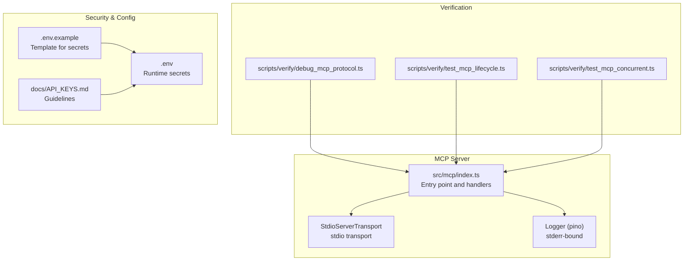
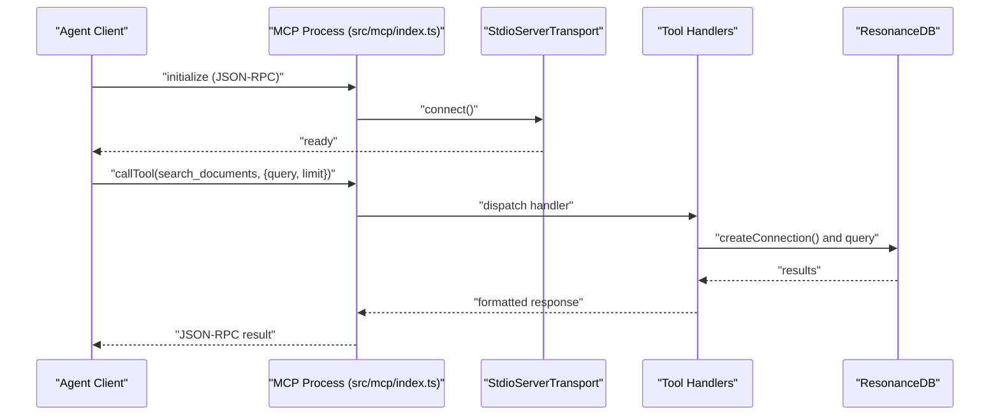
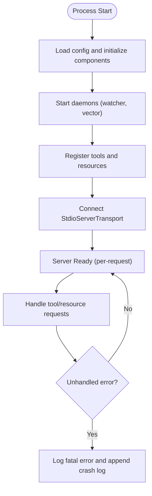
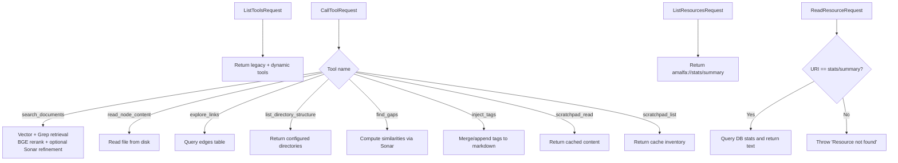
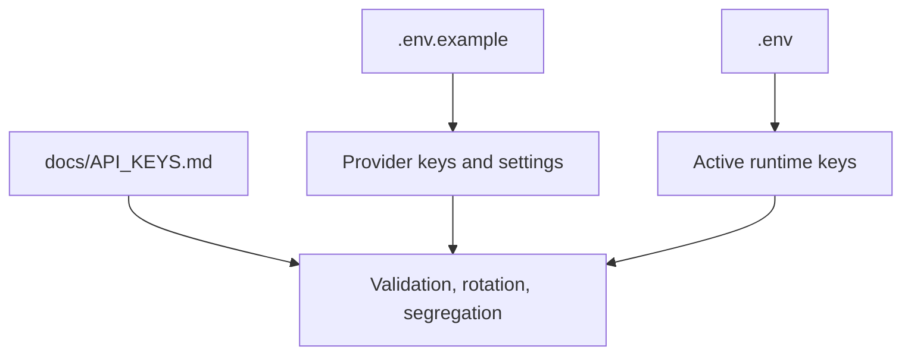
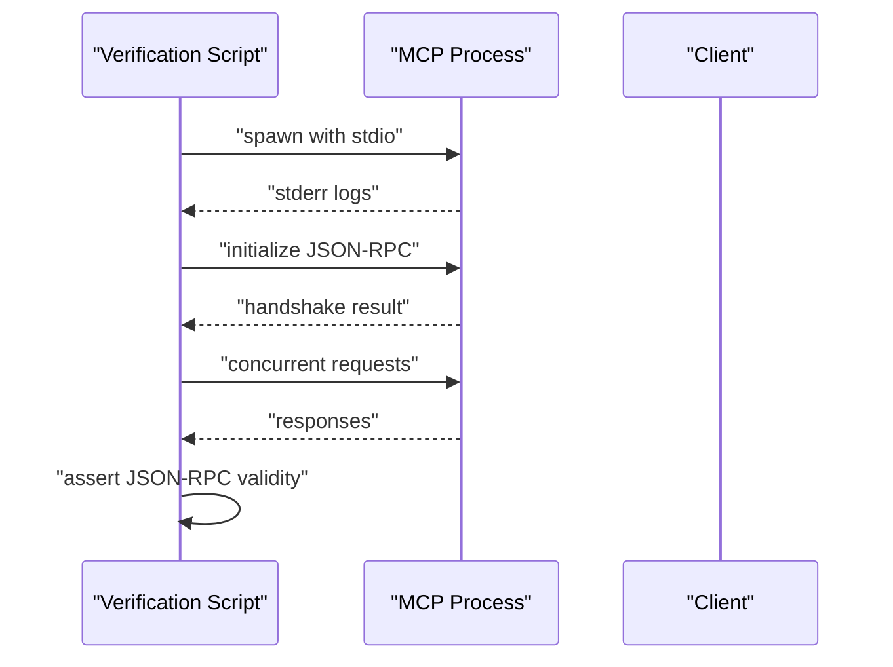
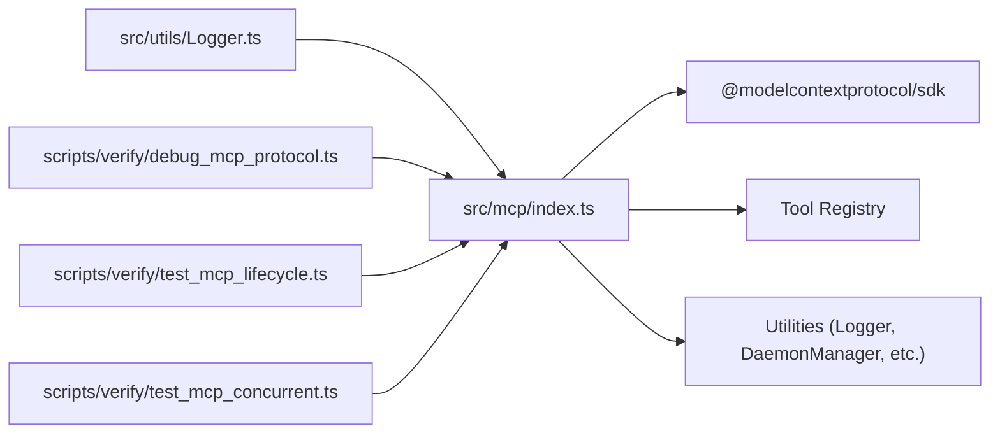

# Transport and Security

<cite>
**Referenced Files in This Document**
- [src/mcp/index.ts](file://src/mcp/index.ts)
- [.env.example](file://.env.example)
- [.env](file://.env)
- [docs/API_KEYS.md](file://docs/API_KEYS.md)
- [src/utils/Logger.ts](file://src/utils/Logger.ts)
- [scripts/verify/debug_mcp_protocol.ts](file://scripts/verify/debug_mcp_protocol.ts)
- [scripts/verify/test_mcp_lifecycle.ts](file://scripts/verify/test_mcp_lifecycle.ts)
- [scripts/verify/test_mcp_concurrent.ts](file://scripts/verify/test_mcp_concurrent.ts)
- [docs/MCP-TOOLS.md](file://docs/MCP-TOOLS.md)
- [src/utils/validator.ts](file://src/utils/validator.ts)
- [docs/references/hardened-sqlite.md](file://docs/references/hardened-sqlite.md)
</cite>

## Table of Contents
1. [Introduction](#introduction)
2. [Project Structure](#project-structure)
3. [Core Components](#core-components)
4. [Architecture Overview](#architecture-overview)
5. [Detailed Component Analysis](#detailed-component-analysis)
6. [Dependency Analysis](#dependency-analysis)
7. [Performance Considerations](#performance-considerations)
8. [Troubleshooting Guide](#troubleshooting-guide)
9. [Conclusion](#conclusion)
10. [Appendices](#appendices)

## Introduction
This document explains the Model Context Protocol (MCP) transport mechanisms and security posture in Amalfa. It focuses on the stdio-based transport implementation using StdioServerTransport, outlines security best practices for agent communication, details environment variable management for API keys and secrets, and describes logging and monitoring strategies for MCP communications. It also covers potential security vulnerabilities and mitigation strategies for agent interactions, along with configuration examples for secure MCP deployment and integration with agent platforms.

## Project Structure
The MCP server is implemented as a standalone entry point that registers tools and resources, connects to an stdio transport, and manages lifecycle and logging. Supporting documentation and verification scripts demonstrate protocol behavior and concurrency.

**Diagram sources**
- [src/mcp/index.ts](file://src/mcp/index.ts#L719-L723)
- [src/utils/Logger.ts](file://src/utils/Logger.ts#L1-L23)
- [scripts/verify/debug_mcp_protocol.ts](file://scripts/verify/debug_mcp_protocol.ts#L1-L47)
- [scripts/verify/test_mcp_lifecycle.ts](file://scripts/verify/test_mcp_lifecycle.ts#L45-L79)
- [scripts/verify/test_mcp_concurrent.ts](file://scripts/verify/test_mcp_concurrent.ts#L61-L125)
- [.env.example](file://.env.example#L1-L83)
- [.env](file://.env#L1-L3)
- [docs/API_KEYS.md](file://docs/API_KEYS.md#L1-L414)

**Section sources**
- [src/mcp/index.ts](file://src/mcp/index.ts#L1-L748)
- [src/utils/Logger.ts](file://src/utils/Logger.ts#L1-L23)
- [scripts/verify/debug_mcp_protocol.ts](file://scripts/verify/debug_mcp_protocol.ts#L1-L47)
- [scripts/verify/test_mcp_lifecycle.ts](file://scripts/verify/test_mcp_lifecycle.ts#L45-L79)
- [scripts/verify/test_mcp_concurrent.ts](file://scripts/verify/test_mcp_concurrent.ts#L61-L125)
- [.env.example](file://.env.example#L1-L83)
- [.env](file://.env#L1-L3)
- [docs/API_KEYS.md](file://docs/API_KEYS.md#L1-L414)

## Core Components
- Stdio-based transport: The server instantiates StdioServerTransport and connects the MCP server to stdin/stdout, enabling agent clients to communicate via standard streams.
- Tool handlers: The server registers handlers for tool invocations (search, read, explore, list, gaps, tag injection, scratchpad read/list) and resource access (system stats).
- Lifecycle and logging: The server initializes services, manages PID/log files, and uses a stderr-bound logger to avoid polluting stdout.
- Global error handling: Uncaught exceptions and unhandled rejections are logged and persisted to a crash log file.

**Section sources**
- [src/mcp/index.ts](file://src/mcp/index.ts#L146-L250)
- [src/mcp/index.ts](file://src/mcp/index.ts#L252-L688)
- [src/mcp/index.ts](file://src/mcp/index.ts#L690-L723)
- [src/mcp/index.ts](file://src/mcp/index.ts#L725-L747)
- [src/utils/Logger.ts](file://src/utils/Logger.ts#L1-L23)

## Architecture Overview
The MCP server follows a per-request connection model over stdio. Agents connect via JSON-RPC over stdin/stdout. The server validates inputs, executes tool logic, and returns structured responses. Logging is directed to stderr to preserve stdout for protocol messages.

**Diagram sources**
- [src/mcp/index.ts](file://src/mcp/index.ts#L146-L250)
- [src/mcp/index.ts](file://src/mcp/index.ts#L252-L688)
- [src/mcp/index.ts](file://src/mcp/index.ts#L719-L723)

## Detailed Component Analysis

### Stdio Transport and Lifecycle
- Transport: StdioServerTransport is instantiated and connected to the server, establishing a JSON-RPC channel over stdin/stdout.
- Lifecycle: ServiceLifecycle manages PID and log files, ensuring clean startup and shutdown.
- Logging: Logger is configured to write to stderr, preventing protocol output pollution.

**Diagram sources**
- [src/mcp/index.ts](file://src/mcp/index.ts#L37-L42)
- [src/mcp/index.ts](file://src/mcp/index.ts#L94-L139)
- [src/mcp/index.ts](file://src/mcp/index.ts#L146-L250)
- [src/mcp/index.ts](file://src/mcp/index.ts#L719-L723)
- [src/utils/Logger.ts](file://src/utils/Logger.ts#L1-L23)
- [src/mcp/index.ts](file://src/mcp/index.ts#L725-L747)

**Section sources**
- [src/mcp/index.ts](file://src/mcp/index.ts#L37-L42)
- [src/mcp/index.ts](file://src/mcp/index.ts#L94-L139)
- [src/mcp/index.ts](file://src/mcp/index.ts#L146-L250)
- [src/mcp/index.ts](file://src/mcp/index.ts#L719-L723)
- [src/utils/Logger.ts](file://src/utils/Logger.ts#L1-L23)
- [src/mcp/index.ts](file://src/mcp/index.ts#L725-L747)

### Tool Handlers and Resource Access
- Tools: The server registers handlers for search, read, explore, list, gaps, tag injection, and scratchpad operations. Each handler validates inputs, performs database or filesystem operations, and returns structured content.
- Resources: The server exposes a resource URI for system statistics, returning concise plain text summaries.

**Diagram sources**
- [src/mcp/index.ts](file://src/mcp/index.ts#L164-L250)
- [src/mcp/index.ts](file://src/mcp/index.ts#L252-L688)
- [src/mcp/index.ts](file://src/mcp/index.ts#L690-L717)

**Section sources**
- [src/mcp/index.ts](file://src/mcp/index.ts#L164-L250)
- [src/mcp/index.ts](file://src/mcp/index.ts#L252-L688)
- [src/mcp/index.ts](file://src/mcp/index.ts#L690-L717)

### Security Best Practices for Agent Communication
- Input validation: Validate and sanitize all inputs from tool requests and resource URIs. Reject malformed or suspicious payloads early.
- Output sanitization: Ensure tool responses are structured and safe for consumption. Avoid echoing raw agent input in plaintext outputs.
- Resource access controls: Restrict filesystem reads to known, configured paths and enforce strict checks before opening files.
- Secrets management: Store API keys and tokens in environment variables and never hardcode them. Use the provided template and guidelines.
- Transport hygiene: Keep stdout clean for protocol messages; use stderr for logs to prevent interference with MCP communication.

**Section sources**
- [src/mcp/index.ts](file://src/mcp/index.ts#L252-L688)
- [src/mcp/index.ts](file://src/mcp/index.ts#L690-L717)
- [.env.example](file://.env.example#L1-L83)
- [.env](file://.env#L1-L3)
- [docs/API_KEYS.md](file://docs/API_KEYS.md#L1-L414)
- [src/utils/Logger.ts](file://src/utils/Logger.ts#L1-L23)

### Environment Variable Management and .env Template
- Template: The .env.example file documents provider keys, LangExtract configuration, database path, and development settings, including explicit security notes.
- Runtime: The .env file holds active keys for the current environment.
- Guidelines: docs/API_KEYS.md provides detailed guidance on sourcing keys, validation, rotation, and environment segregation.

**Diagram sources**
- [.env.example](file://.env.example#L1-L83)
- [.env](file://.env#L1-L3)
- [docs/API_KEYS.md](file://docs/API_KEYS.md#L1-L414)

**Section sources**
- [.env.example](file://.env.example#L1-L83)
- [.env](file://.env#L1-L3)
- [docs/API_KEYS.md](file://docs/API_KEYS.md#L1-L414)

### Logging and Monitoring Strategies
- Logger configuration: The logger writes to stderr and binds a component name for traceability.
- Error boundaries: Global uncaughtException and unhandledRejection handlers log fatal errors and append crash logs.
- Protocol verification: Scripts validate handshake, concurrent requests, and protocol correctness.

**Diagram sources**
- [src/utils/Logger.ts](file://src/utils/Logger.ts#L1-L23)
- [src/mcp/index.ts](file://src/mcp/index.ts#L725-L747)
- [scripts/verify/debug_mcp_protocol.ts](file://scripts/verify/debug_mcp_protocol.ts#L1-L47)
- [scripts/verify/test_mcp_lifecycle.ts](file://scripts/verify/test_mcp_lifecycle.ts#L45-L79)
- [scripts/verify/test_mcp_concurrent.ts](file://scripts/verify/test_mcp_concurrent.ts#L61-L125)

**Section sources**
- [src/utils/Logger.ts](file://src/utils/Logger.ts#L1-L23)
- [src/mcp/index.ts](file://src/mcp/index.ts#L725-L747)
- [scripts/verify/debug_mcp_protocol.ts](file://scripts/verify/debug_mcp_protocol.ts#L1-L47)
- [scripts/verify/test_mcp_lifecycle.ts](file://scripts/verify/test_mcp_lifecycle.ts#L45-L79)
- [scripts/verify/test_mcp_concurrent.ts](file://scripts/verify/test_mcp_concurrent.ts#L61-L125)

### Potential Security Vulnerabilities and Mitigations
- Injection risks: Tool handlers that read files or manipulate content should reject unsafe paths and sanitize outputs.
- Concurrency hazards: Ensure per-request database connections and avoid shared mutable state across requests.
- Resource exposure: Only expose necessary resources and validate URIs.
- Secrets leakage: Prevent printing secrets to logs; use structured logging with redaction.
- Database integrity: Use robust validation and integrity checks to detect anomalies.

Mitigations:
- Validate and sanitize inputs rigorously.
- Use per-request connections and ephemeral resources.
- Restrict filesystem access to controlled paths.
- Enforce strict logging policies and redaction.
- Harden SQLite access patterns and WAL permissions.

**Section sources**
- [src/mcp/index.ts](file://src/mcp/index.ts#L252-L688)
- [src/mcp/index.ts](file://src/mcp/index.ts#L690-L717)
- [src/utils/validator.ts](file://src/utils/validator.ts#L1-L265)
- [docs/references/hardened-sqlite.md](file://docs/references/hardened-sqlite.md#L1-L16)

### Configuration Examples for Secure MCP Deployment
- Agent integration: Configure agent clients to launch the MCP server via the CLI and pass serve arguments.
- Environment separation: Use separate .env files per environment and rotate keys regularly.
- Provider selection: Choose providers aligned with your privacy and latency goals; configure LangExtract accordingly.

**Section sources**
- [docs/MCP-TOOLS.md](file://docs/MCP-TOOLS.md#L609-L647)
- [.env.example](file://.env.example#L1-L83)
- [docs/API_KEYS.md](file://docs/API_KEYS.md#L381-L414)

## Dependency Analysis
The MCP server depends on the SDK’s stdio transport, internal tool registry, and utility services. Logging is decoupled via pino. Verification scripts depend on spawning the server and asserting protocol behavior.

**Diagram sources**
- [src/mcp/index.ts](file://src/mcp/index.ts#L1-L27)
- [src/utils/Logger.ts](file://src/utils/Logger.ts#L1-L23)
- [scripts/verify/debug_mcp_protocol.ts](file://scripts/verify/debug_mcp_protocol.ts#L1-L47)
- [scripts/verify/test_mcp_lifecycle.ts](file://scripts/verify/test_mcp_lifecycle.ts#L45-L79)
- [scripts/verify/test_mcp_concurrent.ts](file://scripts/verify/test_mcp_concurrent.ts#L61-L125)

**Section sources**
- [src/mcp/index.ts](file://src/mcp/index.ts#L1-L27)
- [src/utils/Logger.ts](file://src/utils/Logger.ts#L1-L23)
- [scripts/verify/debug_mcp_protocol.ts](file://scripts/verify/debug_mcp_protocol.ts#L1-L47)
- [scripts/verify/test_mcp_lifecycle.ts](file://scripts/verify/test_mcp_lifecycle.ts#L45-L79)
- [scripts/verify/test_mcp_concurrent.ts](file://scripts/verify/test_mcp_concurrent.ts#L61-L125)

## Performance Considerations
- Per-request connections: Database connections are created per request and closed afterward, reducing contention and simplifying error isolation.
- Asynchronous operations: Parallel execution of vector and grep search engines improves throughput.
- Caching: Scratchpad caches large outputs to reduce repeated computation and network overhead.
- Logging overhead: Writing to stderr minimizes impact on protocol throughput.

**Section sources**
- [src/mcp/index.ts](file://src/mcp/index.ts#L49-L55)
- [src/mcp/index.ts](file://src/mcp/index.ts#L315-L331)
- [src/mcp/index.ts](file://src/mcp/index.ts#L76-L92)

## Troubleshooting Guide
- Protocol handshake failures: Use the debug script to validate initialization and observe logs on stderr.
- Concurrency issues: Run the concurrent test to verify multiple requests behave correctly.
- Fatal errors: Inspect crash logs appended by the global error handlers.
- Database integrity: Use the validator utility to capture baselines and detect anomalies.

**Section sources**
- [scripts/verify/debug_mcp_protocol.ts](file://scripts/verify/debug_mcp_protocol.ts#L1-L47)
- [scripts/verify/test_mcp_concurrent.ts](file://scripts/verify/test_mcp_concurrent.ts#L61-L125)
- [src/mcp/index.ts](file://src/mcp/index.ts#L725-L747)
- [src/utils/validator.ts](file://src/utils/validator.ts#L1-L265)

## Conclusion
Amalfa’s MCP server employs a robust stdio transport with per-request connections, structured logging, and comprehensive error handling. Security is addressed through strict input validation, controlled resource access, environment-based secret management, and hardened database practices. The included verification scripts and documentation provide practical guidance for secure deployment and agent integration.

## Appendices
- Agent integration examples and tool reference are documented in the MCP tools reference.
- Environment configuration and API key management guidelines are provided in dedicated documentation.

**Section sources**
- [docs/MCP-TOOLS.md](file://docs/MCP-TOOLS.md#L609-L647)
- [docs/API_KEYS.md](file://docs/API_KEYS.md#L1-L414)