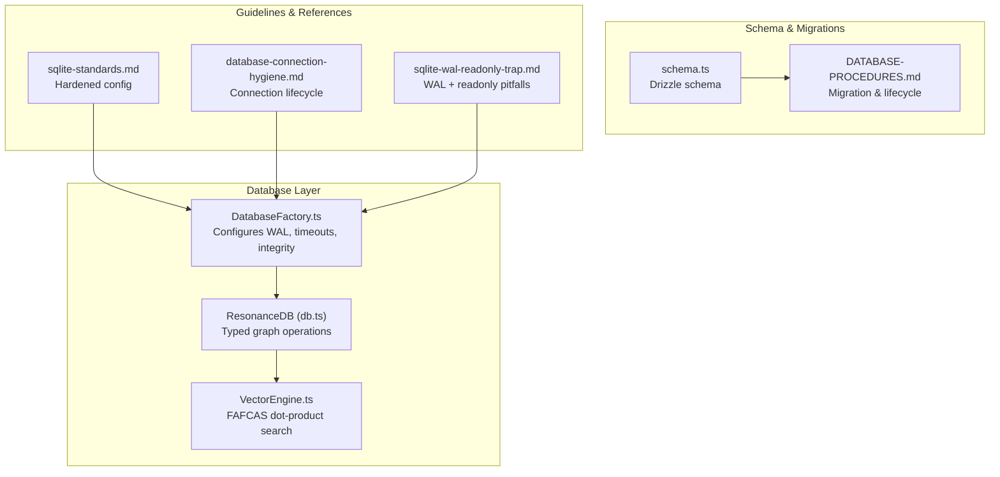
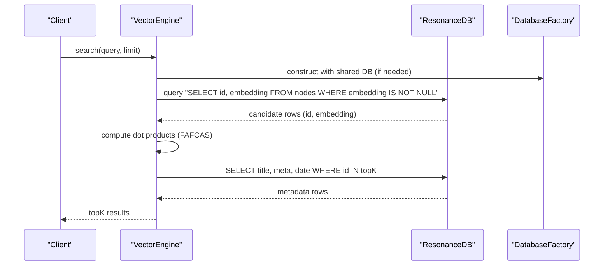
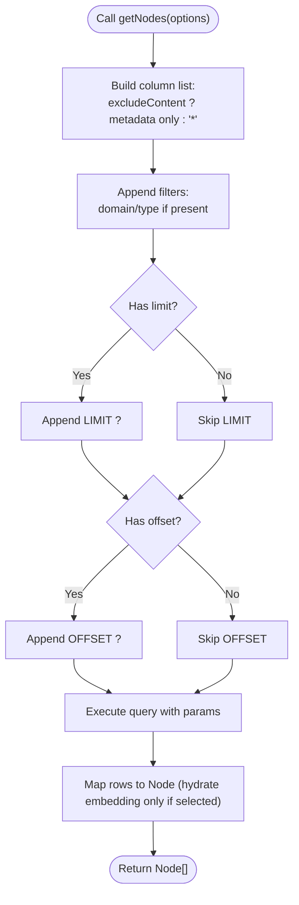
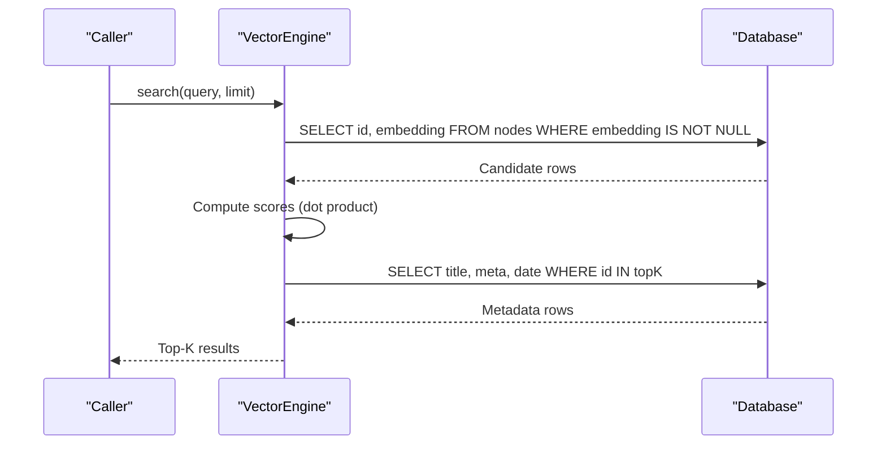
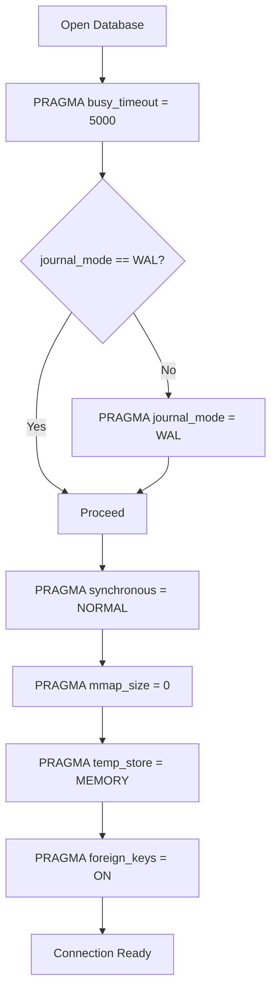
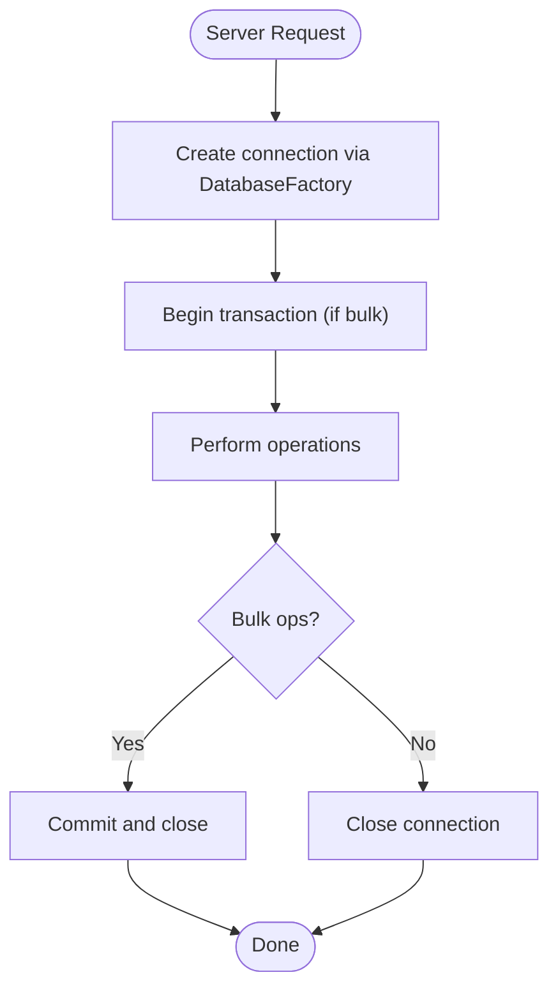
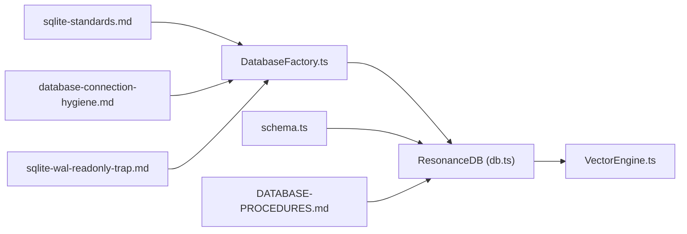

# Database Optimization and Tuning

<cite>
**Referenced Files in This Document**
- [DatabaseFactory.ts](file://src/resonance/DatabaseFactory.ts)
- [db.ts](file://src/resonance/db.ts)
- [VectorEngine.ts](file://src/core/VectorEngine.ts)
- [sqlite-standards.md](file://playbooks/sqlite-standards.md)
- [database-connection-hygiene.md](file://playbooks/database-connection-hygiene.md)
- [sqlite-wal-readonly-trap.md](file://docs/references/sqlite-wal-readonly-trap.md)
- [DATABASE-PROCEDURES.md](file://src/resonance/DATABASE-PROCEDURES.md)
- [schema.ts](file://src/resonance/drizzle/schema.ts)
- [simple_search_test.ts](file://scripts/verify/simple_search_test.ts)
- [checkpoint.ts](file://scripts/pipeline/checkpoint.ts)
- [performance_audit.md](file://docs/reports/performance_audit.md)
- [ARCHITECTURE.md](file://docs/ARCHITECTURE.md)
- [StatsTracker.ts](file://src/utils/StatsTracker.ts)
</cite>

## Table of Contents
1. [Introduction](#introduction)
2. [Project Structure](#project-structure)
3. [Core Components](#core-components)
4. [Architecture Overview](#architecture-overview)
5. [Detailed Component Analysis](#detailed-component-analysis)
6. [Dependency Analysis](#dependency-analysis)
7. [Performance Considerations](#performance-considerations)
8. [Troubleshooting Guide](#troubleshooting-guide)
9. [Conclusion](#conclusion)
10. [Appendices](#appendices)

## Introduction
This document provides comprehensive guidance for Amalfa’s database optimization strategies and tuning techniques. It focuses on:
- Critical fixes to the getNodes function to prevent full table scans via limit/offset and column selection
- Deprecation strategy for redundant findSimilar in favor of centralized VectorEngine optimization
- SQLite configuration optimizations (WAL mode, connection hygiene, pragmas)
- Indexing strategies, query performance analysis, and maintenance procedures
- Capacity planning, growth monitoring, and scaling considerations for large-scale knowledge graph deployments

## Project Structure
The database layer centers around a SQLite-based runtime with a strict configuration enforced by a factory, a typed wrapper for graph operations, and a vector engine optimized for FAFCAS dot-product similarity search.

**Diagram sources**
- [DatabaseFactory.ts](file://src/resonance/DatabaseFactory.ts#L27-L66)
- [db.ts](file://src/resonance/db.ts#L25-L68)
- [VectorEngine.ts](file://src/core/VectorEngine.ts#L76-L109)
- [schema.ts](file://src/resonance/drizzle/schema.ts#L16-L51)
- [DATABASE-PROCEDURES.md](file://src/resonance/DATABASE-PROCEDURES.md#L46-L100)
- [sqlite-standards.md](file://playbooks/sqlite-standards.md#L14-L25)
- [database-connection-hygiene.md](file://playbooks/database-connection-hygiene.md#L11-L28)
- [sqlite-wal-readonly-trap.md](file://docs/references/sqlite-wal-readonly-trap.md#L1-L199)

**Section sources**
- [DatabaseFactory.ts](file://src/resonance/DatabaseFactory.ts#L13-L66)
- [db.ts](file://src/resonance/db.ts#L25-L68)
- [VectorEngine.ts](file://src/core/VectorEngine.ts#L76-L109)
- [schema.ts](file://src/resonance/drizzle/schema.ts#L16-L51)
- [sqlite-standards.md](file://playbooks/sqlite-standards.md#L14-L25)
- [database-connection-hygiene.md](file://playbooks/database-connection-hygiene.md#L11-L28)
- [sqlite-wal-readonly-trap.md](file://docs/references/sqlite-wal-readonly-trap.md#L1-L199)

## Core Components
- DatabaseFactory: Enforces hardened SQLite configuration (WAL, busy_timeout, synchronous, mmap, foreign_keys, temp_store) and validates health.
- ResonanceDB: Typed graph operations including getNodes with safe defaults, transaction helpers, and statistics.
- VectorEngine: FAFCAS dot-product search with slim scanning, embedding caching, and dependency injection of a shared database connection.

Key optimization highlights:
- getNodes supports limit/offset and excludeContent to avoid full-table scans and reduce memory pressure.
- VectorEngine performs “slim search” by loading only id and embedding for scoring, then hydrating metadata for top-K results.
- Centralized configuration via DatabaseFactory prevents WAL readonly pitfalls and ensures concurrency.

**Section sources**
- [DatabaseFactory.ts](file://src/resonance/DatabaseFactory.ts#L27-L66)
- [db.ts](file://src/resonance/db.ts#L194-L239)
- [VectorEngine.ts](file://src/core/VectorEngine.ts#L159-L240)
- [sqlite-standards.md](file://playbooks/sqlite-standards.md#L14-L25)

## Architecture Overview
The system uses SQLite as a high-performance storage engine with FAFCAS vector normalization and Bun’s sqlite driver for zero-copy BLOB handling. WAL mode enables concurrency; strict pragmas ensure stability and performance.

**Diagram sources**
- [VectorEngine.ts](file://src/core/VectorEngine.ts#L159-L240)
- [db.ts](file://src/resonance/db.ts#L165-L196)
- [DatabaseFactory.ts](file://src/resonance/DatabaseFactory.ts#L27-L66)

**Section sources**
- [ARCHITECTURE.md](file://docs/ARCHITECTURE.md#L252-L337)
- [VectorEngine.ts](file://src/core/VectorEngine.ts#L159-L240)
- [db.ts](file://src/resonance/db.ts#L165-L196)

## Detailed Component Analysis

### getNodes: Safe Limits and Column Selection
The getNodes method was optimized to prevent full table scans:
- Adds limit and offset parameters for pagination and bounded scans.
- Adds excludeContent option to avoid selecting large BLOBs (embedding/content) when only metadata is needed.
- Builds dynamic WHERE clauses for domain/type filtering.

**Diagram sources**
- [db.ts](file://src/resonance/db.ts#L194-L239)

**Section sources**
- [db.ts](file://src/resonance/db.ts#L194-L239)
- [performance_audit.md](file://docs/reports/performance_audit.md#L19-L27)

### VectorEngine: Centralized Optimization and Deprecation Strategy
VectorEngine centralizes vector search with:
- Slim scanning: selects only id and embedding for scoring.
- Dot product similarity for unit vectors (FAFCAS).
- Metadata hydration for top-K results only.
- Embedding caching in long-running processes to avoid repeated BLOB-to-Float32Array conversions.

Deprecation strategy:
- Remove db.findSimilar in favor of VectorEngine.search to ensure a single optimized path.
- Maintain backward compatibility during transition by logging deprecation warnings and updating callers to use VectorEngine.

**Diagram sources**
- [VectorEngine.ts](file://src/core/VectorEngine.ts#L159-L240)
- [performance_audit.md](file://docs/reports/performance_audit.md#L39-L42)

**Section sources**
- [VectorEngine.ts](file://src/core/VectorEngine.ts#L76-L109)
- [VectorEngine.ts](file://src/core/VectorEngine.ts#L159-L240)
- [performance_audit.md](file://docs/reports/performance_audit.md#L39-L42)

### SQLite Configuration Optimizations
Hardened configuration enforced by DatabaseFactory:
- WAL mode mandatory for concurrency.
- Busy timeout set to 5000ms to handle contention.
- Synchronous set to NORMAL for safe WAL performance.
- mmap disabled (0) for stability.
- Foreign keys enabled for integrity.
- Temp store in memory for intermediate results.

**Diagram sources**
- [DatabaseFactory.ts](file://src/resonance/DatabaseFactory.ts#L44-L63)
- [sqlite-standards.md](file://playbooks/sqlite-standards.md#L18-L24)

**Section sources**
- [DatabaseFactory.ts](file://src/resonance/DatabaseFactory.ts#L44-L63)
- [sqlite-standards.md](file://playbooks/sqlite-standards.md#L18-L24)
- [sqlite-wal-readonly-trap.md](file://docs/references/sqlite-wal-readonly-trap.md#L1-L199)

### Connection Pooling Strategies and Lifecycle
- Use DatabaseFactory for all connections to enforce standards.
- Per-request connections for servers; ephemeral for CLI tools.
- Always wrap operations in try/finally to ensure db.close().
- Keep transactions short (under 50% of busy_timeout).
- Avoid global persistent connections.

**Diagram sources**
- [database-connection-hygiene.md](file://playbooks/database-connection-hygiene.md#L51-L73)
- [DatabaseFactory.ts](file://src/resonance/DatabaseFactory.ts#L27-L66)

**Section sources**
- [database-connection-hygiene.md](file://playbooks/database-connection-hygiene.md#L11-L28)
- [database-connection-hygiene.md](file://playbooks/database-connection-hygiene.md#L51-L73)
- [database-connection-hygiene.md](file://playbooks/database-connection-hygiene.md#L75-L95)

### Indexing Strategies for Frequently Accessed Columns
Recommended indexes based on schema and usage:
- nodes(type), nodes(domain), nodes(layer), nodes(hash), nodes(date)
- edges(source), edges(target), edges(type)
- tags(tag) for tagging queries

These support:
- getNodes(domain?, type?), node updates, and edge traversals.
- Efficient filtering and joins in graph operations.

**Section sources**
- [schema.ts](file://src/resonance/drizzle/schema.ts#L16-L51)
- [ARCHITECTURE.md](file://docs/ARCHITECTURE.md#L317-L326)

### Query Performance Analysis
- Use EXPLAIN QUERY PLAN to analyze hotspots.
- Monitor WAL checkpointing and page size to estimate DB size and fragmentation.
- Track transaction durations and commit frequency to tune batch sizes.

Operational commands:
- PRAGMA wal_checkpoint(TRUNCATE) to compact WAL into DB.
- PRAGMA page_count × PRAGMA page_size for DB size.
- VACUUM and ANALYZE for maintenance and query planner hints.

**Section sources**
- [db.ts](file://src/resonance/db.ts#L305-L335)
- [checkpoint.ts](file://scripts/pipeline/checkpoint.ts#L1-L7)
- [DATABASE-PROCEDURES.md](file://src/resonance/DATABASE-PROCEDURES.md#L219-L230)

### Database Maintenance Procedures
- Pre-migration backup and post-migration verification.
- Drizzle-driven migrations with dry-run review.
- Integrity checks, vacuum, and analyze during maintenance windows.
- WAL checkpointing to reclaim space and reduce WAL file growth.

**Section sources**
- [DATABASE-PROCEDURES.md](file://src/resonance/DATABASE-PROCEDURES.md#L207-L230)
- [DATABASE-PROCEDURES.md](file://src/resonance/DATABASE-PROCEDURES.md#L46-L100)
- [checkpoint.ts](file://scripts/pipeline/checkpoint.ts#L1-L7)

### Capacity Planning and Scaling Considerations
- Monitor growth via StatsTracker snapshots (nodes, edges, embeddings, DB size).
- Scale horizontally by adding more reader connections (WAL supports concurrency).
- Scale vertically by optimizing batch sizes and ensuring short transactions.
- Consider partitioning by domain or layer if graph density grows significantly.

**Section sources**
- [StatsTracker.ts](file://src/utils/StatsTracker.ts#L192-L217)
- [ARCHITECTURE.md](file://docs/ARCHITECTURE.md#L328-L337)

## Dependency Analysis
The following diagram shows key dependencies among database components and policies:

**Diagram sources**
- [sqlite-standards.md](file://playbooks/sqlite-standards.md#L14-L25)
- [database-connection-hygiene.md](file://playbooks/database-connection-hygiene.md#L11-L28)
- [sqlite-wal-readonly-trap.md](file://docs/references/sqlite-wal-readonly-trap.md#L1-L199)
- [DatabaseFactory.ts](file://src/resonance/DatabaseFactory.ts#L27-L66)
- [db.ts](file://src/resonance/db.ts#L25-L68)
- [VectorEngine.ts](file://src/core/VectorEngine.ts#L76-L109)
- [schema.ts](file://src/resonance/drizzle/schema.ts#L16-L51)
- [DATABASE-PROCEDURES.md](file://src/resonance/DATABASE-PROCEDURES.md#L46-L100)

**Section sources**
- [DatabaseFactory.ts](file://src/resonance/DatabaseFactory.ts#L27-L66)
- [db.ts](file://src/resonance/db.ts#L25-L68)
- [VectorEngine.ts](file://src/core/VectorEngine.ts#L76-L109)
- [schema.ts](file://src/resonance/drizzle/schema.ts#L16-L51)
- [sqlite-standards.md](file://playbooks/sqlite-standards.md#L14-L25)
- [database-connection-hygiene.md](file://playbooks/database-connection-hygiene.md#L11-L28)
- [sqlite-wal-readonly-trap.md](file://docs/references/sqlite-wal-readonly-trap.md#L1-L199)
- [DATABASE-PROCEDURES.md](file://src/resonance/DATABASE-PROCEDURES.md#L46-L100)

## Performance Considerations
- Prefer slim scans: load only id and embedding for ranking; hydrate metadata for top-K.
- Use limit/offset in getNodes to bound memory and I/O.
- Cache embeddings in long-running processes to avoid repeated BLOB deserialization.
- Keep transactions short; tune batch sizes to stay under busy_timeout.
- Use WAL mode with proper pragmas; avoid readonly connections in WAL mode.

[No sources needed since this section provides general guidance]

## Troubleshooting Guide
Common issues and resolutions:
- “Database is locked”: Check for stale daemons, reduce batch size, ensure proper cleanup.
- WAL readonly errors: Remove readonly flags; all connections must participate in SHM updates.
- Slow searches: Confirm slim scan is active; verify indexes exist; monitor transaction durations.
- Schema mismatches: Use Drizzle migrations; backup before changes; verify with integrity checks.

**Section sources**
- [database-connection-hygiene.md](file://playbooks/database-connection-hygiene.md#L271-L320)
- [sqlite-wal-readonly-trap.md](file://docs/references/sqlite-wal-readonly-trap.md#L1-L199)
- [DATABASE-PROCEDURES.md](file://src/resonance/DATABASE-PROCEDURES.md#L234-L274)

## Conclusion
Amalfa’s database optimization hinges on:
- Centralized, hardened SQLite configuration via DatabaseFactory
- Safe, bounded queries in ResonanceDB (getNodes)
- Single optimized path for vector search via VectorEngine
- Strict connection hygiene and maintenance procedures
These practices ensure concurrency, performance, and reliability for large-scale knowledge graph deployments.

[No sources needed since this section summarizes without analyzing specific files]

## Appendices

### Appendix A: WAL Mode Benefits and Pitfalls
- Benefits: Concurrent readers/writers, reduced writer blocking, improved throughput.
- Pitfall: Never use readonly=true with WAL; readers must update SHM.

**Section sources**
- [sqlite-wal-readonly-trap.md](file://docs/references/sqlite-wal-readonly-trap.md#L1-L199)
- [sqlite-standards.md](file://playbooks/sqlite-standards.md#L18-L24)

### Appendix B: Example Usage of Safe Queries
- Use getNodes with limit/offset and excludeContent for metadata-only scans.
- Use VectorEngine.search for vector similarity with slim scanning.

**Section sources**
- [db.ts](file://src/resonance/db.ts#L194-L239)
- [VectorEngine.ts](file://src/core/VectorEngine.ts#L159-L240)
- [simple_search_test.ts](file://scripts/verify/simple_search_test.ts#L1-L30)