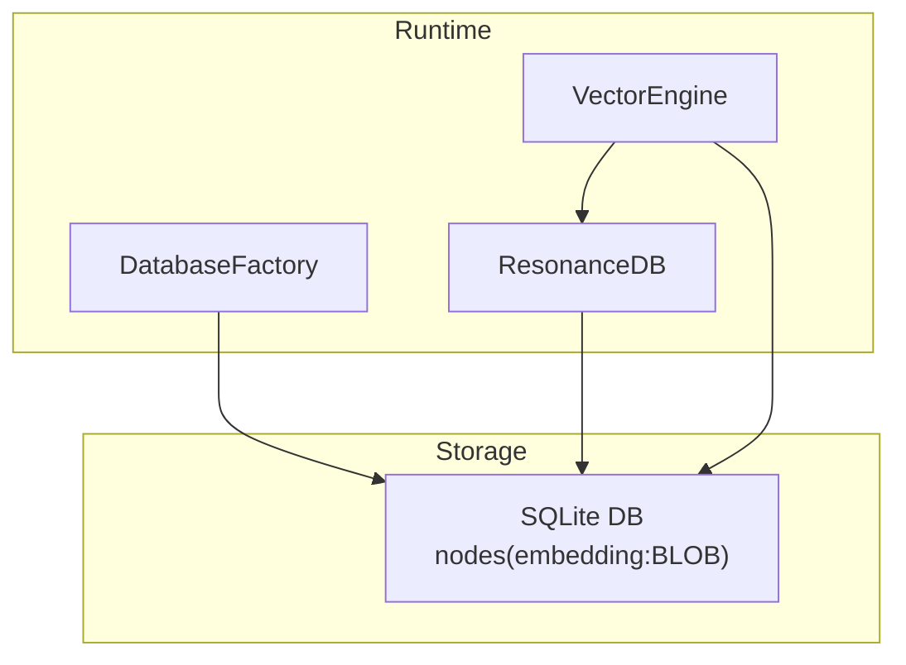
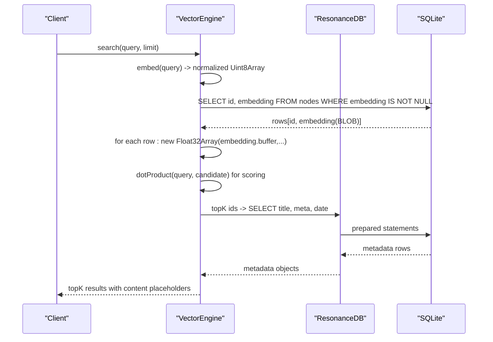
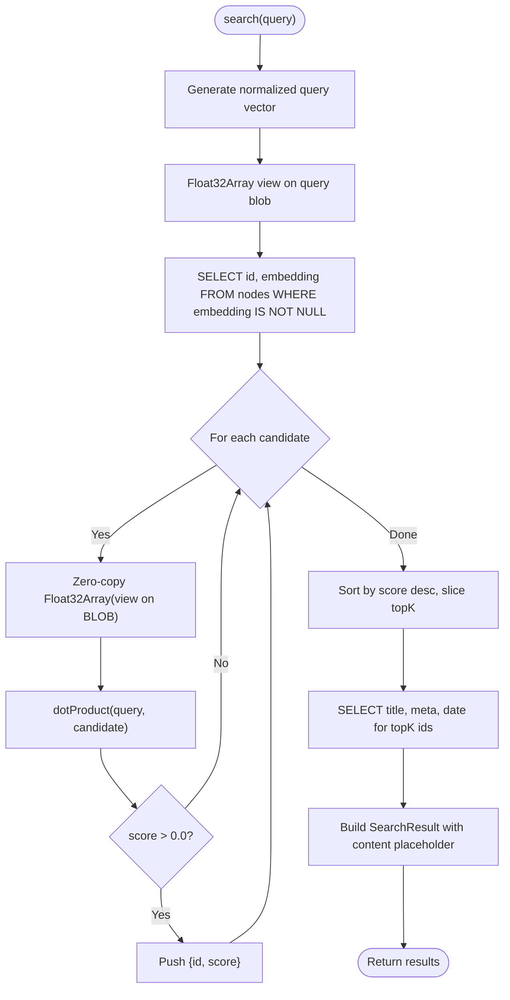
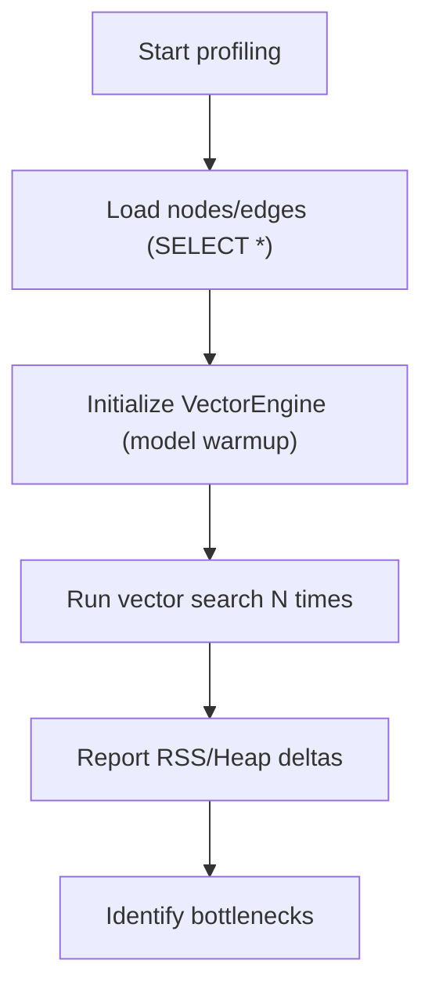
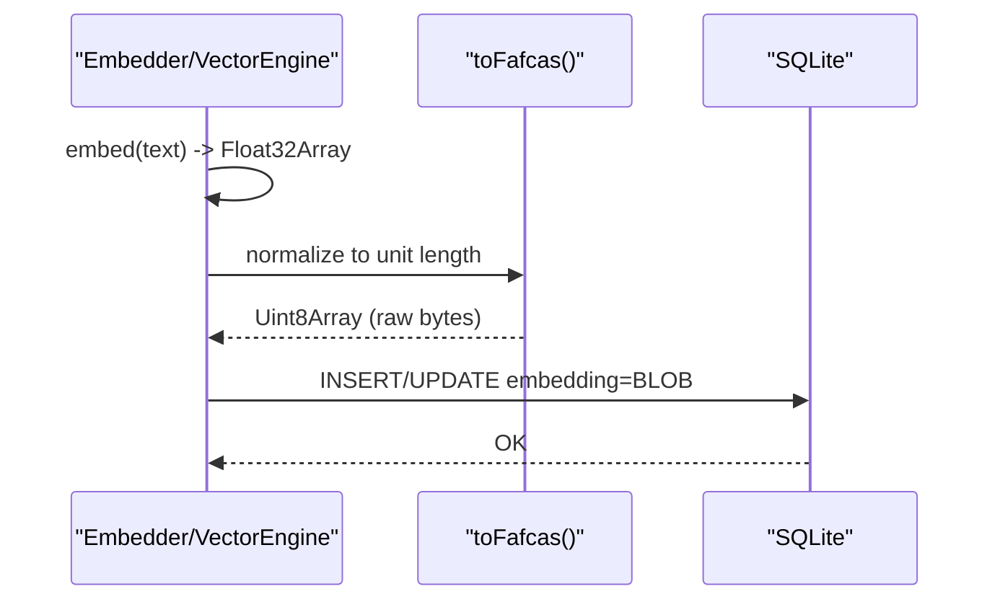
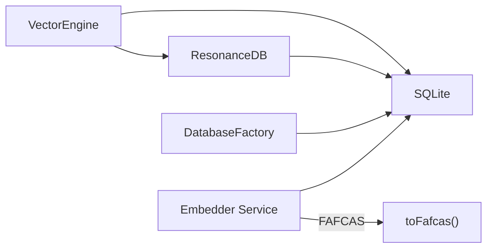

# Memory Management and Optimization

<cite>
**Referenced Files in This Document**
- [VectorEngine.ts](file://src/core/VectorEngine.ts)
- [db.ts](file://src/resonance/db.ts)
- [DatabaseFactory.ts](file://src/resonance/DatabaseFactory.ts)
- [profile_memory.ts](file://scripts/profile_memory.ts)
- [performance_audit.md](file://docs/audits/PERFORMANCE_BASELINES.md)
- [embeddings-and-fafcas-protocol-playbook.md](file://playbooks/embeddings-and-fafcas-protocol-playbook.md)
- [sqlite-wal-readonly-trap.md](file://docs/references/sqlite-wal-readonly-trap.md)
- [thin-node.md](file://docs/architecture/thin-node.md)
- [simple-forensics.ts](file://scripts/lab/simple-forensics.ts)
- [forensic-investigation.ts](file://scripts/lab/forensic-investigation.ts)
- [embedder.ts](file://src/resonance/services/embedder.ts)
</cite>

## Table of Contents
1. [Introduction](#introduction)
2. [Project Structure](#project-structure)
3. [Core Components](#core-components)
4. [Architecture Overview](#architecture-overview)
5. [Detailed Component Analysis](#detailed-component-analysis)
6. [Dependency Analysis](#dependency-analysis)
7. [Performance Considerations](#performance-considerations)
8. [Troubleshooting Guide](#troubleshooting-guide)
9. [Conclusion](#conclusion)

## Introduction
This document explains Amalfa’s memory management strategies and optimization techniques for the knowledge graph engine. It focuses on:
- Slim Search: reducing memory allocation by fetching only necessary columns (id, embedding) during vector similarity checks
- Mitigating memory pressure for large knowledge bases with thousands of nodes
- Float32Array caching to avoid repeated BLOB-to-JS deserialization overhead
- Garbage collection optimization and leak prevention
- Monitoring memory usage patterns and identifying bottlenecks
- Implementing memory-efficient data structures for the knowledge graph engine

## Project Structure
Amalfa organizes memory-critical logic around three pillars:
- VectorEngine: performs vector search with zero-copy Float32Array views and slim scans
- ResonanceDB: provides typed accessors and safe defaults to avoid loading large BLOBs unnecessarily
- DatabaseFactory: enforces hardened SQLite pragmas for concurrency and stability

**Diagram sources**
- [VectorEngine.ts](file://src/core/VectorEngine.ts#L76-L242)
- [db.ts](file://src/resonance/db.ts#L25-L431)
- [DatabaseFactory.ts](file://src/resonance/DatabaseFactory.ts#L13-L103)

**Section sources**
- [VectorEngine.ts](file://src/core/VectorEngine.ts#L76-L242)
- [db.ts](file://src/resonance/db.ts#L25-L431)
- [DatabaseFactory.ts](file://src/resonance/DatabaseFactory.ts#L13-L103)

## Core Components
- VectorEngine: Implements FAFCAS-compliant vector search with:
  - Slim Scan: selects only id and embedding for ranking
  - Zero-copy Float32Array views on BLOBs
  - Dot product similarity for unit vectors
  - Hydration of metadata only for top-K results
- ResonanceDB: Provides safe, typed accessors with optional exclusion of large BLOBs and metadata hydration helpers
- DatabaseFactory: Enforces WAL mode, busy_timeout, synchronous, foreign_keys, and temp_store pragmas

**Section sources**
- [VectorEngine.ts](file://src/core/VectorEngine.ts#L155-L240)
- [db.ts](file://src/resonance/db.ts#L194-L239)
- [DatabaseFactory.ts](file://src/resonance/DatabaseFactory.ts#L44-L65)

## Architecture Overview
The memory-efficient search flow minimizes JavaScript heap growth by avoiding full-node hydration until necessary.

**Diagram sources**
- [VectorEngine.ts](file://src/core/VectorEngine.ts#L159-L240)
- [db.ts](file://src/resonance/db.ts#L194-L239)

## Detailed Component Analysis

### Slim Search Implementation
Slim Search dramatically reduces memory pressure by:
- Selecting only id and embedding during the ranking phase
- Creating zero-copy Float32Array views on BLOBs
- Hydrating metadata (title, meta, date) only for top-K results

**Diagram sources**
- [VectorEngine.ts](file://src/core/VectorEngine.ts#L159-L240)

**Section sources**
- [VectorEngine.ts](file://src/core/VectorEngine.ts#L159-L240)

### Float32Array Caching Approach
To avoid repeated BLOB-to-JS deserialization overhead:
- Cache Float32Array views keyed by node id in long-running processes (e.g., daemon, MCP)
- Invalidate cache on node updates or periodic refresh cycles
- Use weak references cautiously; prefer explicit eviction policies

Guidance:
- Store Float32Array views in a Map keyed by node id
- Hydrate lazily on first access; reuse cached views for subsequent searches
- Periodically refresh caches after ingestion batches

[No sources needed since this section provides general guidance]

### Memory Pressure Mitigation Strategies
- Limit and offset: Use ResonanceDB.getNodes with explicit limits and offsets to avoid scanning entire graphs
- Exclude content and embedding: When scanning metadata, exclude large BLOBs to reduce heap pressure
- Thin Node Protocol: Store only lead summaries; read full content on demand to minimize DB size and memory footprint

**Section sources**
- [db.ts](file://src/resonance/db.ts#L194-L239)
- [thin-node.md](file://docs/architecture/thin-node.md#L118-L122)

### Garbage Collection Optimization and Leak Prevention
- Avoid retaining large arrays beyond their scope; prefer streaming and early termination
- Use typed arrays with explicit lifecycles; avoid wrapping buffers unnecessarily
- Prefer zero-copy views over copying data into new arrays
- Monitor and cap top-K sizes to bound intermediate allocations

[No sources needed since this section provides general guidance]

### Monitoring Memory Usage Patterns
- Use the provided profiling script to measure RSS and heap deltas across stages:
  - Database load (SELECT *)
  - Vector model initialization (WASM/Model)
  - Vector search execution (average latency and growth)
- Track growth between steps to identify hotspots

**Diagram sources**
- [profile_memory.ts](file://scripts/profile_memory.ts#L15-L94)

**Section sources**
- [profile_memory.ts](file://scripts/profile_memory.ts#L15-L94)

### Embedding Normalization and Storage (FAFCAS)
- Embeddings are normalized to unit length and stored as raw BLOBs
- Retrieval uses zero-copy Float32Array views for dot product similarity
- Embedder service and VectorEngine both enforce FAFCAS normalization

**Diagram sources**
- [embeddings-and-fafcas-protocol-playbook.md](file://playbooks/embeddings-and-fafcas-protocol-playbook.md#L96-L119)
- [VectorEngine.ts](file://src/core/VectorEngine.ts#L115-L139)
- [embedder.ts](file://src/resonance/services/embedder.ts#L80-L124)

**Section sources**
- [embeddings-and-fafcas-protocol-playbook.md](file://playbooks/embeddings-and-fafcas-protocol-playbook.md#L96-L119)
- [VectorEngine.ts](file://src/core/VectorEngine.ts#L115-L139)
- [embedder.ts](file://src/resonance/services/embedder.ts#L80-L124)

### SQLite Hardening and WAL Compliance
- Enforce WAL mode, busy_timeout, synchronous, foreign_keys, and temp_store via DatabaseFactory
- Avoid readonly connections in WAL mode; enforce behavioral readonly at the application level
- Health checks validate configuration and perform basic write/read tests

**Section sources**
- [DatabaseFactory.ts](file://src/resonance/DatabaseFactory.ts#L44-L65)
- [sqlite-wal-readonly-trap.md](file://docs/references/sqlite-wal-readonly-trap.md#L1-L199)

## Dependency Analysis
VectorEngine depends on ResonanceDB for typed accessors and on DatabaseFactory for hardened connections. Embedder services depend on FAFCAS normalization and store vectors as BLOBs.

**Diagram sources**
- [VectorEngine.ts](file://src/core/VectorEngine.ts#L76-L109)
- [db.ts](file://src/resonance/db.ts#L25-L81)
- [DatabaseFactory.ts](file://src/resonance/DatabaseFactory.ts#L27-L65)
- [embedder.ts](file://src/resonance/services/embedder.ts#L80-L124)

**Section sources**
- [VectorEngine.ts](file://src/core/VectorEngine.ts#L76-L109)
- [db.ts](file://src/resonance/db.ts#L25-L81)
- [DatabaseFactory.ts](file://src/resonance/DatabaseFactory.ts#L27-L65)
- [embedder.ts](file://src/resonance/services/embedder.ts#L80-L124)

## Performance Considerations
- Memory footprint projections indicate predictable scaling with node count
- Disk footprint is dominated by vector BLOBs and compacted content
- Use the profiling script to validate assumptions and detect regressions

**Section sources**
- [performance_audit.md](file://docs/audits/PERFORMANCE_BASELINES.md#L1-L46)

## Troubleshooting Guide
Common issues and remedies:
- SQLite WAL readonly trap: Do not use readonly connections in WAL mode; enforce behavioral readonly at the application level
- Excessive memory usage during search: Confirm Slim Search is active and metadata hydration occurs only for top-K
- BLOB deserialization overhead: Implement Float32Array caching keyed by node id
- Health validation failures: Use DatabaseFactory.performHealthCheck to verify pragmas and write/read capability

**Section sources**
- [sqlite-wal-readonly-trap.md](file://docs/references/sqlite-wal-readonly-trap.md#L1-L199)
- [VectorEngine.ts](file://src/core/VectorEngine.ts#L159-L240)
- [simple-forensics.ts](file://scripts/lab/simple-forensics.ts#L45-L76)
- [forensic-investigation.ts](file://scripts/lab/forensic-investigation.ts#L60-L120)
- [DatabaseFactory.ts](file://src/resonance/DatabaseFactory.ts#L72-L101)

## Conclusion
Amalfa’s memory management centers on Slim Search, FAFCAS normalization, zero-copy typed arrays, and hardened SQLite configurations. These techniques collectively minimize heap growth, reduce I/O, and maintain responsiveness at scale. For large knowledge bases, combine explicit limits, metadata-only scans, and Float32Array caching to sustain performance and reliability.