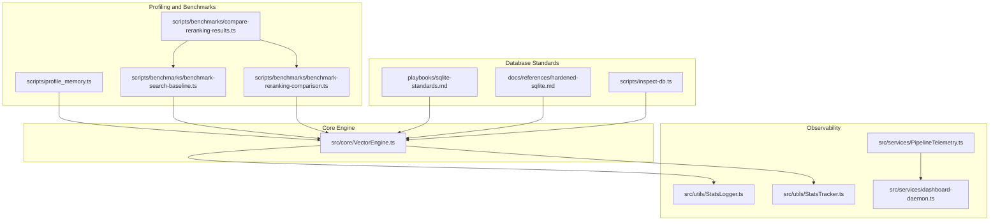
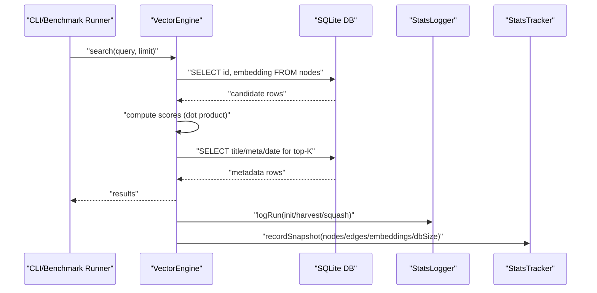
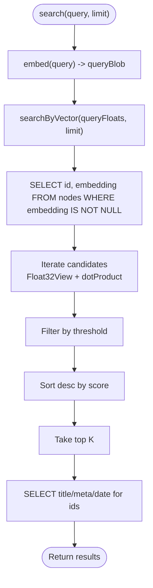
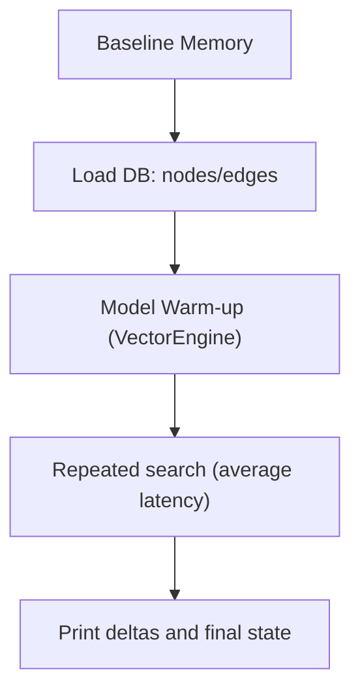
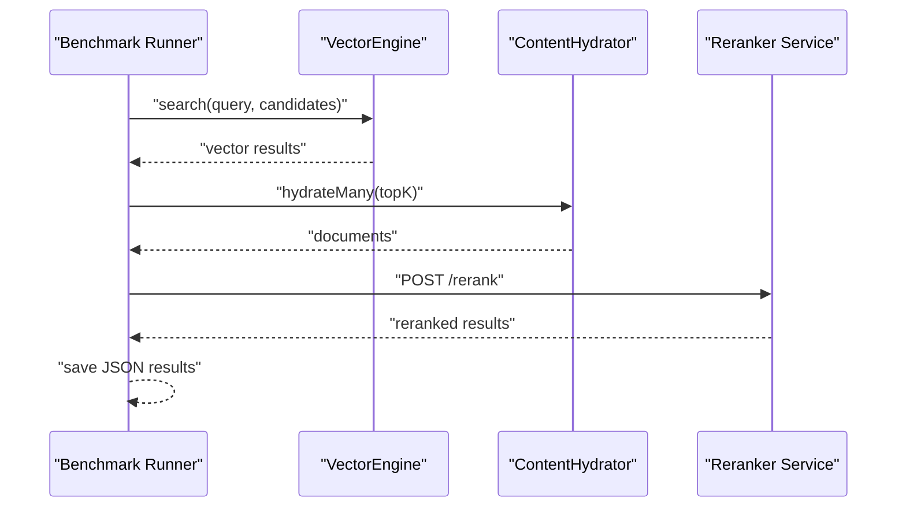
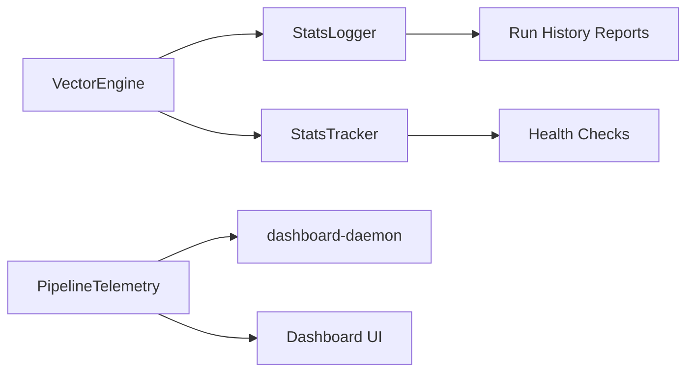
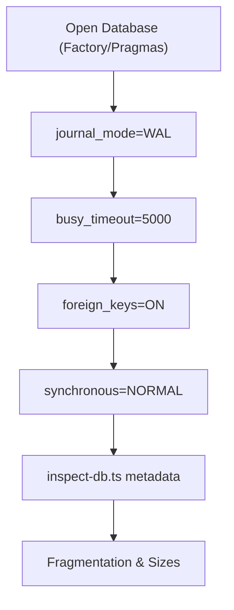
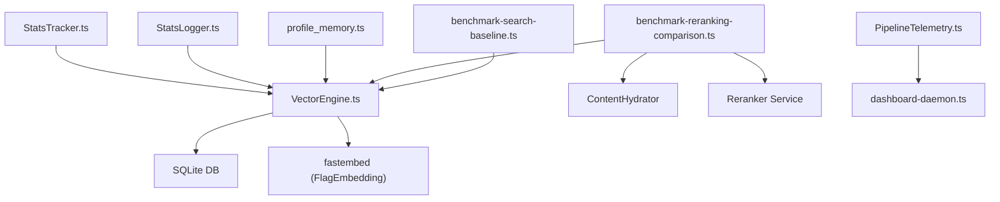

# Performance Monitoring and Profiling

<cite>
**Referenced Files in This Document**
- [profile_memory.ts](file://scripts/profile_memory.ts)
- [benchmark-search-baseline.ts](file://scripts/benchmarks/benchmark-search-baseline.ts)
- [benchmark-reranking-comparison.ts](file://scripts/benchmarks/benchmark-reranking-comparison.ts)
- [compare-reranking-results.ts](file://scripts/benchmarks/compare-reranking-results.ts)
- [performance_audit.md](file://docs/reports/performance_audit.md)
- [VectorEngine.ts](file://src/core/VectorEngine.ts)
- [StatsLogger.ts](file://src/utils/StatsLogger.ts)
- [StatsTracker.ts](file://src/utils/StatsTracker.ts)
- [PipelineTelemetry.ts](file://src/services/PipelineTelemetry.ts)
- [dashboard-daemon.ts](file://src/services/dashboard-daemon.ts)
- [sqlite-standards.md](file://playbooks/sqlite-standards.md)
- [hardened-sqlite.md](file://docs/references/hardened-sqlite.md)
- [inspect-db.ts](file://scripts/inspect-db.ts)
- [Logger.ts](file://src/utils/Logger.ts)
</cite>

## Table of Contents
1. [Introduction](#introduction)
2. [Project Structure](#project-structure)
3. [Core Components](#core-components)
4. [Architecture Overview](#architecture-overview)
5. [Detailed Component Analysis](#detailed-component-analysis)
6. [Dependency Analysis](#dependency-analysis)
7. [Performance Considerations](#performance-considerations)
8. [Troubleshooting Guide](#troubleshooting-guide)
9. [Conclusion](#conclusion)
10. [Appendices](#appendices)

## Introduction
This document describes Amalfa’s performance monitoring and profiling systems. It explains the performance audit methodology that identified bottlenecks in the VectorEngine search loop, documents memory profiling techniques for tracking JavaScript heap usage and SQLite-to-JS bridge traffic, and outlines the benchmarking framework for comparing search performance across embedding models and configurations. It also covers monitoring strategies for latency, memory, and database query performance, along with practical guidance for collecting metrics, interpreting profiling data, and establishing performance baselines across deployment scenarios.

## Project Structure
Amalfa organizes performance-related capabilities across scripts, core engine components, and observability utilities:
- Benchmarks and profiling scripts under scripts/benchmarks and scripts/profile_memory.ts
- VectorEngine search implementation under src/core/VectorEngine.ts
- Database and I/O hardening under playbooks/sqlite-standards.md and docs/references/hardened-sqlite.md
- Observability and telemetry under src/utils/StatsLogger.ts, src/utils/StatsTracker.ts, src/services/PipelineTelemetry.ts, and src/services/dashboard-daemon.ts
- Database inspection and diagnostics under scripts/inspect-db.ts
- Logging infrastructure under src/utils/Logger.ts

**Diagram sources**
- [profile_memory.ts](file://scripts/profile_memory.ts#L1-L94)
- [benchmark-search-baseline.ts](file://scripts/benchmarks/benchmark-search-baseline.ts#L1-L164)
- [benchmark-reranking-comparison.ts](file://scripts/benchmarks/benchmark-reranking-comparison.ts#L1-L280)
- [compare-reranking-results.ts](file://scripts/benchmarks/compare-reranking-results.ts#L1-L83)
- [VectorEngine.ts](file://src/core/VectorEngine.ts#L1-L242)
- [StatsLogger.ts](file://src/utils/StatsLogger.ts#L1-L84)
- [StatsTracker.ts](file://src/utils/StatsTracker.ts#L1-L218)
- [PipelineTelemetry.ts](file://src/services/PipelineTelemetry.ts#L1-L41)
- [dashboard-daemon.ts](file://src/services/dashboard-daemon.ts#L220-L241)
- [sqlite-standards.md](file://playbooks/sqlite-standards.md#L1-L45)
- [hardened-sqlite.md](file://docs/references/hardened-sqlite.md#L17-L63)
- [inspect-db.ts](file://scripts/inspect-db.ts#L50-L321)

**Section sources**
- [profile_memory.ts](file://scripts/profile_memory.ts#L1-L94)
- [benchmark-search-baseline.ts](file://scripts/benchmarks/benchmark-search-baseline.ts#L1-L164)
- [benchmark-reranking-comparison.ts](file://scripts/benchmarks/benchmark-reranking-comparison.ts#L1-L280)
- [compare-reranking-results.ts](file://scripts/benchmarks/compare-reranking-results.ts#L1-L83)
- [VectorEngine.ts](file://src/core/VectorEngine.ts#L1-L242)
- [StatsLogger.ts](file://src/utils/StatsLogger.ts#L1-L84)
- [StatsTracker.ts](file://src/utils/StatsTracker.ts#L1-L218)
- [PipelineTelemetry.ts](file://src/services/PipelineTelemetry.ts#L1-L41)
- [dashboard-daemon.ts](file://src/services/dashboard-daemon.ts#L220-L241)
- [sqlite-standards.md](file://playbooks/sqlite-standards.md#L1-L45)
- [hardened-sqlite.md](file://docs/references/hardened-sqlite.md#L17-L63)
- [inspect-db.ts](file://scripts/inspect-db.ts#L50-L321)

## Core Components
- VectorEngine: Implements vector search with FAFCAS normalization and dot-product scoring, optimized to minimize memory and IO by selecting only id and embedding during candidate scoring and hydrating content for top-K only.
- Benchmarks: Scripts capture latency and throughput across query difficulty categories and reranking modes, persisting results for comparison.
- Memory Profiling: A dedicated script measures RSS and heap deltas across database load, model initialization, and search execution.
- Observability: StatsLogger writes run metrics to JSONL, StatsTracker maintains historical snapshots and validation, and PipelineTelemetry streams stage metrics to the dashboard.

**Section sources**
- [VectorEngine.ts](file://src/core/VectorEngine.ts#L155-L240)
- [benchmark-search-baseline.ts](file://scripts/benchmarks/benchmark-search-baseline.ts#L24-L113)
- [benchmark-reranking-comparison.ts](file://scripts/benchmarks/benchmark-reranking-comparison.ts#L25-L220)
- [compare-reranking-results.ts](file://scripts/benchmarks/compare-reranking-results.ts#L19-L80)
- [profile_memory.ts](file://scripts/profile_memory.ts#L15-L93)
- [StatsLogger.ts](file://src/utils/StatsLogger.ts#L19-L83)
- [StatsTracker.ts](file://src/utils/StatsTracker.ts#L25-L174)
- [PipelineTelemetry.ts](file://src/services/PipelineTelemetry.ts#L17-L38)

## Architecture Overview
The performance monitoring architecture integrates profiling, benchmarking, and observability:
- Profiling captures memory deltas and search latency across lifecycle stages.
- Benchmarks evaluate search performance across difficulty levels and reranking modes.
- Observability tracks operational metrics and validates database health over time.
- Database hardening ensures stable concurrency and predictable I/O characteristics.

**Diagram sources**
- [benchmark-search-baseline.ts](file://scripts/benchmarks/benchmark-search-baseline.ts#L63-L113)
- [VectorEngine.ts](file://src/core/VectorEngine.ts#L159-L225)
- [StatsLogger.ts](file://src/utils/StatsLogger.ts#L23-L83)
- [StatsTracker.ts](file://src/utils/StatsTracker.ts#L72-L89)

## Detailed Component Analysis

### VectorEngine Search Loop
VectorEngine optimizes the hot path by:
- Selecting only id and embedding for candidate scoring to reduce IO and memory pressure.
- Computing dot products directly on raw BLOBs with zero-copy Float32Array views.
- Hydrating content metadata only for top-K results.

**Diagram sources**
- [VectorEngine.ts](file://src/core/VectorEngine.ts#L227-L240)
- [VectorEngine.ts](file://src/core/VectorEngine.ts#L159-L225)

**Section sources**
- [VectorEngine.ts](file://src/core/VectorEngine.ts#L155-L240)
- [performance_audit.md](file://docs/reports/performance_audit.md#L5-L27)

### Memory Profiling Script
The memory profiling script measures RSS and heap usage across four stages:
- Initial baseline
- After loading nodes and edges
- After model warm-up
- After repeated search executions

It logs cumulative deltas and final states, enabling identification of hotspots like WASM/model overhead and SQLite-to-JS bridge traffic.

**Diagram sources**
- [profile_memory.ts](file://scripts/profile_memory.ts#L15-L93)

**Section sources**
- [profile_memory.ts](file://scripts/profile_memory.ts#L15-L93)

### Benchmarking Framework
Two benchmark scripts collect latency and throughput:
- Baseline benchmark: Runs queries across difficulty categories and saves results to JSON for later comparison.
- Reranking comparison: Tests modes “none”, “bge-m3”, and placeholders for “sonar” and “hybrid”, capturing total latency and reranker latency when applicable.

A comparator script reads saved results and prints averages and top-result comparisons.

**Diagram sources**
- [benchmark-search-baseline.ts](file://scripts/benchmarks/benchmark-search-baseline.ts#L63-L113)
- [benchmark-reranking-comparison.ts](file://scripts/benchmarks/benchmark-reranking-comparison.ts#L95-L158)
- [compare-reranking-results.ts](file://scripts/benchmarks/compare-reranking-results.ts#L19-L80)

**Section sources**
- [benchmark-search-baseline.ts](file://scripts/benchmarks/benchmark-search-baseline.ts#L24-L155)
- [benchmark-reranking-comparison.ts](file://scripts/benchmarks/benchmark-reranking-comparison.ts#L25-L266)
- [compare-reranking-results.ts](file://scripts/benchmarks/compare-reranking-results.ts#L19-L80)

### Observability and Monitoring
- StatsLogger persists run metrics to a JSONL file for downstream analysis.
- StatsTracker maintains a rolling history of database snapshots and validates current state against prior snapshots.
- PipelineTelemetry exposes stage metrics consumed by the dashboard daemon for live monitoring.

**Diagram sources**
- [StatsLogger.ts](file://src/utils/StatsLogger.ts#L19-L83)
- [StatsTracker.ts](file://src/utils/StatsTracker.ts#L25-L174)
- [PipelineTelemetry.ts](file://src/services/PipelineTelemetry.ts#L17-L38)
- [dashboard-daemon.ts](file://src/services/dashboard-daemon.ts#L220-L241)

**Section sources**
- [StatsLogger.ts](file://src/utils/StatsLogger.ts#L19-L83)
- [StatsTracker.ts](file://src/utils/StatsTracker.ts#L72-L174)
- [PipelineTelemetry.ts](file://src/services/PipelineTelemetry.ts#L17-L38)
- [dashboard-daemon.ts](file://src/services/dashboard-daemon.ts#L220-L241)

### Database Hardening and Diagnostics
- SQLite hardening playbook enforces WAL mode, busy timeouts, and safe pragmas to prevent concurrency issues.
- Hardened SQLite reference demonstrates explicit pragma configuration and health checks.
- Database inspector script provides metadata, sizes, and fragmentation insights.

**Diagram sources**
- [sqlite-standards.md](file://playbooks/sqlite-standards.md#L14-L45)
- [hardened-sqlite.md](file://docs/references/hardened-sqlite.md#L17-L63)
- [inspect-db.ts](file://scripts/inspect-db.ts#L70-L301)

**Section sources**
- [sqlite-standards.md](file://playbooks/sqlite-standards.md#L14-L45)
- [hardened-sqlite.md](file://docs/references/hardened-sqlite.md#L17-L63)
- [inspect-db.ts](file://scripts/inspect-db.ts#L70-L301)

## Dependency Analysis
VectorEngine depends on the database connection and embedding model, while benchmarks depend on VectorEngine and optional reranking service. Observability utilities are decoupled and can be reused across components.

**Diagram sources**
- [VectorEngine.ts](file://src/core/VectorEngine.ts#L76-L109)
- [benchmark-search-baseline.ts](file://scripts/benchmarks/benchmark-search-baseline.ts#L16-L70)
- [benchmark-reranking-comparison.ts](file://scripts/benchmarks/benchmark-reranking-comparison.ts#L13-L171)
- [profile_memory.ts](file://scripts/profile_memory.ts#L1-L3)
- [StatsLogger.ts](file://src/utils/StatsLogger.ts#L1-L4)
- [StatsTracker.ts](file://src/utils/StatsTracker.ts#L1-L4)
- [PipelineTelemetry.ts](file://src/services/PipelineTelemetry.ts#L1-L2)

**Section sources**
- [VectorEngine.ts](file://src/core/VectorEngine.ts#L76-L109)
- [benchmark-search-baseline.ts](file://scripts/benchmarks/benchmark-search-baseline.ts#L16-L70)
- [benchmark-reranking-comparison.ts](file://scripts/benchmarks/benchmark-reranking-comparison.ts#L13-L171)
- [profile_memory.ts](file://scripts/profile_memory.ts#L1-L3)
- [StatsLogger.ts](file://src/utils/StatsLogger.ts#L1-L4)
- [StatsTracker.ts](file://src/utils/StatsTracker.ts#L1-L4)
- [PipelineTelemetry.ts](file://src/services/PipelineTelemetry.ts#L1-L2)

## Performance Considerations
- VectorEngine slim search reduces IO and memory by fetching only id and embedding during scoring and hydrating content for top-K.
- Database hardening (WAL, busy_timeout, foreign_keys) improves concurrency and stability.
- Benchmark scripts provide structured latency measurements across difficulty and reranking modes.
- Memory profiling highlights WASM/model overhead and SQLite-to-JS bridge costs.
- Historical snapshots enable trend analysis and anomaly detection.

[No sources needed since this section provides general guidance]

## Troubleshooting Guide
- Symptom: High RSS and heap growth during search
  - Action: Use the memory profiling script to isolate the step causing growth and confirm WASM/model overhead.
  - Reference: [profile_memory.ts](file://scripts/profile_memory.ts#L53-L93)
- Symptom: Slow search latency
  - Action: Run the baseline and reranking benchmarks to quantify latency and compare modes.
  - Reference: [benchmark-search-baseline.ts](file://scripts/benchmarks/benchmark-search-baseline.ts#L63-L155), [benchmark-reranking-comparison.ts](file://scripts/benchmarks/benchmark-reranking-comparison.ts#L160-L266)
- Symptom: Database contention or SQLITE_BUSY
  - Action: Verify WAL mode and busy_timeout via the hardening playbook and inspector.
  - Reference: [sqlite-standards.md](file://playbooks/sqlite-standards.md#L14-L45), [inspect-db.ts](file://scripts/inspect-db.ts#L70-L301)
- Symptom: Missing or stale metrics
  - Action: Check StatsLogger JSONL and StatsTracker snapshots; validate dashboard telemetry updates.
  - Reference: [StatsLogger.ts](file://src/utils/StatsLogger.ts#L23-L83), [StatsTracker.ts](file://src/utils/StatsTracker.ts#L72-L174), [dashboard-daemon.ts](file://src/services/dashboard-daemon.ts#L220-L241)

**Section sources**
- [profile_memory.ts](file://scripts/profile_memory.ts#L53-L93)
- [benchmark-search-baseline.ts](file://scripts/benchmarks/benchmark-search-baseline.ts#L63-L155)
- [benchmark-reranking-comparison.ts](file://scripts/benchmarks/benchmark-reranking-comparison.ts#L160-L266)
- [sqlite-standards.md](file://playbooks/sqlite-standards.md#L14-L45)
- [inspect-db.ts](file://scripts/inspect-db.ts#L70-L301)
- [StatsLogger.ts](file://src/utils/StatsLogger.ts#L23-L83)
- [StatsTracker.ts](file://src/utils/StatsTracker.ts#L72-L174)
- [dashboard-daemon.ts](file://src/services/dashboard-daemon.ts#L220-L241)

## Conclusion
Amalfa’s performance monitoring and profiling systems combine targeted memory profiling, rigorous benchmarking across difficulty and reranking modes, and robust observability via run logs, historical snapshots, and pipeline telemetry. The VectorEngine optimization to slim the search loop significantly reduces memory and IO pressure, while database hardening and inspection tools ensure stable, predictable performance. Together, these capabilities enable accurate baselining, informed tuning, and reliable operation across diverse deployment scenarios.

[No sources needed since this section summarizes without analyzing specific files]

## Appendices

### Setting Up Performance Metrics Collection
- Run the baseline benchmark to establish a latency baseline for your dataset and configuration.
  - Reference: [benchmark-search-baseline.ts](file://scripts/benchmarks/benchmark-search-baseline.ts#L63-L155)
- Execute the reranking comparison benchmark to evaluate impact of different reranking modes.
  - Reference: [benchmark-reranking-comparison.ts](file://scripts/benchmarks/benchmark-reranking-comparison.ts#L160-L266)
- Use the memory profiling script to track RSS and heap deltas across lifecycle stages.
  - Reference: [profile_memory.ts](file://scripts/profile_memory.ts#L15-L93)
- Enable StatsLogger and StatsTracker to persist and analyze operational metrics.
  - Reference: [StatsLogger.ts](file://src/utils/StatsLogger.ts#L23-L83), [StatsTracker.ts](file://src/utils/StatsTracker.ts#L72-L174)

### Interpreting Profiling Data
- Memory deltas indicate where overhead occurs (e.g., model warm-up, SQLite-to-JS bridge).
- Benchmark averages reveal performance regressions or improvements across modes.
- Dashboard telemetry provides real-time visibility into pipeline stages.

[No sources needed since this section provides general guidance]

### Establishing Performance Baselines
- Capture baseline results with the baseline benchmark and reranking comparator.
- Monitor database health with StatsTracker snapshots and dashboard telemetry.
- Validate database configuration using the hardening playbook and inspector.

[No sources needed since this section provides general guidance]