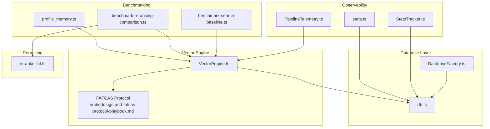
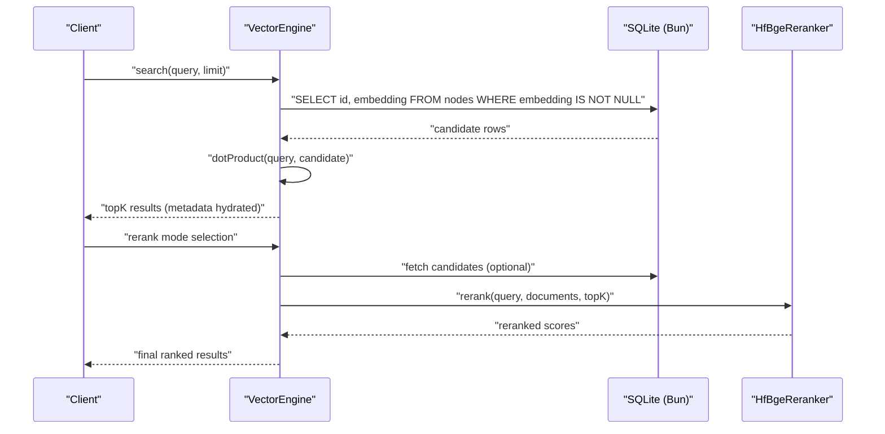
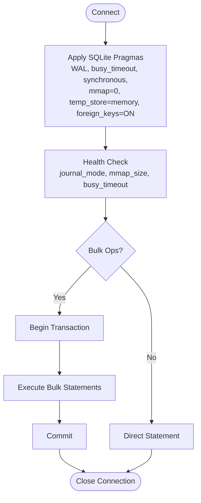
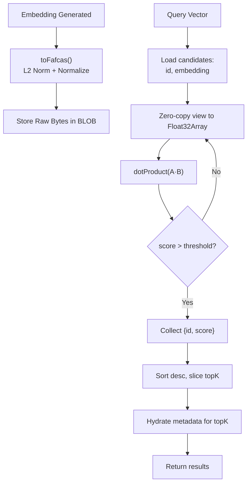
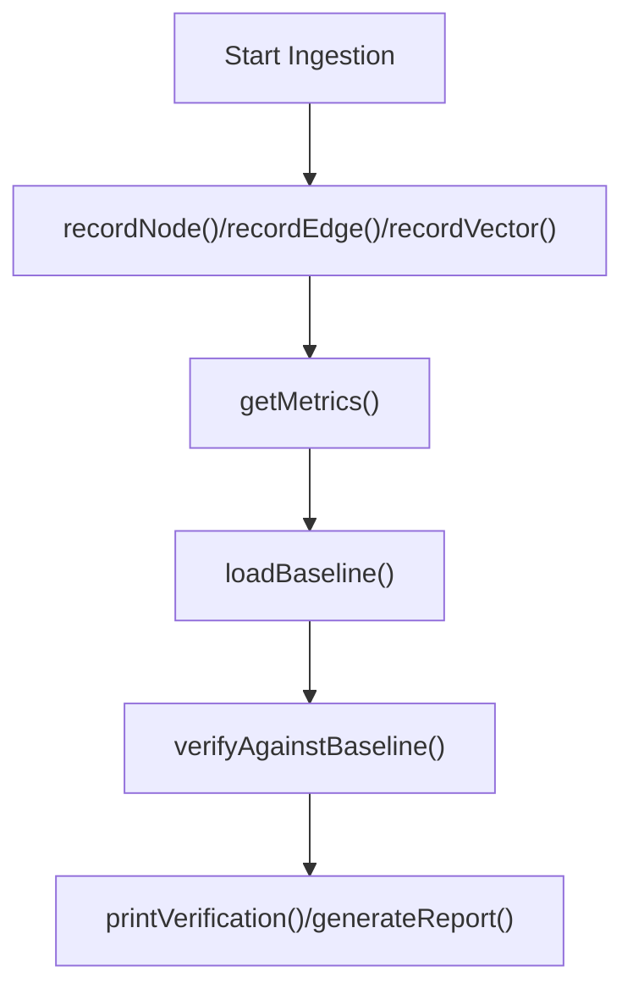
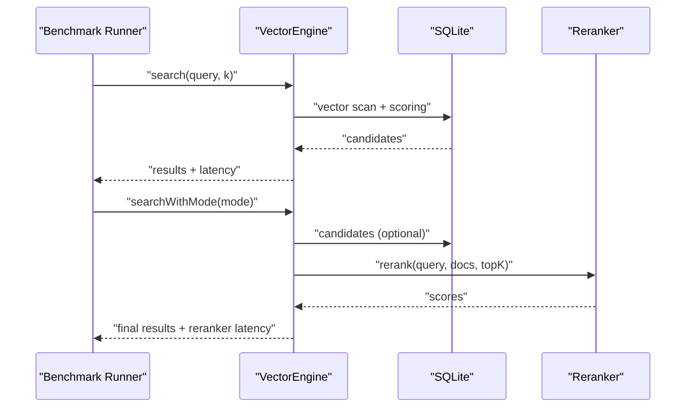
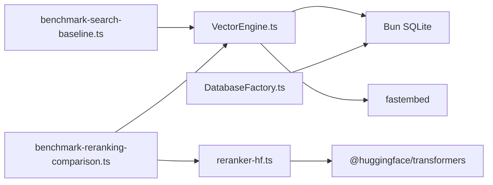

# Performance and Optimization

<cite>
**Referenced Files in This Document**
- [DatabaseFactory.ts](file://src/resonance/DatabaseFactory.ts)
- [db.ts](file://src/resonance/db.ts)
- [VectorEngine.ts](file://src/core/VectorEngine.ts)
- [embeddings-and-fafcas-protocol-playbook.md](file://playbooks/embeddings-and-fafcas-protocol-playbook.md)
- [sqlite-standards.md](file://playbooks/sqlite-standards.md)
- [database-connection-hygiene.md](file://playbooks/database-connection-hygiene.md)
- [StatsTracker.ts](file://src/utils/StatsTracker.ts)
- [PipelineTelemetry.ts](file://src/services/PipelineTelemetry.ts)
- [stats.ts](file://src/resonance/services/stats.ts)
- [simple_search_test.ts](file://scripts/verify/simple_search_test.ts)
- [benchmark-search-baseline.ts](file://scripts/benchmarks/benchmark-search-baseline.ts)
- [benchmark-reranking-comparison.ts](file://scripts/benchmarks/benchmark-reranking-comparison.ts)
- [reranker-hf.ts](file://src/services/reranker-hf.ts)
- [profile_memory.ts](file://scripts/profile_memory.ts)
- [comprehensive-search-tests.ts](file://scripts/lab/comprehensive-search-tests.ts)
- [database-intelligence-test.ts](file://scripts/lab/database-intelligence-test.ts)
- [2026-02-01-cross-domain-pipeline-ssot-violations.md](file://briefs/2026-02-01-cross-domain-pipeline-ssot-violations.md)
</cite>

## Table of Contents
1. [Introduction](#introduction)
2. [Project Structure](#project-structure)
3. [Core Components](#core-components)
4. [Architecture Overview](#architecture-overview)
5. [Detailed Component Analysis](#detailed-component-analysis)
6. [Dependency Analysis](#dependency-analysis)
7. [Performance Considerations](#performance-considerations)
8. [Troubleshooting Guide](#troubleshooting-guide)
9. [Conclusion](#conclusion)
10. [Appendices](#appendices)

## Introduction
This document consolidates Amalfa’s performance optimization strategies across ingestion, search, and service layers. It covers monitoring and profiling techniques, memory management, database optimization, vector search enhancements (FAFCAS protocol and cross-encoder reranking), benchmarking and load testing, capacity planning, deployment tuning, scalability, caching, and latency reduction for agent interactions.

## Project Structure
Amalfa organizes performance-critical logic around:
- Database factory and standards enforcement for SQLite
- Vector engine implementing FAFCAS protocol
- Ingestion observability and telemetry
- Benchmarking and profiling scripts
- Reranking service for cross-encoder optimization

**Diagram sources**
- [DatabaseFactory.ts](file://src/resonance/DatabaseFactory.ts#L1-L103)
- [db.ts](file://src/resonance/db.ts#L423-L464)
- [VectorEngine.ts](file://src/core/VectorEngine.ts#L1-L242)
- [embeddings-and-fafcas-protocol-playbook.md](file://playbooks/embeddings-and-fafcas-protocol-playbook.md#L1-L143)
- [StatsTracker.ts](file://src/utils/StatsTracker.ts#L1-L218)
- [PipelineTelemetry.ts](file://src/services/PipelineTelemetry.ts#L1-L42)
- [stats.ts](file://src/resonance/services/stats.ts#L1-L328)
- [benchmark-search-baseline.ts](file://scripts/benchmarks/benchmark-search-baseline.ts#L1-L164)
- [benchmark-reranking-comparison.ts](file://scripts/benchmarks/benchmark-reranking-comparison.ts#L1-L280)
- [reranker-hf.ts](file://src/services/reranker-hf.ts#L1-L130)
- [profile_memory.ts](file://scripts/profile_memory.ts#L1-L94)

**Section sources**
- [DatabaseFactory.ts](file://src/resonance/DatabaseFactory.ts#L1-L103)
- [VectorEngine.ts](file://src/core/VectorEngine.ts#L1-L242)
- [StatsTracker.ts](file://src/utils/StatsTracker.ts#L1-L218)
- [stats.ts](file://src/resonance/services/stats.ts#L1-L328)
- [benchmark-search-baseline.ts](file://scripts/benchmarks/benchmark-search-baseline.ts#L1-L164)
- [benchmark-reranking-comparison.ts](file://scripts/benchmarks/benchmark-reranking-comparison.ts#L1-L280)
- [reranker-hf.ts](file://src/services/reranker-hf.ts#L1-L130)
- [profile_memory.ts](file://scripts/profile_memory.ts#L1-L94)

## Core Components
- DatabaseFactory enforces SQLite standards (WAL, busy_timeout, synchronous, mmap, temp_store, foreign_keys) and provides health checks.
- VectorEngine implements FAFCAS normalization and dot-product similarity for in-memory vector search, with optional embedding generation and persistence.
- Ingestion observability tracks domain metrics and validates against baselines.
- Telemetry surfaces pipeline stage status and metrics.
- Benchmarking scripts capture latency baselines and compare reranking modes.
- Reranking service integrates cross-encoder reranking via Hugging Face Transformers.js.

**Section sources**
- [DatabaseFactory.ts](file://src/resonance/DatabaseFactory.ts#L13-L102)
- [VectorEngine.ts](file://src/core/VectorEngine.ts#L76-L242)
- [stats.ts](file://src/resonance/services/stats.ts#L64-L328)
- [PipelineTelemetry.ts](file://src/services/PipelineTelemetry.ts#L17-L42)
- [benchmark-search-baseline.ts](file://scripts/benchmarks/benchmark-search-baseline.ts#L63-L158)
- [reranker-hf.ts](file://src/services/reranker-hf.ts#L22-L130)

## Architecture Overview
The system emphasizes local-first, in-process computation to minimize latency and network overhead. Vector search leverages FAFCAS normalization and dot products, while ingestion and search are monitored and benchmarked continuously.

**Diagram sources**
- [VectorEngine.ts](file://src/core/VectorEngine.ts#L159-L240)
- [benchmark-reranking-comparison.ts](file://scripts/benchmarks/benchmark-reranking-comparison.ts#L95-L158)
- [reranker-hf.ts](file://src/services/reranker-hf.ts#L74-L128)

## Detailed Component Analysis

### Database Optimization and Connection Management
- Standards enforced: WAL journaling, busy_timeout, synchronous, mmap disabled, temp_store in memory, foreign keys enabled.
- Health checks validate configuration and perform a write/read test.
- Connection hygiene: per-request connections for servers, strict close() guarantees, and dependency injection to avoid raw connections in business logic.
- Maintenance: vacuum and optimize recommended; wrap bulk operations in transactions.

**Diagram sources**
- [DatabaseFactory.ts](file://src/resonance/DatabaseFactory.ts#L27-L101)
- [sqlite-standards.md](file://playbooks/sqlite-standards.md#L47-L78)
- [database-connection-hygiene.md](file://playbooks/database-connection-hygiene.md#L9-L73)

**Section sources**
- [DatabaseFactory.ts](file://src/resonance/DatabaseFactory.ts#L13-L102)
- [sqlite-standards.md](file://playbooks/sqlite-standards.md#L47-L78)
- [database-connection-hygiene.md](file://playbooks/database-connection-hygiene.md#L9-L73)

### Vector Search Performance (FAFCAS Protocol)
- Normalization: L2-normalize vectors to unit length prior to storage.
- Storage: Raw Float32 bytes in SQLite BLOB for zero-copy retrieval.
- Retrieval: Dot product for cosine similarity on unit vectors; zero-vector guard to avoid false positives.
- Hot loop optimizations: slim scan (load only id and embedding), zero-copy Float32Array view, threshold filtering, and metadata hydration for top-K only.

**Diagram sources**
- [VectorEngine.ts](file://src/core/VectorEngine.ts#L17-L74)
- [VectorEngine.ts](file://src/core/VectorEngine.ts#L159-L240)
- [embeddings-and-fafcas-protocol-playbook.md](file://playbooks/embeddings-and-fafcas-protocol-playbook.md#L18-L36)

**Section sources**
- [VectorEngine.ts](file://src/core/VectorEngine.ts#L76-L242)
- [embeddings-and-fafcas-protocol-playbook.md](file://playbooks/embeddings-and-fafcas-protocol-playbook.md#L1-L143)
- [db.ts](file://src/resonance/db.ts#L444-L464)

### Ingestion Monitoring and Baseline Verification
- Tracks persona/experience domains: nodes, edges, vectors, semantic tokens.
- Loads baseline JSON and compares current metrics with variance thresholds.
- Generates markdown reports and prints summaries; validates database state (non-zero nodes, embeddings).

**Diagram sources**
- [stats.ts](file://src/resonance/services/stats.ts#L64-L328)

**Section sources**
- [stats.ts](file://src/resonance/services/stats.ts#L64-L328)
- [StatsTracker.ts](file://src/utils/StatsTracker.ts#L25-L218)

### Pipeline Telemetry and Observability
- PipelineTelemetry maintains stage status and metrics for Discovery, Sync, Embedding, Weaving, Enrichment.
- Telemetry logs updates with timestamps for visibility during long-running operations.

**Section sources**
- [PipelineTelemetry.ts](file://src/services/PipelineTelemetry.ts#L17-L42)

### Benchmarking and Load Testing
- Baseline search benchmark captures latency across difficulty levels and saves results for comparison.
- Reranking comparison benchmark evaluates modes (none, BGE-M3, Sonar, hybrid) and measures reranker latency.
- Memory profiling script measures RSS/heap growth across steps: DB load, model initialization, and search execution.

**Diagram sources**
- [benchmark-search-baseline.ts](file://scripts/benchmarks/benchmark-search-baseline.ts#L63-L158)
- [benchmark-reranking-comparison.ts](file://scripts/benchmarks/benchmark-reranking-comparison.ts#L95-L158)
- [profile_memory.ts](file://scripts/profile_memory.ts#L15-L94)

**Section sources**
- [benchmark-search-baseline.ts](file://scripts/benchmarks/benchmark-search-baseline.ts#L1-L164)
- [benchmark-reranking-comparison.ts](file://scripts/benchmarks/benchmark-reranking-comparison.ts#L1-L280)
- [profile_memory.ts](file://scripts/profile_memory.ts#L1-L94)

### Cross-Encoder Reranking Optimization
- HfBgeReranker singleton loads BGE model once and reranks query-document pairs using Transformers.js (ONNX quantized).
- Benchmarking script orchestrates reranking modes and measures end-to-end latency.

**Section sources**
- [reranker-hf.ts](file://src/services/reranker-hf.ts#L22-L130)
- [benchmark-reranking-comparison.ts](file://scripts/benchmarks/benchmark-reranking-comparison.ts#L63-L90)

### Search Validation and Intelligence Testing
- Comprehensive search tests validate FAFCAS protocol adherence and relevance thresholds.
- Database-driven intelligence tests evaluate conceptual, relational, temporal, comparative, and inferential capabilities.

**Section sources**
- [comprehensive-search-tests.ts](file://scripts/lab/comprehensive-search-tests.ts#L100-L141)
- [database-intelligence-test.ts](file://scripts/lab/database-intelligence-test.ts#L33-L320)

## Dependency Analysis
Key dependencies and their roles:
- VectorEngine depends on Bun SQLite for BLOB handling and fastembed for embeddings.
- DatabaseFactory centralizes SQLite configuration and health checks.
- Reranking service depends on @huggingface/transformers for cross-encoder inference.
- Benchmarking scripts depend on VectorEngine and ResonanceDB for controlled experiments.

**Diagram sources**
- [VectorEngine.ts](file://src/core/VectorEngine.ts#L1-L242)
- [DatabaseFactory.ts](file://src/resonance/DatabaseFactory.ts#L1-L103)
- [reranker-hf.ts](file://src/services/reranker-hf.ts#L1-L130)
- [benchmark-search-baseline.ts](file://scripts/benchmarks/benchmark-search-baseline.ts#L16-L21)
- [benchmark-reranking-comparison.ts](file://scripts/benchmarks/benchmark-reranking-comparison.ts#L13-L22)

**Section sources**
- [VectorEngine.ts](file://src/core/VectorEngine.ts#L1-L242)
- [DatabaseFactory.ts](file://src/resonance/DatabaseFactory.ts#L1-L103)
- [reranker-hf.ts](file://src/services/reranker-hf.ts#L1-L130)
- [benchmark-search-baseline.ts](file://scripts/benchmarks/benchmark-search-baseline.ts#L16-L21)
- [benchmark-reranking-comparison.ts](file://scripts/benchmarks/benchmark-reranking-comparison.ts#L13-L22)

## Performance Considerations
- Vector search
  - FAFCAS normalization eliminates sqrt/div operations in the hot loop.
  - Zero-copy views and threshold filtering reduce memory and CPU overhead.
  - Metadata hydration deferred to top-K to minimize IO.
- Database
  - WAL journaling and busy_timeout improve concurrency and reduce lock contention.
  - Transactions dramatically increase throughput for bulk writes.
  - Vacuum and PRAGMA optimize recommended for maintenance.
- Ingestion
  - Baseline verification prevents silent regressions.
  - Telemetry provides real-time stage metrics for bottleneck identification.
- Reranking
  - Cross-encoder reranking improves precision at the cost of latency; measure and tune thresholds.
- Memory
  - Profile model load and search iterations to track RSS/heap growth.
  - Prefer streaming hydration and limit topK to control memory footprint.

[No sources needed since this section provides general guidance]

## Troubleshooting Guide
- Database connectivity and configuration
  - Use DatabaseFactory.connect and performHealthCheck to validate pragmas and journal mode.
  - Ensure busy_timeout is sufficient for concurrent workloads.
- Connection leaks
  - Enforce per-request connections and use finally blocks to guarantee db.close().
- Vector search anomalies
  - Verify FAFCAS normalization and unit-length vectors.
  - Confirm zero-vector guard is active to avoid false matches.
- Ingestion drift
  - Compare current metrics against baseline; investigate significant variances.
- Reranking failures
  - Check reranker availability and port configuration; fallback to vector-only mode when needed.

**Section sources**
- [DatabaseFactory.ts](file://src/resonance/DatabaseFactory.ts#L72-L101)
- [database-connection-hygiene.md](file://playbooks/database-connection-hygiene.md#L9-L73)
- [VectorEngine.ts](file://src/core/VectorEngine.ts#L58-L74)
- [stats.ts](file://src/resonance/services/stats.ts#L143-L209)
- [benchmark-reranking-comparison.ts](file://scripts/benchmarks/benchmark-reranking-comparison.ts#L63-L90)

## Conclusion
Amalfa’s performance strategy centers on local-first, in-process computation with rigorous database standards, FAFCAS vector normalization, and continuous benchmarking. By enforcing connection hygiene, validating ingestion baselines, and measuring reranking impact, the system achieves low-latency, scalable search suitable for agent interactions and large knowledge bases.

[No sources needed since this section summarizes without analyzing specific files]

## Appendices

### A. Database Optimization Checklist
- Apply SQLite pragmas via DatabaseFactory
- Use WAL, set busy_timeout, disable mmap, store temp data in memory
- Wrap bulk operations in transactions
- Periodically vacuum and optimize

**Section sources**
- [DatabaseFactory.ts](file://src/resonance/DatabaseFactory.ts#L44-L66)
- [sqlite-standards.md](file://playbooks/sqlite-standards.md#L60-L72)

### B. Vector Search Tuning Tips
- Keep vectors normalized to unit length
- Use threshold filtering and top-K limiting
- Defer metadata hydration to top-K only
- Monitor zero-vector detection and handle gracefully

**Section sources**
- [VectorEngine.ts](file://src/core/VectorEngine.ts#L17-L74)
- [VectorEngine.ts](file://src/core/VectorEngine.ts#L159-L240)
- [embeddings-and-fafcas-protocol-playbook.md](file://playbooks/embeddings-and-fafcas-protocol-playbook.md#L29-L36)

### C. Benchmarking Methodology
- Define difficulty buckets and representative queries
- Capture latency per query and aggregate statistics
- Compare reranking modes and report average latencies
- Store results for trend analysis

**Section sources**
- [benchmark-search-baseline.ts](file://scripts/benchmarks/benchmark-search-baseline.ts#L24-L158)
- [benchmark-reranking-comparison.ts](file://scripts/benchmarks/benchmark-reranking-comparison.ts#L25-L266)

### D. Memory Profiling Workflow
- Measure baseline memory usage
- Track growth after DB load, model initialization, and search execution
- Use this to size deployments and set GC thresholds

**Section sources**
- [profile_memory.ts](file://scripts/profile_memory.ts#L15-L94)

### E. Capacity Planning Guidelines
- Use StatsTracker to monitor growth trends and embedding coverage
- Plan database size and vector counts to maintain top-K responsiveness
- Scale horizontally by adding workers and vertically by increasing memory/CPU

**Section sources**
- [StatsTracker.ts](file://src/utils/StatsTracker.ts#L25-L218)

### F. Agent Interaction Latency Reduction
- Minimize cross-service calls; keep reranking local when possible
- Tune thresholds to reduce reranker workload
- Use telemetry to identify slow stages and optimize accordingly

**Section sources**
- [PipelineTelemetry.ts](file://src/services/PipelineTelemetry.ts#L17-L42)
- [benchmark-reranking-comparison.ts](file://scripts/benchmarks/benchmark-reranking-comparison.ts#L118-L158)

### G. FAFCAS Compliance Audit
- Ensure vectors are normalized before storage
- Replace ad-hoc search logic with VectorEngine.findSimilar
- Prevent SSOT violations by aligning pipelines with established protocols

**Section sources**
- [embeddings-and-fafcas-protocol-playbook.md](file://playbooks/embeddings-and-fafcas-protocol-playbook.md#L18-L36)
- [2026-02-01-cross-domain-pipeline-ssot-violations.md](file://briefs/2026-02-01-cross-domain-pipeline-ssot-violations.md#L92-L113)