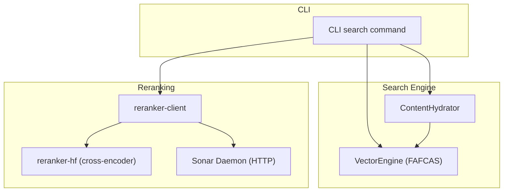
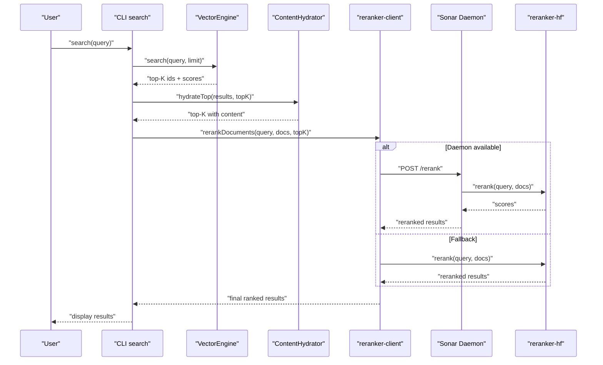
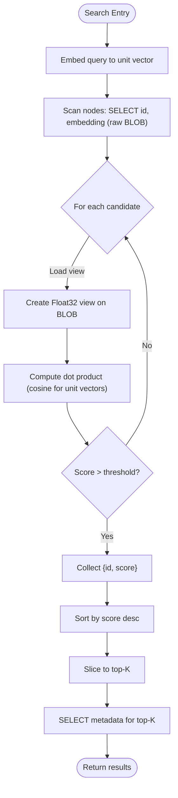
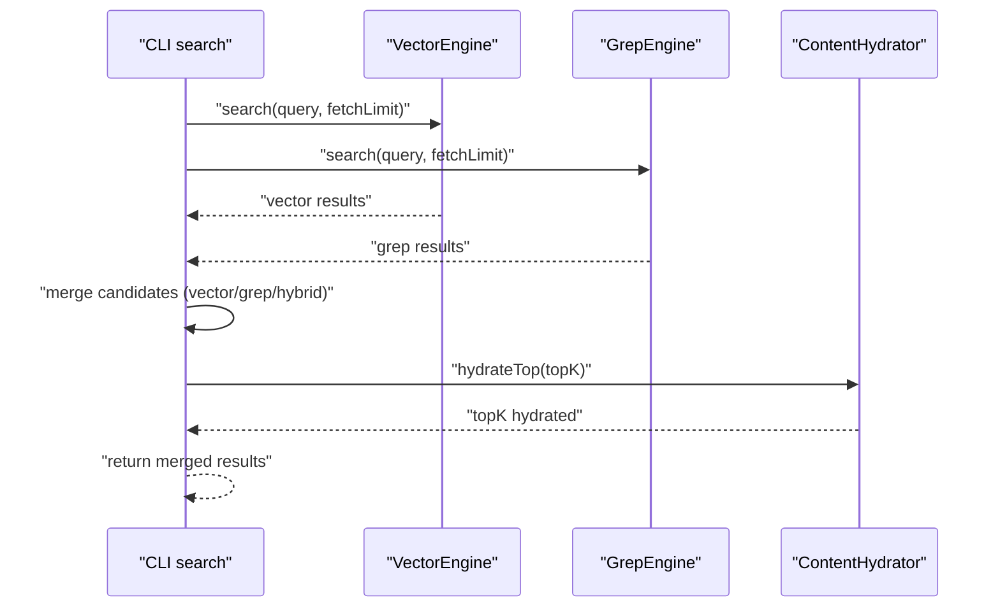
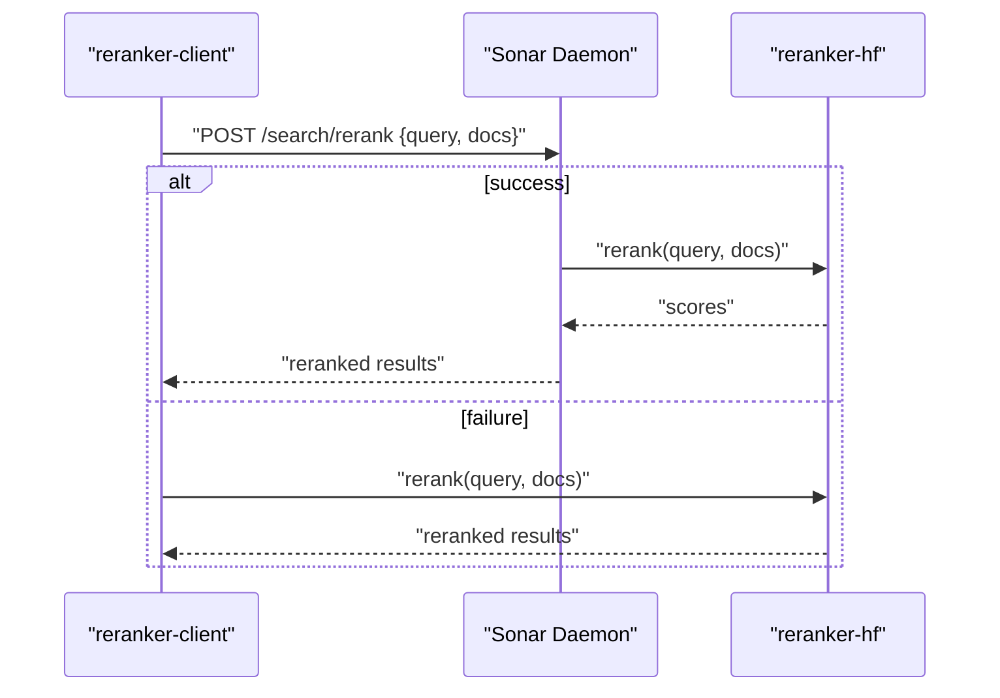
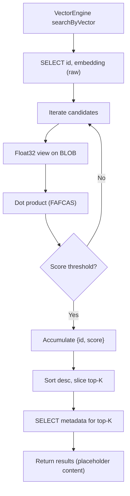
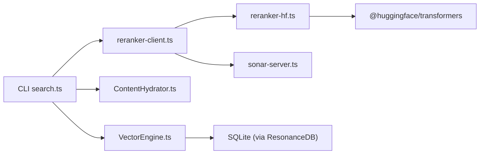

# Search Performance Optimization

<cite>
**Referenced Files in This Document**
- [VectorEngine.ts](file://src/core/VectorEngine.ts)
- [ContentHydrator.ts](file://src/utils/ContentHydrator.ts)
- [reranker-client.ts](file://src/utils/reranker-client.ts)
- [reranker-hf.ts](file://src/services/reranker-hf.ts)
- [search.ts](file://src/cli/commands/search.ts)
- [thin-node.md](file://docs/architecture/thin-node.md)
- [embeddings-and-fafcas-protocol-playbook.md](file://playbooks/embeddings-and-fafcas-protocol-playbook.md)
- [RERANKING-VALIDATION.md](file://docs/RERANKING-VALIDATION.md)
- [benchmark-search-baseline.ts](file://scripts/benchmarks/benchmark-search-baseline.ts)
- [compare-reranking-results.ts](file://scripts/benchmarks/compare-reranking-results.ts)
- [test-reranking-quality.ts](file://scripts/test-reranking-quality.ts)
- [2026-02-01-reranking-cleanup-search-verification.md](file://debriefs/2026-02-01-reranking-cleanup-search-verification.md)
- [HarvesterCache.ts](file://src/core/HarvesterCache.ts)
- [sonar-server.ts](file://src/daemon/sonar-server.ts)
- [services.ts](file://src/cli/commands/services.ts)
</cite>

## Table of Contents
1. [Introduction](#introduction)
2. [Project Structure](#project-structure)
3. [Core Components](#core-components)
4. [Architecture Overview](#architecture-overview)
5. [Detailed Component Analysis](#detailed-component-analysis)
6. [Dependency Analysis](#dependency-analysis)
7. [Performance Considerations](#performance-considerations)
8. [Troubleshooting Guide](#troubleshooting-guide)
9. [Conclusion](#conclusion)
10. [Appendices](#appendices)

## Introduction
This document explains Amalfa’s search performance optimization techniques and strategies, focusing on:
- FAFCAS protocol implementation benefits for reducing search I/O and memory pressure
- Hybrid search optimization combining vector similarity with cross-encoder reranking
- Search inner loop optimization that avoids loading full content during similarity calculations
- Reranker daemon performance tuning, batch processing strategies, and result ranking optimization
- Benchmarking methodologies for evaluating search quality versus performance trade-offs
- Latency optimization techniques and strategies for improving recall–precision balance
- Caching strategies for frequently searched terms and optimization for real-time agent interactions

## Project Structure
Amalfa’s search pipeline integrates vector retrieval, lexical matching, and reranking into a cohesive, low-latency system. Key modules include:
- VectorEngine: FAFCAS-compliant vector storage and similarity search
- ContentHydrator: On-demand content hydration for top-K results
- reranker-client: Daemon-based reranking with graceful fallback
- reranker-hf: Cross-encoder reranking service
- CLI search command: Late fusion of vector and grep results
- Daemon server: Real-time agent endpoints for search analysis and reranking
- Benchmarks and debriefs: Quantitative evaluation of performance and quality

**Diagram sources**
- [search.ts](file://src/cli/commands/search.ts#L82-L127)
- [VectorEngine.ts](file://src/core/VectorEngine.ts#L76-L242)
- [ContentHydrator.ts](file://src/utils/ContentHydrator.ts#L13-L39)
- [reranker-client.ts](file://src/utils/reranker-client.ts#L1-L155)
- [reranker-hf.ts](file://src/services/reranker-hf.ts#L22-L130)
- [sonar-server.ts](file://src/daemon/sonar-server.ts#L24-L134)

**Section sources**
- [search.ts](file://src/cli/commands/search.ts#L82-L127)
- [VectorEngine.ts](file://src/core/VectorEngine.ts#L76-L242)
- [ContentHydrator.ts](file://src/utils/ContentHydrator.ts#L13-L39)
- [reranker-client.ts](file://src/utils/reranker-client.ts#L1-L155)
- [reranker-hf.ts](file://src/services/reranker-hf.ts#L22-L130)
- [sonar-server.ts](file://src/daemon/sonar-server.ts#L24-L134)

## Core Components
- FAFCAS Protocol: Normalized float32 vectors stored as raw blobs, enabling pure dot-product similarity without sqrt or division in the hot loop.
- VectorEngine: Embeds queries, performs FAFCAS search, and hydrates metadata for top-K results only.
- ContentHydrator: Lazily loads full content for top-K results to minimize I/O.
- Hybrid Search: Late fusion of vector search and grep results with prioritization.
- Reranker Client: Attempts daemon reranking first; falls back to local cross-encoder.
- Reranker Service: BGE cross-encoder reranking with ONNX/WASM inference.
- Daemon Server: Exposes health and search endpoints for real-time agent integrations.
- Benchmarks: Baseline and reranking comparison scripts for latency and quality analysis.

**Section sources**
- [embeddings-and-fafcas-protocol-playbook.md](file://playbooks/embeddings-and-fafcas-protocol-playbook.md#L18-L143)
- [VectorEngine.ts](file://src/core/VectorEngine.ts#L17-L242)
- [ContentHydrator.ts](file://src/utils/ContentHydrator.ts#L13-L39)
- [search.ts](file://src/cli/commands/search.ts#L82-L127)
- [reranker-client.ts](file://src/utils/reranker-client.ts#L1-L155)
- [reranker-hf.ts](file://src/services/reranker-hf.ts#L22-L130)
- [sonar-server.ts](file://src/daemon/sonar-server.ts#L24-L134)
- [benchmark-search-baseline.ts](file://scripts/benchmarks/benchmark-search-baseline.ts#L1-L164)
- [compare-reranking-results.ts](file://scripts/benchmarks/compare-reranking-results.ts#L1-L83)

## Architecture Overview
The search architecture balances speed and accuracy:
- Vector retrieval uses FAFCAS similarity (unit vectors, dot product)
- Candidates are hydrated and reranked using a cross-encoder
- Daemon-based reranking reduces cold-start latency and avoids repeated model loading
- Real-time agent endpoints enable live search analysis and context extraction

**Diagram sources**
- [search.ts](file://src/cli/commands/search.ts#L82-L127)
- [VectorEngine.ts](file://src/core/VectorEngine.ts#L227-L242)
- [ContentHydrator.ts](file://src/utils/ContentHydrator.ts#L24-L37)
- [reranker-client.ts](file://src/utils/reranker-client.ts#L137-L155)
- [reranker-hf.ts](file://src/services/reranker-hf.ts#L74-L128)
- [sonar-server.ts](file://src/daemon/sonar-server.ts#L107-L116)

## Detailed Component Analysis

### FAFCAS Protocol and Vector Engine
FAFCAS optimizes vector similarity by:
- Normalizing vectors to unit length before storage
- Storing raw float32 blobs in SQLite
- Computing cosine similarity via pure dot product in the hot loop
- Hydrating only metadata initially; deferring full content load until top-K

**Diagram sources**
- [VectorEngine.ts](file://src/core/VectorEngine.ts#L159-L225)
- [embeddings-and-fafcas-protocol-playbook.md](file://playbooks/embeddings-and-fafcas-protocol-playbook.md#L18-L36)

**Section sources**
- [VectorEngine.ts](file://src/core/VectorEngine.ts#L17-L242)
- [embeddings-and-fafcas-protocol-playbook.md](file://playbooks/embeddings-and-fafcas-protocol-playbook.md#L18-L143)

### Hybrid Search Optimization (Late Fusion)
The CLI search command merges vector and grep results:
- Executes vectorEngine.search and grepEngine.search concurrently
- Merges results into a single candidate set
- Assigns source tags and previews
- Hydrates content for top-K only

**Diagram sources**
- [search.ts](file://src/cli/commands/search.ts#L82-L127)
- [ContentHydrator.ts](file://src/utils/ContentHydrator.ts#L24-L37)

**Section sources**
- [search.ts](file://src/cli/commands/search.ts#L82-L127)
- [ContentHydrator.ts](file://src/utils/ContentHydrator.ts#L13-L39)

### Reranker Daemon and Cross-Encoder Reranking
Reranking improves precision by modeling query-document interaction:
- reranker-client attempts daemon reranking first; on failure or timeout, falls back to local reranker-hf
- reranker-hf uses BGE cross-encoder with ONNX/WASM inference
- Daemon exposes health and rerank endpoints for real-time agent integrations

**Diagram sources**
- [reranker-client.ts](file://src/utils/reranker-client.ts#L20-L80)
- [reranker-hf.ts](file://src/services/reranker-hf.ts#L74-L128)
- [sonar-server.ts](file://src/daemon/sonar-server.ts#L107-L116)

**Section sources**
- [reranker-client.ts](file://src/utils/reranker-client.ts#L1-L155)
- [reranker-hf.ts](file://src/services/reranker-hf.ts#L22-L130)
- [RERANKING-VALIDATION.md](file://docs/RERANKING-VALIDATION.md#L1-L42)
- [2026-02-01-reranking-cleanup-search-verification.md](file://debriefs/2026-02-01-reranking-cleanup-search-verification.md#L53-L70)

### Content Hydration and Inner Loop Optimization
Inner loop optimization ensures minimal I/O:
- VectorEngine loads only id and embedding (raw BLOB) during scoring
- ContentHydrator hydrates content for top-K only, avoiding full-content reads for all candidates
- This reduces memory pressure and latency while preserving relevance

**Diagram sources**
- [VectorEngine.ts](file://src/core/VectorEngine.ts#L159-L225)
- [ContentHydrator.ts](file://src/utils/ContentHydrator.ts#L24-L37)

**Section sources**
- [VectorEngine.ts](file://src/core/VectorEngine.ts#L159-L225)
- [ContentHydrator.ts](file://src/utils/ContentHydrator.ts#L13-L39)

### Caching Strategies for Frequently Searched Terms
- HarvesterCache persists extracted graph results keyed by content hash, enabling reuse across runs
- Atomic writes and directory organization improve reliability and performance
- This reduces redundant processing for repeated inputs

**Section sources**
- [HarvesterCache.ts](file://src/core/HarvesterCache.ts#L10-L69)

### Real-Time Agent Integration
- Sonar Daemon exposes health, chat, metadata enhancement, and search endpoints
- CLI services manage daemon lifecycle (start/stop/status/restart)
- Agents can analyze queries, rerank results, and extract context for improved precision

**Section sources**
- [sonar-server.ts](file://src/daemon/sonar-server.ts#L24-L134)
- [services.ts](file://src/cli/commands/services.ts#L141-L191)

## Dependency Analysis
The search pipeline exhibits low coupling and clear separation of concerns:
- CLI depends on VectorEngine, ContentHydrator, and reranker-client
- reranker-client depends on reranker-hf and Sonar Daemon
- VectorEngine depends on the database and FastEmbed model
- Daemon server orchestrates agent logic and exposes HTTP endpoints

**Diagram sources**
- [search.ts](file://src/cli/commands/search.ts#L82-L127)
- [VectorEngine.ts](file://src/core/VectorEngine.ts#L76-L109)
- [ContentHydrator.ts](file://src/utils/ContentHydrator.ts#L13-L26)
- [reranker-client.ts](file://src/utils/reranker-client.ts#L1-L155)
- [reranker-hf.ts](file://src/services/reranker-hf.ts#L9-L14)
- [sonar-server.ts](file://src/daemon/sonar-server.ts#L24-L134)

**Section sources**
- [search.ts](file://src/cli/commands/search.ts#L82-L127)
- [VectorEngine.ts](file://src/core/VectorEngine.ts#L76-L109)
- [reranker-client.ts](file://src/utils/reranker-client.ts#L1-L155)
- [reranker-hf.ts](file://src/services/reranker-hf.ts#L9-L14)
- [sonar-server.ts](file://src/daemon/sonar-server.ts#L24-L134)

## Performance Considerations
- FAFCAS hot loop: Pure dot product eliminates sqrt/div operations; normalized vectors simplify similarity to A · B
- Slim scan: Load only id and embedding (raw BLOB) to reduce I/O and memory footprint
- Top-K hydration: Defer full content reads until necessary
- Daemon reranking: Avoids repeated model loading and reduces cold-start latency
- Concurrency: Vector and grep searches run in parallel to cut latency
- SQLite tuning: WAL mode, busy_timeout, synchronous, mmap_size, and temp_store configured for performance
- Cross-encoder reranking: Balances speed and accuracy by limiting reranking to top candidates

[No sources needed since this section provides general guidance]

## Troubleshooting Guide
- Daemon unavailability: reranker-client logs and returns null; verify daemon health endpoint and model readiness
- Reranker initialization failures: Singleton guards prevent retries; check logs for initialization errors
- Health monitoring: Sonar Daemon exposes /health; confirm model status and provider configuration
- CLI daemon controls: Use services command to start/stop/restart the reranker daemon
- Query analysis and reranking: Sonar endpoints support search analysis and reranking for agent workflows

**Section sources**
- [reranker-client.ts](file://src/utils/reranker-client.ts#L1-L155)
- [sonar-server.ts](file://src/daemon/sonar-server.ts#L40-L53)
- [services.ts](file://src/cli/commands/services.ts#L141-L191)

## Conclusion
Amalfa’s search performance optimization centers on FAFCAS for fast in-memory similarity, late fusion of vector and lexical signals, and targeted cross-encoder reranking. The system minimizes I/O and memory pressure by deferring content hydration and leveraging a daemonized reranking service. Benchmarks and debriefs validate both latency improvements and quality gains, supporting scalable, real-time agent interactions.

[No sources needed since this section summarizes without analyzing specific files]

## Appendices

### Benchmarking Methodologies
- Baseline benchmark captures latency across difficulty levels without reranking
- Reranking comparison evaluates total and reranker-specific latency
- Quality validation demonstrates position shifts and improved precision

**Section sources**
- [benchmark-search-baseline.ts](file://scripts/benchmarks/benchmark-search-baseline.ts#L1-L164)
- [compare-reranking-results.ts](file://scripts/benchmarks/compare-reranking-results.ts#L1-L83)
- [RERANKING-VALIDATION.md](file://docs/RERANKING-VALIDATION.md#L1-L42)
- [test-reranking-quality.ts](file://scripts/test-reranking-quality.ts#L36-L77)
- [2026-02-01-reranking-cleanup-search-verification.md](file://debriefs/2026-02-01-reranking-cleanup-search-verification.md#L53-L70)