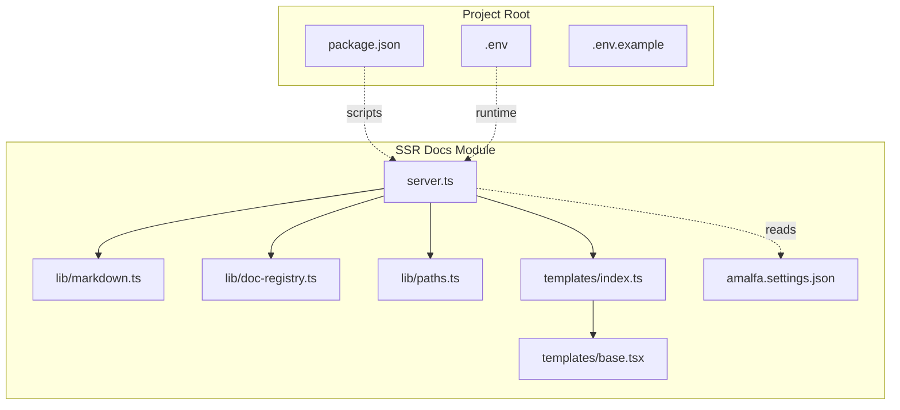
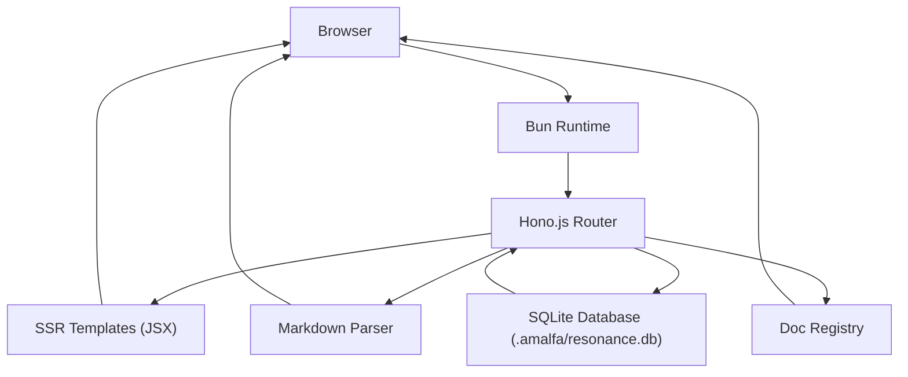
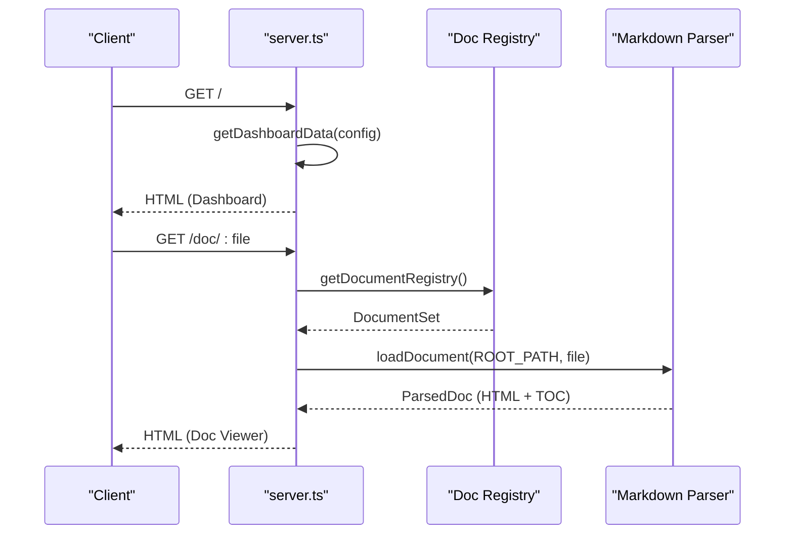
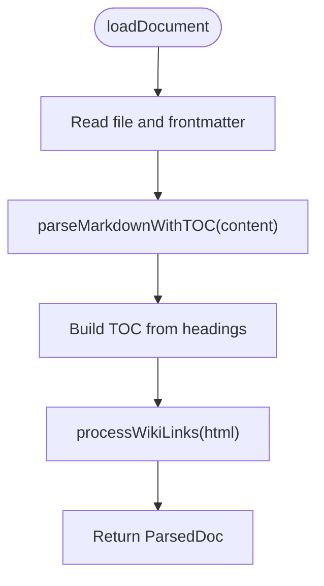
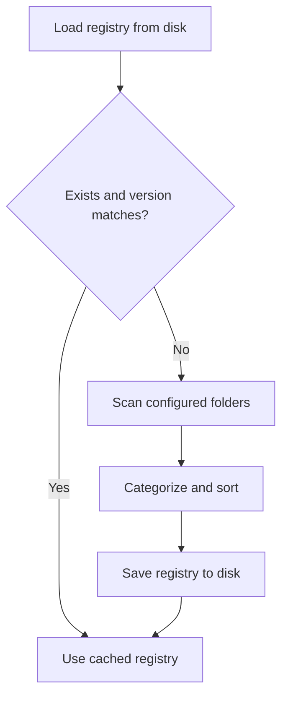
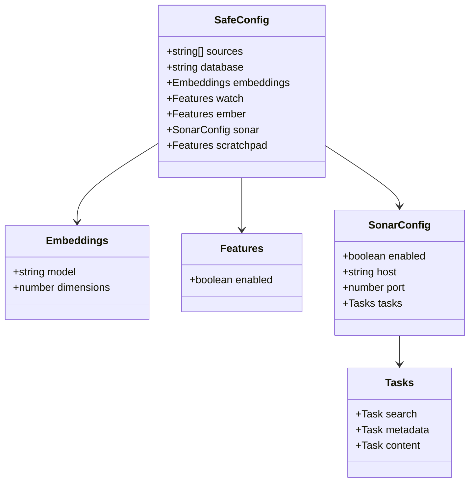
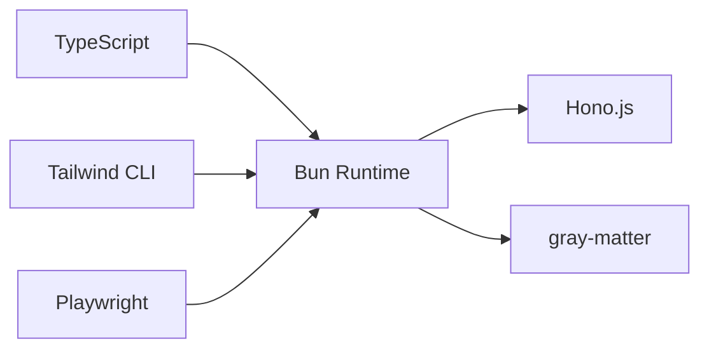

# Deployment and Configuration

<cite>
**Referenced Files in This Document**
- [README.md](file://website/ssr-docs/README.md)
- [server.ts](file://website/ssr-docs/server.ts)
- [tsconfig.json](file://website/ssr-docs/tsconfig.json)
- [markdown.ts](file://website/ssr-docs/lib/markdown.ts)
- [doc-registry.ts](file://website/ssr-docs/lib/doc-registry.ts)
- [paths.ts](file://website/ssr-docs/lib/paths.ts)
- [index.ts](file://website/ssr-docs/templates/index.ts)
- [base.tsx](file://website/ssr-docs/templates/base.tsx)
- [package.json](file://package.json)
- [amalfa.settings.json](file://amalfa.settings.json)
- [amalfa.settings.example.json](file://amalfa.settings.example.json)
- [.env](file://.env)
- [.env.example](file://.env.example)
</cite>

## Table of Contents
1. [Introduction](#introduction)
2. [Project Structure](#project-structure)
3. [Core Components](#core-components)
4. [Architecture Overview](#architecture-overview)
5. [Detailed Component Analysis](#detailed-component-analysis)
6. [Dependency Analysis](#dependency-analysis)
7. [Performance Considerations](#performance-considerations)
8. [Troubleshooting Guide](#troubleshooting-guide)
9. [Conclusion](#conclusion)
10. [Appendices](#appendices)

## Introduction
This document explains how to deploy and configure Amalfa’s SSR documentation system. It covers environment setup, dependency management, runtime configuration, production deployment strategies, process management, monitoring, build and asset optimization, caching, containerization, reverse proxy and load balancing, logging and error reporting, security, performance tuning, and scaling for high-traffic documentation sites.

## Project Structure
The SSR documentation server is implemented as a standalone module under website/ssr-docs. It integrates with the broader Amalfa project via shared configuration and assets.

**Diagram sources**
- [server.ts](file://website/ssr-docs/server.ts#L1-L385)
- [markdown.ts](file://website/ssr-docs/lib/markdown.ts#L1-L287)
- [doc-registry.ts](file://website/ssr-docs/lib/doc-registry.ts#L1-L193)
- [paths.ts](file://website/ssr-docs/lib/paths.ts#L1-L41)
- [index.ts](file://website/ssr-docs/templates/index.ts#L1-L142)
- [base.tsx](file://website/ssr-docs/templates/base.tsx#L1-L261)
- [amalfa.settings.json](file://amalfa.settings.json#L1-L96)
- [package.json](file://package.json#L1-L105)
- [.env](file://.env#L1-L3)
- [.env.example](file://.env.example#L1-L83)

**Section sources**
- [README.md](file://website/ssr-docs/README.md#L1-L119)
- [server.ts](file://website/ssr-docs/server.ts#L1-L385)
- [tsconfig.json](file://website/ssr-docs/tsconfig.json#L1-L15)

## Core Components
- Server entrypoint and routing: [server.ts](file://website/ssr-docs/server.ts#L151-L341)
- Markdown parsing and TOC generation: [markdown.ts](file://website/ssr-docs/lib/markdown.ts#L57-L118)
- Document registry and caching: [doc-registry.ts](file://website/ssr-docs/lib/doc-registry.ts#L125-L182)
- Path resolution utilities: [paths.ts](file://website/ssr-docs/lib/paths.ts#L13-L38)
- Template integration and SSR rendering: [index.ts](file://website/ssr-docs/templates/index.ts#L52-L141), [base.tsx](file://website/ssr-docs/templates/base.tsx#L36-L89)
- Build and dev scripts: [package.json](file://package.json#L57-L77)
- Configuration sources: [amalfa.settings.json](file://amalfa.settings.json#L1-L96), [amalfa.settings.example.json](file://amalfa.settings.example.json#L1-L56)
- Environment variables: [.env](file://.env#L1-L3), [.env.example](file://.env.example#L1-L83)

Key runtime configuration is loaded from amalfa.settings.json and exposed via safe API endpoints. The server supports static assets, SSR pages, and lightweight APIs for stats and configuration.

**Section sources**
- [server.ts](file://website/ssr-docs/server.ts#L36-L58)
- [index.ts](file://website/ssr-docs/templates/index.ts#L30-L50)
- [amalfa.settings.json](file://amalfa.settings.json#L1-L96)

## Architecture Overview
The SSR server is a Bun-based Hono application that renders JSX to HTML, serves static assets, and exposes JSON endpoints for configuration and metrics. It reads configuration from a single source of truth and integrates with the knowledge graph database for stats.

**Diagram sources**
- [server.ts](file://website/ssr-docs/server.ts#L151-L341)
- [markdown.ts](file://website/ssr-docs/lib/markdown.ts#L57-L118)
- [doc-registry.ts](file://website/ssr-docs/lib/doc-registry.ts#L125-L182)
- [index.ts](file://website/ssr-docs/templates/index.ts#L52-L95)

## Detailed Component Analysis

### Server Entrypoint and Routing
- Port selection: Falls back to 3001 if PORT is unset.
- PID lifecycle management for process supervision.
- Static routes for CSS and favicon.
- Dynamic routes for dashboard, lexicon, brutalisimo pages, and documentation viewer.
- API endpoints for config, stats, and placeholder stream.

**Diagram sources**
- [server.ts](file://website/ssr-docs/server.ts#L212-L330)
- [doc-registry.ts](file://website/ssr-docs/lib/doc-registry.ts#L125-L182)
- [markdown.ts](file://website/ssr-docs/lib/markdown.ts#L155-L181)

**Section sources**
- [server.ts](file://website/ssr-docs/server.ts#L96-L341)

### Markdown Parsing and TOC Generation
- Parses markdown with Bun’s native markdown renderer.
- Generates a hierarchical TOC from h2/h3 headings.
- Applies wiki-link processing to internal references.
- Loads metadata via gray-matter frontmatter.

**Diagram sources**
- [markdown.ts](file://website/ssr-docs/lib/markdown.ts#L155-L181)

**Section sources**
- [markdown.ts](file://website/ssr-docs/lib/markdown.ts#L57-L181)

### Document Registry and Caching
- Persists a versioned registry to .amalfa/runtime/doc-registry.json.
- Scans configured folders for markdown files.
- Categorizes documents by type and caches results.
- Supports invalidation and refresh signaling.

**Diagram sources**
- [doc-registry.ts](file://website/ssr-docs/lib/doc-registry.ts#L62-L182)

**Section sources**
- [doc-registry.ts](file://website/ssr-docs/lib/doc-registry.ts#L44-L182)

### Path Resolution Utilities
- Locates project root using marker files.
- Provides safe path resolution for assets and data.

**Section sources**
- [paths.ts](file://website/ssr-docs/lib/paths.ts#L13-L38)

### Template Integration and SSR Rendering
- Loads configuration and database stats for SSR pages.
- Exposes safe configuration and stats to client via window globals.
- Provides reusable layout and widget components.

**Section sources**
- [index.ts](file://website/ssr-docs/templates/index.ts#L30-L95)
- [base.tsx](file://website/ssr-docs/templates/base.tsx#L36-L89)

### Configuration File Structure and Feature Toggles
- Single source of truth: amalfa.settings.json.
- Feature toggles include watch, ember, sonar, scratchpad.
- Database path, embeddings model/dimensions, and document folders are configurable.
- Environment variables include provider API keys and optional debug flags.

**Diagram sources**
- [index.ts](file://website/ssr-docs/templates/index.ts#L20-L28)
- [amalfa.settings.json](file://amalfa.settings.json#L1-L96)

**Section sources**
- [index.ts](file://website/ssr-docs/templates/index.ts#L30-L50)
- [amalfa.settings.json](file://amalfa.settings.json#L1-L96)
- [amalfa.settings.example.json](file://amalfa.settings.example.json#L1-L56)

### Environment Variable Handling
- .env holds provider API keys and optional flags.
- .env.example documents all supported variables and security notes.
- Variables are intended for runtime services and providers outside this server.

**Section sources**
- [.env](file://.env#L1-L3)
- [.env.example](file://.env.example#L1-L83)

## Dependency Analysis
- Runtime: Bun (engine requirement), Hono.js (web framework), gray-matter (frontmatter), SQLite via bun:sqlite.
- Build and dev: Tailwind CLI for CSS, TypeScript compilation, Playwright for E2E testing.
- Scripts orchestrate development, CSS building, and testing.

**Diagram sources**
- [package.json](file://package.json#L44-L95)
- [server.ts](file://website/ssr-docs/server.ts#L1-L10)

**Section sources**
- [package.json](file://package.json#L44-L95)

## Performance Considerations
- Asset optimization
  - CSS is built via Tailwind CLI and served as static assets. Minification is controlled by the build script.
  - Keep static assets under public/css and reference them via known paths to enable CDN caching.
- Caching strategies
  - Document registry is persisted and versioned to reduce filesystem scans on startup.
  - Consider adding HTTP cache headers for static assets and infrequently changing pages.
- Database access
  - Stats queries use a read-only SQLite connection; ensure the database file is on fast storage.
- Concurrency and scaling
  - The server is single-process. Scale horizontally behind a reverse proxy or container orchestrator.
- Monitoring
  - Expose a health endpoint and integrate with external metrics systems.

[No sources needed since this section provides general guidance]

## Troubleshooting Guide
- Server fails to start
  - Verify project root detection and marker files. The server expects package.json or amalfa.settings.json in the project root.
  - Check permissions for .amalfa directories and ensure they are writable.
- Documents not appearing
  - Confirm amalfa.settings.json defines docs.folders and that markdown files exist under those paths.
  - Trigger registry refresh if changes are not reflected.
- 404 on docs
  - Ensure the requested file path exists relative to docs/ or briefs/.
- Database errors
  - Validate the database path in amalfa.settings.json and ensure the file exists and is readable.
- CORS and preflight
  - The server responds to OPTIONS with permissive headers for local development. Adjust CORS headers in production as needed.
- E2E tests
  - Run tests after starting the server locally to validate rendering and API responses.

**Section sources**
- [server.ts](file://website/ssr-docs/server.ts#L8-L11)
- [paths.ts](file://website/ssr-docs/lib/paths.ts#L13-L29)
- [doc-registry.ts](file://website/ssr-docs/lib/doc-registry.ts#L125-L182)
- [amalfa.settings.json](file://amalfa.settings.json#L2-L8)

## Conclusion
Amalfa’s SSR documentation system is a focused, Bun-powered server that renders markdown documentation with SSR, integrates with a knowledge graph, and exposes configuration and metrics via simple endpoints. By centralizing configuration in amalfa.settings.json, leveraging a persisted document registry, and optimizing static assets, teams can deploy reliably in development and production environments. For high-traffic scenarios, combine horizontal scaling, reverse proxies, and CDN caching with robust monitoring and security controls.

[No sources needed since this section summarizes without analyzing specific files]

## Appendices

### A. Environment Setup and Dependencies
- Install Bun (>= 1.3.8) as per engines specification.
- Install Node dependencies for build and dev tooling.
- Prepare amalfa.settings.json from the example and set document folders and database path.
- Optionally copy .env.example to .env and populate provider keys.

**Section sources**
- [package.json](file://package.json#L44-L46)
- [amalfa.settings.example.json](file://amalfa.settings.example.json#L1-L56)
- [.env.example](file://.env.example#L1-L83)

### B. Production Deployment Strategies
- Process management
  - Use a process manager (e.g., pm2, systemd) to start/stop/restart the server and manage PID files.
- Reverse proxy and load balancing
  - Place a reverse proxy (Nginx, Traefik, Caddy) in front of multiple instances for SSL termination, compression, and load balancing.
- Containerization
  - Build a minimal image with Bun runtime and copy built assets and server binary.
  - Mount persistent volumes for .amalfa/logs, .amalfa/runtime, and .amalfa/cache.
- Health checks
  - Add a /health endpoint returning 200 when the server is ready and database is reachable.

[No sources needed since this section provides general guidance]

### C. Build and Asset Optimization
- CSS build
  - Use the Tailwind CLI script to compile and minify styles.
- TypeScript
  - Compile with tsc and ensure outDir is set for distribution builds.
- Static assets
  - Serve public/css and public/js via the reverse proxy or CDN with long-lived cache headers.

**Section sources**
- [package.json](file://package.json#L63-L65)
- [tsconfig.json](file://website/ssr-docs/tsconfig.json#L9-L10)

### D. Logging and Error Reporting
- Logging
  - Integrate structured logging (e.g., pino) and ship logs to stdout/stderr for container orchestration platforms.
- Error handling
  - The server returns 500 on internal errors and 404 for missing resources. Wrap handlers to capture stack traces and return standardized error responses.

[No sources needed since this section provides general guidance]

### E. Security Considerations
- Secrets
  - Store API keys in .env and never commit them. Restrict file permissions.
- Access control
  - Enforce authentication/authorization at the reverse proxy or gateway.
- CORS and headers
  - Harden CORS policies and add security headers (HSTS, CSP) at the proxy.
- Least privilege
  - Run the server as a dedicated non-root user with read-only access to the database and read-write to cache/logs directories.

[No sources needed since this section provides general guidance]

### F. Performance Tuning and Scaling
- Horizontal scaling
  - Run multiple instances behind a load balancer; ensure shared cache/logging are handled externally.
- Database tuning
  - Use WAL mode and appropriate pragmas; monitor page counts and sizes.
- Caching
  - Cache registry and frequently accessed pages; invalidate on document changes.
- Observability
  - Instrument latency, error rates, and throughput; correlate with database metrics.

[No sources needed since this section provides general guidance]