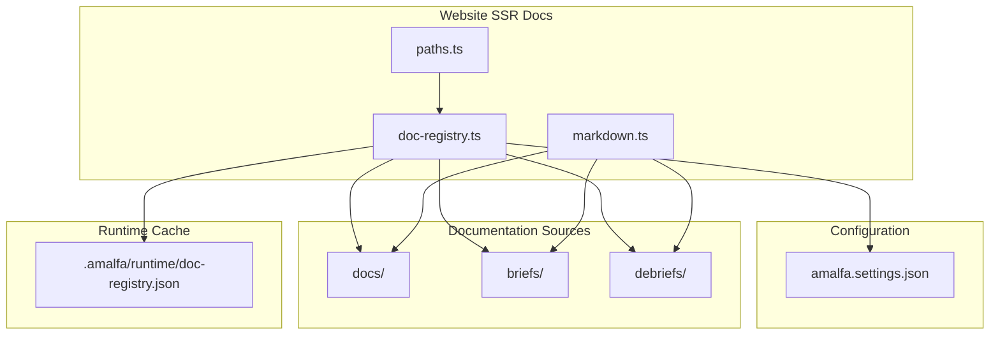
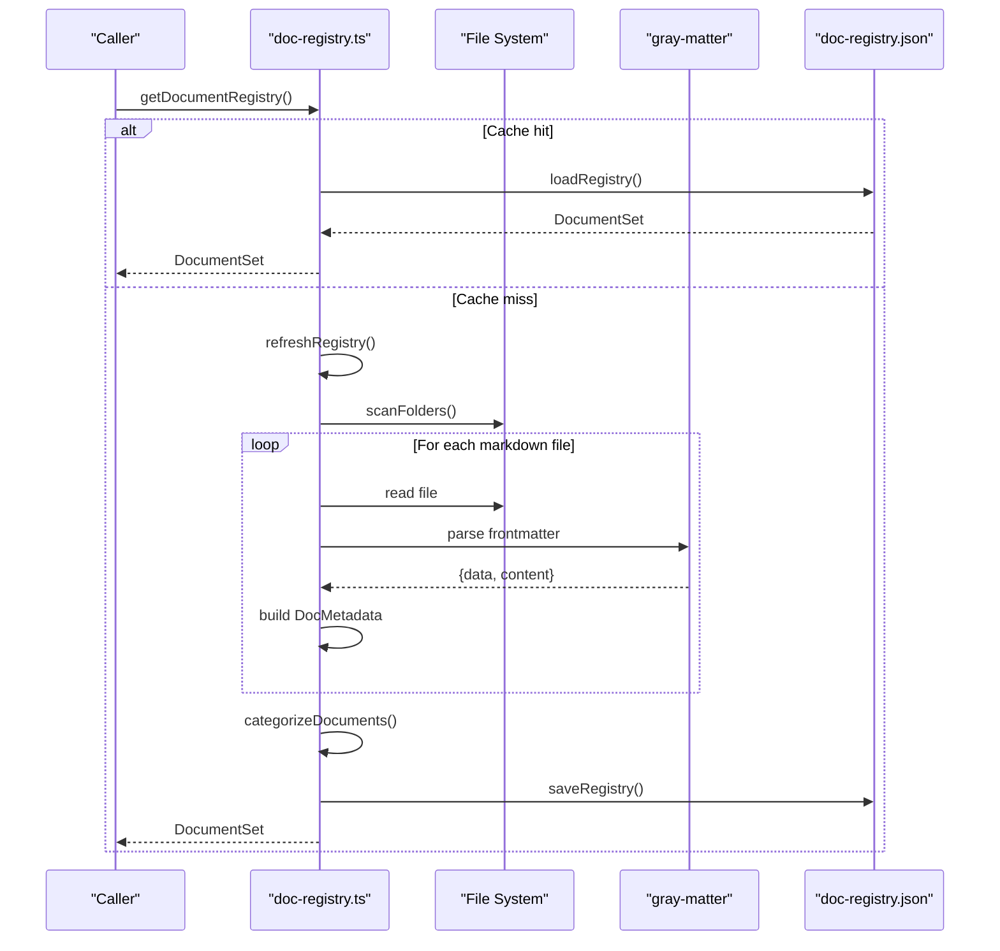
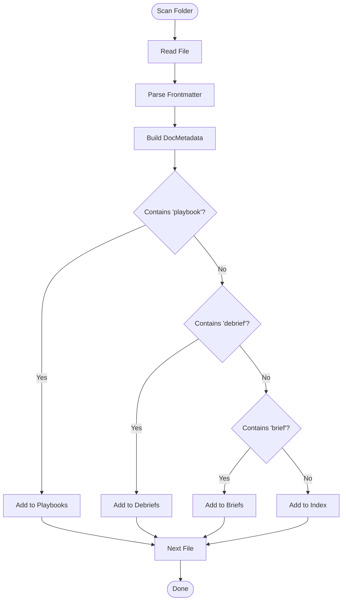
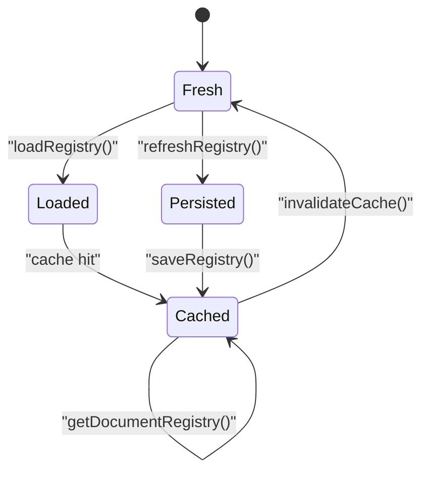
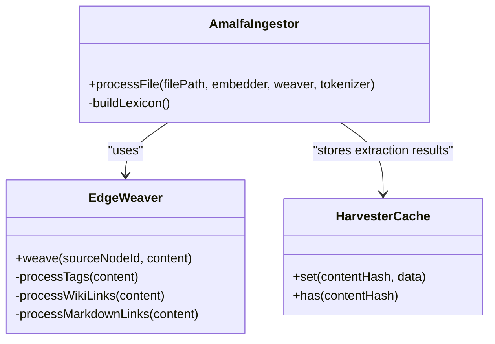
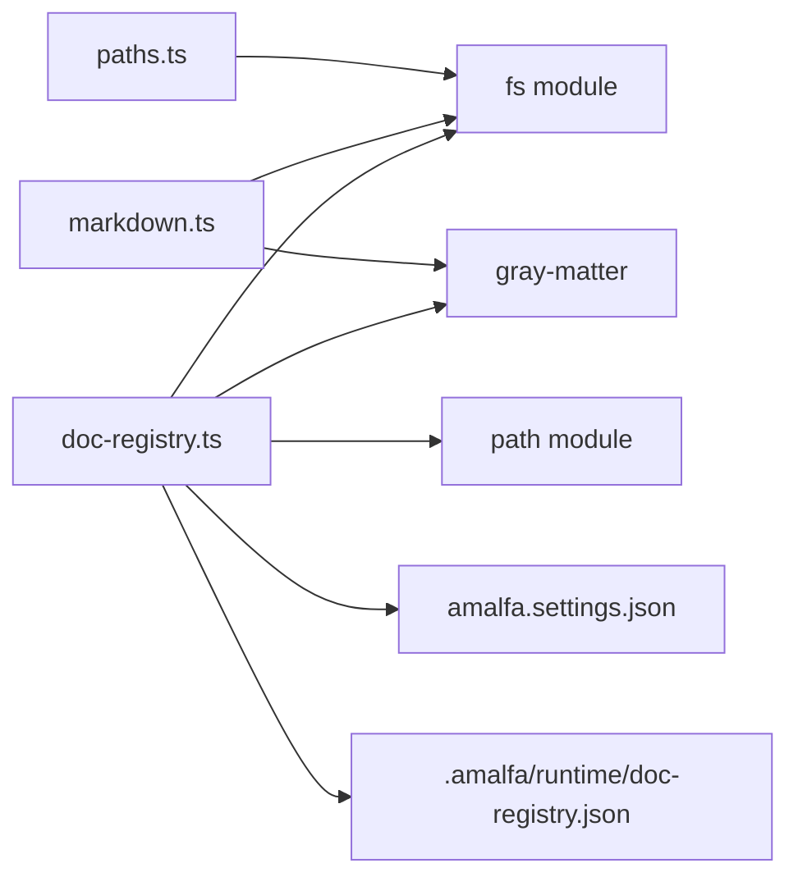

# Document Registry System

<cite>
**Referenced Files in This Document**
- [doc-registry.ts](file://website/ssr-docs/lib/doc-registry.ts)
- [markdown.ts](file://website/ssr-docs/lib/markdown.ts)
- [paths.ts](file://website/ssr-docs/lib/paths.ts)
- [doc-registry.test.ts](file://website/ssr-docs/lib/doc-registry.test.ts)
- [paths.test.ts](file://website/ssr-docs/lib/paths.test.ts)
- [playbooks-playbook.md](file://playbooks/playbooks-playbook.md)
- [debriefs-playbook.md](file://playbooks/debriefs-playbook.md)
- [2026-01-06-readme.md](file://debriefs/2026-01-06-readme.md)
- [AmalfaIngestor.ts](file://src/pipeline/AmalfaIngestor.ts)
- [EdgeWeaver.ts](file://src/core/EdgeWeaver.ts)
- [HarvesterCache.ts](file://src/core/HarvesterCache.ts)
- [artifact.ts](file://src/types/artifact.ts)
- [enriched-cda.ts](file://src/resonance/types/enriched-cda.ts)
</cite>

## Table of Contents
1. [Introduction](#introduction)
2. [Project Structure](#project-structure)
3. [Core Components](#core-components)
4. [Architecture Overview](#architecture-overview)
5. [Detailed Component Analysis](#detailed-component-analysis)
6. [Dependency Analysis](#dependency-analysis)
7. [Performance Considerations](#performance-considerations)
8. [Troubleshooting Guide](#troubleshooting-guide)
9. [Conclusion](#conclusion)
10. [Appendices](#appendices)

## Introduction
This document explains Amalfa’s document registry system that organizes, discovers, and tracks documentation content across categories (index, playbooks, debriefs, briefs). It covers the file discovery mechanism, metadata extraction via frontmatter parsing, category classification logic, path resolution, caching strategies, refresh mechanisms, and integration with the markdown parsing system and knowledge graph for content enrichment.

## Project Structure
The registry lives in the website SSR documentation stack and is responsible for scanning configured folders, extracting metadata, and persisting a categorized registry for efficient serving and navigation.

**Diagram sources**
- [doc-registry.ts](file://website/ssr-docs/lib/doc-registry.ts#L44-L78)
- [paths.ts](file://website/ssr-docs/lib/paths.ts#L11-L38)
- [markdown.ts](file://website/ssr-docs/lib/markdown.ts#L183-L226)

**Section sources**
- [doc-registry.ts](file://website/ssr-docs/lib/doc-registry.ts#L1-L193)
- [paths.ts](file://website/ssr-docs/lib/paths.ts#L1-L41)
- [markdown.ts](file://website/ssr-docs/lib/markdown.ts#L1-L287)

## Core Components
- Document registry loader and scanner: Discovers markdown files, parses frontmatter, and builds a categorized index.
- Metadata extractor: Reads YAML frontmatter and extracts fields such as title, date, type, and tags.
- Category classifier: Assigns documents to index, playbooks, debriefs, or briefs based on filename heuristics.
- Path resolver: Locates project root using markers and resolves absolute paths reliably.
- Persistence and cache: Stores a versioned registry JSON file and supports cache invalidation.
- Markdown parser integration: Provides SSR rendering helpers and reference processing for wiki-links.

**Section sources**
- [doc-registry.ts](file://website/ssr-docs/lib/doc-registry.ts#L80-L121)
- [doc-registry.ts](file://website/ssr-docs/lib/doc-registry.ts#L100-L106)
- [doc-registry.ts](file://website/ssr-docs/lib/doc-registry.ts#L125-L182)
- [paths.ts](file://website/ssr-docs/lib/paths.ts#L13-L38)
- [markdown.ts](file://website/ssr-docs/lib/markdown.ts#L155-L181)
- [markdown.ts](file://website/ssr-docs/lib/markdown.ts#L183-L226)

## Architecture Overview
The registry orchestrates discovery, parsing, classification, and persistence. It reads configuration, scans folders, builds an in-memory registry, persists it, and exposes categorized collections for downstream consumers.

**Diagram sources**
- [doc-registry.ts](file://website/ssr-docs/lib/doc-registry.ts#L125-L182)
- [doc-registry.ts](file://website/ssr-docs/lib/doc-registry.ts#L108-L121)
- [doc-registry.ts](file://website/ssr-docs/lib/doc-registry.ts#L80-L98)

## Detailed Component Analysis

### Document Registry Loader and Scanner
- Loads persisted registry if present and version-compatible; otherwise rebuilds.
- Scans configured folders recursively, skipping hidden directories and filtering for markdown files.
- Parses frontmatter to extract metadata and computes derived fields such as id and modified timestamps.
- Builds grouped indices by folder and category.

Key behaviors:
- Versioned persistence ensures compatibility across upgrades.
- Recursive directory traversal respects hidden directories and ignores node_modules-like structures.
- Gray-matter parsing supports YAML frontmatter extraction.

**Section sources**
- [doc-registry.ts](file://website/ssr-docs/lib/doc-registry.ts#L62-L78)
- [doc-registry.ts](file://website/ssr-docs/lib/doc-registry.ts#L125-L135)
- [doc-registry.ts](file://website/ssr-docs/lib/doc-registry.ts#L137-L182)
- [doc-registry.ts](file://website/ssr-docs/lib/doc-registry.ts#L108-L121)
- [doc-registry.ts](file://website/ssr-docs/lib/doc-registry.ts#L80-L98)

### Metadata Extraction and Classification
- Metadata extraction: Reads YAML frontmatter and maps fields (title, date, type, tags) into a normalized DocMetadata structure.
- Classification: Heuristic-based categorization checks filename patterns to assign documents to playbooks, debriefs, briefs, or index.
- Sorting: Playbooks sorted by title; debriefs sorted by date descending.

**Diagram sources**
- [doc-registry.ts](file://website/ssr-docs/lib/doc-registry.ts#L100-L106)
- [doc-registry.ts](file://website/ssr-docs/lib/doc-registry.ts#L158-L168)

**Section sources**
- [doc-registry.ts](file://website/ssr-docs/lib/doc-registry.ts#L80-L98)
- [doc-registry.ts](file://website/ssr-docs/lib/doc-registry.ts#L100-L106)
- [doc-registry.ts](file://website/ssr-docs/lib/doc-registry.ts#L158-L168)

### Path Resolution Logic
- Uses project markers (package.json, amalfa.settings.json) to locate the repository root.
- Resolves absolute paths safely from the detected root, enabling consistent operation regardless of invocation location.
- Provides a utility to resolve arbitrary segments relative to the project root.

**Section sources**
- [paths.ts](file://website/ssr-docs/lib/paths.ts#L13-L38)

### Caching Strategies and Refresh Mechanisms
- Persistent cache: A versioned JSON file stores the built registry to avoid repeated scans.
- In-memory cache: Loaded registry is held in memory until invalidated.
- Invalidate on change: Exposes functions to invalidate cache and signal change events.
- Registry refresh: Re-scans configured folders, re-parses frontmatter, re-classifies, and persists a new versioned registry.

**Diagram sources**
- [doc-registry.ts](file://website/ssr-docs/lib/doc-registry.ts#L123-L135)
- [doc-registry.ts](file://website/ssr-docs/lib/doc-registry.ts#L184-L190)

**Section sources**
- [doc-registry.ts](file://website/ssr-docs/lib/doc-registry.ts#L62-L78)
- [doc-registry.ts](file://website/ssr-docs/lib/doc-registry.ts#L123-L135)
- [doc-registry.ts](file://website/ssr-docs/lib/doc-registry.ts#L184-L190)

### Integration with Markdown Parsing System
- SSR rendering: Provides helpers to parse markdown with TOC generation and wiki-link processing.
- Reference processing: Transforms wiki-links and reference patterns into navigable links using a reference map.
- Directory scanning: Utility to enumerate documents from a given path, supporting SSR rendering pipelines.

**Section sources**
- [markdown.ts](file://website/ssr-docs/lib/markdown.ts#L57-L118)
- [markdown.ts](file://website/ssr-docs/lib/markdown.ts#L120-L150)
- [markdown.ts](file://website/ssr-docs/lib/markdown.ts#L183-L226)

### Relationship with Knowledge Graph for Content Enrichment
- Ingestion pipeline: Processes markdown files, extracts semantic tokens, generates embeddings, and inserts nodes into the knowledge graph.
- Edge weaving: Creates explicit semantic edges from wiki-links, tags, and markdown links; later stages may add semantic edges via vector similarity and reranking.
- Enriched artifacts: Types define enriched structures for CDA and lexicon concepts, enabling downstream enrichment workflows.

**Diagram sources**
- [AmalfaIngestor.ts](file://src/pipeline/AmalfaIngestor.ts#L375-L409)
- [EdgeWeaver.ts](file://src/core/EdgeWeaver.ts#L47-L166)
- [HarvesterCache.ts](file://src/core/HarvesterCache.ts#L44-L68)

**Section sources**
- [AmalfaIngestor.ts](file://src/pipeline/AmalfaIngestor.ts#L356-L409)
- [EdgeWeaver.ts](file://src/core/EdgeWeaver.ts#L47-L166)
- [HarvesterCache.ts](file://src/core/HarvesterCache.ts#L44-L68)

### Extending the Registry for Additional Content Sources
- Add new folders: Configure additional document roots via settings; the registry scans all configured folders.
- Extend categorization: Adjust the classification heuristic to recognize new patterns or filenames.
- Support new formats: Modify the scanner to include additional extensions or integrate alternative parsers.

Operational guidance:
- Use amalfa.settings.json to declare extra folders keyed by logical names.
- Extend categorize() to detect new patterns (e.g., “report”, “spec”).
- Integrate alternative parsers by wrapping content loading and metadata extraction.

**Section sources**
- [doc-registry.ts](file://website/ssr-docs/lib/doc-registry.ts#L137-L148)
- [doc-registry.ts](file://website/ssr-docs/lib/doc-registry.ts#L100-L106)
- [doc-registry.ts](file://website/ssr-docs/lib/doc-registry.ts#L108-L121)

### Customizing Categorization Rules
- Current logic: Filename-based heuristics determine category membership.
- Customization: Override categorize() to incorporate domain-specific rules, tags, or frontmatter fields.

**Section sources**
- [doc-registry.ts](file://website/ssr-docs/lib/doc-registry.ts#L100-L106)

### Adding New Document Types
- Define a new category: Extend categorize() and ensure downstream consumers handle the new key.
- Update ingestion and enrichment: Align with knowledge graph ingestion and enrichment steps.
- Example types: Reports, specs, guidelines, or artifacts (see artifact type).

**Section sources**
- [artifact.ts](file://src/types/artifact.ts#L1-L12)

## Dependency Analysis
The registry depends on:
- File system APIs for scanning and reading.
- Gray-matter for frontmatter parsing.
- Optional settings for dynamic folder configuration.
- Runtime cache for persistence and performance.

**Diagram sources**
- [doc-registry.ts](file://website/ssr-docs/lib/doc-registry.ts#L8-L10)
- [markdown.ts](file://website/ssr-docs/lib/markdown.ts#L7-L9)
- [paths.ts](file://website/ssr-docs/lib/paths.ts#L8-L9)

**Section sources**
- [doc-registry.ts](file://website/ssr-docs/lib/doc-registry.ts#L8-L10)
- [markdown.ts](file://website/ssr-docs/lib/markdown.ts#L7-L9)
- [paths.ts](file://website/ssr-docs/lib/paths.ts#L8-L9)

## Performance Considerations
- Prefer scanning only necessary folders to reduce IO overhead.
- Use the persisted registry to avoid repeated scans during development.
- Keep frontmatter minimal to reduce parsing cost.
- Consider lazy-loading of large documents in SSR contexts.

## Troubleshooting Guide
Common issues and resolutions:
- Empty registry: Ensure configured folders exist and contain markdown files; verify gray-matter parsing errors.
- Incorrect categories: Review categorize() logic and adjust heuristics.
- Cache staleness: Call invalidateCache() or signalChange() after modifying content sources.
- Path resolution failures: Confirm project markers are present and reachable from the working directory.

Validation utilities:
- Use unit tests to assert registry shape and presence of persisted cache.

**Section sources**
- [doc-registry.test.ts](file://website/ssr-docs/lib/doc-registry.test.ts#L9-L34)
- [paths.test.ts](file://website/ssr-docs/lib/paths.test.ts#L8-L35)

## Conclusion
Amalfa’s document registry system provides a robust, configurable, and efficient way to discover, parse, categorize, and serve documentation content. By leveraging frontmatter parsing, heuristic classification, persistent caching, and SSR-ready markdown utilities, it integrates seamlessly with the knowledge graph ingestion and enrichment pipeline. Extensibility is achieved through configuration, categorization customization, and optional format support.

## Appendices

### Appendix A: Category Definitions and Examples
- Index: Documents not matching playbook/debrief/brief patterns.
- Playbooks: Documents with “playbook” in filename; see playbook playbook for conventions.
- Debriefs: Documents with “debrief” in filename; see debriefs playbook for required frontmatter.
- Briefs: Documents with “brief” in filename; see briefs directory overview.

**Section sources**
- [doc-registry.ts](file://website/ssr-docs/lib/doc-registry.ts#L100-L106)
- [playbooks-playbook.md](file://playbooks/playbooks-playbook.md#L57-L70)
- [debriefs-playbook.md](file://playbooks/debriefs-playbook.md#L28-L42)
- [2026-01-06-readme.md](file://debriefs/2026-01-06-readme.md#L1-L32)

### Appendix B: Knowledge Graph Enrichment Types
- Enriched CDA and lexicon concepts define structured forms for enriched content, enabling downstream enrichment and linking.

**Section sources**
- [enriched-cda.ts](file://src/resonance/types/enriched-cda.ts#L62-L112)