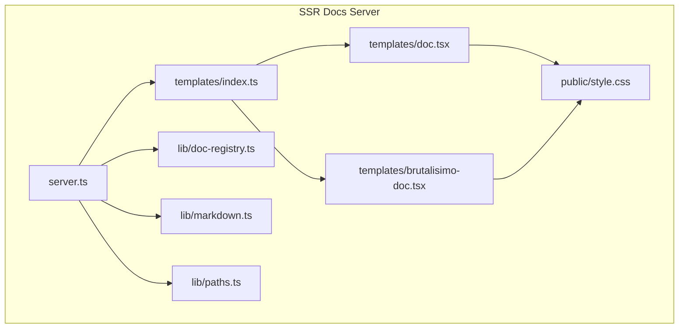
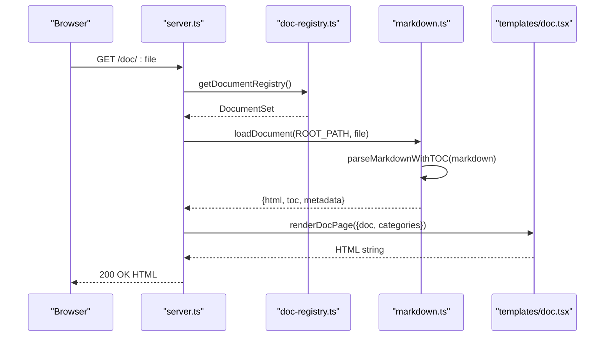
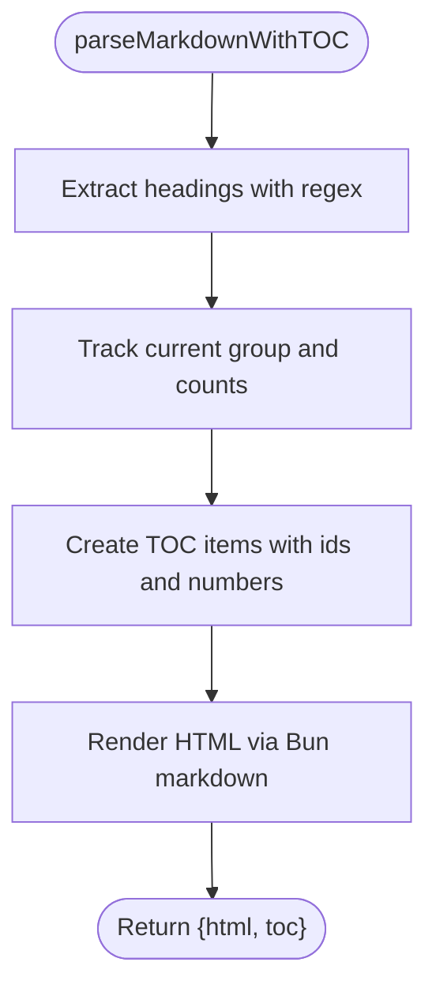
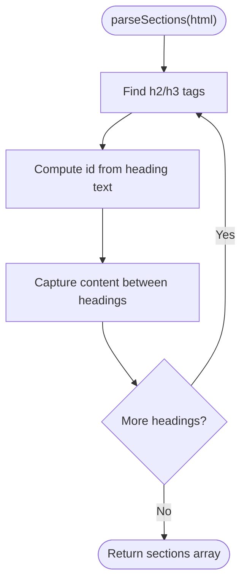
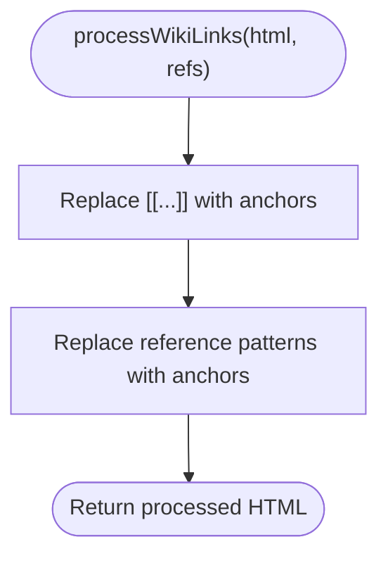
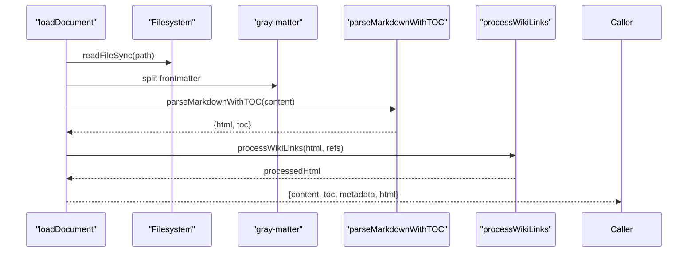
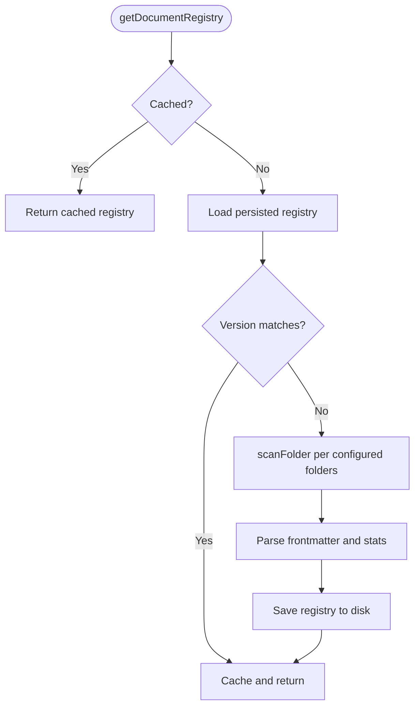
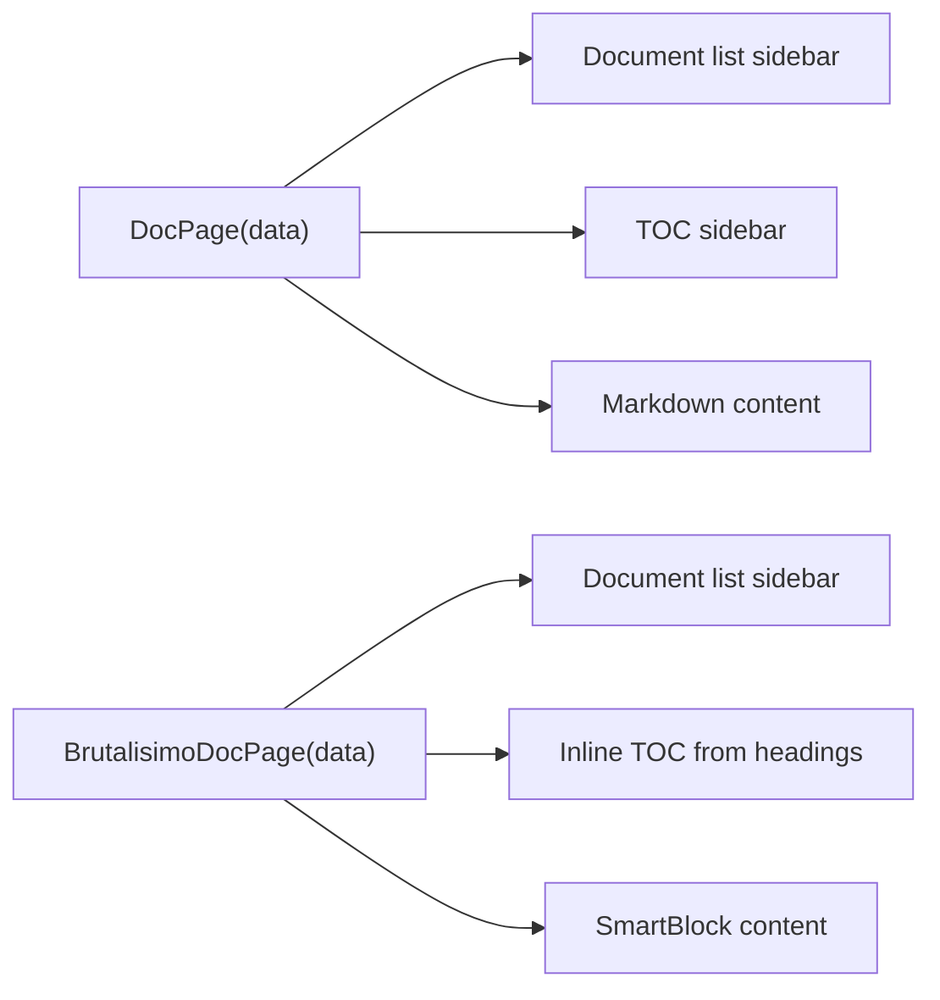
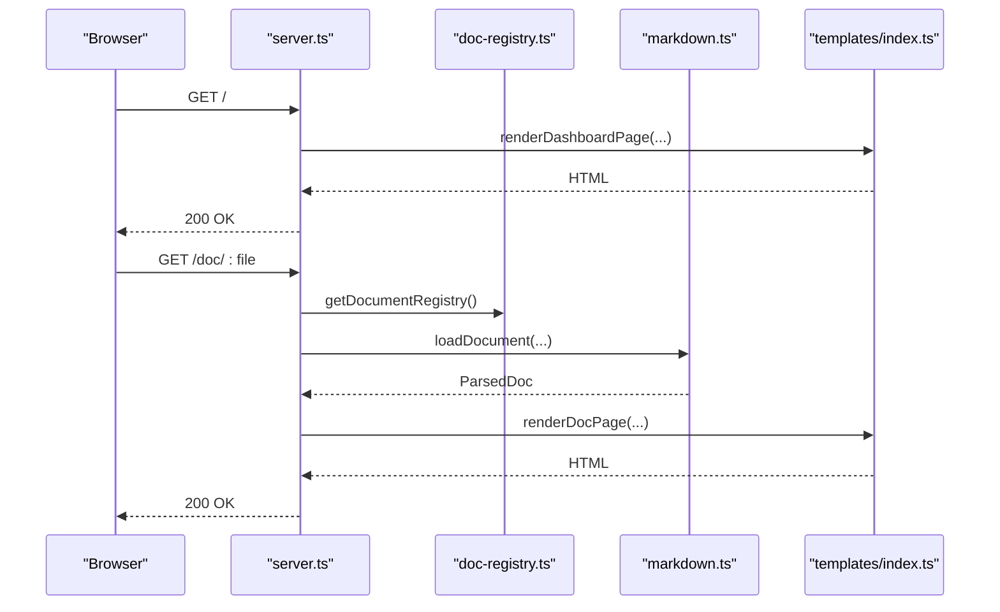
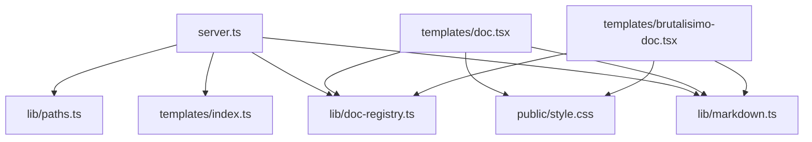

# Markdown Processing

<cite>
**Referenced Files in This Document**
- [README.md](file://website/ssr-docs/README.md)
- [server.ts](file://website/ssr-docs/server.ts)
- [markdown.ts](file://website/ssr-docs/lib/markdown.ts)
- [doc-registry.ts](file://website/ssr-docs/lib/doc-registry.ts)
- [paths.ts](file://website/ssr-docs/lib/paths.ts)
- [index.ts](file://website/ssr-docs/templates/index.ts)
- [doc.tsx](file://website/ssr-docs/templates/doc.tsx)
- [brutalisimo-doc.tsx](file://website/ssr-docs/templates/brutalisimo-doc.tsx)
- [style.css](file://website/ssr-docs/public/style.css)
- [DOM-MAP.md](file://website/DOM-MAP.md)
</cite>

## Table of Contents
1. [Introduction](#introduction)
2. [Project Structure](#project-structure)
3. [Core Components](#core-components)
4. [Architecture Overview](#architecture-overview)
5. [Detailed Component Analysis](#detailed-component-analysis)
6. [Dependency Analysis](#dependency-analysis)
7. [Performance Considerations](#performance-considerations)
8. [Troubleshooting Guide](#troubleshooting-guide)
9. [Conclusion](#conclusion)
10. [Appendices](#appendices)

## Introduction
This document explains Amalfa’s SSR-powered markdown processing system for documentation. It covers how markdown is parsed, how the table of contents (TOC) is generated, how HTML is produced, and how headings are transformed into navigable sections with anchor IDs. It also documents wiki-link processing, reference linking, error handling, performance characteristics, caching strategies, and integration with the document registry and knowledge graph for content enrichment.

## Project Structure
The SSR documentation server lives under website/ssr-docs and is composed of:
- A server that routes requests and renders pages using JSX templates
- A markdown library that parses markdown, generates TOC, and processes wiki-links
- A document registry that scans and caches metadata for all documents
- Templates that render the final HTML with sidebars, TOC, and content
- A minimal terminal-inspired stylesheet

**Diagram sources**
- [server.ts](file://website/ssr-docs/server.ts#L150-L341)
- [index.ts](file://website/ssr-docs/templates/index.ts#L1-L142)
- [doc.tsx](file://website/ssr-docs/templates/doc.tsx#L1-L115)
- [brutalisimo-doc.tsx](file://website/ssr-docs/templates/brutalisimo-doc.tsx#L1-L112)
- [markdown.ts](file://website/ssr-docs/lib/markdown.ts#L1-L287)
- [doc-registry.ts](file://website/ssr-docs/lib/doc-registry.ts#L1-L193)
- [paths.ts](file://website/ssr-docs/lib/paths.ts#L1-L41)
- [style.css](file://website/ssr-docs/public/style.css#L1-L489)

**Section sources**
- [README.md](file://website/ssr-docs/README.md#L1-L119)
- [server.ts](file://website/ssr-docs/server.ts#L1-L385)
- [markdown.ts](file://website/ssr-docs/lib/markdown.ts#L1-L287)
- [doc-registry.ts](file://website/ssr-docs/lib/doc-registry.ts#L1-L193)
- [paths.ts](file://website/ssr-docs/lib/paths.ts#L1-L41)
- [index.ts](file://website/ssr-docs/templates/index.ts#L1-L142)
- [doc.tsx](file://website/ssr-docs/templates/doc.tsx#L1-L115)
- [brutalisimo-doc.tsx](file://website/ssr-docs/templates/brutalisimo-doc.tsx#L1-L112)
- [style.css](file://website/ssr-docs/public/style.css#L1-L489)

## Core Components
- Markdown parser and TOC generator: extracts headings, builds hierarchical TOC, and renders HTML via Bun’s native markdown renderer
- Wiki-link processor: transforms wiki-style links and reference patterns into navigable anchors
- Document loader: reads frontmatter metadata, parses markdown, and returns structured content
- Document registry: scans configured folders, persists metadata, and categorizes documents
- SSR templates: render the final HTML with navigation, TOC, and content areas
- Paths utilities: robust project root discovery and path resolution

Key responsibilities:
- parseMarkdownWithTOC: heading extraction, numbering, and HTML generation
- processWikiLinks: wiki-link and reference pattern replacement
- loadDocument: metadata extraction and combined processing
- getDocumentRegistry/refreshRegistry: scanning, caching, and categorization
- Server route handlers: orchestrate rendering and error handling

**Section sources**
- [markdown.ts](file://website/ssr-docs/lib/markdown.ts#L44-L181)
- [doc-registry.ts](file://website/ssr-docs/lib/doc-registry.ts#L123-L182)
- [server.ts](file://website/ssr-docs/server.ts#L101-L148)
- [index.ts](file://website/ssr-docs/templates/index.ts#L122-L141)
- [paths.ts](file://website/ssr-docs/lib/paths.ts#L11-L41)

## Architecture Overview
The SSR pipeline:
- Incoming request -> route handler -> registry lookup or markdown parsing -> template rendering -> HTML response
- Markdown processing uses Bun’s native markdown renderer and augments it with TOC and wiki-link processing
- The registry caches scanned documents to avoid repeated filesystem work
- Templates assemble the final page with navigation, TOC, and content

**Diagram sources**
- [server.ts](file://website/ssr-docs/server.ts#L310-L330)
- [doc-registry.ts](file://website/ssr-docs/lib/doc-registry.ts#L125-L135)
- [markdown.ts](file://website/ssr-docs/lib/markdown.ts#L155-L181)
- [doc.tsx](file://website/ssr-docs/templates/doc.tsx#L45-L112)

## Detailed Component Analysis

### Markdown Parsing and TOC Generation
- Heading extraction: regex scans for ATX headings and computes slugs from text
- TOC construction: maintains a stack to build nested groups with hierarchical numbering
- HTML generation: uses Bun’s native markdown renderer; falls back to raw content if unavailable
- Wiki-link processing: converts wiki-style links and reference patterns into anchors

**Diagram sources**
- [markdown.ts](file://website/ssr-docs/lib/markdown.ts#L60-L118)

**Section sources**
- [markdown.ts](file://website/ssr-docs/lib/markdown.ts#L44-L118)

### Heading Section Parsing and Anchor ID Strategy
- The server parses the rendered HTML to segment content by h2/h3 headings
- Generates deterministic IDs from heading text to power anchor links
- Ensures each section boundary is captured for navigation

**Diagram sources**
- [server.ts](file://website/ssr-docs/server.ts#L105-L148)

**Section sources**
- [server.ts](file://website/ssr-docs/server.ts#L101-L148)

### Wiki-Link Processing and Reference Resolution
- Wiki-links: [[Target]] become anchors to internal references
- Reference patterns: identifiers like BRIEF-001 or playbook-name are linked when present
- Unresolved references are marked for visibility

**Diagram sources**
- [markdown.ts](file://website/ssr-docs/lib/markdown.ts#L123-L150)

**Section sources**
- [markdown.ts](file://website/ssr-docs/lib/markdown.ts#L123-L150)

### Document Loading and Metadata Extraction
- Reads file, splits frontmatter from content, parses markdown with TOC
- Applies wiki-link processing and merges metadata
- Returns structured ParsedDoc for templating

**Diagram sources**
- [markdown.ts](file://website/ssr-docs/lib/markdown.ts#L155-L181)

**Section sources**
- [markdown.ts](file://website/ssr-docs/lib/markdown.ts#L155-L181)

### Document Registry and Caching
- Scans configured folders recursively, skipping hidden directories
- Parses frontmatter to build metadata with timestamps and categorization
- Persists a versioned registry to disk and caches in memory
- Exposes helpers to refresh and invalidate cache

**Diagram sources**
- [doc-registry.ts](file://website/ssr-docs/lib/doc-registry.ts#L125-L182)

**Section sources**
- [doc-registry.ts](file://website/ssr-docs/lib/doc-registry.ts#L1-L193)

### SSR Templates and TOC Rendering
- The Doc template renders:
  - Left sidebar: categorized document list
  - Middle sidebar: TOC with nested links and numbering
  - Main content: rendered markdown body
- Brutalisimo variant demonstrates an alternate layout and TOC generation strategy

**Diagram sources**
- [doc.tsx](file://website/ssr-docs/templates/doc.tsx#L45-L112)
- [brutalisimo-doc.tsx](file://website/ssr-docs/templates/brutalisimo-doc.tsx#L28-L112)

**Section sources**
- [doc.tsx](file://website/ssr-docs/templates/doc.tsx#L1-L115)
- [brutalisimo-doc.tsx](file://website/ssr-docs/templates/brutalisimo-doc.tsx#L1-L112)

### Server Routing and Rendering Orchestration
- Routes:
  - GET /doc/:file -> SSR-rendered documentation page
  - GET /api/config -> safe configuration
  - GET /api/stats -> graph statistics
  - GET /lexicon, /graph, /brutalisimo variants
- Uses registry for navigation and markdown loader for content
- Applies terminal-inspired styling via public CSS

**Diagram sources**
- [server.ts](file://website/ssr-docs/server.ts#L212-L330)
- [index.ts](file://website/ssr-docs/templates/index.ts#L122-L141)

**Section sources**
- [server.ts](file://website/ssr-docs/server.ts#L150-L341)
- [index.ts](file://website/ssr-docs/templates/index.ts#L1-L142)

## Dependency Analysis
- server.ts depends on:
  - lib/markdown.ts for parsing and wiki-link processing
  - lib/doc-registry.ts for document metadata and navigation
  - templates/index.ts for page rendering
  - lib/paths.ts for robust path resolution
- templates/doc.tsx and brutalisimo-doc.tsx depend on markdown types and registry data
- public/style.css provides terminal shop styling for all pages

**Diagram sources**
- [server.ts](file://website/ssr-docs/server.ts#L90-L94)
- [markdown.ts](file://website/ssr-docs/lib/markdown.ts#L1-L43)
- [doc-registry.ts](file://website/ssr-docs/lib/doc-registry.ts#L1-L42)
- [index.ts](file://website/ssr-docs/templates/index.ts#L1-L13)
- [doc.tsx](file://website/ssr-docs/templates/doc.tsx#L1-L18)
- [brutalisimo-doc.tsx](file://website/ssr-docs/templates/brutalisimo-doc.tsx#L1-L26)
- [paths.ts](file://website/ssr-docs/lib/paths.ts#L1-L41)
- [style.css](file://website/ssr-docs/public/style.css#L1-L489)

**Section sources**
- [server.ts](file://website/ssr-docs/server.ts#L90-L94)
- [index.ts](file://website/ssr-docs/templates/index.ts#L1-L13)

## Performance Considerations
- Native markdown rendering: leverages Bun’s native markdown renderer for speed
- Registry caching: memoized in-memory cache with persisted disk registry to avoid repeated scans
- Minimal processing: wiki-link processing and TOC generation are linear passes over content
- Large document handling: regex-based heading extraction scales with heading count; consider limiting deep nesting for very large docs
- Static assets: CSS served as static files to reduce server overhead

Recommendations:
- Keep headings concise and avoid excessive nesting to minimize TOC computation
- Monitor filesystem I/O during initial registry refresh; schedule off-peak hours if needed
- Consider lazy-loading heavy content blocks on the client if further optimization is required

[No sources needed since this section provides general guidance]

## Troubleshooting Guide
Common issues and remedies:
- Document not found: loadDocument throws when a requested file does not exist; ensure the path is correct and the registry is refreshed if the file appeared after startup
- Malformed markdown: gray-matter parsing errors are caught during registry scanning; validate frontmatter syntax
- Wiki-link resolution: unresolved references are preserved as unresolved spans; confirm reference keys exist in the references map
- Server startup: project root detection failure halts startup; ensure amalfa.settings.json or package.json markers are present

Operational checks:
- Verify server logs for “Could not find project root” or “Document not found”
- Confirm registry persistence path exists and is writable
- Inspect console warnings for failed reference loads

**Section sources**
- [markdown.ts](file://website/ssr-docs/lib/markdown.ts#L162-L164)
- [doc-registry.ts](file://website/ssr-docs/lib/doc-registry.ts#L62-L72)
- [server.ts](file://website/ssr-docs/server.ts#L8-L11)

## Conclusion
Amalfa’s SSR markdown processing system combines efficient native markdown rendering, robust registry caching, and flexible wiki-link processing to deliver a fast, navigable documentation experience. The TOC generation and heading-based sectioning enable smooth in-page navigation, while the document registry integrates seamlessly with the broader knowledge graph infrastructure for content enrichment.

[No sources needed since this section summarizes without analyzing specific files]

## Appendices

### Customization Examples
- Customizing the markdown parser:
  - Extend parseMarkdownWithTOC to inject additional preprocessing or postprocessing steps
  - Integrate syntax highlighting by augmenting the HTML output with language classes and applying client-side highlighting
- Adding new processing rules:
  - Extend processWikiLinks to recognize domain-specific patterns or integrate external link expansion
- Extending TOC generation:
  - Modify TOC numbering logic or add custom attributes to items for advanced styling or client-side interactivity

[No sources needed since this section provides general guidance]

### Integration Notes
- Document registry:
  - Configure additional folders via settings; the registry scans and categorizes documents automatically
- Knowledge graph enrichment:
  - The server references a SQLite database for metrics and can be extended to surface enriched metadata alongside documents
- Styling:
  - Terminal-inspired CSS ensures consistent presentation across pages

**Section sources**
- [doc-registry.ts](file://website/ssr-docs/lib/doc-registry.ts#L137-L156)
- [index.ts](file://website/ssr-docs/templates/index.ts#L52-L95)
- [style.css](file://website/ssr-docs/public/style.css#L1-L489)

### DOM and Routing Reference
- Documentation page DOM structure and API endpoints are documented in the project’s DOM map

**Section sources**
- [DOM-MAP.md](file://website/DOM-MAP.md#L204-L249)