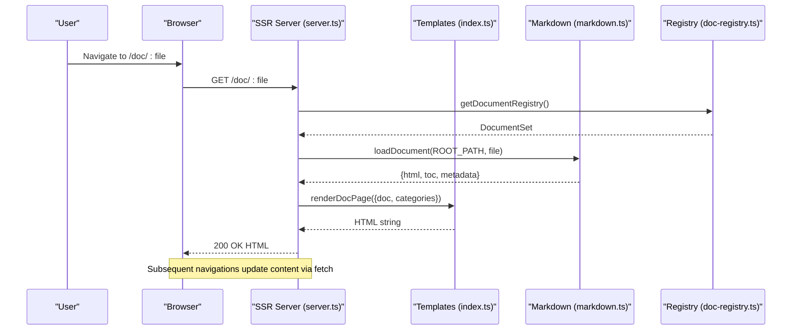
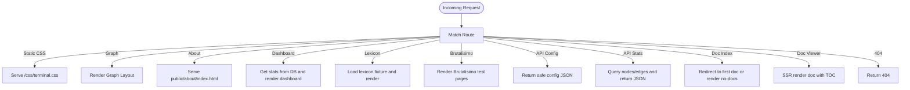
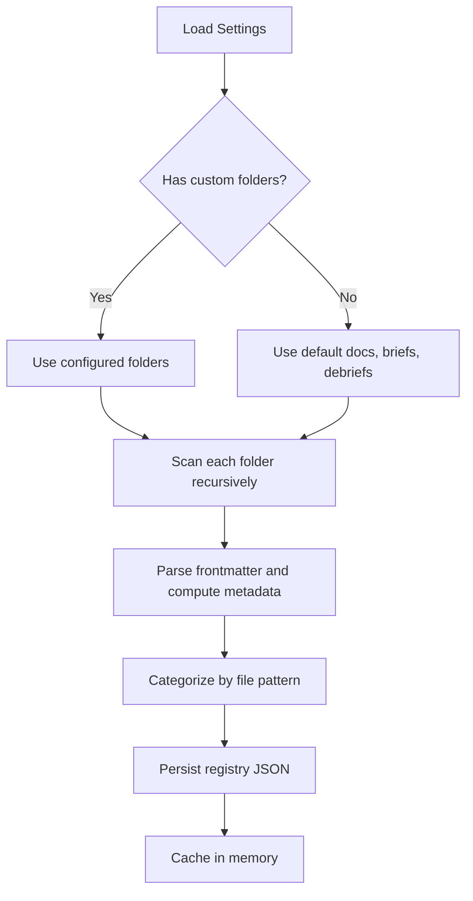
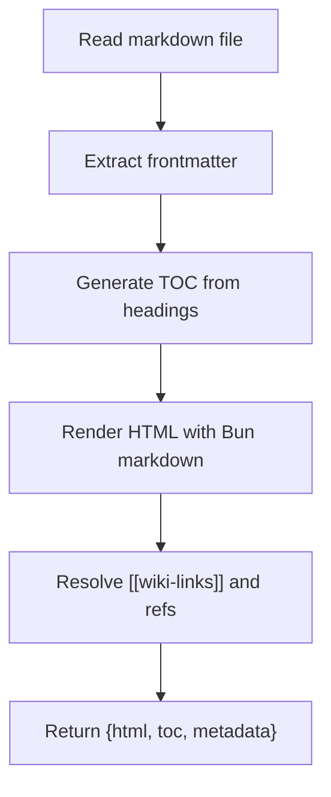
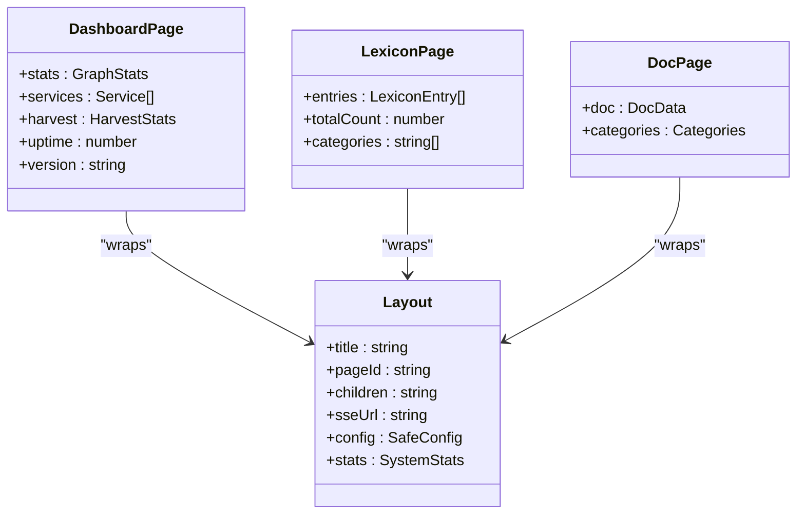
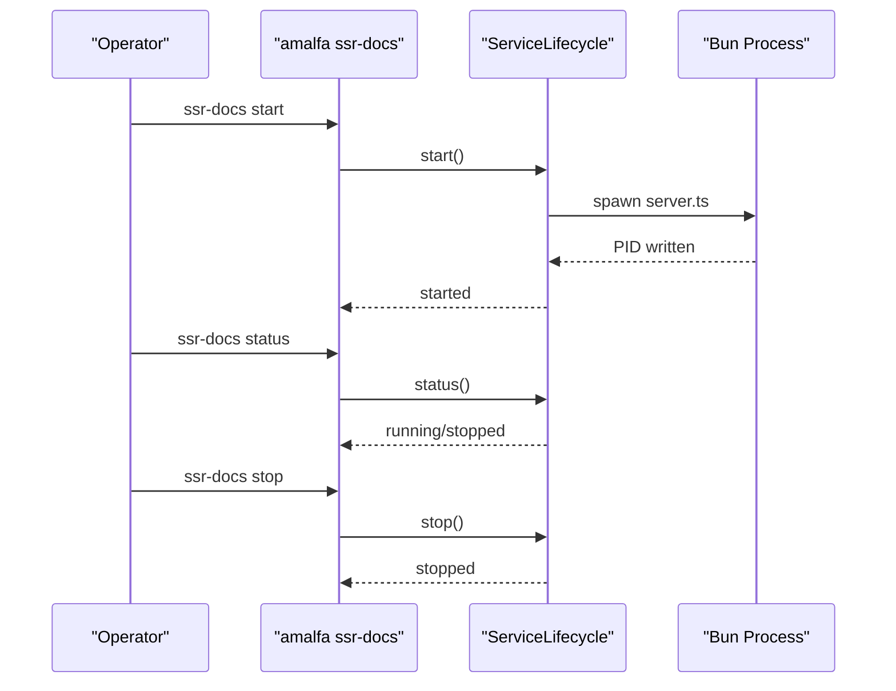
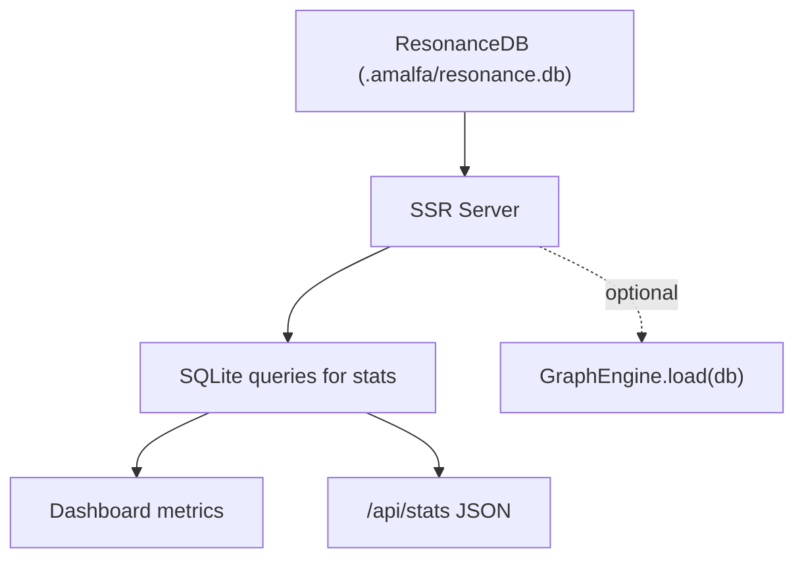
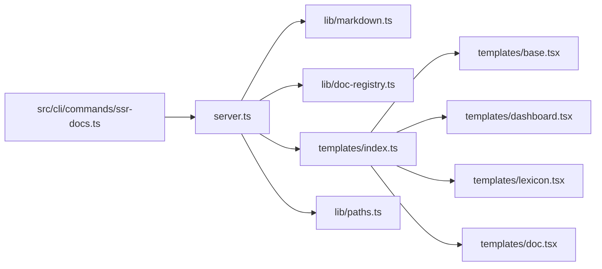

# SSR Documentation System

<cite>
**Referenced Files in This Document**
- [server.ts](file://website/ssr-docs/server.ts)
- [doc-registry.ts](file://website/ssr-docs/lib/doc-registry.ts)
- [markdown.ts](file://website/ssr-docs/lib/markdown.ts)
- [base.tsx](file://website/ssr-docs/templates/base.tsx)
- [index.ts](file://website/ssr-docs/templates/index.ts)
- [paths.ts](file://website/ssr-docs/lib/paths.ts)
- [dashboard.tsx](file://website/ssr-docs/templates/dashboard.tsx)
- [lexicon.tsx](file://website/ssr-docs/templates/lexicon.tsx)
- [doc.tsx](file://website/ssr-docs/templates/doc.tsx)
- [ssr-docs.ts](file://src/cli/commands/ssr-docs.ts)
- [DOM-MAP.md](file://website/DOM-MAP.md)
- [SSR-DOCS-SERVER.md](file://docs/SSR-DOCS-SERVER.md)
- [terminal.css](file://website/ssr-docs/public/terminal-style.css)
- [terminal.css](file://public/css/terminal.css)
- [GraphEngine.ts](file://src/core/GraphEngine.ts)
</cite>

## Table of Contents
1. [Introduction](#introduction)
2. [Project Structure](#project-structure)
3. [Core Components](#core-components)
4. [Architecture Overview](#architecture-overview)
5. [Detailed Component Analysis](#detailed-component-analysis)
6. [Dependency Analysis](#dependency-analysis)
7. [Performance Considerations](#performance-considerations)
8. [Troubleshooting Guide](#troubleshooting-guide)
9. [Conclusion](#conclusion)
10. [Appendices](#appendices)

## Introduction
This document describes Amalfa’s Server-Side Rendering (SSR) documentation system that powers the in-project documentation browser and integrates with the broader knowledge graph infrastructure. The system provides:
- Fast initial page loads via SSR
- A terminal-inspired, ANSI-themed UI
- A document registry for organizing knowledge base content
- A template system for consistent layouts
- Routing for dashboards, lexicon, and documentation
- Lightweight integration with the knowledge graph for live stats and search
- CLI-based service lifecycle management

It is designed to be extensible: you can customize themes, add new content types, and extend the server with additional routes and templates.

## Project Structure
The SSR documentation system lives under website/ssr-docs and is composed of:
- A Bun-based HTTP server with routing and static asset serving
- A document registry that scans configured folders and persists metadata
- A markdown parser that generates TOC and supports wiki-links
- A JSX-based template system for consistent layouts
- CLI integration for lifecycle management

```mermaid
graph TB
subgraph "SSR Docs Server"
S["server.ts"]
P["lib/paths.ts"]
MD["lib/markdown.ts"]
DR["lib/doc-registry.ts"]
TPL_IDX["templates/index.ts"]
TPL_BASE["templates/base.tsx"]
TPL_DASH["templates/dashboard.tsx"]
TPL_LEX["templates/lexicon.tsx"]
TPL_DOC["templates/doc.tsx"]
end
subgraph "CLI"
CLI["src/cli/commands/ssr-docs.ts"]
end
subgraph "Public Assets"
CSS1["website/ssr-docs/public/terminal-style.css"]
CSS2["public/css/terminal.css"]
end
subgraph "Knowledge Graph"
GE["src/core/GraphEngine.ts"]
end
S --> MD
S --> DR
S --> TPL_IDX
TPL_IDX --> TPL_BASE
TPL_IDX --> TPL_DASH
TPL_IDX --> TPL_LEX
TPL_IDX --> TPL_DOC
S --> P
S --> CSS1
S --> CSS2
CLI --> S
S -. reads .-> GE
```

**Diagram sources**
- [server.ts](file://website/ssr-docs/server.ts#L150-L341)
- [paths.ts](file://website/ssr-docs/lib/paths.ts#L1-L41)
- [markdown.ts](file://website/ssr-docs/lib/markdown.ts#L1-L287)
- [doc-registry.ts](file://website/ssr-docs/lib/doc-registry.ts#L1-L193)
- [index.ts](file://website/ssr-docs/templates/index.ts#L1-L142)
- [base.tsx](file://website/ssr-docs/templates/base.tsx#L1-L261)
- [dashboard.tsx](file://website/ssr-docs/templates/dashboard.tsx#L1-L116)
- [lexicon.tsx](file://website/ssr-docs/templates/lexicon.tsx#L1-L97)
- [doc.tsx](file://website/ssr-docs/templates/doc.tsx#L1-L83)
- [ssr-docs.ts](file://src/cli/commands/ssr-docs.ts#L1-L70)
- [terminal.css](file://website/ssr-docs/public/terminal-style.css#L164-L257)
- [terminal.css](file://public/css/terminal.css#L382-L724)
- [GraphEngine.ts](file://src/core/GraphEngine.ts#L42-L100)

**Section sources**
- [server.ts](file://website/ssr-docs/server.ts#L1-L385)
- [paths.ts](file://website/ssr-docs/lib/paths.ts#L1-L41)
- [SSR-DOCS-SERVER.md](file://docs/SSR-DOCS-SERVER.md#L1-L92)

## Core Components
- Server and routing: Central HTTP server with routes for dashboard, lexicon, documentation, and API endpoints. It injects configuration and stats into the base layout and serves static assets.
- Document registry: Scans configured folders, parses frontmatter, and categorizes documents. Maintains an in-memory cache and persists a registry file for reuse.
- Markdown processor: Parses markdown with Bun’s native renderer, builds a hierarchical TOC, and resolves wiki-links to internal references.
- Templates: JSX-based templates for dashboard, lexicon, and documentation pages, all wrapped in a shared base layout with accessibility landmarks and DataStar integration.
- CLI lifecycle: Manages the SSR docs server as a background service with start/stop/status/restart actions.

**Section sources**
- [server.ts](file://website/ssr-docs/server.ts#L150-L341)
- [doc-registry.ts](file://website/ssr-docs/lib/doc-registry.ts#L123-L193)
- [markdown.ts](file://website/ssr-docs/lib/markdown.ts#L57-L181)
- [index.ts](file://website/ssr-docs/templates/index.ts#L1-L142)
- [base.tsx](file://website/ssr-docs/templates/base.tsx#L36-L89)
- [ssr-docs.ts](file://src/cli/commands/ssr-docs.ts#L1-L70)

## Architecture Overview
The SSR system blends server-side rendering with lightweight client-side navigation:
- Initial load: SSR renders a complete HTML page with the base layout and requested content.
- Subsequent navigation: Client-side fetches JSON for content and updates the DOM without full reloads.
- URL sync: Back/forward buttons remain functional thanks to route handling and minimal client updates.



**Diagram sources**
- [server.ts](file://website/ssr-docs/server.ts#L300-L330)
- [index.ts](file://website/ssr-docs/templates/index.ts#L122-L132)
- [markdown.ts](file://website/ssr-docs/lib/markdown.ts#L155-L181)
- [doc-registry.ts](file://website/ssr-docs/lib/doc-registry.ts#L125-L135)

**Section sources**
- [server.ts](file://website/ssr-docs/server.ts#L150-L341)
- [SSR-DOCS-SERVER.md](file://docs/SSR-DOCS-SERVER.md#L51-L68)

## Detailed Component Analysis

### Server and Routing
- Routes:
  - Dashboards and pages: /, /dashboard, /lexicon, /graph, /about
  - Documentation: /doc, /doc/:file
  - API: /api/config, /api/stats, /api/stream
  - Static assets: /css/terminal.css, /css/tailwind.css, /favicon.ico
- Behavior:
  - Uses a base layout with injected configuration and stats.
  - Loads dashboard and lexicon data from the knowledge graph and fixtures.
  - Renders documentation with SSR and provides a fallback “no docs” page.
- CORS and headers: OPTIONS preflight handled; Access-Control-Allow-Origin set for APIs.



**Diagram sources**
- [server.ts](file://website/ssr-docs/server.ts#L154-L333)

**Section sources**
- [server.ts](file://website/ssr-docs/server.ts#L150-L341)
- [DOM-MAP.md](file://website/DOM-MAP.md#L204-L249)

### Document Registry System
- Scans configured folders recursively for markdown files.
- Parses frontmatter and computes metadata (title, date, tags, type, modified).
- Categorizes documents by type (index, playbooks, debriefs, briefs).
- Persists a registry to .amalfa/runtime/doc-registry.json and caches it in memory.
- Supports invalidation and refresh signaling.



**Diagram sources**
- [doc-registry.ts](file://website/ssr-docs/lib/doc-registry.ts#L137-L182)

**Section sources**
- [doc-registry.ts](file://website/ssr-docs/lib/doc-registry.ts#L1-L193)

### Markdown Processor and Wiki-Links
- Generates a hierarchical TOC from markdown headings with numbering.
- Uses Bun’s native markdown renderer for HTML output.
- Processes wiki-links and reference patterns to produce internal links.
- Loads references from a JSON fixture for link resolution.



**Diagram sources**
- [markdown.ts](file://website/ssr-docs/lib/markdown.ts#L57-L181)

**Section sources**
- [markdown.ts](file://website/ssr-docs/lib/markdown.ts#L1-L287)

### Template System and Layout
- Base layout provides:
  - Accessibility landmarks (header, main, footer)
  - DataStar initialization and configuration injection
  - Terminal-brutalist styling and optional SSE URL
- Dashboard, Lexicon, and Doc templates compose reusable components (widgets, rows, panels).
- The documentation template renders a two-sidebar layout with document navigation and TOC.



**Diagram sources**
- [base.tsx](file://website/ssr-docs/templates/base.tsx#L36-L89)
- [dashboard.tsx](file://website/ssr-docs/templates/dashboard.tsx#L32-L113)
- [lexicon.tsx](file://website/ssr-docs/templates/lexicon.tsx#L26-L94)
- [doc.tsx](file://website/ssr-docs/templates/doc.tsx#L45-L83)

**Section sources**
- [base.tsx](file://website/ssr-docs/templates/base.tsx#L1-L261)
- [dashboard.tsx](file://website/ssr-docs/templates/dashboard.tsx#L1-L116)
- [lexicon.tsx](file://website/ssr-docs/templates/lexicon.tsx#L1-L97)
- [doc.tsx](file://website/ssr-docs/templates/doc.tsx#L1-L83)

### CLI Integration and Lifecycle
- The SSR docs server is managed as a service with PID/log files.
- Commands: start, stop, status, restart.
- Uses a shared lifecycle utility to handle signals and cleanup.



**Diagram sources**
- [ssr-docs.ts](file://src/cli/commands/ssr-docs.ts#L1-L70)

**Section sources**
- [ssr-docs.ts](file://src/cli/commands/ssr-docs.ts#L1-L70)

### Knowledge Graph Integration
- The server reads from the knowledge graph database to populate dashboard metrics (node/edge counts, DB size).
- The GraphEngine demonstrates loading the graph from SQLite for broader system use.
- API endpoints expose stats and placeholders for search.



**Diagram sources**
- [server.ts](file://website/ssr-docs/server.ts#L281-L293)
- [dashboard.tsx](file://website/ssr-docs/templates/dashboard.tsx#L52-L94)
- [GraphEngine.ts](file://src/core/GraphEngine.ts#L50-L90)

**Section sources**
- [server.ts](file://website/ssr-docs/server.ts#L276-L293)
- [dashboard.tsx](file://website/ssr-docs/templates/dashboard.tsx#L52-L94)
- [GraphEngine.ts](file://src/core/GraphEngine.ts#L42-L100)

## Dependency Analysis
- Internal dependencies:
  - server.ts depends on lib/markdown.ts, lib/doc-registry.ts, templates/index.ts, and lib/paths.ts.
  - templates/index.ts depends on base.tsx and page templates (dashboard.tsx, lexicon.tsx, doc.tsx).
  - CLI command depends on ServiceLifecycle to manage the server process.
- External dependencies:
  - Bun’s native markdown renderer for HTML generation.
  - gray-matter for frontmatter parsing.
  - Bun SQLite for read-only queries to the knowledge graph.



**Diagram sources**
- [server.ts](file://website/ssr-docs/server.ts#L89-L94)
- [index.ts](file://website/ssr-docs/templates/index.ts#L8-L12)
- [ssr-docs.ts](file://src/cli/commands/ssr-docs.ts#L1-L13)

**Section sources**
- [server.ts](file://website/ssr-docs/server.ts#L89-L94)
- [index.ts](file://website/ssr-docs/templates/index.ts#L8-L12)
- [ssr-docs.ts](file://src/cli/commands/ssr-docs.ts#L1-L13)

## Performance Considerations
- SSR reduces time-to-content for initial visits.
- In-memory document registry avoids repeated filesystem scans.
- Static assets are served directly by the server for low overhead.
- SQLite read-only queries are efficient for small datasets.
- Recommendations:
  - Keep markdown files reasonably sized to minimize parsing overhead.
  - Monitor registry refresh frequency; changes trigger cache invalidation.
  - Consider lazy-loading heavy assets and deferring non-critical JavaScript.
  - Use CDN for static assets if serving externally.

[No sources needed since this section provides general guidance]

## Troubleshooting Guide
Common issues and resolutions:
- Server fails to start:
  - Verify project root detection and presence of marker files.
  - Check permissions for .amalfa directories.
- No documents displayed:
  - Confirm docs/ briefs/ debriefs/ folders exist and contain .md files.
  - Trigger registry refresh if content was added recently.
- 404 on /doc routes:
  - Ensure the requested file path exists relative to project root.
  - Check that the registry includes the file after refresh.
- Styling inconsistencies:
  - Confirm terminal.css is being served and overrides are applied in the correct order.
  - Validate theme variables and ensure CSS variables resolve as expected.
- API errors:
  - For /api/stats, verify the database path and read permissions.
  - For CORS issues, confirm Access-Control-Allow-Origin headers are present.

**Section sources**
- [paths.ts](file://website/ssr-docs/lib/paths.ts#L13-L38)
- [doc-registry.ts](file://website/ssr-docs/lib/doc-registry.ts#L123-L135)
- [server.ts](file://website/ssr-docs/server.ts#L276-L293)
- [terminal.css](file://website/ssr-docs/public/terminal-style.css#L164-L257)

## Conclusion
Amalfa’s SSR documentation system provides a fast, accessible, and extensible way to browse and integrate documentation with the knowledge graph. Its modular design—document registry, markdown processor, template system, and CLI lifecycle—enables straightforward customization and growth. By leveraging Bun’s native capabilities and a terminal-inspired theme, it balances performance and usability for developers and operators alike.

[No sources needed since this section summarizes without analyzing specific files]

## Appendices

### Customizing Themes
- Adjust colors and variables in the terminal CSS to align with your brand.
- Apply overrides in the correct load order to avoid specificity wars.
- Ensure prose and doc-specific selectors maintain readability and contrast.

**Section sources**
- [terminal.css](file://website/ssr-docs/public/terminal-style.css#L164-L257)
- [terminal.css](file://public/css/terminal.css#L382-L724)

### Adding New Content Types
- Extend categorization logic to recognize new patterns in filenames.
- Update templates to render the new content consistently.
- Add routes and handlers in the server for specialized pages if needed.

**Section sources**
- [doc-registry.ts](file://website/ssr-docs/lib/doc-registry.ts#L100-L106)
- [doc-registry.ts](file://website/ssr-docs/lib/doc-registry.ts#L231-L269)

### Extending the Documentation Server
- Add new routes in server.ts with appropriate SSR rendering or JSON responses.
- Integrate additional data sources (e.g., more fixtures or DB tables).
- Enhance templates with new widgets or layout components.

**Section sources**
- [server.ts](file://website/ssr-docs/server.ts#L154-L333)
- [index.ts](file://website/ssr-docs/templates/index.ts#L1-L142)

### Deployment Considerations
- Run via the CLI for standardized lifecycle management.
- Expose only necessary ports and secure endpoints in production.
- Use environment variables for configuration overrides (e.g., PORT).
- Persist registry and logs to appropriate locations in containerized environments.

**Section sources**
- [ssr-docs.ts](file://src/cli/commands/ssr-docs.ts#L1-L70)
- [server.ts](file://website/ssr-docs/server.ts#L96-L97)

### Relationship to the Knowledge Graph Engine
- The SSR server consumes the knowledge graph for dashboard metrics and search placeholders.
- The GraphEngine demonstrates how the broader system loads and manipulates the graph from SQLite.
- Together, they enable a cohesive experience: documentation browsing with contextual knowledge insights.

**Section sources**
- [server.ts](file://website/ssr-docs/server.ts#L281-L293)
- [GraphEngine.ts](file://src/core/GraphEngine.ts#L50-L90)