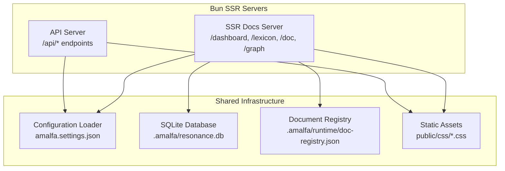
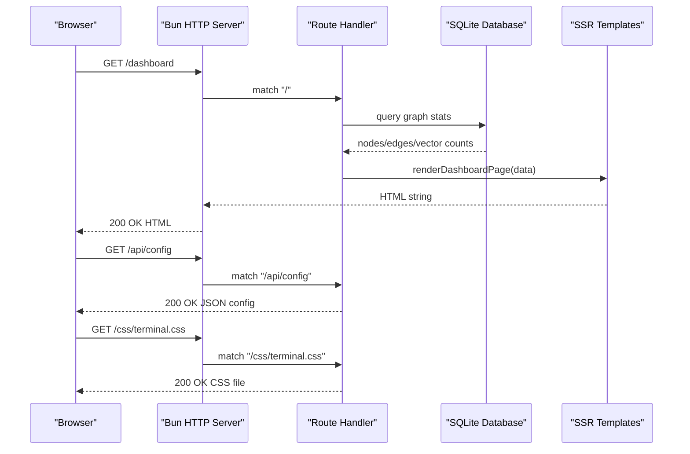
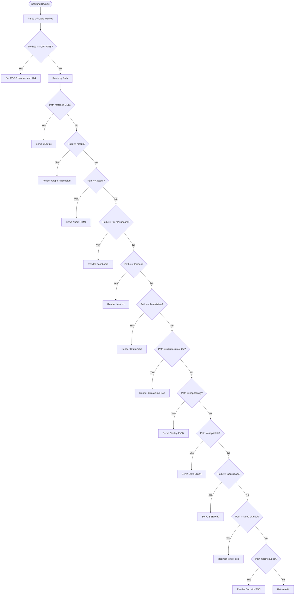
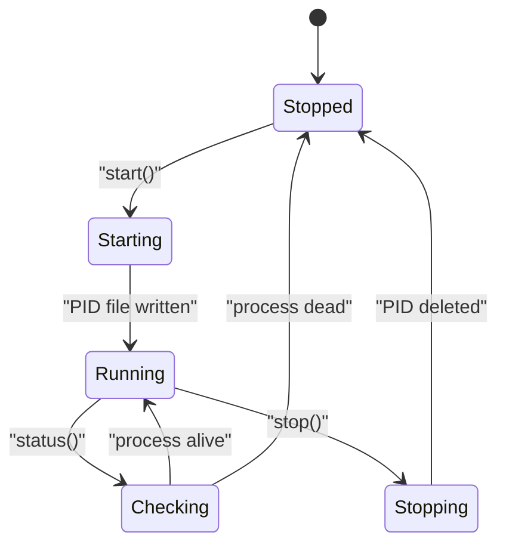
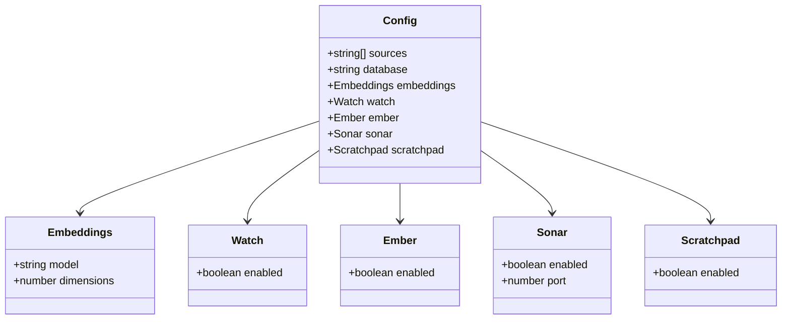
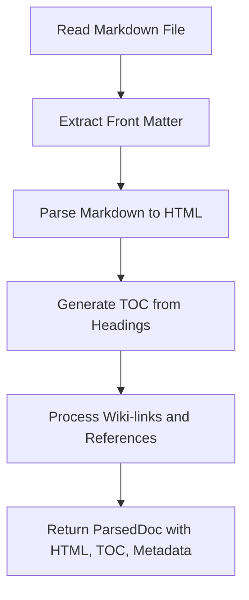
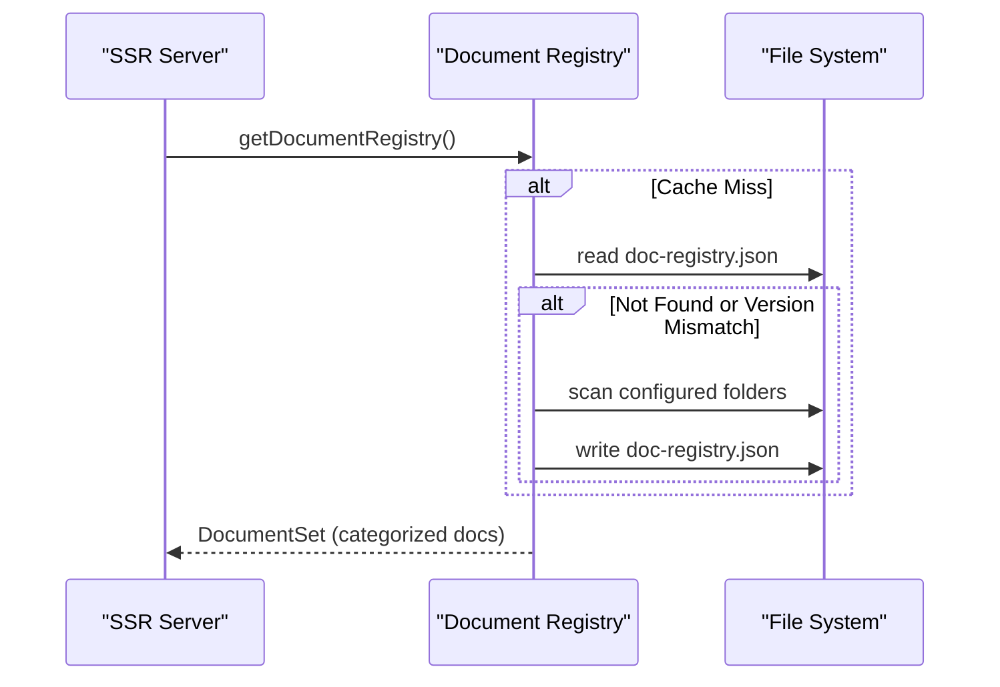
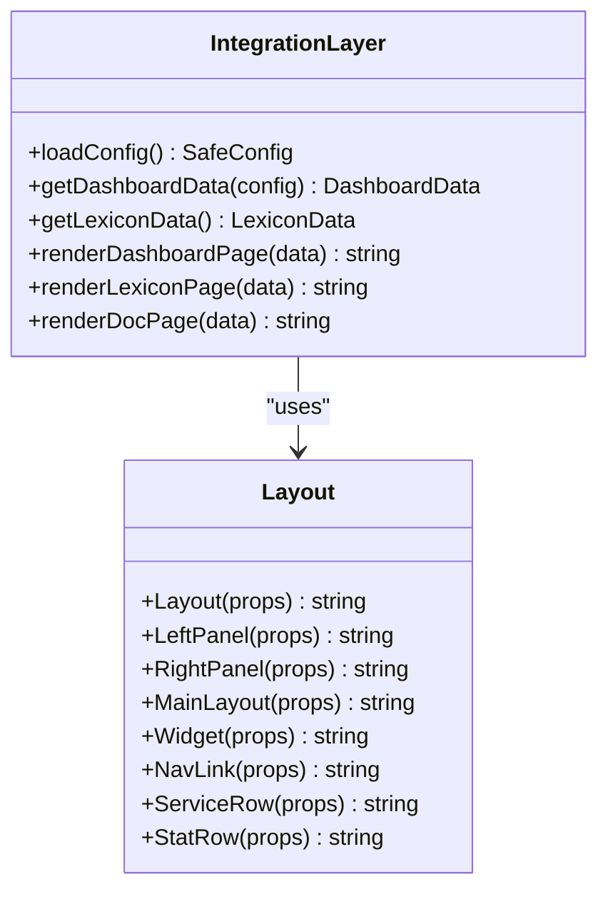
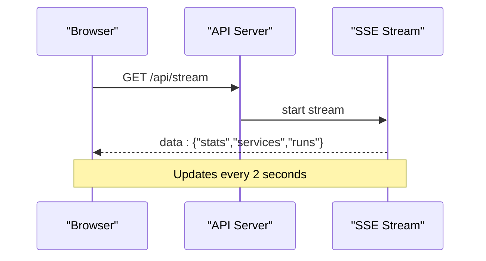
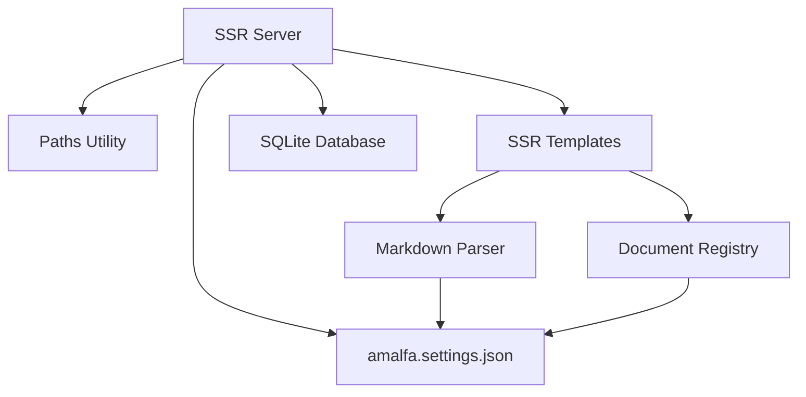

# SSR Server Architecture

<cite>
**Referenced Files in This Document**
- [server.ts](file://api/server.ts)
- [server.ts](file://website/ssr-docs/server.ts)
- [paths.ts](file://website/ssr-docs/lib/paths.ts)
- [markdown.ts](file://website/ssr-docs/lib/markdown.ts)
- [doc-registry.ts](file://website/ssr-docs/lib/doc-registry.ts)
- [index.ts](file://website/ssr-docs/templates/index.ts)
- [dashboard.tsx](file://website/ssr-docs/templates/dashboard.tsx)
- [lexicon.tsx](file://website/ssr-docs/templates/lexicon.tsx)
- [doc.tsx](file://website/ssr-docs/templates/doc.tsx)
- [base.tsx](file://website/ssr-docs/templates/base.tsx)
- [amalfa.settings.json](file://amalfa.settings.json)
- [server.pid](file://server.pid)
- [tsconfig.json](file://website/ssr-docs/tsconfig.json)
</cite>

## Table of Contents
1. [Introduction](#introduction)
2. [Project Structure](#project-structure)
3. [Core Components](#core-components)
4. [Architecture Overview](#architecture-overview)
5. [Detailed Component Analysis](#detailed-component-analysis)
6. [Dependency Analysis](#dependency-analysis)
7. [Performance Considerations](#performance-considerations)
8. [Troubleshooting Guide](#troubleshooting-guide)
9. [Conclusion](#conclusion)

## Introduction
This document explains Amalfa's SSR (Server-Side Rendering) server architecture built on Bun. It covers the Bun-based server implementation, lifecycle management, PID file handling, configuration loading, routing system for dashboards, lexicon, documentation viewer, and API endpoints, static asset serving for CSS, CORS configuration, startup process, error handling, graceful shutdown mechanisms, and extension patterns. It also details integration with the knowledge graph database for dynamic content generation and performance considerations for SSR rendering.

## Project Structure
The SSR server is implemented in two primary modules:
- API server: Provides real-time updates via Server-Sent Events and serves dashboard fragments and JSON APIs.
- SSR documentation server: Renders pages for dashboard, lexicon, documentation, and provides configuration and stats endpoints backed by a SQLite database and a persisted document registry.

**Diagram sources**
- [server.ts](file://api/server.ts#L1-L248)
- [server.ts](file://website/ssr-docs/server.ts#L1-L385)
- [amalfa.settings.json](file://amalfa.settings.json#L1-L96)

**Section sources**
- [server.ts](file://api/server.ts#L1-L248)
- [server.ts](file://website/ssr-docs/server.ts#L1-L385)
- [amalfa.settings.json](file://amalfa.settings.json#L1-L96)

## Core Components
- Bun-based HTTP server with custom routing and middleware-like handlers
- Lifecycle manager for PID file creation, status checks, and graceful termination
- Configuration loader that merges defaults with project settings
- Markdown parser and TOC generator for documentation rendering
- Document registry caching and invalidation for efficient browsing
- SSR template integration layer connecting server logic to JSX templates
- SQLite-backed stats and graph data retrieval for dashboard

Key implementation references:
- Lifecycle management and PID handling: [server.ts](file://website/ssr-docs/server.ts#L60-L85)
- Configuration loading: [server.ts](file://website/ssr-docs/server.ts#L46-L58), [index.ts](file://website/ssr-docs/templates/index.ts#L30-L50)
- Markdown parsing and TOC: [markdown.ts](file://website/ssr-docs/lib/markdown.ts#L60-L118)
- Document registry: [doc-registry.ts](file://website/ssr-docs/lib/doc-registry.ts#L125-L182)
- SSR templates: [dashboard.tsx](file://website/ssr-docs/templates/dashboard.tsx#L32-L113), [lexicon.tsx](file://website/ssr-docs/templates/lexicon.tsx#L26-L94), [doc.tsx](file://website/ssr-docs/templates/doc.tsx#L45-L112), [base.tsx](file://website/ssr-docs/templates/base.tsx#L36-L89)

**Section sources**
- [server.ts](file://website/ssr-docs/server.ts#L60-L85)
- [index.ts](file://website/ssr-docs/templates/index.ts#L30-L50)
- [markdown.ts](file://website/ssr-docs/lib/markdown.ts#L60-L118)
- [doc-registry.ts](file://website/ssr-docs/lib/doc-registry.ts#L125-L182)
- [dashboard.tsx](file://website/ssr-docs/templates/dashboard.tsx#L32-L113)
- [lexicon.tsx](file://website/ssr-docs/templates/lexicon.tsx#L26-L94)
- [doc.tsx](file://website/ssr-docs/templates/doc.tsx#L45-L112)
- [base.tsx](file://website/ssr-docs/templates/base.tsx#L36-L89)

## Architecture Overview
The SSR architecture consists of:
- A Bun HTTP server with a central fetch handler that routes requests to dedicated logic
- A lifecycle manager that writes and validates PID files for process supervision
- A configuration loader that reads project settings and exposes safe defaults
- Markdown and registry utilities for dynamic documentation rendering
- SSR templates that render HTML with injected configuration and stats
- SQLite database access for graph statistics and vector counts

**Diagram sources**
- [server.ts](file://website/ssr-docs/server.ts#L154-L341)
- [index.ts](file://website/ssr-docs/templates/index.ts#L52-L95)
- [base.tsx](file://website/ssr-docs/templates/base.tsx#L36-L89)

**Section sources**
- [server.ts](file://website/ssr-docs/server.ts#L154-L341)
- [index.ts](file://website/ssr-docs/templates/index.ts#L52-L95)
- [base.tsx](file://website/ssr-docs/templates/base.tsx#L36-L89)

## Detailed Component Analysis

### Bun-based HTTP Server and Routing
- The SSR server uses Bun's serve with a fetch handler to route requests by path.
- Routes include:
  - Dashboard: renders the main dashboard page with stats and service status
  - Lexicon: renders the entity browser page
  - Documentation: renders the documentation viewer with categories and TOC
  - Graph: renders a placeholder for knowledge graph visualization
  - About: serves a static HTML file
  - API endpoints: config, stats, stream, and doc index redirection
  - Static CSS: serves terminal.css and tailwind.css from public/css
  - CORS: sets Access-Control-Allow-Origin for OPTIONS and GET requests

**Diagram sources**
- [server.ts](file://website/ssr-docs/server.ts#L154-L341)

**Section sources**
- [server.ts](file://website/ssr-docs/server.ts#L154-L341)

### Lifecycle Management and PID File Handling
- The lifecycle manager ensures single-instance operation by checking and writing a PID file.
- It supports start, status, and stop operations:
  - Start: creates PID file if none exists
  - Status: checks if process is alive using kill(pid, 0)
  - Stop: kills the process and removes the PID file

**Diagram sources**
- [server.ts](file://website/ssr-docs/server.ts#L60-L85)

**Section sources**
- [server.ts](file://website/ssr-docs/server.ts#L60-L85)

### Configuration Loading System
- Configuration is loaded from project settings and merged with defaults.
- The server exposes:
  - Sources directories
  - Database path
  - Embedding model and dimensions
  - Feature flags (watch, ember, sonar, scratchpad)
- The API server demonstrates a similar pattern for stats, services, and runs data.

**Diagram sources**
- [server.ts](file://website/ssr-docs/server.ts#L36-L56)
- [index.ts](file://website/ssr-docs/templates/index.ts#L20-L28)

**Section sources**
- [server.ts](file://website/ssr-docs/server.ts#L36-L56)
- [index.ts](file://website/ssr-docs/templates/index.ts#L20-L28)

### Markdown Parsing and Documentation Rendering
- Markdown is parsed using Bun's native markdown API with TOC generation.
- Wiki-links and references are processed to create internal links.
- The registry scans configured folders and categorizes documents for navigation.

**Diagram sources**
- [markdown.ts](file://website/ssr-docs/lib/markdown.ts#L155-L181)
- [markdown.ts](file://website/ssr-docs/lib/markdown.ts#L60-L118)

**Section sources**
- [markdown.ts](file://website/ssr-docs/lib/markdown.ts#L155-L181)
- [markdown.ts](file://website/ssr-docs/lib/markdown.ts#L60-L118)

### Document Registry and Caching
- The registry persists a categorized list of documents to a JSON file.
- Cache invalidation occurs when file watchers signal changes.
- The server loads settings from project configuration to determine document folders.

**Diagram sources**
- [doc-registry.ts](file://website/ssr-docs/lib/doc-registry.ts#L125-L182)

**Section sources**
- [doc-registry.ts](file://website/ssr-docs/lib/doc-registry.ts#L125-L182)

### SSR Template Integration Layer
- Templates are implemented in JSX and rendered to HTML strings.
- The integration layer loads configuration, queries the database for stats, and renders pages.
- Layout components provide shared structure, navigation, and styling.

**Diagram sources**
- [index.ts](file://website/ssr-docs/templates/index.ts#L30-L142)
- [base.tsx](file://website/ssr-docs/templates/base.tsx#L36-L261)

**Section sources**
- [index.ts](file://website/ssr-docs/templates/index.ts#L30-L142)
- [base.tsx](file://website/ssr-docs/templates/base.tsx#L36-L261)

### API Server (SSE and Fragments)
- Provides real-time updates via Server-Sent Events for dashboard metrics.
- Serves JSON endpoints for stats, services, and runs logs.
- Serves HTML fragments for HTMX-style partial updates.
- Includes a fallback static file server for public assets.

**Diagram sources**
- [server.ts](file://api/server.ts#L127-L178)

**Section sources**
- [server.ts](file://api/server.ts#L127-L178)

### Static Asset Serving and CORS
- CSS files are served directly from the public/css directory with appropriate content-type headers.
- CORS is configured globally with Access-Control-Allow-Origin set to "*" for both OPTIONS and GET requests.

**Section sources**
- [server.ts](file://website/ssr-docs/server.ts#L166-L177)
- [server.ts](file://website/ssr-docs/server.ts#L161-L163)

### Startup Process and Graceful Shutdown
- The server starts by ensuring required directories exist, loading configuration, and initializing the lifecycle manager.
- It listens on the configured port and logs available endpoints.
- Graceful shutdown is handled by the lifecycle manager's stop method, which terminates the process and cleans up the PID file.

**Section sources**
- [server.ts](file://website/ssr-docs/server.ts#L29-L35)
- [server.ts](file://website/ssr-docs/server.ts#L154-L341)
- [server.ts](file://website/ssr-docs/server.ts#L78-L84)

### Extending the Routing System and Adding New Endpoints
To extend the routing system:
- Add a new route condition in the fetch handler with a unique path pattern.
- Implement the handler logic (database queries, file reads, template rendering).
- Return a Response with appropriate headers and status codes.
- Example patterns:
  - API endpoint: return JSON with Content-Type: application/json
  - Static asset: return Bun.file with appropriate Content-Type
  - SSR page: render JSX template and return HTML with Content-Type: text/html

**Section sources**
- [server.ts](file://website/ssr-docs/server.ts#L154-L341)

### Customizing Server Behavior
Customization points include:
- Configuration overrides in amalfa.settings.json for sources, database, embeddings, and feature flags
- Template customization in the templates directory for layout and page rendering
- Path resolution utilities for robust asset and registry access

**Section sources**
- [amalfa.settings.json](file://amalfa.settings.json#L1-L96)
- [paths.ts](file://website/ssr-docs/lib/paths.ts#L13-L38)
- [base.tsx](file://website/ssr-docs/templates/base.tsx#L36-L89)

## Dependency Analysis
The SSR server components depend on:
- Bun runtime for HTTP server, filesystem, and SQLite
- Project settings for configuration
- Markdown and registry utilities for content generation
- Template layer for SSR rendering

**Diagram sources**
- [server.ts](file://website/ssr-docs/server.ts#L1-L385)
- [paths.ts](file://website/ssr-docs/lib/paths.ts#L1-L41)
- [markdown.ts](file://website/ssr-docs/lib/markdown.ts#L1-L287)
- [doc-registry.ts](file://website/ssr-docs/lib/doc-registry.ts#L1-L193)
- [index.ts](file://website/ssr-docs/templates/index.ts#L1-L142)
- [amalfa.settings.json](file://amalfa.settings.json#L1-L96)

**Section sources**
- [server.ts](file://website/ssr-docs/server.ts#L1-L385)
- [paths.ts](file://website/ssr-docs/lib/paths.ts#L1-L41)
- [markdown.ts](file://website/ssr-docs/lib/markdown.ts#L1-L287)
- [doc-registry.ts](file://website/ssr-docs/lib/doc-registry.ts#L1-L193)
- [index.ts](file://website/ssr-docs/templates/index.ts#L1-L142)
- [amalfa.settings.json](file://amalfa.settings.json#L1-L96)

## Performance Considerations
- Use the persisted document registry to avoid scanning directories on every request.
- Cache database queries for stats and vector counts; invalidate cache on registry changes.
- Minimize synchronous filesystem operations in hot paths; defer heavy computations to background tasks.
- Serve static CSS files directly via Bun.file to reduce overhead.
- Keep SSR templates concise and avoid unnecessary DOM manipulation; leverage streaming where possible.
- Monitor SQLite connection usage; consider connection pooling for high concurrency scenarios.

## Troubleshooting Guide
Common issues and resolutions:
- PID file conflicts: Verify the PID file location and ensure no stale processes are running
  - Check PID file existence and process status
  - Remove stale PID file if process is not running
- Configuration errors: Validate amalfa.settings.json syntax and paths
  - Ensure database path exists and is readable
  - Confirm embedding model settings align with installed resources
- Document registry cache issues: Invalidate cache and regenerate registry
  - Call invalidateCache() and refreshRegistry() when content changes
- CORS problems: Ensure Access-Control-Allow-Origin is set for both OPTIONS and GET
- Static asset 404: Verify public/css paths and file names
- SSE not updating: Confirm stream endpoint and client-side event handling

**Section sources**
- [server.ts](file://website/ssr-docs/server.ts#L60-L85)
- [server.ts](file://website/ssr-docs/server.ts#L161-L177)
- [doc-registry.ts](file://website/ssr-docs/lib/doc-registry.ts#L184-L190)

## Conclusion
Amalfa's SSR server leverages Bun's high-performance runtime to deliver responsive, dynamic web experiences. The architecture balances simplicity with extensibility, enabling straightforward routing, robust configuration management, efficient document rendering, and scalable SSR templates. By following the outlined patterns and best practices, developers can extend the server with new endpoints, customize behavior, and maintain optimal performance for SSR rendering and real-time updates.