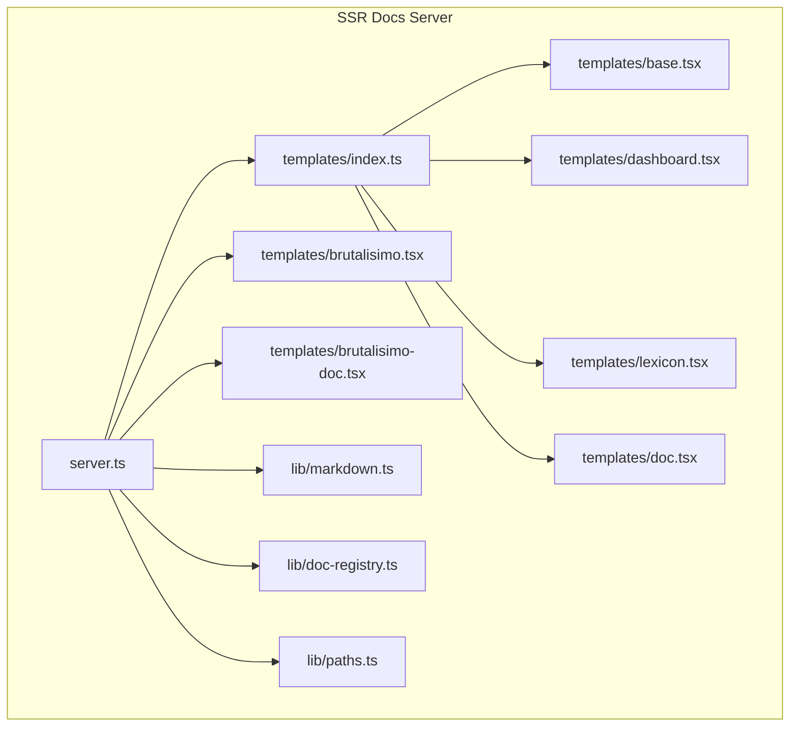
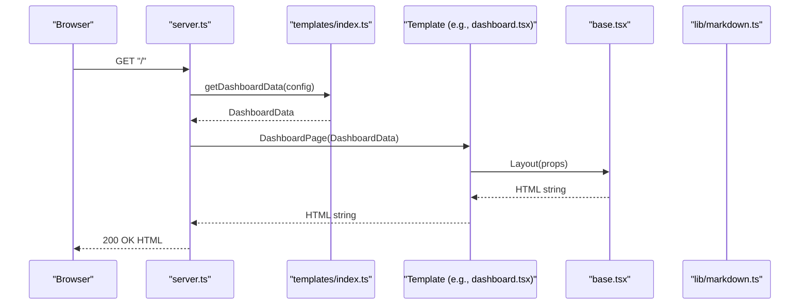
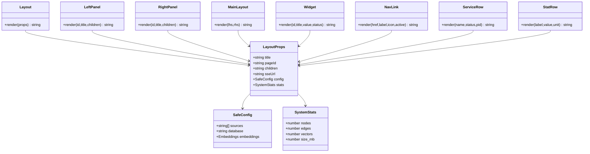
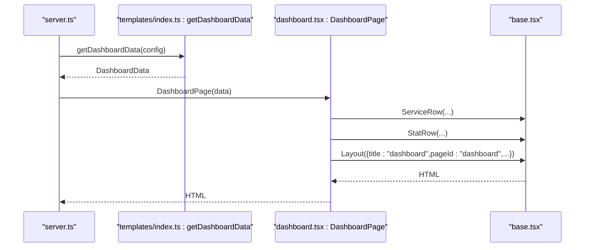
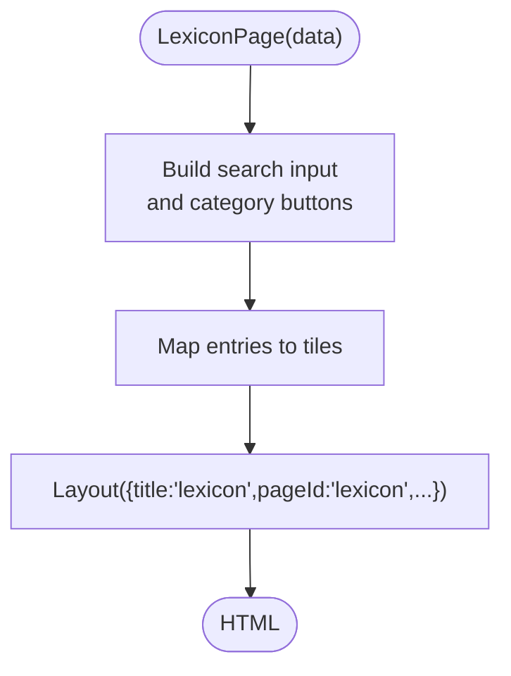
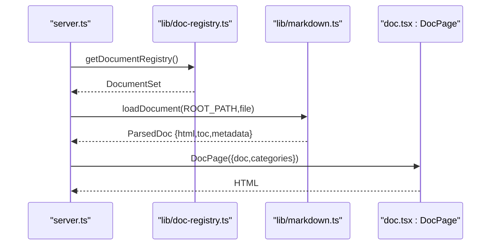
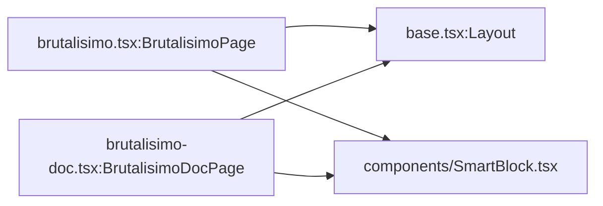
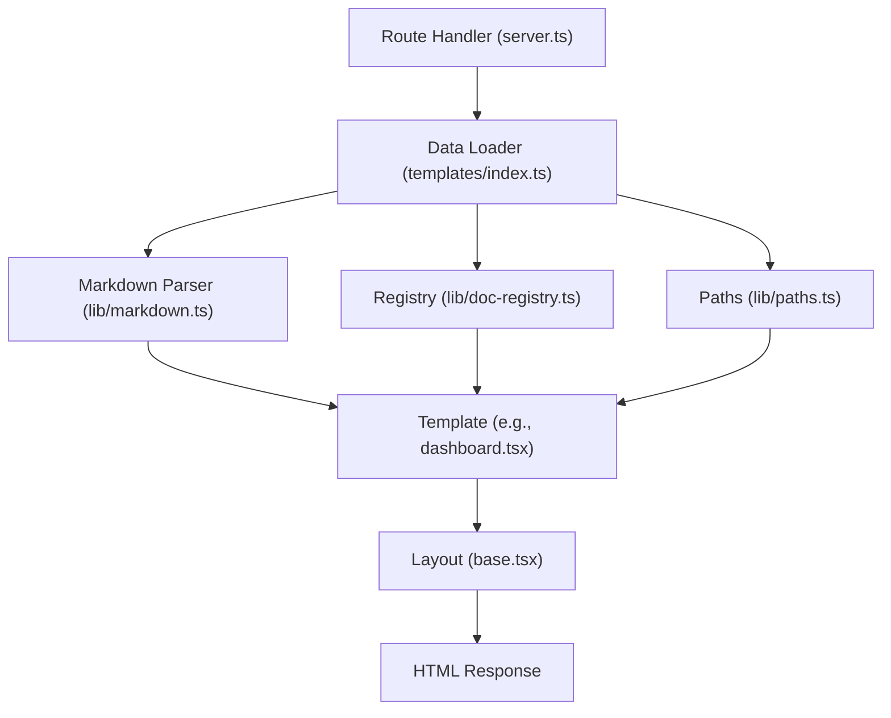
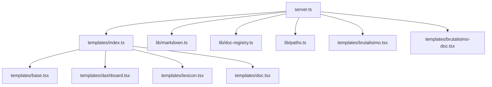

# Template System

<cite>
**Referenced Files in This Document**
- [README.md](file://website/ssr-docs/README.md)
- [TEMPLATES.md](file://website/ssr-docs/TEMPLATES.md)
- [server.ts](file://website/ssr-docs/server.ts)
- [base.tsx](file://website/ssr-docs/templates/base.tsx)
- [dashboard.tsx](file://website/ssr-docs/templates/dashboard.tsx)
- [lexicon.tsx](file://website/ssr-docs/templates/lexicon.tsx)
- [doc.tsx](file://website/ssr-docs/templates/doc.tsx)
- [brutalisimo.tsx](file://website/ssr-docs/templates/brutalisimo.tsx)
- [brutalisimo-doc.tsx](file://website/ssr-docs/templates/brutalisimo-doc.tsx)
- [index.ts](file://website/ssr-docs/templates/index.ts)
- [markdown.ts](file://website/ssr-docs/lib/markdown.ts)
- [doc-registry.ts](file://website/ssr-docs/lib/doc-registry.ts)
- [paths.ts](file://website/ssr-docs/lib/paths.ts)
</cite>

## Table of Contents
1. [Introduction](#introduction)
2. [Project Structure](#project-structure)
3. [Core Components](#core-components)
4. [Architecture Overview](#architecture-overview)
5. [Detailed Component Analysis](#detailed-component-analysis)
6. [Dependency Analysis](#dependency-analysis)
7. [Performance Considerations](#performance-considerations)
8. [Troubleshooting Guide](#troubleshooting-guide)
9. [Conclusion](#conclusion)
10. [Appendices](#appendices)

## Introduction
This document explains Amalfa’s SSR template system used to render documentation and dashboards. It covers the JSX-based template architecture, the base layout system, specialized templates for different content types, template composition patterns, prop interfaces, data binding mechanisms, Brutalisimo design system integration, dynamic content generation, inheritance hierarchy, shared components, styling approaches, and the rendering pipeline from data to HTML output. It also includes practical guidance for creating custom templates, extending existing ones, integrating new UI components, and optimizing template processing performance.

## Project Structure
The SSR documentation server organizes rendering logic under website/ssr-docs with a clear separation between server orchestration, templates, and shared libraries:
- Server: website/ssr-docs/server.ts
- Templates: website/ssr-docs/templates/*.tsx
- Libraries: website/ssr-docs/lib/*.ts
- Public assets: website/ssr-docs/public/*

**Diagram sources**
- [server.ts](file://website/ssr-docs/server.ts#L150-L341)
- [index.ts](file://website/ssr-docs/templates/index.ts#L1-L142)
- [base.tsx](file://website/ssr-docs/templates/base.tsx#L1-L261)
- [dashboard.tsx](file://website/ssr-docs/templates/dashboard.tsx#L1-L116)
- [lexicon.tsx](file://website/ssr-docs/templates/lexicon.tsx#L1-L97)
- [doc.tsx](file://website/ssr-docs/templates/doc.tsx#L1-L115)
- [brutalisimo.tsx](file://website/ssr-docs/templates/brutalisimo.tsx#L1-L60)
- [brutalisimo-doc.tsx](file://website/ssr-docs/templates/brutalisimo-doc.tsx#L1-L112)
- [markdown.ts](file://website/ssr-docs/lib/markdown.ts#L1-L287)
- [doc-registry.ts](file://website/ssr-docs/lib/doc-registry.ts#L1-L193)
- [paths.ts](file://website/ssr-docs/lib/paths.ts#L1-L41)

**Section sources**
- [README.md](file://website/ssr-docs/README.md#L1-L119)
- [TEMPLATES.md](file://website/ssr-docs/TEMPLATES.md#L1-L107)

## Core Components
- Base layout and shared components: Provide reusable HTML scaffolding, panels, widgets, and accessibility landmarks.
- Specialized templates: Dashboard, Lexicon, Doc, Brutalisimo, and Brutalisimo Doc Browser.
- Integration layer: Connects server routes to templates and data loaders.
- Markdown and registry utilities: Parse markdown, generate TOC, and manage document catalogs.

Key responsibilities:
- Base layout: Injects terminal-brutalist styling, DataStar bootstrapping, and ARIA landmarks.
- Dashboard: Renders system stats, service status, and logs with SSE hydration.
- Lexicon: Renders entity tiles with search and filter controls.
- Doc: Renders a three-pane layout with document list, TOC, and content.
- Brutalisimo variants: Demonstrate layout and content composition patterns.

**Section sources**
- [base.tsx](file://website/ssr-docs/templates/base.tsx#L11-L261)
- [dashboard.tsx](file://website/ssr-docs/templates/dashboard.tsx#L10-L116)
- [lexicon.tsx](file://website/ssr-docs/templates/lexicon.tsx#L10-L97)
- [doc.tsx](file://website/ssr-docs/templates/doc.tsx#L13-L115)
- [brutalisimo.tsx](file://website/ssr-docs/templates/brutalisimo.tsx#L10-L60)
- [brutalisimo-doc.tsx](file://website/ssr-docs/templates/brutalisimo-doc.tsx#L10-L112)
- [index.ts](file://website/ssr-docs/templates/index.ts#L20-L142)

## Architecture Overview
The SSR pipeline uses Bun + Hono’s JSX support to render HTML server-side. The server orchestrates routes, loads data via dedicated loaders, and passes typed props to templates. Templates compose shared components from base.tsx and render final HTML strings.

**Diagram sources**
- [server.ts](file://website/ssr-docs/server.ts#L212-L220)
- [index.ts](file://website/ssr-docs/templates/index.ts#L52-L95)
- [dashboard.tsx](file://website/ssr-docs/templates/dashboard.tsx#L32-L113)
- [base.tsx](file://website/ssr-docs/templates/base.tsx#L36-L89)
- [markdown.ts](file://website/ssr-docs/lib/markdown.ts#L60-L118)

## Detailed Component Analysis

### Base Layout System
The base layout defines the shared HTML shell and reusable components:
- Layout: Sets up head, body, header, main, footer, and DataStar bootstrapping. Accepts optional SSE URL, config, and stats.
- Panels: LeftPanel, RightPanel, MainLayout for composing side-by-side layouts.
- Widgets: Widget, NavLink, ServiceRow, StatRow for dashboard content.
- Props: Strongly typed LayoutProps, SafeConfig, SystemStats.

**Diagram sources**
- [base.tsx](file://website/ssr-docs/templates/base.tsx#L11-L261)

**Section sources**
- [base.tsx](file://website/ssr-docs/templates/base.tsx#L11-L261)

### Dashboard Template
The dashboard template renders system metrics, service status, and logs. It composes ServiceRow and StatRow components from base.tsx and wraps everything in Layout.

**Diagram sources**
- [server.ts](file://website/ssr-docs/server.ts#L212-L220)
- [index.ts](file://website/ssr-docs/templates/index.ts#L52-L95)
- [dashboard.tsx](file://website/ssr-docs/templates/dashboard.tsx#L32-L113)
- [base.tsx](file://website/ssr-docs/templates/base.tsx#L159-L261)

**Section sources**
- [dashboard.tsx](file://website/ssr-docs/templates/dashboard.tsx#L10-L116)
- [base.tsx](file://website/ssr-docs/templates/base.tsx#L159-L261)
- [index.ts](file://website/ssr-docs/templates/index.ts#L52-L95)

### Lexicon Template
The lexicon template renders a grid of entity tiles with search and category filters. It uses Layout and constructs controls and entries from provided data.

**Diagram sources**
- [lexicon.tsx](file://website/ssr-docs/templates/lexicon.tsx#L26-L94)

**Section sources**
- [lexicon.tsx](file://website/ssr-docs/templates/lexicon.tsx#L10-L97)

### Doc Template
The Doc template renders a three-pane layout: document list, TOC, and content. It uses markdown.ts to generate TOC and composes navigation lists from doc-registry.ts categories.

**Diagram sources**
- [server.ts](file://website/ssr-docs/server.ts#L300-L330)
- [doc-registry.ts](file://website/ssr-docs/lib/doc-registry.ts#L125-L182)
- [markdown.ts](file://website/ssr-docs/lib/markdown.ts#L155-L181)
- [doc.tsx](file://website/ssr-docs/templates/doc.tsx#L45-L112)

**Section sources**
- [doc.tsx](file://website/ssr-docs/templates/doc.tsx#L13-L115)
- [markdown.ts](file://website/ssr-docs/lib/markdown.ts#L11-L181)
- [doc-registry.ts](file://website/ssr-docs/lib/doc-registry.ts#L125-L182)

### Brutalisimo Design System Integration
Two Brutalisimo templates demonstrate layout and content patterns:
- BrutalisimoPage: Grid of SmartBlock components with independent scrolling sidebars.
- BrutalisimoDocPage: Three-column layout with document list, TOC, and content, using SmartBlock for long-form content.

Both templates import Layout from base.tsx and SmartBlock from components/ to showcase terminal-brutalist styling and responsive grids.

**Diagram sources**
- [brutalisimo.tsx](file://website/ssr-docs/templates/brutalisimo.tsx#L18-L57)
- [brutalisimo-doc.tsx](file://website/ssr-docs/templates/brutalisimo-doc.tsx#L28-L109)
- [base.tsx](file://website/ssr-docs/templates/base.tsx#L36-L89)

**Section sources**
- [brutalisimo.tsx](file://website/ssr-docs/templates/brutalisimo.tsx#L1-L60)
- [brutalisimo-doc.tsx](file://website/ssr-docs/templates/brutalisimo-doc.tsx#L1-L112)

### Template Composition Patterns and Prop Interfaces
- Composition: Templates import Layout and smaller components from base.tsx to build pages.
- Prop interfaces: Each template defines a data interface (e.g., DashboardData, LexiconData, DocPageData) that mirrors the shape of data passed from loaders or server handlers.
- Data binding: Props are interpolated into HTML strings; Layout injects config and stats via window globals for client hydration.

Examples of prop interfaces:
- DashboardData: stats, services, harvest, uptime, version
- LexiconData: entries, totalCount, categories
- DocPageData: doc (title, content, toc, metadata), categories

**Section sources**
- [dashboard.tsx](file://website/ssr-docs/templates/dashboard.tsx#L10-L30)
- [lexicon.tsx](file://website/ssr-docs/templates/lexicon.tsx#L20-L24)
- [doc.tsx](file://website/ssr-docs/templates/doc.tsx#L20-L28)
- [base.tsx](file://website/ssr-docs/templates/base.tsx#L11-L34)

### Rendering Pipeline: From Data to HTML
The pipeline follows a predictable flow:
1. Server route handler resolves the request path.
2. Data loaders (index.ts) fetch or compute data (dashboard stats, lexicon entries, parsed markdown).
3. Templates receive typed data and render HTML strings using base.tsx components.
4. Server responds with HTML (or JSON for APIs).

**Diagram sources**
- [server.ts](file://website/ssr-docs/server.ts#L212-L330)
- [index.ts](file://website/ssr-docs/templates/index.ts#L52-L141)
- [markdown.ts](file://website/ssr-docs/lib/markdown.ts#L155-L181)
- [doc-registry.ts](file://website/ssr-docs/lib/doc-registry.ts#L125-L182)
- [paths.ts](file://website/ssr-docs/lib/paths.ts#L31-L38)
- [base.tsx](file://website/ssr-docs/templates/base.tsx#L36-L89)

## Dependency Analysis
- Server depends on:
  - templates/index.ts for data loading and rendering
  - lib/markdown.ts for parsing and TOC generation
  - lib/doc-registry.ts for document catalog
  - lib/paths.ts for project root resolution
- Templates depend on:
  - base.tsx for shared layout and components
  - external assets (CSS) served statically

**Diagram sources**
- [server.ts](file://website/ssr-docs/server.ts#L90-L98)
- [index.ts](file://website/ssr-docs/templates/index.ts#L8-L12)
- [base.tsx](file://website/ssr-docs/templates/base.tsx#L1-L261)
- [dashboard.tsx](file://website/ssr-docs/templates/dashboard.tsx#L8-L30)
- [lexicon.tsx](file://website/ssr-docs/templates/lexicon.tsx#L8-L24)
- [doc.tsx](file://website/ssr-docs/templates/doc.tsx#L10-L28)
- [brutalisimo.tsx](file://website/ssr-docs/templates/brutalisimo.tsx#L7-L16)
- [brutalisimo-doc.tsx](file://website/ssr-docs/templates/brutalisimo-doc.tsx#L7-L26)

**Section sources**
- [server.ts](file://website/ssr-docs/server.ts#L90-L98)
- [index.ts](file://website/ssr-docs/templates/index.ts#L8-L12)

## Performance Considerations
- Minimize synchronous filesystem reads in hot paths; leverage cached registries and precomputed data where possible.
- Use streaming SSE for real-time updates (e.g., logs) to avoid blocking render.
- Keep template HTML generation simple and avoid heavy computations inside string interpolations.
- Cache parsed markdown and registry data; invalidate on file changes.
- Prefer static asset delivery for CSS and JS; inline minimal critical styles for first render.
- Avoid large JSON payloads in window globals; pass only essential config/stats.

[No sources needed since this section provides general guidance]

## Troubleshooting Guide
Common issues and remedies:
- Project root not found: Ensure marker files exist or set proper working directory; see project root resolution.
- Document not found: Verify file path and extension; server redirects to first available document when index is requested.
- Database access errors: Confirm database path and permissions; ensure WAL mode is respected by using provided loaders.
- Styles missing: Confirm static CSS routes are reachable (/css/terminal.css, /css/tailwind.css).
- ARIA and accessibility: Ensure roles and labels are present per base.tsx components.

**Section sources**
- [paths.ts](file://website/ssr-docs/lib/paths.ts#L13-L38)
- [server.ts](file://website/ssr-docs/server.ts#L300-L330)
- [index.ts](file://website/ssr-docs/templates/index.ts#L52-L95)
- [base.tsx](file://website/ssr-docs/templates/base.tsx#L55-L87)

## Conclusion
Amalfa’s SSR template system combines a robust base layout with specialized templates to deliver fast, accessible, and maintainable documentation and dashboard experiences. By centralizing data loading, enforcing typed props, and leveraging shared components, the system supports easy customization and extension. Integrating Brutalisimo design patterns and DataStar enables dynamic, reactive UIs while keeping server-side rendering efficient.

[No sources needed since this section summarizes without analyzing specific files]

## Appendices

### Creating Custom Templates
Steps:
1. Define a data interface mirroring your payload.
2. Create a template function that accepts the data and returns an HTML string.
3. Import Layout from base.tsx and compose smaller components as needed.
4. Register a route in server.ts to render your template with data from loaders.
5. Optionally add a DataStar SSE URL for client-side reactivity.

**Section sources**
- [TEMPLATES.md](file://website/ssr-docs/TEMPLATES.md#L38-L56)
- [base.tsx](file://website/ssr-docs/templates/base.tsx#L36-L89)
- [server.ts](file://website/ssr-docs/server.ts#L212-L220)

### Extending Existing Templates
- Add new props to the template’s data interface.
- Extend LayoutProps if you need additional config/stats.
- Compose new components in base.tsx and reuse them across templates.
- Update server routes to pass the new data fields.

**Section sources**
- [base.tsx](file://website/ssr-docs/templates/base.tsx#L11-L34)
- [dashboard.tsx](file://website/ssr-docs/templates/dashboard.tsx#L32-L113)
- [lexicon.tsx](file://website/ssr-docs/templates/lexicon.tsx#L26-L94)

### Integrating New UI Components
- Place reusable components in base.tsx or create dedicated component modules.
- Keep components self-contained and strongly typed.
- Use ARIA roles and labels for accessibility.
- Style with terminal-brutalist aesthetics or Tailwind utilities as appropriate.

**Section sources**
- [base.tsx](file://website/ssr-docs/templates/base.tsx#L94-L261)
- [TEMPLATES.md](file://website/ssr-docs/TEMPLATES.md#L57-L71)