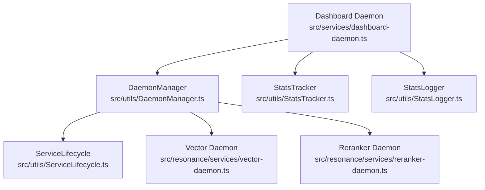
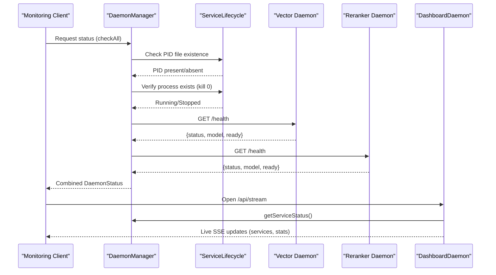
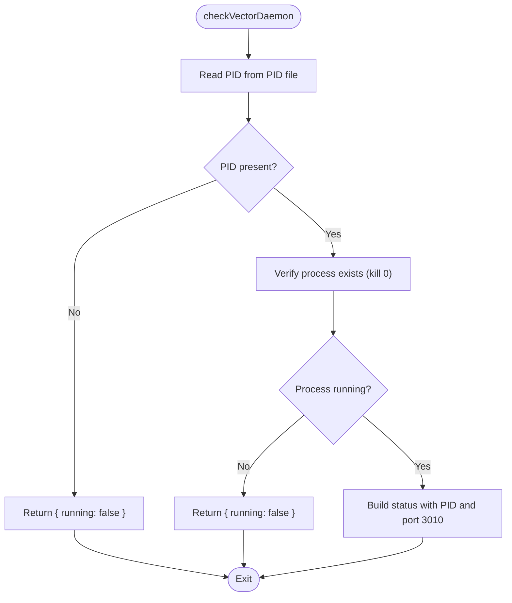
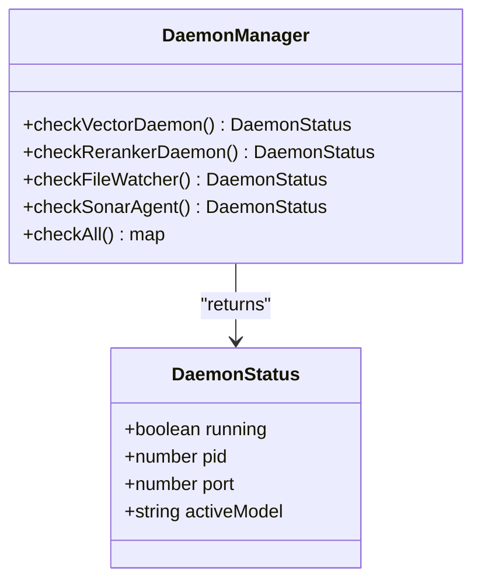
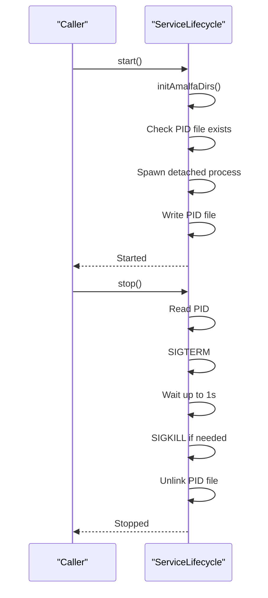
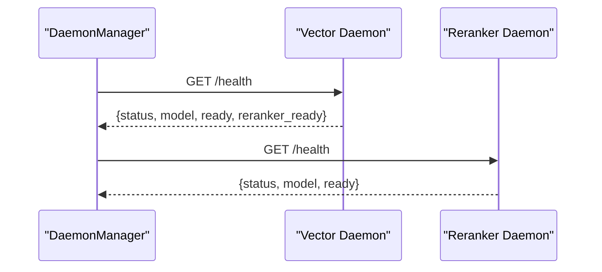
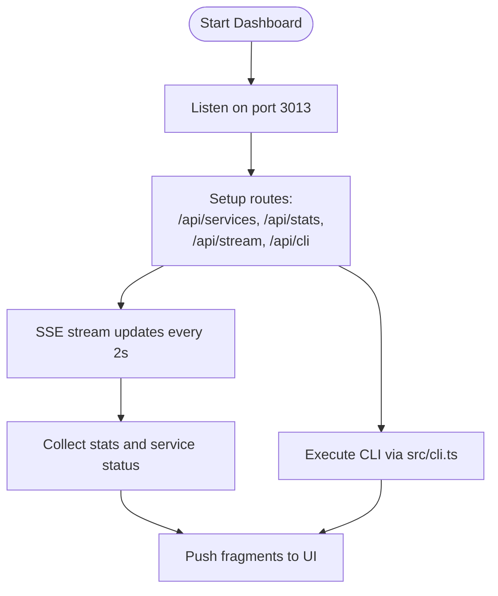
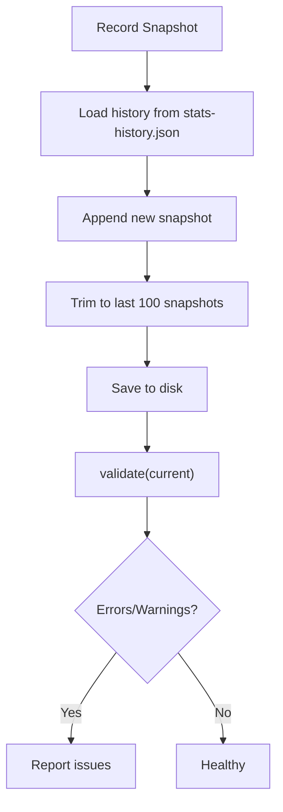
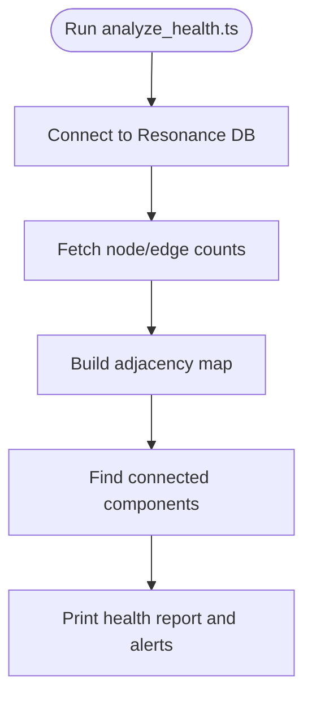
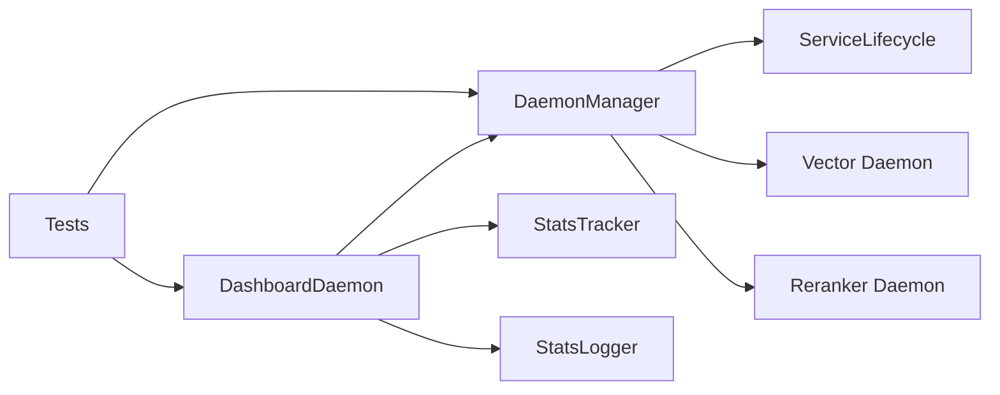

# Daemon Health Monitoring

<cite>
**Referenced Files in This Document**
- [DaemonManager.ts](file://src/utils/DaemonManager.ts)
- [ServiceLifecycle.ts](file://src/utils/ServiceLifecycle.ts)
- [vector-daemon.ts](file://src/resonance/services/vector-daemon.ts)
- [reranker-daemon.ts](file://src/resonance/services/reranker-daemon.ts)
- [dashboard-daemon.ts](file://src/services/dashboard-daemon.ts)
- [StatsTracker.ts](file://src/utils/StatsTracker.ts)
- [StatsLogger.ts](file://src/utils/StatsLogger.ts)
- [analyze_health.ts](file://scripts/verify/analyze_health.ts)
- [analyze_health.ts](file://scripts/verify/analyze_health.ts)
- [daemon-realtime.test.ts](file://tests/daemon-realtime.test.ts)
</cite>

## Table of Contents
1. [Introduction](#introduction)
2. [Project Structure](#project-structure)
3. [Core Components](#core-components)
4. [Architecture Overview](#architecture-overview)
5. [Detailed Component Analysis](#detailed-component-analysis)
6. [Dependency Analysis](#dependency-analysis)
7. [Performance Considerations](#performance-considerations)
8. [Troubleshooting Guide](#troubleshooting-guide)
9. [Conclusion](#conclusion)
10. [Appendices](#appendices)

## Introduction
This document explains Amalfa’s daemon health monitoring and status checking systems. It covers how the DaemonManager validates daemon states using PID file inspection, process existence checks, and targeted service health endpoints. It also describes the health monitoring architecture, including periodic status collection, alerting hooks, and automatic recovery procedures. The DaemonStatus interface is documented along with how daemon states are tracked and reported. Integration with statistics tracking and notification systems is explained, including practical examples of health checks, status reporting formats, and monitoring dashboard integration. Finally, troubleshooting guidance is provided for common monitoring issues, false positives, and system integration problems.

## Project Structure
The health monitoring system spans several modules:
- DaemonManager orchestrates status checks and lifecycle actions for multiple daemons.
- ServiceLifecycle provides generic start/stop/status/serve logic with PID file management.
- Individual daemon services expose health endpoints for readiness and model status.
- DashboardDaemon aggregates system stats, service status, and streams updates via SSE.
- StatsTracker and StatsLogger capture historical metrics for trend-based health validation.
- Scripts and tests demonstrate health analysis and real-time daemon behavior.

**Diagram sources**
- [DaemonManager.ts](file://src/utils/DaemonManager.ts#L17-L51)
- [ServiceLifecycle.ts](file://src/utils/ServiceLifecycle.ts#L12-L209)
- [vector-daemon.ts](file://src/resonance/services/vector-daemon.ts#L20-L26)
- [reranker-daemon.ts](file://src/resonance/services/reranker-daemon.ts#L18-L24)
- [dashboard-daemon.ts](file://src/services/dashboard-daemon.ts#L25-L32)
- [StatsTracker.ts](file://src/utils/StatsTracker.ts#L25-L218)
- [StatsLogger.ts](file://src/utils/StatsLogger.ts#L19-L84)

**Section sources**
- [DaemonManager.ts](file://src/utils/DaemonManager.ts#L17-L51)
- [ServiceLifecycle.ts](file://src/utils/ServiceLifecycle.ts#L12-L209)
- [vector-daemon.ts](file://src/resonance/services/vector-daemon.ts#L20-L26)
- [reranker-daemon.ts](file://src/resonance/services/reranker-daemon.ts#L18-L24)
- [dashboard-daemon.ts](file://src/services/dashboard-daemon.ts#L25-L32)
- [StatsTracker.ts](file://src/utils/StatsTracker.ts#L25-L218)
- [StatsLogger.ts](file://src/utils/StatsLogger.ts#L19-L84)

## Core Components
- DaemonManager: Central coordinator for vector, reranker, file watcher, and Sonar Agent daemons. Implements PID file validation, process existence checks, and targeted health checks via HTTP endpoints.
- ServiceLifecycle: Generic lifecycle manager that writes PID files, starts/stops processes, and cleans up on exit.
- DaemonStatus interface: Standardized shape for daemon state reporting including running flag, optional PID, optional port, and optional active model.
- DashboardDaemon: Exposes service status, system stats, and live SSE updates; integrates with health checks and telemetry.
- StatsTracker and StatsLogger: Historical metrics capture for database growth and operational runs, enabling trend-based health validation and alerting.

**Section sources**
- [DaemonManager.ts](file://src/utils/DaemonManager.ts#L6-L11)
- [DaemonManager.ts](file://src/utils/DaemonManager.ts#L84-L212)
- [ServiceLifecycle.ts](file://src/utils/ServiceLifecycle.ts#L12-L209)
- [dashboard-daemon.ts](file://src/services/dashboard-daemon.ts#L361-L386)
- [StatsTracker.ts](file://src/utils/StatsTracker.ts#L25-L218)
- [StatsLogger.ts](file://src/utils/StatsLogger.ts#L19-L84)

## Architecture Overview
The health monitoring architecture combines:
- PID-based liveness: Each daemon writes a PID file; DaemonManager reads PID files and verifies process existence.
- Endpoint-based readiness: Daemons expose /health endpoints returning model and readiness status.
- Dashboard aggregation: DashboardDaemon polls service status and streams live updates via SSE.
- Statistics tracking: StatsTracker records snapshots and validates against historical baselines; StatsLogger records operational runs.

**Diagram sources**
- [DaemonManager.ts](file://src/utils/DaemonManager.ts#L84-L212)
- [ServiceLifecycle.ts](file://src/utils/ServiceLifecycle.ts#L15-L22)
- [vector-daemon.ts](file://src/resonance/services/vector-daemon.ts#L82-L95)
- [reranker-daemon.ts](file://src/resonance/services/reranker-daemon.ts#L50-L62)
- [dashboard-daemon.ts](file://src/services/dashboard-daemon.ts#L146-L276)

## Detailed Component Analysis

### DaemonManager: Status Checking and Lifecycle Coordination
- PID file validation: Reads PID from configured path; returns null if missing or unparsable.
- Process existence verification: Uses kill(0) to check liveness; returns false on error.
- Port availability checks: Returns fixed ports for running daemons (3010, 3011, 3012) based on known configurations.
- Active model discovery: Queries /health endpoint for Sonar Agent to capture active model.
- Parallel orchestration: checkAll performs concurrent checks for all daemons.

**Diagram sources**
- [DaemonManager.ts](file://src/utils/DaemonManager.ts#L84-L98)

**Section sources**
- [DaemonManager.ts](file://src/utils/DaemonManager.ts#L68-L98)
- [DaemonManager.ts](file://src/utils/DaemonManager.ts#L119-L133)
- [DaemonManager.ts](file://src/utils/DaemonManager.ts#L154-L165)
- [DaemonManager.ts](file://src/utils/DaemonManager.ts#L186-L212)
- [DaemonManager.ts](file://src/utils/DaemonManager.ts#L233-L246)

### DaemonStatus Interface and Reporting
- Shape: running boolean; optional pid number; optional port number; optional activeModel string.
- Reporting: Each daemon-specific checker returns a DaemonStatus object reflecting current state.
- Aggregation: checkAll returns a map of all daemons’ statuses for unified reporting.

**Diagram sources**
- [DaemonManager.ts](file://src/utils/DaemonManager.ts#L6-L11)
- [DaemonManager.ts](file://src/utils/DaemonManager.ts#L84-L246)

**Section sources**
- [DaemonManager.ts](file://src/utils/DaemonManager.ts#L6-L11)
- [DaemonManager.ts](file://src/utils/DaemonManager.ts#L233-L246)

### ServiceLifecycle: PID File Management and Lifecycle Commands
- Start: Ensures directories, clears stale PID if needed, spawns detached process, writes PID file, truncates log.
- Stop: Reads PID, sends SIGTERM, waits up to 1s, force kills if needed, removes PID file.
- Status: Reports running/stopped based on PID file and process liveness.
- Serve: Writes PID for current process, registers cleanup handlers for signals and exit.

**Diagram sources**
- [ServiceLifecycle.ts](file://src/utils/ServiceLifecycle.ts#L27-L108)

**Section sources**
- [ServiceLifecycle.ts](file://src/utils/ServiceLifecycle.ts#L27-L108)
- [ServiceLifecycle.ts](file://src/utils/ServiceLifecycle.ts#L113-L173)

### Daemon Services Health Endpoints
- Vector Daemon: /health returns status, model, readiness, and reranker readiness.
- Reranker Daemon: /health returns status, model, and readiness.
- Sonar Agent: DaemonManager queries /health to capture active model.

**Diagram sources**
- [vector-daemon.ts](file://src/resonance/services/vector-daemon.ts#L82-L95)
- [reranker-daemon.ts](file://src/resonance/services/reranker-daemon.ts#L50-L62)
- [DaemonManager.ts](file://src/utils/DaemonManager.ts#L197-L204)

**Section sources**
- [vector-daemon.ts](file://src/resonance/services/vector-daemon.ts#L82-L95)
- [reranker-daemon.ts](file://src/resonance/services/reranker-daemon.ts#L50-L62)
- [DaemonManager.ts](file://src/utils/DaemonManager.ts#L197-L204)

### DashboardDaemon: Monitoring Dashboard and SSE Streaming
- Service status: getServiceStatus enumerates daemons and reads PID files to determine running/stopped.
- Live updates: /api/stream pushes service rows, graph stats, harvest metrics, pipeline telemetry, and recent logs via SSE.
- CLI proxy: /api/cli executes CLI commands and streams results back to the UI.

**Diagram sources**
- [dashboard-daemon.ts](file://src/services/dashboard-daemon.ts#L423-L445)
- [dashboard-daemon.ts](file://src/services/dashboard-daemon.ts#L146-L276)
- [dashboard-daemon.ts](file://src/services/dashboard-daemon.ts#L361-L386)

**Section sources**
- [dashboard-daemon.ts](file://src/services/dashboard-daemon.ts#L361-L386)
- [dashboard-daemon.ts](file://src/services/dashboard-daemon.ts#L146-L276)
- [dashboard-daemon.ts](file://src/services/dashboard-daemon.ts#L278-L313)

### Statistics Tracking and Validation
- StatsTracker: Records snapshots with nodes, edges, embeddings, sizes, and optional metadata; validates against history to detect regressions and anomalies.
- StatsLogger: Logs operational runs (harvest/init) to a JSONL file for downstream analysis.

**Diagram sources**
- [StatsTracker.ts](file://src/utils/StatsTracker.ts#L72-L89)
- [StatsTracker.ts](file://src/utils/StatsTracker.ts#L113-L174)

**Section sources**
- [StatsTracker.ts](file://src/utils/StatsTracker.ts#L72-L174)
- [StatsLogger.ts](file://src/utils/StatsLogger.ts#L23-L82)

### Health Script and Graph Analysis
- analyze_health.ts: Performs basic graph health checks including counts, density, average degree, and connected components to detect fractures.

**Diagram sources**
- [analyze_health.ts](file://scripts/verify/analyze_health.ts#L1-L88)

**Section sources**
- [analyze_health.ts](file://scripts/verify/analyze_health.ts#L1-L88)

## Dependency Analysis
- DaemonManager depends on ServiceLifecycle for process lifecycle and on individual daemon services for health endpoints.
- DashboardDaemon depends on DaemonManager for service status and on StatsTracker/StatsLogger for metrics.
- StatsTracker depends on filesystem for persistence; StatsLogger depends on filesystem for JSONL logging.
- Real-time tests validate daemon behavior under actual filesystem events.

**Diagram sources**
- [DaemonManager.ts](file://src/utils/DaemonManager.ts#L17-L51)
- [ServiceLifecycle.ts](file://src/utils/ServiceLifecycle.ts#L12-L209)
- [dashboard-daemon.ts](file://src/services/dashboard-daemon.ts#L25-L32)
- [StatsTracker.ts](file://src/utils/StatsTracker.ts#L25-L218)
- [StatsLogger.ts](file://src/utils/StatsLogger.ts#L19-L84)
- [daemon-realtime.test.ts](file://tests/daemon-realtime.test.ts#L1-L253)

**Section sources**
- [DaemonManager.ts](file://src/utils/DaemonManager.ts#L17-L51)
- [ServiceLifecycle.ts](file://src/utils/ServiceLifecycle.ts#L12-L209)
- [dashboard-daemon.ts](file://src/services/dashboard-daemon.ts#L25-L32)
- [StatsTracker.ts](file://src/utils/StatsTracker.ts#L25-L218)
- [StatsLogger.ts](file://src/utils/StatsLogger.ts#L19-L84)
- [daemon-realtime.test.ts](file://tests/daemon-realtime.test.ts#L1-L253)

## Performance Considerations
- Concurrency: DaemonManager uses Promise.all for parallel status checks to minimize latency.
- Lightweight checks: PID file existence and kill(0) are O(1) operations; HTTP health checks are fast but should be cached or rate-limited at higher levels.
- SSE streaming: Dashboard updates every 2s; adjust intervals based on UI responsiveness and backend load.
- Disk I/O: StatsTracker trims snapshots to 100 to bound storage growth; ensure write operations occur infrequently.

[No sources needed since this section provides general guidance]

## Troubleshooting Guide
Common issues and resolutions:
- Stale PID file:
  - Symptom: Daemon appears stopped but PID file exists.
  - Resolution: Use ServiceLifecycle.stop to clear stale PID and logs; restart the daemon.
- Process not responding to SIGTERM:
  - Symptom: stop() retries and force kills after 1s.
  - Resolution: Investigate blocking operations; ensure proper signal handling in daemon entry points.
- Port conflicts:
  - Symptom: Daemon fails to start or Dashboard reports port in use.
  - Resolution: Change VECTOR_PORT/RERANKER_PORT/DASHBOARD_PORT or stop conflicting processes.
- Health endpoint failures:
  - Symptom: DaemonManager reports stopped despite PID file presence.
  - Resolution: Verify daemon is listening on the expected port; check logs; reinitialize models if lazy loading is involved.
- Dashboard SSE disconnects:
  - Symptom: UI stops updating; ping events cease.
  - Resolution: Restart DashboardDaemon; check network/firewall; reduce SSE frequency if overloaded.
- False positives in health checks:
  - Cause: Transient network issues or slow model initialization.
  - Mitigation: Retry logic in callers; cache health responses briefly; differentiate transient vs persistent failures.
- Real-time daemon behavior:
  - Use tests to validate directory watching, debounce behavior, and database updates under file system events.

**Section sources**
- [ServiceLifecycle.ts](file://src/utils/ServiceLifecycle.ts#L72-L108)
- [dashboard-daemon.ts](file://src/services/dashboard-daemon.ts#L429-L445)
- [daemon-realtime.test.ts](file://tests/daemon-realtime.test.ts#L72-L253)

## Conclusion
Amalfa’s daemon health monitoring system combines PID-based liveness checks, endpoint-based readiness, and dashboard-driven observability. DaemonManager centralizes status reporting, ServiceLifecycle ensures robust lifecycle management, and StatsTracker/StatsLogger enable trend-based validation. The DashboardDaemon aggregates and streams health data, supporting proactive issue detection and efficient troubleshooting.

[No sources needed since this section summarizes without analyzing specific files]

## Appendices

### Practical Examples
- Health check implementations:
  - Vector Daemon: /health returns model and readiness flags.
  - Reranker Daemon: /health returns model and readiness flags.
  - Sonar Agent: DaemonManager queries /health to capture active model.
- Status reporting formats:
  - DaemonStatus: running, pid, port, activeModel.
  - Dashboard service row: name, status, pid.
  - SSE fragments: selector-based DOM updates for live stats.
- Monitoring dashboard integration:
  - /api/services/{name}/{action} proxies CLI commands.
  - /api/stream pushes periodic updates for services, stats, and logs.

**Section sources**
- [vector-daemon.ts](file://src/resonance/services/vector-daemon.ts#L82-L95)
- [reranker-daemon.ts](file://src/resonance/services/reranker-daemon.ts#L50-L62)
- [DaemonManager.ts](file://src/utils/DaemonManager.ts#L6-L11)
- [dashboard-daemon.ts](file://src/services/dashboard-daemon.ts#L95-L128)
- [dashboard-daemon.ts](file://src/services/dashboard-daemon.ts#L146-L276)