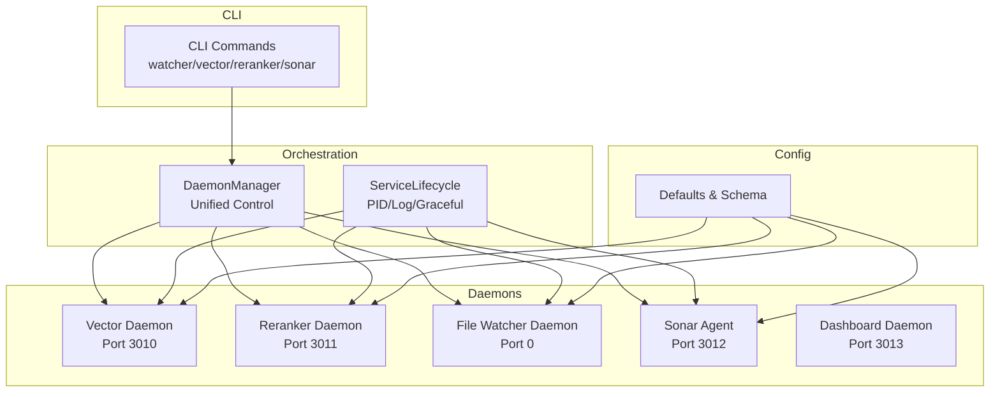
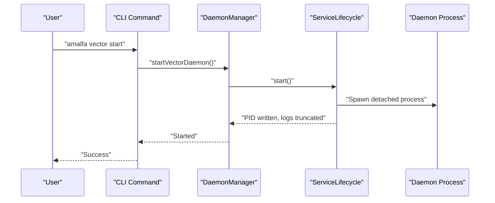
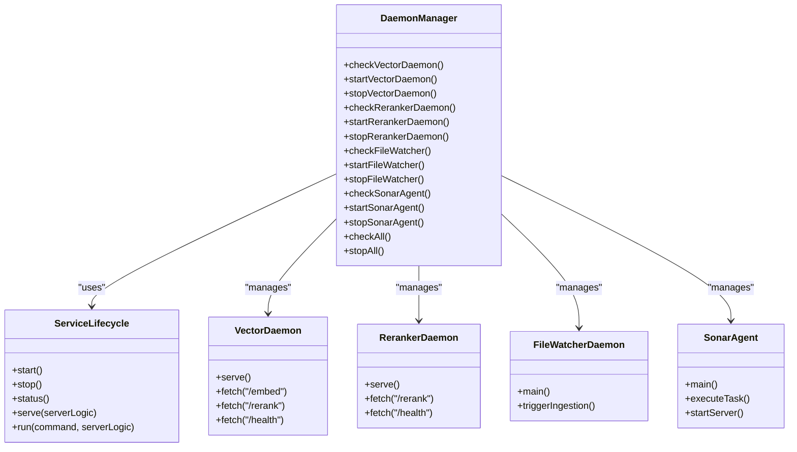
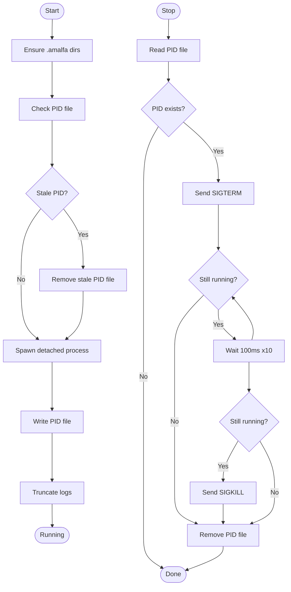
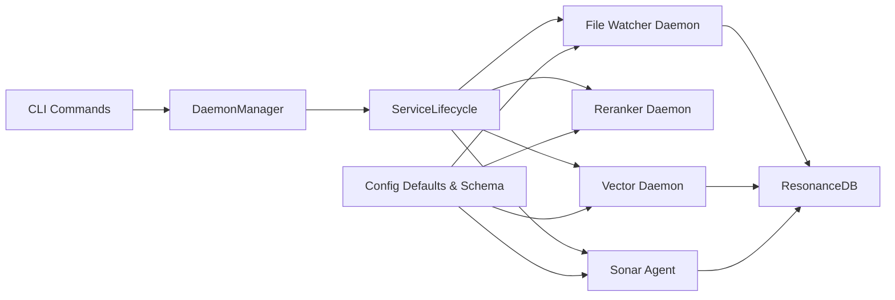

# Daemon Orchestration

<cite>
**Referenced Files in This Document**
- [DaemonManager.ts](file://src/utils/DaemonManager.ts)
- [ServiceLifecycle.ts](file://src/utils/ServiceLifecycle.ts)
- [vector-daemon.ts](file://src/resonance/services/vector-daemon.ts)
- [reranker-daemon.ts](file://src/resonance/services/reranker-daemon.ts)
- [index.ts (daemon)](file://src/daemon/index.ts)
- [sonar-agent.ts](file://src/daemon/sonar-agent.ts)
- [dashboard-daemon.ts](file://src/services/dashboard-daemon.ts)
- [defaults.ts](file://src/config/defaults.ts)
- [schema.ts](file://src/config/schema.ts)
- [services.ts (CLI)](file://src/cli/commands/services.ts)
- [cli.ts](file://src/cli.ts)
- [Logger.ts](file://src/utils/Logger.ts)
- [daemon-realtime.test.ts](file://tests/daemon-realtime.test.ts)
</cite>

## Table of Contents
1. [Introduction](#introduction)
2. [Project Structure](#project-structure)
3. [Core Components](#core-components)
4. [Architecture Overview](#architecture-overview)
5. [Detailed Component Analysis](#detailed-component-analysis)
6. [Dependency Analysis](#dependency-analysis)
7. [Performance Considerations](#performance-considerations)
8. [Troubleshooting Guide](#troubleshooting-guide)
9. [Conclusion](#conclusion)
10. [Appendices](#appendices)

## Introduction
This document describes Amalfa’s daemon orchestration system: a unified, lifecycle-driven approach to managing multiple background services. It explains the ServiceLifecycle pattern for process management, PID and log file handling, and graceful startup/shutdown. It covers the four core daemons—Vector Daemon (port 3010), Reranker Daemon (port 3011), File Watcher Daemon, and Sonar Agent (port 3012)—and details status checking, health monitoring, and automatic recovery. Practical examples illustrate lifecycle management, startup ordering, inter-service communication, configuration options, logging strategies, and troubleshooting.

## Project Structure
The orchestration spans several modules:
- Utilities: DaemonManager and ServiceLifecycle encapsulate lifecycle management and PID/log handling.
- Daemons: Vector and Reranker HTTP daemons, File Watcher daemon, and Sonar Agent.
- CLI: Commands to manage daemons and display status.
- Config: Centralized settings and defaults.
- Logging: Structured logging via Pino.

**Diagram sources**
- [DaemonManager.ts](file://src/utils/DaemonManager.ts#L17-L51)
- [ServiceLifecycle.ts](file://src/utils/ServiceLifecycle.ts#L12-L209)
- [vector-daemon.ts](file://src/resonance/services/vector-daemon.ts#L18-L26)
- [reranker-daemon.ts](file://src/resonance/services/reranker-daemon.ts#L16-L24)
- [index.ts (daemon)](file://src/daemon/index.ts#L25-L35)
- [sonar-agent.ts](file://src/daemon/sonar-agent.ts#L49-L55)
- [dashboard-daemon.ts](file://src/services/dashboard-daemon.ts#L15-L16)
- [services.ts (CLI)](file://src/cli/commands/services.ts#L9-L344)
- [defaults.ts](file://src/config/defaults.ts#L16-L59)
- [schema.ts](file://src/config/schema.ts#L146-L200)

**Section sources**
- [DaemonManager.ts](file://src/utils/DaemonManager.ts#L17-L51)
- [ServiceLifecycle.ts](file://src/utils/ServiceLifecycle.ts#L12-L209)
- [vector-daemon.ts](file://src/resonance/services/vector-daemon.ts#L18-L26)
- [reranker-daemon.ts](file://src/resonance/services/reranker-daemon.ts#L16-L24)
- [index.ts (daemon)](file://src/daemon/index.ts#L25-L35)
- [sonar-agent.ts](file://src/daemon/sonar-agent.ts#L49-L55)
- [dashboard-daemon.ts](file://src/services/dashboard-daemon.ts#L15-L16)
- [services.ts (CLI)](file://src/cli/commands/services.ts#L9-L344)
- [defaults.ts](file://src/config/defaults.ts#L16-L59)
- [schema.ts](file://src/config/schema.ts#L146-L200)

## Core Components
- DaemonManager: Central coordinator for four daemons. Provides per-daemon status checks, start/stop, and bulk operations. Uses ServiceLifecycle instances internally.
- ServiceLifecycle: Generic lifecycle manager that spawns detached processes, writes PID files, manages logs, and supports graceful stop with SIGTERM/SIGKILL fallback.
- CLI Commands: Thin wrappers around DaemonManager for start/stop/status/restart of each daemon.
- Configuration: Centralized settings and defaults define runtime directories, ports, and feature toggles.

Key responsibilities:
- PID file handling: Creation, staleness detection, cleanup on exit.
- Log file management: Truncation and streaming to per-service log files.
- Graceful shutdown: SIGTERM polling with forced kill if needed.
- Status reporting: Running vs. stopped, PID, port, and model info where applicable.

**Section sources**
- [DaemonManager.ts](file://src/utils/DaemonManager.ts#L17-L260)
- [ServiceLifecycle.ts](file://src/utils/ServiceLifecycle.ts#L12-L209)
- [services.ts (CLI)](file://src/cli/commands/services.ts#L9-L344)
- [defaults.ts](file://src/config/defaults.ts#L16-L59)

## Architecture Overview
The system follows a “service-per-process” model with lifecycle orchestration:
- Each daemon is a separate Bun process managed by ServiceLifecycle.
- DaemonManager aggregates status and coordinates operations.
- CLI commands delegate to DaemonManager for user-facing actions.
- Configuration is loaded at startup and used to set ports, directories, and feature flags.

**Diagram sources**
- [services.ts (CLI)](file://src/cli/commands/services.ts#L69-L129)
- [DaemonManager.ts](file://src/utils/DaemonManager.ts#L103-L107)
- [ServiceLifecycle.ts](file://src/utils/ServiceLifecycle.ts#L27-L67)

**Section sources**
- [DaemonManager.ts](file://src/utils/DaemonManager.ts#L103-L107)
- [ServiceLifecycle.ts](file://src/utils/ServiceLifecycle.ts#L27-L67)
- [services.ts (CLI)](file://src/cli/commands/services.ts#L69-L129)

## Detailed Component Analysis

### DaemonManager
Responsibilities:
- Instantiate ServiceLifecycle for each daemon.
- Provide per-daemon status checks and operations.
- Aggregate status and stop all daemons concurrently.

Status reporting:
- Vector/Reranker: running, pid, port.
- File Watcher: running, pid.
- Sonar Agent: running, pid, port, active model (via health endpoint).

Startup delays:
- Short waits after start to allow daemons to initialize before subsequent operations.

Bulk operations:
- Parallel status checks and stop operations for efficiency.

**Section sources**
- [DaemonManager.ts](file://src/utils/DaemonManager.ts#L17-L260)

### ServiceLifecycle
Lifecycle primitives:
- start: Ensures directories, checks stale PID, truncates logs, spawns detached process, writes PID.
- stop: Reads PID, sends SIGTERM, polls for exit, falls back to SIGKILL, cleans PID file.
- status: Reports running/stopped/stale based on PID file and process liveness.
- serve: Writes PID for current process, registers cleanup handlers for signals and exit.

Signal handling:
- SIGINT/SIGTERM: cleanup PID file and exit cleanly.
- exit: synchronous cleanup to mark PID file stale.

Environment:
- Inherits process.env to propagate .env variables to spawned daemons.

**Section sources**
- [ServiceLifecycle.ts](file://src/utils/ServiceLifecycle.ts#L12-L209)

### Vector Daemon (Port 3010)
Features:
- HTTP server exposing /embed and /rerank endpoints.
- Loads BGE Small EN v1.5 model at startup; lazy-loads reranker on first request.
- Normalizes embeddings to FAFCAS format.
- Health endpoint returns status, model, readiness flags.

Ports and PID:
- Port configurable via VECTOR_PORT env var; default 3010.
- PID/log files under .amalfa/runtime and .amalfa/logs.

**Section sources**
- [vector-daemon.ts](file://src/resonance/services/vector-daemon.ts#L18-L26)
- [vector-daemon.ts](file://src/resonance/services/vector-daemon.ts#L72-L230)

### Reranker Daemon (Port 3011)
Features:
- Pure reranking service with BGE reranker.
- Health endpoint indicates readiness.
- Exposes /rerank with query, documents, topK, threshold.

Ports and PID:
- Port configurable via RERANKER_PORT env var; default 3011.

**Section sources**
- [reranker-daemon.ts](file://src/resonance/services/reranker-daemon.ts#L16-L24)
- [reranker-daemon.ts](file://src/resonance/services/reranker-daemon.ts#L43-L141)

### File Watcher Daemon
Purpose:
- Watches configured source directories for .md file changes and triggers ingestion.

Mechanics:
- Debounces file events; batches changes; loads config per batch.
- Runs ingestion pipeline and optional Ember enrichment.
- Implements retry queue with exponential backoff for transient failures.
- Emits notifications on success/failure.

PID/Logs:
- PID/log files under .amalfa/runtime and .amalfa/logs.

**Section sources**
- [index.ts (daemon)](file://src/daemon/index.ts#L52-L95)
- [index.ts (daemon)](file://src/daemon/index.ts#L132-L289)
- [defaults.ts](file://src/config/defaults.ts#L16-L59)

### Sonar Agent (Port 3012)
Purpose:
- Multi-purpose agent that monitors task queues, performs graph operations, and exposes an HTTP API.
- Integrates with Ollama or cloud providers for inference.

Mechanics:
- Loads graph engine and vector engine; ensures task directories exist.
- Periodically processes pending tasks; supports synthesis, timeline, garden, research, and batch enhancement.
- Starts HTTP server on configured port (default 3012) and exposes health endpoint.

PID/Logs:
- PID/log files under .amalfa/runtime and .amalfa/logs.

**Section sources**
- [sonar-agent.ts](file://src/daemon/sonar-agent.ts#L60-L116)
- [sonar-agent.ts](file://src/daemon/sonar-agent.ts#L138-L220)
- [schema.ts](file://src/config/schema.ts#L54-L88)

### Dashboard Daemon (Port 3013)
Purpose:
- Web dashboard for service management and monitoring.
- Provides SSE streams for live stats, logs, and telemetry.

Features:
- Service status table, stats, harvest metrics, pipeline telemetry, and log stream.
- CLI proxy to execute commands via dashboard.

**Section sources**
- [dashboard-daemon.ts](file://src/services/dashboard-daemon.ts#L25-L489)

### CLI Orchestration
Commands:
- watcher: start/stop/status/restart file watcher.
- vector: start/stop/status/restart vector daemon.
- reranker: start/stop/status/restart reranker daemon.
- sonar: start/stop/status/restart/chat Sonar Agent.

Each command constructs a DaemonManager and invokes the appropriate method.

**Section sources**
- [services.ts (CLI)](file://src/cli/commands/services.ts#L9-L344)
- [cli.ts](file://src/cli.ts#L182-L234)

## Architecture Overview

**Diagram sources**
- [DaemonManager.ts](file://src/utils/DaemonManager.ts#L17-L260)
- [ServiceLifecycle.ts](file://src/utils/ServiceLifecycle.ts#L12-L209)
- [vector-daemon.ts](file://src/resonance/services/vector-daemon.ts#L72-L230)
- [reranker-daemon.ts](file://src/resonance/services/reranker-daemon.ts#L43-L141)
- [index.ts (daemon)](file://src/daemon/index.ts#L52-L289)
- [sonar-agent.ts](file://src/daemon/sonar-agent.ts#L60-L220)

## Detailed Component Analysis

### ServiceLifecycle Pattern

**Diagram sources**
- [ServiceLifecycle.ts](file://src/utils/ServiceLifecycle.ts#L27-L108)

**Section sources**
- [ServiceLifecycle.ts](file://src/utils/ServiceLifecycle.ts#L27-L108)

### Daemon Status Checking and Health Monitoring
- Vector/Reranker: status includes running, pid, port; health endpoints return readiness and model info.
- File Watcher: status includes running, pid; logs indicate watched paths and processing.
- Sonar Agent: status includes running, pid, port, active model; health endpoint returns model info.

Automatic recovery:
- File Watcher implements retry queue with bounded attempts and backoff for transient failures.

**Section sources**
- [DaemonManager.ts](file://src/utils/DaemonManager.ts#L84-L212)
- [vector-daemon.ts](file://src/resonance/services/vector-daemon.ts#L82-L95)
- [reranker-daemon.ts](file://src/resonance/services/reranker-daemon.ts#L50-L62)
- [index.ts (daemon)](file://src/daemon/index.ts#L232-L278)

### Startup Ordering and Interdependencies
- CLI commands provide ordered control: watcher, vector, reranker, sonar.
- Vector daemon depends on model cache availability; reranker daemon is independent.
- Sonar Agent requires Ollama or cloud inference; otherwise operates in limited mode.
- File Watcher is independent and can run alongside others.

Practical example:
- Start File Watcher first to populate the graph, then start Vector/Reranker for search and reranking, then Sonar Agent for advanced tasks.

**Section sources**
- [services.ts (CLI)](file://src/cli/commands/services.ts#L9-L344)
- [sonar-agent.ts](file://src/daemon/sonar-agent.ts#L81-L96)

### Inter-Service Communication Patterns
- Vector Daemon: /embed and /rerank endpoints for embedding and reranking.
- Sonar Agent: HTTP API for task execution and health checks.
- Dashboard Daemon: Proxies CLI commands and serves live stats via SSE.

**Section sources**
- [vector-daemon.ts](file://src/resonance/services/vector-daemon.ts#L162-L223)
- [reranker-daemon.ts](file://src/resonance/services/reranker-daemon.ts#L64-L131)
- [sonar-agent.ts](file://src/daemon/sonar-agent.ts#L123-L133)
- [dashboard-daemon.ts](file://src/services/dashboard-daemon.ts#L278-L313)

### Configuration Options
- Sources and database path.
- Embeddings model and dimensions.
- Watch settings: enabled, debounce, notifications.
- Sonar: enable/disable, auto-discovery, inference method, model, port, task configs, cloud settings.
- Ember: enable/disable, confidence thresholds, auto-squash, backup directory.
- LangExtract: provider selection and provider-specific settings.

Defaults are enforced by schema; runtime values override defaults.

**Section sources**
- [schema.ts](file://src/config/schema.ts#L146-L200)
- [amalfa.settings.example.json](file://amalfa.settings.example.json#L1-L56)
- [defaults.ts](file://src/config/defaults.ts#L84-L143)

### Logging Strategies
- Structured logging via Pino; component-scoped loggers.
- Per-service log files under .amalfa/logs.
- DaemonManager and ServiceLifecycle write logs to files; CLI prints human-readable status.

**Section sources**
- [Logger.ts](file://src/utils/Logger.ts#L1-L23)
- [ServiceLifecycle.ts](file://src/utils/ServiceLifecycle.ts#L44-L45)
- [daemon-realtime.test.ts](file://tests/daemon-realtime.test.ts#L82-L88)

## Dependency Analysis

**Diagram sources**
- [services.ts (CLI)](file://src/cli/commands/services.ts#L9-L344)
- [DaemonManager.ts](file://src/utils/DaemonManager.ts#L17-L51)
- [ServiceLifecycle.ts](file://src/utils/ServiceLifecycle.ts#L12-L209)
- [vector-daemon.ts](file://src/resonance/services/vector-daemon.ts#L18-L26)
- [reranker-daemon.ts](file://src/resonance/services/reranker-daemon.ts#L16-L24)
- [index.ts (daemon)](file://src/daemon/index.ts#L14-L22)
- [sonar-agent.ts](file://src/daemon/sonar-agent.ts#L42-L54)
- [defaults.ts](file://src/config/defaults.ts#L16-L59)
- [schema.ts](file://src/config/schema.ts#L146-L200)

**Section sources**
- [services.ts (CLI)](file://src/cli/commands/services.ts#L9-L344)
- [DaemonManager.ts](file://src/utils/DaemonManager.ts#L17-L51)
- [ServiceLifecycle.ts](file://src/utils/ServiceLifecycle.ts#L12-L209)
- [defaults.ts](file://src/config/defaults.ts#L16-L59)
- [schema.ts](file://src/config/schema.ts#L146-L200)

## Performance Considerations
- Detached processes reduce overhead and improve responsiveness.
- Debouncing in File Watcher reduces redundant ingestion work.
- Lazy model initialization minimizes cold-start latency.
- Parallel status checks and stop operations reduce user wait time.

## Troubleshooting Guide
Common issues and resolutions:
- Stale PID file: ServiceLifecycle clears stale PID files on start; use stop to remove cleanly.
- Port conflicts: Adjust port env vars (VECTOR_PORT, RERANKER_PORT, Sonar port) before starting.
- Missing configuration: Ensure amalfa.settings.json exists and validates against schema.
- File Watcher not picking up changes: Verify sources array and exclude patterns; restart daemon after config changes.
- Sonar Agent inference failures: Check Ollama availability or enable cloud fallback; confirm model availability.

Diagnostic steps:
- Use CLI status commands to check running state and ports.
- Inspect per-service logs in .amalfa/logs.
- For File Watcher, review retry queue behavior and backoff timing.
- For Sonar Agent, query /health endpoint for model readiness.

**Section sources**
- [ServiceLifecycle.ts](file://src/utils/ServiceLifecycle.ts#L32-L42)
- [services.ts (CLI)](file://src/cli/commands/services.ts#L81-L129)
- [daemon-realtime.test.ts](file://tests/daemon-realtime.test.ts#L82-L92)

## Conclusion
Amalfa’s daemon orchestration system provides a robust, lifecycle-driven foundation for managing background services. ServiceLifecycle offers consistent PID/log handling and graceful shutdown; DaemonManager unifies control across daemons; CLI commands deliver user-friendly operations. The four core daemons—Vector, Reranker, File Watcher, and Sonar Agent—each expose health endpoints and integrate with configuration and logging systems. With structured logging, status checks, and automatic recovery, the system supports reliable operation in development and production environments.

## Appendices

### Practical Examples

- Lifecycle management
  - Start Vector Daemon: amalfa vector start
  - Stop Reranker Daemon: amalfa reranker stop
  - Restart File Watcher: amalfa watcher restart
  - Check Sonar Agent: amalfa sonar status

- Startup ordering
  - Start File Watcher → Start Vector Daemon → Start Reranker Daemon → Start Sonar Agent

- Inter-service communication
  - Vector Daemon: POST /embed, POST /rerank, GET /health
  - Sonar Agent: HTTP API endpoints (see sonar-agent.ts for routes)
  - Dashboard Daemon: SSE /api/stream, CLI proxy /api/cli

- Configuration
  - Edit amalfa.settings.json; defaults validated by schema.ts
  - Ports: VECTOR_PORT (default 3010), RERANKER_PORT (default 3011), Sonar port (default 3012), Dashboard port (3013)

- Logging
  - Logs under .amalfa/logs; component-scoped loggers via Logger.ts

**Section sources**
- [services.ts (CLI)](file://src/cli/commands/services.ts#L69-L286)
- [vector-daemon.ts](file://src/resonance/services/vector-daemon.ts#L72-L230)
- [reranker-daemon.ts](file://src/resonance/services/reranker-daemon.ts#L43-L141)
- [sonar-agent.ts](file://src/daemon/sonar-agent.ts#L123-L133)
- [dashboard-daemon.ts](file://src/services/dashboard-daemon.ts#L140-L276)
- [schema.ts](file://src/config/schema.ts#L146-L200)
- [Logger.ts](file://src/utils/Logger.ts#L1-L23)