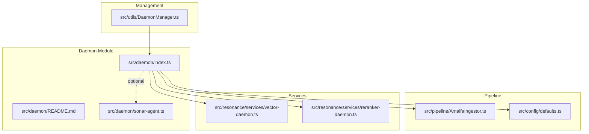
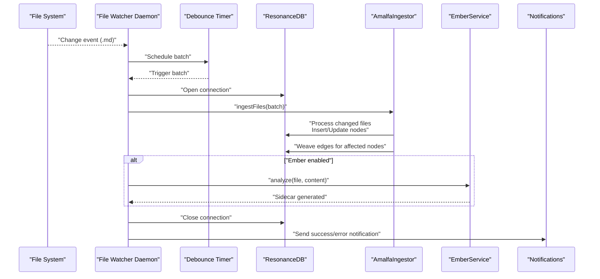
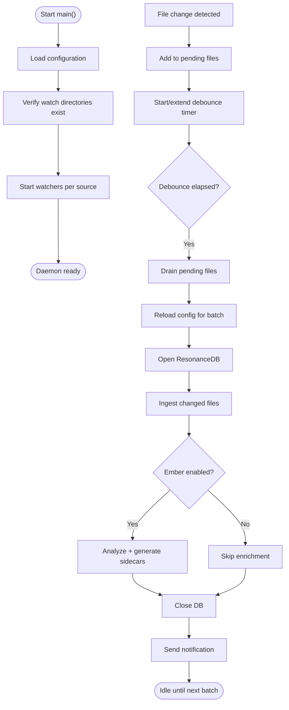
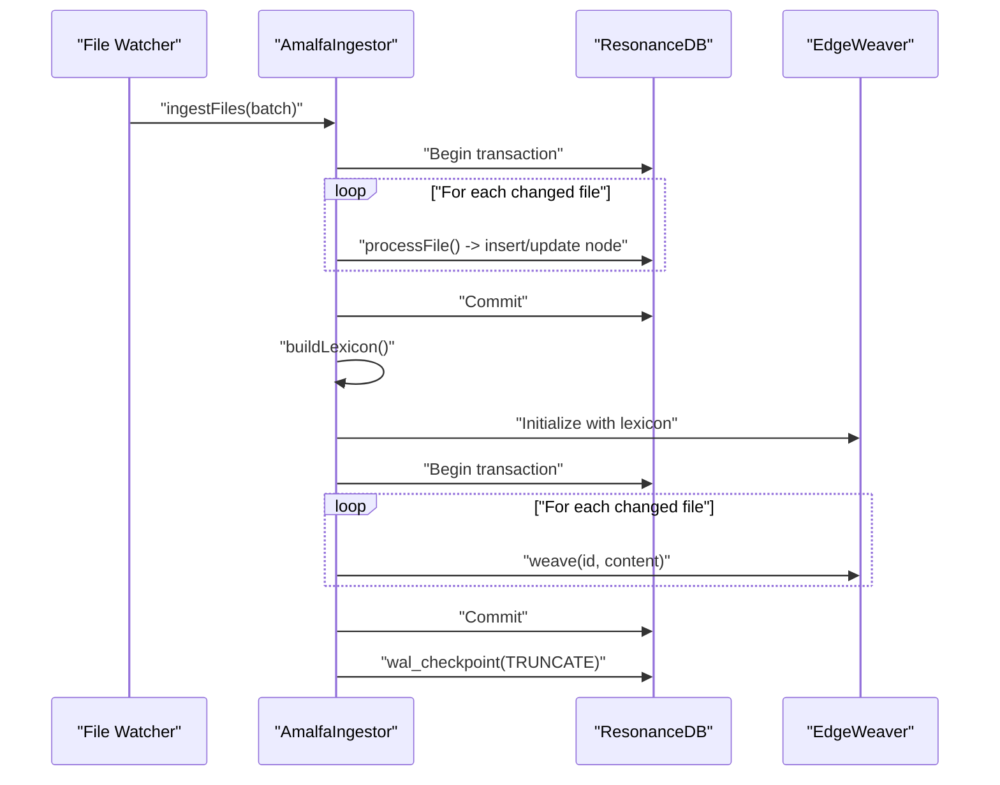
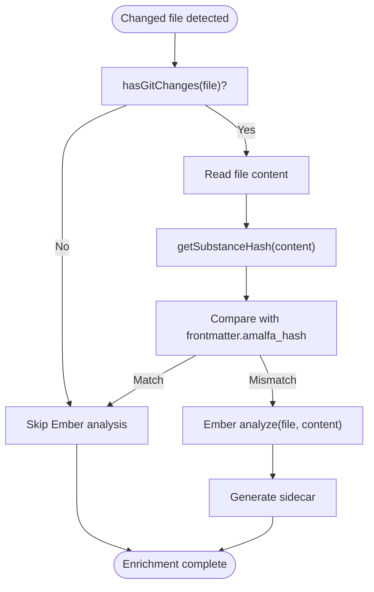
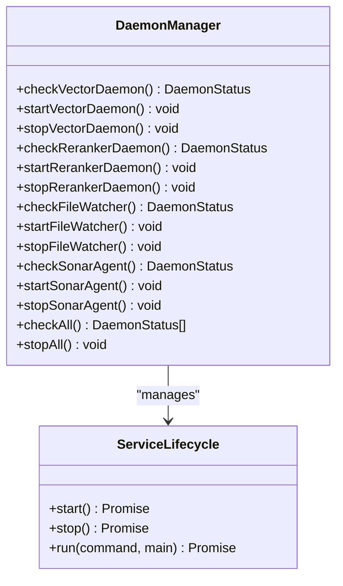
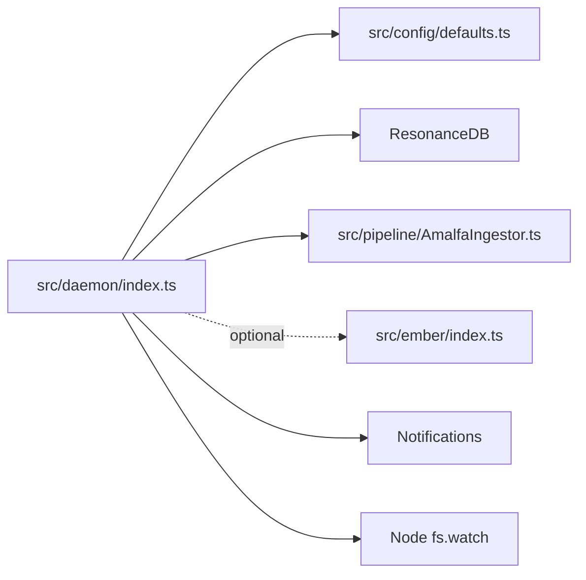

# File Watcher Daemon

<cite>
**Referenced Files in This Document**
- [src/daemon/index.ts](file://src/daemon/index.ts)
- [src/daemon/README.md](file://src/daemon/README.md)
- [src/utils/DaemonManager.ts](file://src/utils/DaemonManager.ts)
- [src/config/defaults.ts](file://src/config/defaults.ts)
- [src/pipeline/AmalfaIngestor.ts](file://src/pipeline/AmalfaIngestor.ts)
- [src/ember/index.ts](file://src/ember/index.ts)
- [src/resonance/services/vector-daemon.ts](file://src/resonance/services/vector-daemon.ts)
- [src/resonance/services/reranker-daemon.ts](file://src/resonance/services/reranker-daemon.ts)
- [src/daemon/sonar-agent.ts](file://src/daemon/sonar-agent.ts)
- [tests/daemon-realtime.test.ts](file://tests/daemon-realtime.test.ts)
- [debriefs/2026-01-17-daemon-file-watcher-naming-investigation.md](file://debriefs/2026-01-17-daemon-file-watcher-naming-investigation.md)
- [briefs/archive/2026-01-17-documentation/2026-01-17-targeted-incremental-ingestion.md](file://briefs/archive/2026-01-17-documentation/2026-01-17-targeted-incremental-ingestion.md)
</cite>

## Table of Contents
1. [Introduction](#introduction)
2. [Project Structure](#project-structure)
3. [Core Components](#core-components)
4. [Architecture Overview](#architecture-overview)
5. [Detailed Component Analysis](#detailed-component-analysis)
6. [Dependency Analysis](#dependency-analysis)
7. [Performance Considerations](#performance-considerations)
8. [Troubleshooting Guide](#troubleshooting-guide)
9. [Conclusion](#conclusion)

## Introduction
The File Watcher Daemon is a background service responsible for monitoring file system changes in configured directories and triggering targeted incremental ingestion into the knowledge graph. It watches for Markdown (.md) file modifications, debounces rapid changes, and coordinates ingestion through the Amalfa pipeline, optionally integrating with the Ember enrichment subsystem. The daemon maintains data freshness by ensuring that only changed files are processed, minimizing overhead and enabling near real-time knowledge graph updates.

## Project Structure
The File Watcher Daemon resides under the daemon module alongside other long-running services such as the Vector Daemon and Sonar Agent. It is managed uniformly by the Daemon Manager, which provides lifecycle control and status reporting for all daemons.

**Diagram sources**
- [src/daemon/index.ts](file://src/daemon/index.ts#L1-L293)
- [src/daemon/README.md](file://src/daemon/README.md#L1-L25)
- [src/utils/DaemonManager.ts](file://src/utils/DaemonManager.ts#L1-L260)
- [src/pipeline/AmalfaIngestor.ts](file://src/pipeline/AmalfaIngestor.ts#L1-L441)
- [src/config/defaults.ts](file://src/config/defaults.ts#L1-L143)
- [src/resonance/services/vector-daemon.ts](file://src/resonance/services/vector-daemon.ts#L1-L234)
- [src/resonance/services/reranker-daemon.ts](file://src/resonance/services/reranker-daemon.ts#L1-L145)
- [src/daemon/sonar-agent.ts](file://src/daemon/sonar-agent.ts#L1-L221)

**Section sources**
- [src/daemon/README.md](file://src/daemon/README.md#L1-L25)
- [src/utils/DaemonManager.ts](file://src/utils/DaemonManager.ts#L17-L51)

## Core Components
- File Watcher Daemon entry point: Monitors configured directories recursively, filters for Markdown files, debounces events, and triggers ingestion.
- AmalfaIngestor: Processes changed files incrementally, creates/updates nodes, and weaves edges into the knowledge graph.
- Ember integration: Optional enrichment pipeline invoked after ingestion to analyze and generate sidecar artifacts for changed files.
- Daemon Manager: Unified lifecycle controller for the File Watcher Daemon and other daemons.
- Configuration: Centralized settings loader that defines watch sources, database path, debounce interval, and notification preferences.

Key responsibilities:
- Change detection and batching via Node fs.watch with recursive directory support.
- Debounce mechanism to coalesce rapid successive changes.
- Incremental ingestion targeting only modified files.
- Optional Ember enrichment gated by Git and content signature checks.
- Notification dispatch upon successful or failed updates.

**Section sources**
- [src/daemon/index.ts](file://src/daemon/index.ts#L52-L95)
- [src/pipeline/AmalfaIngestor.ts](file://src/pipeline/AmalfaIngestor.ts#L44-L134)
- [src/ember/index.ts](file://src/ember/index.ts#L11-L26)
- [src/utils/DaemonManager.ts](file://src/utils/DaemonManager.ts#L151-L181)
- [src/config/defaults.ts](file://src/config/defaults.ts#L84-L143)

## Architecture Overview
The File Watcher Daemon operates as a background process integrated with the ingestion pipeline and optional enrichment subsystems. It relies on configuration-driven watch sources and coordinates with the database and vector services.

**Diagram sources**
- [src/daemon/index.ts](file://src/daemon/index.ts#L100-L289)
- [src/pipeline/AmalfaIngestor.ts](file://src/pipeline/AmalfaIngestor.ts#L44-L134)
- [src/ember/index.ts](file://src/ember/index.ts#L59-L68)

## Detailed Component Analysis

### File Watcher Daemon
The daemon initializes configuration, validates watch directories, starts watchers for each source, and manages debounced ingestion batches. It supports graceful shutdown via signal handlers and integrates notifications for operational feedback.

Processing logic highlights:
- Watcher creation per source directory with recursive scanning.
- Event filtering restricted to .md files.
- Pending file set and debounce timer to batch changes.
- Runtime config reload for each batch to reflect updates.
- Retry queue with exponential backoff for transient failures.
- Optional Ember enrichment gated by Git presence and content signature checks.

**Diagram sources**
- [src/daemon/index.ts](file://src/daemon/index.ts#L52-L95)
- [src/daemon/index.ts](file://src/daemon/index.ts#L100-L127)
- [src/daemon/index.ts](file://src/daemon/index.ts#L132-L289)

**Section sources**
- [src/daemon/index.ts](file://src/daemon/index.ts#L52-L95)
- [src/daemon/index.ts](file://src/daemon/index.ts#L100-L127)
- [src/daemon/index.ts](file://src/daemon/index.ts#L132-L289)

### Incremental Ingestion Pipeline
The ingestion pipeline processes only the files identified as changed, performing two passes:
- Pass 1: Create/update nodes without edge weaving.
- Pass 2: Rebuild edges for affected nodes using a lexicon built from existing nodes.

This targeted approach minimizes database locks and improves responsiveness compared to full directory scans.

**Diagram sources**
- [src/pipeline/AmalfaIngestor.ts](file://src/pipeline/AmalfaIngestor.ts#L44-L134)
- [src/pipeline/AmalfaIngestor.ts](file://src/pipeline/AmalfaIngestor.ts#L374-L440)

**Section sources**
- [src/pipeline/AmalfaIngestor.ts](file://src/pipeline/AmalfaIngestor.ts#L44-L134)
- [src/pipeline/AmalfaIngestor.ts](file://src/pipeline/AmalfaIngestor.ts#L314-L343)

### Ember Enrichment Integration
After ingestion, the daemon conditionally invokes Ember to analyze and generate sidecar artifacts for changed files. Two gates protect against unnecessary work:
- Git gate: Skips files not touched by Git (system writes/squashes).
- Ghost signature gate: Compares content hash with stored frontmatter signature to avoid self-written content.

**Diagram sources**
- [src/daemon/index.ts](file://src/daemon/index.ts#L162-L214)
- [src/daemon/index.ts](file://src/daemon/index.ts#L173-L198)

**Section sources**
- [src/daemon/index.ts](file://src/daemon/index.ts#L162-L214)

### Daemon Lifecycle Management
The Daemon Manager provides unified lifecycle control for the File Watcher Daemon and other daemons, including status checks, start/stop operations, and health probing for connected services.

**Diagram sources**
- [src/utils/DaemonManager.ts](file://src/utils/DaemonManager.ts#L17-L51)
- [src/utils/DaemonManager.ts](file://src/utils/DaemonManager.ts#L151-L181)

**Section sources**
- [src/utils/DaemonManager.ts](file://src/utils/DaemonManager.ts#L17-L51)
- [src/utils/DaemonManager.ts](file://src/utils/DaemonManager.ts#L151-L181)

### Configuration Options
Configuration is loaded from the Single Source of Truth and controls:
- Watch sources: One or more directories to monitor recursively.
- Database path: Path to the Resonance database.
- Debounce interval: Milliseconds to coalesce rapid changes.
- Notifications: Toggle for success/error notifications.
- Ember configuration: Enable/disable and configure enrichment sources.
- Exclusion patterns: Glob-like patterns to exclude from discovery.

Runtime behavior:
- The daemon reloads configuration for each ingestion batch to reflect changes without restart.
- Watch directories are verified at startup; missing directories are skipped with warnings.

**Section sources**
- [src/config/defaults.ts](file://src/config/defaults.ts#L84-L143)
- [src/daemon/index.ts](file://src/daemon/index.ts#L54-L78)
- [src/pipeline/AmalfaIngestor.ts](file://src/pipeline/AmalfaIngestor.ts#L314-L343)

### Relationship with Other System Components
- Vector Daemon: Provides embedding generation for ingestion; the File Watcher does not directly depend on it but benefits from vectorized queries.
- Reranker Daemon: Provides reranking capability; the File Watcher does not directly depend on it.
- Sonar Agent: Autonomous research and synthesis agent that operates independently; the File Watcher focuses on data ingestion while Sonar Agent consumes the graph for higher-level tasks.
- Ember: Optional enrichment subsystem invoked post-ingestion to generate sidecar artifacts.

**Section sources**
- [src/resonance/services/vector-daemon.ts](file://src/resonance/services/vector-daemon.ts#L1-L234)
- [src/resonance/services/reranker-daemon.ts](file://src/resonance/services/reranker-daemon.ts#L1-L145)
- [src/daemon/sonar-agent.ts](file://src/daemon/sonar-agent.ts#L1-L221)
- [src/ember/index.ts](file://src/ember/index.ts#L1-L125)

## Dependency Analysis
The File Watcher Daemon depends on:
- Configuration loader for runtime settings.
- Resonance database for node/edge persistence.
- AmalfaIngestor for incremental processing.
- Optional Ember service for enrichment.
- Notifications for operational feedback.

External integrations:
- Node fs.watch for file system monitoring.
- Gray-matter for frontmatter parsing.
- Bun filesystem APIs for file reads and notifications.

**Diagram sources**
- [src/daemon/index.ts](file://src/daemon/index.ts#L10-L23)
- [src/config/defaults.ts](file://src/config/defaults.ts#L1-L143)
- [src/pipeline/AmalfaIngestor.ts](file://src/pipeline/AmalfaIngestor.ts#L1-L441)
- [src/ember/index.ts](file://src/ember/index.ts#L1-L125)

**Section sources**
- [src/daemon/index.ts](file://src/daemon/index.ts#L10-L23)
- [src/pipeline/AmalfaIngestor.ts](file://src/pipeline/AmalfaIngestor.ts#L1-L441)

## Performance Considerations
- Debounce tuning: Adjust the debounce interval to balance responsiveness and throughput. Longer debounce reduces churn but increases perceived latency.
- Batch sizing: The ingestion pipeline processes files in batches; ensure database concurrency settings accommodate concurrent daemons and services.
- Exclusions: Use exclusion patterns to avoid monitoring large binary or temporary directories.
- Retry backoff: The retry queue prevents cascading failures but may delay recovery; tune MAX_RETRIES and backoff timing for your workload.
- Targeted ingestion: The current implementation performs a full scan even when the exact changed files are known. An optimization would pass the known file list directly to the ingestor to avoid redundant discovery and hashing.

**Section sources**
- [src/daemon/index.ts](file://src/daemon/index.ts#L55-L56)
- [src/daemon/index.ts](file://src/daemon/index.ts#L236-L289)
- [briefs/archive/2026-01-17-documentation/2026-01-17-targeted-incremental-ingestion.md](file://briefs/archive/2026-01-17-documentation/2026-01-17-targeted-incremental-ingestion.md#L1-L54)

## Troubleshooting Guide
Common issues and resolutions:
- File system permissions:
  - Ensure the daemon process has read access to watch directories and write access to the database and logs.
  - Verify that symbolic links within watch directories are resolvable.
- Monitoring limits:
  - OS-specific limits on inotify descriptors or kqueue entries may cause watch failures. Increase system limits if necessary.
  - Avoid watching extremely large directory trees; use targeted sources and exclusions.
- Performance problems:
  - Reduce debounce interval for more frequent updates or increase it to reduce load.
  - Confirm that the database is not locked by other concurrent processes (vector/reranker daemons, MCP server).
  - Review retry logs for persistent failures; investigate network/storage issues affecting the ingestion steps.
- Configuration drift:
  - Changes to watch sources or database path require a daemon restart to take effect (since configuration is reloaded per batch, a restart ensures consistent state).
- Naming and PID confusion:
  - The service is referred to as both "AMALFA Daemon" and "File-Watcher" internally and externally. The PID file remains "daemon.pid" despite the "File Watcher" branding. See the investigation document for details and recommendations.

Operational checks:
- Use the Daemon Manager to verify status and ports for related daemons.
- Inspect logs in the logs directory for detailed error traces.
- Validate configuration schema using the settings loader.

**Section sources**
- [src/daemon/index.ts](file://src/daemon/index.ts#L123-L126)
- [src/utils/DaemonManager.ts](file://src/utils/DaemonManager.ts#L154-L165)
- [debriefs/2026-01-17-daemon-file-watcher-naming-investigation.md](file://debriefs/2026-01-17-daemon-file-watcher-naming-investigation.md#L1-L373)

## Conclusion
The File Watcher Daemon provides a robust, event-driven mechanism for maintaining data freshness in the knowledge graph by monitoring Markdown file changes and triggering targeted ingestion. Its integration with the ingestion pipeline, optional enrichment via Ember, and unified lifecycle management through the Daemon Manager ensures reliable operation across diverse environments. While the current implementation performs a full scan even when specific files are known, the targeted ingestion approach already minimizes overhead and enables near real-time updates. Future enhancements should focus on optimizing discovery to process only known changed files and refining configuration management for improved clarity and operability.