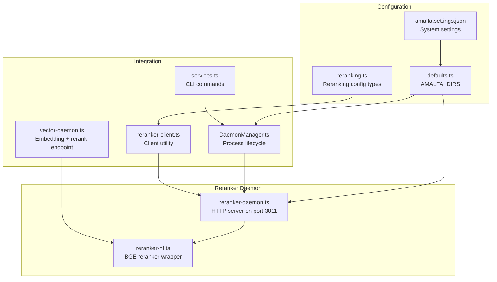
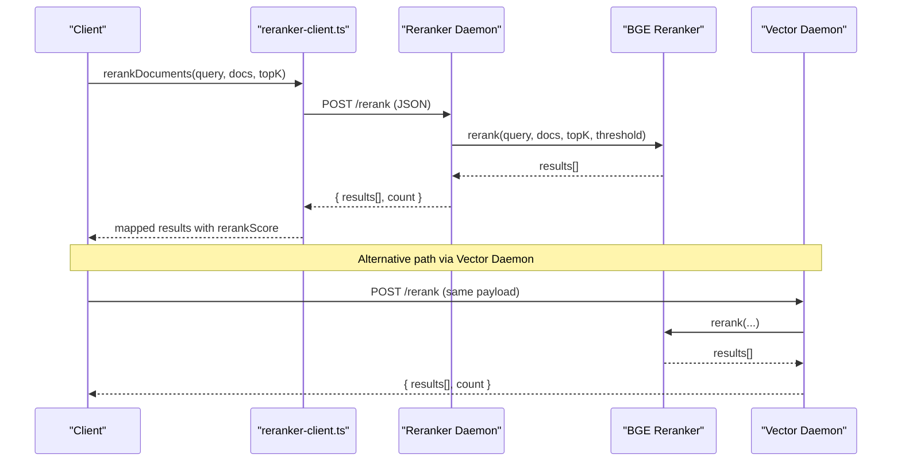
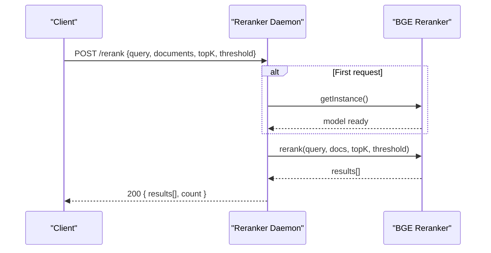
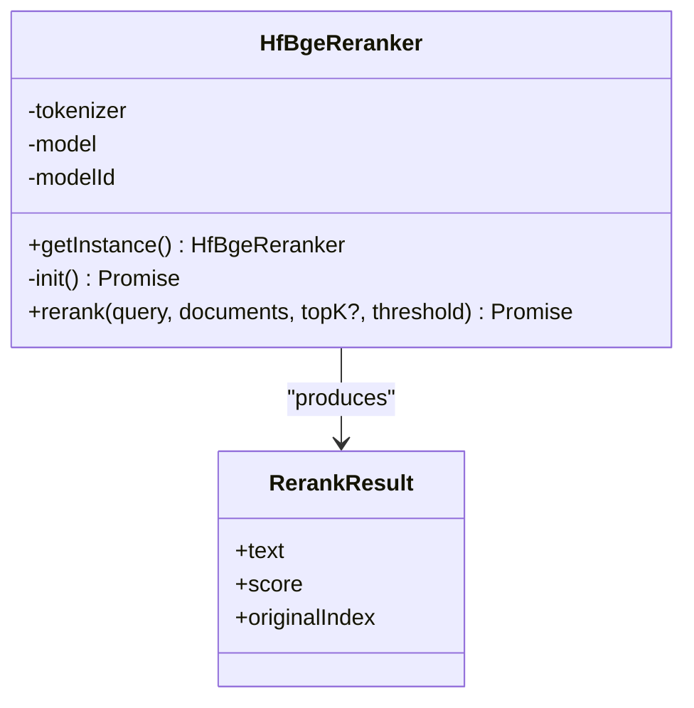
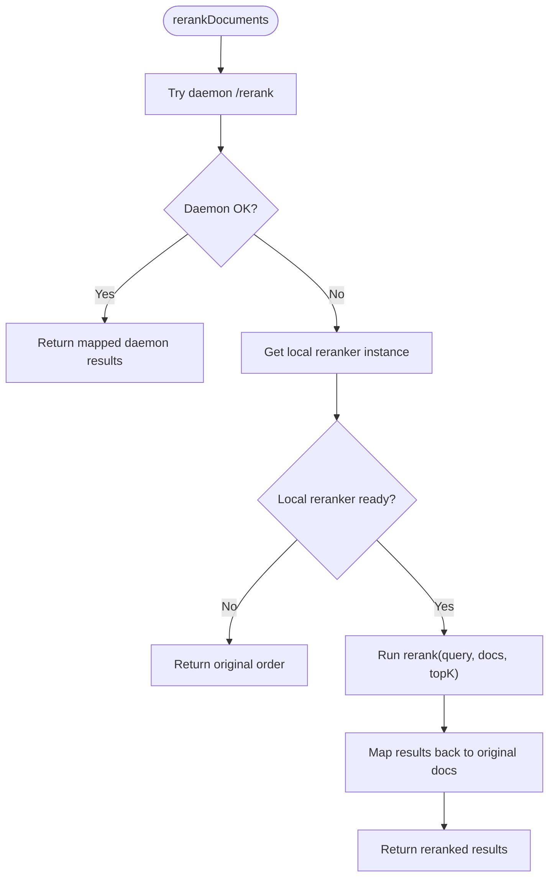
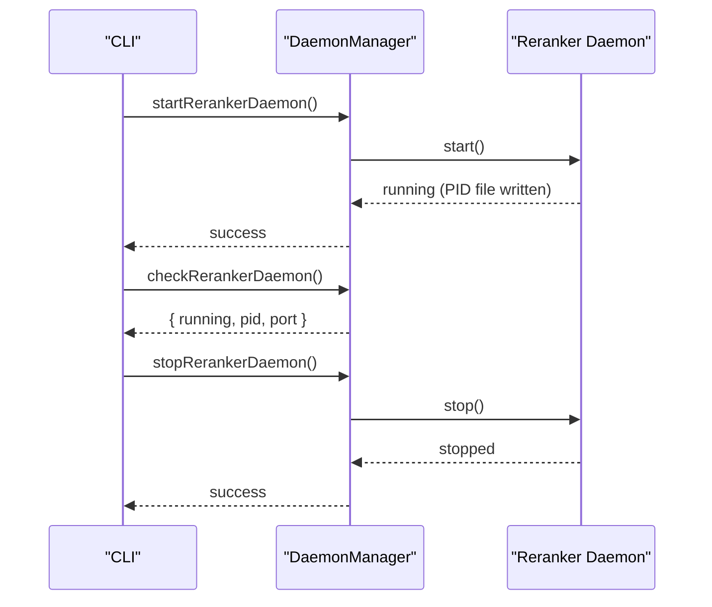
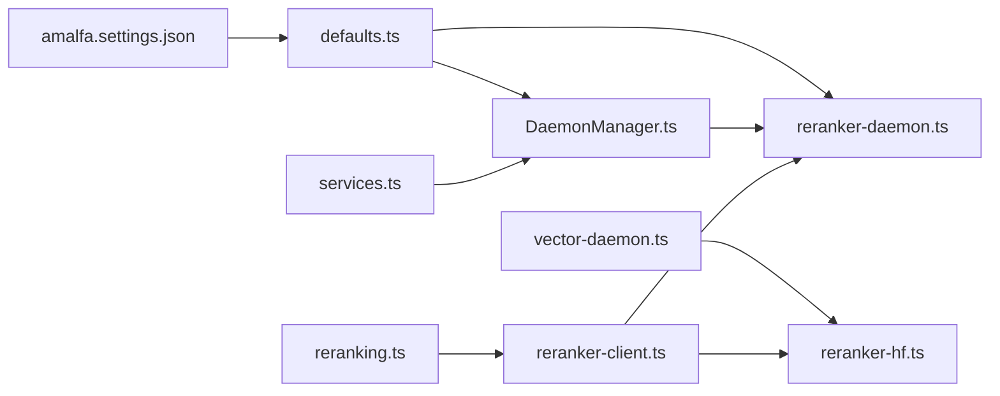

# Reranker Daemon

<cite>
**Referenced Files in This Document**
- [reranker-daemon.ts](file://src/resonance/services/reranker-daemon.ts)
- [reranker-hf.ts](file://src/services/reranker-hf.ts)
- [reranker-client.ts](file://src/utils/reranker-client.ts)
- [vector-daemon.ts](file://src/resonance/services/vector-daemon.ts)
- [DaemonManager.ts](file://src/utils/DaemonManager.ts)
- [services.ts](file://src/cli/commands/services.ts)
- [reranking.ts](file://src/types/reranking.ts)
- [defaults.ts](file://src/config/defaults.ts)
- [amalfa.settings.json](file://amalfa.settings.json)
</cite>

## Table of Contents
1. [Introduction](#introduction)
2. [Project Structure](#project-structure)
3. [Core Components](#core-components)
4. [Architecture Overview](#architecture-overview)
5. [Detailed Component Analysis](#detailed-component-analysis)
6. [Dependency Analysis](#dependency-analysis)
7. [Performance Considerations](#performance-considerations)
8. [Troubleshooting Guide](#troubleshooting-guide)
9. [Conclusion](#conclusion)

## Introduction
The Reranker Daemon is a dedicated HTTP service responsible for cross-encoder reranking of search results using the BGE reranker model. It improves search result relevance by computing contextual scores between queries and candidate documents, returning ranked results with confidence scores. The daemon is designed to be fast, observable, and resilient, with graceful fallback to a local reranking client when the daemon is unavailable.

Key capabilities:
- HTTP endpoints for health checks and reranking
- Lazy model initialization and in-memory caching
- Configurable top-K and threshold filtering
- Integration with the broader search pipeline via the Vector Daemon
- CLI management and lifecycle control

## Project Structure
The Reranker Daemon is implemented as a Bun-based HTTP server with lifecycle management and integrates with the broader system through shared utilities and configuration.

**Diagram sources**
- [reranker-daemon.ts](file://src/resonance/services/reranker-daemon.ts#L1-L145)
- [reranker-hf.ts](file://src/services/reranker-hf.ts#L1-L130)
- [reranker-client.ts](file://src/utils/reranker-client.ts#L1-L225)
- [vector-daemon.ts](file://src/resonance/services/vector-daemon.ts#L1-L234)
- [DaemonManager.ts](file://src/utils/DaemonManager.ts#L1-L260)
- [services.ts](file://src/cli/commands/services.ts#L141-L191)
- [defaults.ts](file://src/config/defaults.ts#L1-L143)
- [amalfa.settings.json](file://amalfa.settings.json#L1-L96)
- [reranking.ts](file://src/types/reranking.ts#L1-L30)

**Section sources**
- [reranker-daemon.ts](file://src/resonance/services/reranker-daemon.ts#L1-L145)
- [reranker-hf.ts](file://src/services/reranker-hf.ts#L1-L130)
- [reranker-client.ts](file://src/utils/reranker-client.ts#L1-L225)
- [vector-daemon.ts](file://src/resonance/services/vector-daemon.ts#L1-L234)
- [DaemonManager.ts](file://src/utils/DaemonManager.ts#L1-L260)
- [services.ts](file://src/cli/commands/services.ts#L141-L191)
- [defaults.ts](file://src/config/defaults.ts#L1-L143)
- [amalfa.settings.json](file://amalfa.settings.json#L1-L96)
- [reranking.ts](file://src/types/reranking.ts#L1-L30)

## Core Components
- Reranker Daemon HTTP server: Exposes /health and /rerank endpoints, manages model lifecycle, and serves reranking requests.
- BGE reranker wrapper: Singleton class that loads the BGE reranker model and performs cross-encoder scoring.
- Reranker client utility: Attempts daemon-based reranking first, falls back to local reranker with graceful degradation.
- Vector Daemon: Provides embedding generation and also exposes a /rerank endpoint that internally uses the BGE reranker.
- Daemon Manager: Unified lifecycle controller for all daemons including the Reranker Daemon.
- CLI commands: Start, stop, restart, and check status of the Reranker Daemon.
- Configuration: Directory structure, environment overrides, and reranking configuration types.

**Section sources**
- [reranker-daemon.ts](file://src/resonance/services/reranker-daemon.ts#L1-L145)
- [reranker-hf.ts](file://src/services/reranker-hf.ts#L1-L130)
- [reranker-client.ts](file://src/utils/reranker-client.ts#L1-L225)
- [vector-daemon.ts](file://src/resonance/services/vector-daemon.ts#L1-L234)
- [DaemonManager.ts](file://src/utils/DaemonManager.ts#L1-L260)
- [services.ts](file://src/cli/commands/services.ts#L141-L191)
- [reranking.ts](file://src/types/reranking.ts#L1-L30)
- [defaults.ts](file://src/config/defaults.ts#L1-L143)

## Architecture Overview
The Reranker Daemon sits alongside the Vector Daemon in the search pipeline. Clients can either:
- Use the Reranker Daemon directly via HTTP
- Use the Vector Daemon’s /rerank endpoint (which internally uses the BGE reranker)
- Use the local reranker client utility, which tries the daemon first and falls back to a local model instance

**Diagram sources**
- [reranker-client.ts](file://src/utils/reranker-client.ts#L1-L225)
- [reranker-daemon.ts](file://src/resonance/services/reranker-daemon.ts#L1-L145)
- [reranker-hf.ts](file://src/services/reranker-hf.ts#L1-L130)
- [vector-daemon.ts](file://src/resonance/services/vector-daemon.ts#L1-L234)

## Detailed Component Analysis

### Reranker Daemon HTTP API
Endpoints:
- GET /health
  - Returns service health, model name, and readiness status.
- POST /rerank
  - Request body: { query: string, documents: string[], topK?: number, threshold?: number }
  - Response body: { results: [{ text, score, originalIndex }], count: number }
  - Errors: 400 for invalid parameters, 500 for internal failures.

Behavior:
- Lazy initialization: Initializes the BGE reranker model on first request.
- Model caching: Keeps the model loaded in memory after initialization.
- Filtering: Applies threshold and topK before returning results.

**Diagram sources**
- [reranker-daemon.ts](file://src/resonance/services/reranker-daemon.ts#L64-L127)
- [reranker-hf.ts](file://src/services/reranker-hf.ts#L74-L128)

**Section sources**
- [reranker-daemon.ts](file://src/resonance/services/reranker-daemon.ts#L43-L141)

### BGE Reranker Implementation
Responsibilities:
- Singleton model loader using Transformers.js (ONNX via WASM/WebGPU).
- Cross-encoder scoring: Formats query-document pairs, tokenizes, infers logits, normalizes to [0,1], filters by threshold, sorts, and applies topK.
- Robust error handling and initialization logging.

**Diagram sources**
- [reranker-hf.ts](file://src/services/reranker-hf.ts#L22-L129)

**Section sources**
- [reranker-hf.ts](file://src/services/reranker-hf.ts#L22-L129)

### Reranker Client Utility
Capabilities:
- Attempts daemon-based reranking first (faster, no local model loading).
- Graceful fallback to local reranker if daemon is unavailable.
- Status reporting and safe error handling with logging.

**Diagram sources**
- [reranker-client.ts](file://src/utils/reranker-client.ts#L137-L209)

**Section sources**
- [reranker-client.ts](file://src/utils/reranker-client.ts#L1-L225)

### Vector Daemon Integration
The Vector Daemon provides:
- Embedding generation endpoint (/embed)
- Reranking endpoint (/rerank) powered by the same BGE reranker used by the Reranker Daemon
- Health endpoint indicating readiness and whether the reranker is loaded

This enables clients to use a single daemon for both embeddings and reranking, simplifying deployment and reducing overhead.

**Section sources**
- [vector-daemon.ts](file://src/resonance/services/vector-daemon.ts#L72-L234)

### Daemon Lifecycle Management
The Daemon Manager centralizes:
- PID file management and process detection
- Start/stop/restart/status operations for the Reranker Daemon
- Unified CLI commands for daemon control

**Diagram sources**
- [DaemonManager.ts](file://src/utils/DaemonManager.ts#L118-L149)
- [services.ts](file://src/cli/commands/services.ts#L141-L191)

**Section sources**
- [DaemonManager.ts](file://src/utils/DaemonManager.ts#L1-L260)
- [services.ts](file://src/cli/commands/services.ts#L141-L191)

### Configuration Options
- Environment override: RERANKER_PORT controls the daemon port (default 3011).
- Directory structure: AMALFA_DIRS defines logs and runtime locations for PID/log files.
- Reranking configuration types: Mode selection and parameters (topK, threshold) are defined in reranking types.

Note: The provided configuration file does not include explicit reranking settings; reranking parameters are applied at runtime in the client utility.

**Section sources**
- [reranker-daemon.ts](file://src/resonance/services/reranker-daemon.ts#L16-L24)
- [defaults.ts](file://src/config/defaults.ts#L16-L59)
- [reranking.ts](file://src/types/reranking.ts#L7-L29)

## Dependency Analysis
High-level dependencies:
- reranker-daemon.ts depends on reranker-hf.ts for model operations.
- reranker-client.ts depends on reranker-hf.ts and the daemon endpoint.
- vector-daemon.ts depends on reranker-hf.ts for reranking.
- DaemonManager.ts orchestrates lifecycle for all daemons including the Reranker Daemon.
- CLI commands delegate to DaemonManager for daemon control.

**Diagram sources**
- [reranker-client.ts](file://src/utils/reranker-client.ts#L1-L225)
- [reranker-daemon.ts](file://src/resonance/services/reranker-daemon.ts#L1-L145)
- [reranker-hf.ts](file://src/services/reranker-hf.ts#L1-L130)
- [vector-daemon.ts](file://src/resonance/services/vector-daemon.ts#L1-L234)
- [DaemonManager.ts](file://src/utils/DaemonManager.ts#L1-L260)
- [services.ts](file://src/cli/commands/services.ts#L141-L191)
- [defaults.ts](file://src/config/defaults.ts#L1-L143)
- [amalfa.settings.json](file://amalfa.settings.json#L1-L96)
- [reranking.ts](file://src/types/reranking.ts#L1-L30)

**Section sources**
- [reranker-client.ts](file://src/utils/reranker-client.ts#L1-L225)
- [reranker-daemon.ts](file://src/resonance/services/reranker-daemon.ts#L1-L145)
- [reranker-hf.ts](file://src/services/reranker-hf.ts#L1-L130)
- [vector-daemon.ts](file://src/resonance/services/vector-daemon.ts#L1-L234)
- [DaemonManager.ts](file://src/utils/DaemonManager.ts#L1-L260)
- [services.ts](file://src/cli/commands/services.ts#L141-L191)
- [defaults.ts](file://src/config/defaults.ts#L1-L143)
- [amalfa.settings.json](file://amalfa.settings.json#L1-L96)
- [reranking.ts](file://src/types/reranking.ts#L1-L30)

## Performance Considerations
- Model caching: Both the Reranker Daemon and Vector Daemon keep the BGE model loaded in memory after lazy initialization, avoiding repeated model loading overhead.
- Lazy initialization: The model is only loaded on first request, reducing cold-start impact for idle daemons.
- Client fallback: The reranker client attempts daemon reranking first; if unavailable, it falls back to a local instance, balancing performance and reliability.
- Batching: The current implementation processes batches as single requests. For very large batches, consider splitting into smaller chunks to manage memory and latency.
- Parallelism: The Bun-based server is single-threaded per worker; scale horizontally by running multiple instances behind a load balancer if throughput demands exceed a single instance.
- Timeout handling: The client sets a 5-second timeout for daemon requests to prevent hanging on slow or unresponsive daemons.

[No sources needed since this section provides general guidance]

## Troubleshooting Guide
Common issues and resolutions:
- Daemon not responding
  - Verify the daemon is running and listening on the configured port (default 3011).
  - Use the CLI to check status and restart if needed.
  - Inspect the daemon log file located under the logs directory.
- Model loading failures
  - Check the daemon logs for initialization errors.
  - Ensure sufficient memory and disk space for model cache.
  - Confirm network access for model downloads if using Transformers.js.
- Slow reranking performance
  - Prefer daemon-based reranking over local fallback.
  - Reduce batch sizes or split large requests into smaller chunks.
  - Monitor system resources and consider scaling out multiple daemon instances.
- API connectivity problems
  - Validate the daemon endpoint and port configuration.
  - Check firewall and network policies blocking localhost traffic.
  - Use the health endpoint to confirm readiness before sending rerank requests.

Operational commands:
- Check daemon status: services status
- Start daemon: services start
- Stop daemon: services stop
- Restart daemon: services restart

**Section sources**
- [services.ts](file://src/cli/commands/services.ts#L141-L191)
- [DaemonManager.ts](file://src/utils/DaemonManager.ts#L118-L149)
- [defaults.ts](file://src/config/defaults.ts#L16-L59)

## Conclusion
The Reranker Daemon provides a fast, reliable, and observable reranking service for contextual scoring of search results. By keeping the BGE model loaded in memory and exposing a simple HTTP API, it integrates seamlessly into the search pipeline. The client utility ensures resilience through graceful fallback, while the Daemon Manager offers straightforward lifecycle control. Together with the Vector Daemon, the system supports efficient hybrid search workflows with both embeddings and reranking capabilities.