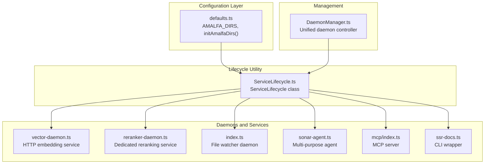
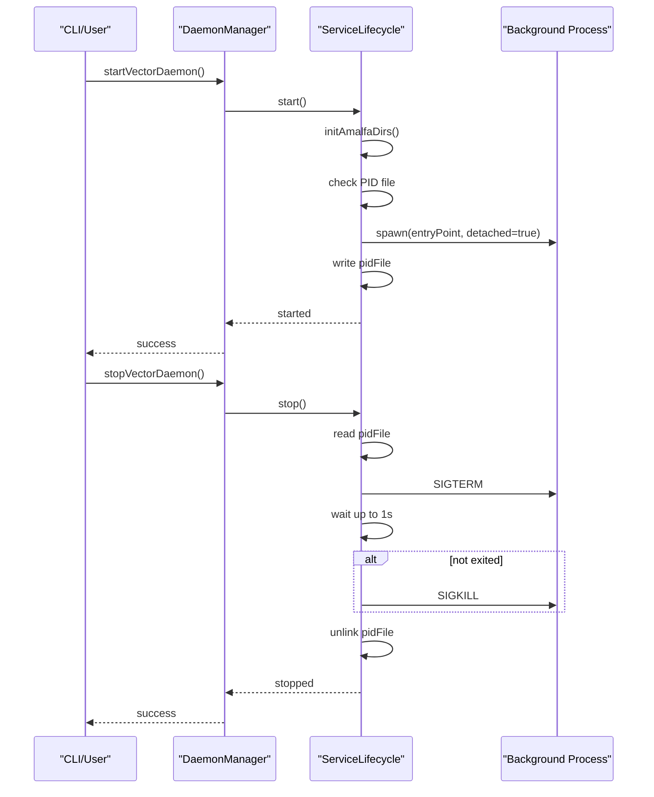
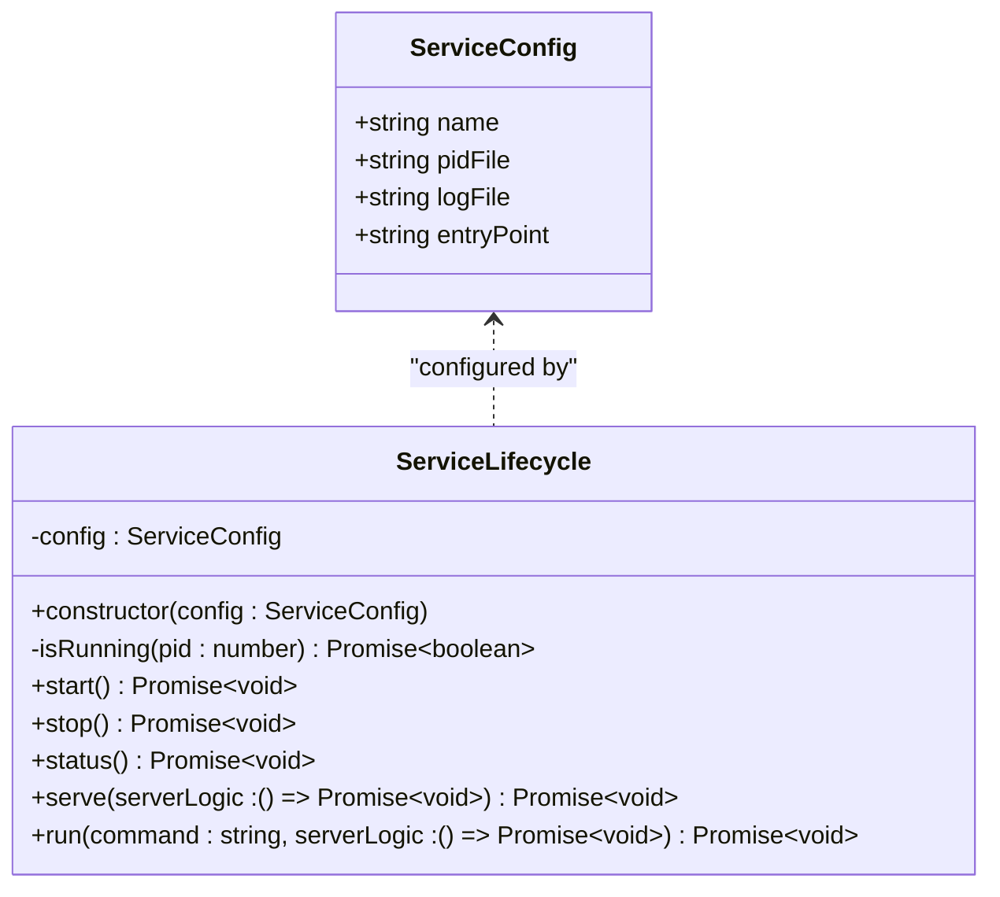
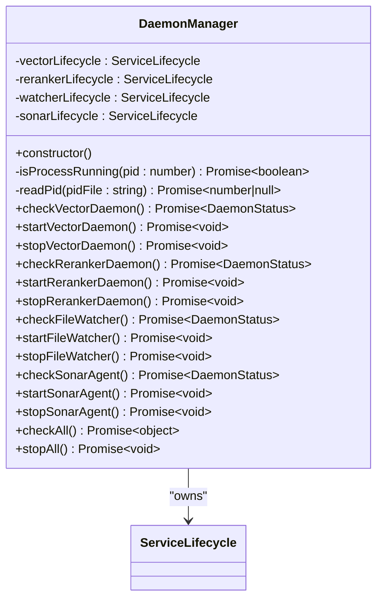
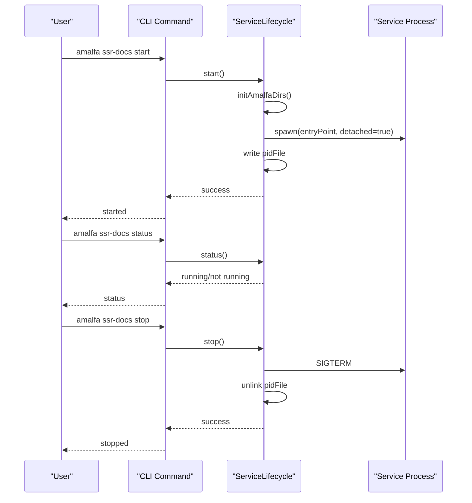
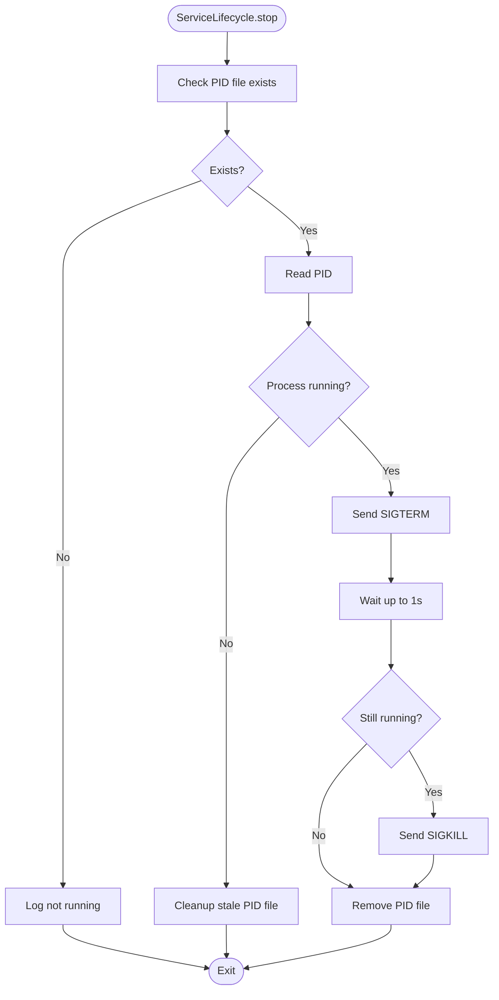
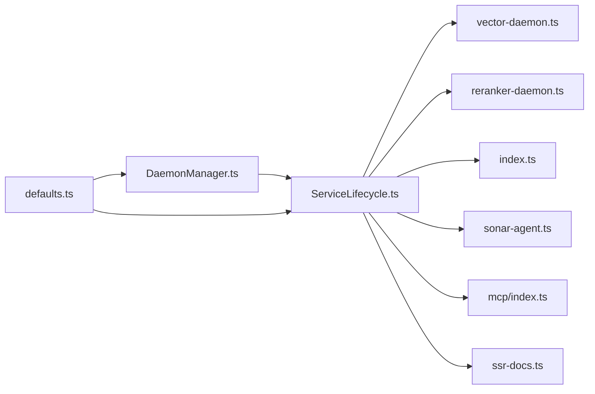

# Service Lifecycle Management

<cite>
**Referenced Files in This Document**
- [ServiceLifecycle.ts](file://src/utils/ServiceLifecycle.ts)
- [DaemonManager.ts](file://src/utils/DaemonManager.ts)
- [defaults.ts](file://src/config/defaults.ts)
- [vector-daemon.ts](file://src/resonance/services/vector-daemon.ts)
- [reranker-daemon.ts](file://src/resonance/services/reranker-daemon.ts)
- [index.ts](file://src/daemon/index.ts)
- [sonar-agent.ts](file://src/daemon/sonar-agent.ts)
- [mcp/index.ts](file://src/mcp/index.ts)
- [ssr-docs.ts](file://src/cli/commands/ssr-docs.ts)
</cite>

## Table of Contents
1. [Introduction](#introduction)
2. [Project Structure](#project-structure)
3. [Core Components](#core-components)
4. [Architecture Overview](#architecture-overview)
5. [Detailed Component Analysis](#detailed-component-analysis)
6. [Dependency Analysis](#dependency-analysis)
7. [Performance Considerations](#performance-considerations)
8. [Troubleshooting Guide](#troubleshooting-guide)
9. [Conclusion](#conclusion)

## Introduction
This document explains the ServiceLifecycle pattern used across Amalfa's daemon orchestration. It describes a unified approach to managing background services with consistent PID file handling, log file management, and graceful startup/shutdown sequences. The pattern standardizes lifecycle operations (start, stop, restart, status, serve) and ensures reliable process management, signal handling, and error recovery across all Amalfa daemons.

## Project Structure
The ServiceLifecycle pattern is implemented in a dedicated utility module and consumed by multiple daemons and services. The configuration layer defines the standard directory structure used by all services.

**Diagram sources**
- [defaults.ts](file://src/config/defaults.ts#L15-L59)
- [ServiceLifecycle.ts](file://src/utils/ServiceLifecycle.ts#L12-L208)
- [vector-daemon.ts](file://src/resonance/services/vector-daemon.ts#L20-L26)
- [reranker-daemon.ts](file://src/resonance/services/reranker-daemon.ts#L18-L24)
- [index.ts](file://src/daemon/index.ts#L29-L35)
- [sonar-agent.ts](file://src/daemon/sonar-agent.ts#L49-L55)
- [mcp/index.ts](file://src/mcp/index.ts#L35-L42)
- [ssr-docs.ts](file://src/cli/commands/ssr-docs.ts#L6-L11)
- [DaemonManager.ts](file://src/utils/DaemonManager.ts#L17-L51)

**Section sources**
- [defaults.ts](file://src/config/defaults.ts#L15-L59)
- [ServiceLifecycle.ts](file://src/utils/ServiceLifecycle.ts#L12-L208)
- [DaemonManager.ts](file://src/utils/DaemonManager.ts#L17-L51)

## Core Components
- ServiceLifecycle: Provides a standardized lifecycle for background services, including PID file management, log file handling, process spawning, signal handling, and status reporting.
- DaemonManager: Orchestrates multiple Amalfa daemons (vector, reranker, file watcher, Sonar agent) using ServiceLifecycle instances configured per daemon.
- Configuration Utilities: Define standard directories (.amalfa/logs, .amalfa/runtime) and ensure they exist before starting services.

Key responsibilities:
- PID file creation, validation, and cleanup
- Log file initialization and redirection
- Detached process spawning and foreground serve mode
- Graceful shutdown with SIGTERM and fallback SIGKILL
- Status checks and stale PID handling
- Signal handlers for clean exits and cleanup

**Section sources**
- [ServiceLifecycle.ts](file://src/utils/ServiceLifecycle.ts#L12-L208)
- [DaemonManager.ts](file://src/utils/DaemonManager.ts#L17-L51)
- [defaults.ts](file://src/config/defaults.ts#L42-L59)

## Architecture Overview
The ServiceLifecycle pattern is applied consistently across Amalfa daemons. Each daemon creates a ServiceLifecycle instance with its own configuration and delegates its main logic to the lifecycle dispatcher. DaemonManager centralizes management of multiple daemons and exposes higher-level operations.

**Diagram sources**
- [DaemonManager.ts](file://src/utils/DaemonManager.ts#L103-L114)
- [ServiceLifecycle.ts](file://src/utils/ServiceLifecycle.ts#L27-L108)

**Section sources**
- [DaemonManager.ts](file://src/utils/DaemonManager.ts#L103-L114)
- [ServiceLifecycle.ts](file://src/utils/ServiceLifecycle.ts#L27-L108)

## Detailed Component Analysis

### ServiceLifecycle Class
The ServiceLifecycle class encapsulates the complete lifecycle of a background service. It accepts a ServiceConfig with name, pidFile, logFile, and entryPoint, and exposes methods for lifecycle control and status inspection.

Constructor parameters:
- name: Human-readable service identifier used in logs
- pidFile: Path to the PID file for process tracking
- logFile: Path to the log file for stdout/stderr redirection
- entryPoint: Path to the script that implements the service logic

Standardized lifecycle methods:
- start(): Initializes directories, clears stale PID files, truncates logs, spawns a detached subprocess, writes the PID file, and logs outcomes.
- stop(): Reads the PID file, sends SIGTERM, waits up to 1 second, and sends SIGKILL if needed, then removes the PID file.
- status(): Reports whether the service is running, not running, or stopped based on PID file presence and process liveness.
- serve(serverLogic): Writes the current process PID to the PID file, registers signal handlers for SIGINT/SIGTERM, and cleans up the PID file on exit or crash.
- run(command, serverLogic): Dispatches CLI commands to the appropriate lifecycle method.

Implementation highlights:
- Process validation uses process.kill(pid, 0) to detect liveness without sending signals.
- PID file writing uses Node's fs for reliability when Bun.write may have synchronization issues.
- Foreground serve mode registers cleanup handlers to remove PID files on normal and abnormal termination.
- Graceful shutdown sequence with SIGTERM followed by SIGKILL after timeout.

**Diagram sources**
- [ServiceLifecycle.ts](file://src/utils/ServiceLifecycle.ts#L5-L13)

**Section sources**
- [ServiceLifecycle.ts](file://src/utils/ServiceLifecycle.ts#L5-L208)

### DaemonManager Integration
DaemonManager composes multiple ServiceLifecycle instances for different Amalfa subsystems and provides higher-level operations for status and control.

Managed daemons:
- Vector Daemon: HTTP service for embeddings and reranking
- Reranker Daemon: Dedicated reranking service
- File Watcher Daemon: Incremental ingestion daemon
- Sonar Agent: Multi-purpose agent with HTTP API and task processing

Operations:
- Per-daemon status checks using PID file parsing and process liveness
- Start/stop operations with short delays to allow daemons to initialize
- Parallel status and stop operations across all daemons

**Diagram sources**
- [DaemonManager.ts](file://src/utils/DaemonManager.ts#L17-L51)

**Section sources**
- [DaemonManager.ts](file://src/utils/DaemonManager.ts#L17-L259)

### Practical Examples

#### Daemon Registration and Lifecycle Transitions
- Vector Daemon registration and lifecycle:
  - Registration: Creates a ServiceLifecycle with name "Vector-Daemon", pidFile under .amalfa/runtime, logFile under .amalfa/logs, and entryPoint pointing to the vector daemon script.
  - Lifecycle transitions: start() spawns the daemon, stop() gracefully terminates it, status() reports running/not running, and serve() runs in foreground mode with signal handling.

- Reranker Daemon registration and lifecycle:
  - Registration: Similar configuration for the reranker daemon with its own pidFile/logFile and entryPoint.
  - Lifecycle transitions: Same standardized methods apply.

- File Watcher Daemon registration and lifecycle:
  - Registration: Uses the main daemon script as entryPoint with its own pidFile/logFile.
  - Lifecycle transitions: start()/stop()/status() managed via ServiceLifecycle.

- Sonar Agent registration and lifecycle:
  - Registration: Uses the Sonar agent script as entryPoint with its own pidFile/logFile.
  - Lifecycle transitions: start()/stop()/status() managed via ServiceLifecycle.

- MCP Server registration and lifecycle:
  - Registration: Uses the MCP server script as entryPoint with its own pidFile/logFile.
  - Lifecycle transitions: start()/stop()/status() managed via ServiceLifecycle.

- CLI SSR Docs wrapper:
  - Registration: Creates a ServiceLifecycle with name "SSR-Docs" and delegates CLI actions to start/stop/status/restart.

**Diagram sources**
- [ssr-docs.ts](file://src/cli/commands/ssr-docs.ts#L18-L70)
- [ServiceLifecycle.ts](file://src/utils/ServiceLifecycle.ts#L27-L108)

**Section sources**
- [vector-daemon.ts](file://src/resonance/services/vector-daemon.ts#L20-L26)
- [reranker-daemon.ts](file://src/resonance/services/reranker-daemon.ts#L18-L24)
- [index.ts](file://src/daemon/index.ts#L29-L35)
- [sonar-agent.ts](file://src/daemon/sonar-agent.ts#L49-L55)
- [mcp/index.ts](file://src/mcp/index.ts#L35-L42)
- [ssr-docs.ts](file://src/cli/commands/ssr-docs.ts#L18-L70)

### Process Management and Signal Handling
- Detached process spawning: The start() method spawns a subprocess with detached: true, redirecting stdout/stderr to the configured log file, inheriting environment variables from the parent process.
- Foreground serve mode: The serve() method writes the current process PID to the PID file and registers signal handlers for SIGINT and SIGTERM to perform cleanup and exit cleanly.
- Graceful shutdown: The stop() method sends SIGTERM and waits up to 1 second for the process to exit. If the process remains alive, it sends SIGKILL and removes the PID file.
- Stale PID handling: Both start() and stop() detect stale PID files and handle them appropriately to avoid conflicts.

**Diagram sources**
- [ServiceLifecycle.ts](file://src/utils/ServiceLifecycle.ts#L72-L108)

**Section sources**
- [ServiceLifecycle.ts](file://src/utils/ServiceLifecycle.ts#L27-L108)

### Relationship Between ServiceLifecycle and DaemonManager
- Composition: DaemonManager instantiates ServiceLifecycle for each daemon type with appropriate configuration (name, pidFile, logFile, entryPoint).
- Coordination: DaemonManager orchestrates lifecycle operations across multiple daemons, providing aggregated status and bulk stop operations.
- Consistency: By using the same ServiceLifecycle pattern, all daemons share identical PID file semantics, log file management, and signal handling behavior.

**Section sources**
- [DaemonManager.ts](file://src/utils/DaemonManager.ts#L17-L51)

## Dependency Analysis
The ServiceLifecycle pattern introduces minimal coupling and maximizes cohesion around process lifecycle concerns. Each daemon depends on ServiceLifecycle for lifecycle operations, while DaemonManager depends on ServiceLifecycle to coordinate multiple daemons.

**Diagram sources**
- [ServiceLifecycle.ts](file://src/utils/ServiceLifecycle.ts#L12-L208)
- [DaemonManager.ts](file://src/utils/DaemonManager.ts#L17-L51)
- [defaults.ts](file://src/config/defaults.ts#L42-L59)

**Section sources**
- [ServiceLifecycle.ts](file://src/utils/ServiceLifecycle.ts#L12-L208)
- [DaemonManager.ts](file://src/utils/DaemonManager.ts#L17-L51)
- [defaults.ts](file://src/config/defaults.ts#L42-L59)

## Performance Considerations
- Process spawning overhead: Spawning detached processes introduces minimal overhead compared to the benefits of isolation and lifecycle management.
- Log file I/O: Redirecting stdout/stderr to files avoids terminal contention and enables centralized log management.
- PID file reliability: Using Node's fs for PID file writes reduces race conditions and improves reliability.
- Graceful shutdown: The 1-second wait for SIGTERM allows services to flush buffers and close connections gracefully.

## Troubleshooting Guide
Common issues and resolutions:
- Stale PID file: If a PID file exists but the process is not running, ServiceLifecycle detects and cleans it up during start/stop operations. Manually removing stale PID files resolves persistent "already running" messages.
- Permission errors: Ensure the .amalfa directory and its subdirectories exist and are writable by the user running the service.
- Environment variables: ServiceLifecycle inherits process.env for the spawned process, ensuring .env variables are available when the parent process loads them.
- Signal handling: Foreground serve mode registers signal handlers to clean up PID files on SIGINT/SIGTERM. If a service appears stuck, check for proper signal propagation.

**Section sources**
- [ServiceLifecycle.ts](file://src/utils/ServiceLifecycle.ts#L32-L42)
- [ServiceLifecycle.ts](file://src/utils/ServiceLifecycle.ts#L80-L98)
- [ServiceLifecycle.ts](file://src/utils/ServiceLifecycle.ts#L139-L170)

## Conclusion
The ServiceLifecycle pattern provides a consistent, reliable foundation for managing Amalfa's background services. By standardizing PID file handling, log file management, process spawning, and signal handling, it ensures predictable lifecycle behavior across all daemons. DaemonManager leverages this pattern to offer unified control and status monitoring, enabling robust orchestration of the entire system.