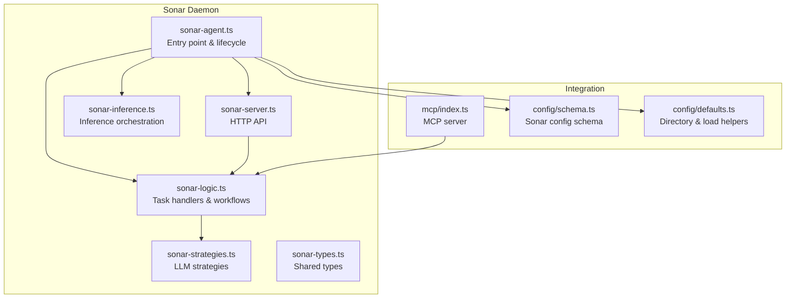
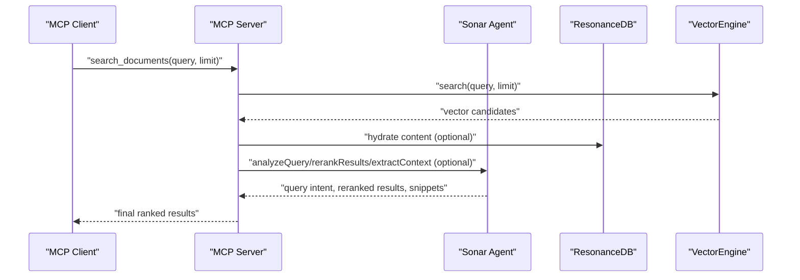
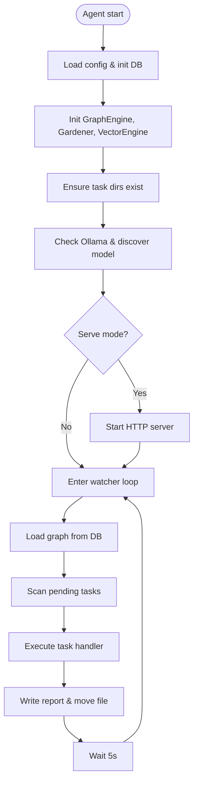
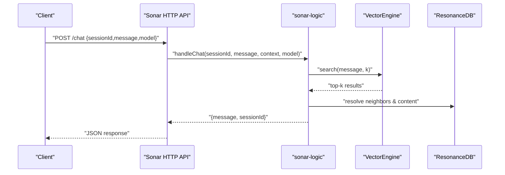
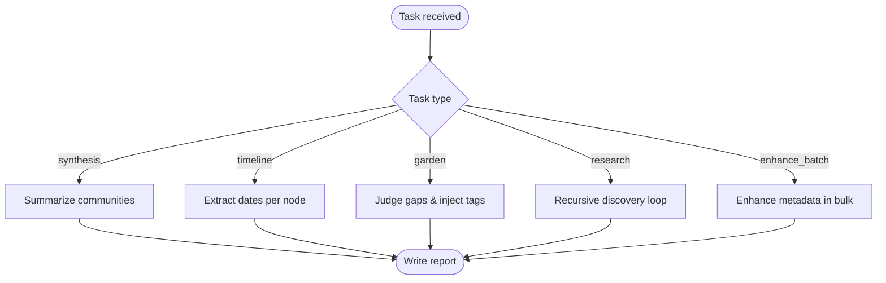
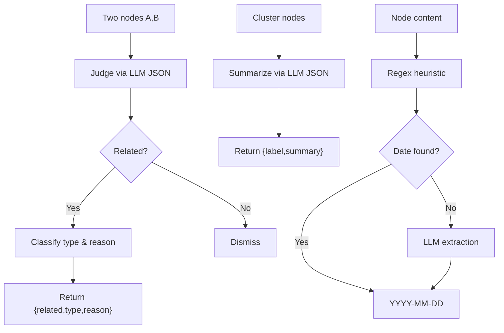
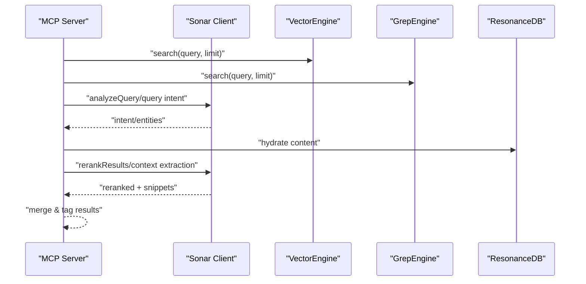
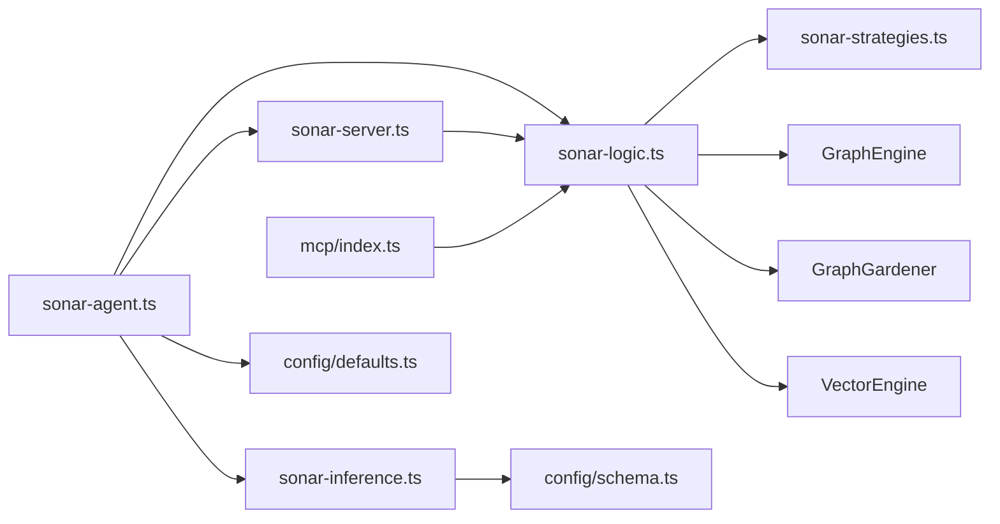

# Sonar Agent

<cite>
**Referenced Files in This Document**
- [src/daemon/sonar-agent.ts](file://src/daemon/sonar-agent.ts)
- [src/daemon/sonar-logic.ts](file://src/daemon/sonar-logic.ts)
- [src/daemon/sonar-strategies.ts](file://src/daemon/sonar-strategies.ts)
- [src/daemon/sonar-server.ts](file://src/daemon/sonar-server.ts)
- [src/daemon/sonar-inference.ts](file://src/daemon/sonar-inference.ts)
- [src/daemon/sonar-types.ts](file://src/daemon/sonar-types.ts)
- [src/mcp/index.ts](file://src/mcp/index.ts)
- [src/config/defaults.ts](file://src/config/defaults.ts)
- [src/config/schema.ts](file://src/config/schema.ts)
- [docs/AGENT_PROTOCOLS.md](file://docs/AGENT_PROTOCOLS.md)
- [docs/MCP-TOOLS.md](file://docs/MCP-TOOLS.md)
- [docs/ARCHITECTURE.md](file://docs/ARCHITECTURE.md)
</cite>

## Table of Contents
1. [Introduction](#introduction)
2. [Project Structure](#project-structure)
3. [Core Components](#core-components)
4. [Architecture Overview](#architecture-overview)
5. [Detailed Component Analysis](#detailed-component-analysis)
6. [Dependency Analysis](#dependency-analysis)
7. [Performance Considerations](#performance-considerations)
8. [Troubleshooting Guide](#troubleshooting-guide)
9. [Conclusion](#conclusion)
10. [Appendices](#appendices)

## Introduction
The Sonar Agent is the primary AI research and synthesis engine within the Amalfa ecosystem. It orchestrates autonomous discovery, knowledge graph enhancement, and cross-domain analysis through a modular task system, LLM-powered strategies, and tight integration with the Model Context Protocol (MCP). The agent operates as a micro-daemon with an HTTP API, a file-based task queue, and a suite of reasoning strategies for synthesis, timeline anchoring, gap detection, and autonomous research.

## Project Structure
The Sonar Agent resides under the daemon module and integrates with the broader Amalfa architecture:
- Daemon entry point and lifecycle controller
- Task execution engine (research, synthesis, timeline, gardening, batch metadata enhancement)
- HTTP server exposing chat, search, and metadata endpoints
- Inference orchestration supporting local Ollama and cloud providers
- Configuration schema and directory structure for task queues and runtime artifacts

**Diagram sources**
- [src/daemon/sonar-agent.ts](file://src/daemon/sonar-agent.ts#L1-L221)
- [src/daemon/sonar-logic.ts](file://src/daemon/sonar-logic.ts#L1-L685)
- [src/daemon/sonar-strategies.ts](file://src/daemon/sonar-strategies.ts#L1-L187)
- [src/daemon/sonar-server.ts](file://src/daemon/sonar-server.ts#L1-L134)
- [src/daemon/sonar-inference.ts](file://src/daemon/sonar-inference.ts#L1-L120)
- [src/daemon/sonar-types.ts](file://src/daemon/sonar-types.ts#L1-L69)
- [src/mcp/index.ts](file://src/mcp/index.ts#L1-L748)
- [src/config/schema.ts](file://src/config/schema.ts#L198-L233)
- [src/config/defaults.ts](file://src/config/defaults.ts#L15-L59)

**Section sources**
- [src/daemon/sonar-agent.ts](file://src/daemon/sonar-agent.ts#L1-L221)
- [src/daemon/sonar-server.ts](file://src/daemon/sonar-server.ts#L1-L134)
- [src/daemon/sonar-logic.ts](file://src/daemon/sonar-logic.ts#L1-L685)
- [src/daemon/sonar-strategies.ts](file://src/daemon/sonar-strategies.ts#L1-L187)
- [src/daemon/sonar-inference.ts](file://src/daemon/sonar-inference.ts#L1-L120)
- [src/daemon/sonar-types.ts](file://src/daemon/sonar-types.ts#L1-L69)
- [src/mcp/index.ts](file://src/mcp/index.ts#L1-L748)
- [src/config/schema.ts](file://src/config/schema.ts#L198-L233)
- [src/config/defaults.ts](file://src/config/defaults.ts#L15-L59)

## Core Components
- Task Queue and Execution
  - Pending/processing/completed directories managed by the agent
  - Task routing by type: synthesis, timeline, garden, research, enhance_batch
  - Per-task model selection and throttling for free-tier providers
- HTTP API
  - Health, chat, metadata enhancement, search analysis, reranking, and context extraction
- Inference Orchestrator
  - Local Ollama and cloud OpenRouter support with API key handling and provider-specific headers
  - Model resolution precedence: override > cloud model > discovered > config > default
- Strategies
  - Relationship judgment, community synthesis, temporal anchoring
- MCP Integration
  - Sonar client used by MCP tools for query analysis, reranking, and context extraction
  - Hybrid retrieval (vector + grep) with cross-encoder reranking and optional LLM refinement

**Section sources**
- [src/daemon/sonar-agent.ts](file://src/daemon/sonar-agent.ts#L106-L179)
- [src/daemon/sonar-logic.ts](file://src/daemon/sonar-logic.ts#L323-L465)
- [src/daemon/sonar-server.ts](file://src/daemon/sonar-server.ts#L40-L130)
- [src/daemon/sonar-inference.ts](file://src/daemon/sonar-inference.ts#L19-L119)
- [src/daemon/sonar-strategies.ts](file://src/daemon/sonar-strategies.ts#L10-L187)
- [src/mcp/index.ts](file://src/mcp/index.ts#L289-L476)

## Architecture Overview
The Sonar Agent sits at the intersection of the MCP server and the knowledge graph, enabling agents to perform:
- Graph-first discovery via MCP tools
- LLM-powered refinement of search results
- Automated synthesis and timeline anchoring
- Gap detection and recommendation

**Diagram sources**
- [src/mcp/index.ts](file://src/mcp/index.ts#L267-L512)
- [src/daemon/sonar-logic.ts](file://src/daemon/sonar-logic.ts#L184-L319)
- [src/daemon/sonar-server.ts](file://src/daemon/sonar-server.ts#L93-L130)

**Section sources**
- [docs/AGENT_PROTOCOLS.md](file://docs/AGENT_PROTOCOLS.md#L1-L30)
- [docs/MCP-TOOLS.md](file://docs/MCP-TOOLS.md#L1-L715)
- [docs/ARCHITECTURE.md](file://docs/ARCHITECTURE.md#L188-L221)

## Detailed Component Analysis

### Sonar Agent Entry and Lifecycle
- Loads configuration and initializes ResonanceDB, VectorEngine, and GraphGardener
- Ensures task directories exist and performs initial health checks for Ollama availability
- Starts HTTP server when in serve mode and enters a continuous loop to process pending tasks
- Task execution writes human-readable reports and supports notifications

**Diagram sources**
- [src/daemon/sonar-agent.ts](file://src/daemon/sonar-agent.ts#L60-L116)
- [src/daemon/sonar-agent.ts](file://src/daemon/sonar-agent.ts#L138-L179)

**Section sources**
- [src/daemon/sonar-agent.ts](file://src/daemon/sonar-agent.ts#L60-L116)
- [src/daemon/sonar-agent.ts](file://src/daemon/sonar-agent.ts#L138-L179)

### HTTP API Surface
- Health endpoint reports provider and model status
- Chat endpoint augments user queries with retrieved context from the knowledge graph
- Metadata enhancement endpoint enriches node metadata using LLM
- Search endpoints: analyze query intent, rerank results, and extract context snippets

**Diagram sources**
- [src/daemon/sonar-server.ts](file://src/daemon/sonar-server.ts#L58-L81)
- [src/daemon/sonar-logic.ts](file://src/daemon/sonar-logic.ts#L104-L179)

**Section sources**
- [src/daemon/sonar-server.ts](file://src/daemon/sonar-server.ts#L40-L130)
- [src/daemon/sonar-logic.ts](file://src/daemon/sonar-logic.ts#L104-L179)

### Task Execution Workflows
- Synthesis: Detects communities and generates canonical labels and summaries; optionally writes synthesis nodes
- Timeline: Anchors nodes to dates using regex heuristics and LLM extraction
- Garden: Finds semantic and structural gaps, applies LLM judgment, and injects tags
- Research: Iteratively searches, reads, explores, and verifies conclusions using a chain-of-thought prompt
- Batch Enhancement: Enhances metadata for unenhanced nodes in bulk

**Diagram sources**
- [src/daemon/sonar-logic.ts](file://src/daemon/sonar-logic.ts#L323-L465)
- [src/daemon/sonar-logic.ts](file://src/daemon/sonar-logic.ts#L470-L664)
- [src/daemon/sonar-logic.ts](file://src/daemon/sonar-logic.ts#L69-L99)

**Section sources**
- [src/daemon/sonar-logic.ts](file://src/daemon/sonar-logic.ts#L323-L465)
- [src/daemon/sonar-logic.ts](file://src/daemon/sonar-logic.ts#L470-L664)
- [src/daemon/sonar-logic.ts](file://src/daemon/sonar-logic.ts#L69-L99)

### LLM Strategies
- Judge Relationship: Determines if two nodes should be linked and classifies the relationship
- Summarize Community: Generates a canonical label and concise synthesis for a cluster
- Extract Date: Heuristic-first date extraction with LLM fallback

**Diagram sources**
- [src/daemon/sonar-strategies.ts](file://src/daemon/sonar-strategies.ts#L34-L84)
- [src/daemon/sonar-strategies.ts](file://src/daemon/sonar-strategies.ts#L90-L142)
- [src/daemon/sonar-strategies.ts](file://src/daemon/sonar-strategies.ts#L148-L186)

**Section sources**
- [src/daemon/sonar-strategies.ts](file://src/daemon/sonar-strategies.ts#L34-L84)
- [src/daemon/sonar-strategies.ts](file://src/daemon/sonar-strategies.ts#L90-L142)
- [src/daemon/sonar-strategies.ts](file://src/daemon/sonar-strategies.ts#L148-L186)

### MCP Integration and Tool Access
- Sonar client embedded in MCP server enables:
  - Query intent analysis
  - Result reranking with cross-encoder and optional LLM refinement
  - Context extraction for top results
- MCP tools leverage:
  - Vector search (FastEmbed bi-encoder)
  - Grep engine for keyword hits
  - Cross-encoder reranking (BGE)
  - Optional Sonar LLM refinement

**Diagram sources**
- [src/mcp/index.ts](file://src/mcp/index.ts#L267-L512)
- [src/daemon/sonar-logic.ts](file://src/daemon/sonar-logic.ts#L184-L319)

**Section sources**
- [src/mcp/index.ts](file://src/mcp/index.ts#L289-L476)
- [docs/MCP-TOOLS.md](file://docs/MCP-TOOLS.md#L1-L715)

## Dependency Analysis
- Internal dependencies
  - sonar-agent depends on sonar-logic, sonar-server, sonar-inference, and configuration helpers
  - sonar-logic depends on GraphEngine, GraphGardener, VectorEngine, and strategies
  - sonar-server depends on sonar-logic and exposes HTTP endpoints
  - MCP server depends on sonar-client and uses sonar-logic for refinement
- External dependencies
  - Ollama for local inference
  - OpenRouter for cloud inference with API keys
  - FastEmbed and BGE models for retrieval and reranking
  - SQLite via ResonanceDB for graph storage

**Diagram sources**
- [src/daemon/sonar-agent.ts](file://src/daemon/sonar-agent.ts#L12-L34)
- [src/daemon/sonar-logic.ts](file://src/daemon/sonar-logic.ts#L1-L16)
- [src/daemon/sonar-server.ts](file://src/daemon/sonar-server.ts#L1-L20)
- [src/daemon/sonar-inference.ts](file://src/daemon/sonar-inference.ts#L1-L4)
- [src/mcp/index.ts](file://src/mcp/index.ts#L1-L27)
- [src/config/schema.ts](file://src/config/schema.ts#L198-L233)
- [src/config/defaults.ts](file://src/config/defaults.ts#L15-L59)

**Section sources**
- [src/daemon/sonar-agent.ts](file://src/daemon/sonar-agent.ts#L12-L34)
- [src/daemon/sonar-logic.ts](file://src/daemon/sonar-logic.ts#L1-L16)
- [src/daemon/sonar-server.ts](file://src/daemon/sonar-server.ts#L1-L20)
- [src/daemon/sonar-inference.ts](file://src/daemon/sonar-inference.ts#L1-L4)
- [src/mcp/index.ts](file://src/mcp/index.ts#L1-L27)
- [src/config/schema.ts](file://src/config/schema.ts#L198-L233)
- [src/config/defaults.ts](file://src/config/defaults.ts#L15-L59)

## Performance Considerations
- Inference provider selection and throttling
  - Free-tier providers include a short delay between steps to avoid rate limits
- Model resolution order
  - Prefer explicit overrides, then cloud model, then discovered/local model, then config/default
- Search pipeline stages
  - Vector search for speed, cross-encoder reranking for accuracy, optional LLM refinement
- Task queue processing interval
  - 5-second polling ensures timely task execution without excessive CPU usage
- Database and vector operations
  - FAFCAS normalization and SQLite WAL mode optimize retrieval and reduce I/O overhead

[No sources needed since this section provides general guidance]

## Troubleshooting Guide
- Agent initialization
  - Ensure configuration file exists and is valid; the system will exit if missing or invalid
  - Verify task directories are created and writable
- Tool integration issues
  - Confirm Sonar HTTP API is reachable and model/provider settings are correct
  - For MCP, verify Sonar client availability and that Sonar endpoints are functioning
- Performance optimization
  - Prefer local Ollama for low-latency inference; configure cloud provider with API key for higher quotas
  - Use appropriate task limits and consider throttling for free-tier providers
  - Monitor vector and reranker daemons if integrated
- Health monitoring and restarts
  - Use the health endpoint to confirm provider/model status
  - Restart the agent or MCP server if stale state is suspected
- Error recovery
  - Task failures are reported and written to completion directory with FAILED marker
  - Investigate logs in the runtime/logs directory for stack traces and warnings

**Section sources**
- [src/config/defaults.ts](file://src/config/defaults.ts#L84-L139)
- [src/daemon/sonar-server.ts](file://src/daemon/sonar-server.ts#L40-L53)
- [src/daemon/sonar-agent.ts](file://src/daemon/sonar-agent.ts#L167-L178)

## Conclusion
The Sonar Agent is a modular, graph-first research and synthesis engine that enhances knowledge discovery through LLM-powered strategies, robust task management, and seamless MCP integration. Its design emphasizes local-first operation, performance, and extensibility, enabling autonomous discovery and cross-domain analysis within the Amalfa ecosystem.

[No sources needed since this section summarizes without analyzing specific files]

## Appendices

### Configuration Options and Model Selection
- Sonar configuration schema defines:
  - Enable/disable, auto-discovery, and inference method toggles
  - Model selection and provider preferences (local Ollama or cloud OpenRouter)
  - Task scheduling and timeouts for search, metadata, and content tasks
  - Cloud provider settings including host, model, and API key
- Directory structure for tasks and runtime artifacts is standardized under .amalfa

**Section sources**
- [src/config/schema.ts](file://src/config/schema.ts#L198-L233)
- [src/config/defaults.ts](file://src/config/defaults.ts#L15-L59)

### Practical Examples
- Autonomous Research Delegation
  - Create a research task JSON in the pending directory and monitor the completed report
- Search and Refinement
  - Use MCP tools to search, then apply Sonar reranking and context extraction for top results
- Knowledge Graph Enhancement
  - Run synthesis to generate canonical summaries for communities
  - Use timeline anchoring to add temporal context to nodes
  - Apply gap detection to suggest missing relationships

**Section sources**
- [docs/AGENT_PROTOCOLS.md](file://docs/AGENT_PROTOCOLS.md#L23-L28)
- [docs/MCP-TOOLS.md](file://docs/MCP-TOOLS.md#L560-L606)
- [src/daemon/sonar-logic.ts](file://src/daemon/sonar-logic.ts#L323-L465)
- [src/daemon/sonar-logic.ts](file://src/daemon/sonar-logic.ts#L470-L664)