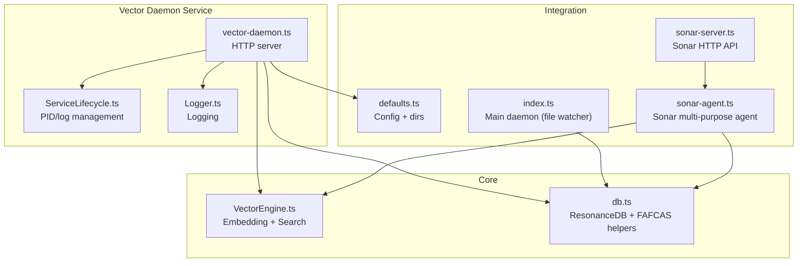
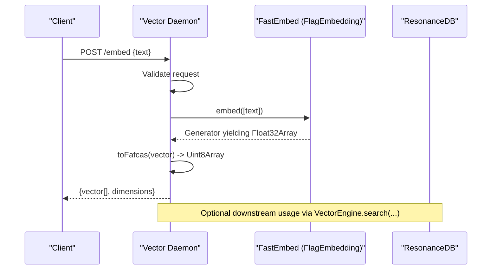
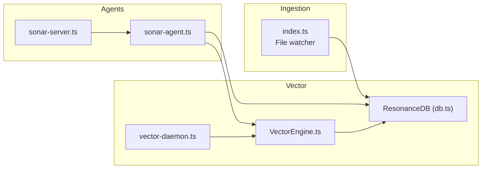
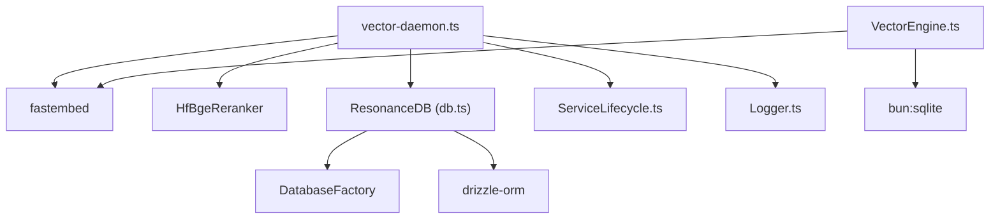

# Vector Daemon

<cite>
**Referenced Files in This Document**
- [vector-daemon.ts](file://src/resonance/services/vector-daemon.ts)
- [VectorEngine.ts](file://src/core/VectorEngine.ts)
- [db.ts](file://src/resonance/db.ts)
- [defaults.ts](file://src/config/defaults.ts)
- [Logger.ts](file://src/utils/Logger.ts)
- [ServiceLifecycle.ts](file://src/utils/ServiceLifecycle.ts)
- [index.ts](file://src/daemon/index.ts)
- [sonar-agent.ts](file://src/daemon/sonar-agent.ts)
- [sonar-server.ts](file://src/daemon/sonar-server.ts)
- [fafcas_compliance.test.ts](file://tests/fafcas_compliance.test.ts)
</cite>

## Table of Contents
1. [Introduction](#introduction)
2. [Project Structure](#project-structure)
3. [Core Components](#core-components)
4. [Architecture Overview](#architecture-overview)
5. [Detailed Component Analysis](#detailed-component-analysis)
6. [Dependency Analysis](#dependency-analysis)
7. [Performance Considerations](#performance-considerations)
8. [Troubleshooting Guide](#troubleshooting-guide)
9. [Conclusion](#conclusion)
10. [Appendices](#appendices)

## Introduction
The Vector Daemon is an HTTP service responsible for generating and managing vector embeddings using the FastEmbed library. It provides two primary endpoints:
- /embed: generates normalized vector embeddings for input text using the FAFCAS protocol normalization.
- /rerank: reranks a list of documents against a query using a reranker model.

The service keeps the embedding model loaded in memory for sub-100ms response times and supports lazy initialization of the reranker model. It integrates with the broader Amalfa system by interacting with the Resonance database, which stores nodes with FAFCAS-compliant vector embeddings. The daemon also participates in the FAFCAS protocol for vector normalization and similarity search.

## Project Structure
The Vector Daemon is implemented as a Bun-based HTTP server with lifecycle management and logging. It relies on shared utilities for configuration, logging, and service lifecycle. The daemon interacts with the VectorEngine for in-process embedding generation and with the Resonance database for persistence and search.

**Diagram sources**
- [vector-daemon.ts](file://src/resonance/services/vector-daemon.ts#L1-L234)
- [ServiceLifecycle.ts](file://src/utils/ServiceLifecycle.ts#L1-L209)
- [Logger.ts](file://src/utils/Logger.ts#L1-L23)
- [VectorEngine.ts](file://src/core/VectorEngine.ts#L1-L242)
- [db.ts](file://src/resonance/db.ts#L1-L488)
- [defaults.ts](file://src/config/defaults.ts#L1-L143)
- [index.ts](file://src/daemon/index.ts#L1-L293)
- [sonar-agent.ts](file://src/daemon/sonar-agent.ts#L1-L221)
- [sonar-server.ts](file://src/daemon/sonar-server.ts#L1-L134)

**Section sources**
- [vector-daemon.ts](file://src/resonance/services/vector-daemon.ts#L1-L234)
- [defaults.ts](file://src/config/defaults.ts#L1-L143)

## Core Components
- Vector Daemon HTTP server: Provides /embed and /rerank endpoints, health checks, and lifecycle management.
- VectorEngine: In-process embedding generation and FAFCAS-compliant search using SQLite BLOBs.
- ResonanceDB: Database abstraction with FAFCAS helpers and typed accessors.
- Configuration and logging: Centralized configuration loading and structured logging.
- Service lifecycle: PID file management, start/stop/status/restart orchestration.

Key responsibilities:
- Model loading and caching for low-latency embeddings.
- FAFCAS normalization and storage of vector embeddings.
- HTTP interface for embedding generation and reranking.
- Integration with the ingestion and enrichment subsystems.

**Section sources**
- [vector-daemon.ts](file://src/resonance/services/vector-daemon.ts#L1-L234)
- [VectorEngine.ts](file://src/core/VectorEngine.ts#L1-L242)
- [db.ts](file://src/resonance/db.ts#L1-L488)
- [defaults.ts](file://src/config/defaults.ts#L1-L143)
- [Logger.ts](file://src/utils/Logger.ts#L1-L23)
- [ServiceLifecycle.ts](file://src/utils/ServiceLifecycle.ts#L1-L209)

## Architecture Overview
The Vector Daemon sits alongside the main ingestion daemon and Sonar agent. It exposes HTTP endpoints for clients to generate embeddings and rerank results. Embeddings are normalized according to the FAFCAS protocol and stored in the Resonance database as BLOBs. VectorEngine performs similarity search using dot products on normalized vectors.

**Diagram sources**
- [vector-daemon.ts](file://src/resonance/services/vector-daemon.ts#L162-L219)
- [VectorEngine.ts](file://src/core/VectorEngine.ts#L115-L139)
- [db.ts](file://src/resonance/db.ts#L467-L487)

## Detailed Component Analysis

### Vector Daemon HTTP Server
Responsibilities:
- Initializes the embedding model at startup and optionally lazy-loads the reranker.
- Serves /embed for single-text embedding generation with FAFCAS normalization.
- Serves /rerank for reranking a list of documents against a query.
- Provides /health for readiness checks.
- Uses ServiceLifecycle for process management and Logger for structured logging.

Endpoints:
- GET /health: Returns status, model info, and readiness flags.
- POST /embed: Expects { text, model? }. Returns { vector[], dimensions }.
- POST /rerank: Expects { query, documents[], topK?, threshold? }. Returns { results[], count }.

Error handling:
- Validates input parameters and returns 400 for malformed requests.
- Catches exceptions during embedding/reranking and returns 500 with error messages.
- Logs errors with structured context.

Memory and model loading:
- Embedding model is initialized once and kept in memory.
- Reranker is lazily initialized on first rerank request.

**Section sources**
- [vector-daemon.ts](file://src/resonance/services/vector-daemon.ts#L1-L234)
- [Logger.ts](file://src/utils/Logger.ts#L1-L23)
- [ServiceLifecycle.ts](file://src/utils/ServiceLifecycle.ts#L1-L209)

### VectorEngine (In-Process Embedding and Search)
Responsibilities:
- Generates embeddings using FastEmbed (BGESmallENV15).
- Normalizes vectors to unit length using FAFCAS protocol.
- Stores embeddings as BLOBs in the Resonance database.
- Performs FAFCAS-optimized similarity search using dot products on Float32 views of BLOBs.

Embedding pipeline:
- Embedder is lazily initialized to match the daemon’s model.
- Returns FAFCAS-compliant Uint8Array for storage.

Search pipeline:
- Loads candidate nodes with embedding BLOBs.
- Computes scores using dot product (cosine similarity for unit vectors).
- Applies a minimal threshold and sorts to produce top-K results.
- Hydrates metadata for top results only.

Optimizations:
- Slim scan: selects only id and embedding to minimize IO.
- Zero-copy Float32Array views of BLOBs.
- Threshold filtering to prune near-zero similarities.

**Section sources**
- [VectorEngine.ts](file://src/core/VectorEngine.ts#L1-L242)

### ResonanceDB and FAFCAS Helpers
Responsibilities:
- Manages database connections with WAL mode and tuned pragmas.
- Inserts/upserts nodes with FAFCAS-compliant embedding BLOBs.
- Provides FAFCAS normalization and dot product utilities.
- Typed accessors for nodes and edges, with optional exclusion of large BLOBs.

FAFCAS protocol:
- Normalization via L2 norm to unit length.
- Serialization to raw bytes for storage.
- Dot product similarity for normalized vectors.

**Section sources**
- [db.ts](file://src/resonance/db.ts#L1-L488)

### Integration with Main Amalfa System
- The ingestion daemon watches source directories and updates the graph database.
- The Sonar agent coordinates graph operations and can leverage VectorEngine for embedding and search.
- The Vector Daemon can be used by external clients to generate embeddings and rerank results.

**Diagram sources**
- [index.ts](file://src/daemon/index.ts#L1-L293)
- [sonar-agent.ts](file://src/daemon/sonar-agent.ts#L1-L221)
- [sonar-server.ts](file://src/daemon/sonar-server.ts#L1-L134)
- [vector-daemon.ts](file://src/resonance/services/vector-daemon.ts#L1-L234)
- [VectorEngine.ts](file://src/core/VectorEngine.ts#L1-L242)
- [db.ts](file://src/resonance/db.ts#L1-L488)

## Dependency Analysis
- vector-daemon.ts depends on:
  - FastEmbed for embeddings.
  - HfBgeReranker for reranking.
  - ResonanceDB for FAFCAS normalization utilities.
  - ServiceLifecycle and Logger for lifecycle and logging.
- VectorEngine depends on:
  - FastEmbed for embeddings.
  - Bun SQLite for BLOB storage and queries.
- ResonanceDB depends on:
  - DatabaseFactory for compliant connections.
  - Drizzle for migrations.

**Diagram sources**
- [vector-daemon.ts](file://src/resonance/services/vector-daemon.ts#L1-L234)
- [VectorEngine.ts](file://src/core/VectorEngine.ts#L1-L242)
- [db.ts](file://src/resonance/db.ts#L1-L488)

**Section sources**
- [vector-daemon.ts](file://src/resonance/services/vector-daemon.ts#L1-L234)
- [VectorEngine.ts](file://src/core/VectorEngine.ts#L1-L242)
- [db.ts](file://src/resonance/db.ts#L1-L488)

## Performance Considerations
- Model loading:
  - Embedding model is initialized once and reused, minimizing cold-start latency.
  - Reranker is lazy-initialized to reduce initial memory footprint.
- Memory management:
  - Embeddings are stored as BLOBs; VectorEngine uses zero-copy Float32Array views for scoring.
  - Slim scan pattern loads only id and embedding to reduce memory and IO.
- Search optimization:
  - Dot product similarity for unit vectors avoids expensive normalization.
  - Threshold filtering prunes near-zero similarities early.
- Database tuning:
  - WAL mode and pragmas configured via DatabaseFactory improve concurrency and IO characteristics.
- Concurrency:
  - Bun’s native HTTP server and async generators enable efficient handling of concurrent requests.

Recommendations:
- Monitor memory usage and adjust model selection if needed.
- Use topK and thresholds to constrain reranking output size.
- Ensure adequate disk space for model cache and database files.

[No sources needed since this section provides general guidance]

## Troubleshooting Guide
Common issues and resolutions:
- Model download failures:
  - Ensure network connectivity and writable cache directory (.amalfa/cache).
  - Verify cache directory creation and permissions.
- Empty embedding results:
  - Validate input text and embedding generation pipeline.
  - Confirm FAFCAS normalization produces non-empty vectors.
- Database errors:
  - Check database path validity and migration status.
  - Verify WAL mode and pragmas are applied.
- Reranker initialization failures:
  - Confirm lazy initialization path is executed and model artifacts are cached.
- Health check failures:
  - Inspect readiness flags for embedder and reranker.
- Logging:
  - Use structured logs with component tags for easier diagnosis.

Operational controls:
- Use ServiceLifecycle commands: start, stop, status, restart, serve.
- Inspect PID and log files under .amalfa/runtime and .amalfa/logs.

**Section sources**
- [vector-daemon.ts](file://src/resonance/services/vector-daemon.ts#L1-L234)
- [ServiceLifecycle.ts](file://src/utils/ServiceLifecycle.ts#L1-L209)
- [Logger.ts](file://src/utils/Logger.ts#L1-L23)
- [db.ts](file://src/resonance/db.ts#L1-L488)

## Conclusion
The Vector Daemon provides a fast, HTTP-accessible embedding and reranking service integrated with the FAFCAS protocol and the Resonance database. Its architecture emphasizes low-latency embeddings, efficient storage, and optimized similarity search. By leveraging lifecycle management, structured logging, and FAFCAS-compliant normalization, it fits seamlessly into the Amalfa ecosystem for knowledge graph operations.

[No sources needed since this section summarizes without analyzing specific files]

## Appendices

### HTTP Interface Reference
- Base URL: http://host:PORT
- Environment variable: VECTOR_PORT (default 3010)

Endpoints:
- GET /health
  - Purpose: Health and readiness check.
  - Response: { status, model, ready, reranker_ready }

- POST /embed
  - Request: { text: string, model?: string }
  - Response: { vector: number[], dimensions: number }
  - Errors: 400 for missing text, 500 for generation failure

- POST /rerank
  - Request: { query: string, documents: string[], topK?: number, threshold?: number }
  - Response: { results: [{ text, score, originalIndex }], count: number }
  - Errors: 400 for invalid parameters, 500 for reranking failure

**Section sources**
- [vector-daemon.ts](file://src/resonance/services/vector-daemon.ts#L82-L223)

### FAFCAS Protocol Notes
- Normalization: L2 norm to unit length.
- Storage: Raw bytes (Uint8Array) in database BLOBs.
- Similarity: Dot product for normalized vectors.
- Compliance: Verified by dedicated tests.

**Section sources**
- [VectorEngine.ts](file://src/core/VectorEngine.ts#L17-L37)
- [db.ts](file://src/resonance/db.ts#L467-L487)
- [fafcas_compliance.test.ts](file://tests/fafcas_compliance.test.ts)