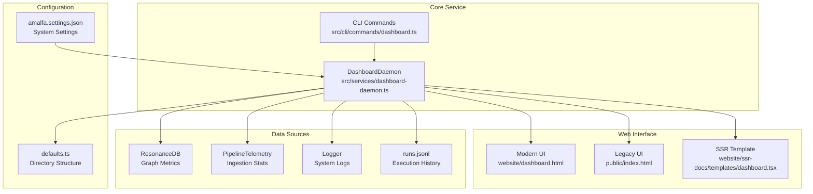
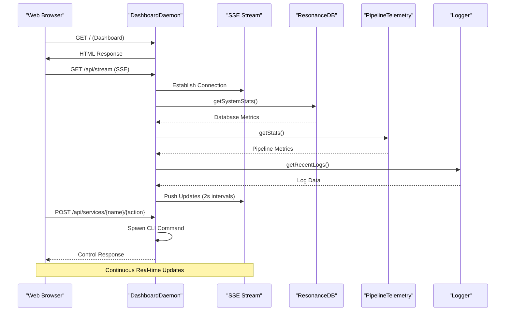
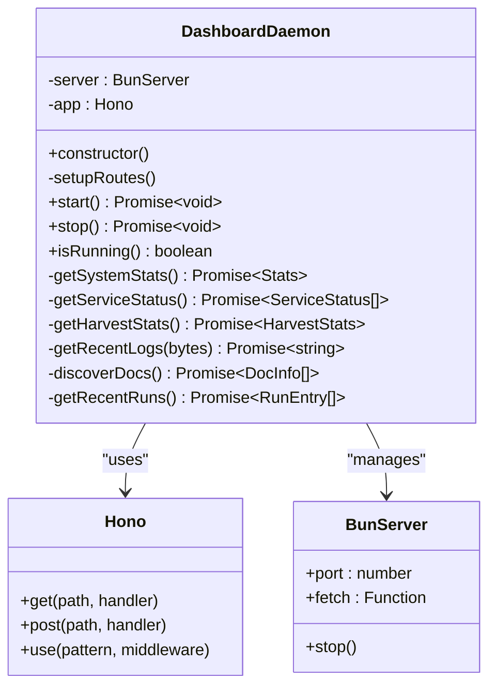
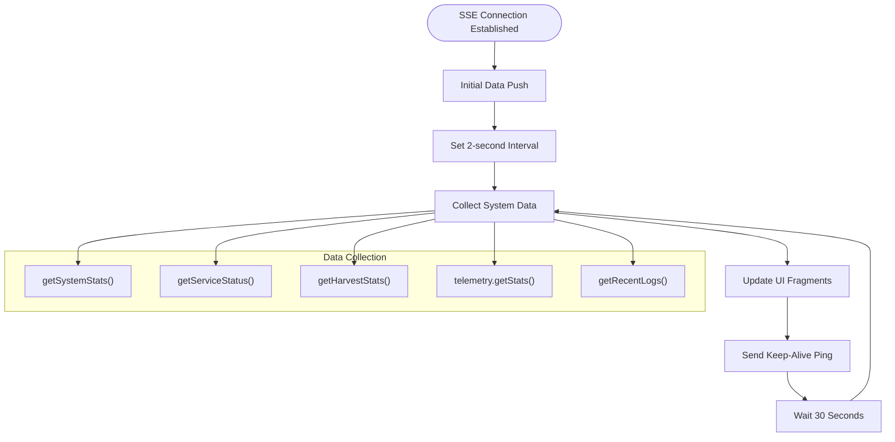
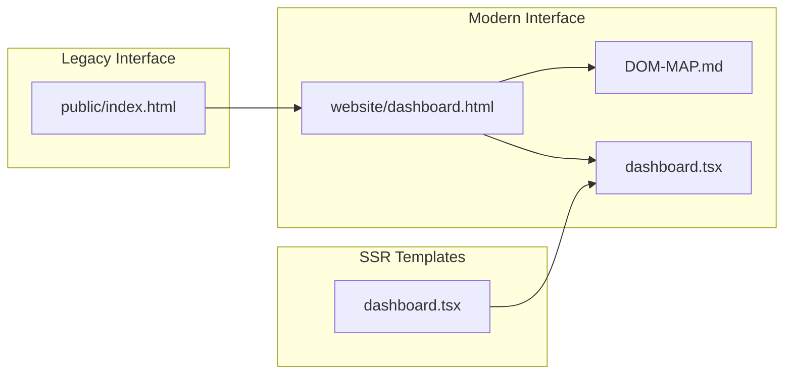
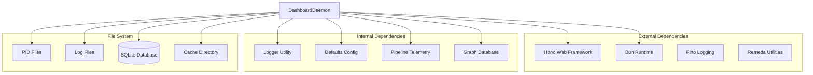

# Dashboard Daemon

<cite>
**Referenced Files in This Document**
- [dashboard-daemon.ts](file://src/services/dashboard-daemon.ts)
- [dashboard.html](file://website/dashboard.html)
- [DOM-MAP.md](file://website/DOM-MAP.md)
- [dashboard.tsx](file://website/ssr-docs/templates/dashboard.tsx)
- [Logger.ts](file://src/utils/Logger.ts)
- [PipelineTelemetry.ts](file://src/services/PipelineTelemetry.ts)
- [defaults.ts](file://src/config/defaults.ts)
- [cli.ts](file://src/cli.ts)
- [dashboard.ts](file://src/cli/commands/dashboard.ts)
- [index.html](file://public/index.html)
- [amalfa.settings.json](file://amalfa.settings.json)
- [dashboard-e2e.test.ts](file://tests/e2e/dashboard-e2e.test.ts)
</cite>

## Table of Contents
1. [Introduction](#introduction)
2. [Project Structure](#project-structure)
3. [Core Components](#core-components)
4. [Architecture Overview](#architecture-overview)
5. [Detailed Component Analysis](#detailed-component-analysis)
6. [Dependency Analysis](#dependency-analysis)
7. [Performance Considerations](#performance-considerations)
8. [Security Considerations](#security-considerations)
9. [Configuration Options](#configuration-options)
10. [Troubleshooting Guide](#troubleshooting-guide)
11. [Conclusion](#conclusion)

## Introduction
The Dashboard Daemon is a real-time monitoring and administrative interface for the AMALFA system. It provides live insights into system health, service status, graph database metrics, and ingestion pipeline telemetry. The daemon serves both a modern terminal-inspired UI and a legacy interface, offering administrative controls for managing other daemons and services within the ecosystem.

The daemon integrates with system health monitoring, service status tracking, and performance metrics collection. It exposes a comprehensive web interface with real-time data updates via Server-Sent Events (SSE) and administrative controls for service lifecycle management.

## Project Structure
The Dashboard Daemon spans several key areas of the codebase:

**Diagram sources**
- [dashboard-daemon.ts](file://src/services/dashboard-daemon.ts#L25-L32)
- [dashboard.ts](file://src/cli/commands/dashboard.ts#L11-L36)
- [dashboard.html](file://website/dashboard.html#L1-L381)
- [index.html](file://public/index.html#L1-L254)

**Section sources**
- [dashboard-daemon.ts](file://src/services/dashboard-daemon.ts#L1-L507)
- [dashboard.ts](file://src/cli/commands/dashboard.ts#L1-L54)

## Core Components
The Dashboard Daemon consists of several interconnected components that work together to provide comprehensive system monitoring and administration:

### Service Management
The daemon manages multiple system services including Vector Daemon, Reranker Daemon, Sonar Agent, and the Harvester. Each service is tracked by monitoring its PID file and exposing control endpoints.

### Real-Time Data Streaming
The daemon implements a sophisticated SSE system that pushes live updates to connected clients, updating metrics, service status, and log streams without requiring page refreshes.

### Administrative Interface
The web interface provides both modern and legacy dashboard experiences, allowing administrators to monitor system health, control services, and access documentation.

### Metrics Collection
The daemon aggregates data from multiple sources including the graph database, pipeline telemetry, and system logs to present a unified view of system state.

**Section sources**
- [dashboard-daemon.ts](file://src/services/dashboard-daemon.ts#L361-L386)
- [dashboard-daemon.ts](file://src/services/dashboard-daemon.ts#L145-L276)
- [dashboard-daemon.ts](file://src/services/dashboard-daemon.ts#L342-L359)

## Architecture Overview
The Dashboard Daemon follows a modular architecture with clear separation of concerns:

**Diagram sources**
- [dashboard-daemon.ts](file://src/services/dashboard-daemon.ts#L42-L51)
- [dashboard-daemon.ts](file://src/services/dashboard-daemon.ts#L145-L276)
- [dashboard-daemon.ts](file://src/services/dashboard-daemon.ts#L95-L128)

The architecture implements a publish-subscribe pattern where the daemon continuously collects system data and publishes updates to connected clients via SSE. Administrative actions trigger CLI commands that manage the lifecycle of other system services.

**Section sources**
- [dashboard-daemon.ts](file://src/services/dashboard-daemon.ts#L34-L51)
- [dashboard-daemon.ts](file://src/services/dashboard-daemon.ts#L145-L276)

## Detailed Component Analysis

### DashboardDaemon Class
The core service class orchestrates all dashboard functionality:

**Diagram sources**
- [dashboard-daemon.ts](file://src/services/dashboard-daemon.ts#L25-L489)

The class implements a comprehensive API surface including static asset serving, dynamic content generation, service management, and real-time streaming capabilities.

**Section sources**
- [dashboard-daemon.ts](file://src/services/dashboard-daemon.ts#L25-L489)

### Real-Time Streaming System
The SSE implementation provides continuous updates to the dashboard interface:

**Diagram sources**
- [dashboard-daemon.ts](file://src/services/dashboard-daemon.ts#L150-L275)

The streaming system updates multiple UI components simultaneously, ensuring the dashboard remains responsive and informative.

**Section sources**
- [dashboard-daemon.ts](file://src/services/dashboard-daemon.ts#L145-L276)

### Service Management Interface
The daemon provides administrative controls for managing other system services:

| Service | Port | PID File Location | Control Actions |
|---------|------|-------------------|-----------------|
| Vector Daemon | 3010 | `.amalfa/runtime/vector-daemon.pid` | start, stop, restart |
| Reranker Daemon | 3011 | `.amalfa/runtime/reranker-daemon.pid` | start, stop, restart |
| Sonar Agent | 3012 | `.amalfa/runtime/sonar.pid` | start, stop, restart |
| Dashboard | 3013 | `.amalfa/runtime/dashboard.pid` | start, stop, restart |
| Harvester | N/A | `.amalfa/runtime/daemon.pid` | start, stop, restart |

**Section sources**
- [dashboard-daemon.ts](file://src/services/dashboard-daemon.ts#L361-L386)
- [dashboard.ts](file://src/cli/commands/dashboard.ts#L38-L54)

### Web Interface Components
The dashboard supports multiple interface styles:

**Diagram sources**
- [dashboard.html](file://website/dashboard.html#L1-L381)
- [DOM-MAP.md](file://website/DOM-MAP.md#L24-L89)
- [dashboard.tsx](file://website/ssr-docs/templates/dashboard.tsx#L1-L115)

**Section sources**
- [dashboard.html](file://website/dashboard.html#L268-L381)
- [index.html](file://public/index.html#L131-L254)

## Dependency Analysis
The Dashboard Daemon has several key dependencies that define its functionality and integration points:

**Diagram sources**
- [dashboard-daemon.ts](file://src/services/dashboard-daemon.ts#L1-L12)
- [Logger.ts](file://src/utils/Logger.ts#L1-L23)
- [defaults.ts](file://src/config/defaults.ts#L15-L59)

The daemon's dependency structure emphasizes modularity and clear separation of concerns, with each component having a specific responsibility in the monitoring and administration ecosystem.

**Section sources**
- [dashboard-daemon.ts](file://src/services/dashboard-daemon.ts#L1-L12)
- [Logger.ts](file://src/utils/Logger.ts#L1-L23)
- [defaults.ts](file://src/config/defaults.ts#L15-L59)

## Performance Considerations
The Dashboard Daemon is designed for efficient real-time monitoring with several performance optimizations:

### Data Collection Efficiency
- **Batched Updates**: All metrics are collected in a single operation every 2 seconds
- **Selective Updates**: Only changed data triggers UI updates via targeted DOM fragments
- **Lazy Loading**: Database connections are opened and closed for each metrics request

### Memory Management
- **Connection Pooling**: Database connections are properly closed after each operation
- **Stream Cleanup**: SSE connections are properly terminated when clients disconnect
- **Log Rotation**: Log files are read incrementally to prevent memory bloat

### Network Optimization
- **Efficient Streaming**: SSE maintains persistent connections with minimal overhead
- **Targeted Updates**: UI fragments are updated individually rather than reloading entire pages
- **Compression**: Static assets are served compressed when possible

**Section sources**
- [dashboard-daemon.ts](file://src/services/dashboard-daemon.ts#L150-L275)
- [dashboard-daemon.ts](file://src/services/dashboard-daemon.ts#L342-L359)

## Security Considerations
The Dashboard Daemon implements several security measures for safe operation:

### Access Control
- **Localhost Binding**: The daemon runs on localhost-only interfaces
- **No Built-in Authentication**: Designed for trusted local environments
- **Administrative Privileges**: Service control actions require system-level permissions

### Data Protection
- **Log Sanitization**: Log data is read and sanitized before display
- **File Path Validation**: All file operations use validated paths
- **Process Isolation**: Service management runs in isolated child processes

### Attack Surface Minimization
- **Limited Exposure**: Only essential ports (3013) are exposed
- **Input Validation**: All API endpoints validate and sanitize input
- **Error Handling**: Graceful error handling prevents information leakage

**Section sources**
- [dashboard-daemon.ts](file://src/services/dashboard-daemon.ts#L95-L128)
- [dashboard-daemon.ts](file://src/services/dashboard-daemon.ts#L469-L484)

## Configuration Options
The Dashboard Daemon supports various configuration options through the central settings system:

### System Configuration
| Setting | Type | Default | Description |
|---------|------|---------|-------------|
| Database Path | String | `.amalfa/resonance.db` | SQLite database location |
| Log Level | String | `info` | Logging verbosity level |
| Runtime Directory | String | `.amalfa/runtime` | Process and state files |
| Cache Directory | String | `.amalfa/cache` | Temporary data storage |

### Monitoring Configuration
| Setting | Type | Default | Description |
|---------|------|---------|-------------|
| Update Interval | Number | 2000ms | SSE update frequency |
| Log Buffer Size | Number | 3000 bytes | Recent log window |
| Service Timeout | Number | 5000ms | Service control timeout |

### Service Management
| Service | Port | PID File | Control Methods |
|---------|------|----------|-----------------|
| Dashboard | 3013 | `.amalfa/runtime/dashboard.pid` | CLI, HTTP |
| Vector Daemon | 3010 | `.amalfa/runtime/vector-daemon.pid` | CLI, HTTP |
| Reranker Daemon | 3011 | `.amalfa/runtime/reranker-daemon.pid` | CLI, HTTP |
| Sonar Agent | 3012 | `.amalfa/runtime/sonar.pid` | CLI, HTTP |

**Section sources**
- [amalfa.settings.json](file://amalfa.settings.json#L1-L96)
- [defaults.ts](file://src/config/defaults.ts#L15-L59)
- [dashboard-daemon.ts](file://src/services/dashboard-daemon.ts#L15-L16)

## Troubleshooting Guide

### Dashboard Connectivity Issues
**Problem**: Dashboard fails to load or shows connection errors
**Symptoms**:
- Blank page or loading spinner
- JavaScript console errors
- 500 server errors

**Solutions**:
1. **Check Port Availability**: Verify port 3013 is free using `netstat -tulpn | grep 3013`
2. **Restart Service**: Stop and restart the dashboard daemon
3. **Clear Cache**: Clear browser cache and reload the page
4. **Check Dependencies**: Ensure all required Node modules are installed

**Section sources**
- [dashboard-daemon.ts](file://src/services/dashboard-daemon.ts#L423-L445)
- [dashboard-e2e.test.ts](file://tests/e2e/dashboard-e2e.test.ts#L76-L178)

### Performance Monitoring Problems
**Problem**: Slow response times or delayed updates
**Symptoms**:
- Stale metrics display
- Delayed service status updates
- High CPU usage

**Solutions**:
1. **Monitor Resource Usage**: Check system resource utilization
2. **Adjust Update Frequency**: Modify SSE interval in configuration
3. **Database Optimization**: Run database vacuum and analyze operations
4. **Log Analysis**: Review daemon logs for performance bottlenecks

**Section sources**
- [dashboard-daemon.ts](file://src/services/dashboard-daemon.ts#L262-L275)
- [Logger.ts](file://src/utils/Logger.ts#L15-L23)

### Administrative Interface Failures
**Problem**: Service control actions fail or have no effect
**Symptoms**:
- Service control buttons disabled
- Error messages when attempting actions
- Services not responding to commands

**Solutions**:
1. **Check PID Files**: Verify service PID files exist and are readable
2. **Permission Verification**: Ensure proper file system permissions
3. **Process Validation**: Confirm services are running with correct ports
4. **CLI Testing**: Test service commands manually in terminal

**Section sources**
- [dashboard-daemon.ts](file://src/services/dashboard-daemon.ts#L95-L128)
- [dashboard.ts](file://src/cli/commands/dashboard.ts#L38-L54)

### Log Streaming Issues
**Problem**: System logs not displaying in dashboard
**Symptoms**:
- Empty log stream section
- "[SYS] No harvester logs found" messages
- Log file permission errors

**Solutions**:
1. **File Permissions**: Verify read access to log files
2. **Log Rotation**: Check if log files have been rotated
3. **Buffer Size**: Adjust log buffer size in configuration
4. **Path Validation**: Verify log file paths in settings

**Section sources**
- [dashboard-daemon.ts](file://src/services/dashboard-daemon.ts#L447-L467)
- [defaults.ts](file://src/config/defaults.ts#L18-L20)

## Conclusion
The Dashboard Daemon provides a comprehensive solution for monitoring and administering the AMALFA system. Its modular architecture, real-time streaming capabilities, and extensive administrative features make it an essential component for system operators and developers.

Key strengths include:
- **Real-time Monitoring**: Continuous updates via SSE ensure operators have current system information
- **Service Management**: Unified interface for controlling all system services
- **Flexible Interfaces**: Support for both modern and legacy dashboard experiences
- **Performance Focus**: Efficient data collection and streaming minimize resource usage
- **Extensible Design**: Modular architecture allows for easy enhancement and customization

The daemon's design prioritizes operational simplicity while maintaining powerful monitoring and administrative capabilities, making it suitable for both development environments and production deployments.