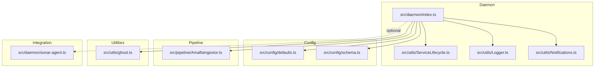
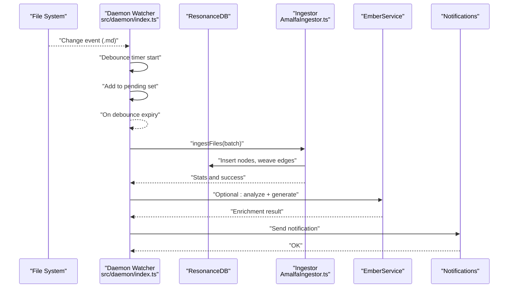
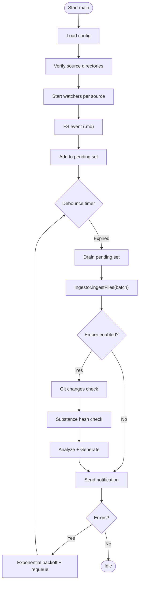
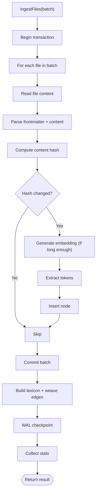
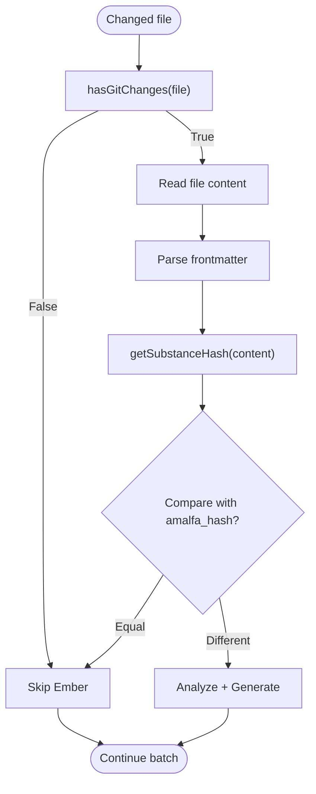
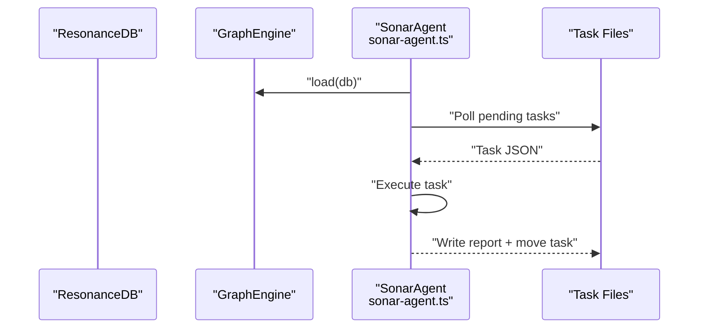
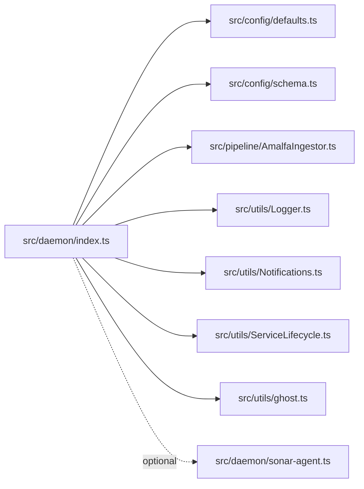

# File Watcher Daemon

<cite>
**Referenced Files in This Document**
- [index.ts](file://src/daemon/index.ts)
- [defaults.ts](file://src/config/defaults.ts)
- [schema.ts](file://src/config/schema.ts)
- [AmalfaIngestor.ts](file://src/pipeline/AmalfaIngestor.ts)
- [ghost.ts](file://src/utils/ghost.ts)
- [Logger.ts](file://src/utils/Logger.ts)
- [Notifications.ts](file://src/utils/Notifications.ts)
- [ServiceLifecycle.ts](file://src/utils/ServiceLifecycle.ts)
- [sonar-agent.ts](file://src/daemon/sonar-agent.ts)
- [daemon-realtime.test.ts](file://tests/daemon-realtime.test.ts)
</cite>

## Table of Contents
1. [Introduction](#introduction)
2. [Project Structure](#project-structure)
3. [Core Components](#core-components)
4. [Architecture Overview](#architecture-overview)
5. [Detailed Component Analysis](#detailed-component-analysis)
6. [Dependency Analysis](#dependency-analysis)
7. [Performance Considerations](#performance-considerations)
8. [Troubleshooting Guide](#troubleshooting-guide)
9. [Conclusion](#conclusion)

## Introduction
This document describes the File Watcher Daemon responsible for monitoring file system changes and triggering incremental ingestion into the knowledge graph. The daemon watches configured directories, detects changes to Markdown files, batches and debounces events, and orchestrates ingestion and optional enrichment via the Ember sidecar. It integrates with the Sonar Agent for automated research tasks and the broader ingestion pipeline for content processing. Configuration options include watch directories, file filters, polling intervals, and notification preferences. The document also covers change detection logic, batch processing, error handling, performance considerations, and troubleshooting.

## Project Structure
The daemon is implemented as a Bun-based service with a clear separation of concerns:
- Daemon entrypoint and orchestration
- Configuration loading and defaults
- Ingestion pipeline for incremental updates
- Utility modules for change detection, logging, notifications, and lifecycle management
- Optional integration with the Sonar Agent for automated research tasks

**Diagram sources**
- [index.ts](file://src/daemon/index.ts#L1-L293)
- [defaults.ts](file://src/config/defaults.ts#L1-L143)
- [schema.ts](file://src/config/schema.ts#L1-L298)
- [AmalfaIngestor.ts](file://src/pipeline/AmalfaIngestor.ts#L1-L441)
- [ghost.ts](file://src/utils/ghost.ts#L1-L70)
- [Logger.ts](file://src/utils/Logger.ts#L1-L23)
- [Notifications.ts](file://src/utils/Notifications.ts#L1-L66)
- [ServiceLifecycle.ts](file://src/utils/ServiceLifecycle.ts#L1-L209)
- [sonar-agent.ts](file://src/daemon/sonar-agent.ts#L1-L221)

**Section sources**
- [index.ts](file://src/daemon/index.ts#L1-L293)
- [defaults.ts](file://src/config/defaults.ts#L1-L143)
- [schema.ts](file://src/config/schema.ts#L1-L298)

## Core Components
- File Watcher Orchestrator: Starts watchers for configured directories, filters Markdown files, and triggers debounced ingestion.
- Ingestion Pipeline: Processes changed files incrementally, inserts nodes, rebuilds edges, and checkpoints the database.
- Change Detection Gates: Uses Git diff checks and a content “substance hash” to avoid redundant work.
- Lifecycle Management: Handles start/stop/status/restart and PID/log file management.
- Notifications: Sends desktop notifications on successful updates or failures.
- Optional Ember Integration: Runs sidecar analysis and generation for enriched content.
- Optional Sonar Agent Integration: Automated research tasks triggered by the system.

**Section sources**
- [index.ts](file://src/daemon/index.ts#L52-L95)
- [AmalfaIngestor.ts](file://src/pipeline/AmalfaIngestor.ts#L45-L134)
- [ghost.ts](file://src/utils/ghost.ts#L45-L70)
- [ServiceLifecycle.ts](file://src/utils/ServiceLifecycle.ts#L12-L209)
- [Notifications.ts](file://src/utils/Notifications.ts#L8-L30)
- [sonar-agent.ts](file://src/daemon/sonar-agent.ts#L60-L116)

## Architecture Overview
The daemon architecture follows a reactive pattern:
- Watchers emit file system events for Markdown files.
- Events are accumulated in a pending set and debounced.
- On debounce expiry, a batch is processed: ingestion, optional Ember enrichment, and notifications.
- The Sonar Agent operates independently and can trigger tasks based on the graph state.

**Diagram sources**
- [index.ts](file://src/daemon/index.ts#L100-L289)
- [AmalfaIngestor.ts](file://src/pipeline/AmalfaIngestor.ts#L45-L134)
- [ghost.ts](file://src/utils/ghost.ts#L45-L70)
- [Notifications.ts](file://src/utils/Notifications.ts#L8-L30)

## Detailed Component Analysis

### File Watcher Orchestrator
Responsibilities:
- Load configuration and initialize watch directories.
- Start recursive watchers per source directory.
- Filter events to Markdown files and enqueue for debounced processing.
- Manage retry queues with exponential backoff for transient failures.
- Coordinate optional Ember enrichment and notifications.

Key behaviors:
- Watches recursively under each configured source.
- Debounces incoming events to batch changes.
- Loads configuration per batch to reflect runtime changes.
- Emits desktop notifications on success/failure.

**Diagram sources**
- [index.ts](file://src/daemon/index.ts#L52-L95)
- [index.ts](file://src/daemon/index.ts#L100-L127)
- [index.ts](file://src/daemon/index.ts#L132-L289)
- [ghost.ts](file://src/utils/ghost.ts#L45-L70)

**Section sources**
- [index.ts](file://src/daemon/index.ts#L52-L95)
- [index.ts](file://src/daemon/index.ts#L100-L127)
- [index.ts](file://src/daemon/index.ts#L132-L289)

### Ingestion Pipeline (Incremental)
Responsibilities:
- Process a batch of changed files incrementally.
- Pass 1: insert nodes without edges.
- Pass 2: rebuild edges for affected nodes using a lexicon.
- Force WAL checkpoint for durability.
- Emit telemetry and statistics.

Processing logic:
- Validates and warms up embedding and tokenizer services.
- Begins transactions per batch to reduce contention.
- Skips unchanged files using content hashing.
- Builds a lexicon from existing nodes for edge weaving.

**Diagram sources**
- [AmalfaIngestor.ts](file://src/pipeline/AmalfaIngestor.ts#L45-L134)
- [AmalfaIngestor.ts](file://src/pipeline/AmalfaIngestor.ts#L375-L440)

**Section sources**
- [AmalfaIngestor.ts](file://src/pipeline/AmalfaIngestor.ts#L45-L134)
- [AmalfaIngestor.ts](file://src/pipeline/AmalfaIngestor.ts#L375-L440)

### Change Detection Logic
Two-stage gating ensures only meaningful changes are processed:
- Git Changes Gate: Determines if the file differs from the index (user edits vs committed).
- Substance Hash Gate: Compares a content-only hash to detect real content changes, ignoring metadata/frontmatter.

**Diagram sources**
- [index.ts](file://src/daemon/index.ts#L171-L208)
- [ghost.ts](file://src/utils/ghost.ts#L9-L38)
- [ghost.ts](file://src/utils/ghost.ts#L45-L70)

**Section sources**
- [index.ts](file://src/daemon/index.ts#L171-L208)
- [ghost.ts](file://src/utils/ghost.ts#L9-L38)
- [ghost.ts](file://src/utils/ghost.ts#L45-L70)

### Configuration Options
The daemon reads configuration from a single source of truth and supports:
- Sources: An array of directories to watch recursively.
- Exclude Patterns: Filters to ignore directories or files.
- Database Path: SQLite database location.
- Embeddings: Model and dimensions for embeddings.
- Watch: Enabled flag, debounce interval, and notifications toggle.
- Graph Tuning: Louvain parameters for edge weaving.
- Sonar: Local/cloud inference settings and task scheduling.
- Ember: Agentic memory/enrichment settings.
- Scratchpad: Transient cognitive space settings.
- LangExtract: Provider selection and fallback order.

Defaults and validation are enforced by a Zod schema.

**Section sources**
- [defaults.ts](file://src/config/defaults.ts#L84-L142)
- [schema.ts](file://src/config/schema.ts#L146-L266)

### Integration with Sonar Agent
The Sonar Agent runs independently and periodically processes tasks placed in dedicated directories. While not directly triggered by file changes, it can benefit from the daemon’s incremental updates by reloading the graph engine and responding to new edges/nodes.

**Diagram sources**
- [sonar-agent.ts](file://src/daemon/sonar-agent.ts#L106-L179)

**Section sources**
- [sonar-agent.ts](file://src/daemon/sonar-agent.ts#L60-L116)
- [sonar-agent.ts](file://src/daemon/sonar-agent.ts#L138-L179)

## Dependency Analysis
High-level dependencies:
- Daemon depends on configuration, ingestion pipeline, logging, notifications, and lifecycle utilities.
- Ingestion pipeline depends on ResonanceDB, embedder/tokenizer services, and edge weaver.
- Change detection utilities depend on Git and content parsing.
- Optional integrations (Ember and Sonar) are gated by configuration.

**Diagram sources**
- [index.ts](file://src/daemon/index.ts#L8-L23)
- [defaults.ts](file://src/config/defaults.ts#L1-L143)
- [schema.ts](file://src/config/schema.ts#L1-L298)
- [AmalfaIngestor.ts](file://src/pipeline/AmalfaIngestor.ts#L1-L441)
- [ghost.ts](file://src/utils/ghost.ts#L1-L70)
- [Logger.ts](file://src/utils/Logger.ts#L1-L23)
- [Notifications.ts](file://src/utils/Notifications.ts#L1-L66)
- [ServiceLifecycle.ts](file://src/utils/ServiceLifecycle.ts#L1-L209)
- [sonar-agent.ts](file://src/daemon/sonar-agent.ts#L1-L221)

**Section sources**
- [index.ts](file://src/daemon/index.ts#L8-L23)
- [AmalfaIngestor.ts](file://src/pipeline/AmalfaIngestor.ts#L1-L441)

## Performance Considerations
- Debounce tuning: Adjust the debounce interval to balance responsiveness and throughput. Higher intervals reduce CPU but increase latency.
- Batch sizing: The ingestion pipeline commits in small batches to minimize database locks and contention with concurrent daemons or services.
- WAL checkpointing: Periodic checkpointing improves durability and reduces recovery time.
- Network drives: File system events on network mounts may be unreliable. Prefer local mirrors or adjust debounce accordingly.
- Resource usage: Limit concurrent heavy operations (e.g., embeddings) and avoid unnecessary retries by ensuring robust configuration and permissions.
- Filtering: Use exclude patterns to avoid watching large or irrelevant directories.

[No sources needed since this section provides general guidance]

## Troubleshooting Guide
Common issues and resolutions:
- Watcher fails to start:
  - Verify source directories exist and are readable.
  - Check configuration loading and schema validation.
- No changes detected:
  - Confirm only Markdown files are being watched.
  - Ensure debounce interval is sufficient for rapid edits.
- Excessive retries:
  - Inspect retry queue behavior and backoff timing.
  - Review ingestion errors and database connectivity.
- Permission problems:
  - Ensure the daemon process has read access to watched directories.
  - Confirm write access to the database and log/runtime directories.
- Notifications not appearing:
  - Desktop notification support varies by OS; ensure required tools are installed.
- Real-time behavior:
  - Tests demonstrate expected behavior for new files, modifications, and multi-source configs.

**Section sources**
- [index.ts](file://src/daemon/index.ts#L67-L73)
- [index.ts](file://src/daemon/index.ts#L123-L126)
- [index.ts](file://src/daemon/index.ts#L232-L287)
- [Notifications.ts](file://src/utils/Notifications.ts#L14-L30)
- [daemon-realtime.test.ts](file://tests/daemon-realtime.test.ts#L72-L218)

## Conclusion
The File Watcher Daemon provides a robust, configurable mechanism for incremental ingestion of Markdown content into the knowledge graph. Its event-driven design, batching, and retry logic ensure reliable operation under varied conditions. Optional integrations with Ember and Sonar extend the system’s capabilities for enrichment and automated research. Proper configuration, attention to performance tuning, and adherence to troubleshooting steps will maintain a smooth and efficient pipeline.