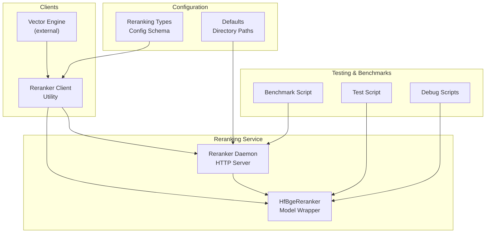
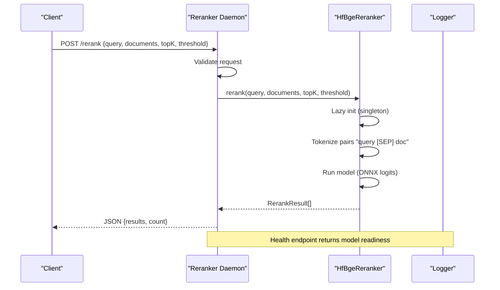
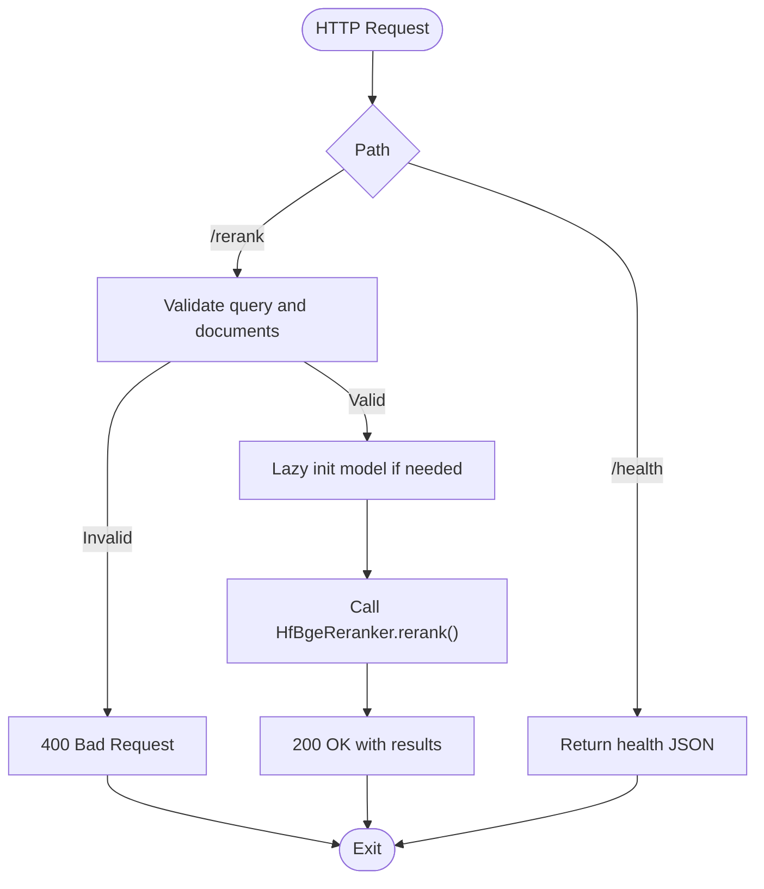
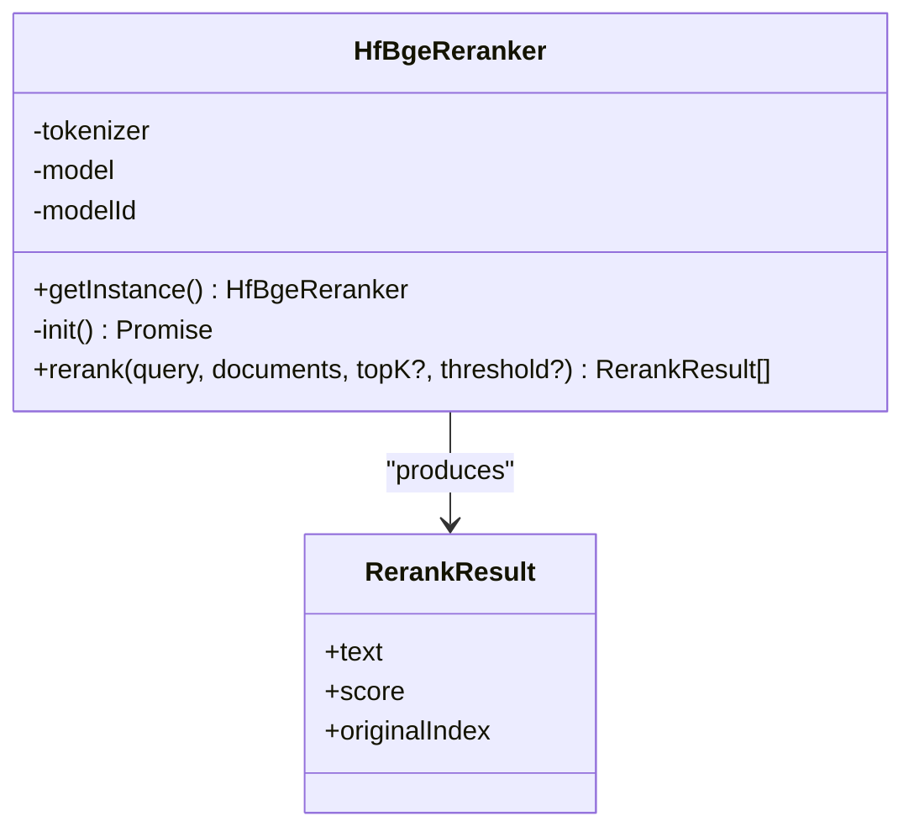
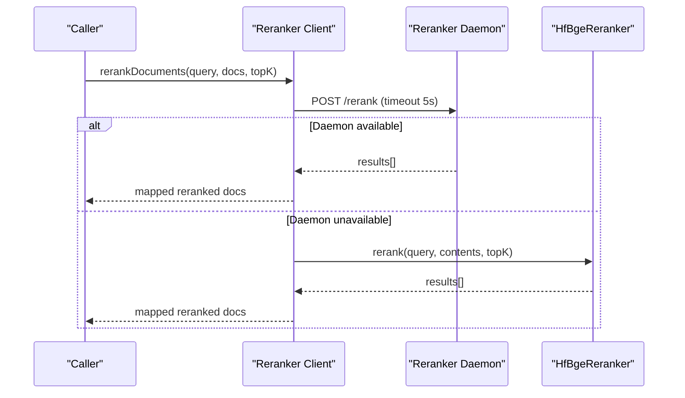
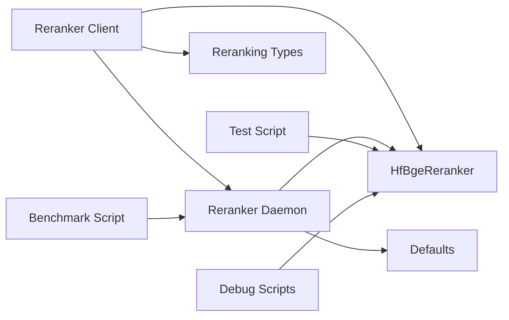

# Reranker Daemon

<cite>
**Referenced Files in This Document**
- [reranker-daemon.ts](file://src/resonance/services/reranker-daemon.ts)
- [reranker-hf.ts](file://src/services/reranker-hf.ts)
- [reranker-client.ts](file://src/utils/reranker-client.ts)
- [reranking.ts](file://src/types/reranking.ts)
- [benchmark-reranking-comparison.ts](file://scripts/benchmarks/benchmark-reranking-comparison.ts)
- [test-reranker.ts](file://scripts/test-reranker.ts)
- [debug-reranker.ts](file://scripts/debug-reranker.ts)
- [debug-reranker-raw.ts](file://scripts/debug-reranker-raw.ts)
- [defaults.ts](file://src/config/defaults.ts)
</cite>

## Table of Contents
1. [Introduction](#introduction)
2. [Project Structure](#project-structure)
3. [Core Components](#core-components)
4. [Architecture Overview](#architecture-overview)
5. [Detailed Component Analysis](#detailed-component-analysis)
6. [Dependency Analysis](#dependency-analysis)
7. [Performance Considerations](#performance-considerations)
8. [Troubleshooting Guide](#troubleshooting-guide)
9. [Conclusion](#conclusion)

## Introduction
The Reranker Daemon provides a dedicated HTTP service for cross-encoder reranking of search results using the BGE reranker model. It offers two primary integration modes:
- Standalone HTTP service for external clients
- Local fallback utility for direct in-process reranking

The daemon uses the Hugging Face Transformers.js library to run ONNX-quantized models via WASM, avoiding native dependencies while maintaining cross-platform compatibility. It supports lazy initialization, graceful degradation, and structured configuration for top-K results and score thresholds.

## Project Structure
The reranking subsystem consists of:
- A standalone daemon service exposing HTTP endpoints
- A client utility for integrating reranking into search pipelines
- A model wrapper implementing the BGE cross-encoder
- Configuration types for reranking modes and parameters
- Benchmark and debug scripts validating performance and correctness

**Diagram sources**
- [reranker-daemon.ts](file://src/resonance/services/reranker-daemon.ts#L1-L145)
- [reranker-hf.ts](file://src/services/reranker-hf.ts#L1-L130)
- [reranker-client.ts](file://src/utils/reranker-client.ts#L1-L225)
- [reranking.ts](file://src/types/reranking.ts#L1-L30)
- [benchmark-reranking-comparison.ts](file://scripts/benchmarks/benchmark-reranking-comparison.ts#L1-L280)
- [test-reranker.ts](file://scripts/test-reranker.ts#L1-L37)
- [debug-reranker.ts](file://scripts/debug-reranker.ts#L1-L48)
- [debug-reranker-raw.ts](file://scripts/debug-reranker-raw.ts#L1-L57)
- [defaults.ts](file://src/config/defaults.ts#L1-L143)

**Section sources**
- [reranker-daemon.ts](file://src/resonance/services/reranker-daemon.ts#L1-L145)
- [reranker-hf.ts](file://src/services/reranker-hf.ts#L1-L130)
- [reranker-client.ts](file://src/utils/reranker-client.ts#L1-L225)
- [reranking.ts](file://src/types/reranking.ts#L1-L30)
- [benchmark-reranking-comparison.ts](file://scripts/benchmarks/benchmark-reranking-comparison.ts#L1-L280)
- [test-reranker.ts](file://scripts/test-reranker.ts#L1-L37)
- [debug-reranker.ts](file://scripts/debug-reranker.ts#L1-L48)
- [debug-reranker-raw.ts](file://scripts/debug-reranker-raw.ts#L1-L57)
- [defaults.ts](file://src/config/defaults.ts#L1-L143)

## Core Components
- Reranker Daemon: An HTTP server exposing health and rerank endpoints, with lazy model initialization and lifecycle management.
- HfBgeReranker: A singleton model wrapper that loads the BGE reranker (ONNX quantized) and performs cross-encoder scoring.
- Reranker Client: A utility that attempts daemon-based reranking first, falling back to local model loading with graceful degradation.
- Configuration Types: Typed reranking modes and parameters (enabled, mode, topK, threshold).
- Benchmarks and Debug Scripts: Tools to validate performance, correctness, and model behavior.

**Section sources**
- [reranker-daemon.ts](file://src/resonance/services/reranker-daemon.ts#L1-L145)
- [reranker-hf.ts](file://src/services/reranker-hf.ts#L1-L130)
- [reranker-client.ts](file://src/utils/reranker-client.ts#L1-L225)
- [reranking.ts](file://src/types/reranking.ts#L1-L30)

## Architecture Overview
The system follows a layered architecture:
- Presentation Layer: HTTP endpoints for health and rerank requests
- Service Layer: Lifecycle management and request routing
- Domain Layer: Model abstraction and reranking logic
- Integration Layer: Client utility coordinating daemon and local fallback

**Diagram sources**
- [reranker-daemon.ts](file://src/resonance/services/reranker-daemon.ts#L43-L141)
- [reranker-hf.ts](file://src/services/reranker-hf.ts#L74-L128)

**Section sources**
- [reranker-daemon.ts](file://src/resonance/services/reranker-daemon.ts#L1-L145)
- [reranker-hf.ts](file://src/services/reranker-hf.ts#L1-L130)

## Detailed Component Analysis

### Reranker Daemon
Responsibilities:
- Expose HTTP endpoints for health and rerank operations
- Manage service lifecycle (PID/log files) and keep model loaded in memory
- Validate requests and handle errors gracefully
- Support lazy initialization of the BGE model on first request

Endpoints:
- GET /health: Returns status, model info, and readiness
- POST /rerank: Accepts query, documents array, optional topK and threshold; returns ranked results with original indices

Configuration:
- Port configurable via environment variable (default 3011)
- Uses AMALFA directory paths for PID and log files

**Diagram sources**
- [reranker-daemon.ts](file://src/resonance/services/reranker-daemon.ts#L43-L141)

**Section sources**
- [reranker-daemon.ts](file://src/resonance/services/reranker-daemon.ts#L1-L145)
- [defaults.ts](file://src/config/defaults.ts#L16-L59)

### HfBgeReranker (BGE Cross-Encoder)
Responsibilities:
- Singleton model loader using Transformers.js ONNX runtime
- Cross-encoder scoring via raw logits with sigmoid normalization
- Batch processing of query-document pairs with optional filtering and top-K selection

Implementation highlights:
- Uses BGE reranker base model (ONNX quantized)
- Formats input as "query [SEP] document" for cross-attention
- Returns results sorted by score with originalIndex preservation

**Diagram sources**
- [reranker-hf.ts](file://src/services/reranker-hf.ts#L22-L128)

**Section sources**
- [reranker-hf.ts](file://src/services/reranker-hf.ts#L1-L130)

### Reranker Client Utility
Responsibilities:
- Attempt daemon-based reranking first for speed and no local model loading
- Fall back to local HfBgeReranker with graceful degradation
- Preserve original document metadata and update scores
- Provide availability checks and diagnostic status

Integration pattern:
- Sends POST /rerank to localhost:3011 with query and documents
- Maps results back using originalIndex
- Logs timing and method used

**Diagram sources**
- [reranker-client.ts](file://src/utils/reranker-client.ts#L20-L208)
- [reranker-daemon.ts](file://src/resonance/services/reranker-daemon.ts#L64-L127)
- [reranker-hf.ts](file://src/services/reranker-hf.ts#L74-L128)

**Section sources**
- [reranker-client.ts](file://src/utils/reranker-client.ts#L1-L225)

### Configuration and Types
Reranking configuration supports:
- Mode selection: none | bge-m3 | sonar | hybrid
- Global enable flag
- Per-mode parameters: topK and threshold for BGE; topK for Sonar

Default configuration:
- enabled: false
- mode: "none"
- bge.topK: 15, bge.threshold: 0.25
- sonar.topK: 5

**Section sources**
- [reranking.ts](file://src/types/reranking.ts#L1-L30)

### Benchmarks and Validation
Benchmark script:
- Executes search under different reranking modes
- Measures total latency and reranker-specific latency
- Saves structured results for analysis

Test and debug scripts:
- Standalone verification of BGE reranker
- Pipeline vs raw model inspection
- Raw logits exploration for score interpretation

**Section sources**
- [benchmark-reranking-comparison.ts](file://scripts/benchmarks/benchmark-reranking-comparison.ts#L1-L280)
- [test-reranker.ts](file://scripts/test-reranker.ts#L1-L37)
- [debug-reranker.ts](file://scripts/debug-reranker.ts#L1-L48)
- [debug-reranker-raw.ts](file://scripts/debug-reranker-raw.ts#L1-L57)

## Dependency Analysis
Key dependencies and relationships:
- Reranker Daemon depends on HfBgeReranker and ServiceLifecycle utilities
- Reranker Client depends on HfBgeReranker and optionally on the Daemon HTTP service
- Configuration types define the reranking modes and parameters used across the system
- Directory defaults provide standardized paths for PID and log files

**Diagram sources**
- [reranker-client.ts](file://src/utils/reranker-client.ts#L1-L225)
- [reranker-daemon.ts](file://src/resonance/services/reranker-daemon.ts#L1-L145)
- [reranker-hf.ts](file://src/services/reranker-hf.ts#L1-L130)
- [reranking.ts](file://src/types/reranking.ts#L1-L30)
- [defaults.ts](file://src/config/defaults.ts#L16-L59)
- [benchmark-reranking-comparison.ts](file://scripts/benchmarks/benchmark-reranking-comparison.ts#L1-L280)
- [test-reranker.ts](file://scripts/test-reranker.ts#L1-L37)
- [debug-reranker.ts](file://scripts/debug-reranker.ts#L1-L48)
- [debug-reranker-raw.ts](file://scripts/debug-reranker-raw.ts#L1-L57)

**Section sources**
- [reranker-client.ts](file://src/utils/reranker-client.ts#L1-L225)
- [reranker-daemon.ts](file://src/resonance/services/reranker-daemon.ts#L1-L145)
- [reranker-hf.ts](file://src/services/reranker-hf.ts#L1-L130)
- [reranking.ts](file://src/types/reranking.ts#L1-L30)
- [defaults.ts](file://src/config/defaults.ts#L16-L59)

## Performance Considerations
- Model loading: First-time initialization downloads and caches the model (~120MB); subsequent loads are near-instant.
- Inference characteristics: Cross-encoder scoring is efficient for moderate batch sizes; latency scales with document count.
- Quantization: ONNX quantization reduces memory footprint and improves CPU throughput.
- Batch management: The daemon accepts arbitrary-length document arrays; practical batch sizes should balance latency and resource usage.
- Timeout handling: Client-side requests to the daemon include timeouts to prevent blocking.
- Caching: The daemon maintains a singleton model instance in memory after first initialization.

[No sources needed since this section provides general guidance]

## Troubleshooting Guide
Common issues and resolutions:
- Model loading failures:
  - Symptoms: Initialization errors or unhandled exceptions during model load
  - Actions: Verify network connectivity, disk space, and Transformers.js compatibility; check logs for detailed error messages
- Daemon unavailability:
  - Symptoms: Client receives null from daemon or HTTP errors
  - Actions: Confirm daemon is running, port is accessible, and health endpoint responds; review PID and log files
- Incorrect score interpretation:
  - Symptoms: Scores appear unexpectedly low or irrelevant documents rank higher
  - Actions: Understand that BGE outputs logits normalized via sigmoid; focus on relative ranking rather than absolute values
- Performance regressions:
  - Symptoms: Increased latency or memory pressure
  - Actions: Reduce batch sizes, adjust topK/threshold, monitor model caching, and validate hardware resources
- Graceful degradation:
  - The client falls back to local reranking if the daemon is unavailable; ensure local model initialization succeeds

**Section sources**
- [reranker-hf.ts](file://src/services/reranker-hf.ts#L46-L65)
- [reranker-daemon.ts](file://src/resonance/services/reranker-daemon.ts#L115-L126)
- [reranker-client.ts](file://src/utils/reranker-client.ts#L76-L118)

## Conclusion
The Reranker Daemon delivers a robust, cross-platform reranking service powered by the BGE cross-encoder. Its architecture emphasizes reliability through lazy initialization, graceful fallback, and structured configuration. The included client utility enables seamless integration into search pipelines, while benchmarks and debug scripts support validation and optimization. By leveraging ONNX quantization and singleton model caching, the system achieves balanced performance and resource usage suitable for production deployment.