# Service Management

<cite>
**Referenced Files in This Document**
- [DaemonManager.ts](file://src/utils/DaemonManager.ts)
- [ServiceLifecycle.ts](file://src/utils/ServiceLifecycle.ts)
- [vector-daemon.ts](file://src/resonance/services/vector-daemon.ts)
- [reranker-daemon.ts](file://src/resonance/services/reranker-daemon.ts)
- [dashboard-daemon.ts](file://src/services/dashboard-daemon.ts)
- [index.ts](file://src/daemon/index.ts)
- [sonar-agent.ts](file://src/daemon/sonar-agent.ts)
- [sonar-server.ts](file://src/daemon/sonar-server.ts)
- [sonar-logic.ts](file://src/daemon/sonar-logic.ts)
- [sonar-inference.ts](file://src/daemon/sonar-inference.ts)
- [reranker-hf.ts](file://src/services/reranker-hf.ts)
- [defaults.ts](file://src/config/defaults.ts)
- [amalfa.settings.json](file://amalfa.settings.json)
</cite>

## Table of Contents
1. [Introduction](#introduction)
2. [Project Structure](#project-structure)
3. [Core Components](#core-components)
4. [Architecture Overview](#architecture-overview)
5. [Detailed Component Analysis](#detailed-component-analysis)
6. [Dependency Analysis](#dependency-analysis)
7. [Performance Considerations](#performance-considerations)
8. [Troubleshooting Guide](#troubleshooting-guide)
9. [Conclusion](#conclusion)
10. [Appendices](#appendices)

## Introduction
This document describes Amalfa’s service management system, focusing on the orchestration of background services, lifecycle management, and the multi-threaded Sonar AI agent. It covers:
- DaemonManager’s unified control plane for vector daemon, reranker daemon, file watcher, and Sonar Agent
- Lifecycle management primitives (start, stop, restart, status) with PID and log coordination
- Sonar Agent’s multi-purpose HTTP API, task processing, and inference routing
- Dashboard daemon for system monitoring and remote service control
- Reranker daemon for cross-encoder re-ranking
- Configuration, logging, error recovery, and startup ordering

## Project Structure
The service management system spans several modules:
- Utilities: DaemonManager and ServiceLifecycle provide lifecycle primitives and centralized control
- Daemons: Vector daemon, reranker daemon, file watcher daemon, and Sonar Agent
- Monitoring: Dashboard daemon with live stats and SSE streaming
- Configuration: Centralized settings and directory scaffolding

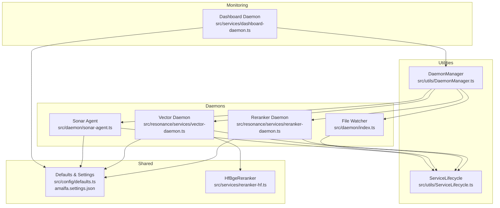

**Diagram sources**
- [DaemonManager.ts](file://src/utils/DaemonManager.ts#L17-L51)
- [ServiceLifecycle.ts](file://src/utils/ServiceLifecycle.ts#L12-L209)
- [vector-daemon.ts](file://src/resonance/services/vector-daemon.ts#L20-L26)
- [reranker-daemon.ts](file://src/resonance/services/reranker-daemon.ts#L18-L24)
- [index.ts](file://src/daemon/index.ts#L29-L35)
- [sonar-agent.ts](file://src/daemon/sonar-agent.ts#L49-L55)
- [dashboard-daemon.ts](file://src/services/dashboard-daemon.ts#L25-L32)
- [reranker-hf.ts](file://src/services/reranker-hf.ts#L22-L41)
- [defaults.ts](file://src/config/defaults.ts#L15-L59)
- [amalfa.settings.json](file://amalfa.settings.json#L1-L96)

**Section sources**
- [DaemonManager.ts](file://src/utils/DaemonManager.ts#L17-L51)
- [ServiceLifecycle.ts](file://src/utils/ServiceLifecycle.ts#L12-L209)
- [defaults.ts](file://src/config/defaults.ts#L15-L59)

## Core Components
- DaemonManager: Central coordinator for four daemons, exposing status checks and start/stop/restart actions
- ServiceLifecycle: Generic lifecycle manager that spawns detached processes, writes PID/log files, and supports graceful stop
- Vector Daemon: Embedding and reranking HTTP service with lazy model loading
- Reranker Daemon: Pure reranking service (no embeddings)
- File Watcher: Incremental ingestion daemon with debouncing and retry queues
- Sonar Agent: Multi-purpose HTTP API with task processing and inference routing
- Dashboard Daemon: Live monitoring UI with SSE, stats, and service control
- HfBgeReranker: Singleton reranker using Transformers.js

**Section sources**
- [DaemonManager.ts](file://src/utils/DaemonManager.ts#L17-L260)
- [ServiceLifecycle.ts](file://src/utils/ServiceLifecycle.ts#L12-L209)
- [vector-daemon.ts](file://src/resonance/services/vector-daemon.ts#L20-L234)
- [reranker-daemon.ts](file://src/resonance/services/reranker-daemon.ts#L18-L145)
- [index.ts](file://src/daemon/index.ts#L29-L293)
- [sonar-agent.ts](file://src/daemon/sonar-agent.ts#L49-L221)
- [dashboard-daemon.ts](file://src/services/dashboard-daemon.ts#L25-L507)
- [reranker-hf.ts](file://src/services/reranker-hf.ts#L22-L130)

## Architecture Overview
The system uses a modular, HTTP-centric architecture:
- Lifecycle orchestration via DaemonManager and ServiceLifecycle
- Dedicated microservices for embeddings, reranking, file watching, and monitoring
- Sonar Agent as a task-driven controller with an HTTP API
- Configuration-driven behavior via amalfa.settings.json and defaults.ts

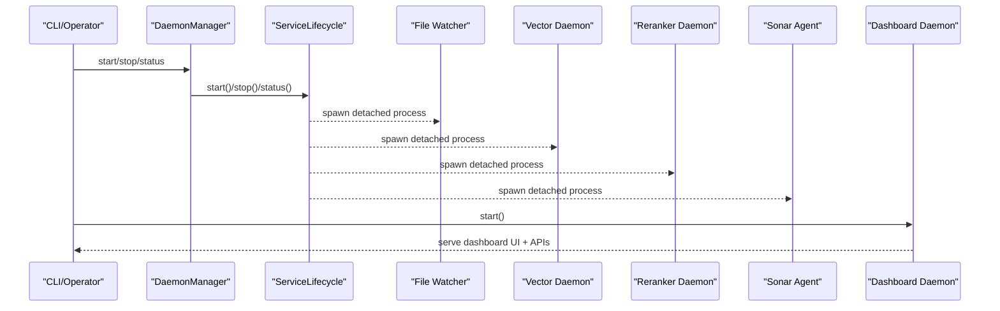

**Diagram sources**
- [DaemonManager.ts](file://src/utils/DaemonManager.ts#L103-L114)
- [ServiceLifecycle.ts](file://src/utils/ServiceLifecycle.ts#L27-L67)
- [index.ts](file://src/daemon/index.ts#L291-L293)
- [vector-daemon.ts](file://src/resonance/services/vector-daemon.ts#L232-L234)
- [reranker-daemon.ts](file://src/resonance/services/reranker-daemon.ts#L143-L145)
- [sonar-agent.ts](file://src/daemon/sonar-agent.ts#L219-L221)
- [dashboard-daemon.ts](file://src/services/dashboard-daemon.ts#L491-L507)

## Detailed Component Analysis

### DaemonManager
Responsibilities:
- Manage four daemons: vector, reranker, file watcher, Sonar Agent
- Provide status checks and coordinated start/stop
- Use ServiceLifecycle per daemon with dedicated PID/log files

Key behaviors:
- Status checks read PID files and verify process liveness
- Startup waits for daemons to initialize before returning
- Parallel stop for graceful shutdown

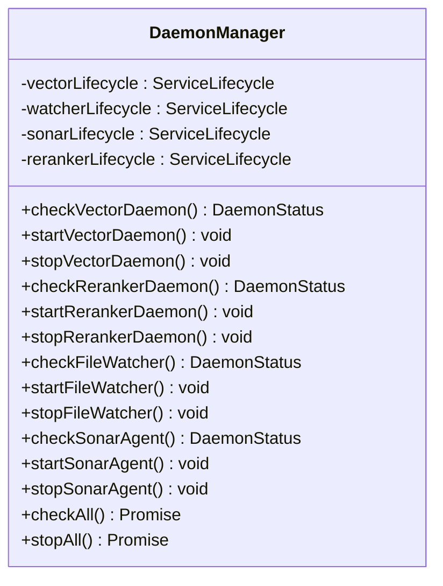

**Diagram sources**
- [DaemonManager.ts](file://src/utils/DaemonManager.ts#L17-L51)
- [ServiceLifecycle.ts](file://src/utils/ServiceLifecycle.ts#L12-L209)

**Section sources**
- [DaemonManager.ts](file://src/utils/DaemonManager.ts#L17-L260)

### ServiceLifecycle
Responsibilities:
- Start/stop/restart/status/serve commands
- PID file management and stale cleanup
- Detached process spawning with log redirection
- Signal handling for graceful shutdown

Behavior highlights:
- start() writes PID file and detaches subprocess
- stop() sends SIGTERM with fallback to SIGKILL
- serve() writes PID for foreground processes and registers cleanup hooks

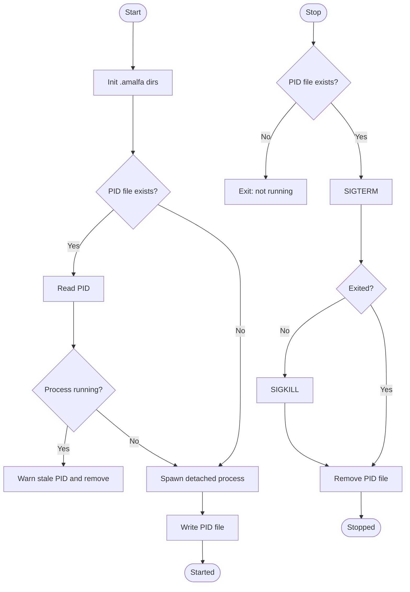

**Diagram sources**
- [ServiceLifecycle.ts](file://src/utils/ServiceLifecycle.ts#L27-L108)

**Section sources**
- [ServiceLifecycle.ts](file://src/utils/ServiceLifecycle.ts#L12-L209)

### Vector Daemon
Responsibilities:
- HTTP server for embeddings and reranking
- Lazy initialization of embedding and reranker models
- FAFCAS normalization for embeddings

Endpoints:
- GET /health: readiness and model info
- POST /embed: generate normalized embedding
- POST /rerank: rerank documents using BGE

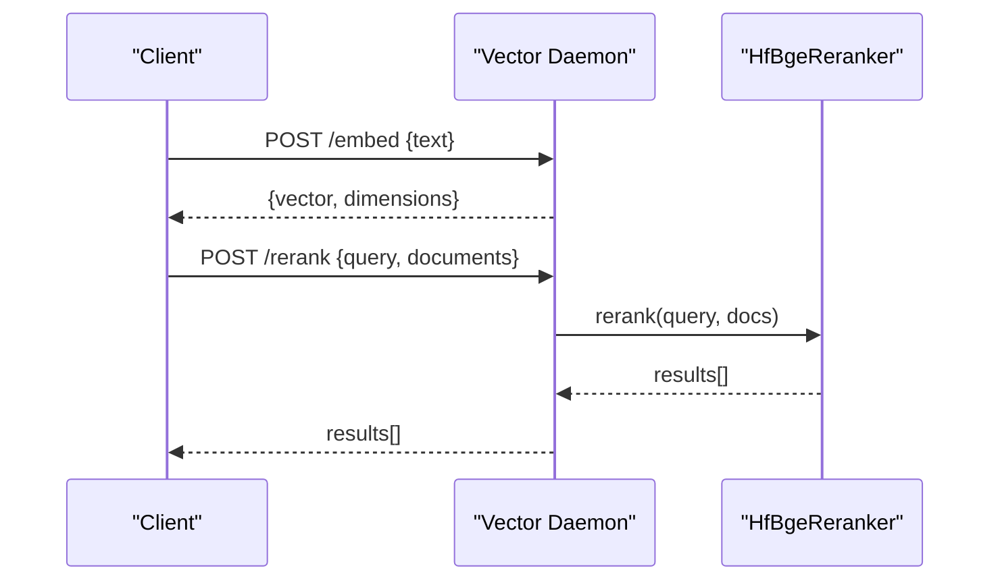

**Diagram sources**
- [vector-daemon.ts](file://src/resonance/services/vector-daemon.ts#L72-L230)
- [reranker-hf.ts](file://src/services/reranker-hf.ts#L74-L128)

**Section sources**
- [vector-daemon.ts](file://src/resonance/services/vector-daemon.ts#L20-L234)
- [reranker-hf.ts](file://src/services/reranker-hf.ts#L22-L130)

### Reranker Daemon
Responsibilities:
- Dedicated reranking service (no embeddings)
- Lazy model initialization
- Health and rerank endpoints

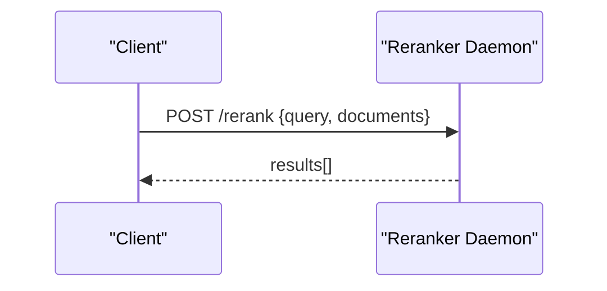

**Diagram sources**
- [reranker-daemon.ts](file://src/resonance/services/reranker-daemon.ts#L43-L141)

**Section sources**
- [reranker-daemon.ts](file://src/resonance/services/reranker-daemon.ts#L18-L145)

### File Watcher Daemon
Responsibilities:
- Watch configured directories recursively
- Debounce file changes and process markdown batches
- Run Ember enrichment on changed files
- Retry failed ingestions with exponential backoff
- Send notifications on completion/error

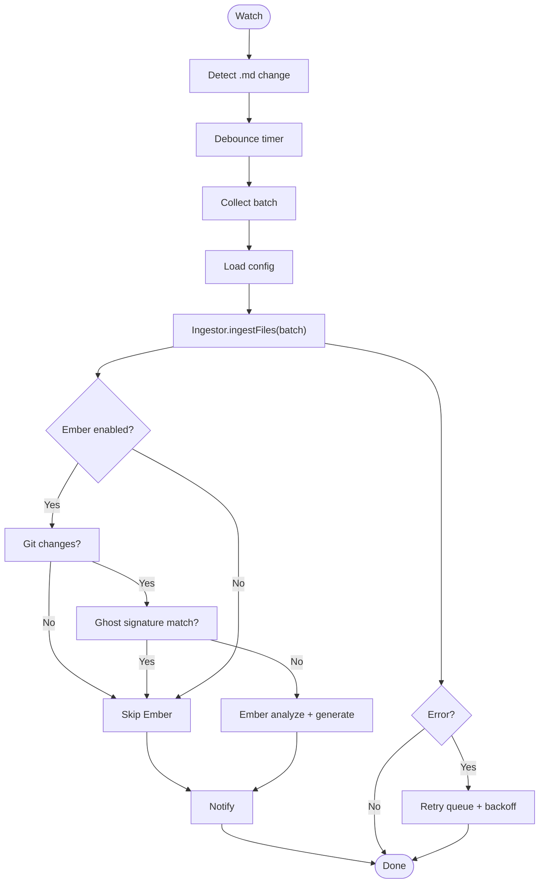

**Diagram sources**
- [index.ts](file://src/daemon/index.ts#L100-L289)

**Section sources**
- [index.ts](file://src/daemon/index.ts#L29-L293)

### Sonar Agent
Responsibilities:
- Multi-purpose HTTP API for chat, metadata enhancement, search analysis, reranking, and context extraction
- Task-driven processing via filesystem-based task queues
- Inference routing to local Ollama or cloud providers
- Periodic task processing loop with graph reload

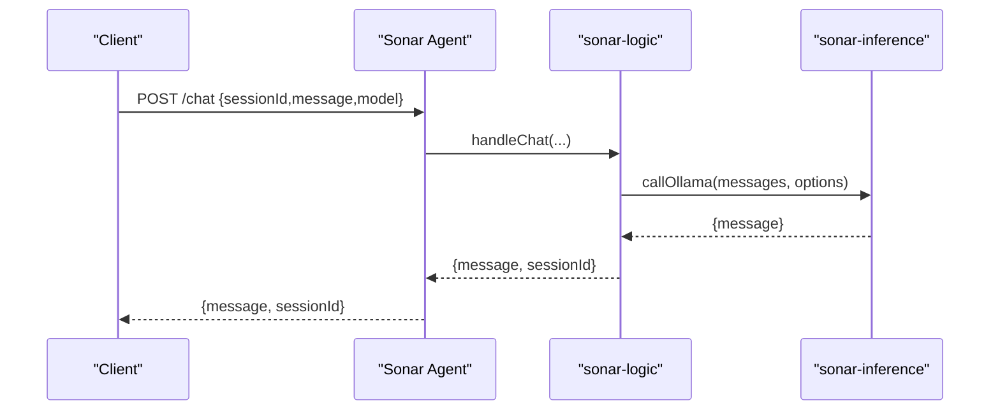

**Diagram sources**
- [sonar-agent.ts](file://src/daemon/sonar-agent.ts#L106-L116)
- [sonar-server.ts](file://src/daemon/sonar-server.ts#L58-L67)
- [sonar-logic.ts](file://src/daemon/sonar-logic.ts#L104-L179)
- [sonar-inference.ts](file://src/daemon/sonar-inference.ts#L19-L119)

**Section sources**
- [sonar-agent.ts](file://src/daemon/sonar-agent.ts#L49-L221)
- [sonar-server.ts](file://src/daemon/sonar-server.ts#L24-L133)
- [sonar-logic.ts](file://src/daemon/sonar-logic.ts#L19-L685)
- [sonar-inference.ts](file://src/daemon/sonar-inference.ts#L10-L120)

### Dashboard Daemon
Responsibilities:
- Serve UI and static assets
- Expose monitoring endpoints (stats, services, harvest)
- Control services via CLI proxy
- Stream live stats via SSE
- Serve database file for graph explorer

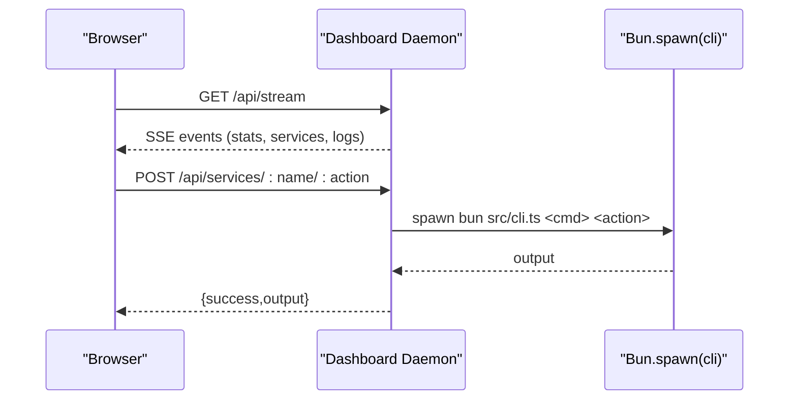

**Diagram sources**
- [dashboard-daemon.ts](file://src/services/dashboard-daemon.ts#L146-L313)

**Section sources**
- [dashboard-daemon.ts](file://src/services/dashboard-daemon.ts#L25-L507)

## Dependency Analysis
- DaemonManager depends on ServiceLifecycle for each daemon
- Vector and reranker daemons depend on HfBgeReranker
- Sonar Agent depends on configuration, inference routing, and graph/vector engines
- File Watcher depends on ingestion pipeline and Ember integration
- Dashboard depends on configuration and CLI for service control

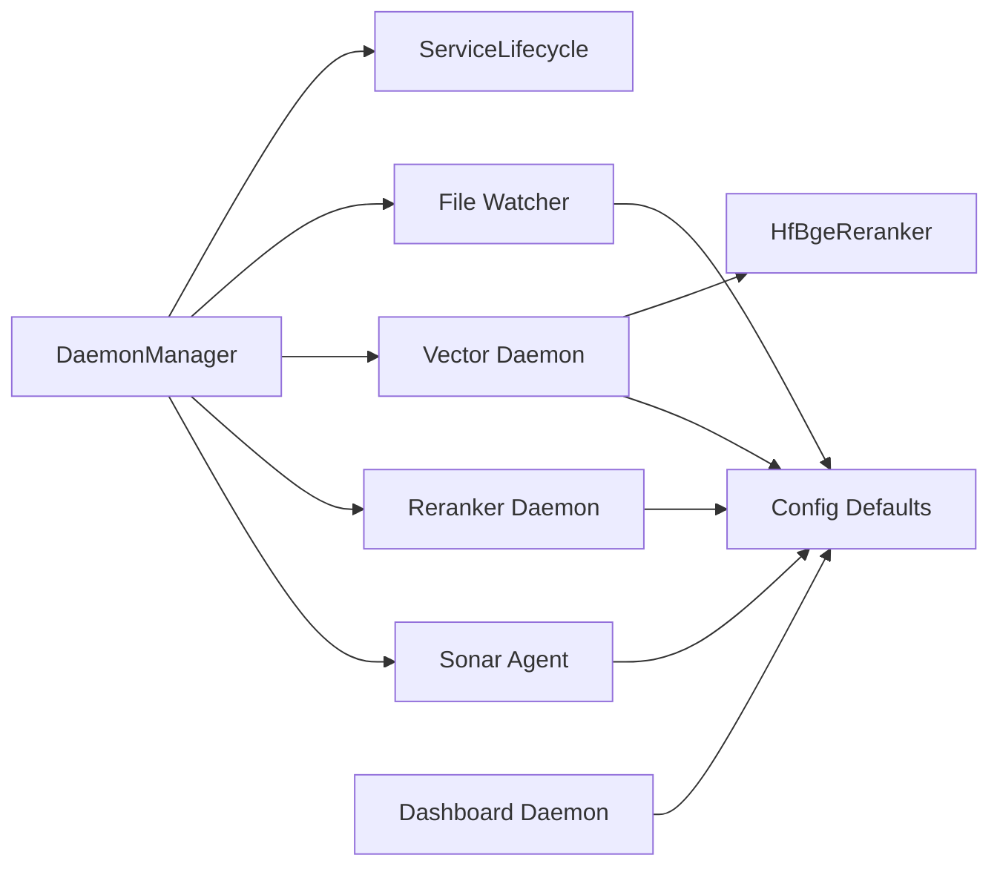

**Diagram sources**
- [DaemonManager.ts](file://src/utils/DaemonManager.ts#L17-L51)
- [vector-daemon.ts](file://src/resonance/services/vector-daemon.ts#L20-L26)
- [reranker-daemon.ts](file://src/resonance/services/reranker-daemon.ts#L18-L24)
- [index.ts](file://src/daemon/index.ts#L29-L35)
- [sonar-agent.ts](file://src/daemon/sonar-agent.ts#L49-L55)
- [dashboard-daemon.ts](file://src/services/dashboard-daemon.ts#L25-L32)
- [reranker-hf.ts](file://src/services/reranker-hf.ts#L22-L41)
- [defaults.ts](file://src/config/defaults.ts#L15-L59)

**Section sources**
- [DaemonManager.ts](file://src/utils/DaemonManager.ts#L17-L51)
- [defaults.ts](file://src/config/defaults.ts#L15-L59)

## Performance Considerations
- Embedding throughput: Vector Daemon keeps FastEmbed model in memory; ensure adequate RAM for model and cache directories
- Reranking latency: Reranker daemon lazily initializes BGE model; warm-up on first request
- File watcher batching: Debounce reduces I/O; adjust watch.debounce in settings for throughput vs. freshness
- Sonar Agent concurrency: Batch metadata enhancement uses Promise.allSettled; tune batchSize and model selection
- SSE streaming: Dashboard pushes stats and logs; keep intervals reasonable for UI responsiveness
- Disk I/O: Ensure .amalfa cache and runtime directories are on fast storage

[No sources needed since this section provides general guidance]

## Troubleshooting Guide
Common issues and resolutions:
- Daemon fails to start
  - Check PID file presence and stale state; ServiceLifecycle cleans stale PIDs automatically
  - Verify logs in .amalfa/logs/<daemon>.log
- Daemon not responding
  - Use DaemonManager.check*() to confirm running state and ports
  - For Sonar Agent, check /health endpoint and model availability
- Vector/Reranker errors
  - Confirm model initialization logs; reranker daemon lazy-loads on first request
  - Check cache directory permissions under .amalfa/cache
- File watcher stuck or not ingesting
  - Adjust watch.debounce and sources in amalfa.settings.json
  - Inspect retry queue and logs for persistent failures
- Dashboard not reachable
  - Confirm port 3013 is free and PID file does not point to stale process
  - Use CLI proxy to execute commands and capture output in logs

Operational commands:
- Start/stop/status/restart daemons via DaemonManager
- Use Dashboard UI to control services and monitor stats
- Inspect recent logs via Dashboard log stream

**Section sources**
- [ServiceLifecycle.ts](file://src/utils/ServiceLifecycle.ts#L72-L108)
- [DaemonManager.ts](file://src/utils/DaemonManager.ts#L84-L212)
- [vector-daemon.ts](file://src/resonance/services/vector-daemon.ts#L36-L75)
- [reranker-daemon.ts](file://src/resonance/services/reranker-daemon.ts#L32-L38)
- [index.ts](file://src/daemon/index.ts#L232-L287)
- [dashboard-daemon.ts](file://src/services/dashboard-daemon.ts#L447-L467)

## Conclusion
Amalfa’s service management system provides a robust, modular foundation for background services, lifecycle control, and monitoring. DaemonManager and ServiceLifecycle offer consistent control across daemons, while specialized services (vector, reranker, file watcher, Sonar Agent, Dashboard) deliver focused capabilities. Configuration-driven behavior and structured logging enable reliable operation and efficient troubleshooting.

[No sources needed since this section summarizes without analyzing specific files]

## Appendices

### Service Configuration
- Central configuration: amalfa.settings.json
- Directory structure: defaults.ts defines .amalfa base, logs, runtime, cache, scratchpad, and task queues
- Ports: Vector Daemon (default 3010), Reranker Daemon (default 3011), Sonar Agent (default 3012), Dashboard (default 3013)

**Section sources**
- [amalfa.settings.json](file://amalfa.settings.json#L1-L96)
- [defaults.ts](file://src/config/defaults.ts#L15-L59)

### Logging Strategy
- Each service writes to its own log file under .amalfa/logs
- ServiceLifecycle truncates logs on start and redirects stdout/stderr
- Dashboard streams recent logs via SSE for real-time visibility

**Section sources**
- [ServiceLifecycle.ts](file://src/utils/ServiceLifecycle.ts#L44-L56)
- [dashboard-daemon.ts](file://src/services/dashboard-daemon.ts#L447-L467)

### Error Recovery Mechanisms
- File watcher: retry queue with exponential backoff and abandonment after max retries
- DaemonManager: parallel stop for graceful shutdown
- ServiceLifecycle: SIGTERM followed by SIGKILL if needed; PID cleanup on exit

**Section sources**
- [index.ts](file://src/daemon/index.ts#L232-L287)
- [ServiceLifecycle.ts](file://src/utils/ServiceLifecycle.ts#L82-L108)
- [DaemonManager.ts](file://src/utils/DaemonManager.ts#L251-L258)

### Service Dependency Graph and Startup Ordering
- Startup order: File Watcher, Vector Daemon, Reranker Daemon, Sonar Agent, Dashboard
- Dependencies:
  - Vector Daemon depends on HfBgeReranker and FastEmbed model
  - Sonar Agent depends on configuration and inference provider availability
  - Dashboard depends on CLI for service control and configuration for stats

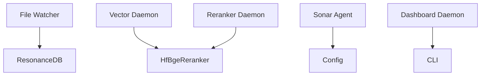

**Diagram sources**
- [index.ts](file://src/daemon/index.ts#L154-L160)
- [vector-daemon.ts](file://src/resonance/services/vector-daemon.ts#L28-L31)
- [reranker-daemon.ts](file://src/resonance/services/reranker-daemon.ts#L26-L27)
- [sonar-agent.ts](file://src/daemon/sonar-agent.ts#L67-L70)
- [dashboard-daemon.ts](file://src/services/dashboard-daemon.ts#L113-L127)

### Scaling Considerations
- Increase Sonar Agent batch sizes for metadata enhancement
- Tune watch.debounce for high-volume file changes
- Use cloud inference for Sonar Agent when local resources are constrained
- Monitor SSE stream frequency to balance UI responsiveness and server load

[No sources needed since this section provides general guidance]