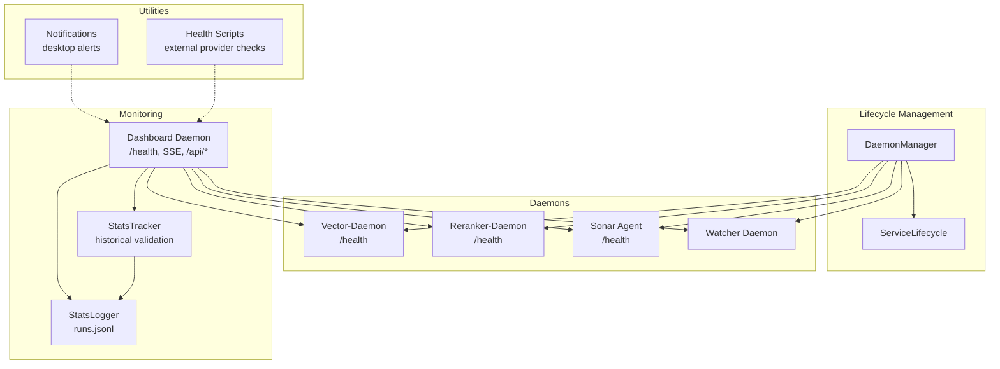
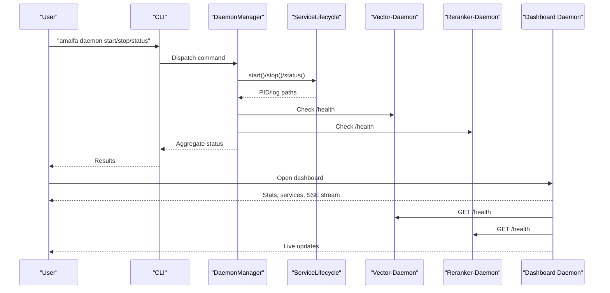
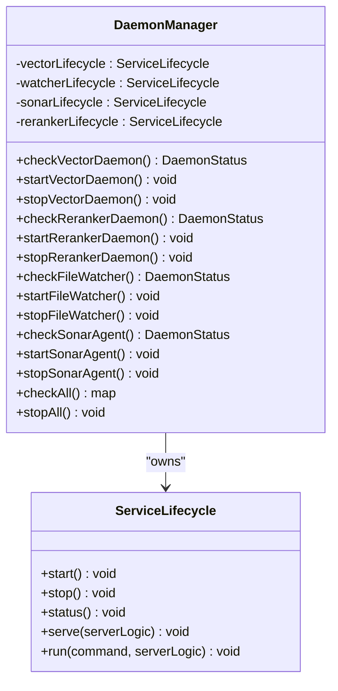
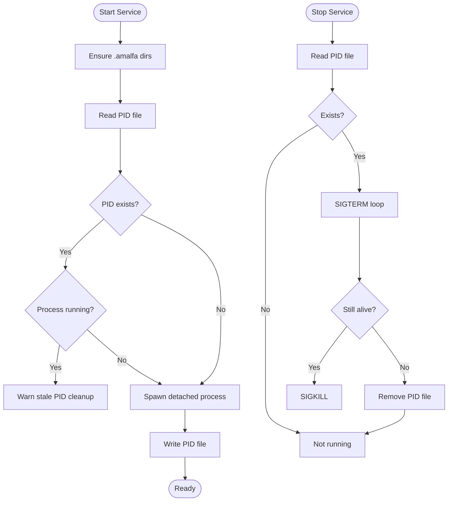
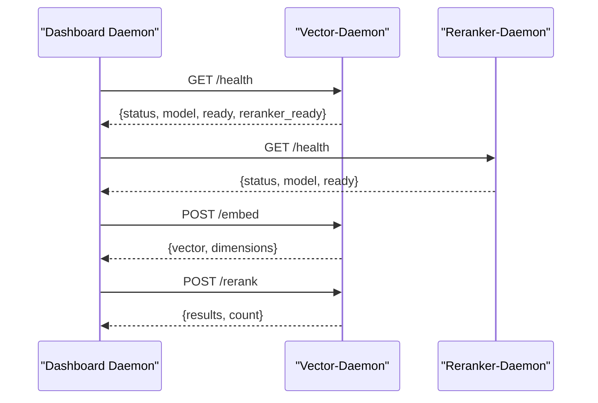
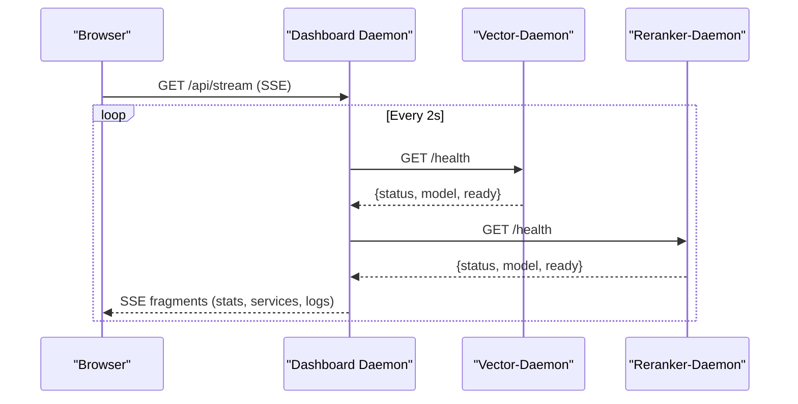
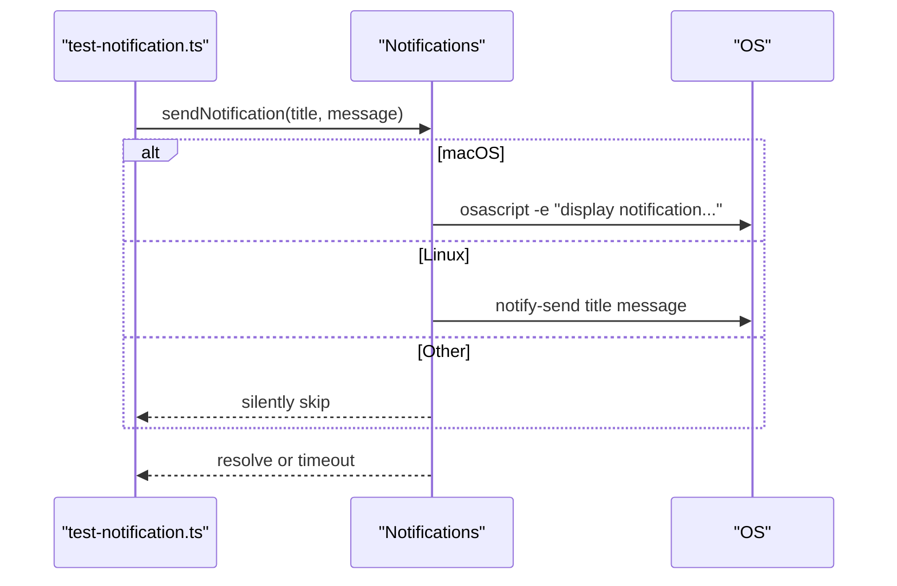
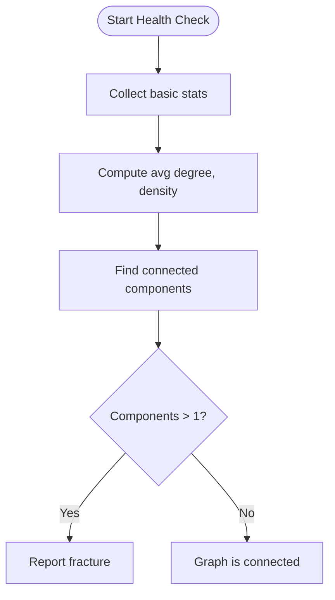
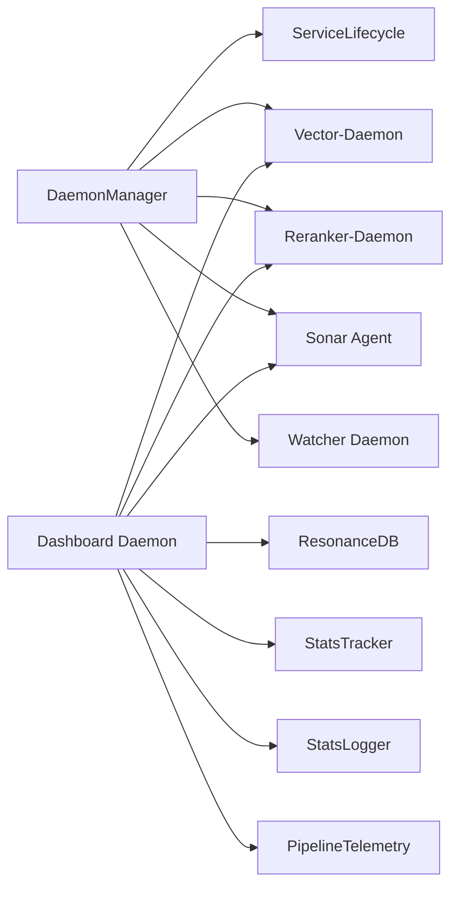

# Service Monitoring and Health Checks

<cite>
**Referenced Files in This Document**
- [DaemonManager.ts](file://src/utils/DaemonManager.ts)
- [ServiceLifecycle.ts](file://src/utils/ServiceLifecycle.ts)
- [Notifications.ts](file://src/utils/Notifications.ts)
- [vector-daemon.ts](file://src/resonance/services/vector-daemon.ts)
- [reranker-daemon.ts](file://src/resonance/services/reranker-daemon.ts)
- [dashboard-daemon.ts](file://src/services/dashboard-daemon.ts)
- [StatsTracker.ts](file://src/utils/StatsTracker.ts)
- [StatsLogger.ts](file://src/utils/StatsLogger.ts)
- [analyze_health.ts](file://scripts/verify/analyze_health.ts)
- [health-check.ts](file://tests/langextract-comparison/health-check.ts)
- [test-notification.ts](file://scripts/test-notification.ts)
- [brief-amalfa-monitoring-dashboard.md](file://briefs/future/brief-amalfa-monitoring-dashboard.md)
</cite>

## Table of Contents
1. [Introduction](#introduction)
2. [Project Structure](#project-structure)
3. [Core Components](#core-components)
4. [Architecture Overview](#architecture-overview)
5. [Detailed Component Analysis](#detailed-component-analysis)
6. [Dependency Analysis](#dependency-analysis)
7. [Performance Considerations](#performance-considerations)
8. [Troubleshooting Guide](#troubleshooting-guide)
9. [Conclusion](#conclusion)
10. [Appendices](#appendices)

## Introduction
This document describes Amalfa’s service monitoring and health check systems. It covers centralized monitoring architecture, status checking mechanisms, health indicators, alerting, automatic recovery, failover, metrics collection, performance tracking, and notification delivery. It also documents the integration between DaemonManager and monitoring components, and outlines configuration options and troubleshooting strategies.

## Project Structure
Monitoring and health-related capabilities are implemented across several modules:
- Daemon lifecycle and status management
- Dedicated daemons with health endpoints
- Dashboard daemon for visualization and diagnostics
- Metrics tracking and logging utilities
- Health scripts for external provider checks
- Notification utilities for user alerts



**Diagram sources**
- [DaemonManager.ts](file://src/utils/DaemonManager.ts#L17-L260)
- [ServiceLifecycle.ts](file://src/utils/ServiceLifecycle.ts#L12-L209)
- [vector-daemon.ts](file://src/resonance/services/vector-daemon.ts#L72-L234)
- [reranker-daemon.ts](file://src/resonance/services/reranker-daemon.ts#L43-L145)
- [dashboard-daemon.ts](file://src/services/dashboard-daemon.ts#L25-L490)
- [StatsTracker.ts](file://src/utils/StatsTracker.ts#L25-L218)
- [StatsLogger.ts](file://src/utils/StatsLogger.ts#L19-L84)
- [Notifications.ts](file://src/utils/Notifications.ts#L8-L66)
- [health-check.ts](file://tests/langextract-comparison/health-check.ts#L1-L307)

**Section sources**
- [DaemonManager.ts](file://src/utils/DaemonManager.ts#L17-L260)
- [ServiceLifecycle.ts](file://src/utils/ServiceLifecycle.ts#L12-L209)
- [dashboard-daemon.ts](file://src/services/dashboard-daemon.ts#L25-L490)

## Core Components
- DaemonManager: Central coordinator for vector, reranker, watcher, and Sonar Agent daemons. Provides status checks, start/stop/restart, and aggregate status reporting.
- ServiceLifecycle: Generic lifecycle manager for background services, including PID file handling, graceful stop, and serve mode.
- Vector and Reranker Daemons: HTTP endpoints with /health for readiness and model info; lazy model initialization; SSE-compatible dashboard integration.
- Dashboard Daemon: Aggregates system stats, service status, pipeline telemetry, and logs; serves SSE for live updates; exposes CLI proxy and static assets.
- StatsTracker: Historical snapshot recording and validation with thresholds for regressions and coverage.
- StatsLogger: JSONL logging of runs for operational insights and cost estimation.
- Notifications: Desktop notifications for user-facing events.
- Health Scripts: Provider health checks for external inference APIs.

**Section sources**
- [DaemonManager.ts](file://src/utils/DaemonManager.ts#L17-L260)
- [ServiceLifecycle.ts](file://src/utils/ServiceLifecycle.ts#L12-L209)
- [vector-daemon.ts](file://src/resonance/services/vector-daemon.ts#L72-L234)
- [reranker-daemon.ts](file://src/resonance/services/reranker-daemon.ts#L43-L145)
- [dashboard-daemon.ts](file://src/services/dashboard-daemon.ts#L25-L490)
- [StatsTracker.ts](file://src/utils/StatsTracker.ts#L25-L218)
- [StatsLogger.ts](file://src/utils/StatsLogger.ts#L19-L84)
- [Notifications.ts](file://src/utils/Notifications.ts#L8-L66)
- [health-check.ts](file://tests/langextract-comparison/health-check.ts#L1-L307)

## Architecture Overview
The monitoring architecture integrates lifecycle management, health endpoints, telemetry, and a dashboard for visualization and control.



**Diagram sources**
- [DaemonManager.ts](file://src/utils/DaemonManager.ts#L84-L246)
- [ServiceLifecycle.ts](file://src/utils/ServiceLifecycle.ts#L27-L108)
- [vector-daemon.ts](file://src/resonance/services/vector-daemon.ts#L82-L95)
- [reranker-daemon.ts](file://src/resonance/services/reranker-daemon.ts#L50-L62)
- [dashboard-daemon.ts](file://src/services/dashboard-daemon.ts#L140-L276)

## Detailed Component Analysis

### DaemonManager
- Responsibilities:
  - Manage multiple daemons: vector, reranker, file watcher, Sonar Agent.
  - Read PID files and detect running processes.
  - Provide per-service status and actions (start/stop/restart).
  - Aggregate status across all daemons.
- Integration:
  - Uses ServiceLifecycle for process management.
  - Calls /health endpoints for vector/reranker/Sonar.
- Automatic recovery:
  - Restart logic via ServiceLifecycle.restart path.
  - No built-in watchdog loop; relies on external orchestration or periodic checks.



**Diagram sources**
- [DaemonManager.ts](file://src/utils/DaemonManager.ts#L17-L260)
- [ServiceLifecycle.ts](file://src/utils/ServiceLifecycle.ts#L12-L209)

**Section sources**
- [DaemonManager.ts](file://src/utils/DaemonManager.ts#L17-L260)

### ServiceLifecycle
- Responsibilities:
  - Start/stop services in background with detached process.
  - Manage PID files and stale PID cleanup.
  - Provide serve mode with signal handling and PID file cleanup.
  - Support CLI commands: start, stop, status, restart, serve.
- Failover and recovery:
  - Graceful stop with SIGTERM and fallback to SIGKILL.
  - Cleanup PID file on exit or crash.



**Diagram sources**
- [ServiceLifecycle.ts](file://src/utils/ServiceLifecycle.ts#L27-L108)

**Section sources**
- [ServiceLifecycle.ts](file://src/utils/ServiceLifecycle.ts#L12-L209)

### Vector and Reranker Daemons
- Endpoints:
  - /health: status, model, readiness flags.
  - /embed (vector): generates normalized embeddings.
  - /rerank (vector and reranker): reranks documents.
- Health indicators:
  - Model name and readiness flags in /health.
  - Lazy model loading to reduce cold-start latency.
- Integration:
  - Dashboard queries /health for readiness and model info.
  - DaemonManager reads /health for status checks.



**Diagram sources**
- [vector-daemon.ts](file://src/resonance/services/vector-daemon.ts#L82-L219)
- [reranker-daemon.ts](file://src/resonance/services/reranker-daemon.ts#L50-L131)
- [dashboard-daemon.ts](file://src/services/dashboard-daemon.ts#L89-L92)

**Section sources**
- [vector-daemon.ts](file://src/resonance/services/vector-daemon.ts#L72-L234)
- [reranker-daemon.ts](file://src/resonance/services/reranker-daemon.ts#L43-L145)

### Dashboard Daemon
- Features:
  - Static asset serving and legacy dashboards.
  - System stats API and service status API.
  - CLI proxy to execute commands via dashboard.
  - SSE stream for live updates (services, stats, pipeline telemetry, logs).
  - Health endpoint for readiness.
- Metrics and telemetry:
  - Reads ResonanceDB stats, service PID files, harvest manifest, recent runs.
  - Integrates PipelineTelemetry via telemetry.getStats().
- Visualization and diagnostics:
  - Live fragments merged via SSE events for efficient UI updates.



**Diagram sources**
- [dashboard-daemon.ts](file://src/services/dashboard-daemon.ts#L145-L276)
- [vector-daemon.ts](file://src/resonance/services/vector-daemon.ts#L82-L95)
- [reranker-daemon.ts](file://src/resonance/services/reranker-daemon.ts#L50-L62)

**Section sources**
- [dashboard-daemon.ts](file://src/services/dashboard-daemon.ts#L25-L490)

### StatsTracker and StatsLogger
- StatsTracker:
  - Records snapshots with timestamps and metrics.
  - Validates current state against history with thresholds for regressions and coverage.
  - Maintains a capped history (last 100 snapshots).
- StatsLogger:
  - Logs runs to runs.jsonl with operation type, counts, duration, and cost estimates.
  - Supports harvest and init operations.

```mermaid
flowchart TD
Record([Record Snapshot]) --> Load["Load stats-history.json"]
Load --> Push["Push snapshot"]
Push --> Cap{"> 100 snapshots?"}
Cap --> |Yes| Slice["Keep last 100"]
Cap --> |No| Save
Slice --> Save["Write stats-history.json"]
Validate([Validate Current]) --> Load2["Load latest snapshot"]
Load2 --> Compare{"Compare metrics"}
Compare --> Warns["Compute warnings/errors"]
Warns --> Result([Return {valid,warnings,errors}])
```

**Diagram sources**
- [StatsTracker.ts](file://src/utils/StatsTracker.ts#L72-L174)
- [StatsLogger.ts](file://src/utils/StatsLogger.ts#L23-L82)

**Section sources**
- [StatsTracker.ts](file://src/utils/StatsTracker.ts#L25-L218)
- [StatsLogger.ts](file://src/utils/StatsLogger.ts#L19-L84)

### Notifications
- Functionality:
  - Sends native desktop notifications on macOS and Linux.
  - Uses osascript on macOS and notify-send on Linux.
  - Non-blocking with timeouts and graceful failure.
- Usage:
  - Example test script invokes sendNotification for user feedback.



**Diagram sources**
- [Notifications.ts](file://src/utils/Notifications.ts#L8-L66)
- [test-notification.ts](file://scripts/test-notification.ts#L1-L16)

**Section sources**
- [Notifications.ts](file://src/utils/Notifications.ts#L8-L66)
- [test-notification.ts](file://scripts/test-notification.ts#L1-L16)

### Health Scripts
- analyze_health.ts:
  - Computes basic graph metrics (nodes, edges, density, connected components).
  - Detects graph fracture (multiple components).
- health-check.ts:
  - Tests external provider health (Gemini direct, OpenRouter, Ollama).
  - Reports latency, status, and errors; exits with non-zero on failures.



**Diagram sources**
- [analyze_health.ts](file://scripts/verify/analyze_health.ts#L7-L87)
- [health-check.ts](file://tests/langextract-comparison/health-check.ts#L286-L307)

**Section sources**
- [analyze_health.ts](file://scripts/verify/analyze_health.ts#L1-L88)
- [health-check.ts](file://tests/langextract-comparison/health-check.ts#L1-L307)

## Dependency Analysis
- DaemonManager depends on ServiceLifecycle and external daemons’ /health endpoints.
- Dashboard Daemon depends on:
  - Vector/Reranker /health for readiness.
  - ResonanceDB for stats.
  - StatsTracker and StatsLogger for historical context.
  - PipelineTelemetry for live pipeline metrics.
- StatsTracker and StatsLogger are decoupled and can be used independently.



**Diagram sources**
- [DaemonManager.ts](file://src/utils/DaemonManager.ts#L17-L260)
- [dashboard-daemon.ts](file://src/services/dashboard-daemon.ts#L25-L490)
- [StatsTracker.ts](file://src/utils/StatsTracker.ts#L25-L218)
- [StatsLogger.ts](file://src/utils/StatsLogger.ts#L19-L84)

**Section sources**
- [DaemonManager.ts](file://src/utils/DaemonManager.ts#L17-L260)
- [dashboard-daemon.ts](file://src/services/dashboard-daemon.ts#L25-L490)

## Performance Considerations
- Model initialization:
  - Vector daemon lazily initializes reranker on first request to reduce cold-start latency.
- Streaming updates:
  - Dashboard uses SSE with 2-second intervals; adjust for higher frequency if needed.
- Logging overhead:
  - runs.jsonl appended per run; cost estimation included for inference operations.
- Validation cost:
  - StatsTracker.validate() performs comparisons; run periodically rather than continuously.

[No sources needed since this section provides general guidance]

## Troubleshooting Guide
- Daemon does not start:
  - Check PID file and stale process; ServiceLifecycle clears stale PID and starts cleanly.
  - Verify environment variables and ports.
- Daemon not responding:
  - Use /health endpoints to confirm readiness and model info.
  - Check logs in .amalfa/logs.
- Dashboard not updating:
  - Confirm SSE connection and interval.
  - Validate /health endpoints for upstream daemons.
- Provider health failures:
  - health-check.ts prints summaries and exits non-zero on failures.
  - Verify API keys and network connectivity.
- Notifications not received:
  - Notifications are non-critical; ensure osascript or notify-send available and timeouts are not exceeded.

**Section sources**
- [ServiceLifecycle.ts](file://src/utils/ServiceLifecycle.ts#L27-L108)
- [vector-daemon.ts](file://src/resonance/services/vector-daemon.ts#L82-L95)
- [reranker-daemon.ts](file://src/resonance/services/reranker-daemon.ts#L50-L62)
- [dashboard-daemon.ts](file://src/services/dashboard-daemon.ts#L145-L276)
- [health-check.ts](file://tests/langextract-comparison/health-check.ts#L242-L284)
- [Notifications.ts](file://src/utils/Notifications.ts#L14-L30)

## Conclusion
Amalfa’s monitoring and health system centers on robust daemon lifecycle management, standardized health endpoints, a dashboard for live diagnostics, and historical metrics tracking. While automatic recovery is handled by ServiceLifecycle and external orchestration, the system provides strong observability through SSE, logs, and health scripts. Extending thresholds, alerting, and automated remediation can be added around these building blocks.

[No sources needed since this section summarizes without analyzing specific files]

## Appendices

### Configuration Options
- Ports:
  - Vector-Daemon: VECTOR_PORT (default 3010)
  - Reranker-Daemon: RERANKER_PORT (default 3011)
  - Dashboard Daemon: hard-coded 3013
- Environment variables:
  - .env is inherited by background services spawned by ServiceLifecycle.
- Logging:
  - Logs written to .amalfa/logs/<service>.log; PID files under .amalfa/runtime.

**Section sources**
- [vector-daemon.ts](file://src/resonance/services/vector-daemon.ts#L18-L26)
- [reranker-daemon.ts](file://src/resonance/services/reranker-daemon.ts#L16-L24)
- [dashboard-daemon.ts](file://src/services/dashboard-daemon.ts#L15-L16)
- [ServiceLifecycle.ts](file://src/utils/ServiceLifecycle.ts#L47-L57)

### Monitoring Dashboard Vision
- The brief proposes a generative UI dashboard with:
  - Static stats dashboard and real-time ingestion monitor.
  - Historical trends and graph health dashboards.
  - SSE streaming and Gemini-powered layouts.

**Section sources**
- [brief-amalfa-monitoring-dashboard.md](file://briefs/future/brief-amalfa-monitoring-dashboard.md#L74-L180)