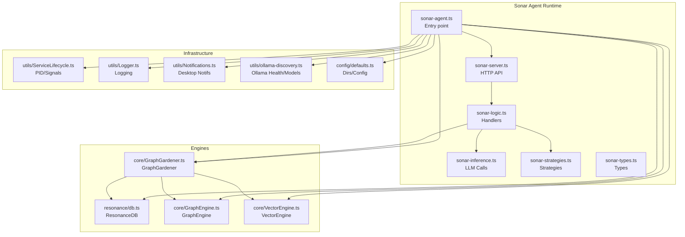
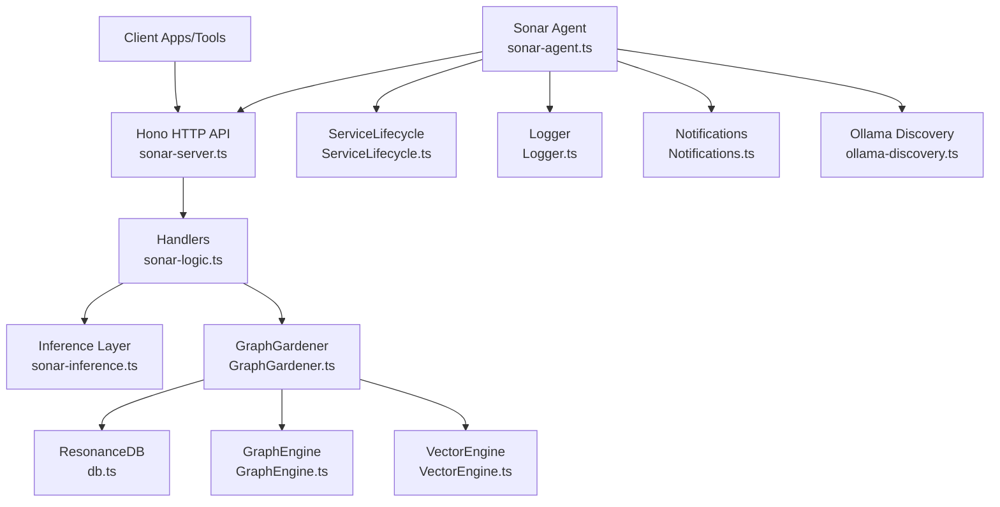
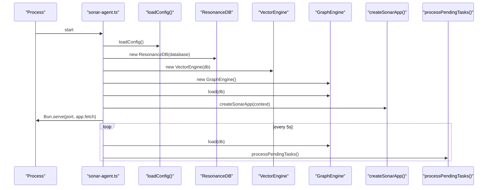
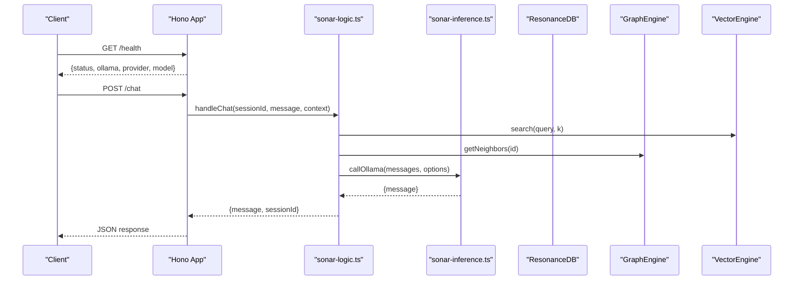
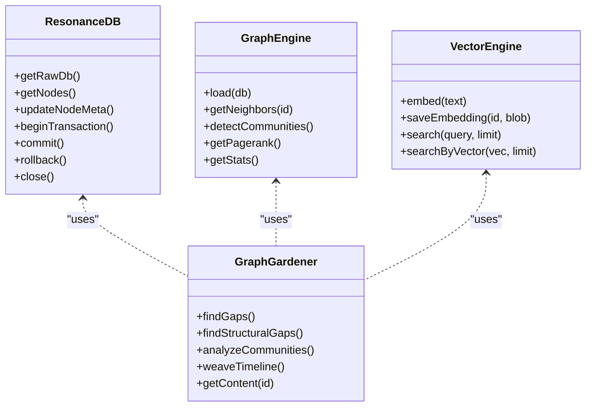
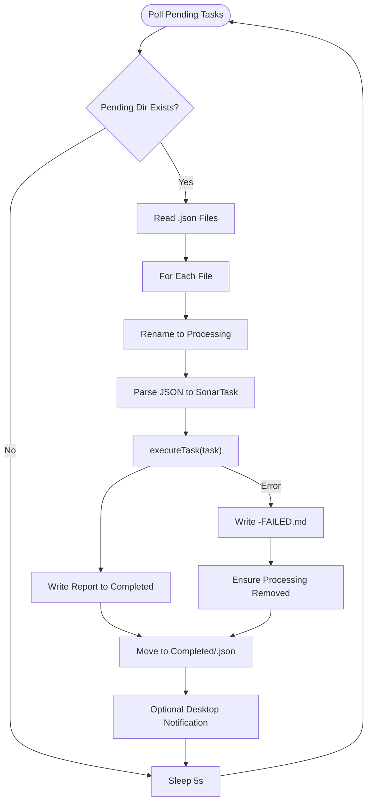
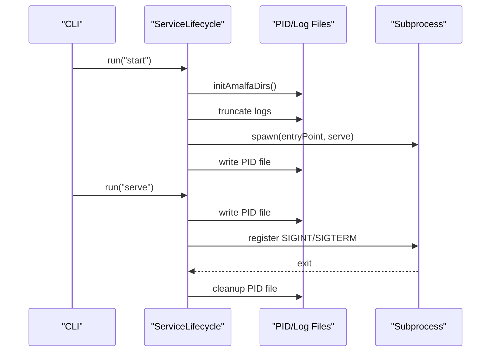
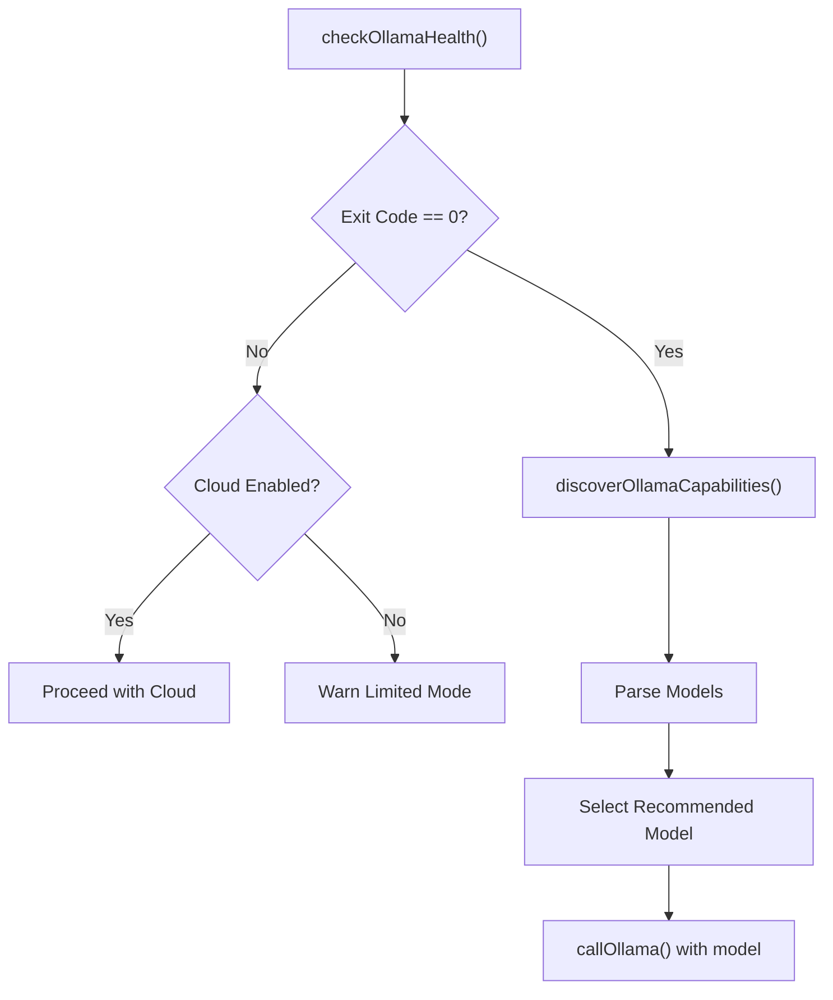
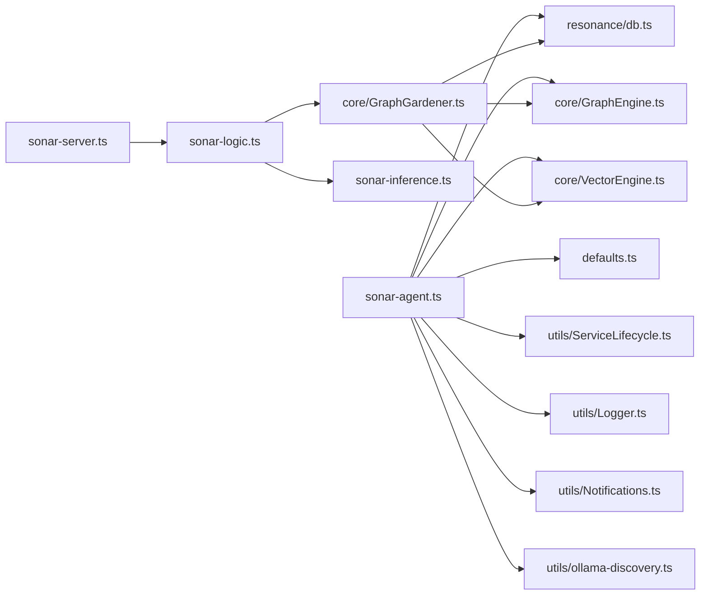

# Architecture and Core Components

<cite>
**Referenced Files in This Document**
- [sonar-agent.ts](file://src/daemon/sonar-agent.ts)
- [sonar-server.ts](file://src/daemon/sonar-server.ts)
- [sonar-logic.ts](file://src/daemon/sonar-logic.ts)
- [sonar-inference.ts](file://src/daemon/sonar-inference.ts)
- [sonar-strategies.ts](file://src/daemon/sonar-strategies.ts)
- [sonar-types.ts](file://src/daemon/sonar-types.ts)
- [ServiceLifecycle.ts](file://src/utils/ServiceLifecycle.ts)
- [Logger.ts](file://src/utils/Logger.ts)
- [Notifications.ts](file://src/utils/Notifications.ts)
- [DaemonManager.ts](file://src/utils/DaemonManager.ts)
- [db.ts](file://src/resonance/db.ts)
- [GraphEngine.ts](file://src/core/GraphEngine.ts)
- [VectorEngine.ts](file://src/core/VectorEngine.ts)
- [GraphGardener.ts](file://src/core/GraphGardener.ts)
- [defaults.ts](file://src/config/defaults.ts)
- [ollama-discovery.ts](file://src/utils/ollama-discovery.ts)
</cite>

## Table of Contents
1. [Introduction](#introduction)
2. [Project Structure](#project-structure)
3. [Core Components](#core-components)
4. [Architecture Overview](#architecture-overview)
5. [Detailed Component Analysis](#detailed-component-analysis)
6. [Dependency Analysis](#dependency-analysis)
7. [Performance Considerations](#performance-considerations)
8. [Troubleshooting Guide](#troubleshooting-guide)
9. [Conclusion](#conclusion)

## Introduction
This document explains the Sonar Agent architecture and core components. It covers the main entry point, service lifecycle management, HTTP server initialization, global state management, task processing pipeline, PID file management, logging infrastructure, integrations with ResonanceDB, GraphEngine, and VectorEngine, health checking for Ollama availability and model discovery, and practical examples for startup/shutdown and error handling.

## Project Structure
The Sonar Agent is implemented as a Bun-based service with a modular architecture:
- Entry point initializes configuration, database, engines, and starts the HTTP server and task watcher.
- HTTP routes expose health checks, chat, metadata enhancement, search analysis, reranking, and context extraction.
- Task processing reads tasks from a filesystem-based queue and executes them asynchronously.
- Service lifecycle utilities manage background/foreground execution, PID files, and graceful shutdown.
- Logging and notifications provide operational observability.

**Diagram sources**
- [sonar-agent.ts](file://src/daemon/sonar-agent.ts#L1-L221)
- [sonar-server.ts](file://src/daemon/sonar-server.ts#L1-L134)
- [sonar-logic.ts](file://src/daemon/sonar-logic.ts#L1-L685)
- [sonar-inference.ts](file://src/daemon/sonar-inference.ts#L1-L120)
- [sonar-strategies.ts](file://src/daemon/sonar-strategies.ts#L1-L187)
- [sonar-types.ts](file://src/daemon/sonar-types.ts#L1-L69)
- [ServiceLifecycle.ts](file://src/utils/ServiceLifecycle.ts#L1-L209)
- [Logger.ts](file://src/utils/Logger.ts#L1-L23)
- [Notifications.ts](file://src/utils/Notifications.ts#L1-L66)
- [ollama-discovery.ts](file://src/utils/ollama-discovery.ts#L1-L180)
- [defaults.ts](file://src/config/defaults.ts#L1-L143)
- [db.ts](file://src/resonance/db.ts#L1-L488)
- [GraphEngine.ts](file://src/core/GraphEngine.ts#L1-L314)
- [VectorEngine.ts](file://src/core/VectorEngine.ts#L1-L242)
- [GraphGardener.ts](file://src/core/GraphGardener.ts#L1-L270)

**Section sources**
- [sonar-agent.ts](file://src/daemon/sonar-agent.ts#L1-L221)
- [sonar-server.ts](file://src/daemon/sonar-server.ts#L1-L134)
- [ServiceLifecycle.ts](file://src/utils/ServiceLifecycle.ts#L1-L209)
- [Logger.ts](file://src/utils/Logger.ts#L1-L23)
- [defaults.ts](file://src/config/defaults.ts#L1-L143)

## Core Components
- Sonar Agent entry point: Initializes configuration, database, engines, HTTP server, and the task watcher loop.
- HTTP server: Exposes health, chat, metadata enhancement, graph stats, search analysis, reranking, and context extraction endpoints.
- Logic handlers: Implement chat, metadata enhancement, search analysis, reranking, context extraction, and task-specific workflows (garden, synthesis, timeline, research).
- Inference layer: Unified LLM call abstraction supporting local Ollama and cloud providers with model selection and throttling.
- Strategies: Relationship judgment, community synthesis, and temporal anchoring.
- Engines:
  - ResonanceDB: SQLite-backed graph storage with typed accessors, transactions, and migration support.
  - GraphEngine: In-memory graph for traversal and analytics.
  - VectorEngine: FAFCAS-compliant embedding generation and search.
  - GraphGardener: Orchestrates gaps, communities, timelines, and content resolution.
- Lifecycle and infrastructure: PID file management, signals, logging, notifications, and Ollama discovery.

**Section sources**
- [sonar-agent.ts](file://src/daemon/sonar-agent.ts#L40-L133)
- [sonar-server.ts](file://src/daemon/sonar-server.ts#L24-L133)
- [sonar-logic.ts](file://src/daemon/sonar-logic.ts#L19-L685)
- [sonar-inference.ts](file://src/daemon/sonar-inference.ts#L10-L120)
- [sonar-strategies.ts](file://src/daemon/sonar-strategies.ts#L10-L187)
- [db.ts](file://src/resonance/db.ts#L25-L431)
- [GraphEngine.ts](file://src/core/GraphEngine.ts#L39-L314)
- [VectorEngine.ts](file://src/core/VectorEngine.ts#L76-L242)
- [GraphGardener.ts](file://src/core/GraphGardener.ts#L27-L270)
- [ServiceLifecycle.ts](file://src/utils/ServiceLifecycle.ts#L12-L209)
- [Logger.ts](file://src/utils/Logger.ts#L1-L23)
- [Notifications.ts](file://src/utils/Notifications.ts#L1-L66)
- [ollama-discovery.ts](file://src/utils/ollama-discovery.ts#L83-L180)

## Architecture Overview
The Sonar Agent composes ResonanceDB, GraphEngine, and VectorEngine to power semantic and structural graph operations. It exposes an HTTP API for interactive use and a task queue for asynchronous workloads. ServiceLifecycle manages process lifecycle and PID files. Logging and notifications provide operational insight.

**Diagram sources**
- [sonar-agent.ts](file://src/daemon/sonar-agent.ts#L102-L133)
- [sonar-server.ts](file://src/daemon/sonar-server.ts#L24-L133)
- [sonar-logic.ts](file://src/daemon/sonar-logic.ts#L104-L179)
- [sonar-inference.ts](file://src/daemon/sonar-inference.ts#L19-L120)
- [GraphGardener.ts](file://src/core/GraphGardener.ts#L27-L270)
- [db.ts](file://src/resonance/db.ts#L25-L431)
- [GraphEngine.ts](file://src/core/GraphEngine.ts#L39-L314)
- [VectorEngine.ts](file://src/core/VectorEngine.ts#L76-L242)
- [ServiceLifecycle.ts](file://src/utils/ServiceLifecycle.ts#L12-L209)
- [Logger.ts](file://src/utils/Logger.ts#L1-L23)
- [Notifications.ts](file://src/utils/Notifications.ts#L1-L66)
- [ollama-discovery.ts](file://src/utils/ollama-discovery.ts#L161-L180)

## Detailed Component Analysis

### Sonar Agent Entry Point and Lifecycle
- Loads configuration and ensures AMALFA directories exist.
- Initializes ResonanceDB, VectorEngine, and GraphGardener.
- Performs Ollama health check and model discovery; sets inference state.
- Starts the HTTP server and enters the task watcher loop, periodically reloading the graph and processing pending tasks.

**Diagram sources**
- [sonar-agent.ts](file://src/daemon/sonar-agent.ts#L60-L116)
- [sonar-server.ts](file://src/daemon/sonar-server.ts#L24-L133)
- [GraphEngine.ts](file://src/core/GraphEngine.ts#L50-L100)

**Section sources**
- [sonar-agent.ts](file://src/daemon/sonar-agent.ts#L60-L116)
- [defaults.ts](file://src/config/defaults.ts#L42-L59)

### HTTP Server Initialization and Routes
- Creates a Hono app with CORS middleware.
- Exposes endpoints:
  - GET /health: Reports service health, Ollama availability, provider, and active model.
  - POST /chat: Streams chat responses with session management.
  - POST /metadata/enhance: Enhances node metadata via LLM.
  - GET /graph/stats: Returns graph statistics from GraphEngine.
  - POST /search/analyze: Parses query intent and entities.
  - POST /search/rerank: Re-ranks results with LLM.
  - POST /search/context: Extracts relevant context snippet.

**Diagram sources**
- [sonar-server.ts](file://src/daemon/sonar-server.ts#L40-L130)
- [sonar-logic.ts](file://src/daemon/sonar-logic.ts#L104-L179)
- [sonar-inference.ts](file://src/daemon/sonar-inference.ts#L19-L120)
- [VectorEngine.ts](file://src/core/VectorEngine.ts#L227-L241)
- [GraphEngine.ts](file://src/core/GraphEngine.ts#L105-L108)

**Section sources**
- [sonar-server.ts](file://src/daemon/sonar-server.ts#L24-L133)

### Global State Management
- Database connection: ResonanceDB instance initialized with validated path and migrations applied.
- Engines: GraphEngine holds an in-memory graph; VectorEngine holds a lazy-initialized embedding model.
- Chat sessions: In-memory Map keyed by sessionId for conversational context.
- Inference state: Shared availability and model name for the LLM backend.

**Diagram sources**
- [db.ts](file://src/resonance/db.ts#L25-L431)
- [GraphEngine.ts](file://src/core/GraphEngine.ts#L39-L314)
- [VectorEngine.ts](file://src/core/VectorEngine.ts#L76-L242)
- [GraphGardener.ts](file://src/core/GraphGardener.ts#L27-L270)

**Section sources**
- [sonar-agent.ts](file://src/daemon/sonar-agent.ts#L40-L70)
- [sonar-logic.ts](file://src/daemon/sonar-logic.ts#L19-L24)

### Task Processing Pipeline
- Pending tasks are polled from a filesystem queue and moved to processing.
- Each task is executed according to its type, with results written to a report file and the task moved to completed.
- Error handling writes a FAILED report and preserves the processing file for inspection.

**Diagram sources**
- [sonar-agent.ts](file://src/daemon/sonar-agent.ts#L138-L179)
- [sonar-logic.ts](file://src/daemon/sonar-logic.ts#L323-L364)

**Section sources**
- [sonar-agent.ts](file://src/daemon/sonar-agent.ts#L138-L179)
- [sonar-types.ts](file://src/daemon/sonar-types.ts#L16-L32)

### Service Lifecycle Patterns and PID File Management
- Background start: Spawns a detached subprocess, writes PID file, and truncates log file.
- Foreground serve: Writes PID file, registers signal handlers (SIGINT/SIGTERM), and cleans up on exit.
- Stop: Reads PID, sends SIGTERM, waits up to 1s, force kills if needed, removes PID file.
- Status: Checks PID file and process liveness.

**Diagram sources**
- [ServiceLifecycle.ts](file://src/utils/ServiceLifecycle.ts#L27-L173)

**Section sources**
- [ServiceLifecycle.ts](file://src/utils/ServiceLifecycle.ts#L12-L209)
- [DaemonManager.ts](file://src/utils/DaemonManager.ts#L17-L51)

### Logging Infrastructure
- Pino-based logger with ISO timestamps and component-scoped child loggers.
- Root logger configured to stderr to avoid interfering with CLI/MCP output.
- Components log structured events with severity and contextual fields.

**Section sources**
- [Logger.ts](file://src/utils/Logger.ts#L1-L23)
- [sonar-agent.ts](file://src/daemon/sonar-agent.ts#L38-L38)

### Integration with ResonanceDB, GraphEngine, and VectorEngine
- ResonanceDB: Typed accessors, transactions, WAL-backed, migration via drizzle.
- GraphEngine: In-memory graph built from DB nodes and edges; supports traversal, centrality, and community detection.
- VectorEngine: FAFCAS-compliant embedding generation and search using normalized vectors and dot products.

**Section sources**
- [db.ts](file://src/resonance/db.ts#L25-L431)
- [GraphEngine.ts](file://src/core/GraphEngine.ts#L50-L100)
- [VectorEngine.ts](file://src/core/VectorEngine.ts#L115-L241)

### Health Checking Mechanisms for Ollama Availability and Model Discovery
- Health check: Executes a CLI command to list models; success indicates readiness.
- Model discovery: Lists models, parses output, selects a recommended model, and retrieves model info.
- Inference layer: Uses discovery results to set the active model and supports cloud providers with API keys.

**Diagram sources**
- [ollama-discovery.ts](file://src/utils/ollama-discovery.ts#L161-L180)
- [sonar-agent.ts](file://src/daemon/sonar-agent.ts#L81-L96)
- [sonar-inference.ts](file://src/daemon/sonar-inference.ts#L19-L120)

**Section sources**
- [ollama-discovery.ts](file://src/utils/ollama-discovery.ts#L83-L180)
- [sonar-agent.ts](file://src/daemon/sonar-agent.ts#L81-L96)
- [sonar-inference.ts](file://src/daemon/sonar-inference.ts#L19-L120)

### Examples: Service Startup, Shutdown, and Error Handling
- Startup:
  - Background: run the agent with the start command; PID file created, logs truncated.
  - Foreground: run with serve; PID file created, signals handled, cleanup on exit.
- Shutdown:
  - Stop command reads PID, sends SIGTERM, waits, force kills if needed, removes PID file.
- Error handling:
  - Task failures write a FAILED report and preserve the processing file.
  - LLM call failures are logged with endpoint/model details.
  - Notifications sent on task completion or ingestion updates.

**Section sources**
- [ServiceLifecycle.ts](file://src/utils/ServiceLifecycle.ts#L27-L108)
- [sonar-agent.ts](file://src/daemon/sonar-agent.ts#L167-L178)
- [sonar-inference.ts](file://src/daemon/sonar-inference.ts#L114-L119)
- [Notifications.ts](file://src/utils/Notifications.ts#L8-L30)

## Dependency Analysis
The Sonar Agent composes several subsystems with clear boundaries:
- sonar-agent.ts depends on configuration, ResonanceDB, GraphEngine, VectorEngine, and lifecycle/logging/notification utilities.
- sonar-server.ts depends on sonar-logic.ts and exposes HTTP endpoints.
- sonar-logic.ts orchestrates handlers, inference, and GraphGardener.
- GraphGardener coordinates ResonanceDB, GraphEngine, and VectorEngine.
- ServiceLifecycle, Logger, and Notifications are shared utilities.

**Diagram sources**
- [sonar-agent.ts](file://src/daemon/sonar-agent.ts#L12-L34)
- [sonar-server.ts](file://src/daemon/sonar-server.ts#L1-L20)
- [sonar-logic.ts](file://src/daemon/sonar-logic.ts#L1-L17)
- [ServiceLifecycle.ts](file://src/utils/ServiceLifecycle.ts#L1-L10)
- [Logger.ts](file://src/utils/Logger.ts#L1-L9)
- [Notifications.ts](file://src/utils/Notifications.ts#L1-L7)
- [ollama-discovery.ts](file://src/utils/ollama-discovery.ts#L1-L9)
- [db.ts](file://src/resonance/db.ts#L1-L9)
- [GraphEngine.ts](file://src/core/GraphEngine.ts#L1-L14)
- [VectorEngine.ts](file://src/core/VectorEngine.ts#L1-L5)
- [GraphGardener.ts](file://src/core/GraphGardener.ts#L1-L7)

**Section sources**
- [sonar-agent.ts](file://src/daemon/sonar-agent.ts#L12-L34)
- [sonar-server.ts](file://src/daemon/sonar-server.ts#L1-L20)
- [sonar-logic.ts](file://src/daemon/sonar-logic.ts#L1-L17)

## Performance Considerations
- Graph loading: GraphEngine loads nodes and edges into memory; reloads occur periodically to reflect DB changes.
- Vector search: FAFCAS protocol uses normalized vectors and dot products for speed; metadata hydration occurs only for top-K results.
- Task processing: Filesystem-based queue avoids external dependencies; batching and retries reduce overhead.
- Inference throttling: Free-tier models are throttled to respect rate limits.

[No sources needed since this section provides general guidance]

## Troubleshooting Guide
- Ollama not available:
  - Health check failure disables local inference; if cloud is enabled, the agent proceeds with cloud model selection.
  - Use model discovery to verify available models and select a suitable one.
- Task failures:
  - Inspect FAILED reports and the processing file in the completed queue.
  - Confirm database connectivity and model availability.
- PID file issues:
  - Use status to check process liveness; stop will clear stale PID files.
- Logging:
  - Check logs in the configured log directory; adjust LOG_LEVEL as needed.

**Section sources**
- [sonar-agent.ts](file://src/daemon/sonar-agent.ts#L81-L96)
- [sonar-agent.ts](file://src/daemon/sonar-agent.ts#L167-L178)
- [ServiceLifecycle.ts](file://src/utils/ServiceLifecycle.ts#L113-L124)
- [Logger.ts](file://src/utils/Logger.ts#L5-L13)
- [ollama-discovery.ts](file://src/utils/ollama-discovery.ts#L161-L180)

## Conclusion
The Sonar Agent integrates ResonanceDB, GraphEngine, and VectorEngine to deliver a robust, modular system for knowledge graph operations. Its HTTP API and task queue enable both interactive and automated workflows. ServiceLifecycle, logging, and notifications provide reliable operation and observability. Health checks and inference strategies ensure adaptability across local and cloud environments.