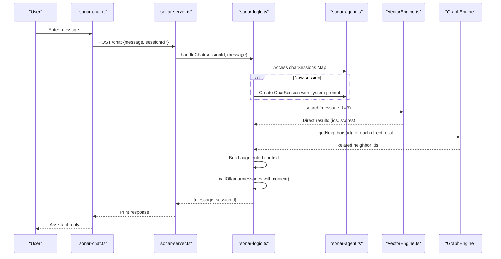
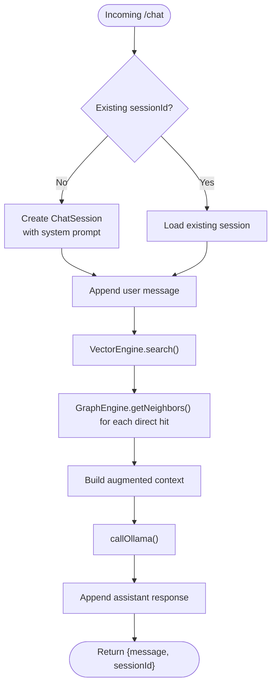
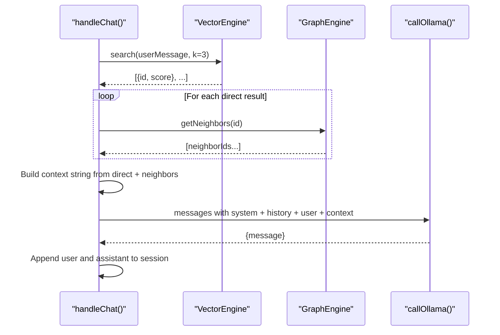
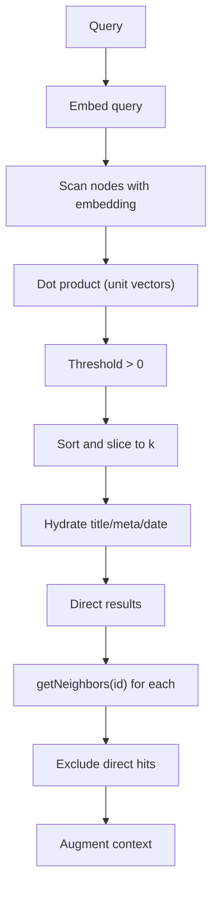
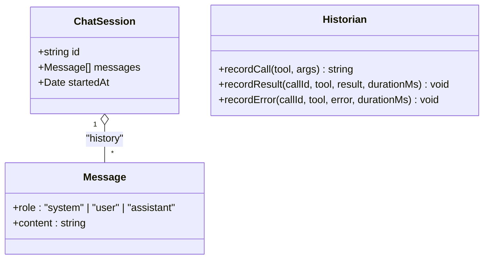
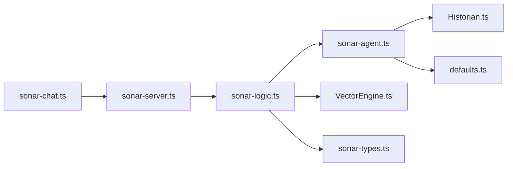

# Chat Session Management

<cite>
**Referenced Files in This Document**
- [sonar-chat.ts](file://src/cli/sonar-chat.ts)
- [sonar-agent.ts](file://src/daemon/sonar-agent.ts)
- [sonar-server.ts](file://src/daemon/sonar-server.ts)
- [sonar-logic.ts](file://src/daemon/sonar-logic.ts)
- [sonar-types.ts](file://src/daemon/sonar-types.ts)
- [VectorEngine.ts](file://src/core/VectorEngine.ts)
- [Historian.ts](file://src/utils/Historian.ts)
- [defaults.ts](file://src/config/defaults.ts)
- [ask_context.ts](file://scripts/verify/ask_context.ts)
</cite>

## Table of Contents
1. [Introduction](#introduction)
2. [Project Structure](#project-structure)
3. [Core Components](#core-components)
4. [Architecture Overview](#architecture-overview)
5. [Detailed Component Analysis](#detailed-component-analysis)
6. [Dependency Analysis](#dependency-analysis)
7. [Performance Considerations](#performance-considerations)
8. [Troubleshooting Guide](#troubleshooting-guide)
9. [Conclusion](#conclusion)

## Introduction
This document explains the Sonar Agent’s chat session management system. It covers how chat sessions are created, maintained, and destroyed; how messages are handled and augmented with context from vector search and graph discovery; and how session state is preserved. It also documents the integration with vector search for direct results and neighbor discovery, the system prompt configuration, message history management, and the broader relationship to the Sonar ecosystem.

## Project Structure
The chat system spans several modules:
- CLI chat loop for interactive terminal sessions
- HTTP server exposing the /chat endpoint
- Agent daemon orchestrating session storage and orchestration
- VectorEngine for FAISS-like similarity search
- GraphEngine for neighbor discovery
- Historian for persistent session logs
- Configuration utilities for directory and runtime settings

```mermaid
graph TB
subgraph "CLI"
CLI["sonar-chat.ts<br/>Interactive loop"]
end
subgraph "HTTP Server"
Server["sonar-server.ts<br/>/health, /chat, /search/*"]
end
subgraph "Agent Daemon"
Agent["sonar-agent.ts<br/>Global chatSessions Map"]
Logic["sonar-logic.ts<br/>handleChat()"]
Types["sonar-types.ts<br/>ChatSession, Message"]
end
subgraph "Core Engines"
Vec["VectorEngine.ts<br/>search(), searchByVector()"]
Graph["GraphEngine<br/>(referenced)"]
end
subgraph "Persistence"
Hist["Historian.ts<br/>.amalfa/sessions/*.jsonl"]
Cfg["defaults.ts<br/>.amalfa directories"]
end
CLI --> Server
Server --> Logic
Logic --> Agent
Logic --> Vec
Logic --> Graph
Agent --> Hist
Agent --> Cfg
```

**Diagram sources**
- [sonar-chat.ts](file://src/cli/sonar-chat.ts#L1-L116)
- [sonar-server.ts](file://src/daemon/sonar-server.ts#L1-L134)
- [sonar-agent.ts](file://src/daemon/sonar-agent.ts#L1-L221)
- [sonar-logic.ts](file://src/daemon/sonar-logic.ts#L1-L685)
- [sonar-types.ts](file://src/daemon/sonar-types.ts#L1-L69)
- [VectorEngine.ts](file://src/core/VectorEngine.ts#L1-L242)
- [Historian.ts](file://src/utils/Historian.ts#L1-L136)
- [defaults.ts](file://src/config/defaults.ts#L1-L143)

**Section sources**
- [sonar-chat.ts](file://src/cli/sonar-chat.ts#L1-L116)
- [sonar-server.ts](file://src/daemon/sonar-server.ts#L1-L134)
- [sonar-agent.ts](file://src/daemon/sonar-agent.ts#L1-L221)
- [sonar-logic.ts](file://src/daemon/sonar-logic.ts#L1-L685)
- [sonar-types.ts](file://src/daemon/sonar-types.ts#L1-L69)
- [VectorEngine.ts](file://src/core/VectorEngine.ts#L1-L242)
- [Historian.ts](file://src/utils/Historian.ts#L1-L136)
- [defaults.ts](file://src/config/defaults.ts#L1-L143)

## Core Components
- Chat CLI loop: Starts/stops the Sonar Agent, sends user messages to /chat, prints responses, and maintains a session identifier.
- HTTP server: Exposes /health and /chat endpoints; routes requests to handler logic.
- Agent daemon: Initializes engines, exposes a global Map for chat sessions, and starts the HTTP server.
- Chat logic: Manages session creation, augments user messages with vector search and graph neighbor results, and invokes the inference backend.
- VectorEngine: Provides FAFCAS-compliant vector normalization and similarity search.
- Historian: Writes session events to .amalfa/sessions/session_{uuid}.jsonl for recall and debugging.

**Section sources**
- [sonar-chat.ts](file://src/cli/sonar-chat.ts#L1-L116)
- [sonar-server.ts](file://src/daemon/sonar-server.ts#L1-L134)
- [sonar-agent.ts](file://src/daemon/sonar-agent.ts#L1-L221)
- [sonar-logic.ts](file://src/daemon/sonar-logic.ts#L104-L179)
- [VectorEngine.ts](file://src/core/VectorEngine.ts#L76-L242)
- [Historian.ts](file://src/utils/Historian.ts#L31-L136)

## Architecture Overview
The chat flow integrates CLI input, HTTP routing, session management, vector search, graph discovery, and inference.



**Diagram sources**
- [sonar-chat.ts](file://src/cli/sonar-chat.ts#L50-L114)
- [sonar-server.ts](file://src/daemon/sonar-server.ts#L58-L67)
- [sonar-logic.ts](file://src/daemon/sonar-logic.ts#L104-L179)
- [sonar-agent.ts](file://src/daemon/sonar-agent.ts#L47-L47)
- [VectorEngine.ts](file://src/core/VectorEngine.ts#L227-L240)
- [sonar-types.ts](file://src/daemon/sonar-types.ts#L10-L14)

## Detailed Component Analysis

### Chat Session Lifecycle
- Creation: On first use, a new ChatSession is created with a system message and current date, stored in a global Map keyed by sessionId.
- Maintenance: Each turn appends the user message and assistant response to the session history.
- Destruction: Sessions persist in memory for the lifetime of the agent process; there is no explicit inactivity-based eviction in the analyzed code.



**Diagram sources**
- [sonar-logic.ts](file://src/daemon/sonar-logic.ts#L114-L178)
- [VectorEngine.ts](file://src/core/VectorEngine.ts#L227-L240)
- [sonar-types.ts](file://src/daemon/sonar-types.ts#L10-L14)

**Section sources**
- [sonar-logic.ts](file://src/daemon/sonar-logic.ts#L104-L179)
- [sonar-types.ts](file://src/daemon/sonar-types.ts#L10-L14)
- [sonar-agent.ts](file://src/daemon/sonar-agent.ts#L47-L47)

### Message Handling and Context Augmentation
- System prompt: A dynamic system message is injected at session creation, including the current date.
- Context injection: Direct vector search results are included, followed by discovered graph neighbors. Content is truncated to preserve context length.
- Inference: The augmented message history plus the user prompt is sent to the inference backend.



**Diagram sources**
- [sonar-logic.ts](file://src/daemon/sonar-logic.ts#L130-L178)
- [VectorEngine.ts](file://src/core/VectorEngine.ts#L227-L240)

**Section sources**
- [sonar-logic.ts](file://src/daemon/sonar-logic.ts#L114-L178)

### Vector Search Integration
- Direct search: VectorEngine.search() embeds the query and performs dot-product scoring against stored unit vectors, returning top-k results with metadata placeholders.
- Neighbor discovery: For each direct hit, GraphEngine.getNeighbors() yields additional related nodes not already in the direct set.
- FAFCAS protocol: Vectors are normalized to unit length and stored as raw bytes for efficient similarity computation.



**Diagram sources**
- [VectorEngine.ts](file://src/core/VectorEngine.ts#L115-L240)
- [ask_context.ts](file://scripts/verify/ask_context.ts#L1-L43)

**Section sources**
- [VectorEngine.ts](file://src/core/VectorEngine.ts#L76-L242)
- [ask_context.ts](file://scripts/verify/ask_context.ts#L1-L43)

### Session State Persistence and Recall
- In-memory sessions: Maintained in a Map within the agent process.
- Disk logs: Historian writes structured events to .amalfa/sessions/session_{uuid}.jsonl for recall and debugging.
- Directory structure: AMALFA_DIRS defines .amalfa and nested folders for logs, runtime, cache, and agent tasks.



**Diagram sources**
- [sonar-types.ts](file://src/daemon/sonar-types.ts#L5-L14)
- [Historian.ts](file://src/utils/Historian.ts#L20-L126)

**Section sources**
- [Historian.ts](file://src/utils/Historian.ts#L31-L136)
- [defaults.ts](file://src/config/defaults.ts#L16-L59)

### System Prompt Configuration
- Dynamic system message: The session initializes with a system role message containing the current date, ensuring grounded temporal awareness.
- Model override: The /chat endpoint supports an optional model field to route to a specific inference model.

**Section sources**
- [sonar-logic.ts](file://src/daemon/sonar-logic.ts#L116-L124)
- [sonar-server.ts](file://src/daemon/sonar-server.ts#L58-L67)

### Relationship to the Broader Sonar Ecosystem
- Agent daemon: Orchestrates engines, exposes HTTP endpoints, and manages task processing alongside chat.
- VectorEngine: Powers semantic search and is used by other subsystems (e.g., context extraction verification).
- GraphEngine: Enables neighbor discovery to broaden context beyond direct matches.
- CLI chat: Provides a developer-friendly terminal interface to the agent’s /chat endpoint.

**Section sources**
- [sonar-agent.ts](file://src/daemon/sonar-agent.ts#L1-L221)
- [sonar-server.ts](file://src/daemon/sonar-server.ts#L1-L134)
- [sonar-logic.ts](file://src/daemon/sonar-logic.ts#L1-L685)

## Dependency Analysis


**Diagram sources**
- [sonar-chat.ts](file://src/cli/sonar-chat.ts#L1-L116)
- [sonar-server.ts](file://src/daemon/sonar-server.ts#L1-L134)
- [sonar-logic.ts](file://src/daemon/sonar-logic.ts#L1-L685)
- [sonar-agent.ts](file://src/daemon/sonar-agent.ts#L1-L221)
- [VectorEngine.ts](file://src/core/VectorEngine.ts#L1-L242)
- [sonar-types.ts](file://src/daemon/sonar-types.ts#L1-L69)
- [Historian.ts](file://src/utils/Historian.ts#L1-L136)
- [defaults.ts](file://src/config/defaults.ts#L1-L143)

**Section sources**
- [sonar-chat.ts](file://src/cli/sonar-chat.ts#L1-L116)
- [sonar-server.ts](file://src/daemon/sonar-server.ts#L1-L134)
- [sonar-logic.ts](file://src/daemon/sonar-logic.ts#L1-L685)
- [sonar-agent.ts](file://src/daemon/sonar-agent.ts#L1-L221)
- [VectorEngine.ts](file://src/core/VectorEngine.ts#L1-L242)
- [sonar-types.ts](file://src/daemon/sonar-types.ts#L1-L69)
- [Historian.ts](file://src/utils/Historian.ts#L1-L136)
- [defaults.ts](file://src/config/defaults.ts#L1-L143)

## Performance Considerations
- Vector search hot loop: The FAFCAS protocol computes dot products over loaded embeddings; keep top-k reasonable to limit scoring iterations.
- Memory footprint: Loading embeddings and metadata can be large; consider limiting neighbor expansion and truncating content.
- Concurrency: The agent uses a single in-memory Map for sessions; long-running processes should monitor memory usage.
- I/O: Persisting session logs to .jsonl is lightweight but still disk-bound; ensure adequate disk throughput.

[No sources needed since this section provides general guidance]

## Troubleshooting Guide
- Agent not running: The CLI checks the agent’s health and attempts to start it if needed; verify logs at .amalfa/logs/sonar.log.
- API errors: The CLI catches non-OK responses and prints error messages; check server logs for underlying causes.
- Inference unavailable: If the agent cannot reach the inference backend, chat requests fail early; confirm model availability and configuration.
- Empty or low-quality context: If vector search returns no matches, the system falls back to minimal augmentation; verify embeddings and indexing.

**Section sources**
- [sonar-chat.ts](file://src/cli/sonar-chat.ts#L5-L22)
- [sonar-chat.ts](file://src/cli/sonar-chat.ts#L82-L108)
- [sonar-logic.ts](file://src/daemon/sonar-logic.ts#L110-L112)

## Conclusion
The Sonar Agent’s chat session management centers on a simple, effective pattern: create a session with a contextual system prompt, augment user queries with direct vector search results and graph-derived neighbors, and maintain a concise message history. VectorEngine and GraphEngine integrate seamlessly to provide precise and broad context, while the agent’s HTTP surface and CLI offer straightforward developer ergonomics. For production deployments, monitor performance, ensure robust logging, and consider extending session persistence to disk if long-lived conversations are required.