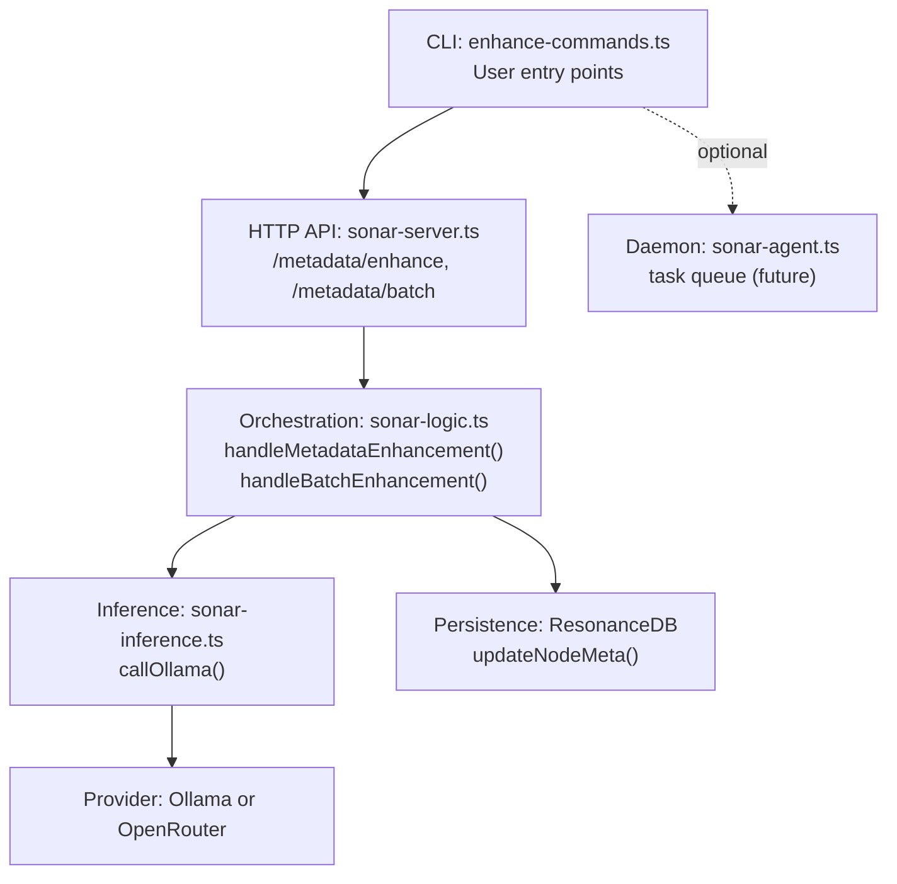
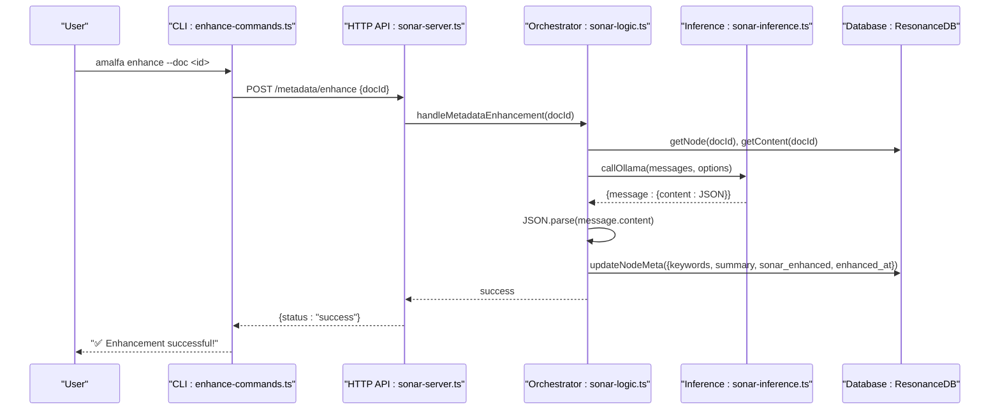
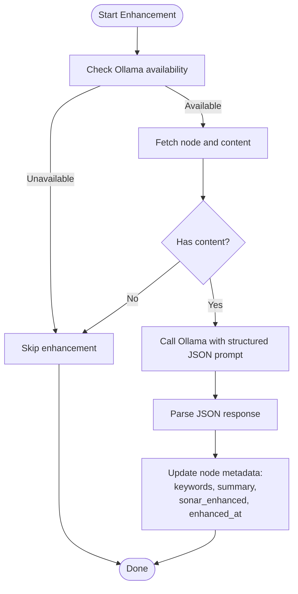
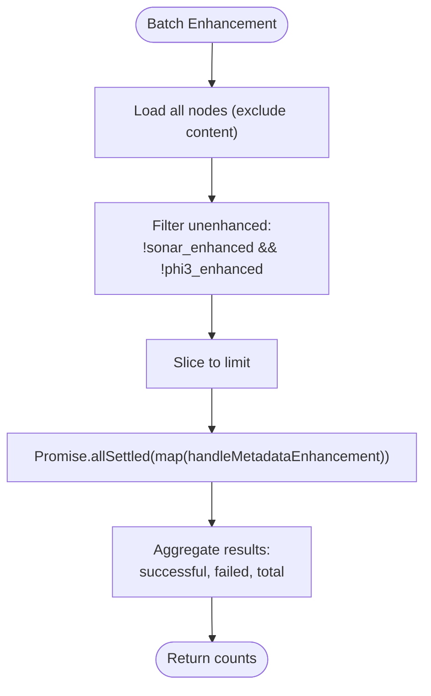
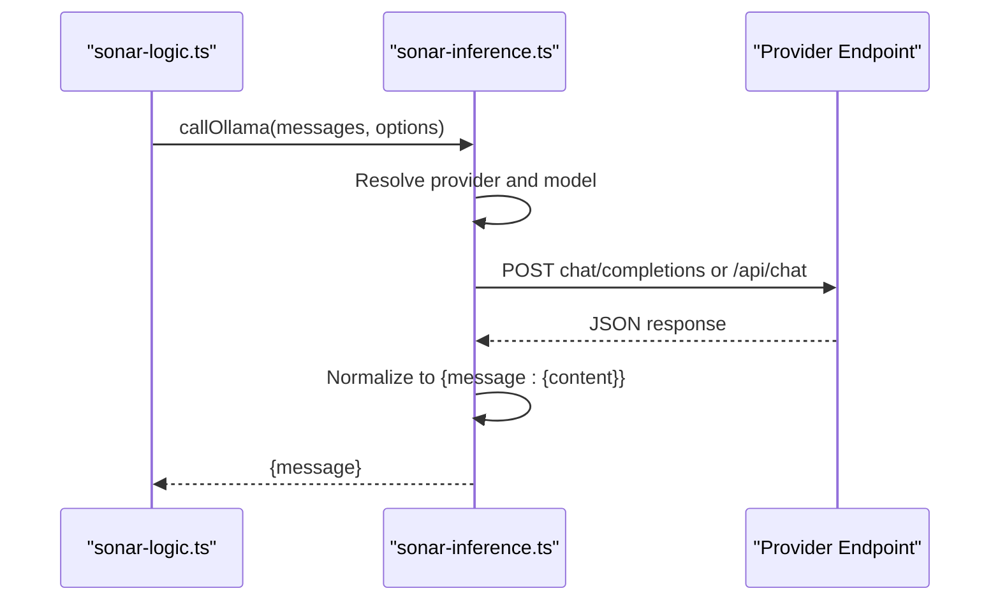
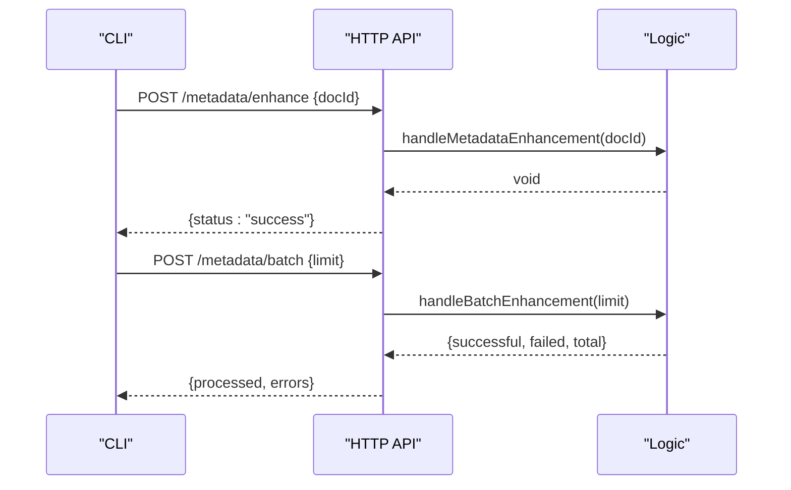
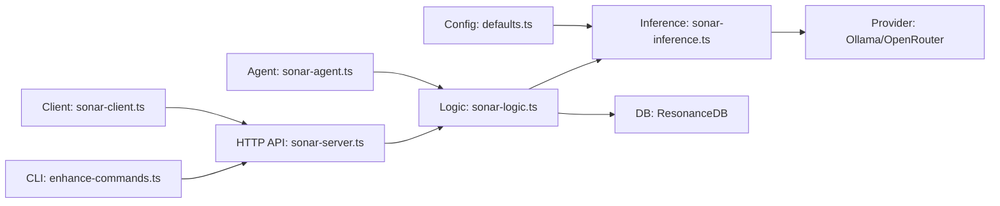

# Metadata Enhancement

<cite>
**Referenced Files in This Document**
- [enhance-commands.ts](file://src/cli/enhance-commands.ts)
- [sonar-server.ts](file://src/daemon/sonar-server.ts)
- [sonar-logic.ts](file://src/daemon/sonar-logic.ts)
- [sonar-inference.ts](file://src/daemon/sonar-inference.ts)
- [sonar-types.ts](file://src/daemon/sonar-types.ts)
- [sonar-agent.ts](file://src/daemon/sonar-agent.ts)
- [sonar-client.ts](file://src/utils/sonar-client.ts)
- [defaults.ts](file://src/config/defaults.ts)
- [sonar-system-overview.md](file://playbooks/sonar-system-overview.md)
- [SONAR-ASSESSMENT-2026-01-13.md](file://docs/reports/SONAR-ASSESSMENT-2026-01-13.md)
</cite>

## Table of Contents
1. [Introduction](#introduction)
2. [Project Structure](#project-structure)
3. [Core Components](#core-components)
4. [Architecture Overview](#architecture-overview)
5. [Detailed Component Analysis](#detailed-component-analysis)
6. [Dependency Analysis](#dependency-analysis)
7. [Performance Considerations](#performance-considerations)
8. [Troubleshooting Guide](#troubleshooting-guide)
9. [Conclusion](#conclusion)

## Introduction
This document explains the Sonar Agent’s metadata enhancement capabilities. It covers automatic metadata extraction (keywords and summary), content analysis, the batch enhancement system, filtering logic for unenhanced documents, parallel processing patterns, integration with Ollama inference, JSON parsing, and database updates. It also outlines enhancement criteria, quality thresholds, error handling mechanisms, examples of enhanced metadata, performance metrics, and troubleshooting guidance.

## Project Structure
The metadata enhancement feature spans CLI commands, a lightweight HTTP API, orchestration logic, inference integration, and persistence. The following diagram maps the primary components involved in metadata enhancement.

**Diagram sources**
- [enhance-commands.ts](file://src/cli/enhance-commands.ts#L6-L82)
- [sonar-server.ts](file://src/daemon/sonar-server.ts#L72-L81)
- [sonar-logic.ts](file://src/daemon/sonar-logic.ts#L29-L65)
- [sonar-inference.ts](file://src/daemon/sonar-inference.ts#L19-L119)
- [sonar-agent.ts](file://src/daemon/sonar-agent.ts#L26-L32)

**Section sources**
- [enhance-commands.ts](file://src/cli/enhance-commands.ts#L6-L82)
- [sonar-server.ts](file://src/daemon/sonar-server.ts#L72-L81)
- [sonar-logic.ts](file://src/daemon/sonar-logic.ts#L29-L65)
- [sonar-inference.ts](file://src/daemon/sonar-inference.ts#L19-L119)
- [sonar-agent.ts](file://src/daemon/sonar-agent.ts#L26-L32)

## Core Components
- CLI command for metadata enhancement:
  - Single document enhancement via HTTP POST to `/metadata/enhance`
  - Batch enhancement via HTTP POST to `/metadata/batch`
- HTTP API:
  - Exposes `/metadata/enhance` and `/metadata/batch` endpoints
  - Delegates to orchestration logic
- Orchestration logic:
  - Retrieves node content, calls inference, parses JSON, and updates node metadata
  - Implements batch filtering and parallel processing
- Inference integration:
  - Unified callOllama() supports local Ollama and OpenRouter
  - Configurable model selection and provider routing
- Persistence:
  - Updates node metadata with keywords, summary, and enhancement markers

**Section sources**
- [enhance-commands.ts](file://src/cli/enhance-commands.ts#L35-L81)
- [sonar-server.ts](file://src/daemon/sonar-server.ts#L72-L81)
- [sonar-logic.ts](file://src/daemon/sonar-logic.ts#L29-L99)
- [sonar-inference.ts](file://src/daemon/sonar-inference.ts#L19-L119)

## Architecture Overview
The metadata enhancement flow integrates CLI, HTTP API, orchestration, inference, and persistence.

**Diagram sources**
- [enhance-commands.ts](file://src/cli/enhance-commands.ts#L56-L76)
- [sonar-server.ts](file://src/daemon/sonar-server.ts#L72-L81)
- [sonar-logic.ts](file://src/daemon/sonar-logic.ts#L29-L65)
- [sonar-inference.ts](file://src/daemon/sonar-inference.ts#L87-L119)

## Detailed Component Analysis

### Automatic Metadata Extraction: Keywords and Summary
- Extraction prompt instructs the model to return 3–5 keywords and a concise 1-sentence summary in JSON format.
- The system parses the returned JSON and merges it into the node’s metadata alongside enhancement flags and timestamps.
- The process is guarded by availability checks and gracefully handles missing content or failed inference.

**Diagram sources**
- [sonar-logic.ts](file://src/daemon/sonar-logic.ts#L29-L65)
- [sonar-inference.ts](file://src/daemon/sonar-inference.ts#L19-L119)

**Section sources**
- [sonar-logic.ts](file://src/daemon/sonar-logic.ts#L29-L65)

### Batch Enhancement System
- Filters all nodes to select those not yet enhanced by Sonar or other enhancers.
- Applies an upper limit to the batch size.
- Executes enhancements in parallel using Promise.allSettled to maximize throughput while capturing partial failures.
- Returns counts of successful, failed, and total processed items.

**Diagram sources**
- [sonar-logic.ts](file://src/daemon/sonar-logic.ts#L68-L99)

**Section sources**
- [sonar-logic.ts](file://src/daemon/sonar-logic.ts#L68-L99)

### Filtering Logic for Unenhanced Documents
- Excludes nodes already marked as enhanced by Sonar or other enhancers.
- Safely handles malformed metadata by treating such nodes as unenhanced.

**Section sources**
- [sonar-logic.ts](file://src/daemon/sonar-logic.ts#L75-L84)

### Parallel Processing Patterns
- Uses Promise.allSettled to process multiple documents concurrently.
- Continues even if some enhancements fail, enabling resilient batch processing.

**Section sources**
- [sonar-logic.ts](file://src/daemon/sonar-logic.ts#L89-L93)

### Integration with Ollama Inference
- callOllama supports:
  - Local Ollama endpoint with configurable model and options
  - OpenRouter cloud provider with API key and referer headers
- Selects provider and model based on configuration and overrides.
- Parses provider-specific response formats and extracts the assistant message.

**Diagram sources**
- [sonar-inference.ts](file://src/daemon/sonar-inference.ts#L19-L119)

**Section sources**
- [sonar-inference.ts](file://src/daemon/sonar-inference.ts#L19-L119)

### JSON Parsing and Validation
- The orchestration logic expects a strict JSON schema for keywords and summary.
- A robust JSON parser is used elsewhere in the system to recover from markdown blocks and handle parsing errors gracefully.

**Section sources**
- [sonar-logic.ts](file://src/daemon/sonar-logic.ts#L54-L54)
- [sonar-logic.ts](file://src/daemon/sonar-logic.ts#L669-L684)

### Database Updates
- On successful extraction, the system updates the node’s metadata with:
  - keywords: array of extracted terms
  - summary: concise sentence summary
  - sonar_enhanced: boolean flag indicating completion
  - enhanced_at: timestamp of last enhancement

**Section sources**
- [sonar-logic.ts](file://src/daemon/sonar-logic.ts#L55-L61)

### CLI and HTTP API Integration
- CLI:
  - Validates Sonar Agent status and routes commands to the local HTTP API
  - Supports single document and batch modes
- HTTP API:
  - Exposes endpoints for single enhancement and batch processing
  - Delegates to orchestration logic and returns structured responses

**Diagram sources**
- [enhance-commands.ts](file://src/cli/enhance-commands.ts#L35-L81)
- [sonar-server.ts](file://src/daemon/sonar-server.ts#L72-L81)
- [sonar-logic.ts](file://src/daemon/sonar-logic.ts#L68-L99)

**Section sources**
- [enhance-commands.ts](file://src/cli/enhance-commands.ts#L6-L82)
- [sonar-server.ts](file://src/daemon/sonar-server.ts#L72-L81)
- [sonar-logic.ts](file://src/daemon/sonar-logic.ts#L68-L99)

### Daemon Task Queue (Future)
- The Sonar Agent maintains a task queue for asynchronous processing.
- The “enhance_batch” task type is supported and executed by the agent’s task loop.

**Section sources**
- [sonar-agent.ts](file://src/daemon/sonar-agent.ts#L138-L217)
- [sonar-types.ts](file://src/daemon/sonar-types.ts#L16-L32)

## Dependency Analysis
The following diagram highlights key dependencies among components involved in metadata enhancement.

**Diagram sources**
- [enhance-commands.ts](file://src/cli/enhance-commands.ts#L6-L82)
- [sonar-server.ts](file://src/daemon/sonar-server.ts#L72-L81)
- [sonar-logic.ts](file://src/daemon/sonar-logic.ts#L29-L65)
- [sonar-inference.ts](file://src/daemon/sonar-inference.ts#L19-L119)
- [sonar-agent.ts](file://src/daemon/sonar-agent.ts#L26-L32)
- [sonar-client.ts](file://src/utils/sonar-client.ts#L54-L143)
- [defaults.ts](file://src/config/defaults.ts#L84-L143)

**Section sources**
- [sonar-logic.ts](file://src/daemon/sonar-logic.ts#L1-L25)
- [sonar-inference.ts](file://src/daemon/sonar-inference.ts#L1-L13)
- [defaults.ts](file://src/config/defaults.ts#L84-L143)

## Performance Considerations
- Latency characteristics for Sonar operations are documented in the Sonar system overview playbook, including query analysis, re-ranking, and context extraction.
- Batch processing leverages concurrency to improve throughput; however, provider rate limits and model availability influence effective throughput.
- For enhanced search scenarios, the total latency with Sonar is acceptable compared to basic vector search alone.

**Section sources**
- [sonar-system-overview.md](file://playbooks/sonar-system-overview.md#L141-L151)

## Troubleshooting Guide
Common issues and remedies for metadata enhancement failures:

- Sonar Agent not running
  - Symptom: CLI reports the agent is not running.
  - Action: Start the agent before invoking enhancement commands.
  - Evidence: CLI checks agent status and exits with guidance.

- Ollama unavailable or model not present
  - Symptom: Inference calls fail or return errors.
  - Action: Verify Ollama is reachable and the configured model is pulled; alternatively enable cloud provider with a valid API key.
  - Evidence: Inference layer logs provider and model details and surfaces errors.

- Empty or missing node content
  - Symptom: Enhancement skipped for a node.
  - Action: Ensure content hydration is complete; the system skips nodes without content.
  - Evidence: Orchestrator checks for content presence before enhancement.

- JSON parsing failures
  - Symptom: Model response not in expected JSON format.
  - Action: Ensure the model adheres to the JSON schema; the system includes a robust parser to recover from markdown blocks.
  - Evidence: JSON parsing helper attempts to extract JSON from fenced blocks.

- Database update failures
  - Symptom: Metadata not updated after successful inference.
  - Action: Confirm database connectivity and permissions; verify node ID validity.
  - Evidence: Orchestrator updates metadata upon successful parsing.

- Assessment report highlights
  - The Sonar service assessment report documents critical gaps in embedding recall and content hydration that impact effectiveness.

**Section sources**
- [enhance-commands.ts](file://src/cli/enhance-commands.ts#L10-L14)
- [sonar-inference.ts](file://src/daemon/sonar-inference.ts#L114-L118)
- [sonar-logic.ts](file://src/daemon/sonar-logic.ts#L35-L41)
- [sonar-logic.ts](file://src/daemon/sonar-logic.ts#L669-L684)
- [SONAR-ASSESSMENT-2026-01-13.md](file://docs/reports/SONAR-ASSESSMENT-2026-01-13.md#L16-L35)

## Conclusion
The Sonar Agent’s metadata enhancement system provides a streamlined pipeline for extracting keywords and summaries from knowledge graph nodes. It integrates a CLI, HTTP API, orchestration logic, inference integration, and persistence. The system emphasizes resilience through parallel processing, robust JSON parsing, and graceful handling of provider and content availability issues. While the core capability is functional, operational effectiveness depends on content hydration and provider configuration.