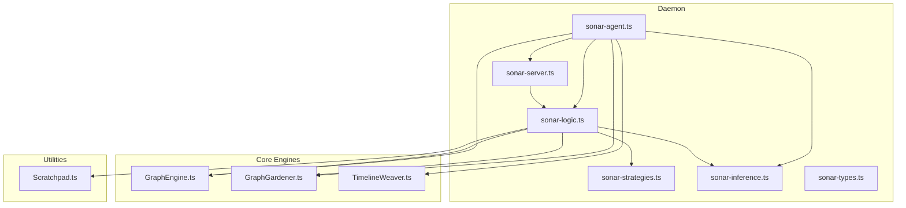
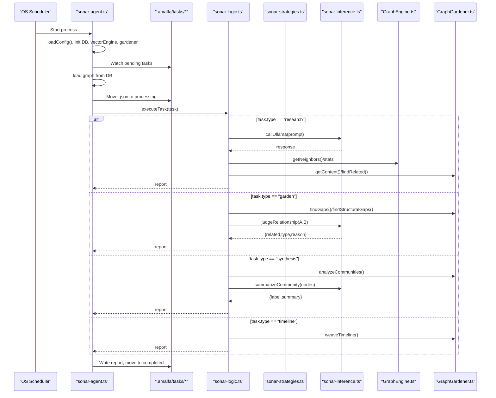
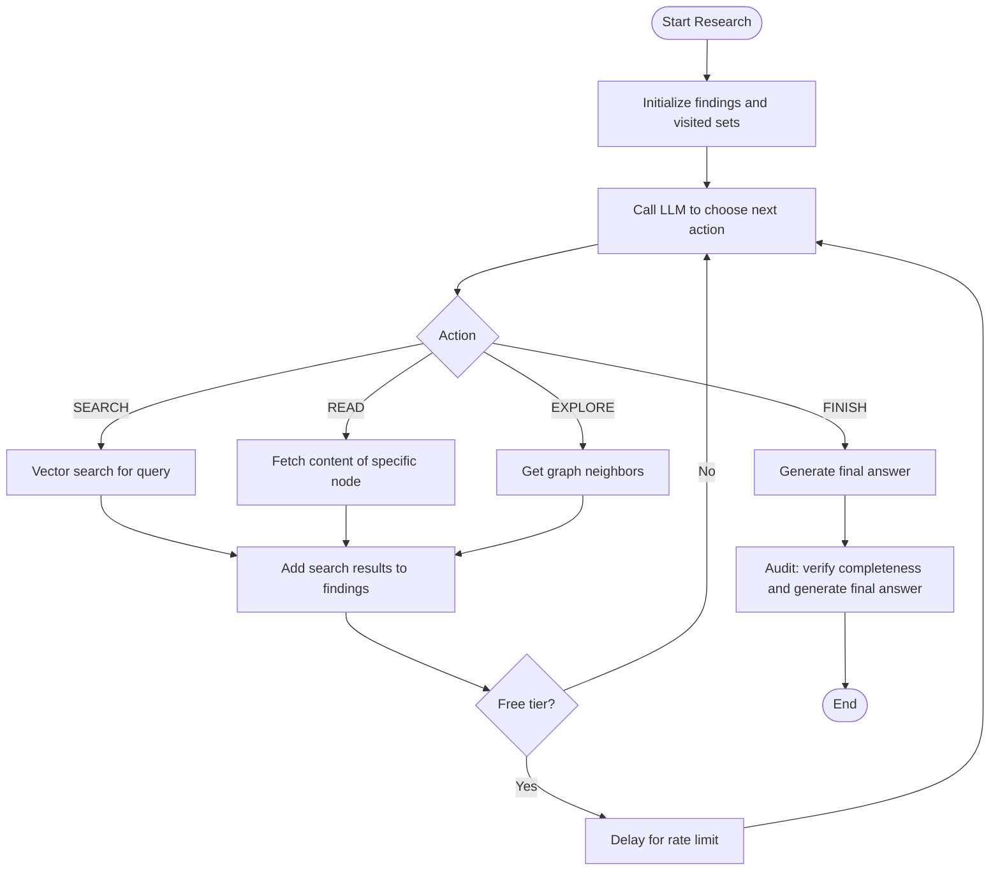
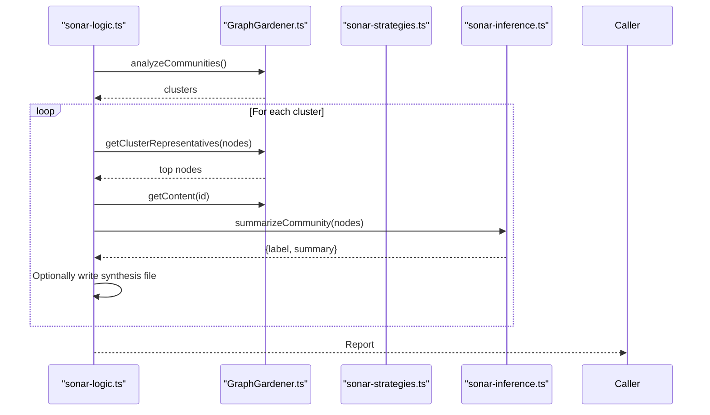
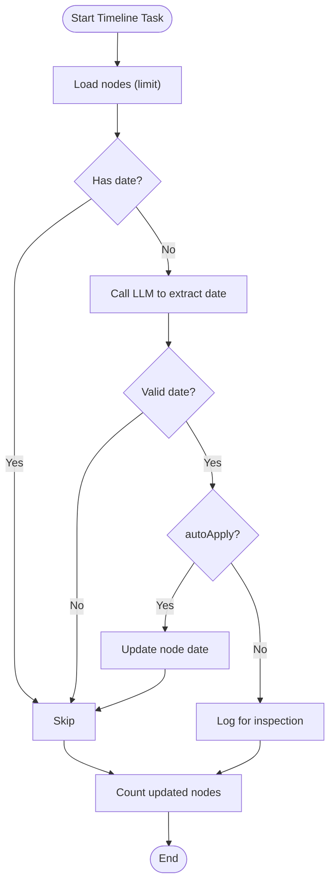
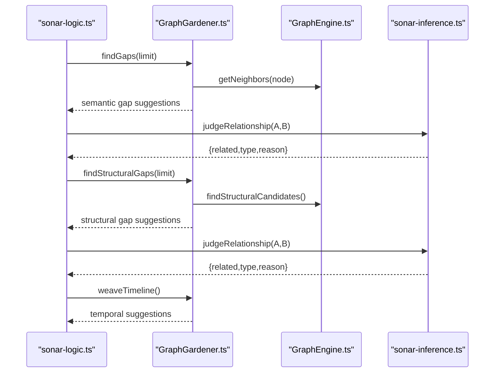
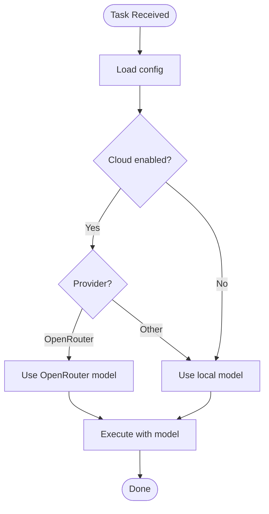
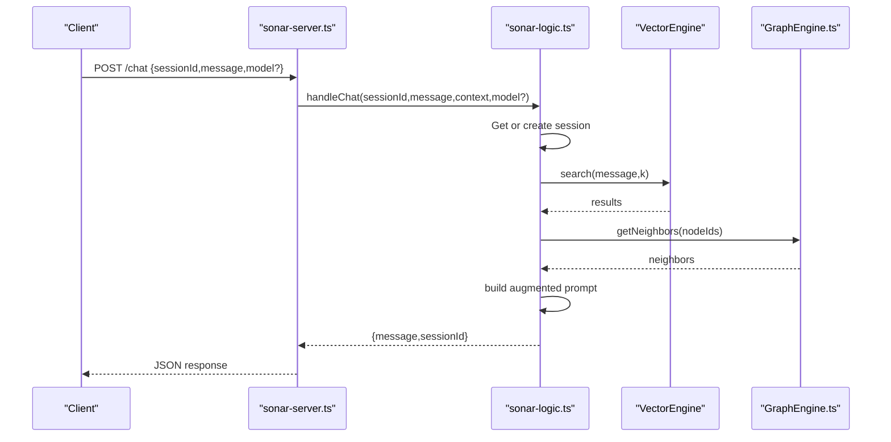
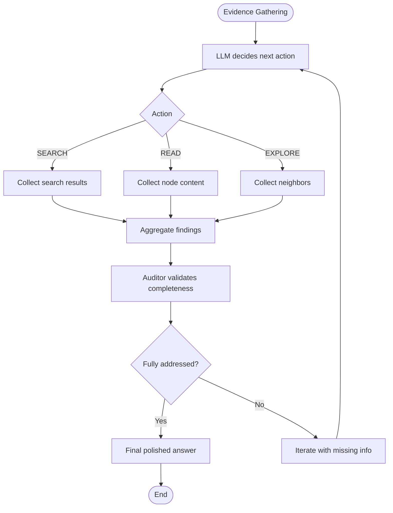
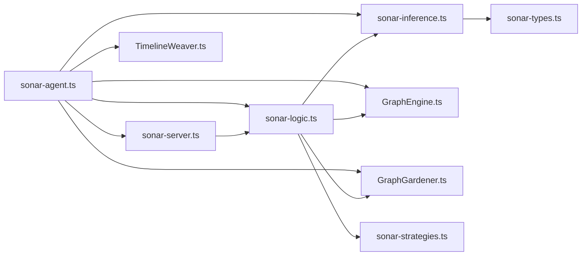

# Research Logic and Strategies

<cite>
**Referenced Files in This Document**
- [sonar-agent.ts](file://src/daemon/sonar-agent.ts)
- [sonar-logic.ts](file://src/daemon/sonar-logic.ts)
- [sonar-strategies.ts](file://src/daemon/sonar-strategies.ts)
- [sonar-server.ts](file://src/daemon/sonar-server.ts)
- [sonar-inference.ts](file://src/daemon/sonar-inference.ts)
- [sonar-types.ts](file://src/daemon/sonar-types.ts)
- [GraphEngine.ts](file://src/core/GraphEngine.ts)
- [GraphGardener.ts](file://src/core/GraphGardener.ts)
- [TimelineWeaver.ts](file://src/core/TimelineWeaver.ts)
- [Scratchpad.ts](file://src/utils/Scratchpad.ts)
</cite>

## Table of Contents
1. [Introduction](#introduction)
2. [Project Structure](#project-structure)
3. [Core Components](#core-components)
4. [Architecture Overview](#architecture-overview)
5. [Detailed Component Analysis](#detailed-component-analysis)
6. [Dependency Analysis](#dependency-analysis)
7. [Performance Considerations](#performance-considerations)
8. [Troubleshooting Guide](#troubleshooting-guide)
9. [Conclusion](#conclusion)

## Introduction
This document explains the Sonar Agent’s research logic and strategic decision-making systems. It covers research methodologies, synthesis workflows, timeline analysis, strategy selection for different task types, model routing, context preservation, chat session management, state maintenance, external tool integration, MCP protocol usage, resource allocation, performance optimization, concurrency patterns, memory management, reasoning patterns, evidence gathering, and conclusion formation.

## Project Structure
The Sonar Agent is implemented as a Bun-based daemon with an embedded HTTP API. It orchestrates graph analytics, vector search, and LLM-based reasoning to support autonomous research, synthesis, timeline anchoring, and graph gardening.

**Diagram sources**
- [sonar-agent.ts](file://src/daemon/sonar-agent.ts#L1-L221)
- [sonar-server.ts](file://src/daemon/sonar-server.ts#L1-L134)
- [sonar-logic.ts](file://src/daemon/sonar-logic.ts#L1-L685)
- [sonar-strategies.ts](file://src/daemon/sonar-strategies.ts#L1-L187)
- [sonar-inference.ts](file://src/daemon/sonar-inference.ts#L1-L120)
- [sonar-types.ts](file://src/daemon/sonar-types.ts#L1-L69)
- [GraphEngine.ts](file://src/core/GraphEngine.ts#L1-L314)
- [GraphGardener.ts](file://src/core/GraphGardener.ts#L1-L270)
- [TimelineWeaver.ts](file://src/core/TimelineWeaver.ts#L1-L62)
- [Scratchpad.ts](file://src/utils/Scratchpad.ts#L1-L427)

**Section sources**
- [sonar-agent.ts](file://src/daemon/sonar-agent.ts#L1-L221)
- [sonar-server.ts](file://src/daemon/sonar-server.ts#L1-L134)

## Core Components
- Sonar Agent entrypoint and lifecycle controller
- HTTP API for chat, search, and metadata enhancement
- Task router and executor for synthesis, timeline, garden, research, and batch enhancement
- Strategy module for relationship judgment, community synthesis, and date extraction
- Inference engine supporting local Ollama and cloud providers
- Graph engines for traversal, centrality, clustering, and timeline weaving
- Scratchpad utility for managing large tool outputs

**Section sources**
- [sonar-agent.ts](file://src/daemon/sonar-agent.ts#L1-L221)
- [sonar-logic.ts](file://src/daemon/sonar-logic.ts#L1-L685)
- [sonar-strategies.ts](file://src/daemon/sonar-strategies.ts#L1-L187)
- [sonar-inference.ts](file://src/daemon/sonar-inference.ts#L1-L120)
- [GraphEngine.ts](file://src/core/GraphEngine.ts#L1-L314)
- [GraphGardener.ts](file://src/core/GraphGardener.ts#L1-L270)
- [TimelineWeaver.ts](file://src/core/TimelineWeaver.ts#L1-L62)
- [Scratchpad.ts](file://src/utils/Scratchpad.ts#L1-L427)

## Architecture Overview
The Sonar Agent runs a continuous watcher loop that loads the graph, processes tasks from a filesystem queue, and executes them via modular logic handlers. An HTTP API exposes chat, search, and metadata enhancement endpoints. Inference requests route through a unified provider abstraction supporting local and cloud models.

**Diagram sources**
- [sonar-agent.ts](file://src/daemon/sonar-agent.ts#L106-L179)
- [sonar-logic.ts](file://src/daemon/sonar-logic.ts#L184-L218)
- [sonar-strategies.ts](file://src/daemon/sonar-strategies.ts#L34-L84)
- [sonar-inference.ts](file://src/daemon/sonar-inference.ts#L19-L119)
- [GraphEngine.ts](file://src/core/GraphEngine.ts#L50-L100)
- [GraphGardener.ts](file://src/core/GraphGardener.ts#L38-L115)

## Detailed Component Analysis

### Research Methodology and Recursive Discovery
The research task implements a structured discovery loop:
- Analyzes current findings and selects next action (SEARCH, READ, EXPLORE, FINISH)
- Executes actions using graph and vector capabilities
- Aggregates evidence and performs final audit to validate completeness

**Diagram sources**
- [sonar-logic.ts](file://src/daemon/sonar-logic.ts#L469-L664)

**Section sources**
- [sonar-logic.ts](file://src/daemon/sonar-logic.ts#L469-L664)

### Synthesis Workflows and Community Analysis
Synthesis identifies cohesive clusters and summarizes them using LLMs. The process:
- Detects communities via graphology
- Selects representative nodes by centrality
- Summarizes cluster content and optionally writes synthesis artifacts

**Diagram sources**
- [sonar-logic.ts](file://src/daemon/sonar-logic.ts#L323-L364)
- [GraphGardener.ts](file://src/core/GraphGardener.ts#L120-L143)
- [sonar-strategies.ts](file://src/daemon/sonar-strategies.ts#L90-L142)

**Section sources**
- [sonar-logic.ts](file://src/daemon/sonar-logic.ts#L323-L364)
- [GraphGardener.ts](file://src/core/GraphGardener.ts#L120-L143)
- [sonar-strategies.ts](file://src/daemon/sonar-strategies.ts#L90-L142)

### Timeline Analysis and Anchoring
Timeline anchoring extracts temporal anchors and weaves temporal edges:
- Heuristically extracts dates from content
- Weaves temporal sequences per community
- Optionally applies tags to source files

**Diagram sources**
- [sonar-logic.ts](file://src/daemon/sonar-logic.ts#L369-L391)
- [sonar-strategies.ts](file://src/daemon/sonar-strategies.ts#L148-L186)
- [GraphGardener.ts](file://src/core/GraphGardener.ts#L155-L194)

**Section sources**
- [sonar-logic.ts](file://src/daemon/sonar-logic.ts#L369-L391)
- [sonar-strategies.ts](file://src/daemon/sonar-strategies.ts#L148-L186)
- [GraphGardener.ts](file://src/core/GraphGardener.ts#L155-L194)

### Graph Gardening and Link Prediction
Gardening discovers missing links using:
- Semantic gaps: vector similarity without structural linkage
- Structural gaps: Adamic-Adar overlap indicating potential relationships
- Temporal sequencing: chronological ordering within communities

**Diagram sources**
- [sonar-logic.ts](file://src/daemon/sonar-logic.ts#L397-L465)
- [GraphGardener.ts](file://src/core/GraphGardener.ts#L38-L115)
- [GraphEngine.ts](file://src/core/GraphEngine.ts#L203-L238)
- [sonar-strategies.ts](file://src/daemon/sonar-strategies.ts#L34-L84)

**Section sources**
- [sonar-logic.ts](file://src/daemon/sonar-logic.ts#L397-L465)
- [GraphGardener.ts](file://src/core/GraphGardener.ts#L38-L115)
- [GraphEngine.ts](file://src/core/GraphEngine.ts#L203-L238)
- [sonar-strategies.ts](file://src/daemon/sonar-strategies.ts#L34-L84)

### Strategy Selection and Model Routing
- Task model selection prefers cloud provider models for specific tasks when configured
- Inference routing supports local Ollama and OpenRouter with API key handling and provider-specific headers
- Free tier throttling is applied conditionally

**Diagram sources**
- [sonar-strategies.ts](file://src/daemon/sonar-strategies.ts#L10-L28)
- [sonar-inference.ts](file://src/daemon/sonar-inference.ts#L19-L119)

**Section sources**
- [sonar-strategies.ts](file://src/daemon/sonar-strategies.ts#L10-L28)
- [sonar-inference.ts](file://src/daemon/sonar-inference.ts#L19-L119)

### Context Preservation and Chat Session Management
- Chat maintains persistent sessions keyed by sessionId
- Each session stores system + user/assistant messages
- Retrieval-augmented prompts combine direct search results and graph neighbors
- VectorEngine is used per-request to search relevant context

**Diagram sources**
- [sonar-server.ts](file://src/daemon/sonar-server.ts#L58-L67)
- [sonar-logic.ts](file://src/daemon/sonar-logic.ts#L104-L179)
- [GraphEngine.ts](file://src/core/GraphEngine.ts#L105-L108)

**Section sources**
- [sonar-logic.ts](file://src/daemon/sonar-logic.ts#L104-L179)
- [sonar-server.ts](file://src/daemon/sonar-server.ts#L58-L67)
- [sonar-types.ts](file://src/daemon/sonar-types.ts#L10-L14)

### Evidence Gathering and Conclusion Formation
Evidence gathering:
- Iteratively selects actions (SEARCH, READ, EXPLORE) guided by LLM decisions
- Aggregates findings with node IDs, scores, and contextual excerpts
- Validates completeness with a dedicated auditor prompt

Conclusion formation:
- Final answer synthesized from gathered evidence
- Optional auto-application of tags or synthesis files

**Diagram sources**
- [sonar-logic.ts](file://src/daemon/sonar-logic.ts#L496-L664)

**Section sources**
- [sonar-logic.ts](file://src/daemon/sonar-logic.ts#L496-L664)

### External Tools and MCP Protocol Integration
- HTTP API endpoints expose chat, search, and metadata enhancement
- Inference engine supports OpenRouter with required headers for attribution
- Local Ollama endpoint is configurable via host settings

Note: The MCP protocol is referenced in project documentation and setup materials; the current implementation focuses on HTTP endpoints and local/cloud inference routing.

**Section sources**
- [sonar-server.ts](file://src/daemon/sonar-server.ts#L1-L134)
- [sonar-inference.ts](file://src/daemon/sonar-inference.ts#L66-L85)

## Dependency Analysis
The Sonar Agent composes several subsystems with clear boundaries:
- Daemon orchestrator depends on graph engines, vector engine, and inference
- Logic handlers depend on strategies and graph/vector utilities
- HTTP server depends on logic handlers
- Utilities like Scratchpad decouple large outputs from context windows

**Diagram sources**
- [sonar-agent.ts](file://src/daemon/sonar-agent.ts#L1-L221)
- [sonar-server.ts](file://src/daemon/sonar-server.ts#L1-L134)
- [sonar-logic.ts](file://src/daemon/sonar-logic.ts#L1-L685)
- [sonar-strategies.ts](file://src/daemon/sonar-strategies.ts#L1-L187)
- [sonar-inference.ts](file://src/daemon/sonar-inference.ts#L1-L120)
- [sonar-types.ts](file://src/daemon/sonar-types.ts#L1-L69)
- [GraphEngine.ts](file://src/core/GraphEngine.ts#L1-L314)
- [GraphGardener.ts](file://src/core/GraphGardener.ts#L1-L270)
- [TimelineWeaver.ts](file://src/core/TimelineWeaver.ts#L1-L62)

**Section sources**
- [sonar-agent.ts](file://src/daemon/sonar-agent.ts#L1-L221)
- [sonar-logic.ts](file://src/daemon/sonar-logic.ts#L1-L685)

## Performance Considerations
- Concurrency and batching:
  - Batch enhancement uses Promise.allSettled to process multiple nodes concurrently
  - Free-tier throttling introduces minimal delays to respect provider limits
- Memory management:
  - GraphEngine loads “hollow nodes” (structural metadata only) to minimize memory footprint
  - GraphGardener avoids loading full content until needed
- I/O optimization:
  - Scratchpad caches large tool outputs to disk and references them to reduce context size
  - Filesystem task queue avoids in-memory queues for persistence and resilience
- Resource allocation:
  - Inference routing selects appropriate models per task and provider
  - Cloud fallback when local Ollama is unavailable

**Section sources**
- [sonar-logic.ts](file://src/daemon/sonar-logic.ts#L70-L99)
- [GraphEngine.ts](file://src/core/GraphEngine.ts#L50-L100)
- [Scratchpad.ts](file://src/utils/Scratchpad.ts#L147-L190)
- [sonar-agent.ts](file://src/daemon/sonar-agent.ts#L106-L115)
- [sonar-inference.ts](file://src/daemon/sonar-inference.ts#L31-L38)

## Troubleshooting Guide
Common issues and diagnostics:
- Inference failures:
  - Verify provider configuration and API keys
  - Check endpoint reachability and response format
- Task processing errors:
  - Inspect FAILED reports written to the completed task directory
  - Confirm graph reload and node availability
- Chat session problems:
  - Ensure sessions map is initialized and messages are appended correctly
  - Validate vector search and neighbor retrieval
- Model routing:
  - Confirm task model selection and provider-specific headers
  - Free-tier throttling may require additional delay

Operational checks:
- Health endpoint returns provider and model status
- Graph stats endpoint exposes node/edge counts and density
- Logging captures detailed errors and timings

**Section sources**
- [sonar-server.ts](file://src/daemon/sonar-server.ts#L40-L53)
- [sonar-server.ts](file://src/daemon/sonar-server.ts#L86-L88)
- [sonar-agent.ts](file://src/daemon/sonar-agent.ts#L167-L178)
- [sonar-logic.ts](file://src/daemon/sonar-logic.ts#L104-L179)
- [sonar-inference.ts](file://src/daemon/sonar-inference.ts#L87-L119)

## Conclusion
The Sonar Agent integrates graph analytics, vector search, and LLM-based reasoning to enable autonomous research, synthesis, timeline anchoring, and graph gardening. Its modular design, robust inference routing, and context-preserving mechanisms support scalable and reliable knowledge discovery. The documented workflows, strategies, and operational patterns provide a blueprint for extending and maintaining the system.