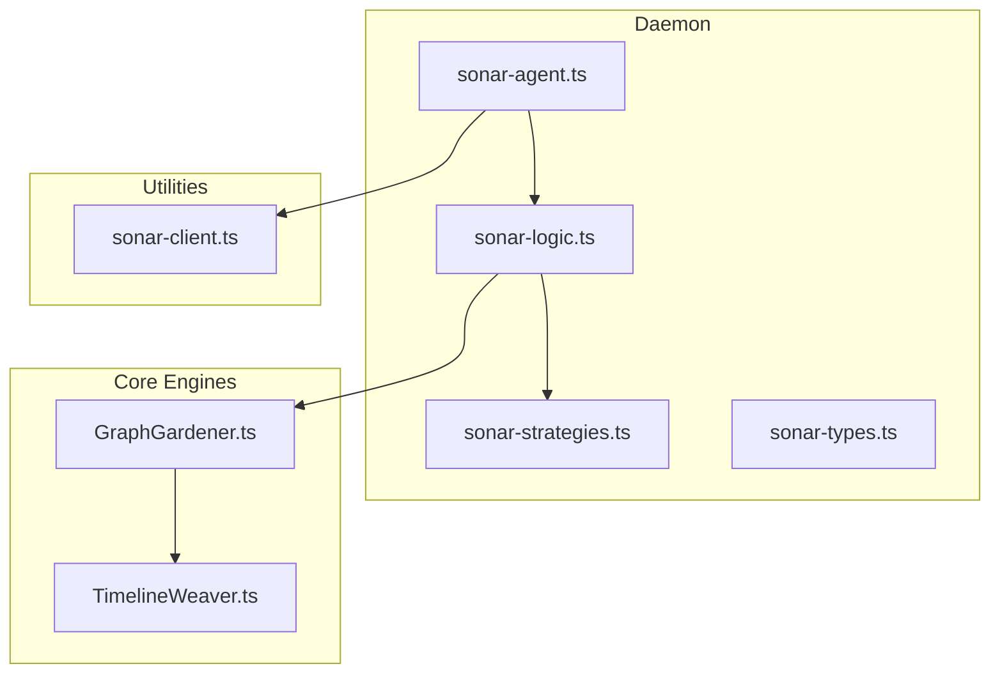
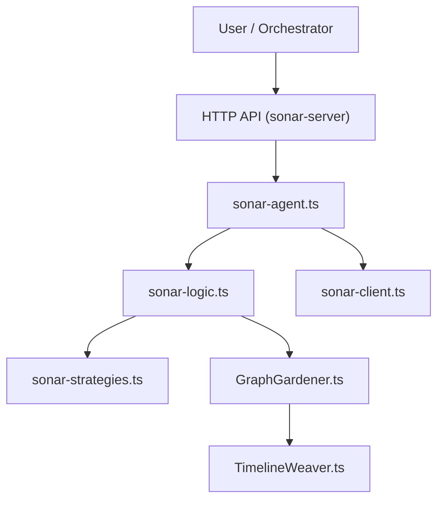
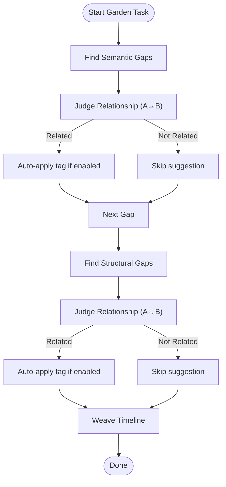
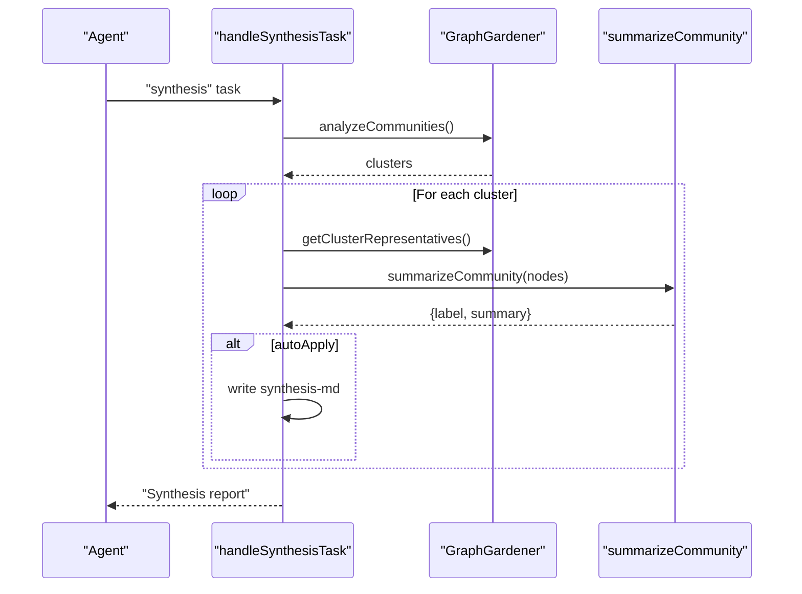
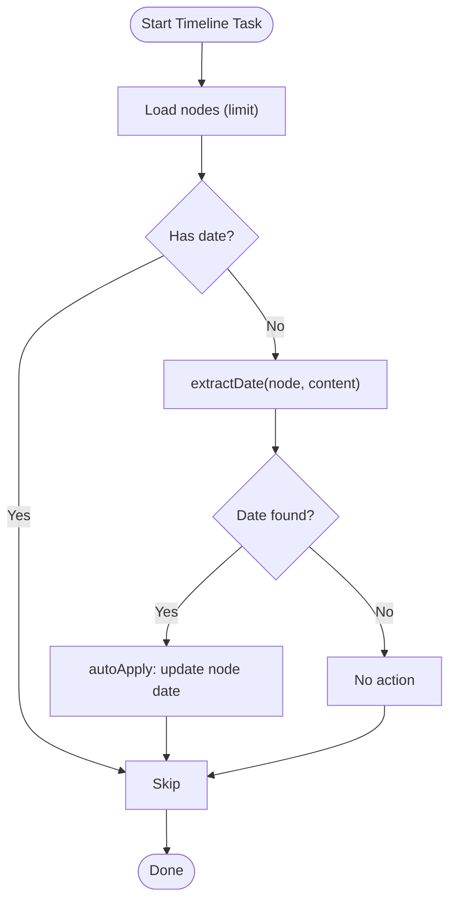
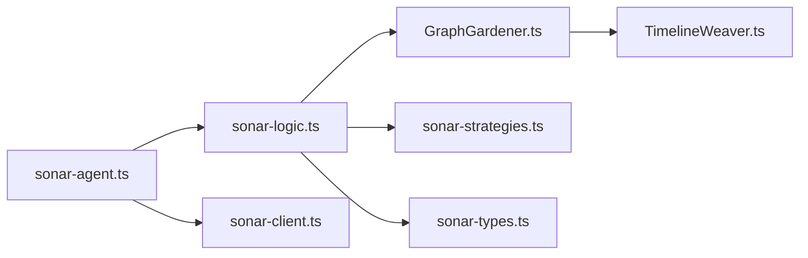

# Research Task Workflows

<cite>
**Referenced Files in This Document**
- [sonar-agent.ts](file://src/daemon/sonar-agent.ts)
- [sonar-logic.ts](file://src/daemon/sonar-logic.ts)
- [sonar-strategies.ts](file://src/daemon/sonar-strategies.ts)
- [sonar-types.ts](file://src/daemon/sonar-types.ts)
- [GraphGardener.ts](file://src/core/GraphGardener.ts)
- [TimelineWeaver.ts](file://src/core/TimelineWeaver.ts)
- [sonar-client.ts](file://src/utils/sonar-client.ts)
- [research_promotion.ts](file://scripts/query/research_promotion.ts)
- [tiered-inference-strategy.md](file://docs/architecture/tiered-inference-strategy.md)
</cite>

## Table of Contents
1. [Introduction](#introduction)
2. [Project Structure](#project-structure)
3. [Core Components](#core-components)
4. [Architecture Overview](#architecture-overview)
5. [Detailed Component Analysis](#detailed-component-analysis)
6. [Dependency Analysis](#dependency-analysis)
7. [Performance Considerations](#performance-considerations)
8. [Troubleshooting Guide](#troubleshooting-guide)
9. [Conclusion](#conclusion)

## Introduction
This document explains the Sonar Agent’s five-phase research methodology and recursive discovery workflows. It covers:
- Phase 1 & 4: Garden tasks (semantic and structural gap detection, temporal sequencing)
- Phase 2: Synthesis tasks (community summarization)
- Phase 3: Timeline tasks (temporal anchoring)
- Phase 5: Autonomous research (recursive discovery with action selection and chain verification)
- Decision-making algorithms (SEARCH, READ, EXPLORE, FINISH)
- Context analysis, hub identification, narrative investigation modes, and temporal sequence weaving
- Examples of research prompts, action reasoning patterns, and output formatting
- Throttling mechanisms for different model tiers and performance optimization strategies

## Project Structure
The Sonar Agent orchestrates research tasks through a daemon that loads the knowledge graph, exposes an HTTP API, and executes tasks from a filesystem queue. Core logic delegates to specialized strategies and utilities.



**Diagram sources**
- [sonar-agent.ts](file://src/daemon/sonar-agent.ts#L1-L221)
- [sonar-logic.ts](file://src/daemon/sonar-logic.ts#L1-L685)
- [sonar-strategies.ts](file://src/daemon/sonar-strategies.ts#L1-L187)
- [GraphGardener.ts](file://src/core/GraphGardener.ts#L1-L270)
- [TimelineWeaver.ts](file://src/core/TimelineWeaver.ts#L1-L62)
- [sonar-client.ts](file://src/utils/sonar-client.ts#L1-L309)

**Section sources**
- [sonar-agent.ts](file://src/daemon/sonar-agent.ts#L1-L221)
- [sonar-logic.ts](file://src/daemon/sonar-logic.ts#L1-L685)

## Core Components
- Sonar Agent daemon: Loads configuration, initializes engines, starts HTTP server, watches task queue, and routes tasks to handlers.
- Sonar Logic: Implements phase-specific workflows (garden, synthesis, timeline, research, chat, search helpers).
- Sonar Strategies: Provides model selection, relationship judgment, community synthesis, and date extraction.
- GraphGardener: Detects semantic and structural gaps, identifies hubs, weaves timelines, and resolves content.
- TimelineWeaver: Chronologically links nodes by date metadata.
- Sonar Client: HTTP client wrapper for the daemon endpoints with caching and timeouts.

**Section sources**
- [sonar-agent.ts](file://src/daemon/sonar-agent.ts#L1-L221)
- [sonar-logic.ts](file://src/daemon/sonar-logic.ts#L1-L685)
- [sonar-strategies.ts](file://src/daemon/sonar-strategies.ts#L1-L187)
- [GraphGardener.ts](file://src/core/GraphGardener.ts#L1-L270)
- [TimelineWeaver.ts](file://src/core/TimelineWeaver.ts#L1-L62)
- [sonar-client.ts](file://src/utils/sonar-client.ts#L1-L309)

## Architecture Overview
The Sonar Agent follows a modular, layered architecture:
- Daemon layer: lifecycle, HTTP server, task queue processing
- Logic layer: task handlers and orchestration
- Strategy layer: model selection and reasoning helpers
- Core engine layer: graph and vector operations
- Utility layer: client and discovery helpers



**Diagram sources**
- [sonar-agent.ts](file://src/daemon/sonar-agent.ts#L102-L133)
- [sonar-logic.ts](file://src/daemon/sonar-logic.ts#L184-L218)
- [sonar-strategies.ts](file://src/daemon/sonar-strategies.ts#L10-L28)
- [GraphGardener.ts](file://src/core/GraphGardener.ts#L27-L32)
- [TimelineWeaver.ts](file://src/core/TimelineWeaver.ts#L3-L61)
- [sonar-client.ts](file://src/utils/sonar-client.ts#L54-L270)

## Detailed Component Analysis

### Five-Phase Research Methodology

#### Phase 1: Garden Tasks (Discovery & Linking)
Garden tasks detect and propose missing links using dual strategies:
- Semantic gaps: vector similarity without structural adjacency
- Structural gaps: topological overlap via Adamic-Adar
- Temporal sequence weaving: chronological edges within communities

Key behaviors:
- Relationship judgment determines whether to link nodes and what type of relationship to propose
- Optional auto-apply writes tags to source files
- Free-tier throttling adds delays between actions



**Diagram sources**
- [sonar-logic.ts](file://src/daemon/sonar-logic.ts#L396-L465)
- [sonar-strategies.ts](file://src/daemon/sonar-strategies.ts#L34-L84)
- [GraphGardener.ts](file://src/core/GraphGardener.ts#L38-L115)
- [GraphGardener.ts](file://src/core/GraphGardener.ts#L155-L195)

**Section sources**
- [sonar-logic.ts](file://src/daemon/sonar-logic.ts#L396-L465)
- [sonar-strategies.ts](file://src/daemon/sonar-strategies.ts#L34-L84)
- [GraphGardener.ts](file://src/core/GraphGardener.ts#L38-L115)
- [GraphGardener.ts](file://src/core/GraphGardener.ts#L155-L195)

#### Phase 2: Synthesis Tasks (Community Summarization)
Synthesis groups related nodes into clusters and generates canonical labels and summaries.

Key behaviors:
- Detects communities and selects representative nodes
- Summarizes content via LLM with strict JSON output
- Optionally auto-applies synthesis artifacts to documentation



**Diagram sources**
- [sonar-logic.ts](file://src/daemon/sonar-logic.ts#L323-L364)
- [GraphGardener.ts](file://src/core/GraphGardener.ts#L120-L143)
- [sonar-strategies.ts](file://src/daemon/sonar-strategies.ts#L90-L142)

**Section sources**
- [sonar-logic.ts](file://src/daemon/sonar-logic.ts#L323-L364)
- [GraphGardener.ts](file://src/core/GraphGardener.ts#L120-L143)
- [sonar-strategies.ts](file://src/daemon/sonar-strategies.ts#L90-L142)

#### Phase 3: Timeline Tasks (Temporal Anchoring)
Timeline tasks extract and apply temporal anchors to nodes lacking dates, enabling chronological chaining.

Key behaviors:
- Extracts dates using regex heuristics and LLM fallback
- Optionally updates node metadata with extracted dates
- Weaves temporal sequences across communities



**Diagram sources**
- [sonar-logic.ts](file://src/daemon/sonar-logic.ts#L369-L392)
- [sonar-strategies.ts](file://src/daemon/sonar-strategies.ts#L148-L186)
- [GraphGardener.ts](file://src/core/GraphGardener.ts#L155-L195)

**Section sources**
- [sonar-logic.ts](file://src/daemon/sonar-logic.ts#L369-L392)
- [sonar-strategies.ts](file://src/daemon/sonar-strategies.ts#L148-L186)
- [GraphGardener.ts](file://src/core/GraphGardener.ts#L155-L195)

#### Phase 4: Garden Tasks (Repeat)
Phase 4 mirrors Phase 1, focusing on refining and validating links discovered in earlier phases, ensuring robustness and narrative coherence.

**Section sources**
- [sonar-logic.ts](file://src/daemon/sonar-logic.ts#L396-L465)
- [GraphGardener.ts](file://src/core/GraphGardener.ts#L38-L115)

#### Phase 5: Autonomous Research (Recursive Discovery)
Autonomous research performs iterative discovery guided by an LLM decision policy. It supports narrative investigation mode and includes a chain verification step.

Decision-making algorithm:
- At each step, the agent proposes one of:
  - SEARCH: vector search for related content
  - READ: read a specific node’s content
  - EXPLORE: traverse graph neighbors
  - FINISH: provide final answer
- The agent maintains a “findings” log and uses hubs to guide exploration
- Free-tier throttling introduces delays between steps

Chain verification:
- After gathering findings, the agent requests a final audit to confirm completeness and produce a polished answer

```mermaid
sequenceDiagram
participant User as "User"
participant Agent as "Agent"
participant Logic as "handleResearchTask"
participant Gardener as "GraphGardener"
participant LLM as "callOllama"
User->>Agent : "research" task(query)
Agent->>Logic : execute
loop Up to maxSteps
Logic->>LLM : "decide action (JSON)"
alt SEARCH
Logic->>Gardener : findRelated(query)
Gardener-->>Logic : results
else READ
Logic->>Gardener : getContent(nodeId)
Gardener-->>Logic : content
else EXPLORE
Logic->>Gardener : getNeighbors(nodeId)
Gardener-->>Logic : neighbors
else FINISH
break
end
Note right of Logic : Throttle for free-tier
end
Logic->>LLM : "chain verification (JSON)"
LLM-->>Logic : audit result
Logic-->>Agent : "final report"
Agent-->>User : "research report"
```

**Diagram sources**
- [sonar-logic.ts](file://src/daemon/sonar-logic.ts#L470-L664)
- [GraphGardener.ts](file://src/core/GraphGardener.ts#L148-L150)
- [GraphGardener.ts](file://src/core/GraphGardener.ts#L256-L268)

**Section sources**
- [sonar-logic.ts](file://src/daemon/sonar-logic.ts#L470-L664)
- [GraphGardener.ts](file://src/core/GraphGardener.ts#L256-L268)

### Decision-Making Algorithms and Action Selection
- Action selection prompt enumerates SEARCH, READ, EXPLORE, FINISH with explicit JSON schema
- The agent decides based on current findings and graph context, including hub centrality
- Free-tier throttling enforces delays to respect rate limits

Examples of action reasoning patterns:
- “I need to search for implementation details before reading a specific design document.”
- “Exploring neighbors of this architecture node reveals related infrastructure docs.”
- “The query asks for a timeline; I should prioritize date extraction and chronological chaining.”

Output formatting:
- Structured markdown with step headers, reasoning, and action outcomes
- Optional auto-application of tags and synthesis artifacts

**Section sources**
- [sonar-logic.ts](file://src/daemon/sonar-logic.ts#L497-L523)
- [sonar-logic.ts](file://src/daemon/sonar-logic.ts#L605-L612)
- [sonar-logic.ts](file://src/daemon/sonar-logic.ts#L621-L632)

### Context Analysis and Hub Identification
- Hub identification combines PageRank and betweenness centrality to surface high-value entry points
- Narrative investigation mode detects temporal keywords and prioritizes chronological reasoning
- Temporal sequence weaving builds FOLLOWS edges within date-ordered communities

**Section sources**
- [GraphGardener.ts](file://src/core/GraphGardener.ts#L256-L268)
- [sonar-logic.ts](file://src/daemon/sonar-logic.ts#L483-L491)
- [GraphGardener.ts](file://src/core/GraphGardener.ts#L155-L195)

### Throttling Mechanisms and Model Tiering
- Free-tier models receive a 1-second delay per step to respect rate limits
- Model selection strategy routes tasks to OpenRouter free models when configured
- HTTP client caches health checks to reduce overhead

**Section sources**
- [sonar-logic.ts](file://src/daemon/sonar-logic.ts#L606-L607)
- [sonar-strategies.ts](file://src/daemon/sonar-strategies.ts#L10-L28)
- [sonar-client.ts](file://src/utils/sonar-client.ts#L11-L14)

### Performance Optimization Strategies
- Task batching for metadata enhancement
- Caching and health checks for the HTTP client
- Efficient vector search and neighbor traversal
- Limiting concurrent operations and applying throttling

**Section sources**
- [sonar-logic.ts](file://src/daemon/sonar-logic.ts#L70-L99)
- [sonar-client.ts](file://src/utils/sonar-client.ts#L72-L113)
- [GraphGardener.ts](file://src/core/GraphGardener.ts#L63-L66)

### Research Prompts and Examples
- Example queries for recursive discovery and promotion research
- Vector-based promotion of research topics using embeddings

**Section sources**
- [research_promotion.ts](file://scripts/query/research_promotion.ts#L10-L15)
- [research_promotion.ts](file://scripts/query/research_promotion.ts#L23-L29)

## Dependency Analysis
The following diagram shows key dependencies among components:



**Diagram sources**
- [sonar-agent.ts](file://src/daemon/sonar-agent.ts#L1-L221)
- [sonar-logic.ts](file://src/daemon/sonar-logic.ts#L1-L685)
- [sonar-strategies.ts](file://src/daemon/sonar-strategies.ts#L1-L187)
- [GraphGardener.ts](file://src/core/GraphGardener.ts#L1-L270)
- [TimelineWeaver.ts](file://src/core/TimelineWeaver.ts#L1-L62)
- [sonar-types.ts](file://src/daemon/sonar-types.ts#L1-L69)
- [sonar-client.ts](file://src/utils/sonar-client.ts#L1-L309)

**Section sources**
- [sonar-agent.ts](file://src/daemon/sonar-agent.ts#L1-L221)
- [sonar-logic.ts](file://src/daemon/sonar-logic.ts#L1-L685)

## Performance Considerations
- Use free-tier throttling for rate-limited providers
- Prefer vector search for initial scoping; fall back to graph traversal for refinement
- Limit batch sizes for metadata enhancement and synthesis
- Cache health checks and reuse clients across tasks

[No sources needed since this section provides general guidance]

## Troubleshooting Guide
Common issues and remedies:
- Sonar unavailable: health checks and fallback behaviors ensure graceful degradation
- Parsing failures: JSON parsing with markdown block extraction improves robustness
- Missing content: content resolution handles both summary and file-backed nodes

**Section sources**
- [sonar-client.ts](file://src/utils/sonar-client.ts#L72-L113)
- [sonar-logic.ts](file://src/daemon/sonar-logic.ts#L669-L684)
- [GraphGardener.ts](file://src/core/GraphGardener.ts#L229-L254)

## Conclusion
The Sonar Agent’s five-phase research methodology integrates semantic and structural graph analysis with LLM-guided recursive discovery. By combining gap detection, community synthesis, temporal anchoring, and narrative investigation, it enables robust, scalable knowledge exploration. Built-in throttling, model tiering, and performance optimizations ensure reliable operation across diverse environments.