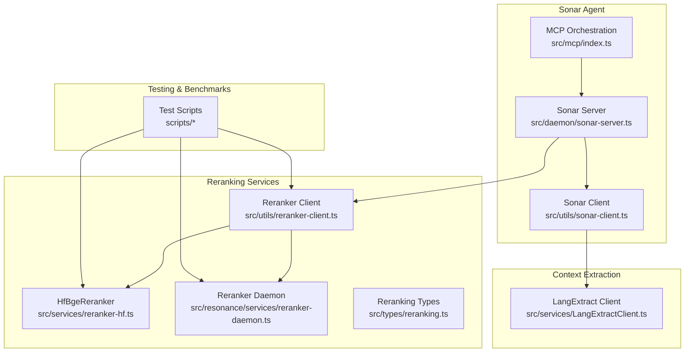
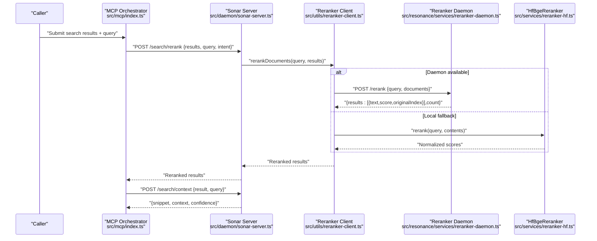
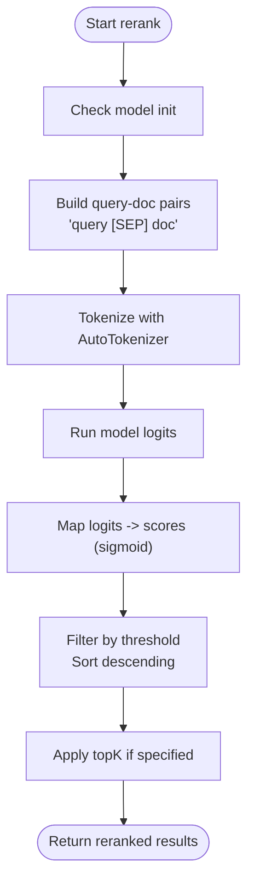
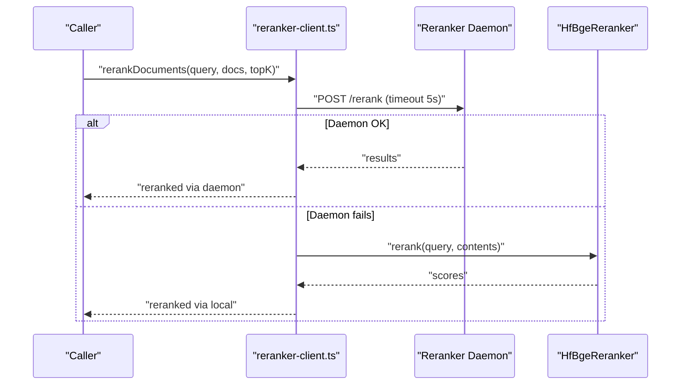
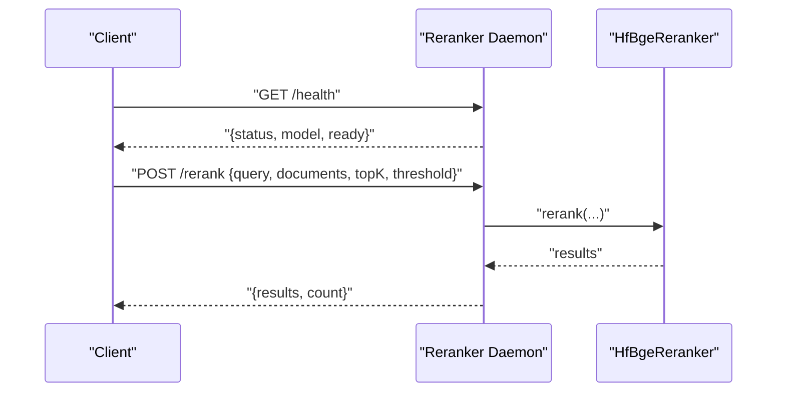
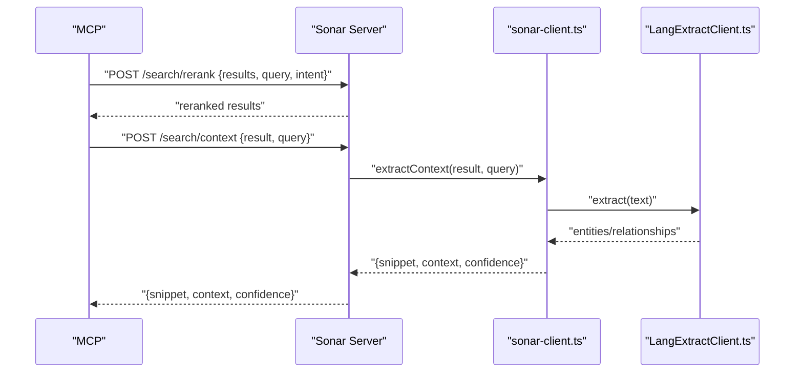
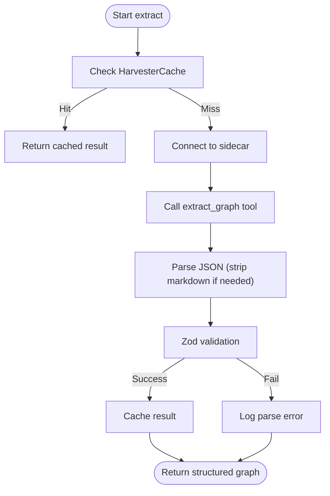
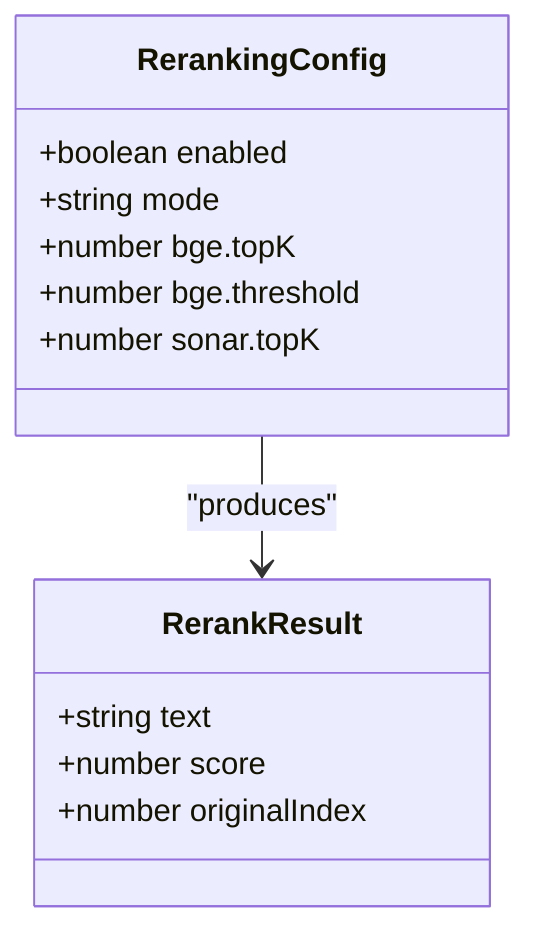
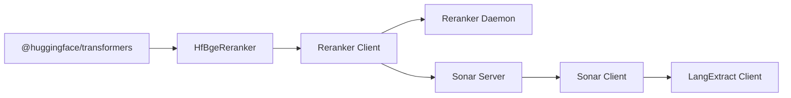

# Result Re-ranking and Context Extraction

<cite>
**Referenced Files in This Document**
- [reranker-hf.ts](file://src/services/reranker-hf.ts)
- [reranker-daemon.ts](file://src/resonance/services/reranker-daemon.ts)
- [reranker-client.ts](file://src/utils/reranker-client.ts)
- [reranking.ts](file://src/types/reranking.ts)
- [sonar-server.ts](file://src/daemon/sonar-server.ts)
- [mcp/index.ts](file://src/mcp/index.ts)
- [sonar-client.ts](file://src/utils/sonar-client.ts)
- [LangExtractClient.ts](file://src/services/LangExtractClient.ts)
- [test-reranker.ts](file://scripts/test-reranker.ts)
- [test-reranking-pipeline.ts](file://scripts/test-reranking-pipeline.ts)
- [benchmark-reranking-comparison.ts](file://scripts/benchmarks/benchmark-reranking-comparison.ts)
- [compare-reranking-results.ts](file://scripts/benchmarks/compare-reranking-results.ts)
- [debug-reranker.ts](file://scripts/debug-reranker.ts)
- [debug-reranker-raw.ts](file://scripts/debug-reranker-raw.ts)
- [2026-01-17-bge-reranker-operational.md](file://briefs/archive/2026-01-17-reranking/2026-01-17-bge-reranker-operational.md)
- [2026-01-17-reranker-implementation-debrief.md](file://debriefs/2026-01-17-reranker-implementation-debrief.md)
- [RERANKING-VALIDATION.md](file://docs/RERANKING-VALIDATION.md)
</cite>

## Table of Contents
1. [Introduction](#introduction)
2. [Project Structure](#project-structure)
3. [Core Components](#core-components)
4. [Architecture Overview](#architecture-overview)
5. [Detailed Component Analysis](#detailed-component-analysis)
6. [Dependency Analysis](#dependency-analysis)
7. [Performance Considerations](#performance-considerations)
8. [Troubleshooting Guide](#troubleshooting-guide)
9. [Conclusion](#conclusion)
10. [Appendices](#appendices)

## Introduction
This document explains the Sonar Agent's result re-ranking and context extraction systems. It covers the cross-encoder re-ranking process using BGE models, the JSON-based scoring system, relevance assessment criteria, and fallback strategies. It also details the integration with vector similarity scores, query intent consideration, and performance optimization. Examples of re-ranked results, extracted contexts, and quality assessment metrics are included, along with error handling, parsing failures, and re-ranking effectiveness measurement.

## Project Structure
The re-ranking and context extraction features span several modules:
- Cross-encoder reranking service and client
- Daemonized reranking endpoint
- Sonar Agent HTTP endpoints for reranking and context extraction
- Integration points in the MCP orchestration layer
- Benchmarking and testing utilities

**Diagram sources**
- [reranker-hf.ts](file://src/services/reranker-hf.ts#L22-L129)
- [reranker-daemon.ts](file://src/resonance/services/reranker-daemon.ts#L26-L141)
- [reranker-client.ts](file://src/utils/reranker-client.ts#L15-L225)
- [reranking.ts](file://src/types/reranking.ts#L5-L29)
- [sonar-server.ts](file://src/daemon/sonar-server.ts#L107-L130)
- [mcp/index.ts](file://src/mcp/index.ts#L441-L476)
- [sonar-client.ts](file://src/utils/sonar-client.ts#L236-L270)
- [LangExtractClient.ts](file://src/services/LangExtractClient.ts#L31-L354)

**Section sources**
- [reranker-hf.ts](file://src/services/reranker-hf.ts#L1-L130)
- [reranker-daemon.ts](file://src/resonance/services/reranker-daemon.ts#L1-L145)
- [reranker-client.ts](file://src/utils/reranker-client.ts#L1-L225)
- [reranking.ts](file://src/types/reranking.ts#L1-L30)
- [sonar-server.ts](file://src/daemon/sonar-server.ts#L1-L134)
- [mcp/index.ts](file://src/mcp/index.ts#L441-L476)
- [sonar-client.ts](file://src/utils/sonar-client.ts#L236-L270)
- [LangExtractClient.ts](file://src/services/LangExtractClient.ts#L1-L354)

## Core Components
- Cross-encoder reranker: BGE-based reranking using Transformers.js with ONNX inference, returning normalized relevance scores.
- Reranker client: Unified access with daemon-first strategy and graceful fallback to local model.
- Daemonized reranking: Standalone HTTP service exposing /rerank with health checks.
- Sonar Agent endpoints: /search/rerank and /search/context for integration with search workflows.
- Context extraction: Structured extraction via LangExtract sidecar with robust error parsing and caching.
- Configuration: Reranking modes and thresholds via typed configuration.

**Section sources**
- [reranker-hf.ts](file://src/services/reranker-hf.ts#L22-L129)
- [reranker-client.ts](file://src/utils/reranker-client.ts#L15-L225)
- [reranker-daemon.ts](file://src/resonance/services/reranker-daemon.ts#L26-L141)
- [sonar-server.ts](file://src/daemon/sonar-server.ts#L107-L130)
- [LangExtractClient.ts](file://src/services/LangExtractClient.ts#L31-L354)
- [reranking.ts](file://src/types/reranking.ts#L5-L29)

## Architecture Overview
The system integrates vector retrieval with cross-encoder re-ranking and context extraction:

**Diagram sources**
- [mcp/index.ts](file://src/mcp/index.ts#L441-L476)
- [sonar-server.ts](file://src/daemon/sonar-server.ts#L107-L130)
- [reranker-client.ts](file://src/utils/reranker-client.ts#L144-L209)
- [reranker-daemon.ts](file://src/resonance/services/reranker-daemon.ts#L64-L114)
- [reranker-hf.ts](file://src/services/reranker-hf.ts#L74-L128)

## Detailed Component Analysis

### Cross-Encoder Re-ranking Pipeline
The cross-encoder re-ranking transforms query-document pairs into relevance scores using BGE reranker:
- Input: query and array of document texts
- Pairing: "query [SEP] document" format
- Tokenization and inference via Transformers.js ONNX
- Score normalization: sigmoid applied to raw logits for [0,1] range
- Filtering and sorting by configurable threshold and topK

**Diagram sources**
- [reranker-hf.ts](file://src/services/reranker-hf.ts#L84-L128)

**Section sources**
- [reranker-hf.ts](file://src/services/reranker-hf.ts#L74-L128)
- [2026-01-17-bge-reranker-operational.md](file://briefs/archive/2026-01-17-reranking/2026-01-17-bge-reranker-operational.md#L306-L322)
- [2026-01-17-reranker-implementation-debrief.md](file://debriefs/2026-01-17-reranker-implementation-debrief.md#L1-L49)

### Reranker Client and Fallback Strategy
The client provides:
- Daemon-first strategy: attempts remote reranking via localhost daemon
- Local fallback: initializes HfBgeReranker singleton if daemon unavailable
- Graceful degradation: returns original order on failure
- Status reporting: availability and initialization state

**Diagram sources**
- [reranker-client.ts](file://src/utils/reranker-client.ts#L144-L209)
- [reranker-daemon.ts](file://src/resonance/services/reranker-daemon.ts#L64-L114)
- [reranker-hf.ts](file://src/services/reranker-hf.ts#L74-L128)

**Section sources**
- [reranker-client.ts](file://src/utils/reranker-client.ts#L15-L225)
- [reranker-daemon.ts](file://src/resonance/services/reranker-daemon.ts#L26-L141)
- [reranker-hf.ts](file://src/services/reranker-hf.ts#L22-L65)

### Daemonized Reranking Service
The daemon exposes:
- Health endpoint: readiness and model info
- Rerank endpoint: accepts query, documents, topK, threshold
- Lazy initialization: loads model on first request
- Robust error handling and logging

**Diagram sources**
- [reranker-daemon.ts](file://src/resonance/services/reranker-daemon.ts#L44-L131)
- [reranker-hf.ts](file://src/services/reranker-hf.ts#L74-L128)

**Section sources**
- [reranker-daemon.ts](file://src/resonance/services/reranker-daemon.ts#L1-L145)

### Sonar Agent Integration
The Sonar Agent exposes:
- /search/rerank: consumes results, query, and optional intent; returns reranked results
- /search/context: extracts smart snippets and contextual information for top candidates

**Diagram sources**
- [sonar-server.ts](file://src/daemon/sonar-server.ts#L107-L130)
- [mcp/index.ts](file://src/mcp/index.ts#L441-L476)
- [sonar-client.ts](file://src/utils/sonar-client.ts#L236-L270)
- [LangExtractClient.ts](file://src/services/LangExtractClient.ts#L248-L343)

**Section sources**
- [sonar-server.ts](file://src/daemon/sonar-server.ts#L107-L130)
- [mcp/index.ts](file://src/mcp/index.ts#L441-L476)
- [sonar-client.ts](file://src/utils/sonar-client.ts#L236-L270)
- [LangExtractClient.ts](file://src/services/LangExtractClient.ts#L248-L343)

### Context Extraction Mechanism
Smart snippets and exact text matches are produced by:
- Structured extraction via LangExtract sidecar (Python-based)
- Robust JSON parsing with markdown code block stripping
- Zod schema validation for entity/relationship structures
- Caching to avoid repeated extractions
- Error parsing with actionable suggestions

**Diagram sources**
- [LangExtractClient.ts](file://src/services/LangExtractClient.ts#L248-L343)

**Section sources**
- [LangExtractClient.ts](file://src/services/LangExtractClient.ts#L31-L354)

### JSON-Based Scoring and Relevance Assessment
- Re-ranking output: array of items with text, score, originalIndex
- Primary score: rerankScore replaces vector similarity score
- Threshold filtering: configurable minimum score
- TopK limiting: caps results to desired size
- Intent-aware reranking: query intent passed to server endpoint for richer context

**Diagram sources**
- [reranker-hf.ts](file://src/services/reranker-hf.ts#L16-L20)
- [reranking.ts](file://src/types/reranking.ts#L7-L29)

**Section sources**
- [reranker-hf.ts](file://src/services/reranker-hf.ts#L104-L123)
- [reranking.ts](file://src/types/reranking.ts#L5-L29)

### Integration with Vector Similarity Scores and Query Intent
- Vector scores are preserved alongside rerank scores
- Primary display score is replaced by rerank score for improved relevance
- Query intent is accepted in /search/rerank to guide reranking decisions
- Context extraction augments top results with structured insights

**Section sources**
- [reranker-client.ts](file://src/utils/reranker-client.ts#L187-L201)
- [sonar-server.ts](file://src/daemon/sonar-server.ts#L107-L116)
- [mcp/index.ts](file://src/mcp/index.ts#L441-L476)

## Dependency Analysis
- HfBgeReranker depends on @huggingface/transformers for tokenizer/model access
- Reranker Client manages availability and fallback between daemon and local model
- Daemon encapsulates model loading and exposes HTTP endpoints
- Sonar Server routes requests to reranking and context extraction handlers
- MCP orchestrator coordinates reranking and context extraction in workflows

**Diagram sources**
- [reranker-hf.ts](file://src/services/reranker-hf.ts#L9-L14)
- [reranker-client.ts](file://src/utils/reranker-client.ts#L8-L12)
- [reranker-daemon.ts](file://src/resonance/services/reranker-daemon.ts#L10-L12)
- [sonar-server.ts](file://src/daemon/sonar-server.ts#L6-L12)
- [sonar-client.ts](file://src/utils/sonar-client.ts#L236-L270)
- [LangExtractClient.ts](file://src/services/LangExtractClient.ts#L3-L8)

**Section sources**
- [reranker-hf.ts](file://src/services/reranker-hf.ts#L9-L14)
- [reranker-client.ts](file://src/utils/reranker-client.ts#L8-L12)
- [reranker-daemon.ts](file://src/resonance/services/reranker-daemon.ts#L10-L12)
- [sonar-server.ts](file://src/daemon/sonar-server.ts#L6-L12)
- [sonar-client.ts](file://src/utils/sonar-client.ts#L236-L270)
- [LangExtractClient.ts](file://src/services/LangExtractClient.ts#L3-L8)

## Performance Considerations
- Model loading cost: singleton pattern and daemon keep model resident
- Batch tokenization: efficient batching via Transformers.js
- Network latency: daemon-first strategy reduces cold-start and CPU overhead
- Timeout handling: client enforces 5s timeout for daemon requests
- Threshold and topK tuning: reduce downstream processing and improve responsiveness

[No sources needed since this section provides general guidance]

## Troubleshooting Guide
Common issues and resolutions:
- Daemon unavailability: client falls back to local model; check daemon logs and port configuration
- Model initialization failures: verify Transformers.js compatibility and model artifacts
- Parsing errors in context extraction: sidecar returns structured error messages; parse and apply suggestions
- JSON parsing failures: automatic markdown stripping attempted; review raw response logs
- Network timeouts: increase timeout or ensure daemon is reachable on localhost

**Section sources**
- [reranker-client.ts](file://src/utils/reranker-client.ts#L150-L152)
- [reranker-daemon.ts](file://src/resonance/services/reranker-daemon.ts#L115-L126)
- [LangExtractClient.ts](file://src/services/LangExtractClient.ts#L106-L186)
- [LangExtractClient.ts](file://src/services/LangExtractClient.ts#L310-L320)

## Conclusion
The Sonar Agent’s re-ranking and context extraction systems combine cross-encoder reranking with robust fallback strategies and structured context extraction. The modular design enables high performance and reliability, with clear error handling and diagnostic capabilities. Tunable thresholds and topK settings support diverse use cases, while intent-aware reranking and context enrichment improve search quality.

[No sources needed since this section summarizes without analyzing specific files]

## Appendices

### Example Workflows and Metrics
- Re-ranking effectiveness: measure precision@k and recall improvements using benchmark scripts
- Quality assessment: confidence scores and snippet coverage for key terms
- Baseline comparisons: use benchmarking utilities to compare reranker variants

**Section sources**
- [benchmark-reranking-comparison.ts](file://scripts/benchmarks/benchmark-reranking-comparison.ts)
- [compare-reranking-results.ts](file://scripts/benchmarks/compare-reranking-results.ts)
- [test-reranking-pipeline.ts](file://scripts/test-reranking-pipeline.ts)
- [RERANKING-VALIDATION.md](file://docs/RERANKING-VALIDATION.md)

### Testing and Debugging Utilities
- Unit tests and smoke tests validate reranking pipeline behavior
- Debug scripts inspect raw logits and intermediate steps
- Interactive debugging supports rapid iteration on model behavior

**Section sources**
- [test-reranker.ts](file://scripts/test-reranker.ts)
- [debug-reranker.ts](file://scripts/debug-reranker.ts)
- [debug-reranker-raw.ts](file://scripts/debug-reranker-raw.ts)