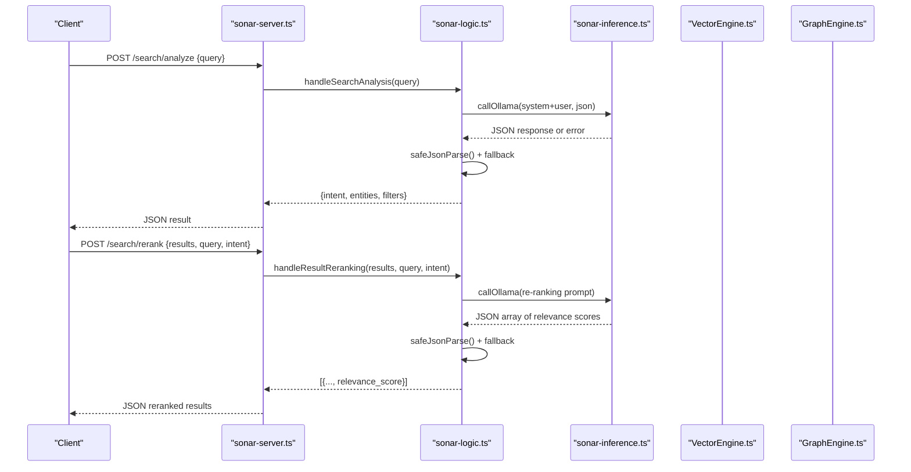
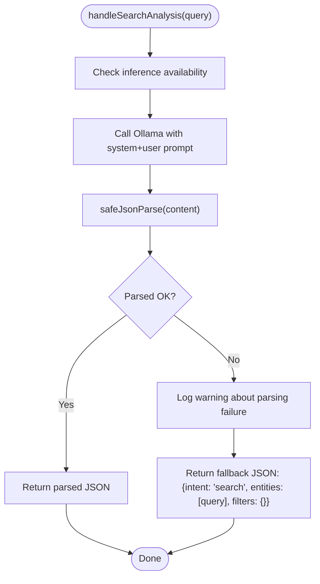
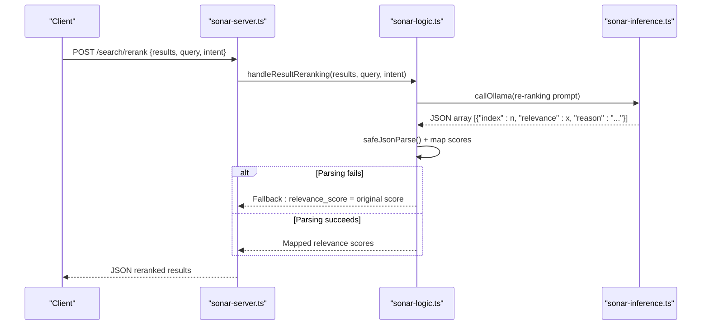
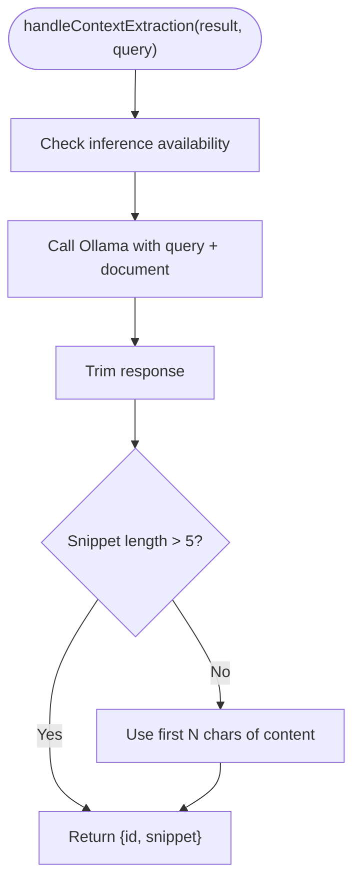
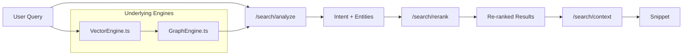
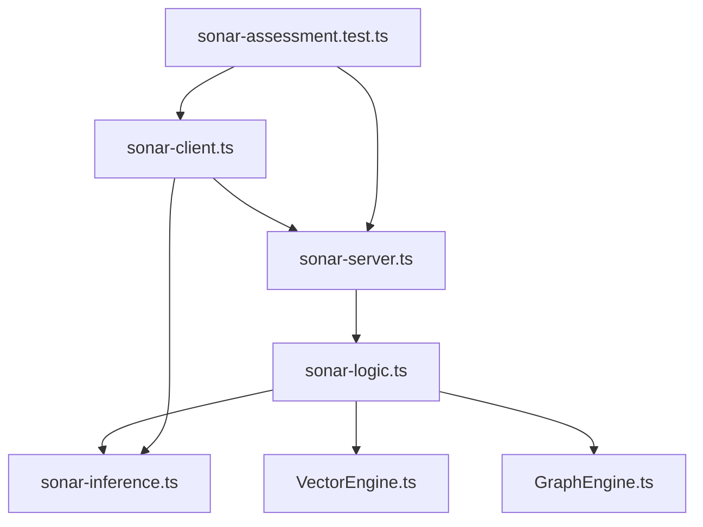

# Search Analysis and Intent Detection

<cite>
**Referenced Files in This Document**
- [sonar-agent.ts](file://src/daemon/sonar-agent.ts)
- [sonar-server.ts](file://src/daemon/sonar-server.ts)
- [sonar-logic.ts](file://src/daemon/sonar-logic.ts)
- [sonar-types.ts](file://src/daemon/sonar-types.ts)
- [sonar-client.ts](file://src/utils/sonar-client.ts)
- [sonar-assessment.test.ts](file://tests/sonar-assessment.test.ts)
- [sonar-inference.ts](file://src/daemon/sonar-inference.ts)
- [sonar-strategies.ts](file://src/daemon/sonar-strategies.ts)
- [GraphEngine.ts](file://src/core/GraphEngine.ts)
- [VectorEngine.ts](file://src/core/VectorEngine.ts)
- [ResonanceDB.ts](file://src/resonance/db.ts)
- [reaction-augment-intent-01.md](file://docs/reaction-augment-intent-01.md)
- [reaction-augment-intent-02.md](file://docs/reaction-augment-intent-02.md)
- [zero-magic-tokenization-playbook.md](file://playbooks/zero-magic-tokenization-playbook.md)
</cite>

## Table of Contents
1. [Introduction](#introduction)
2. [Project Structure](#project-structure)
3. [Core Components](#core-components)
4. [Architecture Overview](#architecture-overview)
5. [Detailed Component Analysis](#detailed-component-analysis)
6. [Dependency Analysis](#dependency-analysis)
7. [Performance Considerations](#performance-considerations)
8. [Troubleshooting Guide](#troubleshooting-guide)
9. [Conclusion](#conclusion)

## Introduction
This document explains the Sonar Agent's search analysis and intent detection capabilities. It covers how user queries are analyzed to extract search intent, key entities, and implicit filters, the JSON-based analysis format, fallback mechanisms, and parsing strategies. It also details the integration with vector search results and graph context for enhanced query understanding, the intent classification system, and entity extraction patterns. Examples of analyzed queries, intent classifications, and filter detection are included, along with error handling, parsing failures, and quality assurance measures.

## Project Structure
The search analysis and intent detection system spans several modules:
- HTTP server exposing endpoints for query analysis, result reranking, and context extraction
- Logic handlers orchestrating inference calls and fallbacks
- Client utilities for integrating with the Sonar daemon
- Supporting engines for graph and vector search
- Tests validating the end-to-end behavior

```mermaid
graph TB
subgraph "HTTP Layer"
Srv["sonar-server.ts<br/>Routes: /search/analyze, /search/rerank, /search/context"]
end
subgraph "Logic Layer"
Logic["sonar-logic.ts<br/>handleSearchAnalysis()<br/>handleResultReranking()<br/>handleContextExtraction()"]
Types["sonar-types.ts<br/>Request/Response types"]
end
subgraph "Inference Layer"
Inf["sonar-inference.ts<br/>callOllama()"]
Strat["sonar-strategies.ts<br/>utility strategies"]
end
subgraph "Search Engines"
Vec["VectorEngine.ts<br/>vector search"]
Graph["GraphEngine.ts<br/>graph traversal"]
DB["ResonanceDB.ts<br/>knowledge graph storage"]
end
subgraph "Client"
Client["sonar-client.ts<br/>analyzeQuery(), rerankResults(), extractContext()"]
end
Srv --> Logic
Logic --> Inf
Logic --> Vec
Logic --> Graph
Logic --> DB
Client --> Srv
Client --> Inf
```

**Diagram sources**
- [sonar-server.ts](file://src/daemon/sonar-server.ts#L90-L130)
- [sonar-logic.ts](file://src/daemon/sonar-logic.ts#L182-L319)
- [sonar-types.ts](file://src/daemon/sonar-types.ts#L55-L68)
- [sonar-inference.ts](file://src/daemon/sonar-inference.ts)
- [sonar-strategies.ts](file://src/daemon/sonar-strategies.ts)
- [VectorEngine.ts](file://src/core/VectorEngine.ts)
- [GraphEngine.ts](file://src/core/GraphEngine.ts)
- [ResonanceDB.ts](file://src/resonance/db.ts)
- [sonar-client.ts](file://src/utils/sonar-client.ts#L118-L255)

**Section sources**
- [sonar-server.ts](file://src/daemon/sonar-server.ts#L24-L133)
- [sonar-logic.ts](file://src/daemon/sonar-logic.ts#L182-L319)
- [sonar-types.ts](file://src/daemon/sonar-types.ts#L55-L68)
- [sonar-client.ts](file://src/utils/sonar-client.ts#L54-L270)

## Core Components
- Query Analysis Endpoint: Parses user queries into structured intent, entities, and filters using a JSON schema and fallback behavior.
- Result Reranking Endpoint: Re-ranks initial vector search results using intent-aware prompts and JSON parsing with robust fallbacks.
- Context Extraction Endpoint: Extracts precise snippets answering the query from matched documents with graceful fallbacks.
- Client Utilities: Provide typed APIs for analysis, reranking, and context extraction with health checks and timeouts.
- Inference Integration: Uses a configurable model provider (local or cloud) with JSON-formatted prompts and strict parsing.

Key behaviors:
- JSON schema enforcement with strict format requests
- Safe JSON parsing with markdown block extraction
- Fallbacks when inference fails or returns malformed JSON
- Client-side caching and timeout controls

**Section sources**
- [sonar-server.ts](file://src/daemon/sonar-server.ts#L90-L130)
- [sonar-logic.ts](file://src/daemon/sonar-logic.ts#L182-L319)
- [sonar-client.ts](file://src/utils/sonar-client.ts#L118-L255)
- [sonar-inference.ts](file://src/daemon/sonar-inference.ts)

## Architecture Overview
The system integrates vector search and graph context to inform intent detection and result reranking. The HTTP server routes requests to logic handlers that orchestrate inference calls and fallbacks. The client utilities encapsulate retries, timeouts, and health checks.



**Diagram sources**
- [sonar-server.ts](file://src/daemon/sonar-server.ts#L90-L130)
- [sonar-logic.ts](file://src/daemon/sonar-logic.ts#L182-L276)
- [sonar-inference.ts](file://src/daemon/sonar-inference.ts)

## Detailed Component Analysis

### Query Analysis System
Purpose:
- Extract search intent, key entities, and implicit filters from user queries
- Enforce a strict JSON schema and provide robust fallbacks

Implementation highlights:
- Strict JSON format request to the model
- Safe JSON parsing with extraction from markdown code blocks
- Fallback to a default classification when parsing fails
- Logging and error propagation



**Diagram sources**
- [sonar-logic.ts](file://src/daemon/sonar-logic.ts#L182-L218)
- [sonar-logic.ts](file://src/daemon/sonar-logic.ts#L669-L684)

JSON Analysis Format:
- Fields: intent, entities, filters
- intent: classification of the query's purpose
- entities: extracted key terms or concepts
- filters: implicit filters inferred from the query

Fallback Mechanism:
- On parsing failure: default classification and entity wrapping the query
- On inference failure: propagate error to caller

Quality Assurance:
- Tests validate intent extraction behavior and JSON schema adherence
- Client-side health checks and timeouts prevent blocking operations

**Section sources**
- [sonar-logic.ts](file://src/daemon/sonar-logic.ts#L182-L218)
- [sonar-logic.ts](file://src/daemon/sonar-logic.ts#L669-L684)
- [sonar-assessment.test.ts](file://tests/sonar-assessment.test.ts#L232-L250)
- [sonar-client.ts](file://src/utils/sonar-client.ts#L118-L150)

### Result Reranking System
Purpose:
- Improve retrieval quality by re-ranking initial vector search results
- Incorporate intent signals to guide relevance scoring

Implementation highlights:
- Prompt includes the original query and optional intent
- Returns a JSON array of relevance scores per result
- Robust fallback: preserve original scores if reranking fails



**Diagram sources**
- [sonar-server.ts](file://src/daemon/sonar-server.ts#L104-L116)
- [sonar-logic.ts](file://src/daemon/sonar-logic.ts#L222-L276)

Fallback Mechanism:
- If JSON parsing fails or returns invalid structure, preserve original scores
- Client-side fallback mirrors this behavior

Quality Assurance:
- Tests demonstrate reranking precision improvements and fallback behavior
- Client-side timeout and health checks ensure resilience

**Section sources**
- [sonar-logic.ts](file://src/daemon/sonar-logic.ts#L222-L276)
- [sonar-assessment.test.ts](file://tests/sonar-assessment.test.ts#L95-L156)
- [sonar-client.ts](file://src/utils/sonar-client.ts#L152-L203)

### Context Extraction System
Purpose:
- Extract the most relevant snippet from a document that answers the query
- Provide a concise, accurate excerpt with graceful fallbacks

Implementation highlights:
- Model instructed to return only the snippet text
- Fallback to a fixed-size excerpt if extraction fails
- Client-side fallback returns a simple snippet and confidence



**Diagram sources**
- [sonar-logic.ts](file://src/daemon/sonar-logic.ts#L281-L319)

Fallback Mechanism:
- If model refuses to extract or returns empty, use a prefix of the content
- Client-side fallback returns a simple snippet and moderate confidence

Quality Assurance:
- Tests validate snippet extraction accuracy and fallback behavior
- Client-side timeout and health checks ensure reliability

**Section sources**
- [sonar-logic.ts](file://src/daemon/sonar-logic.ts#L281-L319)
- [sonar-assessment.test.ts](file://tests/sonar-assessment.test.ts#L158-L230)
- [sonar-client.ts](file://src/utils/sonar-client.ts#L205-L255)

### Integration with Vector Search and Graph Context
While the primary intent detection is performed via the analysis endpoint, downstream workflows integrate vector and graph context:
- Chat handler demonstrates combining vector search results with graph neighbors to augment prompts
- The analysis result can be used to guide reranking and context extraction
- Strategies and engines support community analysis and relationship judgments



**Diagram sources**
- [sonar-server.ts](file://src/daemon/sonar-server.ts#L90-L130)
- [sonar-logic.ts](file://src/daemon/sonar-logic.ts#L104-L179)
- [VectorEngine.ts](file://src/core/VectorEngine.ts)
- [GraphEngine.ts](file://src/core/GraphEngine.ts)

**Section sources**
- [sonar-logic.ts](file://src/daemon/sonar-logic.ts#L104-L179)
- [sonar-strategies.ts](file://src/daemon/sonar-strategies.ts)

### Intent Classification and Entity Extraction Patterns
Intent classification:
- The analysis endpoint enforces returning a structured intent field
- Tests exercise informational queries to validate intent extraction
- Client types define a broader intent taxonomy for downstream consumers

Entity extraction:
- Entities are returned as an array from the analysis endpoint
- The system wraps the query as a fallback entity when parsing fails
- Tokenization and tagging strategies emphasize deterministic extraction over brittle external libraries

Additional context:
- The project aligns with an "Augment-like Context Engine" concept, emphasizing a bridge from raw inputs to curated context
- Zero-magic tokenization playbook emphasizes brute-force extraction over fighting with external POS taggers

**Section sources**
- [sonar-logic.ts](file://src/daemon/sonar-logic.ts#L182-L218)
- [sonar-assessment.test.ts](file://tests/sonar-assessment.test.ts#L232-L250)
- [sonar-client.ts](file://src/utils/sonar-client.ts#L44-L49)
- [reaction-augment-intent-01.md](file://docs/reaction-augment-intent-01.md#L1-L18)
- [reaction-augment-intent-02.md](file://docs/reaction-augment-intent-02.md#L33-L74)
- [zero-magic-tokenization-playbook.md](file://playbooks/zero-magic-tokenization-playbook.md#L46-L52)

### Examples of Analyzed Queries, Intent Classifications, and Filter Detection
Examples validated by tests:
- "How do I handle TypeScript regex types?" → informational intent with entities like "TypeScript", "regex", "types"
- "What is the scratchpad caching threshold?" → informational intent with entities like "scratchpad", "caching", "threshold"
- "Show me vector search implementation" → informational intent with entities like "vector", "search", "implementation"

Filter detection:
- Implicit filters can be inferred from queries (e.g., technical level, domain scope)
- The analysis endpoint returns a filters object placeholder for future expansion

Note: Specific intent labels and entity lists are derived from model responses and validated by tests.

**Section sources**
- [sonar-assessment.test.ts](file://tests/sonar-assessment.test.ts#L232-L250)
- [sonar-logic.ts](file://src/daemon/sonar-logic.ts#L182-L218)

## Dependency Analysis
The search analysis and intent detection system exhibits clear layering and separation of concerns:
- HTTP server depends on logic handlers
- Logic handlers depend on inference utilities and search engines
- Client utilities depend on HTTP endpoints and provide resilience
- Tests validate end-to-end behavior and fallbacks



**Diagram sources**
- [sonar-server.ts](file://src/daemon/sonar-server.ts#L24-L133)
- [sonar-logic.ts](file://src/daemon/sonar-logic.ts#L1-L17)
- [sonar-client.ts](file://src/utils/sonar-client.ts#L54-L270)
- [sonar-assessment.test.ts](file://tests/sonar-assessment.test.ts#L1-L28)

**Section sources**
- [sonar-server.ts](file://src/daemon/sonar-server.ts#L24-L133)
- [sonar-logic.ts](file://src/daemon/sonar-logic.ts#L1-L17)
- [sonar-client.ts](file://src/utils/sonar-client.ts#L54-L270)
- [sonar-assessment.test.ts](file://tests/sonar-assessment.test.ts#L1-L28)

## Performance Considerations
- Inference latency: The system uses short-form JSON prompts and moderate temperatures to reduce inference time
- Client-side caching: Health checks are cached to avoid repeated network calls
- Timeout controls: Requests are aborted after configured timeouts to prevent blocking
- Fallbacks: Graceful degradation preserves user experience when inference is unavailable

[No sources needed since this section provides general guidance]

## Troubleshooting Guide
Common issues and resolutions:
- Inference unavailable: The system throws or returns fallbacks depending on the operation
- JSON parsing failures: The system attempts to extract JSON from markdown blocks; otherwise falls back to defaults
- Network timeouts: Client utilities abort long-running requests and return sensible defaults
- Health checks: Availability is cached; stale cache is refreshed automatically

Operational tips:
- Monitor inference availability via the health endpoint
- Validate JSON schema compliance in prompts
- Use client utilities to centralize error handling and timeouts

**Section sources**
- [sonar-logic.ts](file://src/daemon/sonar-logic.ts#L182-L218)
- [sonar-logic.ts](file://src/daemon/sonar-logic.ts#L222-L276)
- [sonar-logic.ts](file://src/daemon/sonar-logic.ts#L281-L319)
- [sonar-client.ts](file://src/utils/sonar-client.ts#L118-L255)

## Conclusion
The Sonar Agent's search analysis and intent detection system provides a robust, resilient foundation for understanding user queries and enhancing retrieval quality. Through strict JSON schemas, safe parsing, and comprehensive fallbacks, it ensures reliable behavior under varying conditions. Integration with vector search and graph context further improves relevance, while client utilities encapsulate health checks and timeouts for production-grade reliability.