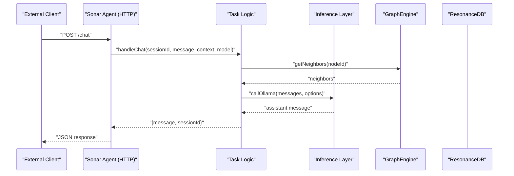
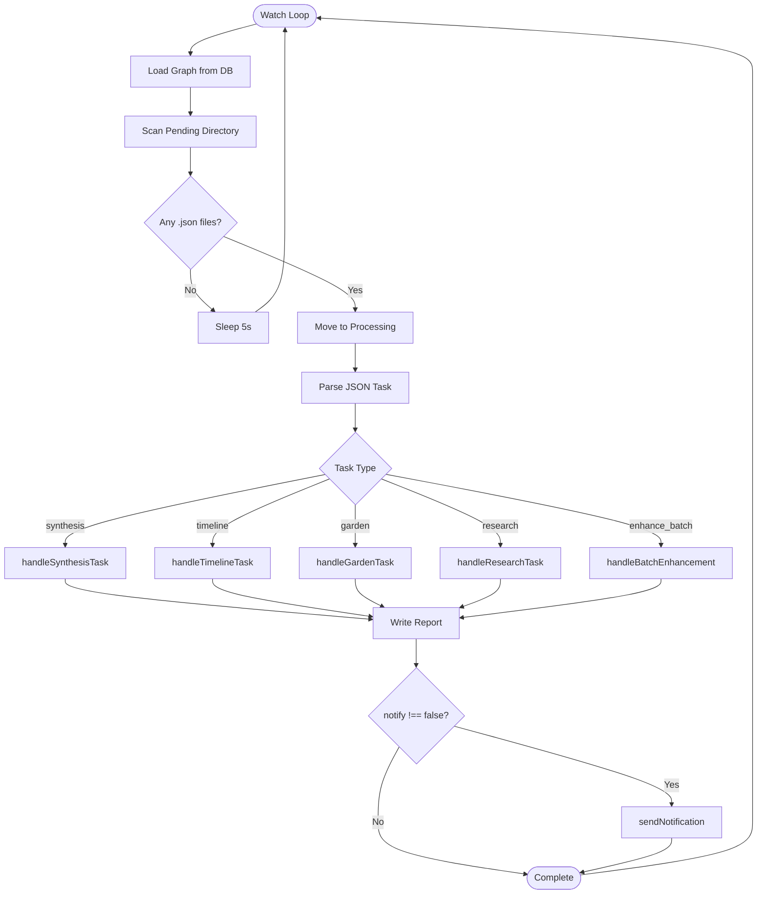
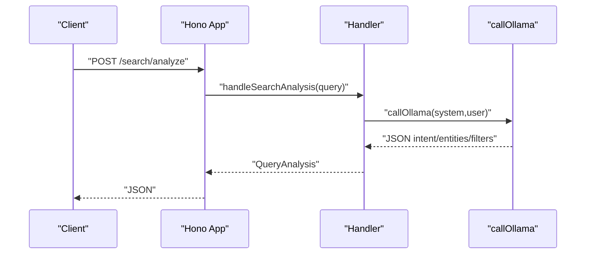
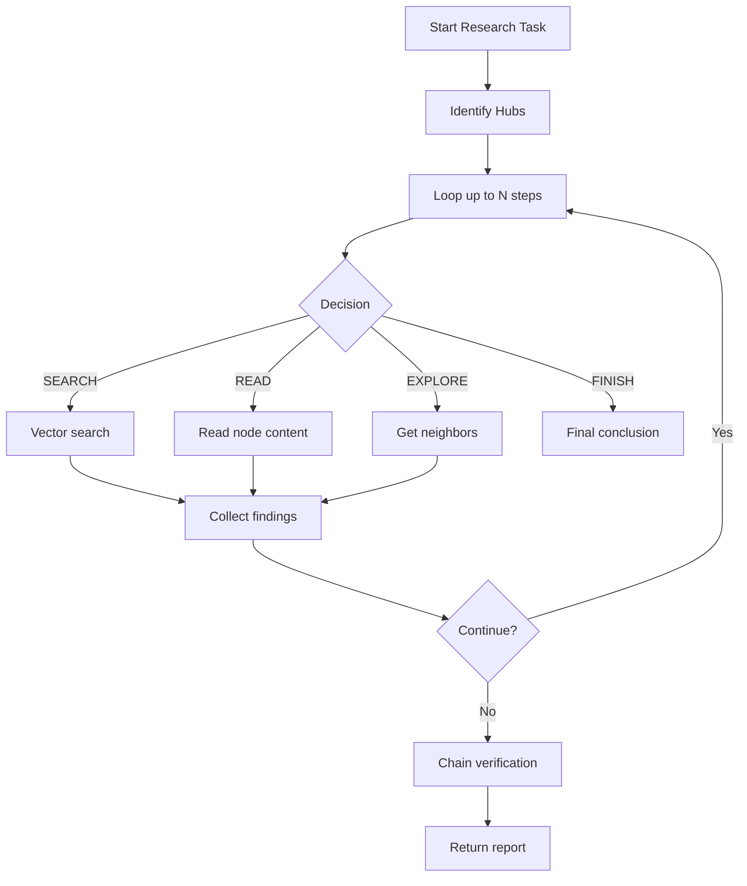
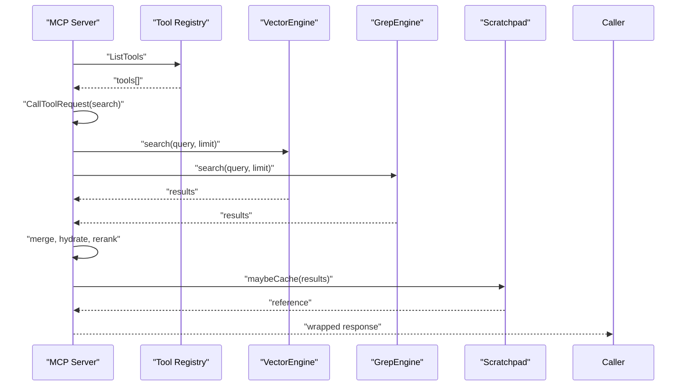
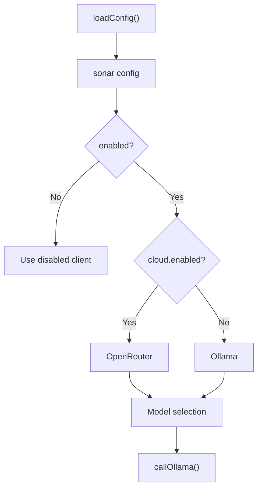
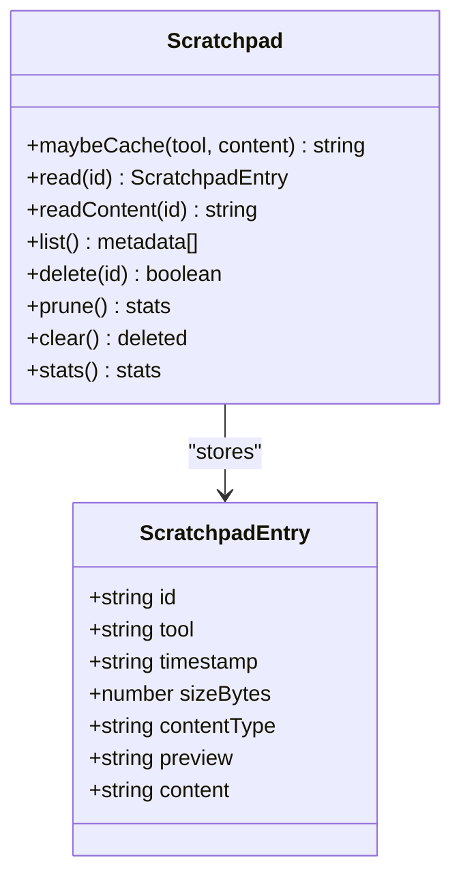
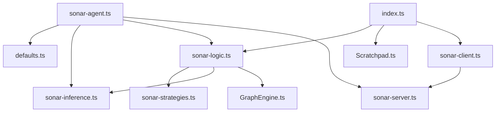

# Sonar Agent

<cite>
**Referenced Files in This Document**
- [sonar-agent.ts](file://src/daemon/sonar-agent.ts)
- [sonar-server.ts](file://src/daemon/sonar-server.ts)
- [sonar-logic.ts](file://src/daemon/sonar-logic.ts)
- [sonar-strategies.ts](file://src/daemon/sonar-strategies.ts)
- [sonar-inference.ts](file://src/daemon/sonar-inference.ts)
- [sonar-types.ts](file://src/daemon/sonar-types.ts)
- [defaults.ts](file://src/config/defaults.ts)
- [schema.ts](file://src/config/schema.ts)
- [index.ts](file://src/mcp/index.ts)
- [sonar-client.ts](file://src/utils/sonar-client.ts)
- [Scratchpad.ts](file://src/utils/Scratchpad.ts)
- [ToolRegistry.ts](file://src/utils/ToolRegistry.ts)
- [GraphEngine.ts](file://src/core/GraphEngine.ts)
- [README.md](file://README.md)
- [SCRATCHPAD-INNOVATION.md](file://docs/SCRATCHPAD-INNOVATION.md)
</cite>

## Table of Contents
1. [Introduction](#introduction)
2. [Project Structure](#project-structure)
3. [Core Components](#core-components)
4. [Architecture Overview](#architecture-overview)
5. [Detailed Component Analysis](#detailed-component-analysis)
6. [Dependency Analysis](#dependency-analysis)
7. [Performance Considerations](#performance-considerations)
8. [Troubleshooting Guide](#troubleshooting-guide)
9. [Conclusion](#conclusion)
10. [Appendices](#appendices)

## Introduction
The Sonar Agent is a multi-threaded AI agent designed for autonomous research and synthesis within a knowledge graph. It orchestrates task execution, integrates with the MCP protocol, and coordinates with external inference providers (local Ollama and cloud OpenRouter). The agent manages persistent state, maintains chat sessions, and leverages a scratchpad mechanism to handle large tool outputs efficiently. It supports research workflows, synthesis of knowledge clusters, timeline anchoring, and graph gap-finding with LLM-powered strategies.

## Project Structure
The Sonar Agent resides primarily under the daemon module and integrates with configuration, MCP, and utility layers:
- Daemon entry and orchestration: [sonar-agent.ts](file://src/daemon/sonar-agent.ts)
- HTTP API surface: [sonar-server.ts](file://src/daemon/sonar-server.ts)
- Task logic and workflows: [sonar-logic.ts](file://src/daemon/sonar-logic.ts)
- LLM strategies: [sonar-strategies.ts](file://src/daemon/sonar-strategies.ts)
- Inference provider abstraction: [sonar-inference.ts](file://src/daemon/sonar-inference.ts)
- Types and requests: [sonar-types.ts](file://src/daemon/sonar-types.ts)
- Configuration and schema: [defaults.ts](file://src/config/defaults.ts), [schema.ts](file://src/config/schema.ts)
- MCP integration and tooling: [index.ts](file://src/mcp/index.ts)
- Client for Sonar HTTP endpoints: [sonar-client.ts](file://src/utils/sonar-client.ts)
- Scratchpad protocol: [Scratchpad.ts](file://src/utils/Scratchpad.ts)
- Dynamic tool registry: [ToolRegistry.ts](file://src/utils/ToolRegistry.ts)
- Graph engine for traversal and analysis: [GraphEngine.ts](file://src/core/GraphEngine.ts)

```mermaid
graph TB
subgraph "Daemon"
SA["sonar-agent.ts"]
SS["sonar-server.ts"]
SL["sonar-logic.ts"]
STR["sonar-strategies.ts"]
INF["sonar-inference.ts"]
TYP["sonar-types.ts"]
end
subgraph "Config"
DEF["defaults.ts"]
SCH["schema.ts"]
end
subgraph "MCP"
MCP["index.ts"]
SRC["sonar-client.ts"]
end
subgraph "Utilities"
PAD["Scratchpad.ts"]
REG["ToolRegistry.ts"]
end
subgraph "Core"
GE["GraphEngine.ts"]
end
SA --> SS
SA --> SL
SA --> INF
SA --> DEF
SS --> SL
SL --> STR
SL --> INF
SL --> GE
MCP --> SL
MCP --> PAD
MCP --> REG
MCP --> SRC
SRC --> SS
```

**Diagram sources**
- [sonar-agent.ts](file://src/daemon/sonar-agent.ts#L1-L221)
- [sonar-server.ts](file://src/daemon/sonar-server.ts#L1-L134)
- [sonar-logic.ts](file://src/daemon/sonar-logic.ts#L1-L685)
- [sonar-strategies.ts](file://src/daemon/sonar-strategies.ts#L1-L187)
- [sonar-inference.ts](file://src/daemon/sonar-inference.ts#L1-L120)
- [defaults.ts](file://src/config/defaults.ts#L1-L143)
- [schema.ts](file://src/config/schema.ts#L1-L298)
- [index.ts](file://src/mcp/index.ts#L1-L748)
- [sonar-client.ts](file://src/utils/sonar-client.ts#L1-L309)
- [Scratchpad.ts](file://src/utils/Scratchpad.ts#L1-L427)
- [ToolRegistry.ts](file://src/utils/ToolRegistry.ts#L1-L30)
- [GraphEngine.ts](file://src/core/GraphEngine.ts#L1-L314)

**Section sources**
- [sonar-agent.ts](file://src/daemon/sonar-agent.ts#L1-L221)
- [sonar-server.ts](file://src/daemon/sonar-server.ts#L1-L134)
- [defaults.ts](file://src/config/defaults.ts#L1-L143)
- [schema.ts](file://src/config/schema.ts#L1-L298)

## Core Components
- Task orchestration and file-based queue: The agent watches a pending task directory, moves tasks to processing, executes handlers, and writes completion reports. See [executeTask](file://src/daemon/sonar-agent.ts#L184-L217) and [processPendingTasks](file://src/daemon/sonar-agent.ts#L138-L179).
- HTTP API endpoints: Health, chat, metadata enhancement, search analysis, reranking, and context extraction. See [createSonarApp](file://src/daemon/sonar-server.ts#L24-L133).
- LLM strategies: Relationship judgment, community synthesis, and temporal anchoring. See [judgeRelationship](file://src/daemon/sonar-strategies.ts#L34-L84), [summarizeCommunity](file://src/daemon/sonar-strategies.ts#L90-L142), [extractDate](file://src/daemon/sonar-strategies.ts#L148-L186).
- Inference provider abstraction: Unified callOllama supporting local Ollama and OpenRouter with model routing and API key handling. See [callOllama](file://src/daemon/sonar-inference.ts#L19-L119).
- Task logic: Metadata enhancement, batch enhancement, chat with graph-augmented context, search analysis, result reranking, context extraction, synthesis, timeline anchoring, and research loops. See [handleMetadataEnhancement](file://src/daemon/sonar-logic.ts#L29-L65), [handleBatchEnhancement](file://src/daemon/sonar-logic.ts#L70-L99), [handleChat](file://src/daemon/sonar-logic.ts#L104-L179), [handleSearchAnalysis](file://src/daemon/sonar-logic.ts#L184-L218), [handleResultReranking](file://src/daemon/sonar-logic.ts#L223-L276), [handleContextExtraction](file://src/daemon/sonar-logic.ts#L281-L319), [handleSynthesisTask](file://src/daemon/sonar-logic.ts#L323-L364), [handleTimelineTask](file://src/daemon/sonar-logic.ts#L369-L392), [handleGardenTask](file://src/daemon/sonar-logic.ts#L397-L465), [handleResearchTask](file://src/daemon/sonar-logic.ts#L470-L664).
- Configuration and schema: Centralized settings including Sonar enablement, cloud provider toggles, model selection, and task priorities. See [loadSettings](file://src/config/defaults.ts#L84-L139), [SonarConfigSchema](file://src/config/schema.ts#L54-L88), [AmalfaSettingsSchema](file://src/config/schema.ts#L146-L266).
- MCP integration: Server registers tools, executes search with hybrid retrieval, reranking, and context extraction, and wraps large outputs in scratchpad. See [runServer](file://src/mcp/index.ts#L62-L723).
- Scratchpad protocol: Caches large tool outputs and returns references with previews; supports selective retrieval and pruning. See [Scratchpad class](file://src/utils/Scratchpad.ts#L59-L405).
- Dynamic tool registry: Manages tool registration and lookup. See [DynamicToolRegistry](file://src/utils/ToolRegistry.ts#L8-L27).
- Graph engine: In-memory graph for traversal and analysis. See [GraphEngine](file://src/core/GraphEngine.ts#L39-L200).

**Section sources**
- [sonar-agent.ts](file://src/daemon/sonar-agent.ts#L138-L217)
- [sonar-server.ts](file://src/daemon/sonar-server.ts#L24-L133)
- [sonar-strategies.ts](file://src/daemon/sonar-strategies.ts#L34-L186)
- [sonar-inference.ts](file://src/daemon/sonar-inference.ts#L19-L119)
- [sonar-logic.ts](file://src/daemon/sonar-logic.ts#L29-L664)
- [defaults.ts](file://src/config/defaults.ts#L84-L139)
- [schema.ts](file://src/config/schema.ts#L54-L266)
- [index.ts](file://src/mcp/index.ts#L62-L723)
- [Scratchpad.ts](file://src/utils/Scratchpad.ts#L59-L405)
- [ToolRegistry.ts](file://src/utils/ToolRegistry.ts#L8-L27)
- [GraphEngine.ts](file://src/core/GraphEngine.ts#L39-L200)

## Architecture Overview
The Sonar Agent follows a modular architecture:
- Daemon orchestrator: Watches task queues, loads configuration, initializes engines, and starts the HTTP server.
- HTTP API: Exposes endpoints for health, chat, metadata enhancement, search analysis, reranking, and context extraction.
- Task logic: Implements workflows for synthesis, timeline anchoring, graph gardening, and autonomous research.
- Inference layer: Routes requests to local Ollama or cloud OpenRouter with model selection and rate-aware throttling.
- MCP integration: Bridges the agent to external tools, enabling search, reading, exploring, and gap-finding with hybrid retrieval and reranking.
- Utilities: Scratchpad for large output caching, ToolRegistry for dynamic tools, and configuration schema for centralized settings.



**Diagram sources**
- [sonar-server.ts](file://src/daemon/sonar-server.ts#L58-L67)
- [sonar-logic.ts](file://src/daemon/sonar-logic.ts#L104-L179)
- [sonar-inference.ts](file://src/daemon/sonar-inference.ts#L19-L119)
- [GraphEngine.ts](file://src/core/GraphEngine.ts#L105-L108)

**Section sources**
- [sonar-agent.ts](file://src/daemon/sonar-agent.ts#L60-L133)
- [sonar-server.ts](file://src/daemon/sonar-server.ts#L24-L133)
- [sonar-logic.ts](file://src/daemon/sonar-logic.ts#L104-L179)
- [sonar-inference.ts](file://src/daemon/sonar-inference.ts#L19-L119)
- [GraphEngine.ts](file://src/core/GraphEngine.ts#L50-L100)

## Detailed Component Analysis

### Task Management and Queueing
- Pending task processing: The agent periodically scans the pending directory, atomically moves files to processing, parses JSON tasks, executes handlers, writes reports, and notifies on completion or failure. See [processPendingTasks](file://src/daemon/sonar-agent.ts#L138-L179).
- Task execution routing: Based on task.type, the agent invokes specialized handlers for synthesis, timeline, garden, research, and batch enhancement. See [executeTask](file://src/daemon/sonar-agent.ts#L184-L217).
- Task types and options: Tasks support minSize, limit, autoApply, notify, query, model, and sessionId fields. See [SonarTask](file://src/daemon/sonar-types.ts#L16-L32).



**Diagram sources**
- [sonar-agent.ts](file://src/daemon/sonar-agent.ts#L106-L179)
- [sonar-logic.ts](file://src/daemon/sonar-logic.ts#L323-L465)

**Section sources**
- [sonar-agent.ts](file://src/daemon/sonar-agent.ts#L138-L217)
- [sonar-types.ts](file://src/daemon/sonar-types.ts#L16-L32)

### HTTP API and Endpoints
- Health: Returns provider and model status. See [health handler](file://src/daemon/sonar-server.ts#L40-L53).
- Chat: Maintains chat sessions and augments messages with graph-derived context. See [chat handler](file://src/daemon/sonar-server.ts#L58-L67) and [handleChat](file://src/daemon/sonar-logic.ts#L104-L179).
- Metadata enhancement: Enhances node metadata via LLM. See [metadata endpoint](file://src/daemon/sonar-server.ts#L72-L81) and [handleMetadataEnhancement](file://src/daemon/sonar-logic.ts#L29-L65).
- Search analysis: Parses query intent and entities. See [search/analyze](file://src/daemon/sonar-server.ts#L93-L102) and [handleSearchAnalysis](file://src/daemon/sonar-logic.ts#L184-L218).
- Result reranking: LLM-based relevance scoring. See [search/rerank](file://src/daemon/sonar-server.ts#L107-L116) and [handleResultReranking](file://src/daemon/sonar-logic.ts#L223-L276).
- Context extraction: Extracts snippets for a query. See [search/context](file://src/daemon/sonar-server.ts#L121-L130) and [handleContextExtraction](file://src/daemon/sonar-logic.ts#L281-L319).



**Diagram sources**
- [sonar-server.ts](file://src/daemon/sonar-server.ts#L93-L102)
- [sonar-logic.ts](file://src/daemon/sonar-logic.ts#L184-L218)
- [sonar-inference.ts](file://src/daemon/sonar-inference.ts#L19-L119)

**Section sources**
- [sonar-server.ts](file://src/daemon/sonar-server.ts#L40-L133)
- [sonar-logic.ts](file://src/daemon/sonar-logic.ts#L184-L319)
- [sonar-inference.ts](file://src/daemon/sonar-inference.ts#L19-L119)

### Research Strategies and Synthesis Workflows
- Relationship judgment: Uses LLM to classify semantic relationships between nodes. See [judgeRelationship](file://src/daemon/sonar-strategies.ts#L34-L84).
- Community synthesis: Summarizes clusters of related nodes into canonical labels and syntheses. See [summarizeCommunity](file://src/daemon/sonar-strategies.ts#L90-L142).
- Temporal anchoring: Extracts primary dates from documents. See [extractDate](file://src/daemon/sonar-strategies.ts#L148-L186).
- Synthesis task: Analyzes communities, summarizes, optionally writes synthesis nodes. See [handleSynthesisTask](file://src/daemon/sonar-logic.ts#L323-L364).
- Timeline task: Anchors nodes to dates and optionally updates DB. See [handleTimelineTask](file://src/daemon/sonar-logic.ts#L369-L392).
- Garden task: Finds semantic and structural gaps, applies judgments, and injects tags. See [handleGardenTask](file://src/daemon/sonar-logic.ts#L397-L465).
- Research task: Iterative discovery loop with search, read, explore, and finish decisions. See [handleResearchTask](file://src/daemon/sonar-logic.ts#L470-L664).



**Diagram sources**
- [sonar-logic.ts](file://src/daemon/sonar-logic.ts#L470-L664)
- [sonar-strategies.ts](file://src/daemon/sonar-strategies.ts#L34-L142)

**Section sources**
- [sonar-strategies.ts](file://src/daemon/sonar-strategies.ts#L34-L186)
- [sonar-logic.ts](file://src/daemon/sonar-logic.ts#L323-L664)

### MCP Integration and Tool Registry
- MCP server registers tools and handles requests: search, read, explore, list, gaps, scratchpad read/list, and garden. See [runServer](file://src/mcp/index.ts#L62-L723).
- Hybrid retrieval pipeline: Parallel vector and grep search, merge, hydrate, cross-encoder rerank, optional LLM rerank, and context extraction. See [CallToolRequestSchema handler](file://src/mcp/index.ts#L252-L688).
- Scratchpad wrapping: Large tool outputs are cached and returned as references with previews. See [wrapWithScratchpad](file://src/mcp/index.ts#L76-L92) and [Scratchpad.maybeCache](file://src/utils/Scratchpad.ts#L147-L190).
- Dynamic tool registry: Tools are registered and looked up by name. See [DynamicToolRegistry](file://src/utils/ToolRegistry.ts#L8-L27).



**Diagram sources**
- [index.ts](file://src/mcp/index.ts#L164-L250)
- [index.ts](file://src/mcp/index.ts#L252-L688)
- [Scratchpad.ts](file://src/utils/Scratchpad.ts#L147-L190)

**Section sources**
- [index.ts](file://src/mcp/index.ts#L62-L723)
- [Scratchpad.ts](file://src/utils/Scratchpad.ts#L59-L405)
- [ToolRegistry.ts](file://src/utils/ToolRegistry.ts#L8-L27)

### Configuration Options and Model Selection
- Centralized configuration: Sonar enablement, auto-discovery, inference method, model, host, port, and task priorities. See [SonarConfigSchema](file://src/config/schema.ts#L54-L88).
- Cloud provider strategy: Toggle between local Ollama and OpenRouter with API key precedence. See [callOllama](file://src/daemon/sonar-inference.ts#L23-L60).
- Task routing: Model selection per task type with cloud provider overrides. See [getTaskModel](file://src/daemon/sonar-strategies.ts#L10-L28).
- Directory structure: Task queues, runtime, logs, cache, and scratchpad paths. See [AMALFA_DIRS](file://src/config/defaults.ts#L16-L40).



**Diagram sources**
- [schema.ts](file://src/config/schema.ts#L198-L233)
- [sonar-inference.ts](file://src/daemon/sonar-inference.ts#L23-L60)
- [sonar-strategies.ts](file://src/daemon/sonar-strategies.ts#L10-L28)

**Section sources**
- [schema.ts](file://src/config/schema.ts#L54-L233)
- [defaults.ts](file://src/config/defaults.ts#L16-L40)
- [sonar-inference.ts](file://src/daemon/sonar-inference.ts#L23-L60)
- [sonar-strategies.ts](file://src/daemon/sonar-strategies.ts#L10-L28)

### State Management, Context Preservation, and Scratchpad
- Chat sessions: Maintained in-memory keyed by sessionId with system messages and history. See [ChatSession](file://src/daemon/sonar-types.ts#L10-L14) and [handleChat](file://src/daemon/sonar-logic.ts#L104-L179).
- Graph context augmentation: Neighbors and direct results are embedded into the user message for grounding. See [handleChat](file://src/daemon/sonar-logic.ts#L145-L161).
- Scratchpad protocol: Caches large outputs, deduplicates by content hash, prunes by age and size, and supports selective retrieval. See [Scratchpad class](file://src/utils/Scratchpad.ts#L59-L405) and [SCRATCHPAD-INNOVATION.md](file://docs/SCRATCHPAD-INNOVATION.md#L1-L469).



**Diagram sources**
- [Scratchpad.ts](file://src/utils/Scratchpad.ts#L59-L405)

**Section sources**
- [sonar-types.ts](file://src/daemon/sonar-types.ts#L10-L14)
- [sonar-logic.ts](file://src/daemon/sonar-logic.ts#L104-L179)
- [Scratchpad.ts](file://src/utils/Scratchpad.ts#L59-L405)
- [SCRATCHPAD-INNOVATION.md](file://docs/SCRATCHPAD-INNOVATION.md#L1-L469)

### Thread Pooling and Concurrency
- Per-request concurrency: MCP server handles each tool request independently, with parallel execution for vector and grep search. See [parallel search](file://src/mcp/index.ts#L315-L331).
- Batch enhancement: Promise.allSettled for parallel metadata enhancement. See [handleBatchEnhancement](file://src/daemon/sonar-logic.ts#L89-L93).
- Watcher loop: Single-threaded polling with 5-second intervals; tasks are processed sequentially per file. See [processPendingTasks](file://src/daemon/sonar-agent.ts#L138-L179).

**Section sources**
- [index.ts](file://src/mcp/index.ts#L315-L331)
- [sonar-logic.ts](file://src/daemon/sonar-logic.ts#L70-L99)
- [sonar-agent.ts](file://src/daemon/sonar-agent.ts#L138-L179)

## Dependency Analysis
The following diagram highlights key dependencies among core modules:



**Diagram sources**
- [sonar-agent.ts](file://src/daemon/sonar-agent.ts#L1-L35)
- [sonar-server.ts](file://src/daemon/sonar-server.ts#L1-L20)
- [sonar-logic.ts](file://src/daemon/sonar-logic.ts#L1-L17)
- [sonar-strategies.ts](file://src/daemon/sonar-strategies.ts#L1-L5)
- [sonar-inference.ts](file://src/daemon/sonar-inference.ts#L1-L5)
- [defaults.ts](file://src/config/defaults.ts#L1-L25)
- [index.ts](file://src/mcp/index.ts#L1-L26)
- [sonar-client.ts](file://src/utils/sonar-client.ts#L1-L9)
- [Scratchpad.ts](file://src/utils/Scratchpad.ts#L1-L26)
- [GraphEngine.ts](file://src/core/GraphEngine.ts#L1-L14)

**Section sources**
- [sonar-agent.ts](file://src/daemon/sonar-agent.ts#L1-L35)
- [sonar-server.ts](file://src/daemon/sonar-server.ts#L1-L20)
- [sonar-logic.ts](file://src/daemon/sonar-logic.ts#L1-L17)
- [sonar-strategies.ts](file://src/daemon/sonar-strategies.ts#L1-L5)
- [sonar-inference.ts](file://src/daemon/sonar-inference.ts#L1-L5)
- [defaults.ts](file://src/config/defaults.ts#L1-L25)
- [index.ts](file://src/mcp/index.ts#L1-L26)
- [sonar-client.ts](file://src/utils/sonar-client.ts#L1-L9)
- [Scratchpad.ts](file://src/utils/Scratchpad.ts#L1-L26)
- [GraphEngine.ts](file://src/core/GraphEngine.ts#L1-L14)

## Performance Considerations
- Inference throttling: Free-tier models include deliberate delays to respect quotas. See [handleGardenTask](file://src/daemon/sonar-logic.ts#L427-L428) and [handleResearchTask](file://src/daemon/sonar-logic.ts#L606-L607).
- Parallel retrieval: Vector and grep searches run concurrently to reduce latency. See [parallel search](file://src/mcp/index.ts#L315-L331).
- Context management: Scratchpad reduces context usage by orders of magnitude for large outputs. See [SCRATCHPAD-INNOVATION.md](file://docs/SCRATCHPAD-INNOVATION.md#L1-L469).
- Batch processing: Batch enhancement uses Promise.allSettled to parallelize metadata enrichment. See [handleBatchEnhancement](file://src/daemon/sonar-logic.ts#L89-L93).
- Graph loading: In-memory graph is reloaded before task processing to reflect latest edges. See [main loop](file://src/daemon/sonar-agent.ts#L110-L115).

[No sources needed since this section provides general guidance]

## Troubleshooting Guide
- Agent disabled in config: The agent exits early if Sonar is disabled. See [main guard](file://src/daemon/sonar-agent.ts#L62-L65).
- Ollama connectivity: Health check determines availability; if unreachable and cloud disabled, agent operates in limited mode. See [health and readiness](file://src/daemon/sonar-agent.ts#L81-L96).
- Cloud API key issues: Missing or invalid API key logs warnings; ensure OPENROUTER_API_KEY or config cloud.apiKey is set. See [callOllama headers](file://src/daemon/sonar-inference.ts#L44-L54).
- Task failure reporting: Failed tasks write a FAILED report and remain in completed directory. See [failure handling](file://src/daemon/sonar-agent.ts#L167-L177).
- MCP crashes: Uncaught exceptions and unhandled rejections are logged and appended to a crash log. See [global error handlers](file://src/mcp/index.ts#L727-L743).
- Scratchpad cache bloat: Use prune() to remove old entries and enforce size limits. See [prune](file://src/utils/Scratchpad.ts#L272-L349).
- Sonar client fallbacks: When Sonar is unavailable, clients return safe defaults (e.g., rerank original scores). See [createDisabledClient](file://src/utils/sonar-client.ts#L275-L308).

**Section sources**
- [sonar-agent.ts](file://src/daemon/sonar-agent.ts#L62-L96)
- [sonar-inference.ts](file://src/daemon/sonar-inference.ts#L44-L54)
- [sonar-agent.ts](file://src/daemon/sonar-agent.ts#L167-L177)
- [index.ts](file://src/mcp/index.ts#L727-L743)
- [Scratchpad.ts](file://src/utils/Scratchpad.ts#L272-L349)
- [sonar-client.ts](file://src/utils/sonar-client.ts#L275-L308)

## Conclusion
The Sonar Agent provides a robust, multi-modal AI agent for autonomous research and synthesis. Its architecture balances concurrency, modularity, and resilience: a task queue for asynchronous work, an HTTP API for interactive tasks, MCP integration for tool orchestration, and a scratchpad protocol for efficient context management. With configurable inference providers, LLM-powered strategies, and graph-aware workflows, it scales from individual research tasks to coordinated knowledge graph maintenance.

[No sources needed since this section summarizes without analyzing specific files]

## Appendices

### API Endpoints Summary
- GET /health: Provider and model status
- POST /chat: Chat with session and graph-augmented context
- POST /metadata/enhance: Enhance node metadata
- GET /graph/stats: Graph statistics
- POST /search/analyze: Query intent parsing
- POST /search/rerank: LLM-based result reranking
- POST /search/context: Context snippet extraction

**Section sources**
- [sonar-server.ts](file://src/daemon/sonar-server.ts#L40-L133)

### Configuration Options Reference
- Sonar enablement, autoDiscovery, inferenceMethod, model, host, port, tasks.search/metadata/content, cloud provider and model, API key
- Defaults and validation via Zod schema

**Section sources**
- [schema.ts](file://src/config/schema.ts#L54-L233)
- [defaults.ts](file://src/config/defaults.ts#L84-L139)