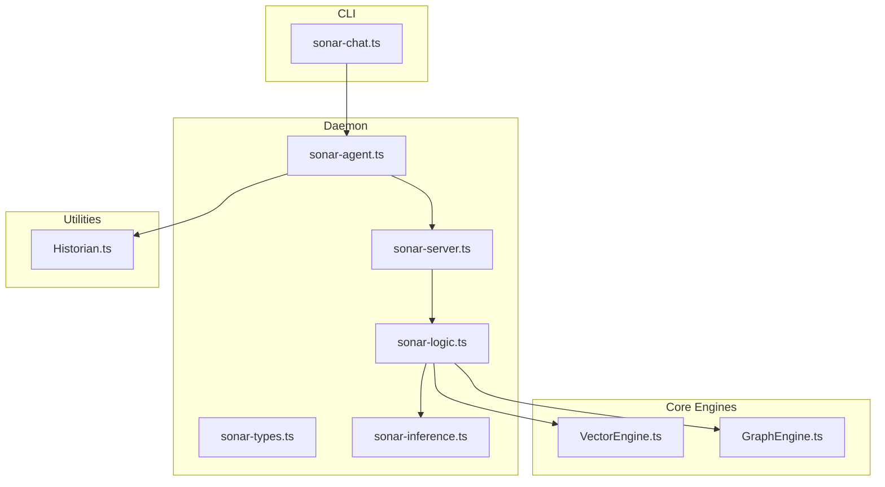
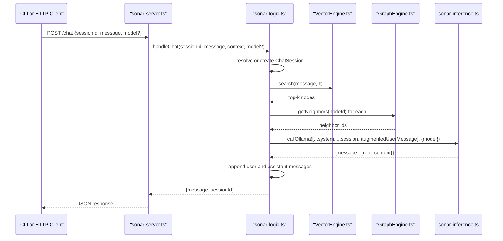
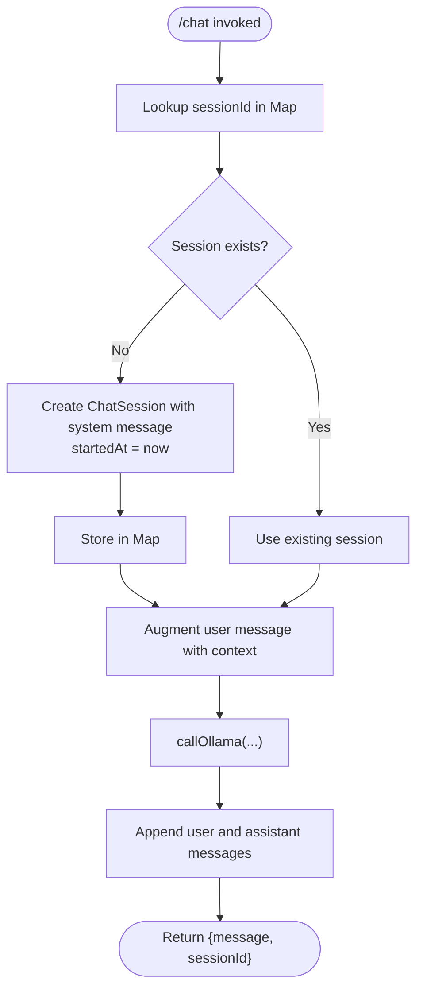
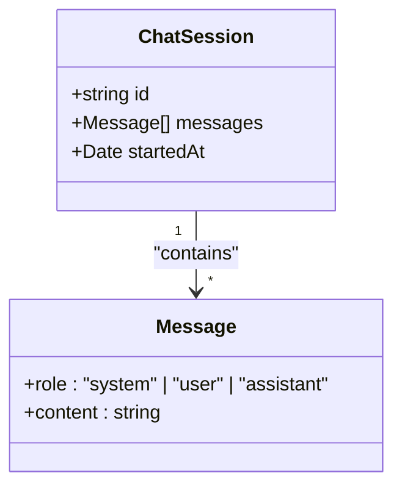
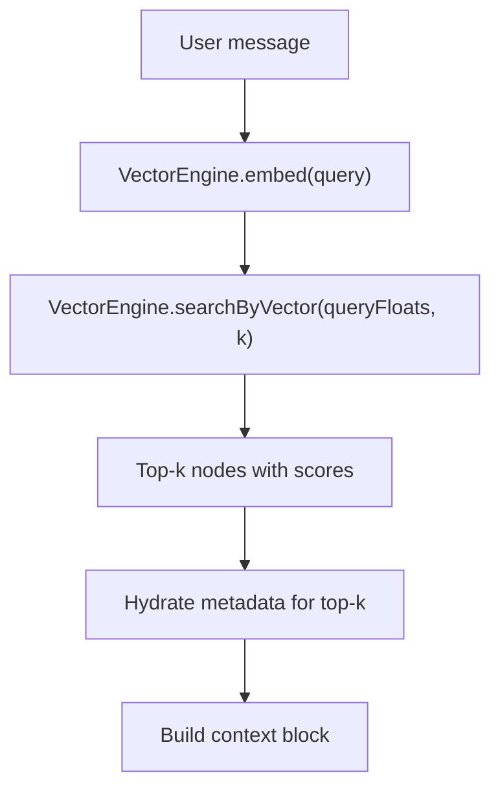
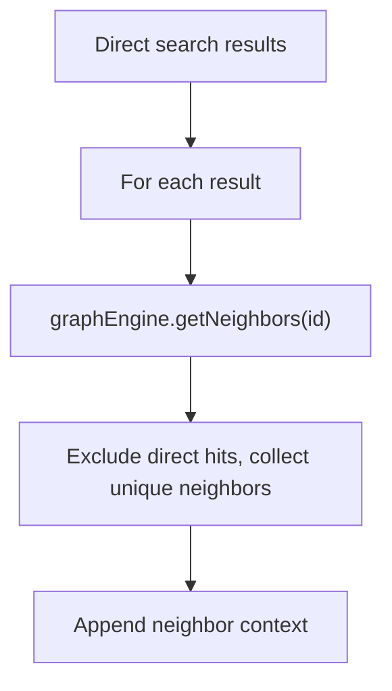
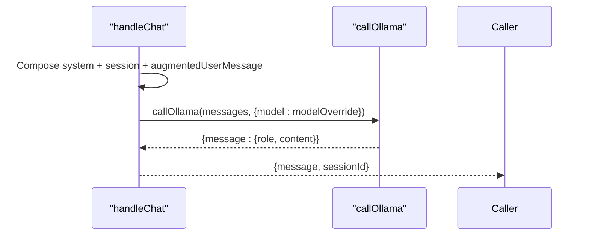
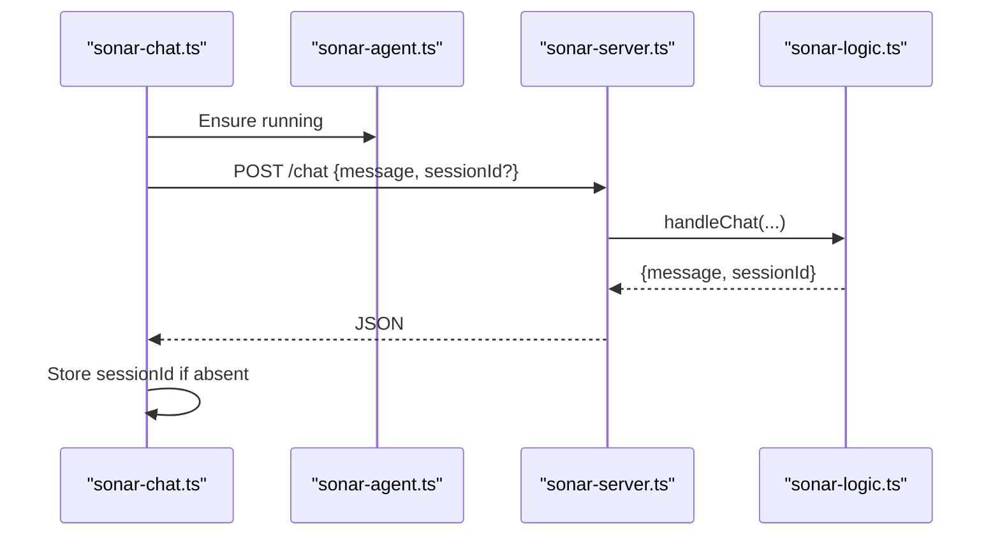
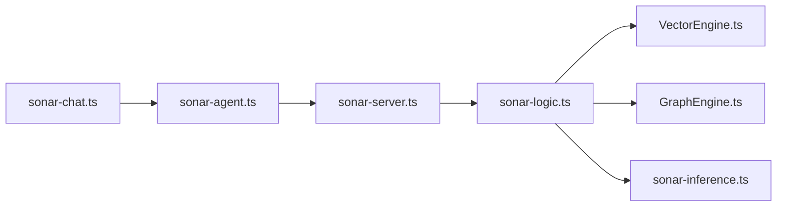

# Chat Session Management

<cite>
**Referenced Files in This Document**
- [sonar-agent.ts](file://src/daemon/sonar-agent.ts)
- [sonar-server.ts](file://src/daemon/sonar-server.ts)
- [sonar-logic.ts](file://src/daemon/sonar-logic.ts)
- [sonar-types.ts](file://src/daemon/sonar-types.ts)
- [sonar-inference.ts](file://src/daemon/sonar-inference.ts)
- [sonar-chat.ts](file://src/cli/sonar-chat.ts)
- [VectorEngine.ts](file://src/core/VectorEngine.ts)
- [GraphEngine.ts](file://src/core/GraphEngine.ts)
- [Historian.ts](file://src/utils/Historian.ts)
</cite>

## Table of Contents
1. [Introduction](#introduction)
2. [Project Structure](#project-structure)
3. [Core Components](#core-components)
4. [Architecture Overview](#architecture-overview)
5. [Detailed Component Analysis](#detailed-component-analysis)
6. [Dependency Analysis](#dependency-analysis)
7. [Performance Considerations](#performance-considerations)
8. [Troubleshooting Guide](#troubleshooting-guide)
9. [Conclusion](#conclusion)

## Introduction
This document explains the Sonar Agent’s chat session management system. It covers the chat session lifecycle (creation, message handling, termination), context preservation mechanisms, message history management, session state tracking, and integrations with VectorEngine for context retrieval and GraphEngine for neighbor discovery. It also documents prompts, model overrides, response formatting, and error handling for chat operations.

## Project Structure
The chat system spans several modules:
- Daemon entry and HTTP server orchestration
- Chat request routing and session storage
- Inference integration with local or cloud providers
- Vector and graph engines for retrieval and exploration
- CLI chat client for interactive sessions

**Diagram sources**
- [sonar-agent.ts](file://src/daemon/sonar-agent.ts#L1-L221)
- [sonar-server.ts](file://src/daemon/sonar-server.ts#L1-L134)
- [sonar-logic.ts](file://src/daemon/sonar-logic.ts#L1-L685)
- [sonar-types.ts](file://src/daemon/sonar-types.ts#L1-L69)
- [sonar-inference.ts](file://src/daemon/sonar-inference.ts#L1-L120)
- [sonar-chat.ts](file://src/cli/sonar-chat.ts#L1-L116)
- [VectorEngine.ts](file://src/core/VectorEngine.ts#L1-L242)
- [GraphEngine.ts](file://src/core/GraphEngine.ts#L1-L314)
- [Historian.ts](file://src/utils/Historian.ts#L1-L96)

**Section sources**
- [sonar-agent.ts](file://src/daemon/sonar-agent.ts#L1-L221)
- [sonar-server.ts](file://src/daemon/sonar-server.ts#L1-L134)
- [sonar-logic.ts](file://src/daemon/sonar-logic.ts#L1-L685)
- [sonar-types.ts](file://src/daemon/sonar-types.ts#L1-L69)
- [sonar-inference.ts](file://src/daemon/sonar-inference.ts#L1-L120)
- [sonar-chat.ts](file://src/cli/sonar-chat.ts#L1-L116)
- [VectorEngine.ts](file://src/core/VectorEngine.ts#L1-L242)
- [GraphEngine.ts](file://src/core/GraphEngine.ts#L1-L314)
- [Historian.ts](file://src/utils/Historian.ts#L1-L96)

## Core Components
- ChatSession and Message types define the session structure and message roles.
- SonarContext carries the database, graph engine, gardener, and the in-memory session map.
- The HTTP server exposes a /chat endpoint that delegates to the chat handler.
- The chat handler manages session creation, retrieval, context augmentation, and inference.
- VectorEngine performs vector search to retrieve relevant nodes.
- GraphEngine provides neighbor discovery for related context.
- Inference integration supports local Ollama and cloud providers with model override support.
- CLI chat client demonstrates session initialization and message processing.

**Section sources**
- [sonar-types.ts](file://src/daemon/sonar-types.ts#L5-L14)
- [sonar-logic.ts](file://src/daemon/sonar-logic.ts#L19-L24)
- [sonar-server.ts](file://src/daemon/sonar-server.ts#L58-L67)
- [sonar-logic.ts](file://src/daemon/sonar-logic.ts#L104-L179)
- [VectorEngine.ts](file://src/core/VectorEngine.ts#L76-L242)
- [GraphEngine.ts](file://src/core/GraphEngine.ts#L105-L108)
- [sonar-inference.ts](file://src/daemon/sonar-inference.ts#L19-L119)
- [sonar-chat.ts](file://src/cli/sonar-chat.ts#L5-L116)

## Architecture Overview
The chat flow begins at the CLI or HTTP endpoint, routes through the server, and executes in the logic module. The handler augments the user message with retrieved context from the vector engine and graph engine, then calls the inference provider.

**Diagram sources**
- [sonar-server.ts](file://src/daemon/sonar-server.ts#L58-L67)
- [sonar-logic.ts](file://src/daemon/sonar-logic.ts#L104-L179)
- [VectorEngine.ts](file://src/core/VectorEngine.ts#L227-L240)
- [GraphEngine.ts](file://src/core/GraphEngine.ts#L105-L108)
- [sonar-inference.ts](file://src/daemon/sonar-inference.ts#L19-L119)

## Detailed Component Analysis

### Chat Session Lifecycle
- Creation: On first use of a sessionId, a new ChatSession is created with a system message and startedAt timestamp. The session is stored in the in-memory Map keyed by sessionId.
- Message Handling: Each incoming message is appended to the session history. The handler constructs an augmented prompt combining prior context and newly retrieved context.
- Termination: Sessions persist in memory for the lifetime of the daemon process. There is no explicit termination API; sessions remain until the process restarts.

**Diagram sources**
- [sonar-logic.ts](file://src/daemon/sonar-logic.ts#L114-L172)
- [sonar-types.ts](file://src/daemon/sonar-types.ts#L10-L14)

**Section sources**
- [sonar-logic.ts](file://src/daemon/sonar-logic.ts#L114-L172)
- [sonar-types.ts](file://src/daemon/sonar-types.ts#L10-L14)

### Context Preservation and Message History
- Message history is maintained per session as an ordered array of Message objects.
- The system message establishes the assistant role and includes a date prompt.
- Each turn appends the user message and the assistant response to the session history.

**Diagram sources**
- [sonar-types.ts](file://src/daemon/sonar-types.ts#L5-L14)

**Section sources**
- [sonar-types.ts](file://src/daemon/sonar-types.ts#L5-L14)
- [sonar-logic.ts](file://src/daemon/sonar-logic.ts#L116-L127)
- [sonar-logic.ts](file://src/daemon/sonar-logic.ts#L171-L172)

### VectorEngine Integration for Context Retrieval
- VectorEngine embeds queries and performs dot-product similarity against stored unit vectors.
- It returns top-k nodes with metadata placeholders hydrated on demand.
- The chat handler uses search results to build an augmented context block.

**Diagram sources**
- [VectorEngine.ts](file://src/core/VectorEngine.ts#L115-L139)
- [VectorEngine.ts](file://src/core/VectorEngine.ts#L159-L240)
- [sonar-logic.ts](file://src/daemon/sonar-logic.ts#L132-L161)

**Section sources**
- [VectorEngine.ts](file://src/core/VectorEngine.ts#L76-L242)
- [sonar-logic.ts](file://src/daemon/sonar-logic.ts#L132-L161)

### GraphEngine Integration for Neighbor Discovery
- For each direct hit, the handler queries neighbors to surface related context.
- Neighbors are deduplicated and capped to limit context breadth.

**Diagram sources**
- [sonar-logic.ts](file://src/daemon/sonar-logic.ts#L136-L143)
- [GraphEngine.ts](file://src/core/GraphEngine.ts#L105-L108)

**Section sources**
- [sonar-logic.ts](file://src/daemon/sonar-logic.ts#L136-L161)
- [GraphEngine.ts](file://src/core/GraphEngine.ts#L105-L108)

### Chat System Prompts and Model Overrides
- System prompt: Defines the assistant role and includes the current date.
- User prompt: Original user message plus an augmented context block built from vector search and graph neighbors.
- Model override: The handler accepts an optional model parameter that is passed to the inference call.
- Response formatting: The inference response is returned as a Message object with role and content.

**Diagram sources**
- [sonar-logic.ts](file://src/daemon/sonar-logic.ts#L118-L127)
- [sonar-logic.ts](file://src/daemon/sonar-logic.ts#L163-L169)
- [sonar-inference.ts](file://src/daemon/sonar-inference.ts#L19-L119)

**Section sources**
- [sonar-logic.ts](file://src/daemon/sonar-logic.ts#L118-L127)
- [sonar-logic.ts](file://src/daemon/sonar-logic.ts#L163-L169)
- [sonar-inference.ts](file://src/daemon/sonar-inference.ts#L32-L38)

### HTTP API and CLI Integration
- HTTP endpoint: POST /chat expects { sessionId, message, model? } and returns { message, sessionId }.
- CLI client: Starts the daemon if needed, sends requests, and prints responses. It initializes sessionId on first response.

**Diagram sources**
- [sonar-chat.ts](file://src/cli/sonar-chat.ts#L5-L116)
- [sonar-server.ts](file://src/daemon/sonar-server.ts#L58-L67)
- [sonar-logic.ts](file://src/daemon/sonar-logic.ts#L104-L179)
- [sonar-agent.ts](file://src/daemon/sonar-agent.ts#L123-L133)

**Section sources**
- [sonar-server.ts](file://src/daemon/sonar-server.ts#L58-L67)
- [sonar-chat.ts](file://src/cli/sonar-chat.ts#L5-L116)
- [sonar-agent.ts](file://src/daemon/sonar-agent.ts#L123-L133)

### Session Initialization Examples
- First request without sessionId: The handler creates a new session with a system message and returns the new sessionId.
- Subsequent requests with sessionId: The handler retrieves the existing session and continues the conversation.

**Section sources**
- [sonar-logic.ts](file://src/daemon/sonar-logic.ts#L114-L128)
- [sonar-chat.ts](file://src/cli/sonar-chat.ts#L92-L94)

### Message Processing Workflows
- Retrieve or create session
- Perform vector search and neighbor discovery
- Construct augmented prompt
- Call inference with optional model override
- Append messages to session
- Return response

**Section sources**
- [sonar-logic.ts](file://src/daemon/sonar-logic.ts#L104-L179)

### Error Handling for Chat Operations
- Availability checks: If inference is unavailable, the handler throws an error.
- VectorEngine errors: Embedding failures return null; search handles zero vectors gracefully.
- Inference errors: HTTP errors and invalid response formats are logged and rethrown.
- CLI errors: Network issues and API errors are caught and printed.

**Section sources**
- [sonar-logic.ts](file://src/daemon/sonar-logic.ts#L110-L112)
- [VectorEngine.ts](file://src/core/VectorEngine.ts#L135-L138)
- [sonar-inference.ts](file://src/daemon/sonar-inference.ts#L94-L97)
- [sonar-inference.ts](file://src/daemon/sonar-inference.ts#L114-L118)
- [sonar-chat.ts](file://src/cli/sonar-chat.ts#L101-L108)

## Dependency Analysis
- sonar-agent.ts orchestrates the daemon, initializes engines, and exposes the HTTP server with a shared Map of sessions.
- sonar-server.ts defines the /chat route and delegates to sonar-logic.ts.
- sonar-logic.ts depends on VectorEngine for retrieval, GraphEngine for neighbors, and sonar-inference.ts for model calls.
- sonar-chat.ts is a thin client that exercises the HTTP API.

**Diagram sources**
- [sonar-agent.ts](file://src/daemon/sonar-agent.ts#L123-L133)
- [sonar-server.ts](file://src/daemon/sonar-server.ts#L58-L67)
- [sonar-logic.ts](file://src/daemon/sonar-logic.ts#L104-L179)
- [VectorEngine.ts](file://src/core/VectorEngine.ts#L76-L242)
- [GraphEngine.ts](file://src/core/GraphEngine.ts#L39-L100)
- [sonar-inference.ts](file://src/daemon/sonar-inference.ts#L19-L119)
- [sonar-chat.ts](file://src/cli/sonar-chat.ts#L5-L116)

**Section sources**
- [sonar-agent.ts](file://src/daemon/sonar-agent.ts#L123-L133)
- [sonar-server.ts](file://src/daemon/sonar-server.ts#L58-L67)
- [sonar-logic.ts](file://src/daemon/sonar-logic.ts#L104-L179)
- [sonar-inference.ts](file://src/daemon/sonar-inference.ts#L19-L119)

## Performance Considerations
- VectorEngine search loads only IDs and embeddings initially, computes scores in-memory, sorts, and hydrates metadata for top-k results to minimize IO.
- GraphEngine neighbor queries are O(k) per node, with deduplication to avoid redundant work.
- Inference calls are synchronous; consider batching or streaming for high-throughput scenarios.
- CLI client displays a “thinking” indicator; network latency dominates end-to-end time.

[No sources needed since this section provides general guidance]

## Troubleshooting Guide
Common issues and resolutions:
- Inference unavailable: Ensure Ollama is reachable or configure cloud provider with API key. The handler throws if inference is not available.
- Empty or low-quality context: Verify vector embeddings exist and search returns results; confirm graph edges exist for neighbor discovery.
- Model mismatch: Provide model override via the model field in the request; the handler forwards it to the inference call.
- CLI connectivity: Confirm the daemon is running and listening on the configured port; the CLI starts the daemon if needed.

**Section sources**
- [sonar-logic.ts](file://src/daemon/sonar-logic.ts#L110-L112)
- [sonar-inference.ts](file://src/daemon/sonar-inference.ts#L26-L54)
- [sonar-chat.ts](file://src/cli/sonar-chat.ts#L9-L22)

## Conclusion
The Sonar Agent’s chat system provides a robust, stateful conversational interface integrated with vector search and graph exploration. Sessions are preserved in memory, context is augmented from both semantic similarity and structural relationships, and model selection is flexible. The modular design enables straightforward extension and maintenance.