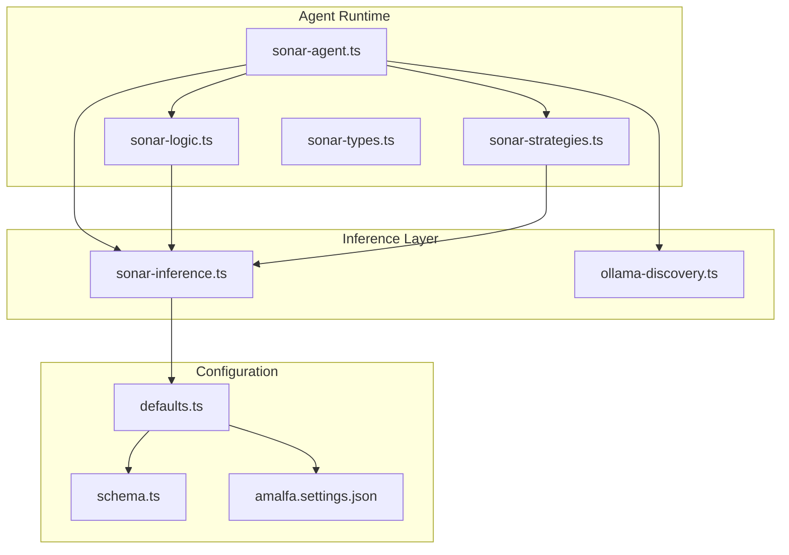
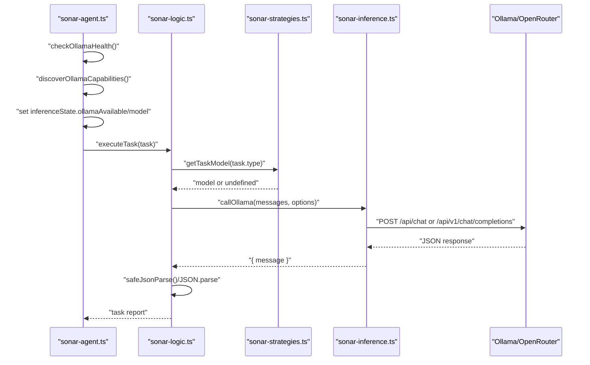
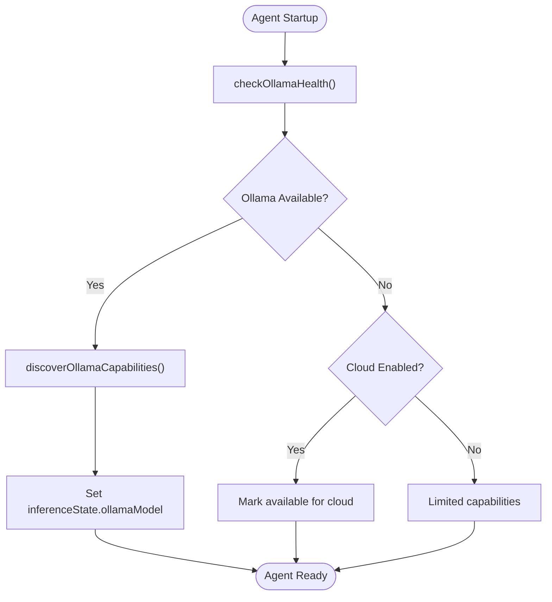
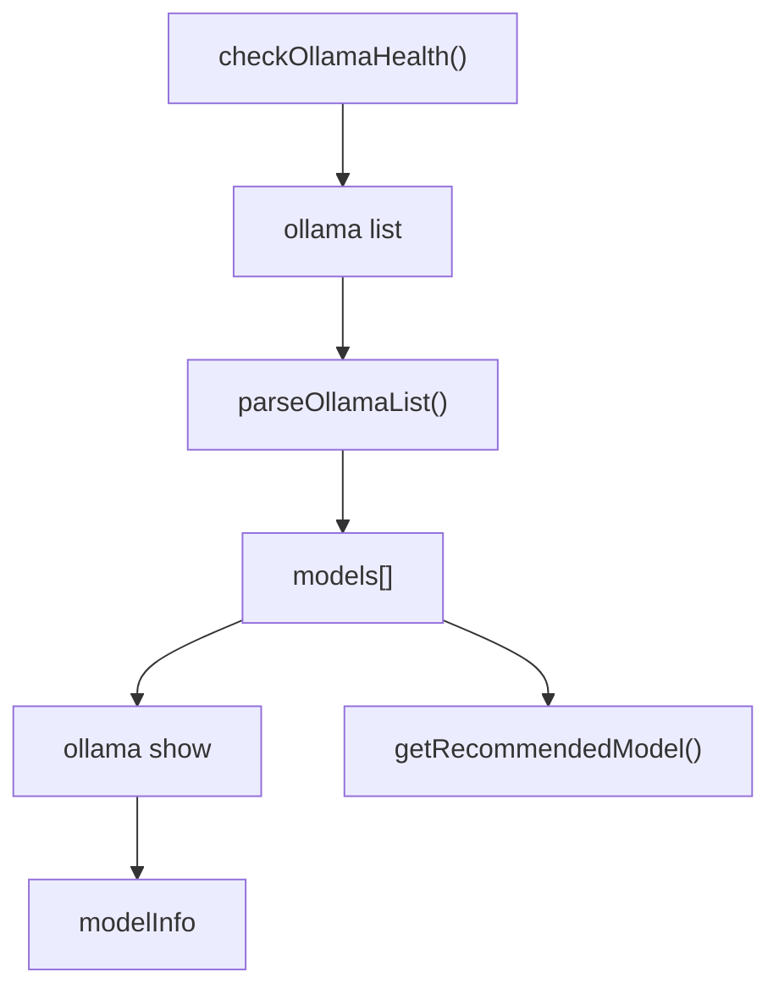
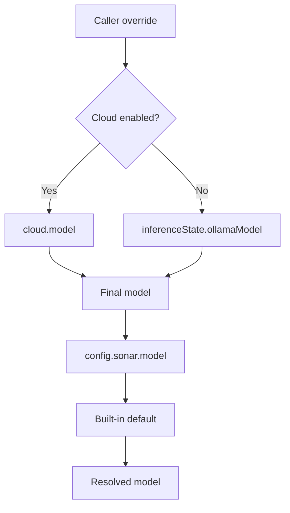
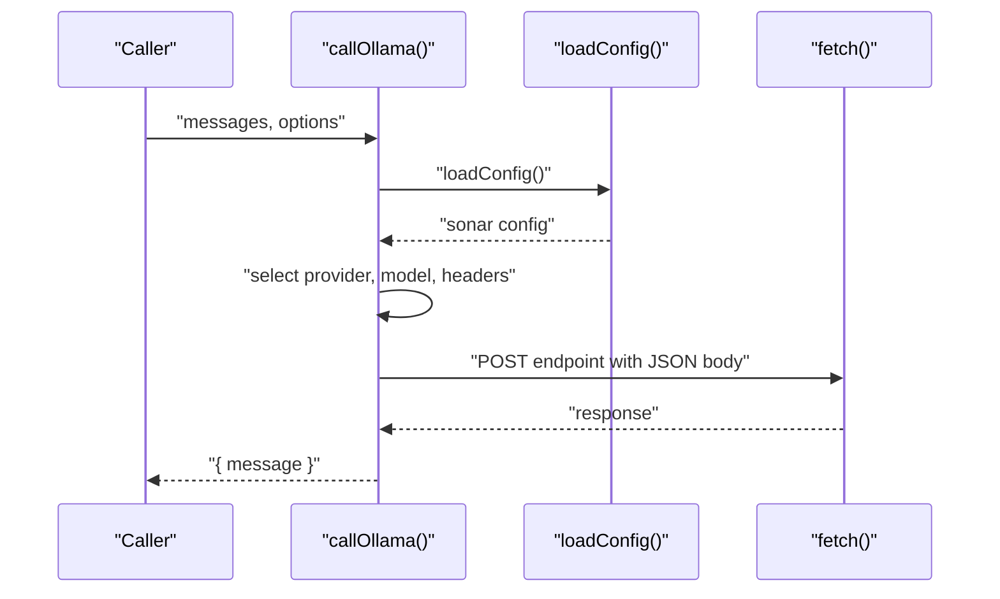
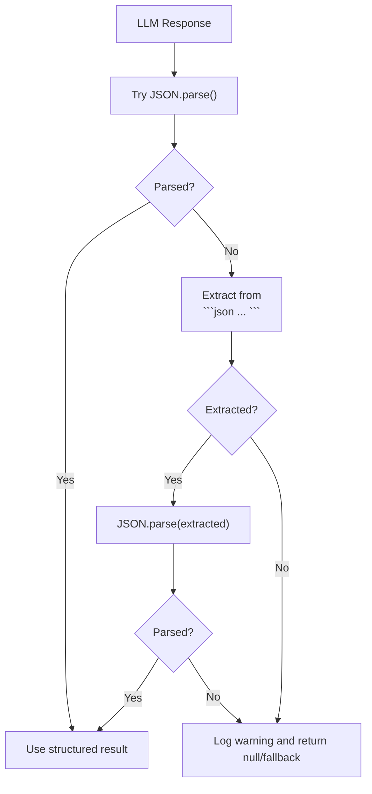
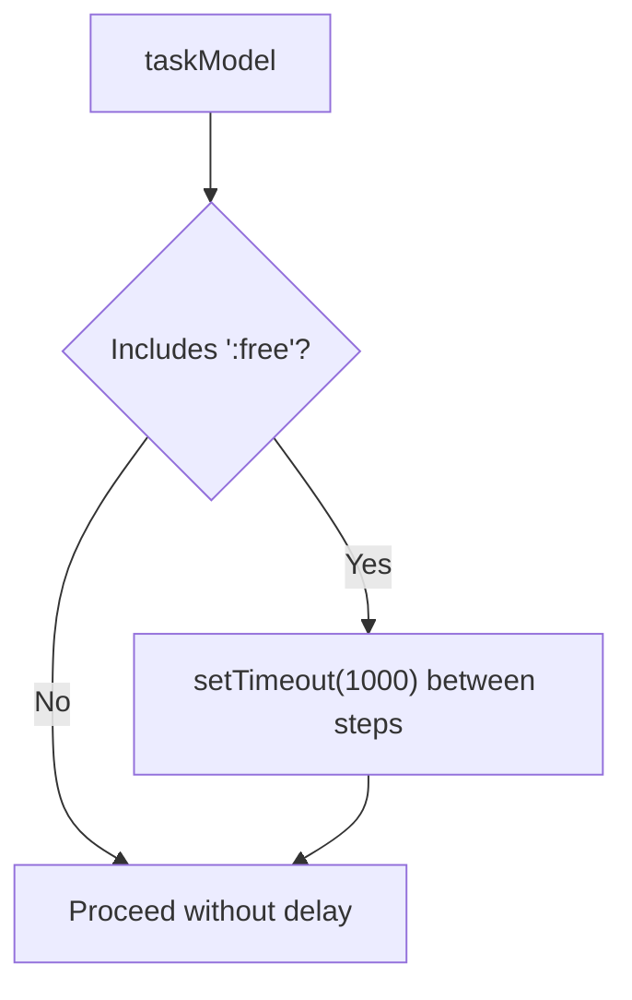
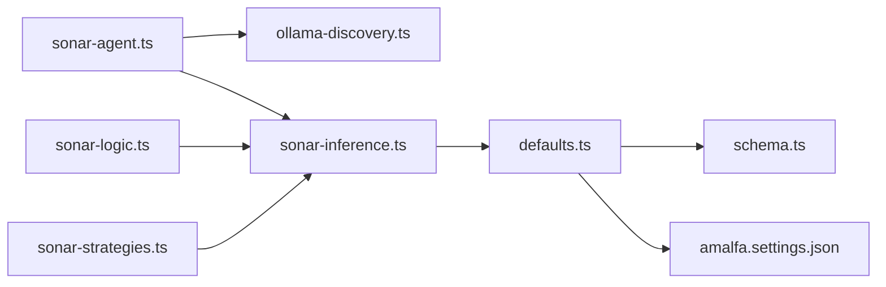

# Model Selection and Inference Strategies

<cite>
**Referenced Files in This Document**
- [sonar-agent.ts](file://src/daemon/sonar-agent.ts)
- [sonar-inference.ts](file://src/daemon/sonar-inference.ts)
- [sonar-strategies.ts](file://src/daemon/sonar-strategies.ts)
- [sonar-logic.ts](file://src/daemon/sonar-logic.ts)
- [sonar-types.ts](file://src/daemon/sonar-types.ts)
- [defaults.ts](file://src/config/defaults.ts)
- [schema.ts](file://src/config/schema.ts)
- [amalfa.settings.json](file://amalfa.settings.json)
- [ollama-discovery.ts](file://src/utils/ollama-discovery.ts)
</cite>

## Table of Contents
1. [Introduction](#introduction)
2. [Project Structure](#project-structure)
3. [Core Components](#core-components)
4. [Architecture Overview](#architecture-overview)
5. [Detailed Component Analysis](#detailed-component-analysis)
6. [Dependency Analysis](#dependency-analysis)
7. [Performance Considerations](#performance-considerations)
8. [Troubleshooting Guide](#troubleshooting-guide)
9. [Conclusion](#conclusion)

## Introduction
This document explains how the Sonar Agent selects models and executes inference across tasks. It covers inference state management, model availability checks, fallback mechanisms, model type selection for different tasks, temperature and format settings, response parsing strategies, and safe JSON parsing for markdown-formatted responses. It also provides examples of model configuration, inference execution, and error handling tailored to free tier throttling and premium model selection.

## Project Structure
The Sonar Agent’s model selection and inference logic is implemented across several focused modules:
- Agent orchestration and lifecycle
- Inference engine and state
- Task strategies and logic
- Configuration loading and schema
- Ollama discovery utilities

**Diagram sources**
- [sonar-agent.ts](file://src/daemon/sonar-agent.ts#L1-L221)
- [sonar-logic.ts](file://src/daemon/sonar-logic.ts#L1-L685)
- [sonar-strategies.ts](file://src/daemon/sonar-strategies.ts#L1-L187)
- [sonar-inference.ts](file://src/daemon/sonar-inference.ts#L1-L120)
- [ollama-discovery.ts](file://src/utils/ollama-discovery.ts#L1-L180)
- [defaults.ts](file://src/config/defaults.ts#L1-L143)
- [schema.ts](file://src/config/schema.ts#L1-L298)
- [amalfa.settings.json](file://amalfa.settings.json#L1-L96)

**Section sources**
- [sonar-agent.ts](file://src/daemon/sonar-agent.ts#L1-L221)
- [sonar-inference.ts](file://src/daemon/sonar-inference.ts#L1-L120)
- [sonar-strategies.ts](file://src/daemon/sonar-strategies.ts#L1-L187)
- [sonar-logic.ts](file://src/daemon/sonar-logic.ts#L1-L685)
- [defaults.ts](file://src/config/defaults.ts#L1-L143)
- [schema.ts](file://src/config/schema.ts#L1-L298)
- [amalfa.settings.json](file://amalfa.settings.json#L1-L96)
- [ollama-discovery.ts](file://src/utils/ollama-discovery.ts#L1-L180)

## Core Components
- Inference state management: Tracks whether Ollama is available and stores the discovered model.
- Model selection: Chooses models per task type and configuration, with support for cloud providers.
- Inference execution: Calls Ollama or OpenRouter with appropriate headers, model, and options.
- Safe parsing: Robust JSON parsing that tolerates markdown code blocks and partial content.
- Free tier throttling: Delays between steps when using free-tier model identifiers.

Key responsibilities:
- Orchestrate tasks and route to appropriate strategies.
- Manage model availability and fallback to cloud when local is unavailable.
- Apply task-specific temperature and format settings.
- Parse structured outputs and apply throttling for rate-limited models.

**Section sources**
- [sonar-agent.ts](file://src/daemon/sonar-agent.ts#L80-L116)
- [sonar-inference.ts](file://src/daemon/sonar-inference.ts#L10-L13)
- [sonar-strategies.ts](file://src/daemon/sonar-strategies.ts#L10-L28)
- [sonar-logic.ts](file://src/daemon/sonar-logic.ts#L669-L684)

## Architecture Overview
The Sonar Agent initializes inference state, discovers local models, and routes tasks to specialized strategies. Inference is executed via a unified call that supports local Ollama and OpenRouter. Responses are parsed with safe JSON handling, and free-tier throttling is applied when indicated by the model identifier.

**Diagram sources**
- [sonar-agent.ts](file://src/daemon/sonar-agent.ts#L80-L116)
- [sonar-logic.ts](file://src/daemon/sonar-logic.ts#L184-L217)
- [sonar-strategies.ts](file://src/daemon/sonar-strategies.ts#L10-L28)
- [sonar-inference.ts](file://src/daemon/sonar-inference.ts#L19-L119)

## Detailed Component Analysis

### Inference State Management
- Maintains availability and model name for local inference.
- On startup, sets availability based on health checks and discovers models if available.
- Falls back to cloud availability when configured.

**Diagram sources**
- [sonar-agent.ts](file://src/daemon/sonar-agent.ts#L80-L96)
- [ollama-discovery.ts](file://src/utils/ollama-discovery.ts#L161-L168)
- [ollama-discovery.ts](file://src/utils/ollama-discovery.ts#L83-L155)

**Section sources**
- [sonar-agent.ts](file://src/daemon/sonar-agent.ts#L80-L96)
- [sonar-inference.ts](file://src/daemon/sonar-inference.ts#L10-L13)
- [ollama-discovery.ts](file://src/utils/ollama-discovery.ts#L83-L155)

### Model Availability Checking and Discovery
- Health check uses a CLI command to verify Ollama readiness.
- Capability discovery parses model lists and optional model info.
- Recommended model is derived from the first discovered model.

**Diagram sources**
- [ollama-discovery.ts](file://src/utils/ollama-discovery.ts#L161-L168)
- [ollama-discovery.ts](file://src/utils/ollama-discovery.ts#L34-L56)
- [ollama-discovery.ts](file://src/utils/ollama-discovery.ts#L118-L128)
- [ollama-discovery.ts](file://src/utils/ollama-discovery.ts#L173-L179)

**Section sources**
- [ollama-discovery.ts](file://src/utils/ollama-discovery.ts#L83-L155)
- [sonar-agent.ts](file://src/daemon/sonar-agent.ts#L82-L96)

### Model Selection and Routing
- Task-based model selection for cloud providers (OpenRouter).
- Fallback chain for model resolution:
  - Explicit override from caller
  - Cloud model (when enabled)
  - Discovered model
  - Configured default
  - Built-in default

**Diagram sources**
- [sonar-strategies.ts](file://src/daemon/sonar-strategies.ts#L31-L38)
- [sonar-inference.ts](file://src/daemon/sonar-inference.ts#L31-L38)

**Section sources**
- [sonar-strategies.ts](file://src/daemon/sonar-strategies.ts#L10-L28)
- [sonar-inference.ts](file://src/daemon/sonar-inference.ts#L31-L38)

### Inference Execution and Options
- Unified call supports local Ollama and OpenRouter.
- Headers and endpoint selection depend on provider.
- Optional API key preference: environment variable over configuration.
- Site headers required for OpenRouter tracking.

**Diagram sources**
- [sonar-inference.ts](file://src/daemon/sonar-inference.ts#L19-L119)
- [defaults.ts](file://src/config/defaults.ts#L84-L139)

**Section sources**
- [sonar-inference.ts](file://src/daemon/sonar-inference.ts#L19-L119)
- [defaults.ts](file://src/config/defaults.ts#L84-L139)

### Temperature and Format Specifications
- Task-specific temperature and format are applied per strategy:
  - Judge relationship: low temperature, JSON format
  - Community synthesis: moderate temperature, JSON format
  - Chronos date extraction: zero temperature, plain text
  - Search analysis, re-ranking, context extraction: low to moderate temperature, JSON where applicable
- Chat and research tasks pass through model overrides without forcing format.

Examples by file reference:
- Judge relationship: [temperature and format](file://src/daemon/sonar-strategies.ts#L67-L72)
- Community synthesis: [temperature and format](file://src/daemon/sonar-strategies.ts#L115-L120)
- Chronos date extraction: [temperature](file://src/daemon/sonar-strategies.ts#L176)
- Search analysis: [format](file://src/daemon/sonar-logic.ts#L202)
- Re-ranking: [format](file://src/daemon/sonar-logic.ts#L254)
- Chat and research: [no forced format](file://src/daemon/sonar-logic.ts#L168), (file://src/daemon/sonar-logic.ts#L528)

**Section sources**
- [sonar-strategies.ts](file://src/daemon/sonar-strategies.ts#L67-L72)
- [sonar-strategies.ts](file://src/daemon/sonar-strategies.ts#L115-L120)
- [sonar-strategies.ts](file://src/daemon/sonar-strategies.ts#L176)
- [sonar-logic.ts](file://src/daemon/sonar-logic.ts#L202)
- [sonar-logic.ts](file://src/daemon/sonar-logic.ts#L254)
- [sonar-logic.ts](file://src/daemon/sonar-logic.ts#L168)
- [sonar-logic.ts](file://src/daemon/sonar-logic.ts#L528)

### Response Parsing Strategies and Safe JSON Parsing
- Structured tasks expect JSON; parsers handle raw JSON or markdown-wrapped JSON.
- Safe parser extracts JSON from fenced code blocks or nearest braces.
- Fallbacks ensure graceful degradation when parsing fails.

**Diagram sources**
- [sonar-logic.ts](file://src/daemon/sonar-logic.ts#L669-L684)
- [sonar-logic.ts](file://src/daemon/sonar-logic.ts#L123-L134)
- [sonar-logic.ts](file://src/daemon/sonar-logic.ts#L258-L271)

**Section sources**
- [sonar-logic.ts](file://src/daemon/sonar-logic.ts#L669-L684)
- [sonar-logic.ts](file://src/daemon/sonar-logic.ts#L123-L134)
- [sonar-logic.ts](file://src/daemon/sonar-logic.ts#L258-L271)

### Free Tier Throttling and Premium Model Selection
- Free tier model identifiers are detected by suffix in the model string.
- Garden and research strategies pause between steps when using free-tier models.
- This mitigates rate limits and avoids API penalties.

**Diagram sources**
- [sonar-logic.ts](file://src/daemon/sonar-logic.ts#L427-L428)
- [sonar-logic.ts](file://src/daemon/sonar-logic.ts#L451-L452)
- [sonar-logic.ts](file://src/daemon/sonar-logic.ts#L606-L607)

**Section sources**
- [sonar-logic.ts](file://src/daemon/sonar-logic.ts#L427-L428)
- [sonar-logic.ts](file://src/daemon/sonar-logic.ts#L451-L452)
- [sonar-logic.ts](file://src/daemon/sonar-logic.ts#L606-L607)

### Examples: Model Configuration, Inference Execution, and Error Handling
- Configuration example: [Sonar section](file://amalfa.settings.json#L48-L81)
- Configuration schema defaults: [Sonar schema](file://src/config/schema.ts#L54-L88)
- Inference call with provider selection: [callOllama](file://src/daemon/sonar-inference.ts#L66-L85)
- Error handling in inference: [catch block](file://src/daemon/sonar-inference.ts#L114-L118)
- Safe JSON parsing usage: [search analysis](file://src/daemon/sonar-logic.ts#L205-L213), [re-ranking](file://src/daemon/sonar-logic.ts#L259-L271)

**Section sources**
- [amalfa.settings.json](file://amalfa.settings.json#L48-L81)
- [schema.ts](file://src/config/schema.ts#L54-L88)
- [sonar-inference.ts](file://src/daemon/sonar-inference.ts#L66-L85)
- [sonar-inference.ts](file://src/daemon/sonar-inference.ts#L114-L118)
- [sonar-logic.ts](file://src/daemon/sonar-logic.ts#L205-L213)
- [sonar-logic.ts](file://src/daemon/sonar-logic.ts#L259-L271)

## Dependency Analysis
- Agent depends on discovery utilities to initialize inference state.
- Strategies depend on inference for model-specific tasks.
- Logic orchestrates tasks and applies safe parsing.
- Inference depends on configuration for provider and model resolution.

**Diagram sources**
- [sonar-agent.ts](file://src/daemon/sonar-agent.ts#L20-L33)
- [sonar-logic.ts](file://src/daemon/sonar-logic.ts#L9-L14)
- [sonar-strategies.ts](file://src/daemon/sonar-strategies.ts#L3)
- [sonar-inference.ts](file://src/daemon/sonar-inference.ts#L1-L5)
- [defaults.ts](file://src/config/defaults.ts#L84-L139)

**Section sources**
- [sonar-agent.ts](file://src/daemon/sonar-agent.ts#L20-L33)
- [sonar-logic.ts](file://src/daemon/sonar-logic.ts#L9-L14)
- [sonar-strategies.ts](file://src/daemon/sonar-strategies.ts#L3)
- [sonar-inference.ts](file://src/daemon/sonar-inference.ts#L1-L5)
- [defaults.ts](file://src/config/defaults.ts#L84-L139)

## Performance Considerations
- Prefer local Ollama for latency-sensitive tasks when available.
- Use JSON format for structured tasks to reduce parsing overhead.
- Apply throttling for free-tier models to avoid rate limits.
- Limit payload sizes by slicing content appropriately in prompts.
- Batch operations (e.g., metadata enhancement) use concurrent promises to improve throughput.

## Troubleshooting Guide
Common issues and resolutions:
- Ollama not available:
  - Verify installation and model presence; use discovery utilities to confirm.
  - Enable cloud inference if local is unreachable.
- Missing API key for OpenRouter:
  - Set environment variable or configure API key in settings; provider headers are required for tracking.
- JSON parsing failures:
  - Use safe JSON parsing helpers; ensure tasks request JSON format.
- Rate limiting on free tier:
  - Detect free-tier model identifiers and apply delays between steps.

**Section sources**
- [sonar-agent.ts](file://src/daemon/sonar-agent.ts#L91-L96)
- [sonar-inference.ts](file://src/daemon/sonar-inference.ts#L44-L60)
- [sonar-logic.ts](file://src/daemon/sonar-logic.ts#L669-L684)
- [sonar-logic.ts](file://src/daemon/sonar-logic.ts#L427-L428)

## Conclusion
The Sonar Agent implements a robust, layered approach to model selection and inference:
- Inference state initialization and discovery ensure reliable operation.
- A flexible model resolution chain accommodates local and cloud providers.
- Task-specific temperature and format settings optimize output quality.
- Safe JSON parsing and markdown tolerance improve resilience.
- Free-tier throttling prevents rate-limit penalties while maintaining progress.