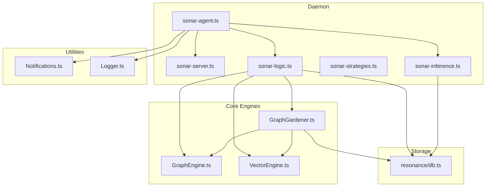
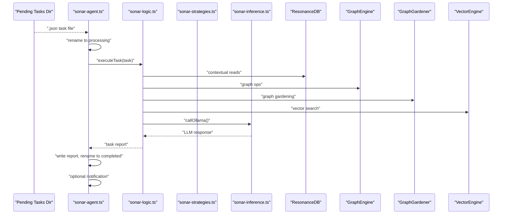
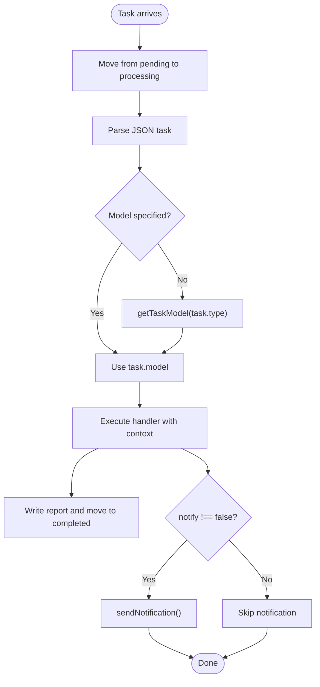
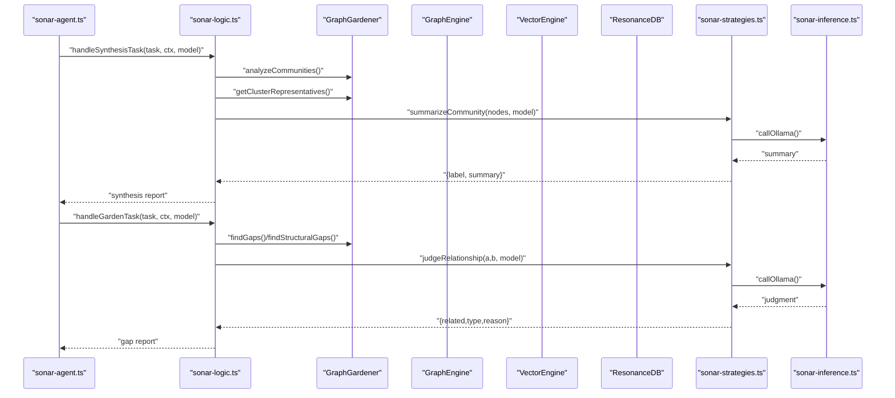
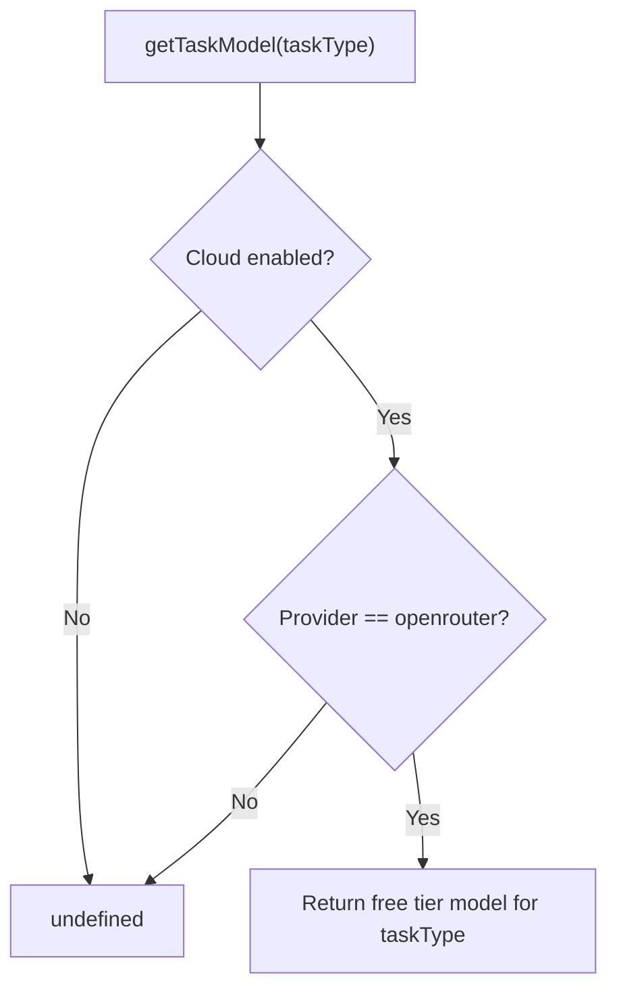
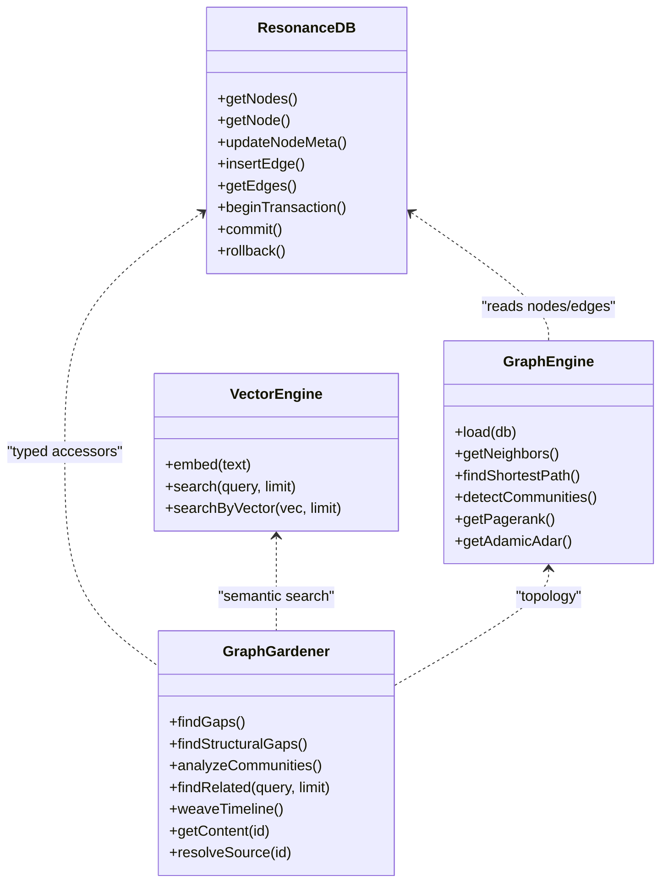
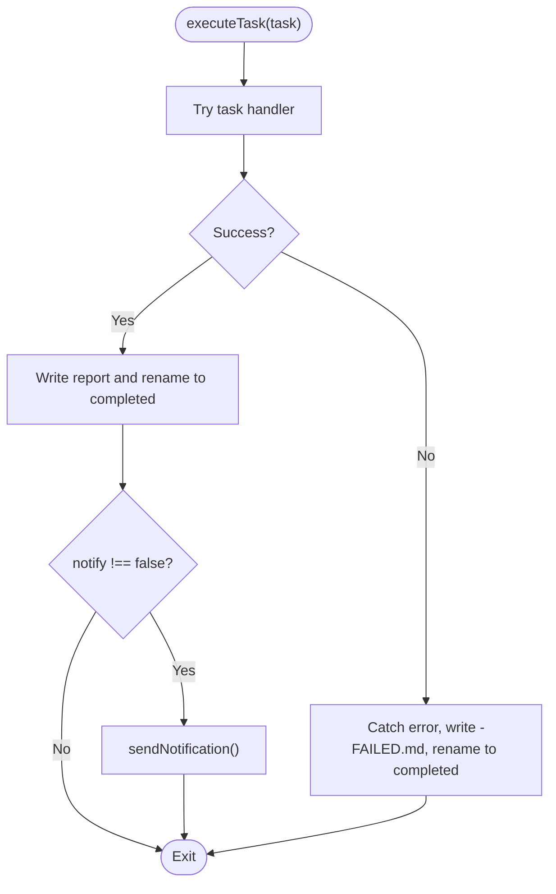
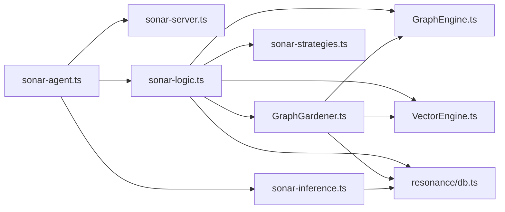

# Task Execution Pipeline

<cite>
**Referenced Files in This Document**
- [sonar-agent.ts](file://src/daemon/sonar-agent.ts)
- [sonar-logic.ts](file://src/daemon/sonar-logic.ts)
- [sonar-strategies.ts](file://src/daemon/sonar-strategies.ts)
- [sonar-inference.ts](file://src/daemon/sonar-inference.ts)
- [sonar-server.ts](file://src/daemon/sonar-server.ts)
- [sonar-types.ts](file://src/daemon/sonar-types.ts)
- [GraphEngine.ts](file://src/core/GraphEngine.ts)
- [GraphGardener.ts](file://src/core/GraphGardener.ts)
- [VectorEngine.ts](file://src/core/VectorEngine.ts)
- [db.ts](file://src/resonance/db.ts)
- [Notifications.ts](file://src/utils/Notifications.ts)
- [Logger.ts](file://src/utils/Logger.ts)
</cite>

## Table of Contents
1. [Introduction](#introduction)
2. [Project Structure](#project-structure)
3. [Core Components](#core-components)
4. [Architecture Overview](#architecture-overview)
5. [Detailed Component Analysis](#detailed-component-analysis)
6. [Dependency Analysis](#dependency-analysis)
7. [Performance Considerations](#performance-considerations)
8. [Troubleshooting Guide](#troubleshooting-guide)
9. [Conclusion](#conclusion)

## Introduction
This document explains the Sonar Agent’s task execution pipeline end-to-end. It covers how tasks are created, routed, contextualized, executed, and reported, along with the integration points to GraphEngine, ResonanceDB, and VectorEngine. It also documents model selection strategies, execution environments, error handling, retries, and notifications. The goal is to provide both a high-level understanding and code-level insights for developers and operators.

## Project Structure
The Sonar Agent is implemented as a Bun-based daemon with a modular architecture:
- Orchestrator and task watcher: [sonar-agent.ts](file://src/daemon/sonar-agent.ts)
- Task logic and orchestration: [sonar-logic.ts](file://src/daemon/sonar-logic.ts)
- Strategies for routing and LLM tasks: [sonar-strategies.ts](file://src/daemon/sonar-strategies.ts)
- Inference provider abstraction: [sonar-inference.ts](file://src/daemon/sonar-inference.ts)
- HTTP API surface: [sonar-server.ts](file://src/daemon/sonar-server.ts)
- Type definitions: [sonar-types.ts](file://src/daemon/sonar-types.ts)
- Core graph engine: [GraphEngine.ts](file://src/core/GraphEngine.ts)
- Graph gardening utilities: [GraphGardener.ts](file://src/core/GraphGardener.ts)
- Vector search engine: [VectorEngine.ts](file://src/core/VectorEngine.ts)
- ResonanceDB graph storage: [db.ts](file://src/resonance/db.ts)
- Notifications and logging utilities: [Notifications.ts](file://src/utils/Notifications.ts), [Logger.ts](file://src/utils/Logger.ts)

**Diagram sources**
- [sonar-agent.ts](file://src/daemon/sonar-agent.ts#L1-L221)
- [sonar-server.ts](file://src/daemon/sonar-server.ts#L1-L134)
- [sonar-logic.ts](file://src/daemon/sonar-logic.ts#L1-L685)
- [sonar-strategies.ts](file://src/daemon/sonar-strategies.ts#L1-L187)
- [sonar-inference.ts](file://src/daemon/sonar-inference.ts#L1-L120)
- [GraphEngine.ts](file://src/core/GraphEngine.ts#L1-L314)
- [GraphGardener.ts](file://src/core/GraphGardener.ts#L1-L270)
- [VectorEngine.ts](file://src/core/VectorEngine.ts#L1-L242)
- [db.ts](file://src/resonance/db.ts#L1-L488)
- [Notifications.ts](file://src/utils/Notifications.ts#L1-L66)
- [Logger.ts](file://src/utils/Logger.ts#L1-L23)

**Section sources**
- [sonar-agent.ts](file://src/daemon/sonar-agent.ts#L1-L221)
- [sonar-server.ts](file://src/daemon/sonar-server.ts#L1-L134)
- [sonar-logic.ts](file://src/daemon/sonar-logic.ts#L1-L685)
- [sonar-strategies.ts](file://src/daemon/sonar-strategies.ts#L1-L187)
- [sonar-inference.ts](file://src/daemon/sonar-inference.ts#L1-L120)
- [GraphEngine.ts](file://src/core/GraphEngine.ts#L1-L314)
- [GraphGardener.ts](file://src/core/GraphGardener.ts#L1-L270)
- [VectorEngine.ts](file://src/core/VectorEngine.ts#L1-L242)
- [db.ts](file://src/resonance/db.ts#L1-L488)
- [Notifications.ts](file://src/utils/Notifications.ts#L1-L66)
- [Logger.ts](file://src/utils/Logger.ts#L1-L23)

## Core Components
- Task orchestration and watcher: Loads configuration, initializes ResonanceDB, GraphEngine, and GraphGardener, and continuously monitors the pending tasks directory. On task arrival, it renames the file to processing, executes the task, writes a report, and optionally notifies the operator.
- Task logic: Implements handlers for synthesis, timeline, garden, research, and batch enhancement. Each handler builds context from ResonanceDB, GraphEngine, and GraphGardener, then invokes LLM strategies or vector/graph operations.
- Strategies: Provides model selection for tasks, semantic judgment of relationships, community synthesis, and date extraction from documents.
- Inference: Abstraction over local Ollama and cloud providers (OpenRouter), with model resolution and API key handling.
- HTTP API: Exposes endpoints for health, chat, metadata enhancement, graph stats, search analysis, reranking, and context extraction.
- Storage: ResonanceDB encapsulates SQLite/WAL-backed graph storage with typed accessors, migrations, and transaction support.
- Utilities: Logging and notifications for operational visibility.

**Section sources**
- [sonar-agent.ts](file://src/daemon/sonar-agent.ts#L60-L116)
- [sonar-logic.ts](file://src/daemon/sonar-logic.ts#L19-L24)
- [sonar-strategies.ts](file://src/daemon/sonar-strategies.ts#L10-L28)
- [sonar-inference.ts](file://src/daemon/sonar-inference.ts#L19-L119)
- [sonar-server.ts](file://src/daemon/sonar-server.ts#L24-L133)
- [db.ts](file://src/resonance/db.ts#L25-L81)
- [Notifications.ts](file://src/utils/Notifications.ts#L8-L30)
- [Logger.ts](file://src/utils/Logger.ts#L15-L22)

## Architecture Overview
The pipeline integrates file-based task queues with in-memory graph analytics and vector search, backed by a persistent graph database. The agent supports both local and cloud inference providers and emits structured reports and optional OS notifications.

**Diagram sources**
- [sonar-agent.ts](file://src/daemon/sonar-agent.ts#L138-L179)
- [sonar-logic.ts](file://src/daemon/sonar-logic.ts#L323-L364)
- [sonar-strategies.ts](file://src/daemon/sonar-strategies.ts#L34-L84)
- [sonar-inference.ts](file://src/daemon/sonar-inference.ts#L19-L119)
- [db.ts](file://src/resonance/db.ts#L194-L239)
- [GraphEngine.ts](file://src/core/GraphEngine.ts#L50-L100)
- [GraphGardener.ts](file://src/core/GraphGardener.ts#L38-L99)
- [VectorEngine.ts](file://src/core/VectorEngine.ts#L227-L241)

## Detailed Component Analysis

### Task Creation and Routing
- Task creation: Tasks are JSON files placed in a dedicated pending directory. The agent watches this directory and atomically moves files to a processing folder before execution.
- Task routing: The agent resolves the target model for a task using a strategy that selects a cloud “free tier” model when configured. If unspecified, the task handler can still override the model per call.
- Context preparation: The handler receives a context object containing ResonanceDB, GraphEngine, GraphGardener, and an in-memory chat session map.

**Diagram sources**
- [sonar-agent.ts](file://src/daemon/sonar-agent.ts#L138-L179)
- [sonar-strategies.ts](file://src/daemon/sonar-strategies.ts#L10-L28)
- [sonar-logic.ts](file://src/daemon/sonar-logic.ts#L19-L24)

**Section sources**
- [sonar-agent.ts](file://src/daemon/sonar-agent.ts#L138-L179)
- [sonar-strategies.ts](file://src/daemon/sonar-strategies.ts#L10-L28)
- [sonar-logic.ts](file://src/daemon/sonar-logic.ts#L19-L24)

### Task Handlers and Execution Environment
- Synthesis: Analyzes graph communities, selects representative nodes, and synthesizes a summary using a chosen model. Optionally writes synthesis artifacts to disk.
- Timeline: Extracts dates from nodes using a date extraction strategy and updates node metadata.
- Garden: Identifies semantic and structural gaps, judges relationships, and proposes temporal sequences. Can auto-apply changes by injecting tags into source files.
- Research: Performs iterative discovery using vector search, reading content, and graph exploration guided by an LLM planner. Includes a verification step.
- Batch enhancement: Applies metadata enhancement to a batch of nodes concurrently.

**Diagram sources**
- [sonar-logic.ts](file://src/daemon/sonar-logic.ts#L323-L364)
- [sonar-logic.ts](file://src/daemon/sonar-logic.ts#L397-L465)
- [sonar-strategies.ts](file://src/daemon/sonar-strategies.ts#L90-L142)
- [sonar-strategies.ts](file://src/daemon/sonar-strategies.ts#L34-L84)
- [sonar-inference.ts](file://src/daemon/sonar-inference.ts#L19-L119)
- [GraphGardener.ts](file://src/core/GraphGardener.ts#L38-L99)
- [GraphEngine.ts](file://src/core/GraphEngine.ts#L50-L100)
- [VectorEngine.ts](file://src/core/VectorEngine.ts#L227-L241)

**Section sources**
- [sonar-logic.ts](file://src/daemon/sonar-logic.ts#L323-L364)
- [sonar-logic.ts](file://src/daemon/sonar-logic.ts#L397-L465)
- [sonar-logic.ts](file://src/daemon/sonar-logic.ts#L469-L664)
- [sonar-strategies.ts](file://src/daemon/sonar-strategies.ts#L90-L142)
- [sonar-strategies.ts](file://src/daemon/sonar-strategies.ts#L148-L186)

### Model Selection Strategies
- Cloud tier routing: For specific task types, the strategy returns a cloud “free tier” model identifier when cloud is enabled.
- Provider abstraction: The inference layer resolves model names, sets API headers for providers, and handles endpoint differences between local Ollama and OpenRouter.

**Diagram sources**
- [sonar-strategies.ts](file://src/daemon/sonar-strategies.ts#L10-L28)
- [sonar-inference.ts](file://src/daemon/sonar-inference.ts#L19-L85)

**Section sources**
- [sonar-strategies.ts](file://src/daemon/sonar-strategies.ts#L10-L28)
- [sonar-inference.ts](file://src/daemon/sonar-inference.ts#L19-L85)

### Execution Environment Setup
- Database: ResonanceDB connects to a SQLite database in WAL mode, applies migrations, and exposes typed accessors for nodes and edges.
- Graph: GraphEngine loads a lightweight in-memory graph from the database for fast traversal and analytics.
- Vector: VectorEngine provides FAFCAS-compliant embedding generation and search using normalized vectors and dot products.
- Gardener: Orchestrates higher-level operations combining vector and graph insights to propose missing links and temporal sequences.

**Diagram sources**
- [db.ts](file://src/resonance/db.ts#L25-L81)
- [GraphEngine.ts](file://src/core/GraphEngine.ts#L39-L100)
- [VectorEngine.ts](file://src/core/VectorEngine.ts#L76-L241)
- [GraphGardener.ts](file://src/core/GraphGardener.ts#L27-L270)

**Section sources**
- [db.ts](file://src/resonance/db.ts#L25-L81)
- [GraphEngine.ts](file://src/core/GraphEngine.ts#L50-L100)
- [VectorEngine.ts](file://src/core/VectorEngine.ts#L115-L241)
- [GraphGardener.ts](file://src/core/GraphGardener.ts#L38-L195)

### Integration with GraphEngine, ResonanceDB, and VectorEngine
- GraphEngine: Loads nodes and edges into memory, enabling fast centrality, clustering, and traversal operations.
- ResonanceDB: Provides typed queries, transactions, and history logging for node and edge updates.
- VectorEngine: Supplies FAFCAS-compliant embeddings and efficient similarity search to identify semantic neighbors.

**Section sources**
- [GraphEngine.ts](file://src/core/GraphEngine.ts#L50-L100)
- [db.ts](file://src/resonance/db.ts#L194-L239)
- [VectorEngine.ts](file://src/core/VectorEngine.ts#L159-L241)

### Error Handling, Retry, and Failure Recovery
- File-level resilience: The agent renames task files atomically and writes a failure report if execution throws. It logs errors and continues processing subsequent tasks.
- Handler-level resilience: Individual handlers wrap LLM calls and operations with try/catch, returning informative messages and avoiding partial state changes.
- Inference-level resilience: The inference layer validates response formats and logs detailed errors; callers can retry or fall back depending on configuration.
- Notification: Optional desktop notifications are sent upon task completion.

**Diagram sources**
- [sonar-agent.ts](file://src/daemon/sonar-agent.ts#L150-L178)
- [sonar-logic.ts](file://src/daemon/sonar-logic.ts#L323-L364)
- [Notifications.ts](file://src/utils/Notifications.ts#L8-L30)

**Section sources**
- [sonar-agent.ts](file://src/daemon/sonar-agent.ts#L150-L178)
- [sonar-logic.ts](file://src/daemon/sonar-logic.ts#L323-L364)
- [Notifications.ts](file://src/utils/Notifications.ts#L8-L30)

### Task Lifecycle, Status Tracking, and Notifications
- Lifecycle: Pending → Processing → Completed (with either a report or a failure report).
- Status tracking: The HTTP API exposes a health endpoint indicating provider and model availability.
- Notifications: Optional OS-level notifications are sent after task completion.

**Section sources**
- [sonar-agent.ts](file://src/daemon/sonar-agent.ts#L107-L115)
- [sonar-server.ts](file://src/daemon/sonar-server.ts#L40-L53)
- [Notifications.ts](file://src/utils/Notifications.ts#L8-L30)

### Examples of Pipeline Execution Flows
- Garden task: The handler identifies semantic and structural gaps, judges relationships, and optionally auto-applies changes by injecting tags into source files. Free-tier throttling is applied when using cloud models.
- Research task: Iteratively searches, reads, and explores the graph guided by an LLM planner, then verifies the final conclusion.

**Section sources**
- [sonar-logic.ts](file://src/daemon/sonar-logic.ts#L397-L465)
- [sonar-logic.ts](file://src/daemon/sonar-logic.ts#L469-L664)

### Debugging Techniques
- Logging: Use the logger to trace task execution, inference calls, and graph operations. Adjust log level via environment variables.
- Health checks: Query the health endpoint to confirm provider and model availability.
- Notifications: Enable notifications to receive completion signals on desktop.

**Section sources**
- [Logger.ts](file://src/utils/Logger.ts#L15-L22)
- [sonar-server.ts](file://src/daemon/sonar-server.ts#L40-L53)
- [Notifications.ts](file://src/utils/Notifications.ts#L8-L30)

## Dependency Analysis
The following diagram shows key module-level dependencies among the Sonar Agent components and core engines.

**Diagram sources**
- [sonar-agent.ts](file://src/daemon/sonar-agent.ts#L1-L35)
- [sonar-server.ts](file://src/daemon/sonar-server.ts#L1-L20)
- [sonar-logic.ts](file://src/daemon/sonar-logic.ts#L1-L16)
- [sonar-strategies.ts](file://src/daemon/sonar-strategies.ts#L1-L5)
- [GraphEngine.ts](file://src/core/GraphEngine.ts#L1-L14)
- [GraphGardener.ts](file://src/core/GraphGardener.ts#L1-L7)
- [VectorEngine.ts](file://src/core/VectorEngine.ts#L1-L5)
- [db.ts](file://src/resonance/db.ts#L1-L7)
- [sonar-inference.ts](file://src/daemon/sonar-inference.ts#L1-L5)

**Section sources**
- [sonar-agent.ts](file://src/daemon/sonar-agent.ts#L1-L35)
- [sonar-server.ts](file://src/daemon/sonar-server.ts#L1-L20)
- [sonar-logic.ts](file://src/daemon/sonar-logic.ts#L1-L16)
- [sonar-strategies.ts](file://src/daemon/sonar-strategies.ts#L1-L5)
- [GraphEngine.ts](file://src/core/GraphEngine.ts#L1-L14)
- [GraphGardener.ts](file://src/core/GraphGardener.ts#L1-L7)
- [VectorEngine.ts](file://src/core/VectorEngine.ts#L1-L5)
- [db.ts](file://src/resonance/db.ts#L1-L7)
- [sonar-inference.ts](file://src/daemon/sonar-inference.ts#L1-L5)

## Performance Considerations
- FAFCAS protocol: Normalized vectors enable fast dot-product similarity search and reduce I/O by storing only BLOBs.
- Hollow nodes: Content is stored externally; graph metadata and embeddings are kept in the database to minimize payload sizes.
- In-memory graph: GraphEngine loads a compact representation for rapid traversal and analytics.
- Concurrency: Batch enhancement uses concurrent LLM calls with settled promises to improve throughput.

[No sources needed since this section provides general guidance]

## Troubleshooting Guide
- Task fails and remains in processing: The agent writes a failure report and renames the file to completed. Inspect the failure report and logs.
- LLM calls failing: Verify provider configuration, API keys, and network connectivity. Check inference logs for detailed error messages.
- Graph or vector operations slow: Confirm that GraphEngine is loaded and that vector embeddings exist for nodes involved in the query.
- Notifications not received: Ensure the OS supports the notification backend and that the process has permissions.

**Section sources**
- [sonar-agent.ts](file://src/daemon/sonar-agent.ts#L167-L178)
- [sonar-inference.ts](file://src/daemon/sonar-inference.ts#L114-L119)
- [Logger.ts](file://src/utils/Logger.ts#L15-L22)
- [Notifications.ts](file://src/utils/Notifications.ts#L8-L30)

## Conclusion
The Sonar Agent’s task execution pipeline combines a file-based queue, modular handlers, and integrated graph/vector engines to deliver robust, extensible knowledge graph operations. With configurable model routing, structured reporting, and OS notifications, it supports both automated and interactive workflows across synthesis, timeline anchoring, graph gardening, research, and batch enhancement.