# Task Processing and Execution

<cite>
**Referenced Files in This Document**
- [sonar-agent.ts](file://src/daemon/sonar-agent.ts)
- [sonar-logic.ts](file://src/daemon/sonar-logic.ts)
- [sonar-strategies.ts](file://src/daemon/sonar-strategies.ts)
- [sonar-inference.ts](file://src/daemon/sonar-inference.ts)
- [sonar-server.ts](file://src/daemon/sonar-server.ts)
- [sonar-types.ts](file://src/daemon/sonar-types.ts)
- [defaults.ts](file://src/config/defaults.ts)
- [GraphEngine.ts](file://src/core/GraphEngine.ts)
- [GraphGardener.ts](file://src/core/GraphGardener.ts)
- [VectorEngine.ts](file://src/core/VectorEngine.ts)
- [amalfa.settings.json](file://amalfa.settings.json)
</cite>

## Table of Contents
1. [Introduction](#introduction)
2. [Project Structure](#project-structure)
3. [Core Components](#core-components)
4. [Architecture Overview](#architecture-overview)
5. [Detailed Component Analysis](#detailed-component-analysis)
6. [Dependency Analysis](#dependency-analysis)
7. [Performance Considerations](#performance-considerations)
8. [Troubleshooting Guide](#troubleshooting-guide)
9. [Conclusion](#conclusion)

## Introduction
This document explains the Sonar Agent’s task processing and execution system. It covers the task queue management across pending, processing, and completed directories; the end-to-end task execution pipeline from file reading to result reporting; handlers for each task type (synthesis, timeline, garden, research, and batch enhancement); routing and model selection strategies; execution context management; error handling and failure reporting; and the full task lifecycle from creation to completion, including notifications and status tracking.

## Project Structure
The Sonar Agent orchestrates asynchronous tasks via a filesystem-based queue under `.amalfa/agent/tasks`. The agent periodically scans the pending directory, moves tasks into processing, executes them, writes human-readable reports to completed, and optionally notifies the user.

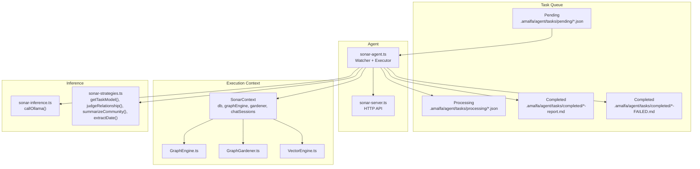

**Diagram sources**
- [sonar-agent.ts](file://src/daemon/sonar-agent.ts#L72-L179)
- [defaults.ts](file://src/config/defaults.ts#L33-L38)
- [sonar-server.ts](file://src/daemon/sonar-server.ts#L24-L133)
- [GraphEngine.ts](file://src/core/GraphEngine.ts#L39-L100)
- [GraphGardener.ts](file://src/core/GraphGardener.ts#L27-L32)
- [VectorEngine.ts](file://src/core/VectorEngine.ts#L76-L109)
- [sonar-inference.ts](file://src/daemon/sonar-inference.ts#L19-L119)
- [sonar-strategies.ts](file://src/daemon/sonar-strategies.ts#L10-L28)

**Section sources**
- [sonar-agent.ts](file://src/daemon/sonar-agent.ts#L72-L179)
- [defaults.ts](file://src/config/defaults.ts#L15-L59)

## Core Components
- Task queue directories: pending, processing, completed.
- Task watcher loop that loads the graph, processes pending tasks, and sleeps between cycles.
- Task executor that routes tasks to specialized handlers and writes markdown reports.
- HTTP API for health checks and interactive chat/search utilities.
- Inference engine supporting local Ollama and cloud providers (OpenRouter).
- Strategies for model selection, relationship judgment, community synthesis, and date extraction.
- Execution context composed of database, graph engine, gardener, and chat sessions.

**Section sources**
- [sonar-agent.ts](file://src/daemon/sonar-agent.ts#L106-L116)
- [sonar-server.ts](file://src/daemon/sonar-server.ts#L40-L53)
- [sonar-inference.ts](file://src/daemon/sonar-inference.ts#L19-L119)
- [sonar-strategies.ts](file://src/daemon/sonar-strategies.ts#L10-L28)
- [sonar-logic.ts](file://src/daemon/sonar-logic.ts#L19-L24)

## Architecture Overview
The Sonar Agent runs as a long-lived process that:
- Ensures task directories exist.
- Periodically reloads the in-memory graph from the database.
- Moves JSON task files from pending to processing, reads them, executes handlers, writes reports, and moves them to completed.
- Optionally sends desktop notifications upon completion.
- Exposes an HTTP API for health checks and interactive operations.

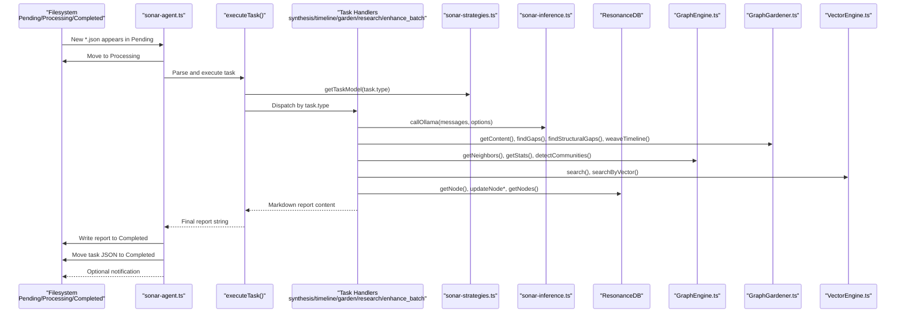

**Diagram sources**
- [sonar-agent.ts](file://src/daemon/sonar-agent.ts#L138-L179)
- [sonar-logic.ts](file://src/daemon/sonar-logic.ts#L323-L364)
- [sonar-logic.ts](file://src/daemon/sonar-logic.ts#L369-L392)
- [sonar-logic.ts](file://src/daemon/sonar-logic.ts#L397-L465)
- [sonar-logic.ts](file://src/daemon/sonar-logic.ts#L470-L664)
- [sonar-logic.ts](file://src/daemon/sonar-logic.ts#L69-L99)
- [sonar-strategies.ts](file://src/daemon/sonar-strategies.ts#L10-L28)
- [sonar-inference.ts](file://src/daemon/sonar-inference.ts#L19-L119)
- [GraphEngine.ts](file://src/core/GraphEngine.ts#L50-L100)
- [GraphGardener.ts](file://src/core/GraphGardener.ts#L27-L32)
- [VectorEngine.ts](file://src/core/VectorEngine.ts#L76-L109)

## Detailed Component Analysis

### Task Queue Management
- Pending directory: incoming tasks are JSON files awaiting processing.
- Processing directory: tasks currently being executed.
- Completed directory: task reports (*.md) and failed reports (*-FAILED.md).
- The agent ensures directories exist, renames files atomically between stages, and writes human-readable markdown reports.

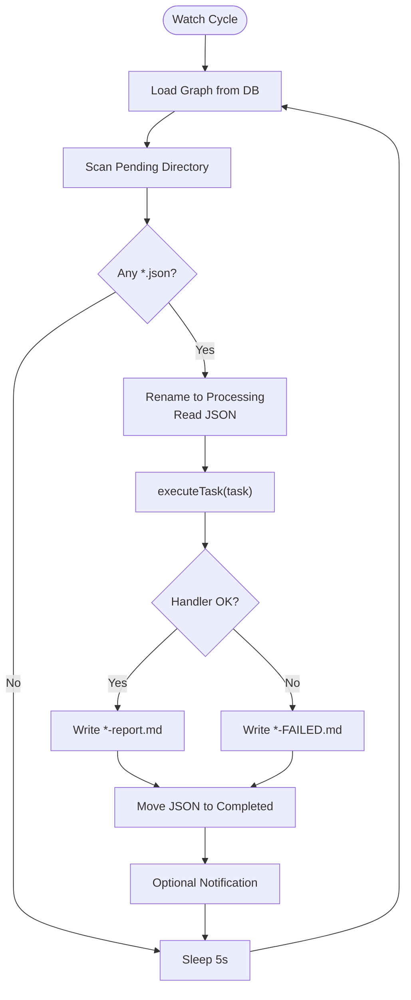

**Diagram sources**
- [sonar-agent.ts](file://src/daemon/sonar-agent.ts#L138-L179)

**Section sources**
- [sonar-agent.ts](file://src/daemon/sonar-agent.ts#L72-L79)
- [sonar-agent.ts](file://src/daemon/sonar-agent.ts#L138-L179)
- [defaults.ts](file://src/config/defaults.ts#L33-L38)

### Task Execution Pipeline
- Parsing: Read and parse the task JSON from the processing stage.
- Routing: Resolve the effective model using either task.model or getTaskModel(task.type).
- Context: Build SonarContext with database, graph engine, gardener, and chat sessions.
- Handler dispatch: Based on task.type, call the appropriate handler.
- Reporting: Aggregate markdown output and write a final report with timing and routing info.

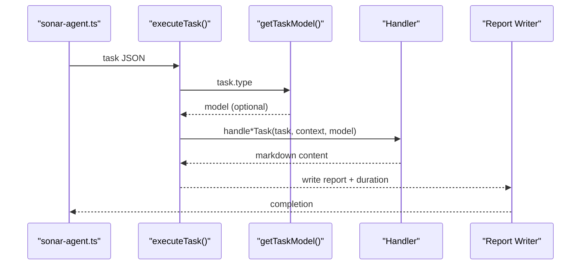

**Diagram sources**
- [sonar-agent.ts](file://src/daemon/sonar-agent.ts#L184-L217)
- [sonar-strategies.ts](file://src/daemon/sonar-strategies.ts#L10-L28)
- [sonar-logic.ts](file://src/daemon/sonar-logic.ts#L323-L364)

**Section sources**
- [sonar-agent.ts](file://src/daemon/sonar-agent.ts#L184-L217)
- [sonar-types.ts](file://src/daemon/sonar-types.ts#L16-L32)

### Task Type Handlers

#### Synthesis Handler
- Purpose: Summarize cohesive communities in the knowledge graph.
- Steps:
  - Analyze communities and filter by minimum size.
  - Select representative nodes by centrality.
  - Summarize each community using summarizeCommunity(strategy).
  - Optionally auto-create synthesis documents in docs/synthesis.
- Outputs: Markdown summary per community and optional file creation.

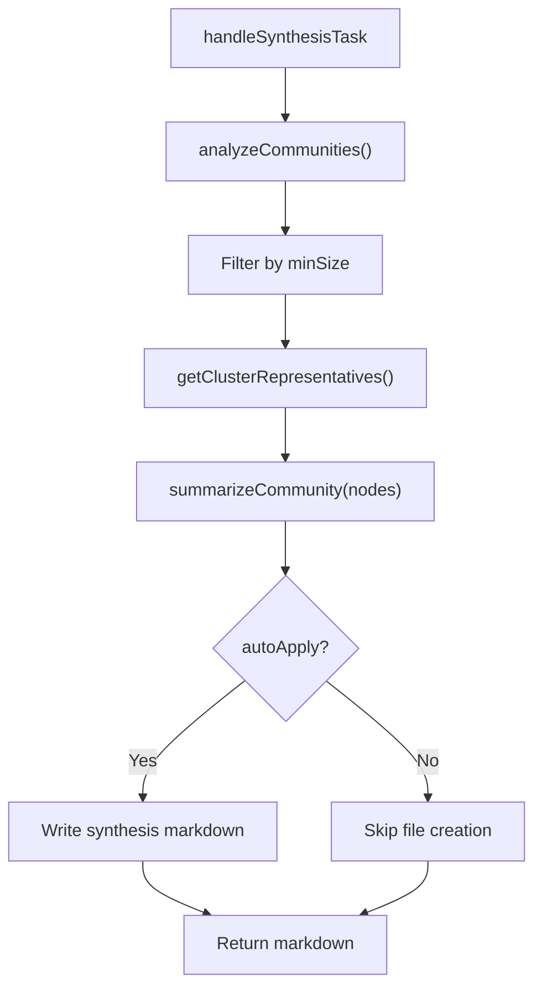

**Diagram sources**
- [sonar-logic.ts](file://src/daemon/sonar-logic.ts#L323-L364)
- [sonar-strategies.ts](file://src/daemon/sonar-strategies.ts#L86-L142)

**Section sources**
- [sonar-logic.ts](file://src/daemon/sonar-logic.ts#L323-L364)

#### Timeline Handler
- Purpose: Anchor nodes to temporal anchors by extracting dates.
- Steps:
  - Fetch nodes up to a configurable limit.
  - For each node without a date, extract a date using extractDate(strategy).
  - Optionally auto-apply by updating node date in the database.
- Outputs: Markdown listing updates and totals.

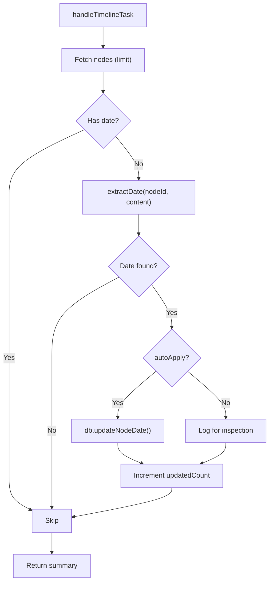

**Diagram sources**
- [sonar-logic.ts](file://src/daemon/sonar-logic.ts#L369-L392)
- [sonar-strategies.ts](file://src/daemon/sonar-strategies.ts#L144-L187)

**Section sources**
- [sonar-logic.ts](file://src/daemon/sonar-logic.ts#L369-L392)

#### Garden Handler
- Purpose: Discover and propose missing links using semantic and structural heuristics; also weave temporal sequences.
- Steps:
  - Find semantic gaps (vector similarity without graph links).
  - Find structural gaps (Adamic-Adar overlap without a link).
  - Judge relationships between candidate pairs using judgeRelationship(strategy).
  - Optionally auto-apply by injecting tags into source files.
  - Weave temporal sequences using existing dates.
- Outputs: Markdown detailing suggestions, judgments, and applied actions.

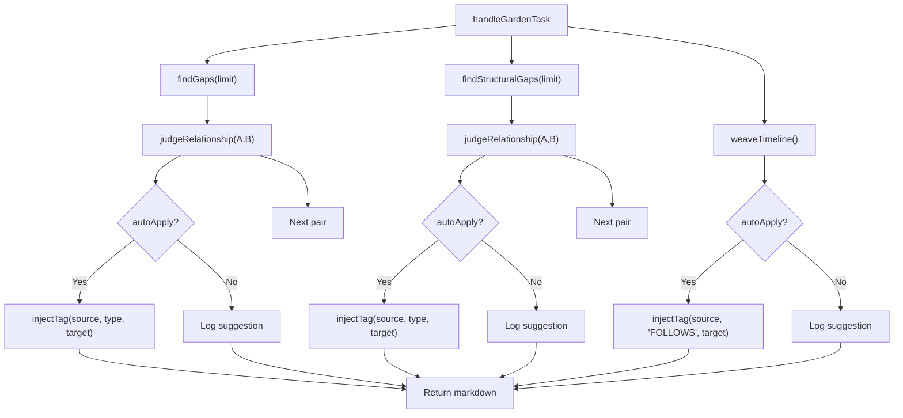

**Diagram sources**
- [sonar-logic.ts](file://src/daemon/sonar-logic.ts#L397-L465)
- [sonar-strategies.ts](file://src/daemon/sonar-strategies.ts#L30-L84)

**Section sources**
- [sonar-logic.ts](file://src/daemon/sonar-logic.ts#L397-L465)

#### Research Handler
- Purpose: Autonomous recursive discovery around a query using LLM decisions.
- Steps:
  - Identify structural hubs to seed exploration.
  - Iteratively decide between SEARCH, READ, EXPLORE, or FINISH.
  - For SEARCH: retrieve related nodes via vector search.
  - For READ: fetch and include content.
  - For EXPLORE: traverse graph neighbors.
  - Final verification via an auditor prompt to ensure completeness.
- Outputs: Markdown with steps, findings, and final conclusion.

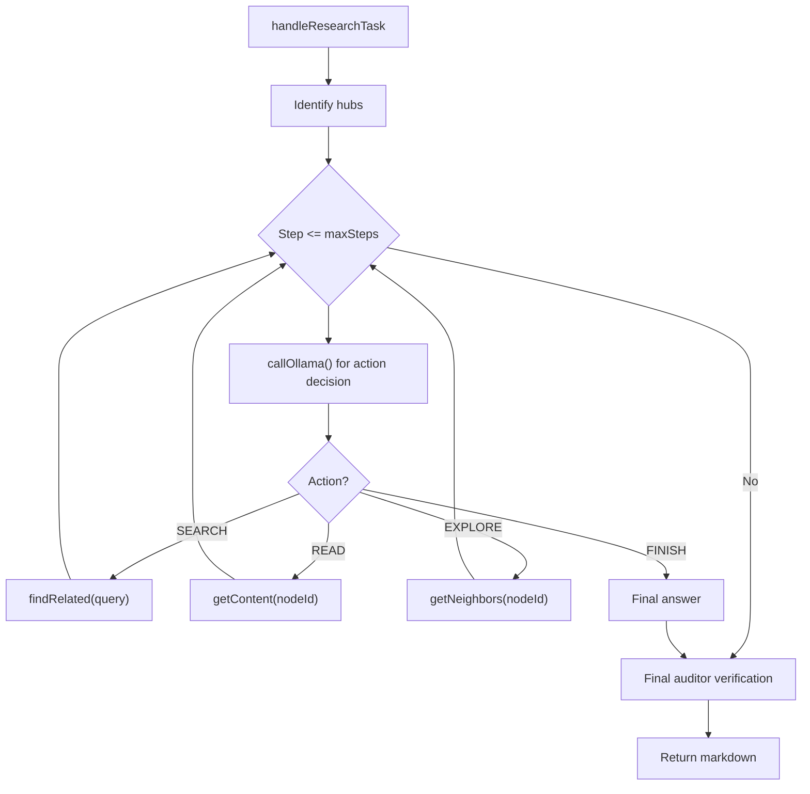

**Diagram sources**
- [sonar-logic.ts](file://src/daemon/sonar-logic.ts#L470-L664)

**Section sources**
- [sonar-logic.ts](file://src/daemon/sonar-logic.ts#L470-L664)

#### Batch Enhancement Handler
- Purpose: Enhance metadata for unprocessed documents in bulk.
- Steps:
  - Enumerate nodes and filter those not yet enhanced.
  - Take a bounded subset (limit) and process concurrently.
  - For each node, call handleMetadataEnhancement to extract keywords and summary.
- Outputs: Summary counts of successful, failed, and total enhancements.

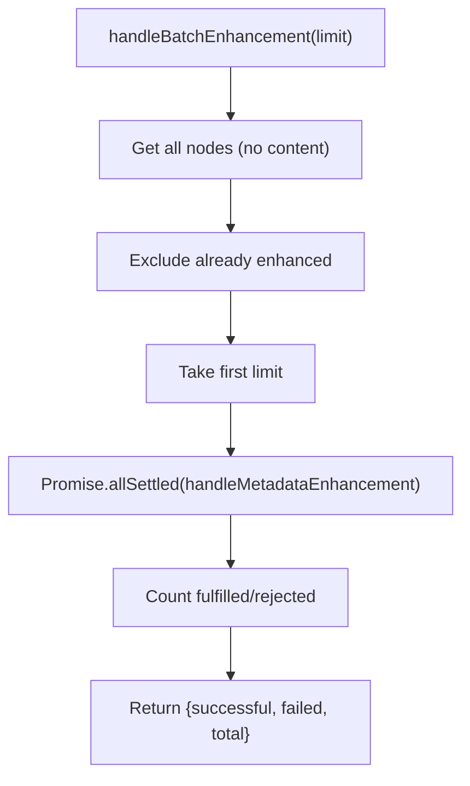

**Diagram sources**
- [sonar-logic.ts](file://src/daemon/sonar-logic.ts#L69-L99)
- [sonar-logic.ts](file://src/daemon/sonar-logic.ts#L29-L65)

**Section sources**
- [sonar-logic.ts](file://src/daemon/sonar-logic.ts#L69-L99)

### Task Routing Mechanism and Model Selection
- getTaskModel(taskType) selects a model based on configuration:
  - Cloud provider OpenRouter with free model aliases for supported task types.
  - Falls back to undefined when cloud is not configured or provider differs.
- callOllama resolves the effective model prioritizing:
  - options.model override
  - cloud.model (when cloud enabled)
  - discovered local model
  - config.sonar.model
  - default fallback
- Free-tier throttling: small delays are inserted when using specific free model identifiers.

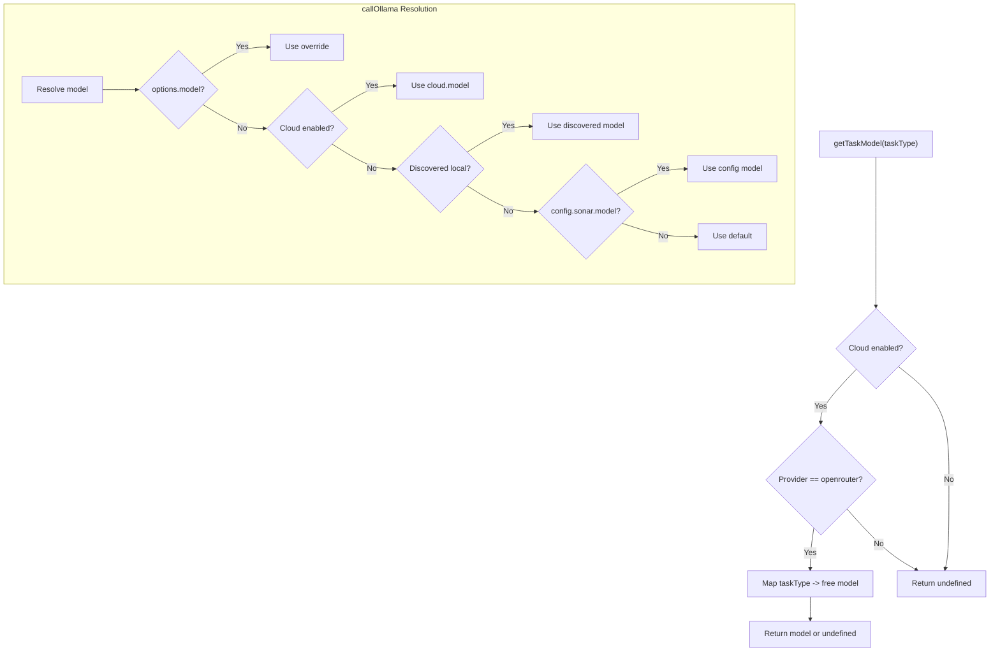

**Diagram sources**
- [sonar-strategies.ts](file://src/daemon/sonar-strategies.ts#L10-L28)
- [sonar-inference.ts](file://src/daemon/sonar-inference.ts#L31-L38)

**Section sources**
- [sonar-strategies.ts](file://src/daemon/sonar-strategies.ts#L10-L28)
- [sonar-inference.ts](file://src/daemon/sonar-inference.ts#L31-L38)

### Execution Context Management
- SonarContext bundles:
  - ResonanceDB: node queries and updates.
  - GraphEngine: graph traversal and analytics.
  - GraphGardener: gap detection, clustering, and timeline weaving.
  - Chat sessions: persistent conversational state for chat tasks.
- Context is passed to handlers and strategies to enable coherent orchestration.

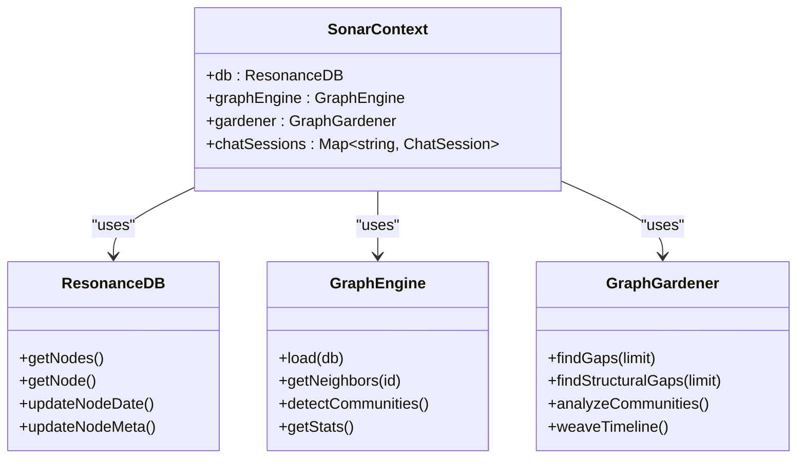

**Diagram sources**
- [sonar-logic.ts](file://src/daemon/sonar-logic.ts#L19-L24)
- [GraphEngine.ts](file://src/core/GraphEngine.ts#L39-L100)
- [GraphGardener.ts](file://src/core/GraphGardener.ts#L27-L32)

**Section sources**
- [sonar-logic.ts](file://src/daemon/sonar-logic.ts#L19-L24)

### Error Handling, Retry, and Failure Reporting
- Filesystem-level:
  - Atomic rename between pending/processing/completed.
  - On handler error, write a markdown failure report and move the task JSON to completed.
- Runtime-level:
  - Handlers wrap inference calls and internal logic with try/catch.
  - Inference failures are logged with endpoint/model details and rethrown.
  - JSON parsing helpers attempt to recover from markdown-wrapped JSON.
- No automatic retry loop is implemented in the agent; failures are reported and left for external monitoring or manual intervention.

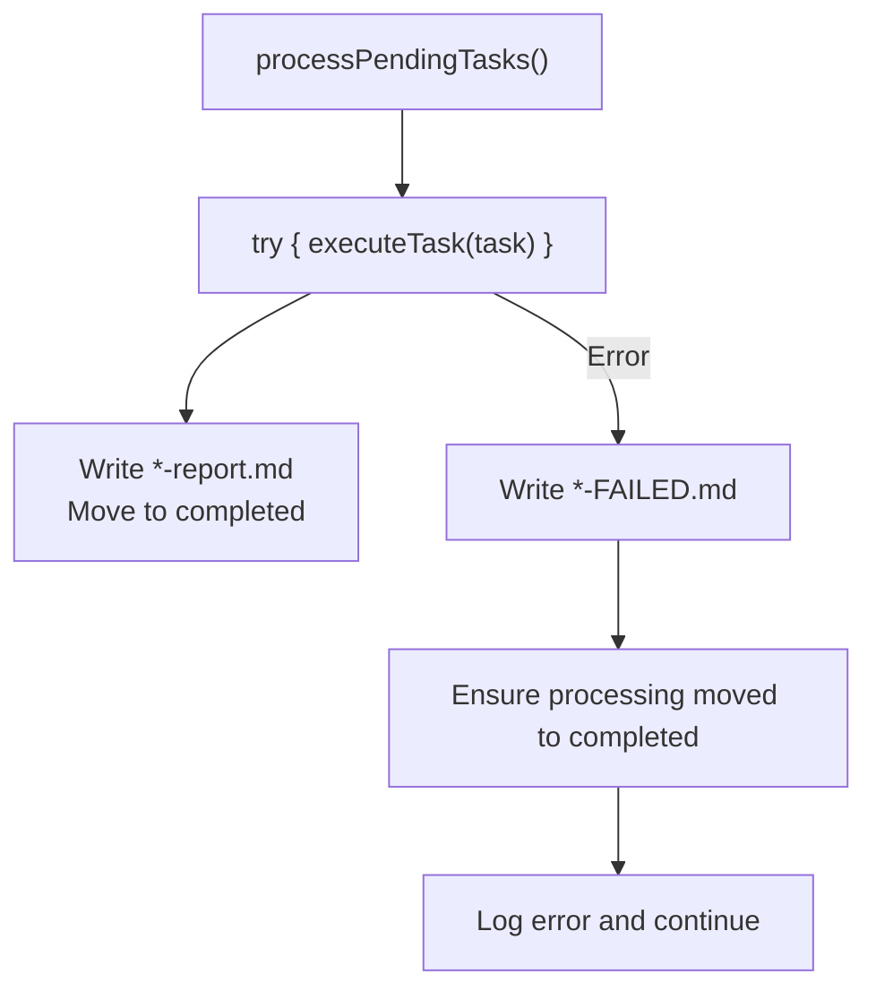

**Diagram sources**
- [sonar-agent.ts](file://src/daemon/sonar-agent.ts#L167-L178)

**Section sources**
- [sonar-agent.ts](file://src/daemon/sonar-agent.ts#L167-L178)
- [sonar-logic.ts](file://src/daemon/sonar-logic.ts#L669-L684)
- [sonar-inference.ts](file://src/daemon/sonar-inference.ts#L114-L118)

### Task Lifecycle and Status Tracking
- Creation: Place a task JSON in the pending directory.
- Status: Processing (in processing), Completed (with report), or Failed (with failure report).
- Completion: Reports include routing info, timestamps, and duration.
- Notifications: Optional desktop notifications are sent after completion.

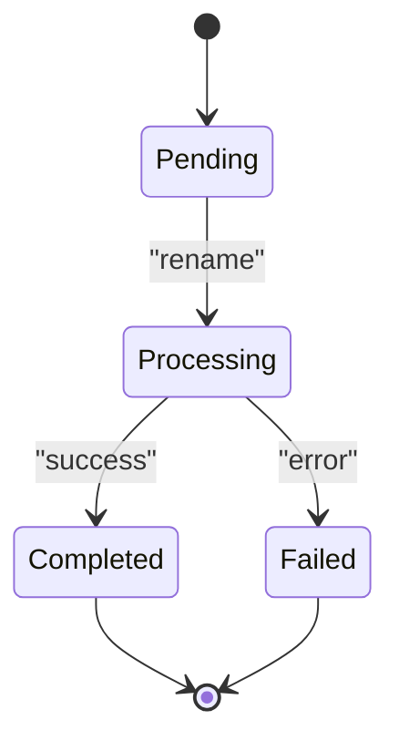

**Diagram sources**
- [sonar-agent.ts](file://src/daemon/sonar-agent.ts#L138-L179)

**Section sources**
- [sonar-agent.ts](file://src/daemon/sonar-agent.ts#L107-L115)
- [sonar-agent.ts](file://src/daemon/sonar-agent.ts#L164-L166)

## Dependency Analysis
- sonar-agent.ts depends on:
  - defaults.ts for directory paths.
  - sonar-logic.ts for handlers and strategies.
  - sonar-inference.ts for model calls.
  - sonar-server.ts for the HTTP API.
  - Core components (GraphEngine, GraphGardener, VectorEngine) via context.
- sonar-logic.ts depends on:
  - sonar-strategies.ts for model selection and strategies.
  - sonar-inference.ts for LLM calls.
  - Core components for graph and vector operations.
- sonar-strategies.ts depends on:
  - sonar-inference.ts for LLM calls.
  - config defaults for cloud/provider settings.
- sonar-inference.ts depends on:
  - config defaults for host/model/cloud settings.
  - environment variables for cloud keys.

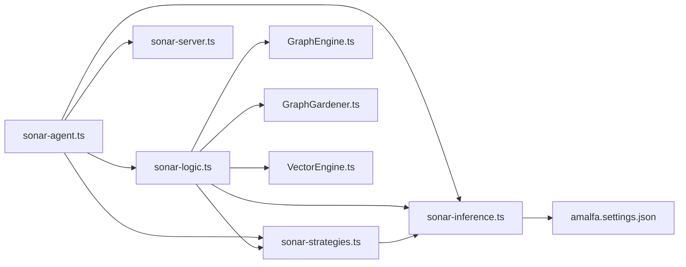

**Diagram sources**
- [sonar-agent.ts](file://src/daemon/sonar-agent.ts#L12-L34)
- [sonar-logic.ts](file://src/daemon/sonar-logic.ts#L1-L16)
- [sonar-strategies.ts](file://src/daemon/sonar-strategies.ts#L1-L5)
- [sonar-inference.ts](file://src/daemon/sonar-inference.ts#L1-L5)
- [amalfa.settings.json](file://amalfa.settings.json#L48-L81)

**Section sources**
- [sonar-agent.ts](file://src/daemon/sonar-agent.ts#L12-L34)
- [sonar-logic.ts](file://src/daemon/sonar-logic.ts#L1-L16)
- [sonar-strategies.ts](file://src/daemon/sonar-strategies.ts#L1-L5)
- [sonar-inference.ts](file://src/daemon/sonar-inference.ts#L1-L5)
- [amalfa.settings.json](file://amalfa.settings.json#L48-L81)

## Performance Considerations
- Graph loading: The agent reloads the in-memory graph before each watch cycle to reflect recent database changes.
- Vector search: FAFCAS protocol uses unit vectors and dot products for fast similarity scoring; hydration is limited to top-K results.
- Concurrency: Batch enhancement uses concurrent processing with settled promises to maximize throughput.
- Throttling: Free-tier model usage includes short delays to respect rate limits.
- Disk I/O: Reports are written as markdown files; ensure storage performance is adequate for high task volumes.

[No sources needed since this section provides general guidance]

## Troubleshooting Guide
- Missing configuration:
  - Ensure amalfa.settings.json exists and is valid; otherwise the agent exits early.
- Inference connectivity:
  - If local Ollama is unreachable and cloud is disabled, the agent operates in a limited mode.
  - Verify OPENROUTER_API_KEY or cloud config when using cloud providers.
- Task stuck in processing:
  - Confirm the handler completes; failures are moved to completed with a failure report.
- Reports not generated:
  - Check permissions for writing to the completed directory and that the agent has sufficient privileges.
- Health endpoint:
  - Use the /health endpoint to verify provider and model availability.

**Section sources**
- [defaults.ts](file://src/config/defaults.ts#L84-L139)
- [sonar-inference.ts](file://src/daemon/sonar-inference.ts#L23-L54)
- [sonar-agent.ts](file://src/daemon/sonar-agent.ts#L167-L178)
- [sonar-server.ts](file://src/daemon/sonar-server.ts#L40-L53)

## Conclusion
The Sonar Agent provides a robust, filesystem-backed task processing system with clear separation of concerns. Tasks are reliably routed, executed with contextual awareness, and reported in a structured manner. The design supports both local and cloud inference, offers extensible strategies, and integrates seamlessly with the knowledge graph for intelligent discovery and enrichment.