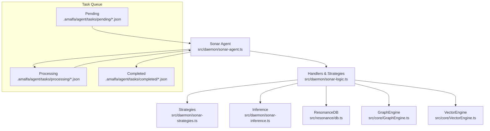
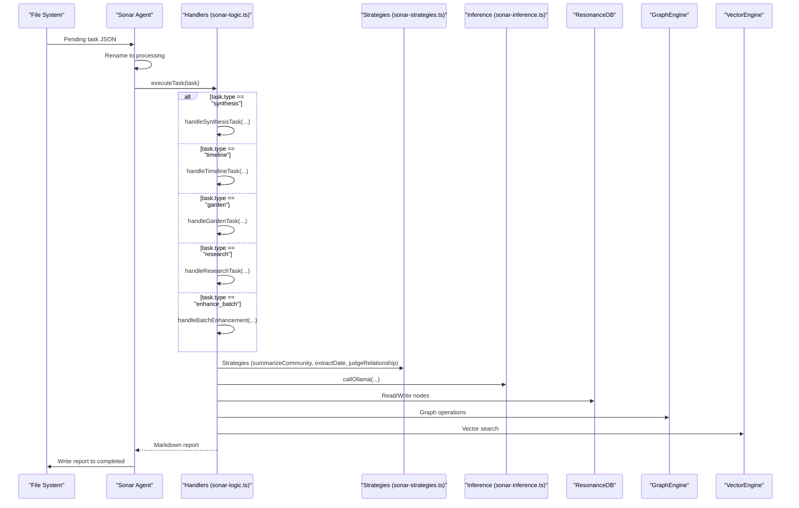
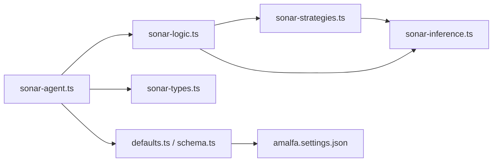

# Task Types and Handlers

<cite>
**Referenced Files in This Document**
- [sonar-agent.ts](file://src/daemon/sonar-agent.ts)
- [sonar-logic.ts](file://src/daemon/sonar-logic.ts)
- [sonar-types.ts](file://src/daemon/sonar-types.ts)
- [sonar-strategies.ts](file://src/daemon/sonar-strategies.ts)
- [sonar-server.ts](file://src/daemon/sonar-server.ts)
- [sonar-inference.ts](file://src/daemon/sonar-inference.ts)
- [defaults.ts](file://src/config/defaults.ts)
- [schema.ts](file://src/config/schema.ts)
- [amalfa.settings.json](file://amalfa.settings.json)
</cite>

## Table of Contents
1. [Introduction](#introduction)
2. [Project Structure](#project-structure)
3. [Core Components](#core-components)
4. [Architecture Overview](#architecture-overview)
5. [Detailed Component Analysis](#detailed-component-analysis)
6. [Dependency Analysis](#dependency-analysis)
7. [Performance Considerations](#performance-considerations)
8. [Troubleshooting Guide](#troubleshooting-guide)
9. [Conclusion](#conclusion)
10. [Appendices](#appendices)

## Introduction
This document explains the Sonar Agent’s task type system and the individual handlers that implement each task. It focuses on five task types:
- synthesis (phase 2)
- timeline (phase 3)
- garden (phase 1 & 4)
- research (phase 5)
- enhance_batch

It also documents the related handler functions:
- handleSynthesisTask
- handleTimelineTask
- handleGardenTask
- handleResearchTask
- handleBatchEnhancement
- handleMetadataEnhancement

For each handler, we describe execution parameters, input validation, output formatting, and provide examples of task configurations, execution contexts, and result processing.

## Project Structure
The Sonar Agent orchestrates tasks via a file-based queue under .amalfa/agent/tasks/{pending,processing,completed}. Tasks are represented as JSON files and processed by the agent’s main loop. Each task type is dispatched to a dedicated handler in the logic module, which interacts with the graph engine, vector engine, and database.

**Diagram sources**
- [sonar-agent.ts](file://src/daemon/sonar-agent.ts#L138-L179)
- [sonar-logic.ts](file://src/daemon/sonar-logic.ts#L1-L685)
- [sonar-strategies.ts](file://src/daemon/sonar-strategies.ts#L1-L187)
- [sonar-inference.ts](file://src/daemon/sonar-inference.ts#L1-L120)

**Section sources**
- [sonar-agent.ts](file://src/daemon/sonar-agent.ts#L138-L179)
- [defaults.ts](file://src/config/defaults.ts#L15-L59)

## Core Components
- Task routing and execution: The agent reads pending tasks, renames them to processing, parses JSON, and dispatches to the appropriate handler. It writes a markdown report to the completed folder and optionally notifies the user.
- Handler functions: Each handler encapsulates a specific workflow (e.g., synthesis, timeline, garden, research, batch enhancement) and returns a formatted markdown report string.
- Strategies and inference: Handlers rely on strategies (e.g., summarizeCommunity, extractDate, judgeRelationship) and inference via callOllama to interact with local or cloud LLM providers.
- Context: Handlers receive a shared SonarContext containing database, graph engine, gardener, and chat sessions.

**Section sources**
- [sonar-agent.ts](file://src/daemon/sonar-agent.ts#L184-L217)
- [sonar-logic.ts](file://src/daemon/sonar-logic.ts#L19-L24)
- [sonar-strategies.ts](file://src/daemon/sonar-strategies.ts#L10-L28)
- [sonar-inference.ts](file://src/daemon/sonar-inference.ts#L19-L119)

## Architecture Overview
The task execution pipeline connects the agent’s main loop to handlers, strategies, and inference. The diagram below maps the actual code paths for task dispatch and handler execution.

**Diagram sources**
- [sonar-agent.ts](file://src/daemon/sonar-agent.ts#L184-L217)
- [sonar-logic.ts](file://src/daemon/sonar-logic.ts#L323-L364)
- [sonar-logic.ts](file://src/daemon/sonar-logic.ts#L369-L392)
- [sonar-logic.ts](file://src/daemon/sonar-logic.ts#L397-L465)
- [sonar-logic.ts](file://src/daemon/sonar-logic.ts#L469-L664)
- [sonar-logic.ts](file://src/daemon/sonar-logic.ts#L69-L99)
- [sonar-strategies.ts](file://src/daemon/sonar-strategies.ts#L90-L142)
- [sonar-strategies.ts](file://src/daemon/sonar-strategies.ts#L148-L186)
- [sonar-strategies.ts](file://src/daemon/sonar-strategies.ts#L34-L84)
- [sonar-inference.ts](file://src/daemon/sonar-inference.ts#L19-L119)

## Detailed Component Analysis

### Task Type: synthesis (phase 2)
Purpose: Detect communities in the knowledge graph and generate synthesis summaries for clusters exceeding a minimum size. Optionally auto-create synthesis markdown nodes.

Handler: handleSynthesisTask(task, context, taskModel)

Execution parameters
- minSize: Minimum number of nodes in a community to consider (default 5)
- autoApply: When true, write synthesized markdown files to docs/synthesis/

Input validation
- Filters communities by node count (>= minSize)
- Skips clusters where content retrieval fails

Output formatting
- For each valid cluster: prints label, member count, and summary
- If autoApply is true: writes a markdown file with frontmatter and includes cluster members as wiki-links

Examples
- Configuration example: {"type":"synthesis","minSize":5,"autoApply":true}
- Execution context: Uses GraphGardener.analyzeCommunities and summarizeCommunity

Result processing
- Returns a markdown-formatted report string summarizing each cluster and actions taken

**Section sources**
- [sonar-logic.ts](file://src/daemon/sonar-logic.ts#L323-L364)
- [sonar-strategies.ts](file://src/daemon/sonar-strategies.ts#L90-L142)

### Task Type: timeline (phase 3)
Purpose: Anchor documents to dates by extracting temporal anchors when missing. Supports auto-application to update node metadata.

Handler: handleTimelineTask(task, context, taskModel)

Execution parameters
- limit: Maximum number of nodes to process (default 50)
- autoApply: When true, update node date fields

Input validation
- Skips nodes that already have a date
- Requires content retrieval for each node

Output formatting
- Lists each processed node with either “✅” (auto-applied) or “🔍” (discovered)
- Includes a total count of updated nodes

Examples
- Configuration example: {"type":"timeline","limit":50,"autoApply":true}
- Execution context: Uses extractDate strategy to infer dates

Result processing
- Returns a markdown-formatted report string with per-node outcomes and totals

**Section sources**
- [sonar-logic.ts](file://src/daemon/sonar-logic.ts#L369-L392)
- [sonar-strategies.ts](file://src/daemon/sonar-strategies.ts#L148-L186)

### Task Type: garden (phase 1 & 4)
Purpose: Discover and propose graph links and temporal sequences. Uses semantic similarity, structural gaps (Adamic-Adar), and timeline weaving. Supports auto-application to inject tags into source files.

Handler: handleGardenTask(task, context, taskModel)

Execution parameters
- limit: Number of suggestions to evaluate (default 5)
- autoApply: When true, inject tags into source files

Input validation
- Retrieves content for both sides of each suggested link
- Skips suggestions where content is unavailable

Output formatting
- Sections for Semantic Gaps (vector), Structural Gaps (Adamic-Adar), and Temporal Sequence
- For each suggestion: prints relationship judgment and reason, with optional auto-application markers

Examples
- Configuration example: {"type":"garden","limit":5,"autoApply":true}
- Execution context: Uses judgeRelationship for both semantic and structural suggestions; weaveTimeline for temporal ordering

Result processing
- Returns a markdown-formatted report string with per-suggestion decisions and actions

**Section sources**
- [sonar-logic.ts](file://src/daemon/sonar-logic.ts#L397-L465)
- [sonar-strategies.ts](file://src/daemon/sonar-strategies.ts#L34-L84)

### Task Type: research (phase 5)
Purpose: Autonomous recursive discovery around a query. Iteratively decides whether to search, read, explore, or finish, then verifies the final conclusion.

Handler: handleResearchTask(task, context, taskModel)

Execution parameters
- query: Required. The research question or topic
- autoApply: Not applicable for research; decisions are logged
- Additional internal steps: maxSteps=5, hub identification, narrative mode detection

Input validation
- Requires task.query; otherwise returns an error message
- Parses JSON decisions from the LLM; falls back gracefully on parsing failure

Output formatting
- Step-by-step reasoning and actions
- Final conclusion and chain verification
- Auditing note indicating completeness and missing information

Examples
- Configuration example: {"type":"research","query":"How did the ingestion pipeline evolve?"}
- Execution context: Uses vector search, neighbor exploration, and content reading guided by the LLM

Result processing
- Returns a comprehensive markdown-formatted report with findings, reasoning, and final answer

**Section sources**
- [sonar-logic.ts](file://src/daemon/sonar-logic.ts#L469-L664)

### Task Type: enhance_batch
Purpose: Batch-enhance metadata for unprocessed documents by extracting keywords and summary.

Handler: handleBatchEnhancement(limit, context)

Execution parameters
- limit: Maximum number of documents to process in a single batch

Input validation
- Selects nodes that lack sonar_enhanced and phi3_enhanced flags
- Processes up to limit documents

Output formatting
- Returns a structured result: {successful, failed, total}

Examples
- Configuration example: {"type":"enhance_batch","limit":10}
- Execution context: Calls handleMetadataEnhancement for each selected document

Result processing
- Aggregates results and returns counts suitable for reporting

**Section sources**
- [sonar-logic.ts](file://src/daemon/sonar-logic.ts#L69-L99)

### Supporting Handler: handleMetadataEnhancement
Purpose: Enhance a single document’s metadata by extracting keywords and summary.

Handler: handleMetadataEnhancement(nodeId, context)

Execution parameters
- nodeId: Target document identifier

Input validation
- Requires node existence and retrievable content
- Skips if inference is unavailable

Output formatting
- Updates node metadata with keywords, summary, enhancement flags, and timestamps

Examples
- API endpoint: POST /metadata/enhance with {docId}
- Execution context: Uses callOllama with JSON format

Result processing
- Persists metadata updates to the database

**Section sources**
- [sonar-logic.ts](file://src/daemon/sonar-logic.ts#L29-L65)
- [sonar-server.ts](file://src/daemon/sonar-server.ts#L72-L81)

## Dependency Analysis
The handlers depend on shared components and strategies. The diagram below shows the key dependencies among modules.

**Diagram sources**
- [sonar-agent.ts](file://src/daemon/sonar-agent.ts#L25-L34)
- [sonar-logic.ts](file://src/daemon/sonar-logic.ts#L1-L17)
- [sonar-types.ts](file://src/daemon/sonar-types.ts#L16-L32)
- [sonar-strategies.ts](file://src/daemon/sonar-strategies.ts#L1-L5)
- [sonar-inference.ts](file://src/daemon/sonar-inference.ts#L1-L5)
- [defaults.ts](file://src/config/defaults.ts#L15-L59)
- [schema.ts](file://src/config/schema.ts#L54-L88)
- [amalfa.settings.json](file://amalfa.settings.json#L48-L81)

**Section sources**
- [sonar-agent.ts](file://src/daemon/sonar-agent.ts#L25-L34)
- [sonar-logic.ts](file://src/daemon/sonar-logic.ts#L1-L17)
- [sonar-strategies.ts](file://src/daemon/sonar-strategies.ts#L1-L5)
- [sonar-inference.ts](file://src/daemon/sonar-inference.ts#L1-L5)
- [defaults.ts](file://src/config/defaults.ts#L15-L59)
- [schema.ts](file://src/config/schema.ts#L54-L88)
- [amalfa.settings.json](file://amalfa.settings.json#L48-L81)

## Performance Considerations
- Concurrency: Batch enhancement uses Promise.allSettled to parallelize metadata extraction, improving throughput.
- Throttling: Free-tier cloud models (e.g., “:free”) introduce short delays between judgments to respect rate limits.
- I/O: File system operations (rename, read/write) dominate latency; ensure adequate disk performance.
- Vector and graph operations: Limit parameters (e.g., limit in timeline, limit in garden) cap workload; tune based on dataset size.
- Inference cost: Cloud providers incur usage fees; configure OPENROUTER_API_KEY and model selection appropriately.

[No sources needed since this section provides general guidance]

## Troubleshooting Guide
Common issues and resolutions
- Inference unavailable: If Ollama is unreachable and cloud is disabled, handlers may skip or fail. Verify configuration and network connectivity.
- Missing API key: When cloud is enabled without a key, requests are logged with warnings. Set OPENROUTER_API_KEY or disable cloud.
- Parsing failures: JSON parsing for structured outputs is guarded; handlers fall back to safe defaults or return warnings.
- Task queue errors: If a task fails, the agent writes a FAILED report and moves the file to completed. Inspect the report for details.

**Section sources**
- [sonar-inference.ts](file://src/daemon/sonar-inference.ts#L44-L54)
- [sonar-logic.ts](file://src/daemon/sonar-logic.ts#L669-L684)
- [sonar-agent.ts](file://src/daemon/sonar-agent.ts#L167-L178)

## Conclusion
The Sonar Agent’s task system provides a modular, extensible framework for knowledge graph augmentation and autonomous research. Each handler encapsulates a distinct workflow, leveraging strategies and inference to deliver actionable insights. By configuring tasks and models appropriately, teams can automate synthesis, timeline anchoring, graph gardening, research, and metadata enhancement.

[No sources needed since this section summarizes without analyzing specific files]

## Appendices

### Task Configuration Examples
- synthesis: {"type":"synthesis","minSize":5,"autoApply":true}
- timeline: {"type":"timeline","limit":50,"autoApply":true}
- garden: {"type":"garden","limit":5,"autoApply":true}
- research: {"type":"research","query":"Describe the ingestion pipeline"}
- enhance_batch: {"type":"enhance_batch","limit":10}

**Section sources**
- [sonar-logic.ts](file://src/daemon/sonar-logic.ts#L323-L364)
- [sonar-logic.ts](file://src/daemon/sonar-logic.ts#L369-L392)
- [sonar-logic.ts](file://src/daemon/sonar-logic.ts#L397-L465)
- [sonar-logic.ts](file://src/daemon/sonar-logic.ts#L469-L664)
- [sonar-logic.ts](file://src/daemon/sonar-logic.ts#L69-L99)

### Execution Context and Parameters
- SonarContext includes ResonanceDB, GraphEngine, GraphGardener, and chat sessions.
- Task-level overrides: model, notify, sessionId, message, query, limit, minSize, autoApply.
- Model routing: getTaskModel selects provider-specific models when cloud is enabled.

**Section sources**
- [sonar-logic.ts](file://src/daemon/sonar-logic.ts#L19-L24)
- [sonar-types.ts](file://src/daemon/sonar-types.ts#L16-L32)
- [sonar-strategies.ts](file://src/daemon/sonar-strategies.ts#L10-L28)

### Output Formatting
- All handlers return markdown-formatted strings suitable for saving as .md reports.
- Reports include headers, timestamps, durations, and structured sections per task.

**Section sources**
- [sonar-agent.ts](file://src/daemon/sonar-agent.ts#L184-L217)